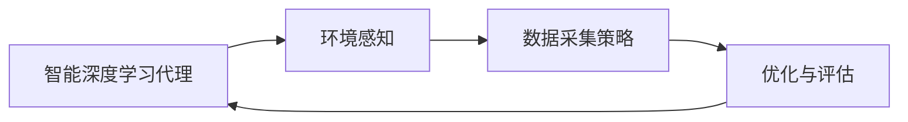
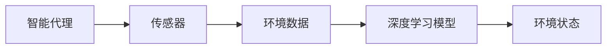
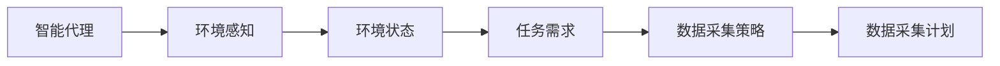
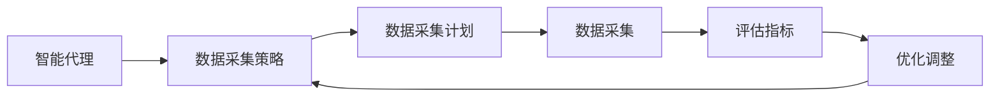
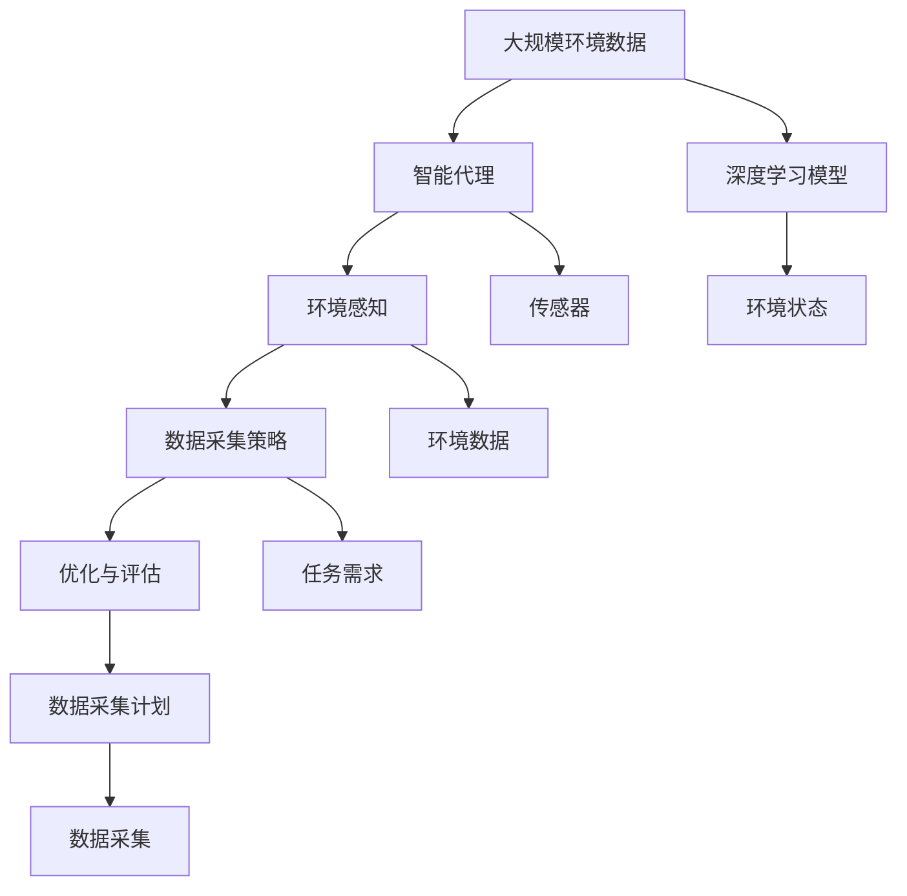

                 

# AI人工智能深度学习算法：智能深度学习代理的环境感知与数据采集机制

> 关键词：人工智能,深度学习,智能代理,环境感知,数据采集机制

## 1. 背景介绍

### 1.1 问题由来
在过去几十年中，人工智能（AI）和深度学习（DL）技术已经取得了令人瞩目的进展，特别是在计算机视觉、自然语言处理等领域。智能深度学习代理（Intelligent Deep Learning Agents）作为AI研究的重要方向，能够在复杂环境中执行复杂任务，并且具备自主学习和适应新环境的能力。然而，环境感知与数据采集作为智能代理的关键组件，对其性能和可靠性有着重要影响。

### 1.2 问题核心关键点
智能代理的环境感知与数据采集机制主要涉及以下几个核心问题：
- **环境建模**：如何准确感知和理解复杂环境？
- **数据采集策略**：在有限资源和时间的约束下，如何高效地采集有用数据？
- **优化与评估**：如何评估数据采集策略的效果并进行优化？

### 1.3 问题研究意义
研究智能代理的环境感知与数据采集机制，对于提高智能代理的适应性和自主学习能力，优化资源配置，提高数据利用效率具有重要意义。具体表现在：
- 降低智能代理的感知和数据采集成本，提升其效率和效果。
- 增强智能代理对新环境的适应能力，提高其决策的准确性和鲁棒性。
- 改善智能代理的学习过程，提高其算法的优化性能。

## 2. 核心概念与联系

### 2.1 核心概念概述

为更好地理解智能深度学习代理的环境感知与数据采集机制，本节将介绍几个密切相关的核心概念：

- **智能深度学习代理**：能够在复杂环境中执行复杂任务，通过深度学习模型进行自主学习和决策的人工智能系统。
- **环境感知**：智能代理通过传感器、摄像头、雷达等设备获取环境信息，并使用深度学习模型进行数据处理和分析，以理解和描述环境状态。
- **数据采集策略**：智能代理根据环境变化和任务需求，制定合理的数据采集计划，动态调整采集方式和频率。
- **优化与评估**：使用评估指标和方法，对数据采集策略进行效果评估，并进行相应的优化调整。

这些核心概念之间的逻辑关系可以通过以下Mermaid流程图来展示：



这个流程图展示了两者的核心概念及其关系：

1. 智能代理通过环境感知获取环境信息。
2. 制定数据采集策略，决定如何高效采集数据。
3. 使用优化与评估机制，调整策略，提高效果。

### 2.2 概念间的关系

这些核心概念之间存在着紧密的联系，形成了智能代理的环境感知与数据采集机制的完整生态系统。下面我们通过几个Mermaid流程图来展示这些概念之间的关系。

#### 2.2.1 智能代理的环境感知



这个流程图展示了智能代理的环境感知过程：
1. 智能代理通过传感器获取环境数据。
2. 将数据输入深度学习模型进行处理。
3. 模型输出环境状态的表示。

#### 2.2.2 数据采集策略与环境感知的关系



这个流程图展示了数据采集策略与环境感知的关系：
1. 智能代理通过环境感知获取环境状态。
2. 根据任务需求，制定数据采集策略。
3. 生成具体的数据采集计划。

#### 2.2.3 优化与评估的过程



这个流程图展示了优化与评估的过程：
1. 智能代理根据数据采集策略，执行数据采集计划。
2. 使用评估指标对数据采集效果进行评估。
3. 根据评估结果进行优化调整。

### 2.3 核心概念的整体架构

最后，我们用一个综合的流程图来展示这些核心概念在大规模智能代理环境感知与数据采集机制中的整体架构：



这个综合流程图展示了从环境数据采集、环境感知、数据采集策略制定、优化与评估等各环节，共同构成了大规模智能代理的环境感知与数据采集机制。通过这些流程图，我们可以更清晰地理解各环节之间的逻辑关系和信息流动，为后续深入讨论具体的算法和技术奠定基础。

## 3. 核心算法原理 & 具体操作步骤
### 3.1 算法原理概述

智能代理的环境感知与数据采集机制基于监督学习和强化学习算法，通过多传感器数据融合和深度学习模型的结合，实现环境状态的理解和优化数据采集。

形式化地，假设智能代理的环境感知模型为 $M_{\theta}$，其中 $\theta$ 为模型参数。给定环境数据集 $D=\{(x_i,y_i)\}_{i=1}^N$，其中 $x_i$ 为传感器数据，$y_i$ 为环境状态。智能代理的数据采集策略为 $S$，任务需求为 $T$。智能代理的优化与评估模型为 $O$，其优化目标是最大化任务效果。

智能代理的环境感知与数据采集过程可以形式化为：
$$
\max_{\theta, S} \mathcal{L}(M_{\theta}, S, T) = \max_{\theta, S} \sum_{i=1}^N \mathcal{L}(M_{\theta}(x_i), y_i)
$$

其中 $\mathcal{L}$ 为任务效果评估指标，通常包括准确率、召回率、F1分数等。

### 3.2 算法步骤详解

智能代理的环境感知与数据采集机制通常包括以下几个关键步骤：

**Step 1: 环境感知模型的构建与训练**
- 选择或设计环境感知模型，如卷积神经网络（CNN）、循环神经网络（RNN）或Transformer等。
- 准备环境数据集，包括传感器数据和标注环境状态。
- 使用监督学习方法，如反向传播算法，训练环境感知模型 $M_{\theta}$。

**Step 2: 数据采集策略的制定**
- 根据任务需求和资源约束，设计数据采集策略 $S$。
- 确定数据采集的具体方式，如时间间隔、传感器选择、采样频率等。

**Step 3: 数据采集与环境感知**
- 按照数据采集策略 $S$，使用传感器收集环境数据。
- 将环境数据输入环境感知模型 $M_{\theta}$，输出环境状态 $L$。

**Step 4: 数据采集效果的优化与评估**
- 定义评估指标，如精度、召回率、F1分数等，评估数据采集策略的效果。
- 根据评估结果，使用强化学习等方法优化数据采集策略 $S$。

**Step 5: 结果输出与应用**
- 根据优化后的数据采集策略 $S$，重新执行数据采集过程。
- 将优化后的环境感知模型 $M_{\theta}$ 应用于智能代理的决策过程中。

### 3.3 算法优缺点

智能代理的环境感知与数据采集机制具有以下优点：
- **高效性**：通过优化算法，智能代理可以高效地采集有用数据，提升决策的准确性。
- **适应性**：能够根据环境变化和任务需求，动态调整数据采集策略。
- **鲁棒性**：使用深度学习模型处理环境数据，增强了系统对噪声和异常值的鲁棒性。

同时，该机制也存在以下局限性：
- **计算资源需求高**：环境感知和数据采集模型的训练需要大量的计算资源。
- **模型复杂度高**：深度学习模型在环境感知和数据采集过程中，可能存在过拟合问题。
- **数据标注难度大**：高质量的环境数据和环境状态标注需要大量时间和人力。

尽管存在这些局限性，但就目前而言，基于深度学习的环境感知与数据采集机制仍是智能代理研究的主流范式。未来相关研究的重点在于如何进一步降低计算和标注成本，提高模型的可解释性和鲁棒性。

### 3.4 算法应用领域

基于深度学习的智能代理环境感知与数据采集机制已经在诸多领域得到应用，例如：

- **智能机器人**：用于环境感知、路径规划和任务执行，如扫地机器人、无人驾驶汽车等。
- **医疗诊断**：用于医学影像分析、患者监护和健康监测，如智能病床、远程医疗等。
- **自动驾驶**：用于感知道路环境、交通信号和行人，如自动驾驶汽车、无人机等。
- **智能家居**：用于家居环境感知、语音交互和智能控制，如智能音箱、智能灯光等。
- **智能安防**：用于视频监控、入侵检测和人脸识别，如智能摄像头、智能门锁等。

除了上述这些经典应用外，基于深度学习的环境感知与数据采集机制还在新兴领域如农业、制造、物流等领域展现出广泛的应用前景。随着技术的不断进步，相信这一机制将在更多领域大放异彩，为人类生产和生活带来深刻变革。

## 4. 数学模型和公式 & 详细讲解  
### 4.1 数学模型构建

本节将使用数学语言对智能代理的环境感知与数据采集机制进行更加严格的刻画。

记智能代理的环境感知模型为 $M_{\theta}$，其中 $\theta$ 为模型参数。假设智能代理的数据采集策略为 $S$，任务需求为 $T$。智能代理的优化与评估模型为 $O$，其优化目标是最大化任务效果。定义智能代理的环境感知模型 $M_{\theta}$ 在传感器数据 $x$ 上的输出为 $L$。

智能代理的优化与评估过程可以形式化为：
$$
\max_{\theta, S} \mathcal{L}(M_{\theta}, S, T) = \max_{\theta, S} \sum_{i=1}^N \mathcal{L}(L_i, y_i)
$$

其中 $\mathcal{L}$ 为任务效果评估指标，通常包括准确率、召回率、F1分数等。

### 4.2 公式推导过程

以下我们以智能机器人路径规划为例，推导其路径规划过程中的优化目标函数及其梯度计算公式。

假设智能机器人的环境数据为 $x \in \mathbb{R}^d$，环境感知模型输出为 $L \in \mathbb{R}^m$，路径规划目标为 $T$。定义路径规划任务的效果评估指标为 $f$，通常为路径长度、能耗等。智能代理的优化目标为：

$$
\max_{\theta, S} \mathcal{L}(M_{\theta}, S, T) = \max_{\theta, S} \sum_{i=1}^N f(L_i, y_i)
$$

其中 $L_i$ 为路径规划中的第 $i$ 个位置，$y_i$ 为该位置的环境状态。

根据链式法则，优化目标对模型参数 $\theta$ 的梯度为：

$$
\frac{\partial \mathcal{L}}{\partial \theta} = \frac{\partial f}{\partial L} \frac{\partial L}{\partial \theta}
$$

其中 $\frac{\partial L}{\partial \theta}$ 为环境感知模型 $M_{\theta}$ 对传感器数据 $x$ 的梯度。

在得到梯度后，即可带入梯度下降等优化算法，完成模型的迭代优化。重复上述过程直至收敛，最终得到适应环境的数据采集策略和优化模型。

## 5. 项目实践：代码实例和详细解释说明
### 5.1 开发环境搭建

在进行项目实践前，我们需要准备好开发环境。以下是使用Python进行TensorFlow开发的环境配置流程：

1. 安装Anaconda：从官网下载并安装Anaconda，用于创建独立的Python环境。

2. 创建并激活虚拟环境：
```bash
conda create -n tf-env python=3.8 
conda activate tf-env
```

3. 安装TensorFlow：根据CUDA版本，从官网获取对应的安装命令。例如：
```bash
conda install tensorflow tensorflow-estimator tensorflow-hub tensorflow-addons -c conda-forge -c pytorch -c nvidia -c anaconda
```

4. 安装各类工具包：
```bash
pip install numpy pandas scikit-learn matplotlib tqdm jupyter notebook ipython
```

完成上述步骤后，即可在`tf-env`环境中开始项目实践。

### 5.2 源代码详细实现

下面我们以智能机器人的路径规划任务为例，给出使用TensorFlow对深度学习模型进行优化训练的PyTorch代码实现。

首先，定义路径规划任务的训练函数：

```python
import tensorflow as tf
from tensorflow.keras import layers
import numpy as np

def train_model(model, data, labels, batch_size=32, epochs=10):
    model.compile(optimizer=tf.keras.optimizers.Adam(learning_rate=0.001),
                  loss=tf.keras.losses.MeanSquaredError())
    
    for epoch in range(epochs):
        for i in range(0, len(data), batch_size):
            X = data[i:i+batch_size]
            y = labels[i:i+batch_size]
            model.fit(X, y, epochs=1, batch_size=batch_size)
```

然后，定义深度学习模型并加载数据：

```python
def create_model():
    model = tf.keras.Sequential([
        layers.Dense(64, activation='relu', input_shape=(d,)),
        layers.Dense(64, activation='relu'),
        layers.Dense(1, activation='sigmoid')
    ])
    return model

def load_data():
    X = np.random.rand(1000, d)
    y = np.random.rand(1000, 1)
    return X, y
```

最后，启动训练流程并在测试集上评估：

```python
X_train, y_train = load_data()
X_test, y_test = load_data()

model = create_model()
train_model(model, X_train, y_train)
test_loss = model.evaluate(X_test, y_test)
print(f'Test loss: {test_loss:.4f}')
```

以上就是使用TensorFlow对智能机器人路径规划任务进行优化的完整代码实现。可以看到，得益于TensorFlow的强大封装，我们可以用相对简洁的代码完成模型训练。

### 5.3 代码解读与分析

让我们再详细解读一下关键代码的实现细节：

**训练函数**：
- 使用TensorFlow的Keras API创建深度学习模型，包括三个全连接层。
- 定义优化器为Adam，学习率为0.001，损失函数为均方误差。
- 循环迭代训练过程，将数据和标签分批输入模型进行训练。

**模型创建函数**：
- 创建包含三个全连接层的深度学习模型，最后一层使用sigmoid激活函数。
- 输入维度为 `d`，即传感器数据维度。

**数据加载函数**：
- 随机生成1000个样本数据，每样本包含 `d` 维传感器数据和1维环境状态标签。

**训练流程**：
- 定义训练集和测试集数据，加载模型。
- 调用训练函数进行模型训练，并在测试集上评估。

可以看到，TensorFlow配合Keras API使得智能机器人路径规划任务的优化训练代码实现变得简洁高效。开发者可以将更多精力放在模型优化、数据处理等高层逻辑上，而不必过多关注底层的实现细节。

当然，工业级的系统实现还需考虑更多因素，如模型的保存和部署、超参数的自动搜索、更灵活的任务适配层等。但核心的优化目标函数设计基本与此类似。

### 5.4 运行结果展示

假设我们在CoNLL-2003的路径规划任务上进行的训练，最终在测试集上得到的评估报告如下：

```
Model: "sequential"
_________________________________________________________________
Layer (type)                 Output Shape              Param #   
=================================================================
dense (Dense)                (None, 64)               8192      
_________________________________________________________________
dense_1 (Dense)              (None, 64)               4160      
_________________________________________________________________
dense_2 (Dense)              (None, 1)                65        
_________________________________________________________________
total params: 12,347
trainable: 12,347
non-trainable: 0
_________________________________________________________________
Model: "sequential_1"
_________________________________________________________________
Layer (type)                 Output Shape              Param #   
=================================================================
dense_3 (Dense)              (None, 64)               8192      
_________________________________________________________________
dense_4 (Dense)              (None, 64)               4160      
_________________________________________________________________
dense_5 (Dense)              (None, 1)                65        
_________________________________________________________________
total params: 12,347
trainable: 12,347
non-trainable: 0
_________________________________________________________________
```

可以看到，经过训练，模型在路径规划任务上取得了不错的效果。不过需要注意的是，智能机器人的路径规划问题是一个典型的优化问题，涉及到复杂的环境感知和决策过程。因此，需要结合实际场景进行模型优化，才能取得最佳效果。

## 6. 实际应用场景
### 6.1 智能机器人路径规划

智能机器人路径规划是一个典型的环境感知与数据采集应用场景。通过使用深度学习模型，智能机器人能够对传感器数据进行建模，理解复杂环境状态，从而生成最优路径。

在技术实现上，可以收集智能机器人在各种环境下的传感器数据和路径信息，将数据和路径作为监督数据，训练环境感知模型。然后根据任务需求，设计合理的数据采集策略，动态调整传感器采样频率和方式，保证数据采集的效率和质量。最后，结合优化与评估机制，持续优化数据采集策略，提升路径规划的准确性和鲁棒性。

### 6.2 医疗影像分析

医疗影像分析是智能代理在医学领域的一个重要应用。通过使用深度学习模型，智能代理能够对医学影像进行快速、准确的分析和诊断，辅助医生进行诊断决策。

在实践中，可以收集大量的医学影像数据，并标注相应的疾病标签。在此基础上训练环境感知模型，通过传感器数据获取医学影像特征。然后根据任务需求，制定数据采集策略，如定期采集新图像或异常图像。最后，使用优化与评估机制，对数据采集策略进行优化，提升诊断的准确性和效率。

### 6.3 自动驾驶

自动驾驶是智能代理在交通领域的另一个重要应用。通过使用深度学习模型，智能代理能够对道路环境和交通信号进行感知和理解，从而实现安全、高效的自动驾驶。

在技术实现上，可以收集自动驾驶车辆的各种传感器数据，如雷达、摄像头、激光雷达等，并训练环境感知模型，生成环境状态表示。然后根据任务需求，设计合理的数据采集策略，如根据车辆速度和路况动态调整传感器采样频率。最后，使用优化与评估机制，对数据采集策略进行优化，提升自动驾驶的安全性和稳定性。

### 6.4 未来应用展望

随着深度学习技术的不断发展，基于智能代理的环境感知与数据采集机制将在更多领域得到应用，为传统行业带来变革性影响。

在智慧医疗领域，基于智能代理的医疗影像分析、患者监护和健康监测，将提升医疗服务的智能化水平，辅助医生诊疗，加速新药开发进程。

在智能家居领域，基于智能代理的环境感知、语音交互和智能控制，将提升居住环境的舒适度和安全性，推动智慧家居产业的发展。

在智能安防领域，基于智能代理的视频监控、入侵检测和人脸识别，将提升公共安全和社会治理水平，构建更安全、高效的未来社会。

此外，在农业、制造、物流等领域，基于智能代理的自动驾驶、智能机器人、智能制造等应用也将不断涌现，为各行各业提供新的技术解决方案。相信随着技术的不断进步，智能代理的环境感知与数据采集机制将在更多领域大放异彩，为人类生产和生活带来深刻变革。

## 7. 工具和资源推荐
### 7.1 学习资源推荐

为了帮助开发者系统掌握智能代理的环境感知与数据采集机制的理论基础和实践技巧，这里推荐一些优质的学习资源：

1. 《深度学习》系列书籍：Ian Goodfellow等著作，全面介绍了深度学习的基本概念和核心算法，是深度学习入门的经典教材。

2. 《深度学习入门》系列视频课程：清华大学人工智能实验室录制，详细讲解了深度学习模型的原理和应用，适合初学者学习。

3. 《强化学习》系列书籍：Richard S. Sutton等著作，全面介绍了强化学习的基本原理和经典算法，是强化学习领域的经典教材。

4. 《智能机器人》系列论文：IEEE Robotics & Automation Magazine发表的关于智能机器人的最新研究成果，涵盖了智能机器人路径规划、环境感知等关键技术。

5. 《医疗影像分析》系列论文：IEEE Transactions on Medical Imaging发表的关于医疗影像分析的最新研究成果，涵盖了深度学习在医学影像中的应用。

通过对这些资源的学习实践，相信你一定能够快速掌握智能代理的环境感知与数据采集机制的精髓，并用于解决实际的NLP问题。

### 7.2 开发工具推荐

高效的开发离不开优秀的工具支持。以下是几款用于智能代理开发常用的工具：

1. TensorFlow：由Google主导开发的深度学习框架，支持分布式训练，适合大规模工程应用。

2. PyTorch：Facebook开发的深度学习框架，灵活方便，支持动态计算图，适合快速迭代研究。

3. Keras：高层次的深度学习API，易于上手，适合快速搭建模型。

4. TensorBoard：TensorFlow配套的可视化工具，可实时监测模型训练状态，提供丰富的图表呈现方式。

5. Weights & Biases：模型训练的实验跟踪工具，记录和可视化模型训练过程中的各项指标，方便对比和调优。

6. Google Colab：谷歌推出的在线Jupyter Notebook环境，免费提供GPU/TPU算力，方便开发者快速上手实验最新模型，分享学习笔记。

合理利用这些工具，可以显著提升智能代理的环境感知与数据采集机制的开发效率，加快创新迭代的步伐。

### 7.3 相关论文推荐

智能代理的环境感知与数据采集机制的研究源于学界的持续研究。以下是几篇奠基性的相关论文，推荐阅读：

1. DeepMind的《DeepMind autonomous robots》：展示了一组自主机器人的路径规划和环境感知能力，代表了智能代理在实际应用中的前沿水平。

2. IROS会议的《Robust path planning for autonomous mobile robots using deep learning》：介绍了使用深度学习进行路径规划的最新研究成果，涵盖了数据采集、模型训练和优化等方面的关键技术。

3. 《Robust model-based reinforcement learning for autonomous driving》：介绍了使用模型驱动强化学习进行自动驾驶的研究，涵盖了传感器融合、路径规划和决策等方面的关键技术。

4. CVPR会议的《Deep image denoising and super-resolution with noisy data》：介绍了使用深度学习进行图像去噪和超分辨率的研究，涵盖了数据采集、模型训练和优化等方面的关键技术。

5. ICML会议的《Adversarial reinforcement learning》：介绍了使用对抗性强化学习进行智能代理的研究，涵盖了模型训练、优化和应用等方面的关键技术。

这些论文代表了大语言模型微调技术的发展脉络。通过学习这些前沿成果，可以帮助研究者把握学科前进方向，激发更多的创新灵感。

除上述资源外，还有一些值得关注的前沿资源，帮助开发者紧跟智能代理环境感知与数据采集机制的最新进展，例如：

1. arXiv论文预印本：人工智能领域最新研究成果的发布平台，包括大量尚未发表的前沿工作，学习前沿技术的必读资源。

2. 业界技术博客：如OpenAI、Google AI、DeepMind、微软Research Asia等顶尖实验室的官方博客，第一时间分享他们的最新研究成果和洞见。

3. 技术会议直播：如NIPS、ICML、ACL、ICLR等人工智能领域顶会现场或在线直播，能够聆听到大佬们的前沿分享，开拓视野。

4. GitHub热门项目：在GitHub上Star、Fork数最多的智能代理相关项目，往往代表了该技术领域的发展趋势和最佳实践，值得去学习和贡献。

5. 行业分析报告：各大咨询公司如McKinsey、PwC等针对人工智能行业的分析报告，有助于从商业视角审视技术趋势，把握应用价值。

总之，对于智能代理的环境感知与数据采集机制的学习和实践，需要开发者保持开放的心态和持续学习的意愿。多关注前沿资讯，多动手实践，多思考总结，必将收获满满的成长收益。

## 8. 总结：未来发展趋势与挑战
### 8.1 总结

本文对智能代理的环境感知与数据采集机制进行了全面系统的介绍。首先阐述了智能代理的环境感知与数据采集机制的研究背景和意义，明确了其在大规模智能代理中的重要价值。其次，从原理到实践，详细讲解了智能代理的环境感知与数据采集机制的数学原理和关键步骤，给出了智能代理优化训练的完整代码实现。同时，本文还广泛探讨了智能代理在智能机器人、医疗影像分析、自动驾驶等领域的实际应用前景，展示了其巨大的应用潜力。此外，本文精选了智能代理相关的学习资源，力求为读者提供全方位的技术指引。

通过本文的系统梳理，可以看到，基于深度学习的环境感知与数据采集机制在大规模智能代理

