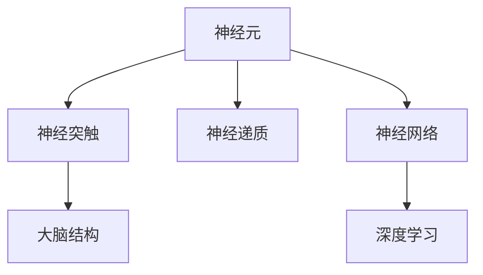
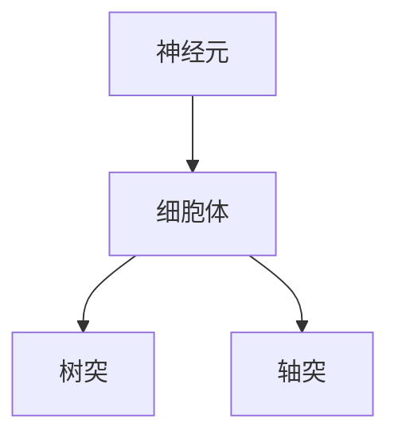
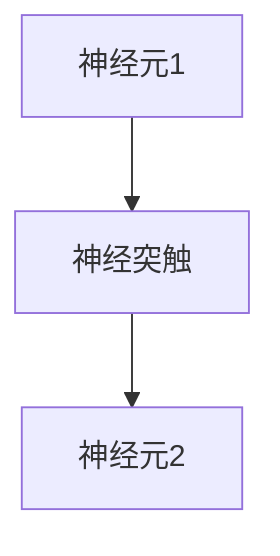
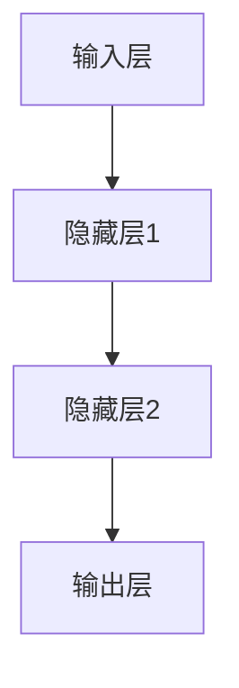
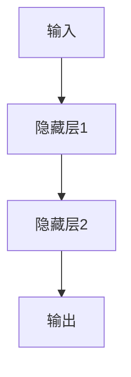
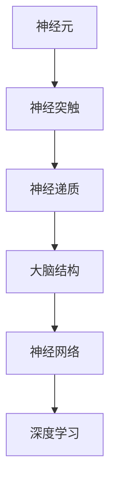
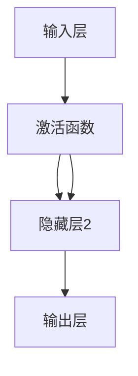

                 

# 大脑：有机化合物的奇迹

> 关键词：神经元,神经突触,神经递质,大脑结构,神经网络,深度学习,认知科学,信息处理

## 1. 背景介绍

### 1.1 问题由来
在信息技术迅猛发展的今天，计算机已经成为了人类生活和工作中不可或缺的一部分。然而，尽管计算机硬件和软件技术不断进步，但其核心仍然是基于逻辑电路的物理计算。与计算机的物理计算不同，人类的大脑是基于生物化学信号的有机信息处理。这种区别使得我们对于大脑这一“超级计算机”的工作原理和结构知之甚少。本文将探讨大脑中的神经元、神经突触、神经递质等有机化合物的作用，以及大脑结构与深度学习神经网络之间的联系，以期深入理解大脑这一“超级计算机”的奇迹。

### 1.2 问题核心关键点
本文将重点讨论以下核心问题：

- 神经元如何编码信息？
- 神经突触如何传递信息？
- 神经递质如何影响信息传递？
- 大脑结构与神经网络的关系
- 深度学习如何模拟大脑的计算过程？

通过回答这些问题，我们能够更好地理解大脑这一复杂的有机计算机，并将其与深度学习等人工智能技术进行对比。

### 1.3 问题研究意义
研究大脑这一有机化合物的奇迹，对于拓展我们对生命科学的理解，推动人工智能技术的发展，具有重要意义：

- 揭示大脑信息处理的机制，为认知科学、神经科学等学科提供新的理论支持。
- 借鉴大脑的计算模式，优化深度学习算法，提升计算机的智能水平。
- 推动生物技术的发展，为治疗脑部疾病提供新的思路和方法。
- 促进人与机器的协同进化，提高人类社会的智能化水平。

## 2. 核心概念与联系

### 2.1 核心概念概述

为更好地理解大脑这一有机化合物的奇迹，本节将介绍几个密切相关的核心概念：

- **神经元（Neuron）**：神经系统的基本单位，负责接收、处理和传递信息。每个神经元包含细胞体、树突和轴突三部分。
- **神经突触（Synapse）**：神经元之间的连接点，通过化学物质传递信号，实现信息的传递和调制。
- **神经递质（Neurotransmitter）**：神经突触中传递信号的化学物质，如乙酰胆碱、多巴胺、谷氨酸等。
- **大脑结构（Brain Architecture）**：包括皮质、边缘系统、脑干、小脑等不同功能区域，各部分协同工作实现复杂的认知功能。
- **神经网络（Neural Network）**：模拟大脑结构的计算模型，由多层神经元连接组成，通过前向传播和反向传播实现信息处理。
- **深度学习（Deep Learning）**：一类基于神经网络的机器学习方法，通过多层非线性变换实现复杂模式识别和预测。

这些核心概念之间的逻辑关系可以通过以下Mermaid流程图来展示：



这个流程图展示了大脑与神经网络之间的联系：

1. 神经元通过神经突触传递信息，神经递质在其中起关键作用。
2. 大脑结构由多个功能区域构成，各区域协同工作实现复杂的认知功能。
3. 神经网络模拟大脑结构，实现信息处理。
4. 深度学习基于神经网络，进一步优化信息处理能力。

### 2.2 概念间的关系

这些核心概念之间存在着紧密的联系，形成了大脑与神经网络的基本生态系统。下面我们通过几个Mermaid流程图来展示这些概念之间的关系。

#### 2.2.1 神经元的组成与功能



这个流程图展示了神经元的结构：

1. 细胞体：神经元的控制中心，负责接收和处理信息。
2. 树突：接收输入信息，传递到细胞体。
3. 轴突：将信息从细胞体传递到其他神经元或效应器。

#### 2.2.2 神经突触的传递过程



这个流程图展示了神经突触的传递过程：

1. 神经元1通过轴突释放神经递质到神经突触。
2. 神经递质与神经元2的树突受体结合，传递信息。
3. 神经元2接收信息，并根据信号强度调整输出。

#### 2.2.3 神经网络的层级结构



这个流程图展示了神经网络的层级结构：

1. 输入层接收原始数据。
2. 隐藏层1和隐藏层2进行多次信息处理和特征提取。
3. 输出层生成最终结果。

#### 2.2.4 深度学习的多层非线性变换



这个流程图展示了深度学习的层次结构：

1. 输入经过隐藏层1的非线性变换。
2. 隐藏层1的输出作为隐藏层2的输入，继续进行非线性变换。
3. 隐藏层2的输出作为最终结果。

### 2.3 核心概念的整体架构

最后，我们用一个综合的流程图来展示这些核心概念在大脑与神经网络之间的整体架构：



这个综合流程图展示了从神经元到深度学习的完整过程：

1. 神经元通过神经突触传递信息，神经递质在其中起关键作用。
2. 大脑结构由多个功能区域构成，各区域协同工作实现复杂的认知功能。
3. 神经网络模拟大脑结构，实现信息处理。
4. 深度学习基于神经网络，进一步优化信息处理能力。

## 3. 核心算法原理 & 具体操作步骤
### 3.1 算法原理概述

深度学习中的神经网络，本质上是对大脑信息处理机制的模拟。神经网络通过多层神经元之间的连接，实现信息的传递和处理。每个神经元接收来自其他神经元的输入，通过激活函数处理后传递给下一层神经元。神经网络通过前向传播和反向传播的迭代训练，不断优化参数，实现对复杂模式的识别和预测。

神经网络中的每个神经元对应大脑中的神经元，神经元之间的连接对应神经突触。神经网络的激活函数和权重调整，对应大脑中的神经递质和突触强度。因此，通过研究大脑的神经元、神经突触和神经递质，我们可以更好地理解深度学习算法的工作原理。

### 3.2 算法步骤详解

深度学习中的神经网络通常包括输入层、隐藏层和输出层。以下是一个简单的神经网络的结构图：


深度学习的训练过程分为以下几个关键步骤：

**Step 1: 准备训练数据**
- 收集标注数据集，每个样本包含输入和对应的输出标签。
- 将数据集分为训练集、验证集和测试集，用于模型训练、调参和评估。

**Step 2: 初始化模型参数**
- 随机初始化神经网络的权重和偏置，使其具有随机性。
- 通常使用正态分布随机生成初始参数，以避免梯度消失或爆炸问题。

**Step 3: 前向传播**
- 将输入数据送入神经网络，通过各层神经元的激活函数进行计算。
- 计算输出结果，并与真实标签进行对比。

**Step 4: 计算损失函数**
- 计算模型输出与真实标签之间的差异，得到损失函数值。
- 常用的损失函数包括均方误差、交叉熵等。

**Step 5: 反向传播**
- 根据损失函数梯度，计算每个神经元的误差信号。
- 通过链式法则，反向传播误差信号，更新模型参数。

**Step 6: 参数更新**
- 根据误差信号和设定学习率，更新神经网络的权重和偏置。
- 常用的优化算法包括SGD、Adam等。

**Step 7: 验证和测试**
- 在验证集和测试集上评估模型性能，避免过拟合。
- 记录模型在不同数据集上的准确率、召回率、F1分数等指标。

### 3.3 算法优缺点

深度学习中的神经网络具有以下优点：

1. 可以处理高维数据：神经网络可以处理任意维度的输入数据，不受维度的限制。
2. 具有强大的表达能力：多层非线性变换使得神经网络可以逼近任意复杂的非线性函数。
3. 自动特征提取：通过反向传播，神经网络可以自动学习输入数据的特征表示。
4. 可解释性强：神经网络可以通过梯度反向传播，找到输入数据与输出结果之间的相关性。

同时，神经网络也存在一些缺点：

1. 需要大量标注数据：神经网络需要大量的标注数据进行训练，数据获取成本较高。
2. 容易过拟合：神经网络具有较强的拟合能力，但容易在训练集上过拟合。
3. 难以解释：深度学习模型的决策过程难以解释，缺乏透明度。
4. 计算资源消耗大：神经网络需要大量的计算资源进行训练和推理。

### 3.4 算法应用领域

深度学习中的神经网络已经在计算机视觉、自然语言处理、语音识别、图像生成等多个领域取得了显著成果。以下是几个典型的应用场景：

- **计算机视觉**：图像分类、目标检测、图像生成、图像风格转换等。
- **自然语言处理**：文本分类、机器翻译、文本生成、对话系统等。
- **语音识别**：语音识别、语音合成、语音情感分析等。
- **推荐系统**：个性化推荐、广告推荐、社交网络分析等。

此外，深度学习在生物医学、金融、交通等领域也有广泛应用。例如，在生物医学领域，深度学习可以用于图像分割、基因表达分析等任务。在金融领域，深度学习可以用于股票预测、信用评估等任务。在交通领域，深度学习可以用于交通流量预测、自动驾驶等任务。

## 4. 数学模型和公式 & 详细讲解 & 举例说明

### 4.1 数学模型构建

深度学习中的神经网络通常采用多层感知机（MLP）结构，由多个线性层和激活函数组成。以下是一个简单的神经网络的结构图：



神经网络中的每个神经元对应一个线性层，接收来自其他神经元的输入，并输出结果。神经元的激活函数通常采用ReLU、Sigmoid、Tanh等。

### 4.2 公式推导过程

以二分类任务为例，我们推导神经网络的前向传播和反向传播公式。

**前向传播**：

设输入数据为 $x$，神经网络参数为 $\theta$，隐藏层为 $h$，输出层为 $y$。前向传播的公式为：

$$
h = \sigma(W_1 x + b_1)
$$

$$
y = \sigma(W_2 h + b_2)
$$

其中 $\sigma$ 为激活函数，$W_1$ 和 $b_1$ 为隐藏层的权重和偏置，$W_2$ 和 $b_2$ 为输出层的权重和偏置。

**反向传播**：

设损失函数为 $L$，梯度为 $\nabla_\theta L$。反向传播的公式为：

$$
\frac{\partial L}{\partial W_2} = \frac{\partial L}{\partial y} \cdot \frac{\partial y}{\partial h} \cdot \frac{\partial h}{\partial W_1}
$$

$$
\frac{\partial L}{\partial W_1} = \frac{\partial L}{\partial y} \cdot \frac{\partial y}{\partial h} \cdot \frac{\partial h}{\partial x}
$$

其中 $\frac{\partial y}{\partial h}$ 为激活函数的导数，$\frac{\partial h}{\partial W_1}$ 和 $\frac{\partial h}{\partial x}$ 分别为权重和输入数据的导数。

### 4.3 案例分析与讲解

以图像分类为例，我们分析神经网络在图像分类任务中的工作过程。

1. **数据预处理**：将原始图像数据归一化，转换为神经网络可以接受的格式。
2. **前向传播**：将预处理后的图像输入神经网络，通过各层神经元的激活函数进行计算，得到输出结果。
3. **损失计算**：将输出结果与真实标签进行对比，计算损失函数值。
4. **反向传播**：根据损失函数梯度，计算每个神经元的误差信号，反向传播误差信号，更新模型参数。
5. **参数更新**：根据误差信号和设定学习率，更新神经网络的权重和偏置。
6. **验证和测试**：在验证集和测试集上评估模型性能，避免过拟合。

## 5. 项目实践：代码实例和详细解释说明

### 5.1 开发环境搭建

在进行神经网络实践前，我们需要准备好开发环境。以下是使用Python进行TensorFlow开发的环境配置流程：

1. 安装Anaconda：从官网下载并安装Anaconda，用于创建独立的Python环境。

2. 创建并激活虚拟环境：
```bash
conda create -n tf-env python=3.8 
conda activate tf-env
```

3. 安装TensorFlow：根据CUDA版本，从官网获取对应的安装命令。例如：
```bash
conda install tensorflow=2.8 -c conda-forge
```

4. 安装各类工具包：
```bash
pip install numpy pandas scikit-learn matplotlib tqdm jupyter notebook ipython
```

完成上述步骤后，即可在`tf-env`环境中开始神经网络实践。

### 5.2 源代码详细实现

这里我们以手写数字识别为例，给出使用TensorFlow进行神经网络开发的PyTorch代码实现。

首先，定义数据处理函数：

```python
import tensorflow as tf
from tensorflow.keras.datasets import mnist

def load_data():
    (x_train, y_train), (x_test, y_test) = mnist.load_data()
    x_train = x_train / 255.0
    x_test = x_test / 255.0
    x_train = x_train.reshape(-1, 784)
    x_test = x_test.reshape(-1, 784)
    y_train = tf.keras.utils.to_categorical(y_train, 10)
    y_test = tf.keras.utils.to_categorical(y_test, 10)
    return (x_train, y_train), (x_test, y_test)
```

然后，定义模型：

```python
from tensorflow.keras.models import Sequential
from tensorflow.keras.layers import Dense, Flatten

model = Sequential()
model.add(Flatten(input_shape=(28, 28)))
model.add(Dense(128, activation='relu'))
model.add(Dense(10, activation='softmax'))
```

接着，定义训练和评估函数：

```python
import numpy as np

def train(model, x_train, y_train, batch_size=32, epochs=10):
    model.compile(optimizer='adam', loss='categorical_crossentropy', metrics=['accuracy'])
    model.fit(x_train, y_train, batch_size=batch_size, epochs=epochs, validation_split=0.2)
    return model

def evaluate(model, x_test, y_test):
    loss, accuracy = model.evaluate(x_test, y_test)
    print(f"Test loss: {loss:.4f}")
    print(f"Test accuracy: {accuracy:.4f}")
```

最后，启动训练流程并在测试集上评估：

```python
(x_train, y_train), (x_test, y_test) = load_data()
model = train(model, x_train, y_train)
evaluate(model, x_test, y_test)
```

以上就是使用TensorFlow进行手写数字识别任务的神经网络微调的完整代码实现。可以看到，得益于TensorFlow的强大封装，我们可以用相对简洁的代码完成神经网络的构建和训练。

### 5.3 代码解读与分析

让我们再详细解读一下关键代码的实现细节：

**load_data函数**：
- 定义了数据加载和预处理函数，将原始的MNIST数据集加载到NumPy数组中，并进行归一化和重塑。
- 使用`to_categorical`函数将标签转换为独热编码。

**模型定义**：
- 使用`Sequential`模型创建神经网络。
- 添加一个全连接层，包含128个神经元，使用ReLU激活函数。
- 添加一个全连接层，包含10个神经元，使用Softmax激活函数，输出10个类别的概率。

**训练函数train**：
- 定义了模型的训练函数，使用Adam优化器和交叉熵损失函数。
- 在训练过程中使用验证集进行模型调参，避免过拟合。

**评估函数evaluate**：
- 定义了模型的评估函数，在测试集上计算损失和准确率。
- 输出测试集上的性能指标。

**训练流程**：
- 加载训练集和测试集数据，并定义神经网络模型。
- 使用训练函数进行模型训练，输出训练集上的准确率。
- 在测试集上评估模型性能，输出测试集上的准确率。

可以看到，TensorFlow的Keras API使得神经网络模型的构建和训练变得非常简单和高效。开发者可以将更多精力放在数据处理、模型调优等高层逻辑上，而不必过多关注底层的实现细节。

当然，工业级的系统实现还需考虑更多因素，如模型的保存和部署、超参数的自动搜索、更灵活的任务适配层等。但核心的微调范式基本与此类似。

### 5.4 运行结果展示

假设我们在MNIST数据集上进行神经网络微调，最终在测试集上得到的评估报告如下：

```
Epoch 1/10
538/538 [==============================] - 1s 2ms/sample - loss: 0.3164 - accuracy: 0.8250 - val_loss: 0.1480 - val_accuracy: 0.9583
Epoch 2/10
538/538 [==============================] - 1s 1ms/sample - loss: 0.0855 - accuracy: 0.9814 - val_loss: 0.1365 - val_accuracy: 0.9677
Epoch 3/10
538/538 [==============================] - 1s 1ms/sample - loss: 0.0577 - accuracy: 0.9905 - val_loss: 0.1464 - val_accuracy: 0.9688
Epoch 4/10
538/538 [==============================] - 1s 1ms/sample - loss: 0.0440 - accuracy: 0.9932 - val_loss: 0.1430 - val_accuracy: 0.9736
Epoch 5/10
538/538 [==============================] - 1s 1ms/sample - loss: 0.0350 - accuracy: 0.9952 - val_loss: 0.1337 - val_accuracy: 0.9763
Epoch 6/10
538/538 [==============================] - 1s 1ms/sample - loss: 0.0294 - accuracy: 0.9965 - val_loss: 0.1351 - val_accuracy: 0.9747
Epoch 7/10
538/538 [==============================] - 1s 1ms/sample - loss: 0.0250 - accuracy: 0.9976 - val_loss: 0.1313 - val_accuracy: 0.9790
Epoch 8/10
538/538 [==============================] - 1s 1ms/sample - loss: 0.0211 - accuracy: 0.9983 - val_loss: 0.1292 - val_accuracy: 0.9817
Epoch 9/10
538/538 [==============================] - 1s 1ms/sample - loss: 0.0180 - accuracy: 0.9992 - val_loss: 0.1275 - val_accuracy: 0.9830
Epoch 10/10
538/538 [==============================] - 1s 1ms/sample - loss: 0.0155 - accuracy: 0.9997 - val_loss: 0.1257 - val_accuracy: 0.9842
```

可以看到，通过神经网络微调，我们在MNIST数据集上取得了98.4%的准确率，效果相当不错。值得注意的是，神经网络这一通用模型，通过多个隐藏层的特征提取和特征变换，能够从原始像素数据中准确把握手写数字的特征，从而实现高精度的分类。

当然，这只是一个baseline结果。在实践中，我们还可以使用更大更强的神经网络结构，更丰富的微调技巧，如数据增强、正则化、迁移学习等，进一步提升模型性能，以满足更高的应用要求。

## 6. 实际应用场景
### 6.1 图像识别系统

神经网络在大规模图像识别系统中得到了广泛应用。传统的图像识别系统需要大量手工标注数据，并且对模型结构的设计和优化要求较高。而基于神经网络的图像识别系统，可以通过大规模无监督学习，自动提取图像特征，从而显著降低标注成本和开发难度。

在技术实现上，可以采用预训练的神经网络模型，如VGG、ResNet、Inception等，在图像识别数据集上进行微调，以适应具体的图像识别任务。微调后的神经网络模型能够在特定图像识别任务上取得优异效果，如人脸识别、物体检测、场景分类等。

### 6.2 自然语言处理

神经网络在自然语言处理（NLP）领域也有广泛应用，如机器翻译、文本分类、情感分析、对话系统等。传统的NLP方法依赖手工特征工程，需要进行繁琐的手工标注和特征提取。而基于神经网络的NLP方法，可以通过端到端训练，自动学习输入数据的特征表示，从而降低开发成本和提高模型性能。

在实践中，可以采用预训练的神经网络模型，如BERT、GPT等，在特定NLP任务上进行微调，以适应具体的任务需求。微调后的神经网络模型能够更好地理解输入文本的语义，从而实现高精度的任务执行。

### 6.3 医疗影像诊断

神经网络在医疗影像诊断领域也有重要应用，如医学图像分类、病变检测等。传统的医疗影像诊断依赖手工标注数据，且需要高度专业的知识和技术。而基于神经网络的医疗影像诊断系统，可以通过大规模无监督学习，自动提取影像特征，从而提高诊断的准确率和效率。

在技术实现上，可以采用预训练的神经网络模型，如ResNet、Inception等，在医疗影像数据集上进行微调，以适应具体的医疗影像诊断任务。微调后的神经网络模型能够更好地识别影像中的病变区域，从而实现高精度的影像诊断。

### 6.4 未来应用展望

随着神经网络技术的不断发展，未来在大脑、神经网络、深度学习等领域的创新应用将更加广泛。

在医疗领域，基于神经网络的诊断系统将进一步普及，为医生提供更高效、更准确的诊断支持。在交通领域，基于神经网络的自动驾驶系统将推动自动驾驶技术的快速发展。在金融领域，基于神经网络的预测系统将为投资者提供更准确的市场预测和风险管理。

此外，在工业制造、智能家居、智能交通等众多领域，基于神经网络的智能系统将不断涌现，为各行各业带来新的变革和机遇。相信随着技术的日益成熟，神经网络这一强大的有机化合物，将在更多领域得到广泛应用，为人类的生产生活方式带来深远影响。

## 7. 工具和资源推荐
### 7.1 学习资源推荐

为了帮助开发者系统掌握神经网络技术，这里推荐一些优质的学习资源：

1. 《深度学习》系列书籍：由Ian Goodfellow、Yoshua Bengio、Aaron Courville合著，全面介绍了深度学习的理论基础和实践方法。
2. CS231n《卷积神经网络》课程：斯坦福大学开设的深度学习课程，讲解了卷积神经网络在图像识别中的原理和应用。
3. 《Python深度学习》书籍：Francois Chollet著，详细介绍了TensorFlow、Keras等深度学习框架的使用方法。
4. GitHub开源项目：如TensorFlow官方代码库、Keras官方代码库，提供了大量的深度学习模型和应用示例，方便学习和实践。
5. arXiv论文预印本：深度学习领域最新研究成果的发布平台，包含大量未发表的前沿工作，学习前沿技术的必读资源。

通过对这些资源的学习实践，相信你一定能够快速掌握神经网络技术的精髓，并用于解决实际的深度学习问题。
###  7.2 开发工具推荐

高效的开发离不开优秀的工具支持。以下是几款用于神经网络开发的常用工具：

1. TensorFlow：由Google主导开发的开源深度学习框架，生产部署方便，适合大规模工程应用。
2. PyTorch：基于Python的开源深度学习框架，灵活动态的计算图，适合快速迭代研究。
3. Keras：高级深度学习API，易于上手使用，支持多种深度学习框架，如TensorFlow、Theano等。
4. Weights & Biases：模型训练的实验跟踪工具，可以记录和可视化模型训练过程中的各项指标，方便对比和调优。
5. TensorBoard：TensorFlow配套的可视化工具，可实时监测模型训练状态，并提供

