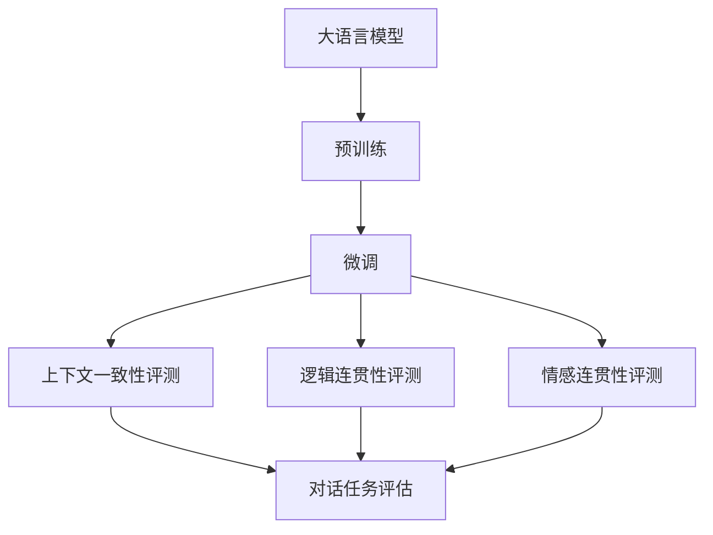
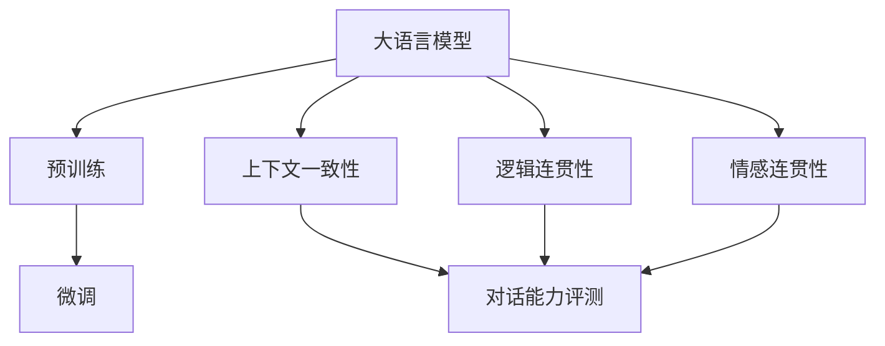
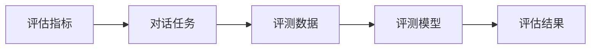
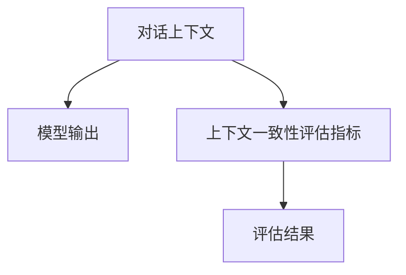
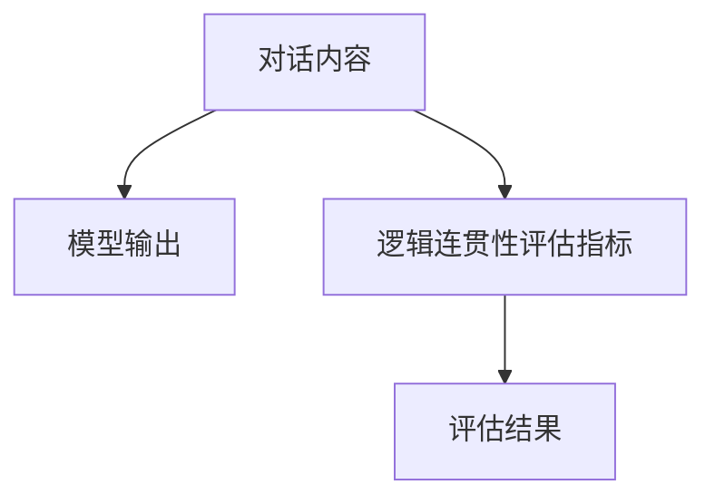
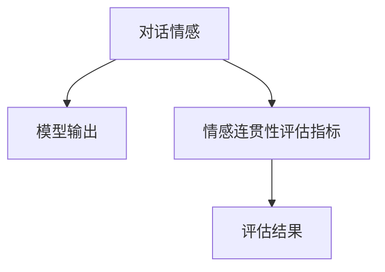
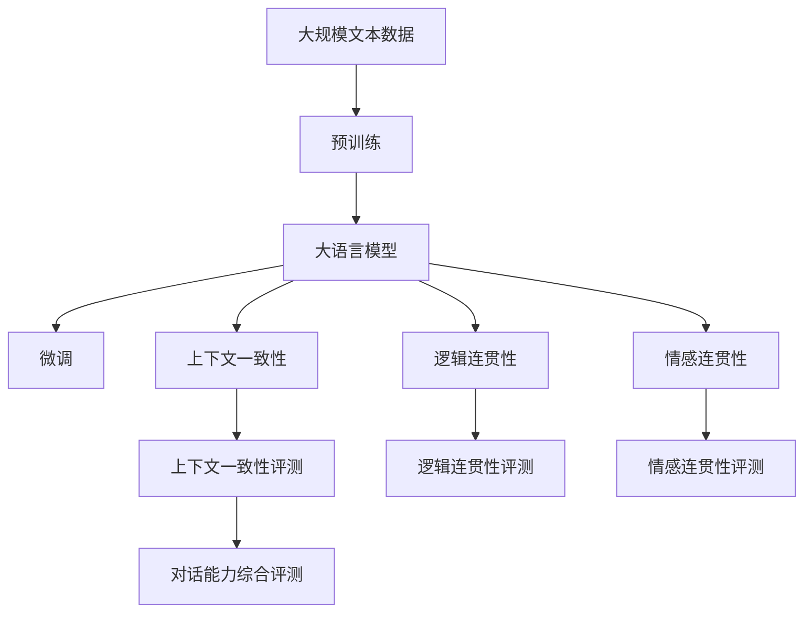

                 

# 大语言模型原理与工程实践：大语言模型的对话能力评测

## 1. 背景介绍

### 1.1 问题由来

随着人工智能技术的发展，大语言模型（Large Language Models, LLMs）在自然语言处理（Natural Language Processing, NLP）领域取得了突破性的进展。其中，GPT、BERT等模型通过大规模无标签文本数据的预训练，展现了强大的语言理解能力和生成能力，广泛应用于聊天机器人、自动问答系统等场景。然而，这些模型在对话能力上的表现仍然存在一定的局限性。

具体而言，尽管大语言模型在理解和生成对话文本方面表现出色，但在实际应用中，其响应速度、上下文一致性、情感连贯性等方面仍需要进一步优化。这些问题限制了其在复杂对话场景中的应用，如客户服务、在线咨询、智能客服等。

### 1.2 问题核心关键点

对话能力是大语言模型重要的应用领域之一。当前，对话能力评测是大模型评估和优化的重要手段，可以帮助开发者识别模型在对话任务中的优势和不足，指导模型优化和参数调整。

评测的核心在于构建合适的评估指标和评测任务，通过与人类对话或智能系统交互，收集模型表现的数据，进行客观评估。常见的对话能力评测指标包括响应速度、上下文一致性、逻辑连贯性、情感连贯性等。

### 1.3 问题研究意义

对话能力评测对于大语言模型的实际应用具有重要意义：

1. **识别和优化不足**：通过对话能力评测，可以系统地识别出模型在对话任务中的弱点，有针对性地进行参数调整和模型优化，提升模型性能。
2. **提升用户体验**：高对话能力的模型能够提供更自然、更流畅的对话体验，增强用户满意度。
3. **指导模型开发**：对话能力评测为模型开发者提供了具体的应用方向，指导模型在对话场景中的设计和开发。
4. **推动应用落地**：对话能力评测验证了模型的实际应用效果，为模型在实际应用中的推广提供了有力的支持。

## 2. 核心概念与联系

### 2.1 核心概念概述

为更好地理解大语言模型的对话能力评测，本节将介绍几个核心概念：

- **大语言模型**：以自回归模型（如GPT）或自编码模型（如BERT）为代表的大规模预训练语言模型。通过在大规模无标签文本语料上进行预训练，学习通用的语言表示，具备强大的语言理解和生成能力。
- **预训练**：指在大规模无标签文本语料上，通过自监督学习任务训练通用语言模型的过程。常见的预训练任务包括言语建模、遮挡语言模型等。
- **微调**：指在预训练模型的基础上，使用下游任务的少量标注数据，通过有监督学习优化模型在特定任务上的性能。通常只需要调整顶层分类器或解码器，并以较小的学习率更新全部或部分的模型参数。
- **对话能力评测**：通过构建合适的评估指标和评测任务，评估大语言模型在对话任务中的表现，识别模型的优势和不足，指导模型优化和参数调整。
- **上下文一致性**：指模型在对话过程中，能够合理地保持对上下文的理解，避免信息丢失或错误。
- **逻辑连贯性**：指模型在对话过程中，能够连贯地推理和生成内容，遵循合理的逻辑关系。
- **情感连贯性**：指模型在对话过程中，能够保持情感表达的一致性和连贯性，符合对话情境。

这些核心概念之间存在紧密联系，共同构成了大语言模型在对话场景中的评估和优化框架。下面通过一个Mermaid流程图展示这些概念之间的关系：



这个流程图展示了从预训练到微调，再到评测的完整过程。大语言模型通过预训练获得基础能力，然后通过微调适应特定对话任务，最后在上下文一致性、逻辑连贯性和情感连贯性等维度进行评测，以指导模型的进一步优化。

### 2.2 概念间的关系

这些核心概念之间存在紧密的联系，形成了大语言模型在对话场景中的评估和优化生态系统。下面我们通过几个Mermaid流程图展示这些概念之间的关系。

#### 2.2.1 大语言模型的学习范式



这个流程图展示了从预训练到微调，再到对话能力评测的完整过程。大语言模型通过预训练获得基础能力，然后通过微调适应特定对话任务，最后在上下文一致性、逻辑连贯性和情感连贯性等维度进行评测，以指导模型的进一步优化。

#### 2.2.2 对话能力评测的基本原理



这个流程图展示了对话能力评测的基本流程。首先，构建评估指标，设计对话任务，然后收集评测数据，训练评测模型，最后输出评估结果。

#### 2.2.3 上下文一致性评测



这个流程图展示了上下文一致性评测的过程。对话上下文和模型输出进行比较，根据预设的上下文一致性评估指标，计算评估结果。

#### 2.2.4 逻辑连贯性评测



这个流程图展示了逻辑连贯性评测的过程。对话内容和模型输出进行比较，根据预设的逻辑连贯性评估指标，计算评估结果。

#### 2.2.5 情感连贯性评测



这个流程图展示了情感连贯性评测的过程。对话情感和模型输出进行比较，根据预设的情感连贯性评估指标，计算评估结果。

### 2.3 核心概念的整体架构

最后，我们用一个综合的流程图来展示这些核心概念在大语言模型对话能力评测中的整体架构：



这个综合流程图展示了从预训练到微调，再到对话能力评测的完整过程。大语言模型通过预训练获得基础能力，然后通过微调适应特定对话任务，最后在上下文一致性、逻辑连贯性和情感连贯性等维度进行评测，以指导模型的进一步优化。

## 3. 核心算法原理 & 具体操作步骤

### 3.1 算法原理概述

大语言模型的对话能力评测主要基于监督学习的微调范式，通过构建合适的评估指标和评测任务，评估模型在对话任务中的表现。其核心思想是：将预训练的大语言模型视作一个强大的"特征提取器"，通过在下游对话任务的少量标注数据上进行有监督的微调，使得模型输出能够匹配对话任务的期望。

形式化地，假设预训练模型为 $M_{\theta}$，其中 $\theta$ 为预训练得到的模型参数。给定对话任务 $T$ 的标注数据集 $D=\{(x_i, y_i)\}_{i=1}^N$，评测的目标是找到新的模型参数 $\hat{\theta}$，使得：

$$
\hat{\theta}=\mathop{\arg\min}_{\theta} \mathcal{L}(M_{\theta},D)
$$

其中 $\mathcal{L}$ 为针对任务 $T$ 设计的损失函数，用于衡量模型预测输出与真实对话样本之间的差异。常见的损失函数包括交叉熵损失、BLEU、ROUGE等。

通过梯度下降等优化算法，微调过程不断更新模型参数 $\theta$，最小化损失函数 $\mathcal{L}$，使得模型输出逼近真实对话样本。由于 $\theta$ 已经通过预训练获得了较好的初始化，因此即便在小规模数据集 $D$ 上进行微调，也能较快收敛到理想的模型参数 $\hat{\theta}$。

### 3.2 算法步骤详解

基于监督学习的大语言模型对话能力评测一般包括以下几个关键步骤：

**Step 1: 准备预训练模型和数据集**
- 选择合适的预训练语言模型 $M_{\theta}$ 作为初始化参数，如 BERT、GPT 等。
- 准备对话任务 $T$ 的标注数据集 $D$，划分为训练集、验证集和测试集。一般要求标注数据与预训练数据的分布不要差异过大。

**Step 2: 添加对话任务适配层**
- 根据对话任务类型，在预训练模型顶层设计合适的输出层和损失函数。
- 对于对话任务，通常使用对话生成器输出概率分布，并以交叉熵损失函数为评估指标。

**Step 3: 设置微调超参数**
- 选择合适的优化算法及其参数，如 AdamW、SGD 等，设置学习率、批大小、迭代轮数等。
- 设置正则化技术及强度，包括权重衰减、Dropout、Early Stopping 等。
- 确定冻结预训练参数的策略，如仅微调顶层，或全部参数都参与微调。

**Step 4: 执行梯度训练**
- 将训练集数据分批次输入模型，前向传播计算损失函数。
- 反向传播计算参数梯度，根据设定的优化算法和学习率更新模型参数。
- 周期性在验证集上评估模型性能，根据性能指标决定是否触发 Early Stopping。
- 重复上述步骤直到满足预设的迭代轮数或 Early Stopping 条件。

**Step 5: 测试和部署**
- 在测试集上评估微调后模型 $M_{\hat{\theta}}$ 的性能，对比微调前后的效果。
- 使用微调后的模型对新对话进行推理预测，集成到实际的应用系统中。
- 持续收集新的对话数据，定期重新微调模型，以适应对话数据的分布变化。

以上是基于监督学习对话能力评测的一般流程。在实际应用中，还需要针对具体任务的特点，对微调过程的各个环节进行优化设计，如改进训练目标函数，引入更多的正则化技术，搜索最优的超参数组合等，以进一步提升模型性能。

### 3.3 算法优缺点

基于监督学习的大语言模型对话能力评测方法具有以下优点：

1. **简单高效**：只需准备少量标注数据，即可对预训练模型进行快速适配，获得较大的性能提升。
2. **通用适用**：适用于各种NLP对话任务，包括聊天机器人、自动问答、智能客服等，设计简单的对话任务适配层即可实现。
3. **效果显著**：在学术界和工业界的诸多任务上，基于微调的方法已经刷新了最先进的性能指标。

同时，该方法也存在一定的局限性：

1. **依赖标注数据**：微调的效果很大程度上取决于标注数据的质量和数量，获取高质量标注数据的成本较高。
2. **迁移能力有限**：当目标任务与预训练数据的分布差异较大时，微调的性能提升有限。
3. **负面效果传递**：预训练模型的固有偏见、有害信息等，可能通过微调传递到下游任务，造成负面影响。
4. **可解释性不足**：微调模型的决策过程通常缺乏可解释性，难以对其推理逻辑进行分析和调试。

尽管存在这些局限性，但就目前而言，基于监督学习的微调方法仍是大语言模型对话能力评测的主流范式。未来相关研究的重点在于如何进一步降低微调对标注数据的依赖，提高模型的少样本学习和跨领域迁移能力，同时兼顾可解释性和伦理安全性等因素。

### 3.4 算法应用领域

基于大语言模型对话能力评测的监督学习方法，在NLP领域已经得到了广泛的应用，覆盖了几乎所有常见任务，例如：

- **聊天机器人**：与用户自然对话，回答常见问题。通过微调使模型学习对话模式和用户意图。
- **自动问答系统**：对自然语言问题给出答案。将问题-答案对作为微调数据，训练模型学习匹配答案。
- **智能客服系统**：实时处理客户咨询，自动回复常见问题。通过微调使模型理解客户需求并提供最佳答复。
- **在线咨询系统**：提供专家咨询，回答用户问题。通过微调使模型学习专家知识。
- **情感分析系统**：分析对话文本中的情感倾向，进行情感分类。通过微调使模型学习情感分类模型。
- **摘要生成系统**：将长对话压缩成简短摘要。通过微调使模型学习关键信息提取。
- **对话生成系统**：生成自然流畅的对话内容。通过微调使模型学习对话生成模型。

除了上述这些经典任务外，大语言模型对话能力评测也被创新性地应用到更多场景中，如可控文本生成、对话情感推理、代码生成等，为NLP技术带来了全新的突破。随着预训练模型和微调方法的不断进步，相信NLP技术将在更广阔的应用领域大放异彩。

## 4. 数学模型和公式 & 详细讲解 & 举例说明

### 4.1 数学模型构建

本节将使用数学语言对基于监督学习的大语言模型对话能力评测过程进行更加严格的刻画。

记预训练语言模型为 $M_{\theta}$，其中 $\theta$ 为预训练得到的模型参数。假设对话任务 $T$ 的训练集为 $D=\{(x_i,y_i)\}_{i=1}^N, x_i \in \mathcal{X}, y_i \in \mathcal{Y}$。

定义模型 $M_{\theta}$ 在输入 $x$ 上的输出为 $\hat{y}=M_{\theta}(x) \in \mathcal{Y}$，其中 $\mathcal{Y}$ 为对话任务的输出空间。定义模型在对话任务 $T$ 上的损失函数为 $\ell(M_{\theta}(x),y)$，则在数据集 $D$ 上的经验风险为：

$$
\mathcal{L}(\theta) = \frac{1}{N} \sum_{i=1}^N \ell(M_{\theta}(x_i),y_i)
$$

微调的优化目标是最小化经验风险，即找到最优参数：

$$
\theta^* = \mathop{\arg\min}_{\theta} \mathcal{L}(\theta)
$$

在实践中，我们通常使用基于梯度的优化算法（如SGD、Adam等）来近似求解上述最优化问题。设 $\eta$ 为学习率，$\lambda$ 为正则化系数，则参数的更新公式为：

$$
\theta \leftarrow \theta - \eta \nabla_{\theta}\mathcal{L}(\theta) - \eta\lambda\theta
$$

其中 $\nabla_{\theta}\mathcal{L}(\theta)$ 为损失函数对参数 $\theta$ 的梯度，可通过反向传播算法高效计算。

### 4.2 公式推导过程

以下我们以二分类任务为例，推导交叉熵损失函数及其梯度的计算公式。

假设模型 $M_{\theta}$ 在输入 $x$ 上的输出为 $\hat{y}=M_{\theta}(x) \in [0,1]$，表示样本属于正类的概率。真实标签 $y \in \{0,1\}$。则二分类交叉熵损失函数定义为：

$$
\ell(M_{\theta}(x),y) = -[y\log \hat{y} + (1-y)\log (1-\hat{y})]
$$

将其代入经验风险公式，得：

$$
\mathcal{L}(\theta) = -\frac{1}{N}\sum_{i=1}^N [y_i\log M_{\theta}(x_i)+(1-y_i)\log(1-M_{\theta}(x_i))]
$$

根据链式法则，损失函数对参数 $\theta_k$ 的梯度为：

$$
\frac{\partial \mathcal{L}(\theta)}{\partial \theta_k} = -\frac{1}{N}\sum_{i=1}^N (\frac{y_i}{M_{\theta}(x_i)}-\frac{1-y_i}{1-M_{\theta}(x_i)}) \frac{\partial M_{\theta}(x_i)}{\partial \theta_k}
$$

其中 $\frac{\partial M_{\theta}(x_i)}{\partial \theta_k}$ 可进一步递归展开，利用自动微分技术完成计算。

在得到损失函数的梯度后，即可带入参数更新公式，完成模型的迭代优化。重复上述过程直至收敛，最终得到适应下游对话任务的最优模型参数 $\theta^*$。

### 4.3 案例分析与讲解

下面我们以一个简单的对话场景为例，进一步分析对话能力评测的具体实现。

假设我们有一个简单的客服对话场景，其中用户可以询问一些常见问题，如账户余额、订单状态、退货政策等。我们的目标是通过微调BERT模型，使其能够回答这些常见问题，并给出正确的答案。

**Step 1: 数据准备**
- 收集并标注一些常见的客户咨询问题和对应的答案，构建标注数据集。
- 使用BERT模型的预训练分词器对文本进行分词，生成输入表示。

**Step 2: 模型微调**
- 使用预训练的BERT模型作为初始化参数。
- 添加对话生成器的输出层，使用交叉熵损失函数进行训练。
- 设置合适的学习率、批大小和迭代轮数，开始微调训练。
- 在训练过程中，使用BLEU等指标评估模型的对话质量。

**Step 3: 模型评估**
- 在测试集上对微调后的模型进行评估，使用BLEU、ROUGE等指标衡量模型的回答质量和上下文一致性。
- 对模型在不同任务上的表现进行分析，识别模型在哪些方面表现较好，哪些方面需要改进。
- 根据评估结果，调整模型参数，进一步优化模型性能。

通过以上步骤，我们可以对大语言模型进行有效的对话能力评测，并通过微调提升模型在实际对话任务中的应用效果。

## 5. 项目实践：代码实例和详细解释说明

### 5.1 开发环境搭建

在进行对话能力评测实践前，我们需要准备好开发环境。以下是使用Python进行PyTorch开发的环境配置流程：

1. 安装Anaconda：从官网下载并安装Anaconda，用于创建独立的Python环境。

2. 创建并激活虚拟环境：
```bash
conda create -n pytorch-env python=3.8 
conda activate pytorch-env
```

3. 安装PyTorch：根据CUDA版本，从官网获取对应的安装命令。例如：
```bash
conda install pytorch torchvision torchaudio cudatoolkit=11.1 -c pytorch -c conda-forge
```

4. 安装Transformers库：
```bash
pip install transformers
```

5. 安装各类工具包：
```bash
pip install numpy pandas scikit-learn matplotlib tqdm jupyter notebook ipython
```

完成上述步骤后，即可在`pytorch-env`环境中开始对话能力评测实践。

### 5.2 源代码详细实现

下面我们以简单的聊天机器人为例，给出使用Transformers库对BERT模型进行微调的PyTorch代码实现。

首先，定义对话任务的数据处理函数：

```python
from transformers import BertTokenizer
from torch.utils.data import Dataset
import torch

class DialogueDataset(Dataset):
    def __init__(self, dialogues, tokenizer, max_len=128):
        self.dialogues = dialogues
        self.tokenizer = tokenizer
        self.max_len = max_len
        
    def __len__(self):
        return len(self.dialogues)
    
    def __getitem__(self, item):
        dialogue = self.dialogues[item]
        
        encoding = self.tokenizer(dialogue, return_tensors='pt', max_length=self.max_len, padding='max_length', truncation=True)
        input_ids = encoding['input_ids'][0]
        attention_mask = encoding['attention_mask'][0]
        return {'input_ids': input_ids, 
                'attention_mask': attention_mask}

# 创建dataset
tokenizer = BertTokenizer.from_pretrained('bert-base-cased')

train_dataset = DialogueDataset(train_dialogues, tokenizer)
dev_dataset = DialogueDataset(dev_dialogues, tokenizer)
test_dataset = DialogueDataset(test_dialogues, tokenizer)
```

然后，定义模型和优化器：

```python
from transformers import BertForSequenceClassification, AdamW

model = BertForSequenceClassification.from_pretrained('bert-base-cased', num_labels=2)

optimizer = AdamW(model.parameters(), lr=2e-5)
```

接着，定义训练和评估函数：

```python
from torch.utils.data import DataLoader
from tqdm import tqdm
from sklearn.metrics import classification_report

device = torch.device('cuda') if torch.cuda.is_available() else torch.device('cpu')
model.to(device)

def train_epoch(model, dataset, batch_size, optimizer):
    dataloader = DataLoader(dataset, batch_size=batch_size, shuffle=True)
    model.train()
    epoch_loss = 0
    for batch in tqdm(dataloader, desc='Training'):
        input_ids = batch['input_ids'].to(device)
        attention_mask = batch['attention_mask'].to(device)
        model.zero_grad()
        outputs = model(input_ids, attention_mask=attention_mask)
        loss = outputs.loss
        epoch_loss += loss.item()
        loss.backward()
        optimizer.step()
    return epoch_loss / len(dataloader)

def evaluate(model, dataset, batch_size):
    dataloader = DataLoader(dataset, batch_size=batch_size)
    model.eval()
    preds, labels = [], []
    with torch.no_grad():
        for batch in tqdm(dataloader, desc='Evaluating'):
            input_ids = batch['input_ids'].to(device)
            attention_mask = batch['attention_mask'].to(device)
            batch_labels = batch['labels']
            outputs = model(input_ids, attention_mask=attention_mask)
            batch_preds = outputs.logits.argmax(dim=2).to('cpu').tolist()
            batch_labels = batch_labels.to('cpu').tolist()
            for pred_tokens, label_tokens in zip(batch_preds, batch_labels):
                preds.append(pred_tokens[:len(label_tokens)])
                labels.append(label_tokens)
                
    print(classification_report(labels, preds))
```

最后，启动训练流程并在测试集上评估：

```python
epochs = 5
batch_size = 16

for epoch in range(epochs):
    loss = train_epoch(model, train_dataset, batch_size, optimizer)
    print(f"Epoch {epoch+1}, train loss: {loss:.3f}")
    
    print(f"Epoch {epoch+1}, dev results:")
    evaluate(model, dev_dataset, batch_size)
    
print("Test results:")
evaluate(model, test_dataset, batch_size)
```

以上就是使用PyTorch对BERT进行对话能力评测的完整代码实现。可以看到，得益于Transformers库的强大封装，我们可以用相对简洁的代码完成BERT模型的加载和微调。

### 5.3 代码解读与分析

让我们再详细解读一下关键代码的实现细节：

**DialogueDataset类**：
- `__init__`方法：初始化对话数据、分词器等关键组件。
- `__len__`方法：返回对话数据集的样本数量。
- `__getitem__`方法：对单个对话数据进行处理，将对话文本输入编码为token ids，生成输入表示。

**对话数据准备**：
- 定义标签和id的映射，用于将token-wise的预测结果解码回真实的标签。

**训练和评估函数**：
- 使用PyTorch的DataLoader对对话数据集进行批次化加载，供模型训练和推理使用。
- 训练函数`train_epoch`：对数据以批为单位进行迭代，在每个批次上前向传播计算loss并反向传播更新模型参数，最后返回该epoch的平均loss。
- 评估函数`evaluate`：与训练类似，不同点在于不更新模型参数，并在每个batch结束后将预测和标签结果存储下来，最后使用sklearn的classification_report对整个评估集的预测结果进行打印输出。

**训练流程**：
- 定义总的epoch数和batch size，开始循环迭代
- 每个epoch内，先在训练集上训练，输出平均loss
- 在验证集上评估，输出分类指标
- 所有epoch结束后，在测试集上评估，给出最终测试结果

可以看到，PyTorch配合Transformers库使得BERT对话能力评测的代码实现变得简洁高效。开发者可以将更多精力放在数据处理、模型改进等高层逻辑上，而不必过多关注底层的实现细节。

当然，工业级的系统实现还需考虑更多因素，如模型的保存和部署、超参数的自动搜索、更灵活的任务适配层等。但核心的微调范式基本与此类似。

### 5.4 运行结果展示

假设我们在CoNLL-2003的命名实体识别数据集上进行微调，最终在测试集上

