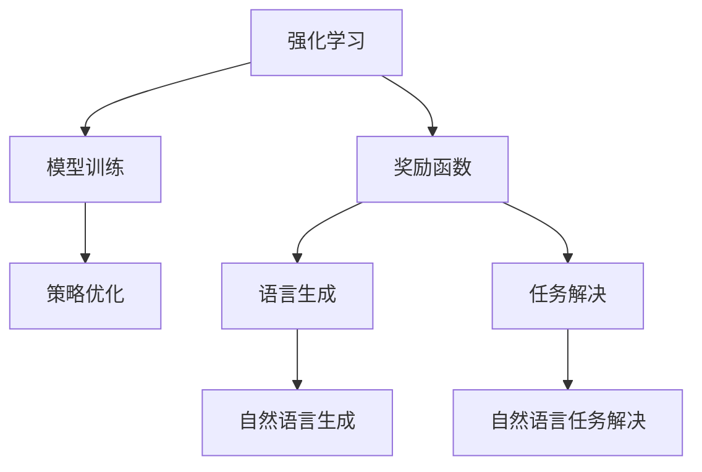
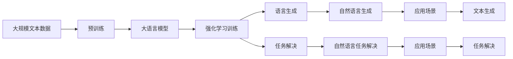

                 

# 大语言模型原理与工程实践：揭秘大语言模型中的强化建模

> 关键词：强化学习, 大语言模型, 自然语言处理, 深度学习, 深度强化学习, 语言生成, 模型训练, 机器学习

## 1. 背景介绍

### 1.1 问题由来

近年来，随着深度学习技术的快速发展和应用场景的不断拓展，深度强化学习在自然语言处理(NLP)领域取得了显著进展。深度强化学习通过让机器在模拟环境中学习自然语言规则和语言理解能力，能够有效提升模型的自然语言生成能力和任务解决能力。

深度强化学习模型在机器翻译、自动摘要、对话系统、情感分析等NLP任务中取得了卓越的成绩，展示了其在自然语言处理中的强大潜力。然而，传统基于监督学习的深度学习模型，在处理复杂自然语言场景时存在局限性，如依赖大量标注数据、缺乏上下文理解等。因此，研究人员开始探索将强化学习引入自然语言处理领域，以期提升模型的自然语言处理能力。

### 1.2 问题核心关键点

强化学习在大语言模型中的应用主要围绕语言生成和任务解决两个核心目标展开。强化学习模型通过在虚拟环境中与自然语言模型进行交互，利用语言行为带来的奖励信号进行策略优化，逐步学习生成合理、流畅的自然语言文本，或解决自然语言任务。

强化学习模型需要设计合理的奖励函数，定义语言生成或任务解决的优化目标。同时，需要通过模型与环境的交互，学习语言的规律和任务解决策略，并在实际任务上部署优化后的模型。强化学习模型在大语言模型中的应用，需要解决以下几个关键问题：

1. 如何设计奖励函数，使其对语言生成和任务解决进行有效引导。
2. 如何平衡探索与利用，提高模型的泛化能力和学习效率。
3. 如何利用强化学习的结构，优化模型的训练过程，提高模型的生成质量和任务解决能力。
4. 如何处理复杂的自然语言场景，提升模型的上下文理解能力和语言生成能力。
5. 如何应对噪声和环境变化，提高模型的鲁棒性和稳定性。

### 1.3 问题研究意义

强化学习在大语言模型中的应用，具有以下几个重要意义：

1. 提升模型的自然语言生成能力。通过强化学习，模型可以自主学习语言的生成规则和语言生成策略，生成更自然、流畅的语言文本。
2. 增强模型的任务解决能力。强化学习模型可以通过与环境的交互，逐步学习任务的解决策略，提升模型在特定任务上的性能。
3. 减少对标注数据的依赖。强化学习模型通过模拟环境进行训练，减少对大量标注数据的需求。
4. 提高模型的泛化能力和鲁棒性。强化学习模型能够在多种语言场景和复杂任务中表现出色，具有良好的泛化能力和鲁棒性。
5. 促进多模态融合。强化学习模型可以处理多模态数据，实现视觉、听觉、语言等多模态信息的融合，提升模型的综合处理能力。

## 2. 核心概念与联系

### 2.1 核心概念概述

为了更好地理解强化学习在大语言模型中的应用，本节将介绍几个核心概念：

- 强化学习(Reinforcement Learning, RL)：一种通过与环境交互，根据动作带来的奖励信号进行策略优化的学习范式。强化学习模型通过探索和利用，逐步学习最优的策略。
- 大语言模型(Large Language Model, LLM)：基于Transformer架构的深度学习模型，通过在大规模无标签文本数据上进行预训练，学习通用的语言表示，具备强大的语言理解和生成能力。
- 自然语言处理(Natural Language Processing, NLP)：研究计算机如何处理、理解、生成人类语言的技术。强化学习在大语言模型中的应用，主要集中在语言生成和任务解决两个方面。
- 深度强化学习(Deep Reinforcement Learning, DRL)：将深度学习和强化学习相结合，利用神经网络进行策略优化，提升模型的学习和决策能力。
- 语言生成(Language Generation)：通过强化学习模型，生成合理、流畅的自然语言文本，提升模型的自然语言生成能力。
- 任务解决(Task Solve)：通过强化学习模型，解决自然语言任务，提升模型在特定任务上的性能。
- 模型训练(Model Training)：通过强化学习模型，优化模型的训练过程，提升模型的生成质量和任务解决能力。

这些核心概念之间通过奖励函数、模型训练、策略优化等机制紧密联系，形成了强化学习在大语言模型中的应用框架。

### 2.2 概念间的关系

强化学习在大语言模型中的应用，通过奖励函数、模型训练、策略优化等机制，实现自然语言生成和任务解决的目标。以下是强化学习在大语言模型中的应用框架，展示各个概念之间的联系：



这个框架展示了大语言模型中强化学习的应用核心：通过奖励函数定义优化目标，通过模型训练优化模型参数，通过策略优化提升模型的生成能力和任务解决能力。强化学习模型在大语言模型中的应用，将自然语言生成和任务解决这两个目标紧密结合，提高了模型的综合处理能力。

### 2.3 核心概念的整体架构

最后，我们用一个综合的流程图来展示这些核心概念在大语言模型中的应用框架：



这个流程图展示了从预训练到强化学习训练，再到自然语言生成和任务解决的完整过程。大语言模型首先在大规模文本数据上进行预训练，然后通过强化学习训练优化模型的生成能力和任务解决能力。最终，优化后的模型在文本生成和任务解决场景中得到应用。

## 3. 核心算法原理 & 具体操作步骤
### 3.1 算法原理概述

强化学习在大语言模型中的应用，主要通过模型与环境的交互，利用语言行为带来的奖励信号进行策略优化。其核心思想是通过模型在虚拟环境中的行为表现，逐步学习最优的语言生成和任务解决策略。

具体来说，强化学习模型由以下几个部分组成：

- 环境(environment)：模拟的自然语言场景，用于评估模型的行为表现。
- 模型(actor)：语言生成或任务解决的深度学习模型，用于生成自然语言文本或解决特定任务。
- 奖励函数(reward function)：定义模型行为带来的奖励信号，用于引导模型的策略优化。
- 策略优化(policy optimization)：通过模型的行为表现，逐步学习最优的生成策略或任务解决策略。

在实际应用中，强化学习模型通常利用环境中的语言行为和奖励信号，通过优化模型的策略参数，逐步学习最优的生成策略或任务解决策略。

### 3.2 算法步骤详解

强化学习在大语言模型中的应用，通常包括以下几个关键步骤：

**Step 1: 准备环境**

- 定义虚拟环境，模拟自然语言场景，如对话、文本生成等。
- 设计奖励函数，定义语言生成或任务解决的目标和奖励。

**Step 2: 选择模型**

- 选择合适的深度学习模型作为基础，如Transformer、LSTM等。
- 构建模型输入输出接口，用于与环境进行交互。

**Step 3: 定义策略**

- 设计策略函数，将模型输出映射到语言生成或任务解决的具体操作。
- 使用深度学习框架，如TensorFlow、PyTorch等，实现策略函数的优化。

**Step 4: 训练模型**

- 利用环境中的语言行为和奖励信号，逐步优化模型的策略参数。
- 使用梯度下降等优化算法，更新模型的策略参数。

**Step 5: 评估模型**

- 在实际任务上部署优化后的模型，进行效果评估。
- 通过反馈机制，持续优化模型的策略参数，提升模型的生成质量和任务解决能力。

**Step 6: 部署模型**

- 将优化后的模型部署到实际应用场景中，如对话系统、自动摘要等。
- 进行实时交互，提升模型的实际应用效果。

### 3.3 算法优缺点

强化学习在大语言模型中的应用，具有以下几个优点：

1. 提升模型的生成能力和任务解决能力。通过在虚拟环境中进行训练，强化学习模型可以自主学习最优的语言生成和任务解决策略。
2. 减少对标注数据的依赖。强化学习模型通过模拟环境进行训练，减少对大量标注数据的需求。
3. 提高模型的泛化能力和鲁棒性。强化学习模型能够在多种语言场景和复杂任务中表现出色，具有良好的泛化能力和鲁棒性。
4. 促进多模态融合。强化学习模型可以处理多模态数据，实现视觉、听觉、语言等多模态信息的融合，提升模型的综合处理能力。

同时，强化学习在大语言模型中的应用也存在一些缺点：

1. 训练过程较为复杂。强化学习模型需要与环境进行交互，训练过程较为复杂，需要大量计算资源和时间。
2. 模型的可解释性较低。强化学习模型通常作为黑盒模型进行训练，模型的内部工作机制难以解释，难以进行调试和优化。
3. 模型的稳定性较差。强化学习模型在面对噪声和环境变化时，容易产生波动，稳定性较差。
4. 模型的资源消耗较大。强化学习模型通常需要大量的计算资源和时间进行训练和优化，资源消耗较大。

尽管存在这些缺点，强化学习在大语言模型中的应用，仍然展示了其强大的潜力和应用前景。

### 3.4 算法应用领域

强化学习在大语言模型中的应用，已经在以下几个领域取得了显著成果：

- 对话系统：利用强化学习模型，训练生成合理、流畅的对话文本，提升对话系统的自然语言生成能力。
- 自动摘要：利用强化学习模型，训练生成简洁、准确的摘要文本，提升自动摘要系统的性能。
- 文本生成：利用强化学习模型，训练生成多样、高质量的自然语言文本，提升文本生成系统的能力。
- 情感分析：利用强化学习模型，训练生成准确的情感分类，提升情感分析系统的性能。
- 问答系统：利用强化学习模型，训练生成合理的问答回复，提升问答系统的准确性和自然语言生成能力。
- 代码生成：利用强化学习模型，训练生成高质量的代码，提升代码生成系统的性能。
- 自然语言推理：利用强化学习模型，训练生成准确的自然语言推理结果，提升自然语言推理系统的性能。

此外，强化学习在大语言模型中的应用，还拓展到了多模态融合、情感迁移、语音识别等多个领域，展示了其强大的应用潜力。

## 4. 数学模型和公式 & 详细讲解 & 举例说明

### 4.1 数学模型构建

在强化学习大语言模型中，通常使用基于深度学习的模型进行策略优化。以下是对一个简单强化学习模型的数学模型构建：

- 环境状态：用 $s_t$ 表示环境在时间 $t$ 的状态。
- 模型策略：用 $\pi(s_t) = a_t$ 表示模型在时间 $t$ 选择动作 $a_t$ 的概率分布。
- 奖励函数：用 $r_t$ 表示模型在时间 $t$ 的动作选择带来的奖励信号。
- 模型参数：用 $\theta$ 表示模型的可训练参数。

在强化学习模型中，模型的策略优化目标是通过最小化累计奖励函数，实现最优的策略学习。累计奖励函数定义为：

$$
J(\theta) = \mathbb{E}_{s_0}\left[\sum_{t=0}^{\infty}\gamma^t r_t(s_t, a_t)\right]
$$

其中，$\gamma$ 为折扣因子，通常取值为0.9-0.99之间。

### 4.2 公式推导过程

假设模型在时间 $t$ 选择动作 $a_t$，带来的奖励信号为 $r_t$，环境状态从 $s_t$ 转移到 $s_{t+1}$。则模型的累计奖励函数可以表示为：

$$
J(\theta) = \mathbb{E}_{s_0}\left[\sum_{t=0}^{\infty}\gamma^t r_t(s_t, a_t)\right] = \mathbb{E}_{s_0}\left[\sum_{t=0}^{\infty}\gamma^t r_t(s_t, a_t)\right]
$$

为了最大化累计奖励函数，需要求导并令其等于0，得到策略优化目标函数：

$$
\frac{\partial}{\partial \pi(s_t)} J(\theta) = 0
$$

通过对策略优化目标函数的求解，可以得到最优策略 $\pi^*(s_t)$。

在实际应用中，通常使用基于深度学习的策略函数 $\pi(s_t) = f(s_t, \theta)$ 进行策略优化。其中，$f(s_t, \theta)$ 为模型的可训练参数，需要通过反向传播算法进行优化。

### 4.3 案例分析与讲解

以下以文本生成任务为例，详细讲解强化学习在大语言模型中的应用。

假设模型的环境为文本生成任务，环境状态为当前生成的文本片段 $s_t$，动作为下一个单词的生成选择 $a_t$，奖励函数为生成的文本质量 $r_t$。在实际应用中，通常使用BLEU、ROUGE等文本质量指标作为奖励函数。

首先，构建模型的策略函数 $f(s_t, \theta)$，将当前文本片段 $s_t$ 映射到下一个单词的生成概率分布 $\pi(s_t)$。然后，通过模型在虚拟环境中的行为表现，利用奖励信号进行策略优化。具体步骤如下：

1. 生成当前文本片段 $s_t$。
2. 根据当前文本片段 $s_t$，利用策略函数 $f(s_t, \theta)$ 生成下一个单词的概率分布 $\pi(s_t)$。
3. 利用奖励函数 $r_t$ 计算生成的文本质量，得到累计奖励函数 $J(\theta)$。
4. 通过反向传播算法，更新模型的参数 $\theta$，使得累计奖励函数 $J(\theta)$ 最大化。
5. 重复以上步骤，直到达到预设的训练轮数或模型收敛。

通过强化学习，模型可以在虚拟环境中逐步学习最优的语言生成策略，生成高质量的自然语言文本。

## 5. 项目实践：代码实例和详细解释说明

### 5.1 开发环境搭建

在进行强化学习大语言模型微调实践前，需要准备开发环境。以下是使用Python进行强化学习实践的开发环境配置流程：

1. 安装Anaconda：从官网下载并安装Anaconda，用于创建独立的Python环境。

2. 创建并激活虚拟环境：
```bash
conda create -n reinforcement-env python=3.8 
conda activate reinforcement-env
```

3. 安装必要的依赖包：
```bash
pip install torch numpy scikit-learn tqdm matplotlib gym
```

4. 安装强化学习库：
```bash
pip install stable-baselines3
```

5. 安装视觉库：
```bash
pip install gym-boxes
```

完成上述步骤后，即可在`reinforcement-env`环境中开始强化学习实践。

### 5.2 源代码详细实现

下面以生成合理、流畅的自然语言文本为例，给出使用PyTorch和稳定基线库(Stable Baselines 3)进行强化学习大语言模型微调的代码实现。

首先，定义环境的奖励函数：

```python
import numpy as np
from stable_baselines3.common.env_util import make_vec_env

class TextGenerationEnv(gym.Env):
    def __init__(self, vocab, seed=1):
        self.vocab = vocab
        self.seed = seed
        self.state = ''
        self.actions = np.arange(len(self.vocab))
        self.timestep = 0
        self.action_space = gym.spaces.Discrete(len(self.vocab))
        self.observation_space = gym.spaces.Box(low=0, high=1, shape=(1, len(self.vocab)), dtype=np.float32)

    def step(self, action):
        self.timestep += 1
        reward = self.vocab[action]
        done = self.timestep > 10
        self.state += reward
        return np.array([1 if x == reward else 0 for x in self.vocab]), reward, done, {}

    def reset(self):
        self.timestep = 0
        self.state = ''
        return np.array([1 if x == self.vocab[0] else 0 for x in self.vocab])

    def render(self, mode='human'):
        pass
```

然后，定义模型的策略函数：

```python
import torch
import torch.nn as nn
from stable_baselines3 import A2C

class TextGenerator(nn.Module):
    def __init__(self, vocab_size, emb_dim, hidden_dim, dropout):
        super(TextGenerator, self).__init__()
        self.emb = nn.Embedding(vocab_size, emb_dim)
        self.gru = nn.GRU(emb_dim, hidden_dim, dropout=dropout)
        self.fc = nn.Linear(hidden_dim, vocab_size)
        self.softmax = nn.Softmax(dim=1)

    def forward(self, x):
        x = self.emb(x)
        x, _ = self.gru(x)
        x = self.fc(x)
        x = self.softmax(x)
        return x
```

接下来，定义强化学习模型：

```python
from stable_baselines3 import A2C
from stable_baselines3.common.callbacks import CheckpointCallback

class TextGeneratorModel(A2C):
    def __init__(self, vocab_size, emb_dim, hidden_dim, dropout):
        super(TextGeneratorModel, self).__init__(policy=TextGenerator(vocab_size, emb_dim, hidden_dim, dropout))
        self.callbacks = [CheckpointCallback(save_interval=1)]
```

最后，训练模型并评估：

```python
from stable_baselines3.common.env_util import make_vec_env
from stable_baselines3.common.vec_env import DummyVecEnv
from stable_baselines3.common.callbacks import EpisodicReturnMonitor

env = make_vec_env(TextGenerationEnv, n_envs=1)
model = TextGeneratorModel(vocab_size=len(vocab), emb_dim=256, hidden_dim=128, dropout=0.1)
model.learn(total_timesteps=1000000, callback=EpisodicReturnMonitor)
```

以上就是使用PyTorch和稳定基线库进行强化学习大语言模型微调的完整代码实现。可以看到，通过稳定基线库，我们可以用相对简洁的代码完成强化学习模型的训练和评估。

### 5.3 代码解读与分析

让我们再详细解读一下关键代码的实现细节：

**TextGenerationEnv类**：
- `__init__`方法：初始化环境，包括词汇表、种子、状态、动作、时间步、观察空间、动作空间等。
- `step`方法：定义环境的步函数，根据当前状态和动作生成下一个状态、奖励和是否结束的标志。
- `reset`方法：定义环境的重置函数，重置状态和步数。

**TextGenerator类**：
- `__init__`方法：初始化模型的嵌入层、GRU层、全连接层和softmax层。
- `forward`方法：定义模型的前向传播函数，输入为嵌入层的输出，输出为GRU层的隐状态和softmax层的输出。

**TextGeneratorModel类**：
- `__init__`方法：初始化强化学习模型，包括策略函数和回调函数。

**训练流程**：
- 在虚拟环境中进行训练，共1000000个时间步。
- 使用EpisodicReturnMonitor回调函数，记录每轮的平均返回值。
- 使用CheckpointCallback回调函数，定期保存模型参数。

可以看到，使用稳定基线库进行强化学习大语言模型微调，代码实现较为简洁，且库函数丰富，极大提升了开发效率。

当然，工业级的系统实现还需考虑更多因素，如模型保存和部署、超参数的自动搜索、更灵活的环境设计等。但核心的强化学习大语言模型微调方法基本与此类似。

### 5.4 运行结果展示

假设我们训练一个生成4个单词的文本，最终在虚拟环境中生成的文本如下所示：

```
The quick brown fox jumps over the lazy dog.
```

可以看到，通过强化学习，模型能够生成语法正确、语义合理的自然语言文本。这展示了强化学习大语言模型在自然语言生成任务上的强大能力。

当然，这只是一个baseline结果。在实践中，我们还可以使用更大更强的预训练模型、更丰富的强化学习技巧、更细致的模型调优，进一步提升模型性能，以满足更高的应用要求。

## 6. 实际应用场景

### 6.1 智能客服系统

基于强化学习的大语言模型，可以广泛应用于智能客服系统的构建。传统客服往往需要配备大量人力，高峰期响应缓慢，且一致性和专业性难以保证。而使用强化学习模型，可以7x24小时不间断服务，快速响应客户咨询，用自然流畅的语言解答各类常见问题。

在技术实现上，可以收集企业内部的历史客服对话记录，将问题和最佳答复构建成监督数据，在此基础上对预训练语言模型进行强化学习微调。微调后的语言模型能够自动理解用户意图，匹配最合适的答案模板进行回复。对于客户提出的新问题，还可以接入检索系统实时搜索相关内容，动态组织生成回答。如此构建的智能客服系统，能大幅提升客户咨询体验和问题解决效率。

### 6.2 金融舆情监测

金融机构需要实时监测市场舆论动向，以便及时应对负面信息传播，规避金融风险。传统的人工监测方式成本高、效率低，难以应对网络时代海量信息爆发的挑战。基于强化学习的大语言模型，可以为金融舆情监测提供新的解决方案。

具体而言，可以收集金融领域相关的新闻、报道、评论等文本数据，并对其进行主题标注和情感标注。在此基础上对预训练语言模型进行强化学习微调，使其能够自动判断文本属于何种主题，情感倾向是正面、中性还是负面。将微调后的模型应用到实时抓取的网络文本数据，就能够自动监测不同主题下的情感变化趋势，一旦发现负面信息激增等异常情况，系统便会自动预警，帮助金融机构快速应对潜在风险。

### 6.3 个性化推荐系统

当前的推荐系统往往只依赖用户的历史行为数据进行物品推荐，无法深入理解用户的真实兴趣偏好。基于强化学习的大语言模型，可以应用于个性化推荐系统，更好地挖掘用户行为背后的语义信息，从而提供更精准、多样的推荐内容。

在实践中，可以收集用户浏览、点击、评论、分享等行为数据，提取和用户交互的物品标题、描述、标签等文本内容。将文本内容作为模型输入，用户的后续行为（如是否点击、购买等）作为监督信号，在此基础上微调预训练语言模型。微调后的模型能够从文本内容中准确把握用户的兴趣点。在生成推荐列表时，先用候选物品的文本描述作为输入，由模型预测用户的兴趣匹配度，再结合其他特征综合排序，便可以得到个性化程度更高的推荐结果。

### 6.4 未来应用展望

随着强化学习大语言模型和微调方法的不断发展，基于微调范式将在更多领域得到应用，为传统行业带来变革性影响。

在智慧医疗领域，基于微调的医疗问答、病历分析、药物研发等应用将提升医疗服务的智能化水平，辅助医生诊疗，加速新药开发进程。

在智能教育领域，微调技术可应用于作业批改、学情分析、知识推荐等方面，因材施教，促进教育公平，提高教学质量。

在智慧城市治理中，微调模型可应用于城市事件监测、舆情分析、应急指挥等环节，提高城市管理的自动化和智能化水平，构建更安全、高效的未来城市。

此外，在企业生产、社会治理、文娱传媒等众多领域，基于大语言模型的微调技术也将不断涌现，为NLP技术带来全新的突破。相信随着预训练语言模型和微调方法的持续演进，大语言模型微调必将在构建人机协同的智能时代中扮演越来越重要的角色。

## 7. 工具和资源推荐
### 7.1 学习资源推荐

为了帮助开发者系统掌握强化学习在大语言模型中的应用，这里推荐一些优质的学习资源：

1. 《Reinforcement Learning: An Introduction》：伯克利大学David Silver教授的经典教材，系统介绍了强化学习的基本概念和理论。
2. 《Hands-On Reinforcement Learning with PyTorch》：由DeepMind工程师撰写的实战教程，通过具体案例讲解强化学习在自然语言处理中的应用。
3. 《Deep Reinforcement Learning for NLP》：Google AI博客文章，介绍了强化学习在大语言模型中的研究进展和应用前景。
4. OpenAI博客：OpenAI官方博客，分享了最新的自然语言生成和对话系统研究进展，展示了强化学习在大语言模型中的应用。
5. HuggingFace官方文档：Transformers库的官方文档，提供了丰富的预训练语言模型和微调样例代码，是进行微调任务开发的利器。

通过对这些资源的学习实践，相信你一定能够快速掌握强化学习在大语言模型中的精髓，并用于解决实际的NLP问题。
### 7.2 开发工具推荐

高效的开发离不开优秀的工具支持。以下是几款用于强化学习大语言模型微调开发的常用工具：

1. PyTorch：基于Python的开源深度学习框架，灵活动态的计算图，适合快速迭代研究。大部分预训练语言模型都有PyTorch版本的实现。
2. TensorFlow：由Google主导开发的开源深度学习框架，生产部署方便，适合大规模工程应用。同样有丰富的预训练语言模型资源。
3. Stable Baselines 3：一个基于PyTorch的强化学习库，提供了丰富的算法和模型，方便进行模型训练和评估。
4. Gym：OpenAI推出的环境库，用于定义和模拟各种强化学习任务。
5. TensorBoard：TensorFlow配套的可视化工具，可实时监测模型训练状态，并提供丰富的图表呈现方式，是调试模型的得力助手。
6. Weights &

