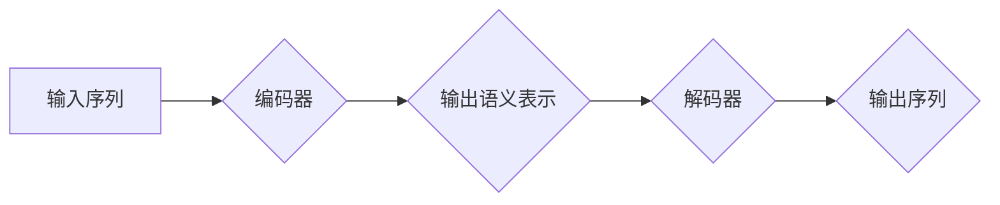

## Transformer大模型实战 汉语的BERT模型

> 关键词：Transformer, BERT, 自然语言处理, 预训练模型, 中文文本理解, 序列标注, 文本分类

## 1. 背景介绍

近年来，深度学习在自然语言处理 (NLP) 领域取得了突破性进展。其中，Transformer 架构的出现彻底改变了 NLP 的发展方向。Transformer 凭借其强大的并行处理能力和长距离依赖建模能力，在机器翻译、文本摘要、问答系统等任务上取得了显著的成绩。

BERT (Bidirectional Encoder Representations from Transformers) 是基于 Transformer 架构的预训练语言模型，由 Google AI 团队于 2018 年提出。BERT 通过在大量的文本数据上进行双向预训练，学习到丰富的语言表示，并能够有效地用于各种下游 NLP 任务。

BERT 的出现为中文 NLP 领域带来了新的机遇。由于中文具有复杂的语法结构和丰富的语义信息，传统的基于词袋模型或 RNN 的方法难以有效地处理中文文本。而 BERT 的双向编码机制能够更好地捕捉中文文本的语义关系，从而提升中文 NLP 任务的性能。

## 2. 核心概念与联系

### 2.1 Transformer 架构

Transformer 架构的核心是 **注意力机制 (Attention)** 和 **多头注意力 (Multi-Head Attention)**。注意力机制能够帮助模型关注输入序列中与当前任务相关的部分，从而提高模型的理解能力。多头注意力机制则通过使用多个注意力头，能够从不同的角度捕捉输入序列的信息，进一步提升模型的表达能力。

Transformer 架构还包含 **编码器 (Encoder)** 和 **解码器 (Decoder)** 两个部分。编码器负责将输入序列编码成语义表示，解码器则根据编码后的语义表示生成输出序列。

**Mermaid 流程图:**



### 2.2 BERT 模型

BERT 模型基于 Transformer 架构，并采用了 **双向预训练** 的策略。BERT 模型的编码器部分由多个 Transformer 块组成，每个 Transformer 块包含多头注意力层和前馈神经网络层。

BERT 模型的预训练目标主要有两种：

* **Masked Language Modeling (MLM)**：随机遮盖输入序列中的部分词，然后预测被遮盖的词。
* **Next Sentence Prediction (NSP)**：判断两个句子是否相邻。

通过这两个预训练任务，BERT 模型能够学习到丰富的语言表示，并能够有效地用于各种下游 NLP 任务。

## 3. 核心算法原理 & 具体操作步骤

### 3.1 算法原理概述

BERT 模型的核心算法原理是基于 Transformer 架构的双向预训练。

* **Transformer 架构**: BERT 模型的核心是 Transformer 架构，它利用注意力机制和多头注意力机制来捕捉输入序列中的长距离依赖关系。
* **双向预训练**: BERT 模型通过在大量的文本数据上进行双向预训练，学习到丰富的语言表示。预训练过程包括两个任务：Masked Language Modeling (MLM) 和 Next Sentence Prediction (NSP)。

### 3.2 算法步骤详解

1. **数据预处理**: 将文本数据进行分词、标记等预处理操作，生成输入序列。
2. **编码器训练**: 使用 Transformer 架构的编码器部分对输入序列进行编码，学习到语义表示。
3. **预训练任务**: 使用 MLM 和 NSP 任务对编码器进行预训练，学习到更丰富的语言表示。
4. **下游任务 fine-tuning**: 将预训练好的 BERT 模型用于下游 NLP 任务，例如文本分类、问答系统等，通过微调模型参数来提升任务性能。

### 3.3 算法优缺点

**优点**:

* **强大的语义理解能力**: BERT 模型通过双向预训练，能够更好地捕捉中文文本的语义关系。
* **高效的训练方法**: Transformer 架构的并行处理能力使得 BERT 模型的训练速度更快。
* **广泛的应用场景**: BERT 模型能够用于各种下游 NLP 任务，例如文本分类、问答系统、机器翻译等。

**缺点**:

* **参数量大**: BERT 模型的参数量较大，需要大量的计算资源进行训练和部署。
* **训练数据依赖**: BERT 模型的性能依赖于训练数据的质量和数量。

### 3.4 算法应用领域

BERT 模型在以下领域具有广泛的应用场景:

* **文本分类**: 识别文本的类别，例如情感分析、主题分类等。
* **问答系统**: 回答用户提出的问题，例如搜索引擎、聊天机器人等。
* **机器翻译**: 将文本从一种语言翻译成另一种语言。
* **文本摘要**: 生成文本的简短摘要。
* **自然语言推理**: 理解文本之间的逻辑关系，例如判断蕴含关系、矛盾关系等。

## 4. 数学模型和公式 & 详细讲解 & 举例说明

### 4.1 数学模型构建

BERT 模型的数学模型主要基于 Transformer 架构，其核心是注意力机制和多头注意力机制。

**注意力机制**:

注意力机制的目的是学习输入序列中与当前任务相关的部分，并赋予它们更高的权重。注意力机制的计算公式如下:

$$
\text{Attention}(Q, K, V) = \text{softmax}\left(\frac{QK^T}{\sqrt{d_k}}\right)V
$$

其中:

* $Q$：查询矩阵
* $K$：键矩阵
* $V$：值矩阵
* $d_k$：键向量的维度
* $\text{softmax}$：softmax 函数

**多头注意力机制**:

多头注意力机制通过使用多个注意力头，能够从不同的角度捕捉输入序列的信息。多头注意力机制的计算公式如下:

$$
\text{MultiHeadAttention}(Q, K, V) = \text{Concat}(head_1, head_2,..., head_h)W^O
$$

其中:

* $head_i$：第 $i$ 个注意力头的输出
* $h$：注意力头的数量
* $W^O$：输出权重矩阵

### 4.2 公式推导过程

注意力机制和多头注意力机制的公式推导过程较为复杂，涉及到线性变换、矩阵乘法、softmax 函数等操作。

### 4.3 案例分析与讲解

假设我们有一个输入序列 "The cat sat on the mat"，我们使用 BERT 模型进行文本分类任务，目标是判断该句子是否表达了积极的情感。

BERT 模型会将该句子编码成一个语义表示，然后将该表示输入到分类器中进行预测。分类器会根据该语义表示判断该句子是否表达了积极的情感。

## 5. 项目实践：代码实例和详细解释说明

### 5.1 开发环境搭建

* Python 3.6+
* TensorFlow 2.0+
* PyTorch 1.0+
* CUDA 10.0+ (可选)

### 5.2 源代码详细实现

```python
# 导入必要的库
import tensorflow as tf

# 定义 BERT 模型
class BERTModel(tf.keras.Model):
    def __init__(self, vocab_size, embedding_dim, num_heads, num_layers):
        super(BERTModel, self).__init__()
        self.embedding = tf.keras.layers.Embedding(vocab_size, embedding_dim)
        self.transformer_blocks = [
            tf.keras.layers.TransformerBlock(num_heads, embedding_dim)
            for _ in range(num_layers)
        ]

    def call(self, inputs):
        # 将输入序列嵌入到词向量空间
        embeddings = self.embedding(inputs)
        # 将嵌入后的词向量输入到 Transformer 块中进行编码
        for transformer_block in self.transformer_blocks:
            embeddings = transformer_block(embeddings)
        # 返回编码后的语义表示
        return embeddings

# 实例化 BERT 模型
model = BERTModel(vocab_size=30000, embedding_dim=128, num_heads=8, num_layers=6)

# 定义损失函数和优化器
loss_fn = tf.keras.losses.CategoricalCrossentropy()
optimizer = tf.keras.optimizers.Adam(learning_rate=1e-5)

# 训练模型
#...

```

### 5.3 代码解读与分析

* **BERTModel 类**: 定义了 BERT 模型的结构，包括嵌入层、Transformer 块等。
* **embedding 层**: 将输入序列中的词转换为词向量。
* **Transformer 块**: 使用注意力机制和多头注意力机制对词向量进行编码。
* **call 方法**: 定义了模型的输入和输出关系。
* **损失函数**: 用于衡量模型预测结果与真实结果之间的差异。
* **优化器**: 用于更新模型参数，使其能够更好地拟合训练数据。

### 5.4 运行结果展示

训练完成后，可以使用测试数据评估模型的性能。

## 6. 实际应用场景

BERT 模型在中文 NLP 领域具有广泛的应用场景，例如:

* **文本分类**: 识别文本的类别，例如情感分析、主题分类等。
* **问答系统**: 回答用户提出的问题，例如搜索引擎、聊天机器人等。
* **机器翻译**: 将文本从一种语言翻译成另一种语言。
* **文本摘要**: 生成文本的简短摘要。
* **自然语言推理**: 理解文本之间的逻辑关系，例如判断蕴含关系、矛盾关系等。

### 6.4 未来应用展望

随着预训练模型的发展，BERT 模型的应用场景将会更加广泛。例如，BERT 模型可以用于生成文本、对话系统、代码生成等领域。

## 7. 工具和资源推荐

### 7.1 学习资源推荐

* **BERT 官方论文**: https://arxiv.org/abs/1810.04805
* **Hugging Face Transformers 库**: https://huggingface.co/transformers/
* **TensorFlow 官方文档**: https://www.tensorflow.org/

### 7.2 开发工具推荐

* **Jupyter Notebook**: https://jupyter.org/
* **VS Code**: https://code.visualstudio.com/

### 7.3 相关论文推荐

* **XLNet**: https://arxiv.org/abs/1906.08237
* **RoBERTa**: https://arxiv.org/abs/1907.11692
* **GPT-3**: https://openai.com/blog/gpt-3/

## 8. 总结：未来发展趋势与挑战

### 8.1 研究成果总结

BERT 模型的出现为中文 NLP 领域带来了新的机遇，其强大的语义理解能力和高效的训练方法使其在各种下游 NLP 任务中取得了显著的成绩。

### 8.2 未来发展趋势

* **模型规模**: 预训练模型的规模将会继续扩大，从而提升模型的性能。
* **多模态学习**: 预训练模型将开始学习多种模态数据，例如文本、图像、音频等。
* **可解释性**: 研究人员将更加关注预训练模型的可解释性，以便更好地理解模型的决策过程。

### 8.3 面临的挑战

* **计算资源**: 训练大型预训练模型需要大量的计算资源，这对于资源有限的机构或个人来说是一个挑战。
* **数据偏见**: 预训练模型的性能依赖于训练数据的质量和数量，而训练数据可能存在偏见，这会导致模型在某些任务上表现不佳。
* **伦理问题**: 预训练模型的应用可能会带来一些伦理问题，例如信息泄露、深度伪造等，需要引起足够的重视。

### 8.4 研究展望

未来，预训练模型将会在更多领域得到应用，并推动 NLP 技术的进一步发展。研究人员将继续探索新的预训练方法、模型架构和应用场景，以解决当前面临的挑战，并为人类社会带来更多价值。

## 9. 附录：常见问题与解答

* **BERT 模型的训练数据是什么？**

BERT 模型的训练数据主要来自 Google 的 BookCorpus 和 Wikipedia 数据集。

* **