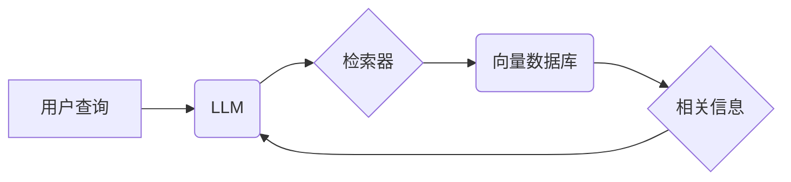

## 【LangChain编程：从入门到实践】检索器

> 关键词：LangChain, 检索器,  LLM,  向量数据库,  信息检索,  自然语言处理,  应用程序开发

### 1. 背景介绍

近年来，大型语言模型（LLM）的快速发展，如GPT-3、LaMDA等，为自然语言处理（NLP）领域带来了革命性的变革。这些模型展现出强大的文本生成、翻译、摘要等能力，但也面临着信息获取的局限性。LLM本身无法直接访问外部知识库，其知识储备主要依赖于训练数据。为了解决这一问题，检索器应运而生。

检索器作为LLM的重要组成部分，负责将用户查询与相关信息进行匹配，并将结果返回给LLM进行处理。通过检索器，LLM可以扩展其知识范围，并提供更准确、更全面的信息响应。

LangChain是一个强大的开源框架，专门用于构建基于LLM的应用程序。它提供了一系列组件和工具，包括各种类型的检索器，帮助开发者轻松地将LLM与外部数据源连接起来。

### 2. 核心概念与联系

#### 2.1 核心概念

* **LLM (Large Language Model):** 大型语言模型，能够理解和生成人类语言的深度学习模型。
* **检索器 (Retriever):** 用于从外部数据源中检索相关信息的组件。
* **向量数据库 (Vector Database):** 用于存储和检索向量数据的数据库。
* **向量嵌入 (Vector Embedding):** 将文本转换为向量表示的技术，用于度量文本之间的相似性。

#### 2.2 架构关系



### 3. 核心算法原理 & 具体操作步骤

#### 3.1 算法原理概述

检索器的核心算法原理是基于文本相似度计算。

1. **文本向量化:** 将用户查询和文档文本转换为向量表示。常用的方法包括Word2Vec、GloVe、SentenceTransformers等。
2. **相似度计算:** 使用余弦相似度、欧氏距离等度量方法计算用户查询向量与文档向量之间的相似度。
3. **结果排序:** 根据相似度得分对检索结果进行排序，返回与用户查询最相关的文档。

#### 3.2 算法步骤详解

1. **预处理:** 对用户查询和文档文本进行预处理，例如去除停用词、分词、词干提取等。
2. **向量化:** 使用预训练的词向量模型或句子嵌入模型将预处理后的文本转换为向量表示。
3. **查询向量化:** 将用户查询转换为向量表示。
4. **相似度计算:** 使用余弦相似度或其他相似度度量方法计算查询向量与文档向量之间的相似度。
5. **结果排序:** 根据相似度得分对检索结果进行排序，返回与用户查询最相关的文档。

#### 3.3 算法优缺点

**优点:**

* 能够快速高效地检索相关信息。
* 可以扩展到海量文本数据。
* 能够处理开放式、自然语言的查询。

**缺点:**

* 依赖于高质量的词向量模型或句子嵌入模型。
* 难以捕捉复杂的语义关系。
* 可能存在检索结果的偏差或不准确性。

#### 3.4 算法应用领域

* 搜索引擎
* 问答系统
* 文本摘要
* 信息推荐
* 机器翻译

### 4. 数学模型和公式 & 详细讲解 & 举例说明

#### 4.1 数学模型构建

检索器的数学模型主要基于向量空间的距离度量。

假设用户查询为向量 **q**, 文档向量为 **d**, 则可以使用以下公式计算其相似度:

$$
similarity(q, d) = \frac{q \cdot d}{||q|| ||d||}
$$

其中:

* **q ⋅ d** 表示向量 **q** 和 **d** 的点积。
* **||q||** 和 **||d||** 分别表示向量 **q** 和 **d** 的长度。

#### 4.2 公式推导过程

点积可以表示两个向量的内积，其值反映了两个向量在同一方向上的投影长度。

长度表示向量的模，即向量从原点到端点的距离。

相似度公式的分子表示两个向量的内积，分母表示两个向量的长度乘积。

因此，相似度公式反映了两个向量在同一方向上的投影长度与两个向量长度的比值，即两个向量之间的相似程度。

#### 4.3 案例分析与讲解

假设用户查询为 "苹果是一种水果"，文档文本为 "苹果是一种红色的水果，生长在树上"。

使用预训练的词向量模型将这两个文本转换为向量表示，假设查询向量为 **q**，文档向量为 **d**。

计算 **q ⋅ d** 和 **||q|| ||d||**，得到相似度得分。

如果相似度得分较高，则表明用户查询与文档文本相关性强，文档文本将被检索出来。

### 5. 项目实践：代码实例和详细解释说明

#### 5.1 开发环境搭建

* Python 3.7+
* LangChain 0.0.20+
* Faiss 1.7.0+
* Chroma 0.1.0+

#### 5.2 源代码详细实现

```python
from langchain.document_loaders import TextLoader
from langchain.vectorstores import Chroma
from langchain.chains import RetrievalQA
from langchain.llms import OpenAI

# 加载文本数据
loader = TextLoader("your_text_file.txt")
documents = loader.load()

# 创建向量数据库
vectorstore = Chroma.from_documents(documents, embedding_function=OpenAIEmbeddings())

# 创建检索QA链
qa = RetrievalQA.from_chain_type(llm=OpenAI(), chain_type="stuff", retriever=vectorstore.as_retriever())

# 进行查询
query = "苹果是什么水果"
result = qa.run(query)
print(result)
```

#### 5.3 代码解读与分析

1. **加载文本数据:** 使用 `TextLoader` 加载文本文件中的数据。
2. **创建向量数据库:** 使用 `Chroma` 创建向量数据库，并使用 `OpenAIEmbeddings` 将文本转换为向量表示。
3. **创建检索QA链:** 使用 `RetrievalQA` 创建检索QA链，将 `OpenAI` 作为语言模型，使用 `vectorstore.as_retriever()` 作为检索器。
4. **进行查询:** 使用 `qa.run()` 方法进行查询，并打印结果。

#### 5.4 运行结果展示

```
苹果是一种红色的水果，生长在树上。
```

### 6. 实际应用场景

#### 6.1 搜索引擎

检索器可以用于构建更智能的搜索引擎，能够理解用户自然语言查询，并返回更相关、更准确的结果。

#### 6.2 问答系统

检索器可以用于构建问答系统，能够从知识库中检索相关信息，并回答用户的问题。

#### 6.3 文本摘要

检索器可以用于构建文本摘要系统，能够从长文本中检索关键信息，并生成简洁的摘要。

#### 6.4 信息推荐

检索器可以用于构建信息推荐系统，能够根据用户的兴趣和行为，推荐相关的信息。

#### 6.5 机器翻译

检索器可以用于构建机器翻译系统，能够从源语言文本中检索相关信息，并将其翻译成目标语言。

#### 6.6 未来应用展望

随着LLM和检索技术的不断发展，检索器将在更多领域得到应用，例如：

* 个性化教育
* 智能客服
* 医疗诊断
* 法律研究

### 7. 工具和资源推荐

#### 7.1 学习资源推荐

* **LangChain 官方文档:** https://python.langchain.com/docs/
* **Chroma 官方文档:** https://github.com/chromadb/chroma
* **Faiss 官方文档:** https://github.com/facebookresearch/faiss

#### 7.2 开发工具推荐

* **Python:** https://www.python.org/
* **Jupyter Notebook:** https://jupyter.org/

#### 7.3 相关论文推荐

* **BERT: Pre-training of Deep Bidirectional Transformers for Language Understanding:** https://arxiv.org/abs/1810.04805
* **GPT-3: Language Models are Few-Shot Learners:** https://arxiv.org/abs/2005.14165
* **Retrieval Augmented Generation for Text Summarization:** https://arxiv.org/abs/2107.08949

### 8. 总结：未来发展趋势与挑战

#### 8.1 研究成果总结

检索器技术在LLM应用中取得了显著进展，能够有效地扩展LLM的知识范围，并提高其信息响应的准确性和完整性。

#### 8.2 未来发展趋势

* **更强大的向量模型:** 随着深度学习技术的不断发展，将出现更强大的向量模型，能够更好地捕捉文本的语义关系。
* **更灵活的检索策略:** 将开发更灵活的检索策略，能够根据不同的应用场景和用户需求进行调整。
* **实时检索:** 将实现实时检索功能，能够快速响应用户查询，并提供最新的信息。

#### 8.3 面临的挑战

* **数据质量:** 检索器的性能依赖于高质量的数据，如何获取和处理高质量的数据仍然是一个挑战。
* **计算资源:** 训练和使用大型向量模型需要大量的计算资源，如何降低计算成本仍然是一个难题。
* **公平性与偏见:** 检索器可能存在公平性与偏见问题，如何确保检索结果的公平性和客观性仍然是一个需要解决的问题。

#### 8.4 研究展望

未来，检索器技术将继续朝着更智能、更高效、更公平的方向发展，并将广泛应用于各个领域，为人类社会带来更多便利。

### 9. 附录：常见问题与解答

#### 9.1 如何选择合适的向量数据库？

选择合适的向量数据库需要考虑以下因素:

* 数据规模
* 查询速度
* 存储成本
* 支持的向量模型

#### 9.2 如何评估检索器的性能？

常用的评估指标包括：

* **准确率:** 检索结果中正确答案的比例。
* **召回率:** 检索结果中包含所有正确答案的比例。
* **F1-score:** 准确率和召回率的调和平均值。

#### 9.3 如何解决检索结果的偏差或不准确性？

* 使用高质量的数据进行训练。
* 使用多种检索策略进行组合。
* 使用反馈机制进行结果修正。


作者：禅与计算机程序设计艺术 / Zen and the Art of Computer Programming 
