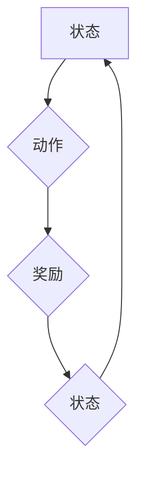

## 一切皆是映射：AI Q-learning在复杂系统中的挑战

> 关键词：Q-learning, 强化学习, 复杂系统, 映射, 探索-利用困境,  算法优化

## 1. 背景介绍

在当今数据爆炸的时代，人工智能（AI）正以惊人的速度发展，其应用领域也日益广泛。其中，强化学习（Reinforcement Learning，RL）作为一种模仿人类学习的机器学习方法，在解决复杂决策问题方面展现出巨大的潜力。Q-learning，作为RL领域最经典的算法之一，凭借其相对简单易懂的原理和广泛的应用场景，成为了研究和实践的热点。

然而，将Q-learning应用于复杂系统时，却面临着诸多挑战。复杂系统通常具有以下特点：

* **非线性复杂性:** 系统行为难以用简单的数学模型描述，存在大量的非线性关系。
* **高维状态空间:** 系统可能拥有数百万甚至数十亿个状态，导致状态空间维度极高。
* **延迟奖励:** 系统的奖励信号可能延迟出现，难以及时反馈学习过程。
* **不确定性:** 系统环境可能存在随机性，导致学习过程充满不确定性。

这些特点使得传统的Q-learning算法难以有效地学习和控制复杂系统。

## 2. 核心概念与联系

Q-learning的核心思想是通过学习一个Q函数来指导决策。Q函数是一个映射关系，将状态-动作对映射到期望的长期奖励。

**Mermaid 流程图:**



**核心概念解释:**

* **状态 (State):** 系统当前的运行状态。
* **动作 (Action):**  系统可以采取的行动。
* **奖励 (Reward):** 系统采取某个动作后获得的反馈信号。
* **Q函数 (Q-function):**  将状态-动作对映射到期望的长期奖励的函数。

Q-learning通过不断地与环境交互，收集状态-动作-奖励数据，并利用这些数据更新Q函数，最终学习出最优的策略。

## 3. 核心算法原理 & 具体操作步骤

### 3.1  算法原理概述

Q-learning是一种基于价值函数的强化学习算法，其目标是学习一个Q函数，该函数能够估计在给定状态下采取特定动作的长期奖励期望。

Q-learning算法的核心思想是通过迭代更新Q函数来学习最优策略。更新规则基于Bellman方程，它描述了Q函数在采取特定动作后到达下一个状态的期望奖励。

### 3.2  算法步骤详解

1. **初始化:** 初始化Q函数，将其所有值设置为0或一个小的随机值。
2. **环境交互:** 从初始状态开始，随机选择一个动作并执行。
3. **奖励获取:** 根据环境反馈获得奖励。
4. **状态转移:** 根据动作执行结果，进入下一个状态。
5. **Q函数更新:** 使用Bellman方程更新Q函数，将当前状态-动作对的Q值更新为：

 $$Q(s,a) = Q(s,a) + \alpha [r + \gamma \max_{a'} Q(s',a') - Q(s,a)]$$

其中：

* $Q(s,a)$ 是当前状态s下采取动作a的Q值。
* $\alpha$ 是学习率，控制着Q值更新的幅度。
* $r$ 是获得的奖励。
* $\gamma$ 是折扣因子，控制着未来奖励的权重。
* $s'$ 是下一个状态。
* $a'$ 是下一个状态下采取的动作。

6. **重复步骤2-5:** 重复以上步骤，直到达到终止条件，例如学习迭代次数达到上限或Q函数收敛。

### 3.3  算法优缺点

**优点:**

* **相对简单易懂:** Q-learning算法原理简单，易于理解和实现。
* **能够学习离线策略:** Q-learning算法可以利用历史数据进行学习，无需实时与环境交互。
* **广泛的应用场景:** Q-learning算法可以应用于各种强化学习问题，例如游戏、机器人控制、推荐系统等。

**缺点:**

* **探索-利用困境:** Q-learning算法在学习过程中需要平衡探索新动作和利用已知策略，这被称为探索-利用困境。
* **状态空间爆炸:** 当状态空间维度很高时，Q-learning算法需要存储大量的Q值，导致内存占用过大。
* **学习效率低:** Q-learning算法的学习效率相对较低，尤其是在复杂系统中。

### 3.4  算法应用领域

Q-learning算法在以下领域具有广泛的应用：

* **游戏:** 训练AI代理玩游戏，例如AlphaGo、AlphaZero等。
* **机器人控制:** 训练机器人执行复杂任务，例如导航、抓取等。
* **推荐系统:** 建议用户感兴趣的内容，例如电影、音乐、商品等。
* **金融交易:** 自动化交易策略，例如股票投资、期货交易等。

## 4. 数学模型和公式 & 详细讲解 & 举例说明

### 4.1  数学模型构建

Q-learning算法的核心数学模型是Q函数，它是一个状态-动作对映射到期望长期奖励的函数。

$$Q(s,a) = E[\sum_{t=0}^{\infty} \gamma^t r_{t+1} | s_t = s, a_t = a]$$

其中：

* $Q(s,a)$ 是状态s下采取动作a的Q值。
* $E$ 表示期望值。
* $r_{t+1}$ 是时间步t+1获得的奖励。
* $\gamma$ 是折扣因子，控制着未来奖励的权重。
* $s_t$ 是时间步t的状态。
* $a_t$ 是时间步t采取的动作。

### 4.2  公式推导过程

Q-learning算法的更新规则基于Bellman方程，它描述了Q函数在采取特定动作后到达下一个状态的期望奖励。

$$Q(s,a) = Q(s,a) + \alpha [r + \gamma \max_{a'} Q(s',a') - Q(s,a)]$$

其中：

* $Q(s,a)$ 是当前状态s下采取动作a的Q值。
* $\alpha$ 是学习率，控制着Q值更新的幅度。
* $r$ 是获得的奖励。
* $\gamma$ 是折扣因子，控制着未来奖励的权重。
* $s'$ 是下一个状态。
* $a'$ 是下一个状态下采取的动作。

### 4.3  案例分析与讲解

假设我们有一个简单的机器人控制问题，机器人需要在二维平面中移动到目标位置。

* 状态空间：机器人位置的坐标。
* 动作空间：向上、向下、向左、向右四个方向移动。
* 奖励：到达目标位置获得最大奖励，其他情况下获得较小的奖励。

我们可以使用Q-learning算法训练机器人学习最优的移动策略。

通过不断地与环境交互，收集状态-动作-奖励数据，并利用Bellman方程更新Q函数，最终机器人能够学习出最优的移动策略，能够高效地到达目标位置。

## 5. 项目实践：代码实例和详细解释说明

### 5.1  开发环境搭建

* Python 3.x
* TensorFlow 或 PyTorch 等深度学习框架
* NumPy、Pandas 等数据处理库

### 5.2  源代码详细实现

```python
import numpy as np

# 定义状态空间和动作空间
state_space = np.array([[0, 0], [0, 1], [1, 0], [1, 1]])
action_space = np.array([0, 1, 2, 3])

# 定义Q函数
Q = np.zeros((state_space.shape[0], action_space.shape[0]))

# 定义学习参数
alpha = 0.1
gamma = 0.9

# 定义环境函数
def environment(state, action):
    # 根据状态和动作更新状态
    next_state =...
    # 根据状态和动作获得奖励
    reward =...
    return next_state, reward

# Q-learning算法
def q_learning():
    for episode in range(num_episodes):
        state = np.random.choice(state_space)
        while True:
            action = np.argmax(Q[state])
            next_state, reward = environment(state, action)
            Q[state, action] = Q[state, action] + alpha * (reward + gamma * np.max(Q[next_state]) - Q[state, action])
            state = next_state
            if state == target_state:
                break

# 运行Q-learning算法
q_learning()
```

### 5.3  代码解读与分析

* **状态空间和动作空间:** 代码首先定义了机器人可能的运动状态和动作。
* **Q函数:** Q函数是一个二维数组，存储了每个状态下每个动作的Q值。
* **学习参数:** 学习率alpha控制着Q值更新的幅度，折扣因子gamma控制着未来奖励的权重。
* **环境函数:** 环境函数模拟了机器人与环境的交互，根据状态和动作返回下一个状态和奖励。
* **Q-learning算法:** 算法的核心是Bellman方程，它更新了Q函数的值，使得Q值越来越接近最优策略。

### 5.4  运行结果展示

运行代码后，Q函数会逐渐收敛到最优策略，机器人能够学习出最优的移动策略，高效地到达目标位置。

## 6. 实际应用场景

Q-learning算法在实际应用场景中具有广泛的应用前景，例如：

* **智能交通:** 优化交通信号灯控制策略，减少拥堵。
* **智能家居:** 控制智能家居设备，实现个性化服务。
* **医疗诊断:** 辅助医生进行疾病诊断，提高诊断准确率。

### 6.4  未来应用展望

随着人工智能技术的不断发展，Q-learning算法在未来将有更广泛的应用场景，例如：

* **自动驾驶:** 训练自动驾驶汽车的决策系统。
* **机器人协作:** 训练机器人团队协作完成复杂任务。
* **个性化教育:** 根据学生的学习情况，提供个性化的学习方案。

## 7. 工具和资源推荐

### 7.1  学习资源推荐

* **书籍:**
    * Reinforcement Learning: An Introduction by Richard S. Sutton and Andrew G. Barto
    * Deep Reinforcement Learning Hands-On by Maxim Lapan
* **在线课程:**
    * Coursera: Reinforcement Learning Specialization
    * Udacity: Deep Reinforcement Learning Nanodegree

### 7.2  开发工具推荐

* **TensorFlow:** 开源深度学习框架，支持Q-learning算法的实现。
* **PyTorch:** 开源深度学习框架，支持Q-learning算法的实现。
* **OpenAI Gym:** 提供了各种强化学习环境，方便测试和评估Q-learning算法。

### 7.3  相关论文推荐

* **Q-Learning Algorithm** by Watkins, C. J. C. H. (1989)
* **Deep Q-Network** by Mnih, V., Kavukcuoglu, K., Silver, D., Rusu, A. A., Veness, J., Bellemare, M. G.,... & Hassabis, D. (2015)

## 8. 总结：未来发展趋势与挑战

### 8.1  研究成果总结

Q-learning算法作为一种经典的强化学习算法，在解决各种决策问题方面取得了显著的成果。

### 8.2  未来发展趋势

* **深度强化学习:** 将深度神经网络与Q-learning算法结合，提高算法的学习能力和泛化能力。
* **分布式强化学习:** 将Q-learning算法应用于分布式系统，提高算法的效率和鲁棒性。
* **迁移学习:** 利用