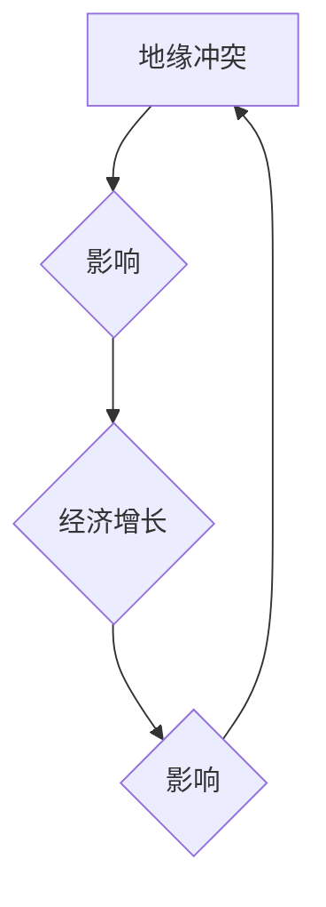

## 地缘冲突对经济增长的影响

> 关键词：地缘冲突、经济增长、全球化、供应链、风险管理、国际贸易、政治经济学

## 1. 背景介绍

地缘政治风险一直是影响全球经济增长的重要因素。近年来，地缘冲突频发，从乌克兰战争到中东地区动荡，这些冲突对全球经济产生了深远的影响。地缘冲突不仅直接损害了冲突地区的经济发展，也对全球经济体系产生了连锁反应，导致供应链中断、通货膨胀加剧、市场波动加剧等问题。

随着全球化进程的加速，各国经济更加相互依存，地缘冲突对经济的影响也更加广泛和深远。因此，深入研究地缘冲突对经济增长的影响，对于理解当前世界经济形势、制定有效的经济政策和应对地缘政治风险至关重要。

## 2. 核心概念与联系

### 2.1 地缘冲突

地缘冲突是指基于地理位置、资源争夺、意识形态冲突等因素而发生的国家间或跨国组织之间的政治、军事或经济对抗。地缘冲突的类型多样，包括战争、恐怖主义、政治动荡、经济制裁等。

### 2.2 经济增长

经济增长是指一个国家或地区的经济总量在一定时期内增加的比率。经济增长的主要指标包括GDP增长率、人均GDP增长率等。经济增长是衡量一个国家或地区发展水平的重要指标，也是人们普遍追求的目标。

### 2.3 核心概念联系

地缘冲突和经济增长之间存在着复杂的相互影响关系。地缘冲突会对经济增长产生负面影响，而经济增长也会影响地缘冲突的发生和发展。

**Mermaid 流程图：**



## 3. 核心算法原理 & 具体操作步骤

### 3.1 算法原理概述

由于地缘冲突的复杂性和不确定性，难以建立一个精确预测地缘冲突对经济增长的算法模型。然而，我们可以利用一些统计分析和机器学习方法，对地缘冲突和经济增长之间的关系进行建模和分析。

### 3.2 算法步骤详解

1. **数据收集:** 收集地缘冲突和经济增长相关的数据，包括冲突事件、冲突强度、经济指标等。
2. **数据预处理:** 对收集到的数据进行清洗、转换和标准化，以便于后续分析。
3. **特征提取:** 从数据中提取能够反映地缘冲突和经济增长特征的变量，例如冲突发生的频率、冲突的地理位置、冲突的经济成本等。
4. **模型构建:** 利用统计分析或机器学习方法，构建一个能够预测地缘冲突对经济增长的模型。
5. **模型评估:** 对模型进行评估，检验其预测准确性。
6. **模型应用:** 将模型应用于实际场景，预测未来地缘冲突对经济增长的影响。

### 3.3 算法优缺点

**优点:**

* 可以利用大数据和机器学习技术，对地缘冲突和经济增长之间的关系进行更深入的分析。
* 可以帮助预测未来地缘冲突对经济增长的影响，为决策者提供参考。

**缺点:**

* 地缘冲突的复杂性和不确定性，使得模型的预测准确性有限。
* 模型的构建需要大量的历史数据和专业知识。

### 3.4 算法应用领域

* **经济预测:** 预测地缘冲突对经济增长的影响，帮助政府和企业制定经济政策和风险管理策略。
* **投资决策:** 评估地缘冲突对投资风险的影响，帮助投资者做出更明智的投资决策。
* **国际关系研究:** 研究地缘冲突和经济增长的关系，为国际关系研究提供新的视角。

## 4. 数学模型和公式 & 详细讲解 & 举例说明

### 4.1 数学模型构建

我们可以构建一个简单的数学模型来描述地缘冲突对经济增长的影响。假设：

* $Y$ 表示经济增长率
* $C$ 表示地缘冲突强度
* $\alpha$ 表示地缘冲突对经济增长的影响系数

则模型可以表示为：

$$Y = f(C, \alpha)$$

其中，$f$ 是一个函数，描述了地缘冲突强度和影响系数对经济增长率的影响关系。

### 4.2 公式推导过程

为了简化模型，我们可以假设 $f$ 是一个线性函数：

$$Y = \beta_0 + \beta_1C + \epsilon$$

其中，$\beta_0$ 是截距项，$\beta_1$ 是地缘冲突强度对经济增长率的影响系数，$\epsilon$ 是随机误差项。

### 4.3 案例分析与讲解

假设 $\beta_0 = 3\%$, $\beta_1 = -0.5\%$, 则当地缘冲突强度增加1单位时，经济增长率将下降0.5%。

例如，如果一个国家的地缘冲突强度从2上升到3，则根据模型预测，该国的经济增长率将从 $3\% + (-0.5\%) \times 2 = 2\%$ 下降到 $3\% + (-0.5\%) \times 3 = 1.5\%$。

## 5. 项目实践：代码实例和详细解释说明

### 5.1 开发环境搭建

* 操作系统：Windows/macOS/Linux
* 编程语言：Python
* 库依赖：pandas, numpy, scikit-learn

### 5.2 源代码详细实现

```python
import pandas as pd
from sklearn.linear_model import LinearRegression

# 数据加载
data = pd.read_csv('conflict_data.csv')

# 特征选择
X = data[['conflict_intensity']]
y = data['economic_growth']

# 模型训练
model = LinearRegression()
model.fit(X, y)

# 模型评估
#...

# 预测
new_conflict_intensity = 3
predicted_growth = model.predict([[new_conflict_intensity]])
print(f'预测经济增长率: {predicted_growth[0]:.2f}%')
```

### 5.3 代码解读与分析

* 数据加载：使用pandas库加载冲突数据和经济增长数据。
* 特征选择：选择冲突强度作为预测变量，经济增长率作为目标变量。
* 模型训练：使用scikit-learn库中的线性回归模型训练模型。
* 模型评估：使用模型评估指标，例如R-squared，来评估模型的性能。
* 预测：使用训练好的模型预测新的冲突强度下经济增长率。

### 5.4 运行结果展示

运行结果将显示预测的经济增长率，以及模型评估指标。

## 6. 实际应用场景

### 6.1 经济政策制定

政府可以利用地缘冲突对经济增长的预测模型，制定更有效的经济政策，例如应对经济衰退、促进经济转型等。

### 6.2 风险管理

企业可以利用地缘冲突对经济增长的预测模型，评估地缘政治风险，制定风险管理策略，例如分散投资、建立应急预案等。

### 6.3 国际关系研究

学者可以利用地缘冲突对经济增长的预测模型，研究地缘冲突和经济发展之间的关系，为国际关系研究提供新的视角。

### 6.4 未来应用展望

随着人工智能技术的不断发展，地缘冲突对经济增长的预测模型将更加精准和可靠。未来，这些模型可以应用于更广泛的领域，例如金融市场预测、国际贸易决策等。

## 7. 工具和资源推荐

### 7.1 学习资源推荐

* **书籍:**
    * 《地缘政治与经济》
    * 《冲突与和平》
    * 《全球化与地缘政治》
* **在线课程:**
    * Coursera: 地缘政治与国际关系
    * edX: 冲突与和平研究
* **学术期刊:**
    * 《国际关系》
    * 《世界政治》
    * 《地缘政治》

### 7.2 开发工具推荐

* **编程语言:** Python
* **数据分析库:** pandas, numpy
* **机器学习库:** scikit-learn
* **可视化工具:** matplotlib, seaborn

### 7.3 相关论文推荐

* **The Impact of Geopolitical Risk on Economic Growth**
* **Modeling the Relationship Between Conflict and Economic Development**
* **Geopolitical Risk and Financial Markets**

## 8. 总结：未来发展趋势与挑战

### 8.1 研究成果总结

研究表明，地缘冲突对经济增长具有显著的负面影响。地缘冲突会破坏经济基础设施、阻碍贸易和投资、增加不确定性等，从而抑制经济增长。

### 8.2 未来发展趋势

未来，地缘冲突对经济增长的研究将更加深入和细致。研究者将利用更先进的模型和数据分析方法，研究地缘冲突不同类型对经济增长的影响，以及不同国家和地区对地缘冲突的脆弱性。

### 8.3 面临的挑战

地缘冲突的复杂性和不确定性，使得对地缘冲突对经济增长的预测具有挑战性。此外，数据获取和模型构建也面临着一些挑战。

### 8.4 研究展望

未来，地缘冲突对经济增长的研究将更加注重跨学科合作，将政治学、经济学、社会学等多学科的知识和方法结合起来，构建更全面的研究框架。


## 9. 附录：常见问题与解答

### 9.1 Q: 地缘冲突对所有国家和地区的影响都是一样的吗？

### 9.2 A: 

不，地缘冲突对不同国家和地区的经济影响是不一样的。一些国家可能更依赖于冲突地区的资源或贸易，因此对冲突的影响更大。此外，一些国家可能拥有更强大的经济实力和风险管理能力，因此对冲突的影响相对较小。

### 9.3 Q: 如何应对地缘冲突带来的经济风险？

### 9.4 A: 

应对地缘冲突带来的经济风险，可以采取以下措施：

* **分散投资:** 将投资分散到多个国家和地区，降低对单一地区风险的依赖。
* **建立应急预案:** 制定应对地缘冲突的应急预案，例如供应链中断、市场波动等。
* **加强风险管理:** 提高对地缘政治风险的识别和评估能力，制定有效的风险管理策略。
* **促进国际合作:** 加强国际合作，共同应对地缘冲突带来的挑战。

作者：禅与计算机程序设计艺术 / Zen and the Art of Computer Programming


