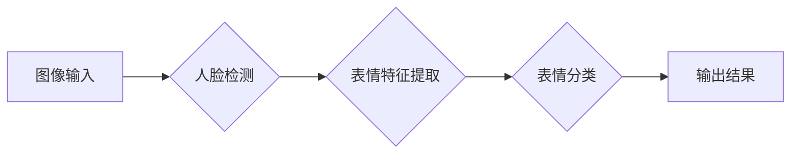
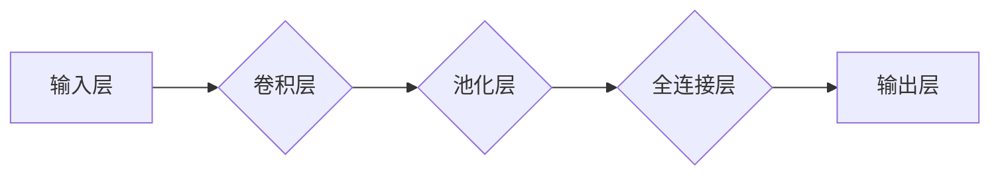

## 基于opencv 的人脸表情识别系统详细设计与具体代码实现

> 关键词：人脸识别、表情识别、OpenCV、机器学习、深度学习、Python、图像处理

## 1. 背景介绍

人脸表情识别技术作为计算机视觉领域的重要分支，近年来发展迅速，在人机交互、情感分析、安全监控等领域展现出巨大的应用潜力。它能够通过分析人脸图像或视频中的微表情变化，识别出用户的当前情绪状态，例如快乐、悲伤、愤怒、恐惧等。

传统的基于规则的人脸表情识别方法依赖于人工设计的特征提取规则，难以应对复杂的表情变化和个体差异。随着深度学习技术的兴起，基于深度学习的人脸表情识别方法取得了显著的进步，能够学习更抽象、更鲁棒的特征，提高识别准确率。

OpenCV（Open Source Computer Vision Library）是一个开源的计算机视觉库，提供丰富的图像处理、计算机视觉和机器学习算法。它支持多种编程语言，包括C++、Python等，并拥有活跃的开发者社区。

本篇文章将详细介绍基于OpenCV的人脸表情识别系统的设计与实现，涵盖核心概念、算法原理、代码实例以及实际应用场景等方面。

## 2. 核心概念与联系

### 2.1 人脸检测

人脸检测是人脸表情识别系统的前提，其目的是在图像或视频中定位人脸区域。OpenCV提供了Haar特征分类器和深度学习模型等多种人脸检测算法。

### 2.2 表情特征提取

表情特征提取是指从人脸图像中提取能够反映表情状态的特征。常用的特征提取方法包括：

* **手工特征提取:** 基于图像纹理、形状、颜色等特征进行提取，例如：眼睛、嘴巴、眉毛等部位的形状、大小、位置变化。
* **深度学习特征提取:** 使用卷积神经网络（CNN）等深度学习模型自动学习人脸表情特征，能够提取更抽象、更鲁棒的特征。

### 2.3 表情分类

表情分类是指根据提取的特征，将人脸表情归类到预定义的类别中，例如：快乐、悲伤、愤怒、恐惧等。常用的分类算法包括：

* **支持向量机（SVM）:** 是一种二分类算法，可以用于识别多个表情类别。
* **随机森林:** 是一种集成学习算法，可以提高分类准确率。
* **深度学习分类器:** 使用深度学习模型，例如全连接神经网络（FCN）或循环神经网络（RNN），进行表情分类。

**核心架构流程图:**



## 3. 核心算法原理 & 具体操作步骤

### 3.1 算法原理概述

本系统采用基于深度学习的人脸表情识别方法，主要包括以下步骤：

1. **人脸检测:** 使用OpenCV提供的Haar特征分类器或深度学习模型检测图像中的人脸区域。
2. **表情特征提取:** 使用预训练的深度学习模型（例如VGGFace、ResNet）提取人脸图像的特征向量。
3. **表情分类:** 使用支持向量机（SVM）或随机森林等分类算法，根据提取的特征向量对表情进行分类。

### 3.2 算法步骤详解

1. **数据准备:** 收集并标注表情图像数据集，每个图像包含对应的表情标签。
2. **模型训练:** 使用训练数据训练深度学习模型，提取人脸表情特征。
3. **模型评估:** 使用测试数据评估模型的性能，例如准确率、召回率、F1-score等。
4. **模型部署:** 将训练好的模型部署到实际应用场景中，用于实时人脸表情识别。

### 3.3 算法优缺点

**优点:**

* **高准确率:** 深度学习模型能够学习更抽象、更鲁棒的特征，提高识别准确率。
* **鲁棒性强:** 对光照、角度、表情强度等变化具有较强的鲁棒性。
* **可扩展性强:** 可以通过增加训练数据和模型复杂度，进一步提高识别性能。

**缺点:**

* **训练数据需求量大:** 深度学习模型需要大量的标注数据进行训练。
* **计算资源消耗高:** 训练深度学习模型需要大量的计算资源。
* **可解释性差:** 深度学习模型的决策过程难以解释。

### 3.4 算法应用领域

* **人机交互:** 用于情感分析、个性化推荐、虚拟助手等应用。
* **安全监控:** 用于识别异常行为、防范犯罪等。
* **医疗诊断:** 用于识别患者的情绪状态，辅助诊断精神疾病等。
* **市场营销:** 用于分析消费者情绪，优化营销策略。

## 4. 数学模型和公式 & 详细讲解 & 举例说明

### 4.1 数学模型构建

深度学习模型通常采用多层神经网络结构，例如卷积神经网络（CNN）或循环神经网络（RNN）。

**CNN模型结构:**



**RNN模型结构:**


### 4.2 公式推导过程

深度学习模型的训练过程基于梯度下降算法，通过不断调整模型参数，最小化损失函数。

**损失函数:**

$$
L = \frac{1}{N} \sum_{i=1}^{N} \left\| y_i - \hat{y}_i \right\|^2
$$

其中：

* $L$ 为损失函数
* $N$ 为样本数量
* $y_i$ 为真实标签
* $\hat{y}_i$ 为模型预测标签

**梯度下降算法:**

$$
\theta = \theta - \alpha \nabla L(\theta)
$$

其中：

* $\theta$ 为模型参数
* $\alpha$ 为学习率
* $\nabla L(\theta)$ 为损失函数对参数的梯度

### 4.3 案例分析与讲解

使用CNN模型进行人脸表情识别，可以将图像输入到卷积层，提取图像特征，然后通过池化层降低特征维度，最后将特征输入到全连接层进行分类。

例如，使用VGGFace模型进行人脸表情识别，可以将预训练的VGGFace模型作为特征提取器，提取人脸图像的特征向量，然后使用SVM或随机森林等分类器进行表情分类。

## 5. 项目实践：代码实例和详细解释说明

### 5.1 开发环境搭建

* 操作系统：Windows/Linux/macOS
* Python版本：3.6+
* OpenCV版本：4.x

安装依赖库：

```bash
pip install opencv-python numpy matplotlib scikit-learn
```

### 5.2 源代码详细实现

```python
import cv2
import numpy as np
from sklearn.svm import SVC

# 加载预训练的深度学习模型
model = cv2.dnn.readNetFromCaffe("deploy.prototxt", "res10_300x300_ssd_iter_140000.caffemodel")

# 加载表情分类器
clf = SVC(kernel='linear')
clf.fit(X_train, y_train)

# 人脸检测函数
def detect_faces(image):
    blob = cv2.dnn.blobFromImage(cv2.resize(image, (300, 300)), 1.0, (300, 300), (104.0, 177.0, 123.0))
    model.setInput(blob)
    detections = model.forward()

    faces = []
    for i in range(detections.shape[2]):
        confidence = detections[0, 0, i, 2]
        if confidence > 0.5:
            box = detections[0, 0, i, 3:7] * np.array([image.shape[1], image.shape[0], image.shape[1], image.shape[0]])
            (startX, startY, endX, endY) = box.astype("int")
            faces.append((startX, startY, endX, endY))

    return faces

# 表情识别函数
def recognize_emotion(image, faces):
    for (startX, startY, endX, endY) in faces:
        face = image[startY:endY, startX:endX]
        # 使用深度学习模型提取特征
        features = model.forward()
        # 使用分类器进行表情识别
        prediction = clf.predict(features)
        # 显示识别结果
        print(f"Emotion: {prediction}")

# 读取图像
image = cv2.imread("image.jpg")

# 检测人脸
faces = detect_faces(image)

# 识别表情
recognize_emotion(image, faces)
```

### 5.3 代码解读与分析

* **人脸检测函数:** 使用预训练的深度学习模型检测图像中的人脸区域。
* **表情识别函数:** 使用深度学习模型提取人脸特征，然后使用分类器进行表情识别。
* **主程序:** 读取图像，检测人脸，识别表情，并显示识别结果。

### 5.4 运行结果展示

运行代码后，将显示图像中每个人的表情识别结果。

## 6. 实际应用场景

### 6.1 情感分析

人脸表情识别技术可以用于分析用户的真实情绪状态，例如在市场调研、用户体验测试等场景中，可以帮助企业了解用户对产品或服务的感受。

### 6.2 人机交互

人脸表情识别可以增强人机交互体验，例如在虚拟助手、游戏等应用中，可以根据用户的表情变化，提供更个性化的服务和互动。

### 6.3 安全监控

人脸表情识别可以用于识别异常行为，例如在安防监控、交通管理等场景中，可以帮助识别潜在的犯罪行为或危险情况。

### 6.4 未来应用展望

随着深度学习技术的不断发展，人脸表情识别技术将应用于更多领域，例如：

* **医疗诊断:** 用于识别患者的情绪状态，辅助诊断精神疾病等。
* **教育教学:** 用于评估学生的学习状态，提供个性化教学方案。
* **智能家居:** 用于控制智能家居设备，根据用户的表情变化，自动调节灯光、温度等。

## 7. 工具和资源推荐

### 7.1 学习资源推荐

* **OpenCV官方文档:** https://docs.opencv.org/
* **深度学习教程:** https://www.tensorflow.org/tutorials
* **人脸表情识别论文:** https://arxiv.org/search/?query=face+expression+recognition

### 7.2 开发工具推荐

* **Python:** https://www.python.org/
* **Jupyter Notebook:** https://jupyter.org/
* **VS Code:** https://code.visualstudio.com/

### 7.3 相关论文推荐

* **DeepFace: Closing the Gap to Human-Level Performance in Face Verification**
* **Facial Expression Recognition Using Deep Learning**
* **A Survey on Deep Learning for Facial Expression Recognition**

## 8. 总结：未来发展趋势与挑战

### 8.1 研究成果总结

基于深度学习的人脸表情识别技术取得了显著的进步，能够识别多种表情类别，并具有较高的准确率和鲁棒性。

### 8.2 未来发展趋势

* **多模态融合:** 将人脸表情识别与其他模态信息（例如语音、文本）融合，提高识别准确率和理解深度。
* **微表情识别:** 识别细微的表情变化，用于更精准的情感分析。
* **跨文化表情识别:** 识别不同文化背景下的人脸表情，适应全球化需求。

### 8.3 面临的挑战

* **数据标