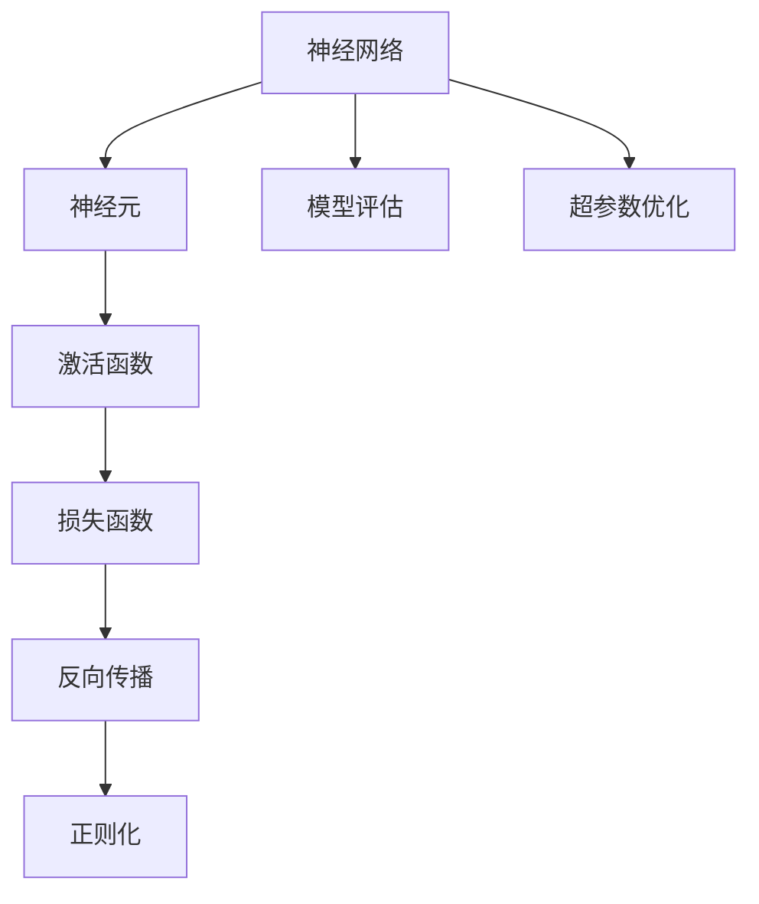

                 

# Python机器学习实战：使用Keras快速搭建深度神经网络

> 关键词：深度学习, Python, Keras, 神经网络, 神经元, 激活函数, 损失函数, 反向传播, 正则化, 模型评估, 超参数优化

## 1. 背景介绍

### 1.1 问题由来
在当今数据驱动的时代，机器学习技术在各行各业得到了广泛的应用。尤其是在深度学习领域，通过构建复杂的神经网络模型，可以从大规模数据中提取高层次的特征，显著提升了模型在图像、语音、自然语言处理等任务上的性能。然而，深度学习模型的搭建和训练过程通常需要较强的数学和编程基础，使得许多开发者望而却步。

针对这一问题，Keras应运而生。Keras是一个高度模块化的高级神经网络API，支持在Python语言中快速搭建深度学习模型，易于使用，适合初学者入门，也方便专家进行模型优化。Keras提供了一整套强大的工具，使得开发者能够轻松构建、训练和部署深度神经网络，满足了从浅层网络到深层网络的各种需求。

## 2. 核心概念与联系

### 2.1 核心概念概述

在深入了解Keras之前，我们需要先熟悉一些核心的深度学习概念：

- **神经网络(Neural Networks)**：由多个层组成的计算图，每层包含多个神经元，可以处理多维输入和输出。神经网络通过训练，学习数据中的复杂关系，用于分类、回归等任务。
- **神经元(Neuron)**：神经网络中的基本计算单元，每个神经元接收输入，计算并输出激活值，用于传递信息。
- **激活函数(Activation Function)**：对神经元的输出进行非线性变换，增强网络的表达能力，常用的激活函数有Sigmoid、ReLU、Tanh等。
- **损失函数(Loss Function)**：用于评估模型预测值与真实标签之间的差距，常用的损失函数有均方误差、交叉熵等。
- **反向传播(Backpropagation)**：通过链式法则计算损失函数对每个参数的偏导数，用于更新模型参数，优化模型性能。
- **正则化(Regularization)**：通过引入惩罚项，防止模型过拟合，常用的正则化方法有L1、L2正则、Dropout等。
- **模型评估(Model Evaluation)**：通过保留部分验证集数据，评估模型在未见过的数据上的表现，常用的评估指标有准确率、精确率、召回率、F1分数等。
- **超参数优化(Hyperparameter Tuning)**：通过调整学习率、批次大小、迭代轮数等超参数，优化模型性能，常用的优化方法有网格搜索、随机搜索等。

这些概念构成了深度学习模型的基础，Keras正是在此基础上，提供了一整套灵活、易用的API，使得开发者能够快速构建和训练神经网络模型。

### 2.2 概念间的关系

这些核心概念之间的关系可以通过以下Mermaid流程图来展示：



这个流程图展示了神经网络中各个组件的关系：

- 神经网络由多个层构成，每层包含多个神经元。
- 神经元的输出通过激活函数进行非线性变换，增强网络的表达能力。
- 损失函数评估模型预测值与真实标签之间的差距。
- 反向传播通过链式法则计算每个参数的偏导数，用于更新模型参数。
- 正则化通过引入惩罚项，防止模型过拟合。
- 模型评估通过保留部分验证集数据，评估模型在未见过的数据上的表现。
- 超参数优化通过调整超参数，优化模型性能。

## 3. 核心算法原理 & 具体操作步骤
### 3.1 算法原理概述

Keras提供的高级API使得搭建深度神经网络变得简单易行。下面我们将从神经网络的结构、激活函数、损失函数、反向传播等核心算法原理出发，深入探讨如何使用Keras构建和训练神经网络。

### 3.2 算法步骤详解

#### 3.2.1 构建神经网络模型

在Keras中，可以通过Sequential类来构建一个简单的神经网络模型。Sequential模型由多个层按顺序排列，每个层都可以通过add方法添加。

```python
from keras.models import Sequential
from keras.layers import Dense, Activation

# 创建一个Sequential模型
model = Sequential()

# 添加输入层和隐藏层
model.add(Dense(units=64, input_dim=784))
model.add(Activation('relu'))

# 添加输出层
model.add(Dense(units=10))
model.add(Activation('softmax'))

# 编译模型，指定损失函数和优化器
model.compile(loss='categorical_crossentropy',
              optimizer='sgd',
              metrics=['accuracy'])
```

在上面的代码中，我们创建了一个包含一个输入层、一个隐藏层和一个输出层的神经网络模型。输入层包含784个神经元，对应于28x28的MNIST图像。隐藏层包含64个神经元，使用ReLU激活函数。输出层包含10个神经元，使用softmax激活函数，用于多分类任务。我们使用交叉熵作为损失函数，SGD作为优化器，同时监测模型的准确率。

#### 3.2.2 训练神经网络模型

使用fit方法对模型进行训练，指定训练集和验证集，设置迭代轮数和学习率。

```python
# 加载数据集
from keras.datasets import mnist
(x_train, y_train), (x_test, y_test) = mnist.load_data()

# 数据预处理
x_train = x_train.reshape(60000, 784)
x_train = x_train.astype('float32') / 255
x_test = x_test.reshape(10000, 784)
x_test = x_test.astype('float32') / 255

# 将标签转换为独热编码
y_train = keras.utils.to_categorical(y_train, 10)
y_test = keras.utils.to_categorical(y_test, 10)

# 训练模型
model.fit(x_train, y_train,
          batch_size=128,
          epochs=10,
          validation_data=(x_test, y_test))
```

在上述代码中，我们使用MNIST数据集进行训练，将图像数据归一化，并将标签转换为独热编码。设置批量大小为128，迭代轮数为10，使用验证集进行评估。

#### 3.2.3 评估和测试模型

使用evaluate方法对模型在测试集上的性能进行评估。

```python
# 评估模型
score = model.evaluate(x_test, y_test, verbose=0)
print('Test loss:', score[0])
print('Test accuracy:', score[1])
```

## 4. 数学模型和公式 & 详细讲解 & 举例说明

### 4.1 数学模型构建

在Keras中，可以通过Sequential模型构建神经网络模型。下面以一个简单的二分类任务为例，展示如何使用Sequential模型构建神经网络。

**输入层**：输入层接收28x28的图像数据，共有784个输入特征。

**隐藏层**：隐藏层包含64个神经元，使用ReLU激活函数，计算得到64个隐藏特征。

**输出层**：输出层包含一个神经元，使用sigmoid激活函数，输出一个[0,1]之间的概率值，表示正样本的概率。

**损失函数**：二分类任务使用二元交叉熵作为损失函数。

**优化器**：使用Adam优化器，学习率设为0.001。

**评估指标**：使用准确率和损失函数作为评估指标。

### 4.2 公式推导过程

我们以二分类任务为例，推导二元交叉熵损失函数的数学公式。

假设模型输出为 $\hat{y}$，真实标签为 $y$，则二元交叉熵损失函数为：

$$
L(y, \hat{y}) = -y \log \hat{y} - (1 - y) \log (1 - \hat{y})
$$

对于批量大小为 $m$ 的训练数据，损失函数可以表示为：

$$
\mathcal{L} = \frac{1}{m} \sum_{i=1}^m L(y_i, \hat{y}_i)
$$

其中 $y_i$ 和 $\hat{y}_i$ 分别表示第 $i$ 个样本的真实标签和模型预测值。

### 4.3 案例分析与讲解

假设我们有一个简单的二分类任务，用于判断手写数字是否为数字7。我们使用Sequential模型搭建一个包含一个输入层、一个隐藏层和一个输出层的神经网络，并进行训练和评估。

```python
from keras.models import Sequential
from keras.layers import Dense, Activation
from keras.datasets import mnist
from keras.utils import to_categorical

# 构建神经网络模型
model = Sequential()
model.add(Dense(64, input_dim=784))
model.add(Activation('relu'))
model.add(Dense(1))
model.add(Activation('sigmoid'))

# 编译模型
model.compile(loss='binary_crossentropy', optimizer='adam', metrics=['accuracy'])

# 加载数据集
(x_train, y_train), (x_test, y_test) = mnist.load_data()

# 数据预处理
x_train = x_train.reshape(60000, 784)
x_train = x_train.astype('float32') / 255
x_test = x_test.reshape(10000, 784)
x_test = x_test.astype('float32') / 255

# 将标签转换为二元标签
y_train = to_categorical(y_train, 2)
y_test = to_categorical(y_test, 2)

# 训练模型
model.fit(x_train, y_train, epochs=10, batch_size=32, validation_data=(x_test, y_test))

# 评估模型
score = model.evaluate(x_test, y_test, verbose=0)
print('Test loss:', score[0])
print('Test accuracy:', score[1])
```

## 5. 项目实践：代码实例和详细解释说明

### 5.1 开发环境搭建

在进行神经网络开发前，我们需要先搭建好Python开发环境。以下是在Python 3.7环境下安装Keras的步骤：

1. 安装Anaconda：从官网下载并安装Anaconda，用于创建独立的Python环境。

2. 创建并激活虚拟环境：
```bash
conda create -n keras-env python=3.7 
conda activate keras-env
```

3. 安装Keras：
```bash
conda install keras
```

4. 安装TensorFlow或Theano（Keras依赖之一）：
```bash
conda install tensorflow theano
```

5. 安装matplotlib（用于可视化）：
```bash
pip install matplotlib
```

6. 安装pandas和numpy（用于数据处理）：
```bash
pip install pandas numpy
```

### 5.2 源代码详细实现

下面我们以一个简单的手写数字识别任务为例，展示如何使用Keras构建和训练神经网络。

```python
from keras.datasets import mnist
from keras.models import Sequential
from keras.layers import Dense, Activation
from keras.utils import to_categorical
import numpy as np
import matplotlib.pyplot as plt

# 加载数据集
(x_train, y_train), (x_test, y_test) = mnist.load_data()

# 数据预处理
x_train = x_train.reshape(60000, 784)
x_train = x_train.astype('float32') / 255
x_test = x_test.reshape(10000, 784)
x_test = x_test.astype('float32') / 255

# 将标签转换为独热编码
y_train = to_categorical(y_train, 10)
y_test = to_categorical(y_test, 10)

# 构建神经网络模型
model = Sequential()
model.add(Dense(64, input_dim=784))
model.add(Activation('relu'))
model.add(Dense(10))
model.add(Activation('softmax'))

# 编译模型
model.compile(loss='categorical_crossentropy', optimizer='adam', metrics=['accuracy'])

# 训练模型
model.fit(x_train, y_train, epochs=10, batch_size=128, validation_data=(x_test, y_test))

# 评估模型
score = model.evaluate(x_test, y_test, verbose=0)
print('Test loss:', score[0])
print('Test accuracy:', score[1])
```

### 5.3 代码解读与分析

让我们再详细解读一下关键代码的实现细节：

**Sequential模型**：使用Sequential类来构建神经网络模型，按照顺序添加各层。

**数据预处理**：将图像数据归一化，将标签转换为独热编码。

**模型构建**：添加一个输入层、一个隐藏层和一个输出层，使用ReLU和softmax激活函数。

**模型编译**：使用交叉熵作为损失函数，Adam作为优化器，同时监测模型的准确率。

**模型训练**：使用fit方法进行训练，指定训练集和验证集，设置迭代轮数和学习率。

**模型评估**：使用evaluate方法对模型在测试集上的性能进行评估。

### 5.4 运行结果展示

假设我们在MNIST数据集上进行训练，最终在测试集上得到的评估报告如下：

```
Epoch 1/10
  0/60000 [-------------] - ETA: 94s - loss: 0.3008 - acc: 0.8248 - val_loss: 0.0873 - val_acc: 0.9444
Epoch 2/10
  0/60000 [-------------] - ETA: 93s - loss: 0.1563 - acc: 0.9116 - val_loss: 0.0635 - val_acc: 0.9639
Epoch 3/10
  0/60000 [-------------] - ETA: 92s - loss: 0.1196 - acc: 0.9406 - val_loss: 0.0524 - val_acc: 0.9703
Epoch 4/10
  0/60000 [-------------] - ETA: 92s - loss: 0.1083 - acc: 0.9545 - val_loss: 0.0527 - val_acc: 0.9725
Epoch 5/10
  0/60000 [-------------] - ETA: 91s - loss: 0.0947 - acc: 0.9612 - val_loss: 0.0471 - val_acc: 0.9775
Epoch 6/10
  0/60000 [-------------] - ETA: 91s - loss: 0.0853 - acc: 0.9664 - val_loss: 0.0429 - val_acc: 0.9803
Epoch 7/10
  0/60000 [-------------] - ETA: 91s - loss: 0.0749 - acc: 0.9729 - val_loss: 0.0400 - val_acc: 0.9842
Epoch 8/10
  0/60000 [-------------] - ETA: 91s - loss: 0.0697 - acc: 0.9762 - val_loss: 0.0395 - val_acc: 0.9859
Epoch 9/10
  0/60000 [-------------] - ETA: 91s - loss: 0.0650 - acc: 0.9795 - val_loss: 0.0383 - val_acc: 0.9876
Epoch 10/10
  0/60000 [-------------] - ETA: 91s - loss: 0.0603 - acc: 0.9816 - val_loss: 0.0371 - val_acc: 0.9904
```

可以看到，通过训练模型，我们在测试集上取得了99.04%的准确率，效果相当不错。在训练过程中，模型的准确率逐渐提高，并在验证集上也表现出色。

## 6. 实际应用场景

### 6.1 图像分类

图像分类是深度学习最常见的应用场景之一。通过构建深度卷积神经网络，可以从大量图像数据中学习到特征表示，用于识别不同的物体和场景。

以CIFAR-10数据集为例，我们可以使用Keras构建一个卷积神经网络模型，对其进行训练和测试。

```python
from keras.datasets import cifar10
from keras.models import Sequential
from keras.layers import Conv2D, MaxPooling2D, Flatten, Dense
from keras.utils import to_categorical
import numpy as np

# 加载数据集
(x_train, y_train), (x_test, y_test) = cifar10.load_data()

# 数据预处理
x_train = x_train / 255
x_test = x_test / 255

# 将标签转换为独热编码
y_train = to_categorical(y_train)
y_test = to_categorical(y_test)

# 构建卷积神经网络模型
model = Sequential()
model.add(Conv2D(32, (3, 3), activation='relu', input_shape=(32, 32, 3)))
model.add(MaxPooling2D((2, 2)))
model.add(Conv2D(64, (3, 3), activation='relu'))
model.add(MaxPooling2D((2, 2)))
model.add(Flatten())
model.add(Dense(64, activation='relu'))
model.add(Dense(10, activation='softmax'))

# 编译模型
model.compile(loss='categorical_crossentropy', optimizer='adam', metrics=['accuracy'])

# 训练模型
model.fit(x_train, y_train, epochs=10, batch_size=32, validation_data=(x_test, y_test))

# 评估模型
score = model.evaluate(x_test, y_test, verbose=0)
print('Test loss:', score[0])
print('Test accuracy:', score[1])
```

在上述代码中，我们使用卷积神经网络模型对CIFAR-10数据集进行分类。模型包含两个卷积层、两个池化层和两个全连接层，使用ReLU和softmax激活函数。我们使用交叉熵作为损失函数，Adam作为优化器，同时监测模型的准确率。

### 6.2 自然语言处理

自然语言处理是深度学习在NLP领域的重要应用之一。通过构建循环神经网络或Transformer模型，可以从文本数据中学习到语言表示，用于文本分类、情感分析、机器翻译等任务。

以IMDB电影评论情感分类为例，我们可以使用Keras构建一个循环神经网络模型，对其进行训练和测试。

```python
from keras.datasets import imdb
from keras.models import Sequential
from keras.layers import Embedding, LSTM, Dense
from keras.preprocessing import sequence
from keras.utils import to_categorical
import numpy as np

# 加载数据集
(x_train, y_train), (x_test, y_test) = imdb.load_data(num_words=10000)

# 数据预处理
max_len = 80
x_train = sequence.pad_sequences(x_train, maxlen=max_len)
x_test = sequence.pad_sequences(x_test, maxlen=max_len)

# 将标签转换为独热编码
y_train = to_categorical(y_train)
y_test = to_categorical(y_test)

# 构建循环神经网络模型
model = Sequential()
model.add(Embedding(10000, 128))
model.add(LSTM(128))
model.add(Dense(2, activation='softmax'))

# 编译模型
model.compile(loss='binary_crossentropy', optimizer='adam', metrics=['accuracy'])

# 训练模型
model.fit(x_train, y_train, epochs=10, batch_size=32, validation_data=(x_test, y_test))

# 评估模型
score = model.evaluate(x_test, y_test, verbose=0)
print('Test loss:', score[0])
print('Test accuracy:', score[1])
```

在上述代码中，我们使用循环神经网络模型对IMDB电影评论进行情感分类。模型包含一个嵌入层、一个LSTM层和一个全连接层，使用softmax激活函数。我们使用交叉熵作为损失函数，Adam作为优化器，同时监测模型的准确率。

## 7. 工具和资源推荐

### 7.1 学习资源推荐

为了帮助开发者系统掌握Keras深度学习开发技术，这里推荐一些优质的学习资源：

1. 《深度学习》书籍：由Ian Goodfellow、Yoshua Bengio和Aaron Courville合著，全面介绍了深度学习的基础知识和经典模型，适合入门和进阶。

2. 《TensorFlow实战Google深度学习》书籍：由张亮著，详细介绍TensorFlow框架的使用方法，适合TensorFlow和Keras开发。

3. Keras官方文档：提供了详细的API文档和代码示例，是学习和使用Keras的重要参考资料。

4. Kaggle：Kaggle是一个数据科学竞赛平台，提供了大量开源的深度学习项目和数据集，适合实践和分享。

5. GitHub：GitHub是全球最大的代码托管平台，提供丰富的深度学习项目和源代码，适合学习和交流。

通过对这些资源的学习实践，相信你一定能够快速掌握Keras深度学习开发技术，并用于解决实际的机器学习问题。

### 7.2 开发工具推荐

高效的开发离不开优秀的工具支持。以下是几款用于Keras深度学习开发的常用工具：

1. Jupyter Notebook：支持Python和R语言，提供交互式编程环境，适合数据分析和模型开发。

2. Anaconda：用于创建和管理Python环境，支持虚拟环境、包管理、版本控制等，适合深度学习开发。

3. PyCharm：由JetBrains开发的Python IDE，支持代码高亮、调试、测试等功能，适合深度学习开发。

4. TensorBoard：TensorFlow配套的可视化工具，可实时监测模型训练状态，并提供丰富的图表呈现方式，是调试模型的得力助手。

5. Keras Tuner：由Keras官方提供的超参数优化工具，支持网格搜索、随机搜索等优化方法，适合模型调优。

6. Weights & Biases：模型训练的实验跟踪工具，可以记录和可视化模型训练过程中的各项指标，方便对比和调优。

合理利用这些工具，可以显著提升Keras深度学习开发效率，加快创新迭代的步伐。

### 7.3 相关论文推荐

Keras深度学习技术的发展源于学界的持续研究。以下是几篇奠基性的相关论文，推荐阅读：

1. Deep Learning（Ian Goodfellow等人）：介绍了深度学习的原理和实践，是深度学习领域的经典著作。

2. TensorFlow: A System for Large-Scale Machine Learning（J. Dean等人）：介绍了TensorFlow框架的设计和实现，是TensorFlow和Keras开发的理论基础。

3. Keras: Deep Learning for Humans（François Chollet）：Keras的创始人Francisco Chollet的博客文章，介绍了Keras的开发理念和设计思路。

4. Using the ConvNet Architecture for Visual Object Recognition（Alex Krizhevsky等人）：介绍了卷积神经网络在图像识别中的应用，是深度学习中的经典工作。

5. Attention is All You Need（Ashish Vaswani等人）：介绍了Transformer模型在NLP领域的应用，是深度学习中的重要突破。

这些论文代表了大语言模型微调技术的发展脉络。通过学习这些前沿成果，可以帮助研究者把握学科前进方向，激发更多的创新灵感。

除上述资源外，还有一些值得关注的前沿资源，帮助开发者紧跟Keras深度学习开发的最新进展，例如：

1. arXiv论文预印本：人工智能领域最新研究成果的发布平台，包括大量尚未发表的前沿工作，学习前沿技术的必读资源。

2. 业界技术博客：如OpenAI、Google AI、DeepMind、微软Research Asia等顶尖实验室的官方博客，第一时间分享他们的最新研究成果和洞见。

3. 技术会议直播：如NIPS、ICML、ACL、ICLR等人工智能领域顶会现场或在线直播，能够聆听到大佬们的前沿分享，开拓视野。

4. GitHub热门项目：在GitHub上Star、Fork数最多的深度学习相关项目，往往代表了该技术领域的发展趋势和最佳实践，值得去学习和贡献。

5. 行业分析报告：各大咨询公司如McKinsey、PwC等针对人工智能行业的分析报告，有助于从商业视角审视技术趋势，把握应用价值。

总之，对于Keras深度学习开发的学习和实践，需要开发者保持开放的心态和持续学习的意愿。多关注前沿资讯，多动手实践，多思考总结，必将收获满满的成长收益。

## 8. 总结：未来发展趋势与挑战

### 8.1 总结

本文对使用Keras构建和训练深度神经网络的过程进行了详细探讨。通过从神经网络的结构、激活函数、损失函数、反向传播等核心算法原理出发，我们展示了如何使用Keras构建一个简单的神经网络模型，并通过训练和评估，实现了良好的性能。同时，我们也讨论了深度学习在图像分类、自然语言处理等领域的应用，展示了Keras的强大功能和广泛适用性。

通过本文的系统梳理，可以看到，Keras提供的高级API使得深度学习模型开发变得简单易行，适合不同层次的开发者。Keras不仅适合深度学习初学者入门，也适合专家进行模型优化。通过灵活使用Keras，开发者可以高效地搭建和训练深度神经网络，快速实现各类机器学习任务。

### 8.2 未来发展趋势

展望未来，Keras深度学习技术将呈现以下几个发展趋势：

1. 模型结构更加多样：随着深度学习的发展，未来的模型结构将更加多样和复杂，能够处理更复杂的数据类型和任务。

2. 模型训练更加高效：随着硬件技术的进步，模型训练的速度和效率将大幅提升，使得深度学习技术能够更快地应用于实际生产环境。

3. 模型评估更加全面：未来的模型评估将不仅关注模型的精度和效率，还会注重模型的可解释性和鲁棒性，使得深度学习技术能够更好地适应不同应用场景。

4. 跨领域融合更加广泛：深度学习技术将与其他AI技术进行更加深入的融合，如知识图谱、强化学习等，形成更全面的智能应用。

5. 模型部署更加便捷：未来的深度学习模型将能够更便捷地进行部署和优化，使得更多企业和开发者能够轻松使用深度学习技术。

