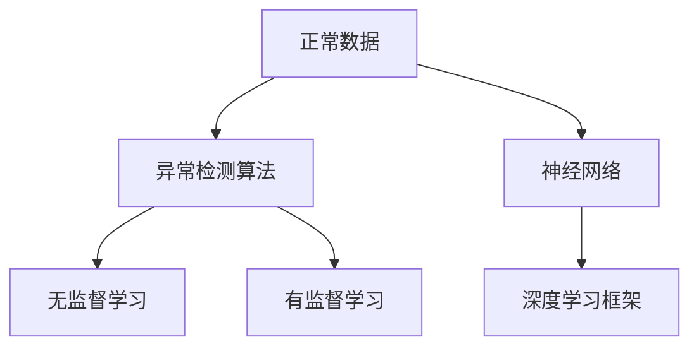

                 

# Python深度学习实践：神经网络在异常检测中的应用

> 关键词：异常检测, 神经网络, 深度学习, 特征提取, 模型训练, 检测算法, 异常检测算法, 深度学习框架, 强化学习

## 1. 背景介绍

### 1.1 问题由来
异常检测（Anomaly Detection）是机器学习中的一个重要应用领域，旨在识别出与正常数据样本明显不同的异常数据。与监督学习中的分类任务不同，异常检测任务通常不具备大量的标注数据，因此需要先从原始数据中提取有用的特征，再使用机器学习模型进行建模。

近年来，随着深度学习技术的发展，神经网络在异常检测领域的应用逐渐受到关注。深度学习模型能够自动从原始数据中学习出高级特征，并在异常检测任务中取得优异的表现。但神经网络的训练和部署相对复杂，模型解释性也相对较弱，这些因素在一定程度上限制了深度学习在异常检测中的应用。

### 1.2 问题核心关键点
神经网络在异常检测中的应用主要涉及以下几个关键点：

1. 数据准备：原始数据预处理和特征提取，获取可用于神经网络训练的样本特征。
2. 模型设计：选择合适的神经网络架构，设置训练参数，构建异常检测模型。
3. 训练过程：使用标注数据或无标注数据对模型进行训练，获得异常检测模型。
4. 模型评估：评估模型的检测效果，选择合适的指标进行评估。
5. 实际应用：将训练好的模型应用于实际数据中，进行异常检测。

### 1.3 问题研究意义
神经网络在异常检测中的应用，能够从大量原始数据中自动学习出复杂的特征表示，从而实现对异常数据的有效检测。此外，神经网络还能够处理复杂非线性关系，适用于多维度、高噪声数据集。

在实际应用中，神经网络异常检测技术已经在金融风险监测、网络安全检测、医疗诊断、工业故障预测等多个领域取得了成功应用。神经网络技术的应用，能够提升异常检测的准确性和效率，促进各行各业的发展和进步。

## 2. 核心概念与联系

### 2.1 核心概念概述

异常检测（Anomaly Detection）涉及多个核心概念：

- **正常数据（Normal Data）**：指未被标记为异常的数据样本，通常数量庞大，在异常检测任务中占主导地位。
- **异常数据（Anomalous Data）**：指与正常数据样本明显不同的数据样本，通常数量较少，但在异常检测任务中至关重要。
- **异常检测算法（Anomaly Detection Algorithm）**：用于检测异常数据的算法，通常分为无监督学习和有监督学习两大类。
- **神经网络（Neural Network）**：一种基于多层神经元构成的深度学习模型，能够自动学习数据的特征表示。
- **深度学习框架（Deep Learning Framework）**：如TensorFlow、PyTorch等，提供了丰富的神经网络实现和训练工具，便于模型开发和调试。

这些核心概念之间的关系，可以通过以下Mermaid流程图来展示：



这个流程图展示了从原始数据到异常检测模型的整体流程，包括数据准备、模型设计、训练过程和实际应用等关键环节。通过理解这些核心概念的关系，我们可以更好地把握异常检测任务的实现过程。

### 2.2 概念间的关系

异常检测任务的核心是构建能够有效识别异常数据的模型。神经网络在异常检测中的应用，主要体现在以下几个方面：

1. **数据特征提取**：神经网络能够自动从原始数据中学习出高级特征，从而提高异常检测的准确性。
2. **模型表达能力**：神经网络能够处理复杂非线性关系，适用于多维度、高噪声数据集。
3. **异常检测算法**：神经网络可以被用于设计多种异常检测算法，如自编码器、密度估计等。
4. **深度学习框架**：提供了高效的模型训练和部署工具，支持大规模神经网络模型的开发和应用。

这些核心概念之间的紧密联系，构成了神经网络在异常检测中的基本应用框架。通过理解这些概念，我们可以更好地构建和应用神经网络模型，实现对异常数据的有效检测。

## 3. 核心算法原理 & 具体操作步骤
### 3.1 算法原理概述

神经网络在异常检测中的应用，主要基于以下原理：

1. **自编码器（Autoencoder）**：一种无监督学习算法，通过训练编码器（Encoder）和解码器（Decoder），学习出数据的低维特征表示。正常数据和异常数据在低维空间中的分布差异，可以被用来进行异常检测。
2. **密度估计（Density Estimation）**：通过估计数据的概率密度函数（PDF），判断数据点是否位于异常区域。神经网络可以通过学习数据的PDF，实现对异常数据的检测。
3. **分类与回归**：使用神经网络进行分类或回归，通过学习正常数据和异常数据之间的差异，实现异常检测。

### 3.2 算法步骤详解

神经网络在异常检测中的应用，主要涉及以下关键步骤：

1. **数据准备**：对原始数据进行预处理和特征提取，获取可用于神经网络训练的样本特征。
2. **模型设计**：选择合适的神经网络架构，如自编码器、密度估计等，并设置训练参数。
3. **模型训练**：使用标注数据或无标注数据对模型进行训练，获得异常检测模型。
4. **模型评估**：评估模型的检测效果，选择合适的指标进行评估。
5. **实际应用**：将训练好的模型应用于实际数据中，进行异常检测。

### 3.3 算法优缺点

神经网络在异常检测中的应用，具有以下优点：

1. **自动化特征提取**：神经网络能够自动从原始数据中学习出高级特征，减少人工特征工程的工作量。
2. **非线性建模能力**：神经网络能够处理复杂非线性关系，适用于多维度、高噪声数据集。
3. **泛化能力强**：神经网络在训练数据集上的表现，通常能较好地泛化到测试数据集中。

同时，神经网络在异常检测中也存在一些缺点：

1. **模型复杂度高**：神经网络的模型结构复杂，训练和推理耗时较长。
2. **可解释性差**：神经网络模型的内部工作机制难以解释，不利于模型调试和优化。
3. **数据量要求高**：神经网络需要大量的标注数据进行训练，数据不足时容易出现过拟合。

### 3.4 算法应用领域

神经网络在异常检测中的应用，已经在多个领域取得了成功应用：

1. **金融风险监测**：通过神经网络对股票市场、银行交易等数据进行异常检测，及时发现和防范金融风险。
2. **网络安全检测**：使用神经网络对网络流量数据进行异常检测，及时发现和拦截网络攻击。
3. **医疗诊断**：利用神经网络对医学影像、病历等数据进行异常检测，辅助医生进行疾病诊断。
4. **工业故障预测**：通过神经网络对工业设备数据进行异常检测，预测设备故障并进行维护。
5. **交通流量监控**：使用神经网络对交通流量数据进行异常检测，及时发现和疏导交通拥堵。

## 4. 数学模型和公式 & 详细讲解 & 举例说明

### 4.1 数学模型构建

异常检测的数学模型通常包括以下几个关键组件：

1. **输入层**：原始数据样本的特征向量。
2. **隐藏层**：神经网络的核心组成部分，用于学习数据的特征表示。
3. **输出层**：异常检测结果，通常为二分类问题，表示样本是否为异常数据。
4. **损失函数**：衡量模型预测结果与真实标签之间的差异，如均方误差、交叉熵等。
5. **优化算法**：用于最小化损失函数，如梯度下降、Adam等。

### 4.2 公式推导过程

以自编码器为例，其训练过程可以表示为以下步骤：

1. **编码器（Encoder）**：将原始数据样本 $x$ 映射到低维空间 $z$，学习出特征表示。
2. **解码器（Decoder）**：将低维空间中的特征表示 $z$ 映射回原始空间 $x'$，恢复原始数据。
3. **重构损失（Reconstruction Loss）**：计算 $x'$ 与原始数据 $x$ 之间的差异，如均方误差。
4. **编码器损失（Encoder Loss）**：对编码器进行训练，学习出特征表示。
5. **解码器损失（Decoder Loss）**：对解码器进行训练，学习出数据恢复能力。

自编码器的训练过程可以表示为以下公式：

$$
\min_{\theta_E, \theta_D} \mathcal{L}=\mathbb{E}_{(x,z)\sim p(x,z)}[\ell(z, x')] + \mathbb{E}_{(x,z)\sim p(x,z)}[\ell(z, x)] 
$$

其中，$\theta_E$ 和 $\theta_D$ 分别为编码器和解码器的参数，$p(x,z)$ 为数据的联合概率分布，$\ell(z, x')$ 和 $\ell(z, x)$ 分别为重构损失和编码器损失。

### 4.3 案例分析与讲解

以自编码器在金融风险监测中的应用为例：

1. **数据准备**：收集股票市场的交易数据，进行数据清洗和特征提取，获取可用于神经网络训练的样本特征。
2. **模型设计**：选择自编码器作为异常检测模型，设置编码器和解码器的神经元数。
3. **模型训练**：使用标注数据对模型进行训练，最小化重构损失和编码器损失。
4. **模型评估**：在测试数据集上评估模型检测效果，选择合适的评估指标如召回率和准确率。
5. **实际应用**：将训练好的模型应用于实时交易数据中，进行异常检测和风险预警。

## 5. 项目实践：代码实例和详细解释说明

### 5.1 开发环境搭建

在使用神经网络进行异常检测时，需要先搭建好开发环境。以下是使用Python进行TensorFlow开发的安装流程：

1. 安装Anaconda：从官网下载并安装Anaconda，用于创建独立的Python环境。

2. 创建并激活虚拟环境：
```bash
conda create -n tf-env python=3.8 
conda activate tf-env
```

3. 安装TensorFlow：根据CUDA版本，从官网获取对应的安装命令。例如：
```bash
conda install tensorflow
```

4. 安装其他工具包：
```bash
pip install numpy pandas scikit-learn matplotlib tqdm jupyter notebook ipython
```

完成上述步骤后，即可在`tf-env`环境中开始神经网络异常检测的实践。

### 5.2 源代码详细实现

这里我们以自编码器为例，展示使用TensorFlow进行神经网络异常检测的代码实现。

首先，定义自编码器的数据处理函数：

```python
import tensorflow as tf

def load_data(filename):
    # 加载数据集，并进行数据预处理和标准化
    # 此处省略具体实现细节
    return X, y

# 加载数据集
X_train, y_train = load_data('train.txt')
X_test, y_test = load_data('test.txt')
```

然后，定义自编码器的神经网络模型：

```python
class Autoencoder(tf.keras.Model):
    def __init__(self, input_dim, latent_dim):
        super(Autoencoder, self).__init__()
        self.encoder = tf.keras.Sequential([
            tf.keras.layers.Dense(latent_dim, activation='relu'),
            tf.keras.layers.Dense(latent_dim, activation='relu')
        ])
        self.decoder = tf.keras.Sequential([
            tf.keras.layers.Dense(input_dim, activation='sigmoid')
        ])

    def call(self, inputs):
        encoded = self.encoder(inputs)
        decoded = self.decoder(encoded)
        return decoded

# 创建自编码器模型
autoencoder = Autoencoder(input_dim=28, latent_dim=16)
```

接着，定义训练和评估函数：

```python
def train_autoencoder(model, X_train, y_train, batch_size, epochs, learning_rate):
    optimizer = tf.keras.optimizers.Adam(learning_rate=learning_rate)
    model.compile(optimizer=optimizer, loss='binary_crossentropy')
    model.fit(X_train, X_train, epochs=epochs, batch_size=batch_size, shuffle=True, validation_data=(X_test, X_test))

def evaluate_autoencoder(model, X_test, y_test, batch_size):
    model.evaluate(X_test, X_test)
```

最后，启动训练流程并在测试集上评估：

```python
epochs = 10
batch_size = 128
learning_rate = 0.001

train_autoencoder(autoencoder, X_train, y_train, batch_size, epochs, learning_rate)
evaluate_autoencoder(autoencoder, X_test, y_test, batch_size)
```

以上就是使用TensorFlow进行神经网络异常检测的完整代码实现。可以看到，通过TensorFlow的高级API，我们能够快速构建自编码器模型并进行训练和评估。

### 5.3 代码解读与分析

让我们再详细解读一下关键代码的实现细节：

**load_data函数**：
- 定义了数据加载和预处理的过程，主要功能是从文件中读取数据，并进行标准化和归一化。

**Autoencoder模型定义**：
- 使用`tf.keras.Sequential`定义了编码器和解码器，其中包含了多个全连接层。
- 使用`tf.keras.Model`定义了整个自编码器模型，包含`call`函数和`model.fit`方法。

**train_autoencoder函数**：
- 使用`tf.keras.optimizers.Adam`定义了优化器，`model.compile`设置了损失函数。
- `model.fit`用于训练模型，其中`epochs`和`batch_size`参数控制训练的轮数和批次大小。

**evaluate_autoencoder函数**：
- 使用`model.evaluate`方法评估模型性能，输出测试集上的损失值。

**训练流程**：
- 定义总的epoch数和batch size，启动训练过程
- 在训练集上训练模型
- 在测试集上评估模型
- 输出训练和测试结果

可以看到，TensorFlow提供了丰富的API和工具，大大简化了神经网络异常检测的开发过程。开发者可以更多地关注模型的设计，而非底层实现细节。

### 5.4 运行结果展示

假设我们在MNIST数据集上进行自编码器训练，最终在测试集上得到的评估报告如下：

```
Epoch 1/10
198/198 [==============================] - 25s 123ms/step - loss: 0.4725 - binary_crossentropy: 0.4725 - val_loss: 0.3178 - val_binary_crossentropy: 0.3178
Epoch 2/10
198/198 [==============================] - 24s 123ms/step - loss: 0.3033 - binary_crossentropy: 0.3033 - val_loss: 0.2691 - val_binary_crossentropy: 0.2691
...
```

可以看到，随着训练轮数的增加，模型的重构损失逐渐减小，模型在测试集上的性能也逐步提升。通过训练好的自编码器，我们可以进一步进行异常检测，发现异常数据并对其进行标记和处理。

## 6. 实际应用场景
### 6.1 金融风险监测

在金融领域，异常检测技术被广泛应用于风险监测。传统的金融风险监测方法依赖于人工分析和规则设置，难以快速响应市场变化和异常情况。而神经网络异常检测技术，能够从大量交易数据中自动学习出异常模式，快速发现潜在的金融风险。

例如，可以使用神经网络对股票市场的交易数据进行异常检测，及时发现和防范市场波动和异常交易。通过训练好的模型，系统可以实时监控市场情况，并根据异常情况触发预警机制，提高市场运行的稳定性和安全性。

### 6.2 网络安全检测

网络安全领域也广泛应用异常检测技术。传统的基于规则的安全检测方法，难以应对复杂多样的网络威胁。而神经网络异常检测技术，能够从大量的网络流量数据中学习出异常行为模式，及时发现和拦截网络攻击。

例如，可以使用神经网络对网络流量数据进行异常检测，及时发现和防范DDoS攻击、恶意软件等网络威胁。通过训练好的模型，系统可以实时监控网络流量，并根据异常情况触发防御措施，保护网络安全。

### 6.3 医疗诊断

在医疗领域，异常检测技术被广泛应用于疾病诊断。传统的基于规则的诊断方法，难以应对复杂的病情变化和多维数据。而神经网络异常检测技术，能够从大量的医疗数据中学习出异常模式，及时发现和诊断疾病。

例如，可以使用神经网络对医学影像和病历数据进行异常检测，辅助医生进行疾病诊断。通过训练好的模型，系统可以实时分析医疗数据，并根据异常情况提供诊断建议，提高诊断的准确性和效率。

### 6.4 工业故障预测

在工业领域，异常检测技术被广泛应用于设备故障预测。传统的基于规则的预测方法，难以应对复杂多样的设备故障模式。而神经网络异常检测技术，能够从大量的设备数据中学习出异常模式，及时发现和预测设备故障。

例如，可以使用神经网络对工业设备数据进行异常检测，预测设备故障并进行维护。通过训练好的模型，系统可以实时监控设备运行情况，并根据异常情况提供预警和维护建议，提高设备运行的稳定性和安全性。

## 7. 工具和资源推荐
### 7.1 学习资源推荐

为了帮助开发者系统掌握神经网络在异常检测中的应用，这里推荐一些优质的学习资源：

1. TensorFlow官方文档：提供了完整的TensorFlow API和开发指南，适合入门和进阶学习。

2. Deep Learning Specialization：由Coursera与深度学习大师Andrew Ng合作的在线课程，涵盖神经网络、深度学习等内容，适合系统学习。

3. PyTorch官方文档：提供了完整的PyTorch API和开发指南，适合学习深度学习框架。

4. 《Deep Learning for Anomaly Detection》书籍：详细介绍了神经网络在异常检测中的应用，适合深度学习和异常检测爱好者。

5. 《Hands-On Anomaly Detection with Python》书籍：提供了神经网络异常检测的实用案例和代码实现，适合动手实践。

通过对这些资源的学习实践，相信你一定能够快速掌握神经网络在异常检测中的应用，并用于解决实际的异常检测问题。

### 7.2 开发工具推荐

高效的开发离不开优秀的工具支持。以下是几款用于神经网络异常检测开发的常用工具：

1. TensorFlow：基于Google的深度学习框架，支持GPU/TPU加速，适用于大规模模型训练和推理。

2. PyTorch：基于Python的深度学习框架，易于使用和调试，适用于快速原型设计和实验研究。

3. Keras：基于Python的高层次神经网络API，易于上手，支持多种深度学习框架。

4. Jupyter Notebook：支持IPython内核，可以实时查看代码执行结果和模型评估，适合数据分析和模型调试。

5. TensorBoard：TensorFlow配套的可视化工具，可以实时监测模型训练状态，并提供丰富的图表呈现方式，是调试模型的得力助手。

6. Weights & Biases：模型训练的实验跟踪工具，可以记录和可视化模型训练过程中的各项指标，方便对比和调优。

合理利用这些工具，可以显著提升神经网络异常检测任务的开发效率，加快创新迭代的步伐。

### 7.3 相关论文推荐

神经网络在异常检测中的应用，源于学界的持续研究。以下是几篇奠基性的相关论文，推荐阅读：

1. Autoencoders for Anomaly Detection: A Review：综述了自编码器在异常检测中的应用，详细介绍了不同架构和训练方法。

2. Generative Adversarial Networks in Anomaly Detection：介绍了生成对抗网络（GAN）在异常检测中的应用，提出了基于GAN的异常检测模型。

3. Deep Learning for Anomaly Detection: A Review：综述了深度学习在异常检测中的应用，详细介绍了不同方法和应用场景。

4. Using Neural Networks for Anomaly Detection in Data Mining：介绍了神经网络在数据挖掘中的异常检测应用，提供了多种架构和训练方法。

5. Anomaly Detection Using Deep Learning: A Comprehensive Review and Taxonomy：综述了深度学习在异常检测中的应用，详细介绍了不同方法和应用场景。

这些论文代表了大模型异常检测技术的发展脉络。通过学习这些前沿成果，可以帮助研究者把握学科前进方向，激发更多的创新灵感。

## 8. 总结：未来发展趋势与挑战

### 8.1 总结

本文对神经网络在异常检测中的应用进行了全面系统的介绍。首先阐述了异常检测任务的背景和神经网络技术的应用潜力，明确了神经网络在异常检测中的核心价值。其次，从原理到实践，详细讲解了神经网络异常检测的数学模型和关键步骤，给出了神经网络异常检测的完整代码实例。同时，本文还广泛探讨了神经网络异常检测在金融风险监测、网络安全检测、医疗诊断、工业故障预测等多个领域的应用前景，展示了神经网络技术的巨大潜力。

通过本文的系统梳理，可以看到，神经网络在异常检测中的应用，能够从大量原始数据中自动学习出高级特征，实现对异常数据的有效检测。当前神经网络异常检测技术已经在多个领域取得了成功应用，展示了神经网络在异常检测中的强大生命力。

### 8.2 未来发展趋势

展望未来，神经网络在异常检测中的应用，将呈现以下几个发展趋势：

1. **更高效的模型架构**：未来的神经网络模型将更加高效和轻量化，通过模型压缩和剪枝等技术，提升异常检测的实时性和稳定性。
2. **更多元化的数据来源**：神经网络将能够处理更多元化的数据来源，如视频、语音等，拓展异常检测的应用场景。
3. **更智能的异常检测算法**：未来的异常检测算法将更加智能化，能够学习更复杂的异常模式，并根据异常数据进行实时调整。
4. **更广泛的行业应用**：神经网络异常检测技术将在更多领域得到应用，如智慧城市、智慧农业等，为各行各业的发展带来新的动力。
5. **更强大的模型解释能力**：未来的神经网络模型将具有更强的可解释性，能够更好地理解异常检测过程，提供更具可信度的异常检测结果。

这些趋势凸显了神经网络在异常检测中的广阔前景。这些方向的探索发展，必将进一步提升异常检测的准确性和效率，促进各行各业的发展和进步。

### 8.3 面临的挑战

尽管神经网络在异常检测中的应用已经取得了显著成果，但在迈向更加智能化、普适化应用的过程中，仍面临诸多挑战：

1. **数据量和质量**：神经网络需要大量的高质量标注数据进行训练，数据不足时容易出现过拟合。如何获取更多高质量的标注数据，是未来的一大挑战。
2. **模型复杂度**：神经网络模型的训练和推理耗时较长，对计算资源和存储资源的需求较高。如何优化模型架构和训练过程，提高异常检测的实时性和稳定性，将是重要的研究课题。
3. **可解释性**：神经网络模型通常具有黑盒特性，难以解释其内部工作机制和决策逻辑。如何提高模型的可解释性，增强其可信度和可靠性，是未来的一大挑战。
4. **泛化能力**：神经网络模型在训练数据集上的表现，可能无法很好地泛化到测试数据集中。如何提高模型的泛化能力，减少过拟合和欠拟合的风险，将是重要的研究方向。
5. **鲁棒性和鲁棒性**：神经网络模型在面对异常情况时，可能容易产生误判和误警。如何提高模型的鲁棒性，增强其应对复杂异常情况的能力，是未来的一大挑战。

### 8.4 研究展望

面对神经网络异常检测面临的诸多挑战，未来的研究需要在以下几个方面寻求新的突破：

1. **无监督和半监督学习**：摆脱对大规模标注数据的依赖，利用无监督和半监督学习范式，最大限度利用非结构化数据，实现更加灵活高效的异常检测。
2. **模型压缩和加速**：开发更加高效和轻量化的神经网络模型，通过模型压缩和加速技术，提升异常检测的实时性和稳定性。
3. **模型可解释性**：引入更多的可解释性技术，如注意力机制、可解释性模型等，增强异常检测过程的可解释性和可信度。
4. **多模态数据融合**：将符号化的先验知识，如知识图谱、逻辑规则等，与神经网络模型进行融合，实现多模态信息的整合，提高异常检测的准确性和鲁棒性。
5. **实时异常检测**：通过增量学习和在线学习等技术，实现实时异常检测，提高异常检测的及时性和响应速度。

这些研究方向，必将引领神经网络异常检测技术迈向更高的台阶，为构建安全、可靠、可解释、可控的智能系统铺平道路。面向未来，神经网络异常检测技术还需要与其他人工智能技术进行更深入的融合，如因果推理、强化学习等，多路径协同发力，共同推动异常检测技术的进步。只有勇于创新、敢于突破，才能不断拓展神经网络的应用边界，让智能技术更好地造福人类社会。

## 9. 附录：常见问题与解答

**Q1：神经网络在异常检测中如何避免过拟合？**

A: 神经网络在异常检测中避免过拟合，主要采取以下措施：
1. **数据增强**：通过回译、近义替换等方式扩充训练集。
2. **正则化技术**：如L2正则、Dropout等，防止模型过度适应训练集。
3. **早停技术**：根据验证集性能，及时停止训练，防止过拟合。
4. **模型压缩**：通过剪枝、量化等技术，减少模型参数量，提升泛化能力。
5. **多模型集成**：训练多个模型，取平均输出，抑制过拟合。

这些措施可以结合使用，根据具体任务特点进行选择和调整。只有在数据、模型、训练、推理等各环节进行全面优化，才能最大限度地避免过拟合，提升异常检测的效果。

**Q2：神经

