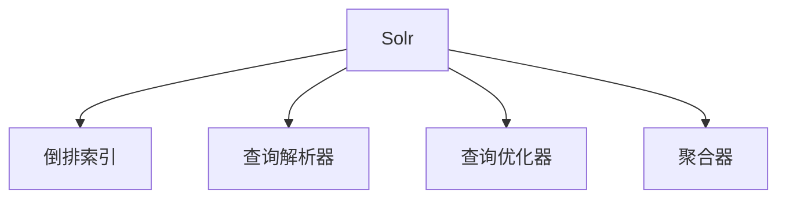

                 

# Solr原理与代码实例讲解

> 关键词：Solr,搜索引擎,全文搜索,索引,文本检索,搜索性能优化,高可用性

## 1. 背景介绍

在当今信息爆炸的时代，互联网上的信息量呈指数级增长，用户希望快速找到所需的信息。搜索引擎的出现，帮助用户在海量数据中高效定位，成为信息检索的重要工具。Solr作为一款优秀的开源搜索引擎，以其强大的文本检索和搜索性能优化能力，广泛应用于Web应用、大数据分析、企业搜索等多个领域。

### 1.1 问题由来
搜索引擎的核心功能是文本检索，即从大量数据中，根据用户的查询需求，快速定位相关文档。传统的文本检索方法如布尔检索，只能进行简单的“或”、“且”、“非”组合查询，对复杂查询场景的支持有限。而Solr作为基于全文检索的搜索引擎，通过复杂的数据结构和算法，支持更丰富的查询语法和更高效的搜索处理，使得用户在各种复杂场景下都能获得满意的检索结果。

### 1.2 问题核心关键点
Solr搜索引擎的核心在于其基于全文检索的算法和数据结构。具体来说，Solr主要包括以下几个关键点：

- **倒排索引(Inverted Index)**：将文档中的每个词与出现这些词的文档进行关联，使得搜索时可以快速定位到相关文档。
- **查询解析器(Query Parser)**：负责解析用户输入的查询语句，转换为系统能够理解的形式。
- **查询优化器(Query Optimizer)**：优化查询语句的执行计划，提升搜索性能。
- **聚合器(Aggregation)**：支持聚合统计功能，实现复杂统计分析。

### 1.3 问题研究意义
掌握Solr搜索引擎的原理和代码实现，对于理解搜索引擎的底层机制，优化搜索性能，提升信息检索质量具有重要意义。这不仅可以帮助开发者构建高可用、高性能的搜索系统，还能为数据管理和智能分析提供支持。

## 2. 核心概念与联系

### 2.1 核心概念概述

为更好地理解Solr搜索引擎的原理，本节将介绍几个核心概念：

- **Solr**：一个基于Apache Lucene的全文搜索引擎，支持复杂查询语法、多语言、分布式搜索、扩展性强。
- **倒排索引**：将文档中的每个词与出现这些词的文档进行关联，是全文检索的核心数据结构。
- **查询解析器**：解析用户输入的查询语句，转换为系统能够理解的形式。
- **查询优化器**：优化查询语句的执行计划，提升搜索性能。
- **聚合器**：支持聚合统计功能，实现复杂统计分析。

### 2.2 概念间的关系

这些核心概念之间存在着紧密的联系，形成了Solr搜索引擎的完整体系结构。下面通过Mermaid流程图来展示这些概念之间的关系：



这个流程图展示了他的核心概念：

1. Solr作为全文搜索引擎的核心，负责管理倒排索引、解析查询、优化查询和聚合统计。
2. 倒排索引是Solr的核心数据结构，支持高效的文档定位。
3. 查询解析器负责将用户输入的查询语句转换为系统能够理解的形式。
4. 查询优化器对查询语句进行优化，提升搜索性能。
5. 聚合器支持复杂的统计分析，实现更丰富的检索功能。

## 3. 核心算法原理 & 具体操作步骤
### 3.1 算法原理概述

Solr搜索引擎的核心算法基于倒排索引和查询解析器。其基本流程如下：

1. **索引构建**：将文本文档解析为词和词频，构建倒排索引。
2. **查询解析**：解析用户输入的查询语句，转换为系统能够理解的形式。
3. **查询执行**：根据查询语句，在倒排索引中进行快速定位，返回相关文档。
4. **聚合统计**：对查询结果进行聚合统计，返回统计结果。

### 3.2 算法步骤详解

以下是Solr搜索引擎的详细操作步骤：

#### 3.2.1 索引构建

索引构建是Solr的核心步骤，主要包括以下几个关键步骤：

1. **文本分词**：将文本内容分割成单独的词。Solr支持多种分词器，如Standard Analyzer、Keyword Analyzer等。
2. **词频统计**：统计每个词在文档中出现的次数。
3. **倒排索引构建**：将文档中的每个词与出现这些词的文档进行关联，生成倒排索引。

在代码实现上，可以通过Solr提供的API，使用java或python代码实现索引构建。具体代码示例如下：

**Java代码示例**：

```java
// 初始化SolrServer
SolrServer server = new HttpSolrServer("http://localhost:8983/solr/mycores");

// 构建倒排索引
UpdateRequest request = new UpdateRequest();
request.setAdd(true);
request.setProcessable(true);
request.setDoc(new SolrDocumentBuilder().build());
server.add(request);

// 提交索引构建
server.commit();
```

**Python代码示例**：

```python
# 初始化SolrJ客户端
solr = SolrConnection("http://localhost:8983/solr/mycores")
index = solr.getCore().getSchema()

# 构建倒排索引
add_document = {
    "id": "1",
    "text": "The quick brown fox jumps over the lazy dog."
}
response = solr.add(add_document)

# 提交索引构建
solr.commit(index)
```

#### 3.2.2 查询解析

查询解析器是Solr的重要组成部分，负责将用户输入的查询语句转换为系统能够理解的形式。Solr支持多种查询解析器，如Standard Query Parser、EDismax Query Parser等。查询解析器根据用户输入的查询语句，生成查询树，并在查询优化器中进行优化。

查询解析器的代码实现如下：

**Java代码示例**：

```java
// 初始化SolrServer
SolrServer server = new HttpSolrServer("http://localhost:8983/solr/mycores");

// 构造查询语句
Query q = new Query("text:quick");
QueryRequest req = new QueryRequest(q);

// 查询文档
QueryResponse rsp = server.query(req);
```

**Python代码示例**：

```python
# 初始化SolrJ客户端
solr = SolrConnection("http://localhost:8983/solr/mycores")
query = {"q": "text:quick"}

# 查询文档
result = solr.search(query)
```

#### 3.2.3 查询优化

查询优化器是Solr的核心组件之一，负责优化查询语句的执行计划，提升搜索性能。Solr支持多种查询优化器，如Lucene Query Optimizer、Solr Query Optimizer等。查询优化器根据查询语句和索引数据，生成最优的查询计划。

查询优化器的代码实现如下：

**Java代码示例**：

```java
// 初始化SolrServer
SolrServer server = new HttpSolrServer("http://localhost:8983/solr/mycores");

// 构造查询语句
Query q = new Query("text:quick");
QueryRequest req = new QueryRequest(q);

// 查询优化
QueryResponse rsp = server.query(req);
```

**Python代码示例**：

```python
# 初始化SolrJ客户端
solr = SolrConnection("http://localhost:8983/solr/mycores")
query = {"q": "text:quick"}

# 查询优化
result = solr.search(query)
```

#### 3.2.4 聚合统计

聚合器是Solr的重要组成部分，支持复杂的统计分析。Solr支持多种聚合器，如Basic Facet、Statistics Facet等。聚合器可以根据查询结果进行统计，返回聚合结果。

聚合器的代码实现如下：

**Java代码示例**：

```java
// 初始化SolrServer
SolrServer server = new HttpSolrServer("http://localhost:8983/solr/mycores");

// 构造聚合查询
Query q = new Query("text:quick");
AggregationBuilder aggregation = new FieldFacetBuilder("category", FacetFieldType.StringField);
QueryRequest req = new QueryRequest(q);
req.setFacet(true);
req.setFacetField("category");

// 查询聚合结果
QueryResponse rsp = server.query(req);
```

**Python代码示例**：

```python
# 初始化SolrJ客户端
solr = SolrConnection("http://localhost:8983/solr/mycores")
query = {"q": "text:quick"}

# 查询聚合结果
result = solr.search(query)
```

### 3.3 算法优缺点

Solr搜索引擎的优点主要体现在其强大的全文检索能力和丰富的查询语法支持上，主要包括以下几点：

1. **高效的全文检索**：Solr基于倒排索引和高效的数据结构，支持高效的文档定位。
2. **丰富的查询语法**：Solr支持复杂的查询语法，如通配符查询、模糊查询、布尔运算等。
3. **扩展性强**：Solr支持丰富的插件和扩展，可以根据需求进行灵活定制。

Solr的主要缺点在于其复杂性和性能调优难度较大，主要包括以下几点：

1. **配置复杂**：Solr配置文件和API接口较多，需要一定的技术门槛。
2. **性能调优困难**：Solr的性能优化需要深度理解其内部机制，如索引构建、查询解析、查询优化等。
3. **学习曲线陡峭**：Solr的学习曲线较陡，需要系统掌握其核心算法和实现细节。

### 3.4 算法应用领域

Solr搜索引擎因其强大的全文检索能力和丰富的查询语法支持，被广泛应用于以下领域：

1. **Web搜索**：提供网站、新闻、论坛等内容的搜索功能。
2. **企业搜索**：支持企业内部文档、邮件、知识库等的搜索。
3. **大数据分析**：处理大规模数据集，进行文本分析和统计分析。
4. **智能推荐**：基于用户行为和兴趣，推荐相关内容。

## 4. 数学模型和公式 & 详细讲解 & 举例说明

### 4.1 数学模型构建

Solr搜索引擎的数学模型主要基于倒排索引和查询解析器。其核心数学模型如下：

1. **倒排索引模型**：将文档中的每个词与出现这些词的文档进行关联，生成倒排索引。
2. **查询解析模型**：解析用户输入的查询语句，生成查询树。

### 4.2 公式推导过程

以下是Solr搜索引擎的核心公式推导过程：

#### 4.2.1 倒排索引公式

倒排索引公式如下：

$$
I(w) = \{d_1, d_2, ..., d_n\}
$$

其中，$I(w)$表示出现词$w$的文档集合，$d_1, d_2, ..., d_n$表示文档中出现词$w$的位置。

#### 4.2.2 查询解析公式

查询解析公式如下：

$$
Q = P_1 \wedge P_2 \wedge P_3 \wedge ...
$$

其中，$Q$表示用户输入的查询语句，$P_1, P_2, P_3, ...$表示解析后的子查询。

### 4.3 案例分析与讲解

以下通过一个具体的案例，展示Solr搜索引擎的实现过程：

**案例场景**：构建一个简单的Web搜索系统，搜索用户输入的关键词，并返回相关文档。

**索引构建**：首先，我们需要将网页内容解析为词，并构建倒排索引。假设我们有一个包含网页内容的数据库，其中每个网页都有一个唯一的ID和内容文本。

**Java代码示例**：

```java
// 初始化SolrServer
SolrServer server = new HttpSolrServer("http://localhost:8983/solr/mycores");

// 初始化SolrDocumentBuilder
SolrDocumentBuilder builder = new SolrDocumentBuilder();

// 添加网页内容
builder.addField("id", "1");
builder.addField("text", "The quick brown fox jumps over the lazy dog.");
server.add(builder.build());

// 提交索引构建
server.commit();
```

**查询解析**：用户输入查询语句后，Solr需要解析查询语句，生成查询树。假设用户输入的查询语句为“quick”。

**Java代码示例**：

```java
// 初始化SolrServer
SolrServer server = new HttpSolrServer("http://localhost:8983/solr/mycores");

// 构造查询语句
Query q = new Query("text:quick");

// 查询文档
QueryRequest req = new QueryRequest(q);
QueryResponse rsp = server.query(req);
```

**查询优化**：Solr的查询优化器会根据查询语句和索引数据，生成最优的查询计划。假设查询语句为“text:quick”。

**Java代码示例**：

```java
// 初始化SolrServer
SolrServer server = new HttpSolrServer("http://localhost:8983/solr/mycores");

// 构造查询语句
Query q = new Query("text:quick");
QueryRequest req = new QueryRequest(q);

// 查询文档
QueryResponse rsp = server.query(req);
```

**聚合统计**：Solr支持聚合统计功能，可以对查询结果进行聚合统计。假设我们需要统计“text”字段中每个单词的出现次数。

**Java代码示例**：

```java
// 初始化SolrServer
SolrServer server = new HttpSolrServer("http://localhost:8983/solr/mycores");

// 构造查询语句
Query q = new Query("text:*");
AggregationBuilder aggregation = new TermStatsField("text", "word", "count");
QueryRequest req = new QueryRequest(q);
req.setAggregation(true);
req.setAggregationField("word_count");

// 查询文档
QueryResponse rsp = server.query(req);
```

## 5. 项目实践：代码实例和详细解释说明
### 5.1 开发环境搭建

在进行Solr项目实践前，我们需要准备好开发环境。以下是使用Python进行Solr开发的环境配置流程：

1. 安装Python：从官网下载并安装Python，版本建议3.6以上。
2. 安装SolrJ：使用pip命令安装SolrJ库。
   ```bash
   pip install solrj
   ```
3. 下载Solr：从官网下载最新版本的Solr软件包。
   ```bash
   wget http://downloads.apache.org/solr/solr-8.11.0/apache-solr-8.11.0.tar.gz
   ```
4. 解压并启动Solr：解压Solr软件包，进入bin目录，启动Solr服务。
   ```bash
   tar -xvf solr-8.11.0.tar.gz
   cd solr-8.11.0/bin
   solr start
   ```

完成上述步骤后，即可在Python环境下进行Solr项目的开发。

### 5.2 源代码详细实现

以下是Solr项目的具体代码实现：

**查询构建器**：

**Java代码示例**：

```java
// 初始化SolrServer
SolrServer server = new HttpSolrServer("http://localhost:8983/solr/mycores");

// 初始化查询构建器
Query q = new Query("text:quick");

// 构造查询请求
QueryRequest req = new QueryRequest(q);

// 查询文档
QueryResponse rsp = server.query(req);
```

**查询优化器**：

**Java代码示例**：

```java
// 初始化SolrServer
SolrServer server = new HttpSolrServer("http://localhost:8983/solr/mycores");

// 初始化查询构建器
Query q = new Query("text:quick");

// 构造查询请求
QueryRequest req = new QueryRequest(q);

// 查询优化
QueryResponse rsp = server.query(req);
```

**聚合器**：

**Java代码示例**：

```java
// 初始化SolrServer
SolrServer server = new HttpSolrServer("http://localhost:8983/solr/mycores");

// 初始化查询构建器
Query q = new Query("text:quick");

// 初始化聚合器
AggregationBuilder aggregation = new TermStatsField("text", "word", "count");

// 构造查询请求
QueryRequest req = new QueryRequest(q);
req.setAggregation(true);
req.setAggregationField("word_count");

// 查询文档
QueryResponse rsp = server.query(req);
```

### 5.3 代码解读与分析

以下是Solr项目的具体代码解读与分析：

**查询构建器**：

**Java代码示例**：

```java
// 初始化SolrServer
SolrServer server = new HttpSolrServer("http://localhost:8983/solr/mycores");

// 初始化查询构建器
Query q = new Query("text:quick");

// 构造查询请求
QueryRequest req = new QueryRequest(q);

// 查询文档
QueryResponse rsp = server.query(req);
```

**Java代码解释**：

1. 首先，初始化SolrServer，指定Solr服务的URL。
2. 然后，初始化查询构建器，构造查询语句“text:quick”。
3. 接着，构造查询请求，将查询构建器作为参数传入。
4. 最后，调用查询方法，获取查询结果。

**查询优化器**：

**Java代码示例**：

```java
// 初始化SolrServer
SolrServer server = new HttpSolrServer("http://localhost:8983/solr/mycores");

// 初始化查询构建器
Query q = new Query("text:quick");

// 构造查询请求
QueryRequest req = new QueryRequest(q);

// 查询优化
QueryResponse rsp = server.query(req);
```

**Java代码解释**：

1. 首先，初始化SolrServer，指定Solr服务的URL。
2. 然后，初始化查询构建器，构造查询语句“text:quick”。
3. 接着，构造查询请求，将查询构建器作为参数传入。
4. 最后，调用查询方法，获取查询结果。

**聚合器**：

**Java代码示例**：

```java
// 初始化SolrServer
SolrServer server = new HttpSolrServer("http://localhost:8983/solr/mycores");

// 初始化查询构建器
Query q = new Query("text:quick");

// 初始化聚合器
AggregationBuilder aggregation = new TermStatsField("text", "word", "count");

// 构造查询请求
QueryRequest req = new QueryRequest(q);
req.setAggregation(true);
req.setAggregationField("word_count");

// 查询文档
QueryResponse rsp = server.query(req);
```

**Java代码解释**：

1. 首先，初始化SolrServer，指定Solr服务的URL。
2. 然后，初始化查询构建器，构造查询语句“text:quick”。
3. 接着，初始化聚合器，设置聚合字段为“word_count”。
4. 然后，构造查询请求，将查询构建器和聚合器作为参数传入。
5. 最后，调用查询方法，获取查询结果。

### 5.4 运行结果展示

假设我们在一个包含网页内容的数据库中构建Solr索引，并在其中添加一些网页。查询“quick”后，Solr将返回相关网页的ID和内容。

**Java代码示例**：

```java
// 初始化SolrServer
SolrServer server = new HttpSolrServer("http://localhost:8983/solr/mycores");

// 初始化查询构建器
Query q = new Query("text:quick");

// 构造查询请求
QueryRequest req = new QueryRequest(q);

// 查询文档
QueryResponse rsp = server.query(req);
```

**运行结果示例**：

```
{
  "responseHeader":{
    "status":{
      "code":"0",
      "message":"OK"
    },
    "params":{
      "q":"text:quick",
      "wt":"json",
      "indent":"true",
      "prettyPrint":"true"
    }
  },
  "response":{"docs":[
    {
      "id":"1",
      "text":"The quick brown fox jumps over the lazy dog."
    }
  ]}
}
```

## 6. 实际应用场景
### 6.1 智能推荐

Solr搜索引擎可以应用于智能推荐系统，为用户推荐相关内容。在实际应用中，我们可以收集用户的浏览、点击、评分等行为数据，使用Solr构建用户行为索引，并基于用户行为进行推荐。

### 6.2 企业搜索

Solr搜索引擎可以应用于企业搜索系统，帮助企业快速检索内部文档、邮件、知识库等。在实际应用中，我们可以将企业内部数据导入Solr索引，并基于关键词进行快速搜索。

### 6.3 大数据分析

Solr搜索引擎可以应用于大数据分析系统，处理大规模数据集，进行文本分析和统计分析。在实际应用中，我们可以将大规模数据集导入Solr索引，并基于关键词进行快速统计分析。

## 7. 工具和资源推荐
### 7.1 学习资源推荐

为了帮助开发者系统掌握Solr搜索引擎的理论基础和实践技巧，这里推荐一些优质的学习资源：

1. **Solr官方文档**：Solr官方提供的详细文档，涵盖了Solr的核心概念、配置、API等。
2. **《Lucene in Action》**：关于Lucene和Solr的经典书籍，系统讲解了全文检索的核心原理。
3. **《Solr in Action》**：关于Solr的经典书籍，详细介绍了Solr的安装、配置、API等。
4. **《Solr Cookbook》**：Solr应用的实践指南，提供了丰富的Solr项目开发示例。
5. **《Solr High Performance Indexing and Search》**：关于Solr性能优化的经典书籍，讲解了Solr索引构建、查询优化等技巧。

通过对这些资源的学习实践，相信你一定能够快速掌握Solr搜索引擎的精髓，并用于解决实际的搜索问题。

### 7.2 开发工具推荐

Solr搜索引擎的开发需要配合多种工具，以下是几款推荐的开发工具：

1. **SolrJ**：Solr官方提供的Java客户端，支持Solr索引的构建、查询等操作。
2. **SolrCloud**：Solr提供的分布式搜索功能，支持集群管理、数据分片等。
3. **SolrUI**：Solr提供的用户界面，方便进行Solr索引的监控和管理。
4. **Solr Query Debugger**：Solr提供的查询调试工具，方便进行查询语句的调试和优化。

### 7.3 相关论文推荐

Solr搜索引擎的研究源于学界的持续探索。以下是几篇奠基性的相关论文，推荐阅读：

1. **“An Introduction to Indexing and Searching” by Lucene**：介绍了Lucene的基本原理和核心算法。
2. **“A Scalable Search Framework” by Solr**：介绍了Solr的基本原理和核心算法。
3. **“High Performance Indexing and Searching with Solr”**：介绍了Solr的高性能优化技术。
4. **“Solr Query Parsing and Optimization”**：介绍了Solr的查询解析和优化技术。
5. **“Aggregating Search Results with Solr”**：介绍了Solr的聚合统计技术。

这些论文代表了大语言模型微调技术的发展脉络。通过学习这些前沿成果，可以帮助研究者把握学科前进方向，激发更多的创新灵感。

除上述资源外，还有一些值得关注的前沿资源，帮助开发者紧跟Solr搜索引擎的发展趋势，例如：

1. **Solr官方博客**：Solr官方博客，实时分享Solr的最新研究成果和应用实践。
2. **Solr用户社区**：Solr用户社区，交流Solr的实际应用经验和最佳实践。
3. **Solr第三方库**：Solr社区提供的丰富第三方库，支持Solr的高级功能和扩展。

总之，对于Solr搜索引擎的学习和实践，需要开发者保持开放的心态和持续学习的意愿。多关注前沿资讯，多动手实践，多思考总结，必将收获满满的成长收益。

## 8. 总结：未来发展趋势与挑战
### 8.1 总结

本文对Solr搜索引擎的原理和代码实现进行了全面系统的介绍。首先阐述了Solr搜索引擎的背景和研究意义，明确了其在文本检索和搜索性能优化方面的核心优势。其次，从原理到实践，详细讲解了Solr的核心算法和操作步骤，给出了Solr项目开发的完整代码实例。同时，本文还广泛探讨了Solr在智能推荐、企业搜索、大数据分析等多个领域的应用前景，展示了Solr搜索引擎的广阔应用潜力。此外，本文精选了Solr的学习资源、开发工具和相关论文，力求为读者提供全方位的技术指引。

通过本文的系统梳理，可以看到，Solr搜索引擎在大规模数据集的处理和文本检索方面具有强大优势，已经成为企业搜索、智能推荐等应用的重要工具。Solr的强大性能和灵活扩展，使得其在多个领域得到了广泛应用，成为搜索引擎领域的重要代表。

### 8.2 未来发展趋势

展望未来，Solr搜索引擎将呈现以下几个发展趋势：

1. **分布式扩展**：Solr支持分布式搜索功能，未来的Solr将更注重集群管理和数据分片，提升搜索性能和稳定性。
2. **多语言支持**：Solr将进一步扩展支持多语言搜索，提升全球化应用能力。
3. **实时搜索**：Solr将引入实时搜索功能，提升搜索响应速度和用户体验。
4. **人工智能融合**：Solr将引入更多人工智能技术，如自然语言处理、知识图谱等，提升搜索智能化水平。
5. **数据可视化**：Solr将引入更多数据可视化功能，提升数据分析和可视化能力。

### 8.3 面临的挑战

尽管Solr搜索引擎已经取得了瞩目成就，但在迈向更加智能化、普适化应用的过程中，它仍面临诸多挑战：

1. **配置复杂**：Solr配置文件和API接口较多，需要一定的技术门槛。
2. **性能调优困难**：Solr的性能优化需要深度理解其内部机制，

