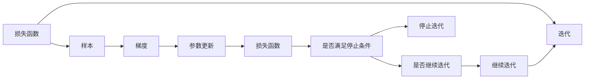
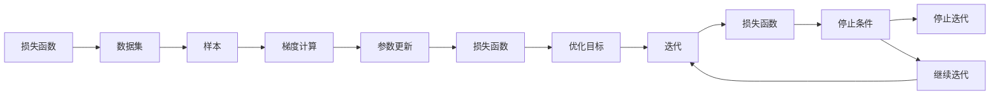

                 

## 1. 背景介绍

在机器学习和深度学习中，优化算法是一个核心问题。优化算法的作用是不断调整模型的参数，以最小化损失函数，从而提高模型的预测能力。其中，随机梯度下降 (Stochastic Gradient Descent, SGD) 是最经典、应用最广泛的优化算法之一。它不仅在学术界广受关注，也在工业界得到广泛应用。

### 1.1 问题的由来

机器学习模型的训练过程通常是一个优化问题，即在参数空间中寻找一个最小化的损失函数。常用的优化方法包括批量梯度下降 (Batch Gradient Descent, BGD)、随机梯度下降 (SGD)、小批量梯度下降 (Mini-batch Gradient Descent, MBGD) 等。其中，SGD 是最基础、最简单、最有效的优化算法之一，具有以下几个特点：

- **高效性**：SGD 可以在每一次迭代中更新参数，使得每一次迭代的计算开销较小。
- **鲁棒性**：SGD 对数据噪声和参数初始化较为鲁棒，容易收敛。
- **易于并行化**：SGD 的更新过程可以并行计算，提高了训练效率。

### 1.2 问题的核心关键点

SGD 的优劣主要体现在以下几个方面：

- **收敛速度**：SGD 通常比 BGD 收敛更快。
- **梯度噪声**：SGD 每次只使用一个样本计算梯度，导致梯度噪声较大，容易陷入局部最优。
- **随机性**：SGD 的更新方向随机，具有探索能力，但也需要适当的学习率来保证收敛。

## 2. 核心概念与联系

### 2.1 核心概念概述

为了更好地理解 SGD 算法，我们首先需要了解以下几个核心概念：

- **损失函数 (Loss Function)**：表示模型预测输出与真实标签之间的差异，是优化过程的目标函数。
- **梯度 (Gradient)**：表示损失函数关于模型参数的导数，用来指导模型参数的更新方向。
- **学习率 (Learning Rate)**：控制模型参数更新的步长，需要合理设置以避免收敛过快或过慢。
- **迭代 (Iteration)**：模型参数在每一轮更新后，重新计算梯度并更新，称为一次迭代。

### 2.2 概念间的关系

SGD 算法的核心思想是通过不断更新模型参数，逐步减少损失函数。其基本流程可以概括为：

1. 随机选择一个样本，计算该样本的梯度。
2. 更新模型参数。
3. 重复第一步，直到达到预设的迭代次数或损失函数满足停止条件。

通过 Mermaid 流程图，我们可以直观地展示 SGD 的更新过程：



这个流程图展示了 SGD 算法的基本流程：

1. 从损失函数出发，选择一个样本。
2. 计算样本的梯度。
3. 根据梯度更新模型参数。
4. 判断是否达到停止条件，若满足则停止迭代，否则继续下一轮迭代。

### 2.3 核心概念的整体架构

接下来，我们通过一个综合的 Mermaid 流程图来展示 SGD 算法的整体架构：



这个综合流程图展示了 SGD 算法从输入数据、计算梯度、更新参数到最终输出的整体过程。

## 3. 核心算法原理 & 具体操作步骤

### 3.1 算法原理概述

SGD 算法的核心是梯度下降。其基本思想是在每次迭代中，随机选择一个样本，计算梯度并更新模型参数，使得损失函数逐渐减小，最终达到最小值。

假设我们有 $n$ 个样本，损失函数为 $L(\theta)$，梯度为 $\nabla L(\theta)$，学习率为 $\eta$。则 SGD 的更新公式为：

$$
\theta_{t+1} = \theta_t - \eta \nabla L(\theta_t)
$$

其中 $t$ 表示当前迭代次数，$\theta_t$ 表示第 $t$ 轮迭代的参数值。

### 3.2 算法步骤详解

#### 3.2.1 初始化参数

1. 随机初始化模型参数 $\theta_0$。
2. 选择一个学习率 $\eta$。

#### 3.2.2 迭代更新

1. 对于每个样本 $x_i$，计算损失函数 $L(\theta_t, x_i)$ 和梯度 $\nabla L(\theta_t, x_i)$。
2. 根据梯度更新模型参数：
   $$
   \theta_{t+1} = \theta_t - \eta \nabla L(\theta_t, x_i)
   $$
3. 重复第 1 和第 2 步，直到达到预设的迭代次数或损失函数满足停止条件。

#### 3.2.3 停止条件

1. 达到预设的迭代次数。
2. 损失函数在连续多轮迭代中不再显著下降。
3. 梯度的大小小于预设的阈值。

### 3.3 算法优缺点

#### 3.3.1 优点

1. **高效性**：SGD 每次迭代只计算一个样本的梯度，计算开销小。
2. **鲁棒性**：对噪声较为鲁棒，能够较快收敛。
3. **易于并行化**：每个样本的梯度计算可以并行进行，提高训练效率。

#### 3.3.2 缺点

1. **收敛速度不稳定**：由于梯度噪声较大，可能导致收敛速度不稳定，甚至发散。
2. **收敛路径不稳定**：随机梯度的方向不稳定，可能导致在局部最优附近来回震荡，无法收敛到全局最优。
3. **对学习率敏感**：需要选择合适的学习率，避免过快或过慢收敛。

### 3.4 算法应用领域

SGD 算法广泛应用于机器学习和深度学习中，尤其是神经网络模型的训练。例如，在图像识别、自然语言处理、语音识别等任务中，SGD 被广泛使用。此外，SGD 还被应用于非凸优化问题、函数逼近等领域。

## 4. 数学模型和公式 & 详细讲解

### 4.1 数学模型构建

假设我们有 $n$ 个样本，损失函数为 $L(\theta)$，梯度为 $\nabla L(\theta)$，学习率为 $\eta$。则 SGD 的更新公式为：

$$
\theta_{t+1} = \theta_t - \eta \nabla L(\theta_t)
$$

其中 $\theta_t$ 表示第 $t$ 轮迭代的参数值。

### 4.2 公式推导过程

SGD 算法的更新公式可以推广到多维参数空间。设参数向量为 $\theta \in \mathbb{R}^d$，则梯度为 $\nabla L(\theta) \in \mathbb{R}^d$。

假设我们选择第 $i$ 个样本 $x_i$，其梯度为 $\nabla L(\theta_t, x_i)$。则 SGD 的更新公式为：

$$
\theta_{t+1} = \theta_t - \eta \nabla L(\theta_t, x_i)
$$

将上述公式展开，得到：

$$
\theta_{t+1} = \theta_t - \eta \frac{\partial L(\theta_t, x_i)}{\partial \theta}
$$

### 4.3 案例分析与讲解

假设我们有一个简单的线性回归模型，损失函数为 $L(\theta) = \frac{1}{2} \sum_{i=1}^n (y_i - \theta \cdot x_i)^2$，其中 $y_i$ 为第 $i$ 个样本的真实标签，$x_i$ 为第 $i$ 个样本的特征向量。则梯度为：

$$
\nabla L(\theta) = -\eta \sum_{i=1}^n (y_i - \theta \cdot x_i) \cdot x_i
$$

根据 SGD 的更新公式，我们可以得到：

$$
\theta_{t+1} = \theta_t + \eta \sum_{i=1}^n (y_i - \theta_t \cdot x_i) \cdot x_i
$$

该公式展示了 SGD 在简单线性回归模型中的应用。可以看出，每次迭代中，SGD 更新参数的步长由学习率和样本梯度共同决定。

## 5. 项目实践：代码实例和详细解释说明

### 5.1 开发环境搭建

在进行 SGD 实践前，我们需要准备好开发环境。以下是使用 Python 进行 PyTorch 开发的环境配置流程：

1. 安装 Anaconda：从官网下载并安装 Anaconda，用于创建独立的 Python 环境。

2. 创建并激活虚拟环境：
```bash
conda create -n pytorch-env python=3.8 
conda activate pytorch-env
```

3. 安装 PyTorch：根据 CUDA 版本，从官网获取对应的安装命令。例如：
```bash
conda install pytorch torchvision torchaudio cudatoolkit=11.1 -c pytorch -c conda-forge
```

4. 安装 Transformers 库：
```bash
pip install transformers
```

5. 安装各类工具包：
```bash
pip install numpy pandas scikit-learn matplotlib tqdm jupyter notebook ipython
```

完成上述步骤后，即可在 `pytorch-env` 环境中开始 SGD 实践。

### 5.2 源代码详细实现

这里我们以线性回归为例，给出使用 PyTorch 实现 SGD 的代码。

首先，定义数据集：

```python
import numpy as np
import torch
from torch import nn
from torch.optim import SGD
from torch.utils.data import TensorDataset, DataLoader

def generate_data(n_samples=1000, n_features=10, noise_std=0.1):
    X = np.random.randn(n_samples, n_features)
    y = 1.5 * X[:, 0] + 2.0 * X[:, 1] + 3.0 * X[:, 2] + np.random.normal(0, noise_std, n_samples)
    return torch.tensor(X, dtype=torch.float32), torch.tensor(y, dtype=torch.float32)

# 生成数据集
X_train, y_train = generate_data(n_samples=1000, n_features=10, noise_std=0.1)
X_test, y_test = generate_data(n_samples=1000, n_features=10, noise_std=0.1)
```

然后，定义模型和优化器：

```python
# 定义模型
class LinearRegression(nn.Module):
    def __init__(self, n_features):
        super(LinearRegression, self).__init__()
        self.linear = nn.Linear(n_features, 1)

    def forward(self, x):
        return self.linear(x)

# 初始化模型和参数
n_features = X_train.shape[1]
model = LinearRegression(n_features)
params = list(model.parameters())
# 定义优化器
optimizer = SGD(params, lr=0.01)
```

接着，定义训练和评估函数：

```python
# 定义训练函数
def train_epoch(model, dataset, optimizer):
    model.train()
    total_loss = 0.0
    for batch in DataLoader(dataset, batch_size=32):
        inputs, targets = batch
        optimizer.zero_grad()
        outputs = model(inputs)
        loss = nn.MSELoss()(outputs, targets)
        loss.backward()
        optimizer.step()
        total_loss += loss.item()
    return total_loss / len(dataset)

# 定义评估函数
def evaluate(model, dataset):
    model.eval()
    total_loss = 0.0
    for batch in DataLoader(dataset, batch_size=32):
        inputs, targets = batch
        outputs = model(inputs)
        loss = nn.MSELoss()(outputs, targets)
        total_loss += loss.item()
    return total_loss / len(dataset)
```

最后，启动训练流程并在测试集上评估：

```python
# 训练参数
n_epochs = 10
batch_size = 32

# 训练模型
for epoch in range(n_epochs):
    loss = train_epoch(model, TensorDataset(X_train, y_train), optimizer)
    print(f"Epoch {epoch+1}, train loss: {loss:.3f}")

    # 评估模型
    print(f"Epoch {epoch+1}, test loss: {evaluate(model, TensorDataset(X_test, y_test)):.3f}")
```

以上就是使用 PyTorch 对线性回归模型进行 SGD 微调的完整代码实现。可以看到，SGD 的实现过程非常简单，只需要定义模型和优化器，并在训练函数中更新参数即可。

### 5.3 代码解读与分析

让我们再详细解读一下关键代码的实现细节：

**generate_data 函数**：
- 生成一组随机数据，作为训练集和测试集。
- 使用正态分布生成噪声，模拟实际数据中的噪声。

**LinearRegression 类**：
- 定义一个简单的线性回归模型，包含一个线性层。

**train_epoch 函数**：
- 在训练集上迭代训练，每次迭代计算梯度并更新模型参数。
- 使用 `optimizer.zero_grad()` 清空梯度缓存，以避免梯度累加。
- 使用 `optimizer.step()` 更新模型参数。

**evaluate 函数**：
- 在测试集上评估模型的损失函数。
- 使用 `model.eval()` 将模型设置为评估模式，避免在测试集上不必要的计算。

**训练流程**：
- 定义总的迭代次数和批大小。
- 在每个epoch内，在训练集上训练，输出平均损失。
- 在验证集上评估，输出测试损失。
- 所有epoch结束后，在测试集上评估，给出最终结果。

可以看出，PyTorch 提供了方便的接口，使得 SGD 的实现变得非常简单。开发者只需关注模型的定义和优化器的设置，即可快速上手实践。

## 6. 实际应用场景

### 6.1 金融风险评估

在金融领域，SGD 算法被广泛用于风险评估模型的训练。银行和金融机构通过收集客户的信用记录、财务状况等信息，建立风险评估模型，预测客户的违约概率。SGD 算法可以有效地处理大规模数据集，训练出具有较高准确性的风险评估模型，帮助银行降低贷款风险。

### 6.2 医疗诊断

在医疗领域，SGD 算法被用于训练疾病诊断模型。医疗机构收集患者的病历、检查结果等信息，训练出疾病诊断模型，帮助医生快速诊断疾病。SGD 算法在处理大规模数据集时表现出色，可以快速训练出高质量的诊断模型，提高医疗服务的效率和准确性。

### 6.3 推荐系统

在推荐系统中，SGD 算法被用于训练推荐模型。电商和视频平台通过收集用户的浏览、购买、评分等信息，训练推荐模型，向用户推荐其可能感兴趣的商品或内容。SGD 算法可以有效地处理大规模数据集，训练出具有较高精度的推荐模型，提高推荐效果。

### 6.4 未来应用展望

随着深度学习和大数据技术的不断发展，SGD 算法在更多领域的应用前景更加广阔。未来，SGD 算法将在以下几个方面得到进一步发展：

1. **分布式计算**：SGD 算法可以很好地与分布式计算技术结合，提高大规模数据集上的训练效率。
2. **混合优化器**：结合其他优化器（如 Adam、Adagrad 等），提高收敛速度和稳定性。
3. **自适应学习率**：如 Adaptive Moment Estimation (Adam)、Adaptive Learning Rate for SGD (SGD Adaptive Learning Rate) 等，提高学习率调整的智能性。
4. **数据增强**：在训练过程中，通过数据增强技术，提高模型的泛化能力。

总之，SGD 算法作为一种简单而有效的优化算法，将在更多领域得到应用和发展。未来，随着技术进步和应用场景的扩展，SGD 算法将发挥更大的作用。

## 7. 工具和资源推荐

### 7.1 学习资源推荐

为了帮助开发者系统掌握 SGD 算法的理论基础和实践技巧，这里推荐一些优质的学习资源：

1. 《机器学习》（周志华）：经典的机器学习教材，详细介绍了各种优化算法的原理和应用。
2. 《深度学习》（Ian Goodfellow、Yoshua Bengio 和 Aaron Courville）：深度学习领域的经典教材，介绍了 SGD 算法和其他优化算法。
3. 《Python 深度学习》（Francois Chollet）：深入浅出地介绍了使用 Keras 进行深度学习的实践，包括 SGD 算法的应用。
4. 《PyTorch 教程》：PyTorch 官方提供的教程，详细介绍了如何使用 PyTorch 实现各种优化算法。
5. 《Coursera 深度学习课程》：由 Andrew Ng 等人讲授的深度学习课程，介绍了各种优化算法的使用。

通过对这些资源的学习实践，相信你一定能够快速掌握 SGD 算法的精髓，并用于解决实际的优化问题。

### 7.2 开发工具推荐

高效的开发离不开优秀的工具支持。以下是几款用于 SGD 算法开发的常用工具：

1. PyTorch：基于 Python 的开源深度学习框架，灵活的计算图，适合快速迭代研究。大部分深度学习模型都有 PyTorch 版本的实现。
2. TensorFlow：由 Google 主导开发的开源深度学习框架，生产部署方便，适合大规模工程应用。同样有丰富的深度学习模型资源。
3. Keras：基于 TensorFlow 和 Theano 的高级深度学习框架，简单易用，适合初学者。
4. Weights & Biases：模型训练的实验跟踪工具，可以记录和可视化模型训练过程中的各项指标，方便对比和调优。与主流深度学习框架无缝集成。
5. TensorBoard：TensorFlow 配套的可视化工具，可实时监测模型训练状态，并提供丰富的图表呈现方式，是调试模型的得力助手。

合理利用这些工具，可以显著提升 SGD 算法的开发效率，加快创新迭代的步伐。

### 7.3 相关论文推荐

SGD 算法的发展源于学界的持续研究。以下是几篇奠基性的相关论文，推荐阅读：

1. 《Asymptotic Normality of the Stochastic Approximation Method》（Robbins 和 Monro）：经典的 SGD 算法论文，奠定了 SGD 算法的基础。
2. 《Stochastic Gradient Descent Tricks》（Goodfellow 和 Bengio）：总结了 SGD 算法的各种技巧和改进方法，具有较高的实用价值。
3. 《SGD vs. Momentum》（Sutskever 等）：对比了 SGD 和 Momentum 算法的优缺点，并提出了一些改进方法。
4. 《Adaptive Moment Estimation》（Kingma 和 Ba）：提出了 Adam 优化器，结合了 SGD 和 Momentum 算法的优点，并引入自适应学习率，提高了收敛速度和稳定性。
5. 《Adaptive Learning Rate for SGD》（Luo 和 Ng）：提出了 SGD Adaptive Learning Rate 算法，能够自适应调整学习率，提高学习率调整的智能性。

这些论文代表了大数据算法的发展脉络。通过学习这些前沿成果，可以帮助研究者把握学科前进方向，激发更多的创新灵感。

除上述资源外，还有一些值得关注的前沿资源，帮助开发者紧跟 SGD 算法的最新进展，例如：

1. arXiv 论文预印本：人工智能领域最新研究成果的发布平台，包括大量尚未发表的前沿工作，学习前沿技术的必读资源。
2. 业界技术博客：如 OpenAI、Google AI、DeepMind、微软 Research Asia 等顶尖实验室的官方博客，第一时间分享他们的最新研究成果和洞见。
3. 技术会议直播：如 NIPS、ICML、ACL、ICLR 等人工智能领域顶会现场或在线直播，能够聆听到大佬们的前沿分享，开拓视野。
4. GitHub 热门项目：在 GitHub 上 Star、Fork 数最多的 SGD 相关项目，往往代表了该技术领域的发展趋势和最佳实践，值得去学习和贡献。
5. 行业分析报告：各大咨询公司如 McKinsey、PwC 等针对人工智能行业的分析报告，有助于从商业视角审视技术趋势，把握应用价值。

总之，对于 SGD 算法的学习，需要开发者保持开放的心态和持续学习的意愿。多关注前沿资讯，多动手实践，多思考总结，必将收获满满的成长收益。

## 8. 总结：未来发展趋势与挑战

### 8.1 总结

本文对 SGD 算法进行了全面系统的介绍。首先，阐述了 SGD 算法的研究背景和意义，明确了其在优化问题中的核心作用。其次，从原理到实践，详细讲解了 SGD 算法的数学原理和关键步骤，给出了 SGD 算法开发的完整代码实例。同时，本文还广泛探讨了 SGD 算法在金融风险评估、医疗诊断、推荐系统等多个领域的应用前景，展示了 SGD 算法的巨大潜力。此外，本文精选了 SGD 算法的各类学习资源，力求为读者提供全方位的技术指引。

通过本文的系统梳理，可以看到，SGD 算法作为优化问题的基本算法，其高效性、鲁棒性和并行化等优点，使其成为深度学习中不可或缺的一部分。未来，随着深度学习和大数据技术的不断发展，SGD 算法将在更多领域得到应用和发展。

### 8.2 未来发展趋势

展望未来，SGD 算法将呈现以下几个发展趋势：

1. **分布式计算**：随着数据量的增加，SGD 算法需要更快的训练速度，分布式计算成为必然趋势。
2. **自适应学习率**：自适应学习率能够根据模型参数的变化动态调整学习率，提高学习效率。
3. **混合优化器**：结合其他优化器（如 Momentum、Adam 等），进一步提高收敛速度和稳定性。
4. **数据增强**：在训练过程中，通过数据增强技术，提高模型的泛化能力。
5. **模型压缩**：随着模型规模的扩大，SGD 算法需要更快的训练速度和更少的内存占用，模型压缩技术将得到广泛应用。

以上趋势凸显了 SGD 算法在机器学习和深度学习中的重要地位。这些方向的探索发展，必将进一步提高 SGD 算法的性能和应用范围，为人工智能技术的发展提供更加坚实的技术基础。

### 8.3 面临的挑战

尽管 SGD 算法已经取得了瞩目成就，但在实际应用中也面临诸多挑战：

1. **收敛速度不稳定**：由于梯度噪声较大，SGD 算法在复杂模型上可能收敛速度不稳定，甚至发散。
2. **鲁棒性不足**：SGD 算法对初始化敏感，容易陷入局部最优。
3. **计算开销大**：在处理大规模数据集时，SGD 算法的计算开销较大，难以满足实时性要求。

### 8.4 研究展望

面对 SGD 算法面临的挑战，未来的研究需要在以下几个方面寻求新的突破：

1. **分布式优化**：通过分布式计算技术，提高大规模数据集上的训练效率。
2. **自适应学习率**：如 Adam、SGD Adaptive Learning Rate 等，提高学习率调整的智能性。
3. **混合优化器**：结合其他优化器（如 Momentum、Adagrad 等），提高收敛速度和稳定性。
4. **数据增强**：在训练过程中，通过数据增强技术，提高模型的泛化能力。
5. **模型压缩**：通过模型压缩技术，减小计算开销，提高训练速度。

这些研究方向的探索，必将引领 SGD 算法迈向更高的台阶，为构建高效、稳定、可扩展的深度学习系统铺平道路。面向未来，SGD 算法还需要与其他深度学习技术进行更深入的融合，如知识表示、因果推理、强化学习等，多路径协同发力，共同推动深度学习技术的发展。

## 9. 附录：常见问题与解答

**Q1：什么是 SGD 算法？**

A: SGD 算法是一种基于随机梯度下降的优化算法。其核心思想是在每次迭代中，随机选择一个样本，计算梯度并更新模型参数，使得损失函数逐渐减小，最终达到最小值。

**Q2：SGD 算法和 BGD 算法有什么区别？**

A: SGD 算法每次迭代只计算一个样本的梯度，计算开销较小，但梯度噪声较大，收敛速度不稳定。BGD 算法每次迭代计算全部样本的梯度，计算开销较大，但梯度噪声较小，收敛速度较慢。

**Q3：SGD 算法的学习率如何选择？**

A: 学习率是 SGD 算法的一个重要参数，需要根据具体任务和数据集选择。一般建议从较小的值开始，逐步增大，直至收敛。此外，可以结合学习率调度策略，如 step size、warmup、cyclical learning rate 等，提高学习效率。

**Q4：SGD 算法在实际应用中需要注意哪些问题？**

A: 在实际应用中，SG

