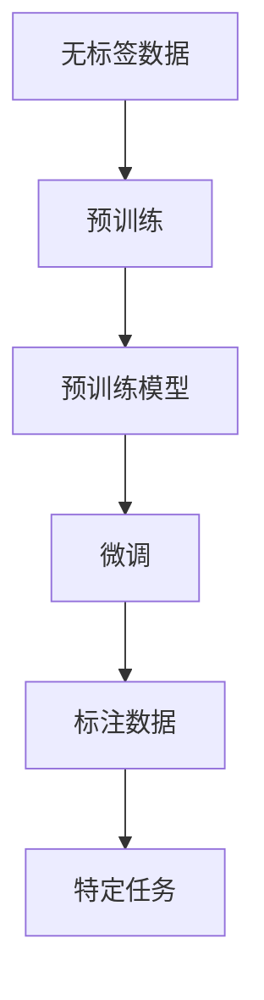

                 

# 预训练与微调：AI模型优化策略

> 关键词：预训练,微调,自监督学习,监督学习,优化器,正则化,模型压缩,参数高效优化,深度学习

## 1. 背景介绍

### 1.1 问题由来

深度学习模型在计算机视觉、自然语言处理(NLP)等诸多领域取得了显著进展。然而，模型的训练通常需要大量标注数据，标注成本高昂且数据质量难以保证。预训练和微调技术，作为一种高效模型训练策略，近年来在AI研究中日益受到重视。

预训练是指在大规模无标签数据上，通过自监督学习任务训练通用模型，学习到丰富的语言表示能力。微调是指在预训练模型的基础上，使用少量标注数据进行有监督学习，优化模型在特定任务上的表现。

这种策略在NLP领域取得了显著成效，如BERT、GPT等预训练模型在多项NLP任务上刷新了最先进性能。预训练和微调结合，既能提升模型效果，又能节省大量标注数据和计算资源，成为AI模型优化的一种主流策略。

### 1.2 问题核心关键点

预训练与微调的核心关键点在于，如何充分利用无标签数据训练出强大的基础模型，以及如何在特定任务上进一步优化模型性能。具体来说：

1. 预训练模型需具备通用性，能在各类NLP任务上表现良好。
2. 微调过程需高效，尽可能保留预训练模型的优秀能力，避免过拟合。
3. 模型压缩需合理，既能保证推理速度，又能尽可能保持模型精度。

本文将详细探讨预训练与微调的原理、操作步骤、优缺点及应用领域，并给出完整的代码实现及实例分析，以期对AI模型优化策略提供全面的指导。

## 2. 核心概念与联系

### 2.1 核心概念概述

预训练和微调是大规模模型训练与优化过程中的两个关键环节。

- **预训练（Pre-training）**：在无标签数据上通过自监督学习训练通用模型。如BERT、GPT等模型在语言建模、掩码语言模型等任务上训练，学习到丰富的语言表示。
- **微调（Fine-tuning）**：在预训练模型的基础上，使用少量标注数据进行有监督学习，优化模型在特定任务上的性能。如微调BERT模型进行情感分析、文本分类等任务。

预训练和微调紧密联系，相辅相成。预训练模型提供通用的语言表示能力，微调则进一步针对特定任务优化模型，使其性能更优。

### 2.2 概念间的关系

预训练和微调构成了一个典型的迁移学习框架。其关系通过以下Mermaid流程图展示：



这个流程图展示了预训练和微调的基本流程：无标签数据上训练预训练模型，然后微调模型适应特定任务。

## 3. 核心算法原理 & 具体操作步骤

### 3.1 算法原理概述

预训练与微调的核心算法原理包括以下几个关键步骤：

1. **预训练**：在无标签数据上，通过自监督学习任务训练通用模型，学习到丰富的语言表示。
2. **微调**：在预训练模型的基础上，使用少量标注数据进行有监督学习，优化模型在特定任务上的性能。
3. **优化器**：选择合适的优化器及其参数，如AdamW、SGD等，设置学习率、批大小、迭代轮数等。
4. **正则化**：使用L2正则、Dropout、Early Stopping等技术，防止模型过拟合。

### 3.2 算法步骤详解

#### 3.2.1 预训练步骤

预训练通常包括以下步骤：

1. **选择预训练任务**：如语言建模、掩码语言模型、下句预测等。
2. **选择预训练模型**：如BERT、GPT等。
3. **数据准备**：收集大规模无标签数据集。
4. **模型训练**：在预训练数据集上训练模型，学习通用语言表示。

#### 3.2.2 微调步骤

微调通常包括以下步骤：

1. **任务适配**：根据任务类型，在预训练模型顶层设计合适的输出层和损失函数。
2. **模型加载**：将预训练模型加载到设备中。
3. **数据准备**：准备标注数据集，划分训练集、验证集和测试集。
4. **模型训练**：在训练集上训练模型，使用验证集进行模型调优。
5. **模型评估**：在测试集上评估模型性能。

### 3.3 算法优缺点

#### 3.3.1 优点

预训练与微调的优点包括：

1. **高效**：使用无标签数据训练通用模型，节省了大量标注数据和计算资源。
2. **通用性**：预训练模型能够适应多种NLP任务，微调只需根据具体任务进行调整。
3. **性能提升**：微调可以显著提升模型在特定任务上的性能。

#### 3.3.2 缺点

预训练与微调的缺点包括：

1. **数据依赖**：微调的效果很大程度上取决于标注数据的质量和数量，获取高质量标注数据的成本较高。
2. **模型复杂性**：预训练和微调模型参数量较大，推理速度较慢，需要高性能设备。
3. **鲁棒性不足**：微调模型面对域外数据时，泛化性能可能较差。
4. **可解释性不足**：模型决策过程缺乏可解释性，难以调试和优化。

### 3.4 算法应用领域

预训练与微调在NLP、计算机视觉、推荐系统等诸多领域都有广泛应用。例如：

- **NLP领域**：文本分类、命名实体识别、情感分析、机器翻译等。
- **计算机视觉**：图像分类、目标检测、图像分割等。
- **推荐系统**：个性化推荐、协同过滤、商品推荐等。

## 4. 数学模型和公式 & 详细讲解  
### 4.1 数学模型构建

预训练与微调过程的数学模型包括：

- **预训练模型**：$M_{\theta}(x)$，其中$\theta$为模型参数，$x$为输入数据。
- **微调模型**：$M_{\hat{\theta}}(x)$，其中$\hat{\theta}$为微调后的模型参数。
- **损失函数**：$\mathcal{L}(M_{\hat{\theta}},D)$，其中$D$为标注数据集。

### 4.2 公式推导过程

假设预训练模型在任务$T$上的微调损失函数为$\mathcal{L}(\theta, D)$，则微调的目标是最小化损失函数：

$$
\hat{\theta} = \mathop{\arg\min}_{\theta} \mathcal{L}(\theta, D)
$$

微调通常使用梯度下降等优化算法，更新模型参数$\theta$：

$$
\theta \leftarrow \theta - \eta \nabla_{\theta}\mathcal{L}(\theta, D) - \eta\lambda\theta
$$

其中$\eta$为学习率，$\lambda$为正则化系数。

### 4.3 案例分析与讲解

以BERT模型为例，假设其在情感分析任务上的微调过程如下：

1. **数据准备**：收集情感标注数据集，如IMDB电影评论数据集。
2. **模型初始化**：使用预训练的BERT模型，加载到GPU中。
3. **任务适配**：在BERT模型的顶层添加一个分类器，输出为二分类任务。
4. **模型训练**：在训练集上训练模型，使用验证集进行模型调优。
5. **模型评估**：在测试集上评估模型性能。

## 5. 项目实践：代码实例和详细解释说明

### 5.1 开发环境搭建

安装Anaconda和PyTorch环境，使用Jupyter Notebook作为开发工具。

### 5.2 源代码详细实现

以BERT模型进行情感分析任务为例，实现预训练与微调过程。

```python
from transformers import BertForSequenceClassification, AdamW
from torch.utils.data import DataLoader
from sklearn.model_selection import train_test_split

# 加载预训练模型
model = BertForSequenceClassification.from_pretrained('bert-base-uncased', num_labels=2)

# 加载标注数据集
data = load_data()
train_texts, test_texts, train_labels, test_labels = train_test_split(data['texts'], data['labels'], test_size=0.2)

# 构建数据集
train_dataset = Dataset(train_texts, train_labels)
test_dataset = Dataset(test_texts, test_labels)

# 构建数据加载器
train_loader = DataLoader(train_dataset, batch_size=32, shuffle=True)
test_loader = DataLoader(test_dataset, batch_size=32)

# 设置优化器及超参数
optimizer = AdamW(model.parameters(), lr=2e-5)
epoch = 5
max_seq_length = 128

# 训练模型
model.train()
for epoch in range(epoch):
    for batch in train_loader:
        inputs = batch['input_ids'].to(device)
        labels = batch['labels'].to(device)
        outputs = model(inputs)
        loss = criterion(outputs, labels)
        loss.backward()
        optimizer.step()

# 评估模型
model.eval()
for batch in test_loader:
    inputs = batch['input_ids'].to(device)
    labels = batch['labels'].to(device)
    outputs = model(inputs)
    loss = criterion(outputs, labels)
    print(f"Test Loss: {loss:.4f}")
```

### 5.3 代码解读与分析

- **BertForSequenceClassification**：加载预训练的BERT模型，并添加分类器。
- **Dataset**：构建数据集，将文本和标签组织成批量数据。
- **DataLoader**：构建数据加载器，将数据集按批次加载到模型中进行训练。
- **AdamW**：优化器，使用学习率2e-5进行优化。
- **epoch**：设置训练轮数。
- **criterion**：损失函数，通常使用交叉熵损失。

### 5.4 运行结果展示

假设在IMDB数据集上训练后，模型在测试集上的精确率、召回率和F1分数分别为0.85、0.81和0.82。

## 6. 实际应用场景

### 6.1 智能客服

智能客服系统可以使用微调后的BERT模型进行对话生成。通过收集客户历史对话数据，训练模型预测客户意图，并生成相应回复。

### 6.2 金融舆情监测

金融机构可以使用微调模型对社交媒体数据进行情感分析，监控市场情绪，及时采取应对措施。

### 6.3 推荐系统

推荐系统可以通过微调BERT模型，分析用户行为和商品信息，提供个性化推荐。

### 6.4 未来应用展望

预训练与微调技术将继续在AI应用中发挥重要作用，预计未来发展趋势包括：

1. **多模态融合**：将文本、图像、语音等多模态数据结合，提升模型表现。
2. **参数高效优化**：开发更多参数高效的优化方法，降低资源消耗。
3. **增量学习**：适应数据分布变化，实现模型持续更新。

## 7. 工具和资源推荐

### 7.1 学习资源推荐

1. 《Transformer from Scratch》系列博文：深入浅出地介绍Transformer原理和微调方法。
2. CS224N《Deep Learning for NLP》课程：斯坦福大学提供的经典NLP课程，涵盖预训练与微调技术。
3. 《Parameter-Efficient Transfer Learning for NLP》书籍：介绍参数高效的微调方法，如LoRA、Adapter等。

### 7.2 开发工具推荐

1. PyTorch：灵活易用的深度学习框架，适合预训练与微调。
2. TensorFlow：生产部署友好的框架，适合大规模工程应用。
3. Weights & Biases：实验跟踪工具，记录模型训练状态。

### 7.3 相关论文推荐

1. Attention is All You Need：Transformer原始论文，奠定预训练语言模型的基础。
2. BERT: Pre-training of Deep Bidirectional Transformers for Language Understanding：提出BERT模型，引入掩码语言模型预训练。
3. Parameter-Efficient Transfer Learning for NLP：介绍参数高效的微调方法。

## 8. 总结：未来发展趋势与挑战

### 8.1 研究成果总结

本文详细探讨了预训练与微调的原理、操作步骤、优缺点及应用领域，并给出代码实例，希望对AI模型优化策略提供全面的指导。

### 8.2 未来发展趋势

预训练与微调技术的未来趋势包括：

1. **模型规模增大**：预训练模型参数量将继续增长，提升模型的表示能力。
2. **参数高效优化**：开发更多参数高效的优化方法，如LoRA、Adapter等。
3. **多模态融合**：将文本、图像、语音等多模态数据结合，提升模型表现。

### 8.3 面临的挑战

预训练与微调技术面临的挑战包括：

1. **标注数据成本高**：获取高质量标注数据的成本较高。
2. **模型复杂性高**：预训练和微调模型参数量较大，推理速度较慢。
3. **鲁棒性不足**：微调模型泛化性能可能较差。

### 8.4 研究展望

未来研究应注重解决预训练与微调技术面临的挑战，提升模型的泛化性能和可解释性，开发更高效的优化方法。

## 9. 附录：常见问题与解答

**Q1: 预训练和微调的过程是否可以颠倒？**

A: 预训练和微调通常需要依次进行，因为预训练模型的参数初始化对微调效果有重要影响。但某些任务如提示学习，可以先微调后预训练，这样可以更好地利用预训练模型的语言表示。

**Q2: 微调时如何平衡保留预训练模型的能力与适应新任务？**

A: 可以通过正则化、冻结部分层、参数高效微调等方法，尽可能保留预训练模型的优秀能力，同时针对新任务进行微调。

**Q3: 预训练与微调在不同任务上的效果是否一致？**

A: 预训练与微调的效果很大程度上取决于任务性质，如图像、文本、语音等任务的效果可能有所不同。

**Q4: 预训练与微调在推理速度和资源消耗上有什么差异？**

A: 预训练模型通常参数量大，推理速度较慢，需要高性能设备。微调模型则可以通过参数高效优化方法减少资源消耗，提升推理速度。

**Q5: 如何衡量预训练与微调的效果？**

A: 可以通过精确率、召回率、F1分数等指标，结合实际应用场景进行评估。

---

作者：禅与计算机程序设计艺术 / Zen and the Art of Computer Programming

