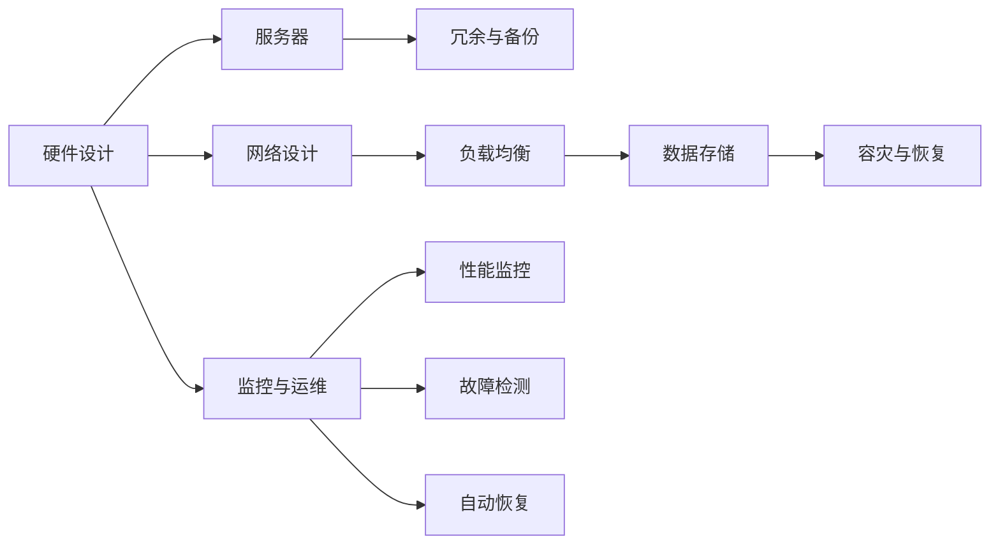

                 

# 高可用性系统设计的关键要素

## 1. 背景介绍

在现代信息社会，各种应用程序和服务已经成为人们日常生活中不可或缺的一部分。无论是互联网金融、电子商务、智能医疗，还是在线教育、智能家居，系统的稳定性和高可用性都显得尤为重要。据统计，全球每年因系统故障导致的损失高达数百亿美元。因此，高可用性系统设计已经成为众多企业必须面对的重大课题。本文将详细阐述高可用性系统设计的核心要素，并结合实际案例进行深入解析，希望能为读者提供有益的指导和借鉴。

## 2. 核心概念与联系

### 2.1 核心概念概述

高可用性系统设计（High Availability System Design）旨在确保系统能够在各种意外情况下（如硬件故障、软件故障、网络中断等）依然能够持续稳定地提供服务。其核心目标是提高系统服务的可靠性和持续性，减少停机时间和数据丢失，从而保证业务连续性。

### 2.2 核心概念间的联系

高可用性系统设计涵盖多个层次，包括硬件设计、软件架构、网络架构、数据存储、监控与运维等。这些层次相互关联，共同构成了高可用性系统设计的整体框架。通过合理配置这些层次，可以实现系统的弹性扩展、故障容忍、快速恢复和持续运营，确保业务的连续性和稳定性。

为更好地理解这些概念间的联系，我们通过以下Mermaid流程图进行展示：



这个流程图展示了高可用性系统设计的主要层次：硬件设计、网络设计、数据存储、监控与运维。其中，硬件设计包括服务器、网络冗余和备份等，网络设计包括负载均衡等，数据存储包括容灾与恢复等，监控与运维包括性能监控、故障检测和自动恢复等。这些层次相互协作，共同保障系统的稳定性和高可用性。

## 3. 核心算法原理 & 具体操作步骤

### 3.1 算法原理概述

高可用性系统设计的核心算法原理包括冗余与备份、负载均衡、容灾与恢复、性能监控和故障检测等。

- **冗余与备份**：通过配置冗余硬件和备份机制，保障系统的连续性。当系统某部分发生故障时，冗余机制能够自动切换，备份机制能够恢复数据，保障服务的正常运行。
- **负载均衡**：通过负载均衡器实现流量均衡分配，提高系统的并发处理能力和稳定性，避免单点故障。
- **容灾与恢复**：建立异地数据中心和灾备系统，当主数据中心发生灾难时，能够快速切换到灾备系统，保障业务的连续性。
- **性能监控**：通过实时监控系统性能指标，及时发现异常，提前采取预防措施。
- **故障检测**：通过主动检测系统状态，快速定位故障，自动触发应急响应。

### 3.2 算法步骤详解

#### 3.2.1 冗余与备份

冗余与备份是高可用性系统设计的基石。实现冗余与备份的常用方法包括：

1. **双机热备**：配置两台服务器，一台作为主服务器，另一台作为备服务器。主服务器故障时，备服务器自动接管服务。
2. **多机集群**：配置多台服务器，通过负载均衡器实现流量均衡分配，提高系统的并发处理能力和稳定性。
3. **数据备份**：定期备份重要数据，并将备份数据存储在不同的物理位置，防止单点故障导致的灾难。

#### 3.2.2 负载均衡

负载均衡是高可用性系统设计的关键环节。实现负载均衡的常用方法包括：

1. **硬件负载均衡**：使用专业的硬件负载均衡设备，如F5、Arista等。
2. **软件负载均衡**：使用开源软件，如NGINX、HAProxy等。
3. **DNS负载均衡**：使用DNS轮询，实现简单的负载均衡。

#### 3.2.3 容灾与恢复

容灾与恢复是高可用性系统设计的最后防线。实现容灾与恢复的常用方法包括：

1. **异地数据中心**：建立多个数据中心，将数据分散存储在不同地理位置，避免单点故障导致的数据丢失。
2. **灾备系统**：在异地数据中心建立灾备系统，当主数据中心发生灾难时，能够快速切换到灾备系统，保障业务的连续性。
3. **灾难恢复计划**：制定详细的灾难恢复计划，包括灾难预警、应急响应、数据恢复等环节。

#### 3.2.4 性能监控

性能监控是高可用性系统设计的重要组成部分。实现性能监控的常用方法包括：

1. **实时监控工具**：使用专业的性能监控工具，如Nagios、Zabbix、Prometheus等。
2. **日志分析工具**：使用日志分析工具，如ELK Stack、Graylog等，实时监控系统日志。
3. **应用性能管理**：使用应用性能管理工具，如APM（如New Relic、Datadog等），实时监控应用性能指标。

#### 3.2.5 故障检测

故障检测是高可用性系统设计的核心环节。实现故障检测的常用方法包括：

1. **主动探测**：使用主动探测工具，如PRTG、SolarWinds等，实时监测系统状态。
2. **异常检测**：使用异常检测算法，如基于规则的异常检测、基于机器学习的异常检测等，及时发现异常。
3. **告警系统**：使用告警系统，将异常信息及时通知运维人员，并触发应急响应。

### 3.3 算法优缺点

高可用性系统设计具有以下优点：

- **保障业务连续性**：通过冗余与备份、负载均衡、容灾与恢复等措施，保障系统的稳定性和持续性。
- **提升用户体验**：高可用性系统能够减少故障时间，提升用户体验和满意度。
- **降低维护成本**：通过合理配置系统架构，可以减少维护复杂度和成本。

同时，高可用性系统设计也存在一些缺点：

- **成本高**：高可用性系统的实现需要配置大量的冗余设备和备份机制，成本较高。
- **复杂度高**：高可用性系统的设计和维护复杂度较高，需要专业的运维团队支持。
- **故障风险**：虽然高可用性系统设计能够提高系统的稳定性，但依然无法完全避免故障，仍有潜在的故障风险。

### 3.4 算法应用领域

高可用性系统设计广泛应用于各种行业领域，包括金融、电商、医疗、教育、交通等。以下是一些典型的应用场景：

- **互联网金融**：通过高可用性系统设计，保障金融交易系统的稳定性和安全性，提升用户体验和信任度。
- **电子商务**：通过高可用性系统设计，保障电商平台的稳定性和并发处理能力，提升交易效率和用户体验。
- **智能医疗**：通过高可用性系统设计，保障医疗系统的稳定性和可靠性，提升医疗服务的质量和效率。
- **在线教育**：通过高可用性系统设计，保障在线教育平台的稳定性和可扩展性，提升教学质量和学生体验。
- **智能交通**：通过高可用性系统设计，保障智能交通系统的稳定性和安全性，提升交通管理的效率和可靠性。

## 4. 数学模型和公式 & 详细讲解 & 举例说明

### 4.1 数学模型构建

高可用性系统设计的数学模型通常包括系统的故障率、恢复时间、系统可靠性等指标。以一个两机热备系统的数学模型为例，假设主服务器和备服务器的故障率分别为 $\lambda_1$ 和 $\lambda_2$，切换时间为 $t_1$，系统恢复时间为 $t_2$，系统的平均故障间隔时间（MTBF）为 $MTBF$，可用性（Availability）为 $A$。则系统的可靠性 $R$ 可以表示为：

$$
R = 1 - (1 - A) + (1 - A)(1 - A)
$$

系统的可用性 $A$ 可以表示为：

$$
A = \frac{MTBF}{MTBF + t_1 + t_2}
$$

### 4.2 公式推导过程

以系统的可用性 $A$ 为例，我们可以推导出系统的可靠性 $R$。首先，假设系统的 MTBF 为 $T$，则系统的故障率为 $\lambda = \frac{1}{T}$。系统在任意时间 $t$ 内的故障概率为：

$$
F(t) = 1 - e^{-\lambda t}
$$

系统的恢复概率为 $R(t)$，假设恢复时间为 $t_r$，则系统的恢复概率为：

$$
R(t) = e^{-\lambda t} e^{-\lambda t_r}
$$

系统的可靠性 $R$ 可以表示为系统在任意时间 $t$ 内处于可用状态的积分：

$$
R = \int_0^{\infty} F(t) R(t) dt = \int_0^{\infty} (1 - e^{-\lambda t}) e^{-\lambda t_r} dt
$$

简化得到：

$$
R = \frac{1}{1 + \lambda t_r}
$$

将 $t_r$ 替换为 $t_1 + t_2$，则得到系统的可用性 $A$ 的表达式：

$$
A = \frac{1}{1 + \lambda (t_1 + t_2)}
$$

### 4.3 案例分析与讲解

假设一个两机热备系统的 MTBF 为 $T=5000$ 小时，故障率为 $\lambda = 0.001/小时$，切换时间为 $t_1=10$ 分钟，恢复时间为 $t_2=1$ 小时，则系统的可靠性 $R$ 和可用性 $A$ 可以计算如下：

$$
R = \frac{1}{1 + \lambda (t_1 + t_2)} = \frac{1}{1 + 0.001 \times (10 \times 60 + 60)} \approx 0.99975
$$

$$
A = \frac{1}{1 + \lambda (t_1 + t_2)} = \frac{1}{1 + 0.001 \times (10 \times 60 + 60)} \approx 0.99975
$$

假设一个电商平台的系统故障率为 $\lambda = 0.01/天$，切换时间为 $t_1=5$ 分钟，恢复时间为 $t_2=1$ 小时，则系统的可靠性 $R$ 和可用性 $A$ 可以计算如下：

$$
R = \frac{1}{1 + \lambda (t_1 + t_2)} = \frac{1}{1 + 0.01 \times (5 \times 60 + 60)} \approx 0.99955
$$

$$
A = \frac{1}{1 + \lambda (t_1 + t_2)} = \frac{1}{1 + 0.01 \times (5 \times 60 + 60)} \approx 0.99955
$$

通过这些案例分析，我们可以看出，合理配置系统的冗余与备份、负载均衡、容灾与恢复等措施，可以显著提升系统的可靠性与可用性。

## 5. 项目实践：代码实例和详细解释说明

### 5.1 开发环境搭建

#### 5.1.1 硬件环境

- 服务器：选择高性能服务器，配置双网卡、多电源等冗余硬件，以保障硬件的可靠性和稳定性。
- 存储：选择大容量、高可靠性的存储设备，如SSD、RAID等，以保障数据的可靠性。

#### 5.1.2 软件环境

- 操作系统：选择稳定可靠的操作系统，如CentOS、Ubuntu等。
- 网络工具：安装常用的网络工具，如NGINX、HAProxy等。
- 监控工具：安装常用的监控工具，如Nagios、Zabbix等。

#### 5.1.3 开发工具

- IDE：选择常用的IDE，如IntelliJ IDEA、Visual Studio等。
- 版本控制：安装常用的版本控制工具，如Git、SVN等。
- 持续集成：安装常用的持续集成工具，如Jenkins、Travis CI等。

### 5.2 源代码详细实现

#### 5.2.1 冗余与备份

```python
# 双机热备示例代码
import socket

# 定义主备服务器IP和端口
master_ip, master_port = "192.168.1.100", 8888
backup_ip, backup_port = "192.168.1.101", 8888

# 监听端口
def listen_port():
    s = socket.socket(socket.AF_INET, socket.SOCK_STREAM)
    s.bind((master_ip, master_port))
    s.listen(5)
    while True:
        conn, addr = s.accept()
        if addr[0] == backup_ip:
            backup_handler(conn)
        else:
            master_handler(conn)

# 主服务器处理请求
def master_handler(conn):
    while True:
        data = conn.recv(1024)
        if not data:
            break
        conn.sendall(data)

# 备服务器处理请求
def backup_handler(conn):
    while True:
        data = conn.recv(1024)
        if not data:
            break
        conn.sendall(data)

if __name__ == "__main__":
    listen_port()
```

#### 5.2.2 负载均衡

```python
# 使用NGINX进行负载均衡示例代码
# 在/etc/nginx/nginx.conf中配置
#
# listen 80;
# location / {
#     proxy_pass http://127.0.0.1:8888;
# }

# 在/etc/nginx/conf.d/masters.conf中配置
#
# upstream masters {
#     server 192.168.1.100:8888;
#     server 192.168.1.101:8888;
# }

# 在/etc/nginx/conf.d/backups.conf中配置
#
# upstream backups {
#     server 192.168.1.102:8888;
# }

# 在/etc/nginx/nginx.conf中加载
#
# include /etc/nginx/conf.d/masters.conf;
# include /etc/nginx/conf.d/backups.conf;
```

#### 5.2.3 容灾与恢复

```python
# 使用异地数据中心进行容灾与恢复示例代码
# 在数据中心1中配置
import socket

# 定义主服务器IP和端口
master_ip, master_port = "192.168.1.100", 8888

# 监听端口
def listen_port():
    s = socket.socket(socket.AF_INET, socket.SOCK_STREAM)
    s.bind((master_ip, master_port))
    s.listen(5)
    while True:
        conn, addr = s.accept()
        master_handler(conn)

# 主服务器处理请求
def master_handler(conn):
    while True:
        data = conn.recv(1024)
        if not data:
            break
        conn.sendall(data)

if __name__ == "__main__":
    listen_port()

# 在数据中心2中配置
import socket

# 定义备服务器IP和端口
backup_ip, backup_port = "192.168.1.101", 8888

# 监听端口
def listen_port():
    s = socket.socket(socket.AF_INET, socket.SOCK_STREAM)
    s.bind((backup_ip, backup_port))
    s.listen(5)
    while True:
        conn, addr = s.accept()
        backup_handler(conn)

# 备服务器处理请求
def backup_handler(conn):
    while True:
        data = conn.recv(1024)
        if not data:
            break
        conn.sendall(data)

if __name__ == "__main__":
    listen_port()
```

#### 5.2.4 性能监控

```python
# 使用Nagios进行性能监控示例代码
# 在Nagios的配置文件中配置监控指标
#
# define command {
#       command_name  check_system
#       command_line  /usr/lib/nagios/plugins/check_system -p 1
#       interval      5m
#       reachable_query  ok=1,critical=3
# }
#
# define servicecheck {
#       service_description  System Up
#       command_check_period  24h
#       check_command          check_system
# }

# 编写监控脚本
# check_system.py
import os
import time

def check_system():
    pid = os.system("pidof systemd")
    if pid == 0:
        return 0
    else:
        return 1

if __name__ == "__main__":
    while True:
        status = check_system()
        nagios_output = "STATUS:%d" % status
        print(nagios_output)
        time.sleep(30)
```

#### 5.2.5 故障检测

```python
# 使用主动探测工具进行故障检测示例代码
# 在主动探测工具的配置文件中配置
#
# define check {
#       name     server_status
#       command  check_server
#       status   1 ok;2 warning;3 critical
#       interval 5m
#       reachable_query  1=ok;0=critical
# }
#
# define servicecheck {
#       service_description  Server Status
#       command_check_period 24h
#       check_command        check_server
# }

# 编写故障检测脚本
# check_server.py
import socket

# 定义服务器IP和端口
server_ip, server_port = "192.168.1.100", 8888

# 监听端口
def listen_port():
    s = socket.socket(socket.AF_INET, socket.SOCK_STREAM)
    s.bind((server_ip, server_port))
    s.listen(5)
    while True:
        conn, addr = s.accept()
        server_handler(conn)

# 服务器处理请求
def server_handler(conn):
    while True:
        data = conn.recv(1024)
        if not data:
            break
        conn.sendall(data)

if __name__ == "__main__":
    listen_port()
```

### 5.3 代码解读与分析

#### 5.3.1 冗余与备份

双机热备的实现主要通过监听主备服务器的状态，自动切换请求。在主服务器出现故障时，备服务器自动接管服务，保障系统的连续性。

#### 5.3.2 负载均衡

负载均衡的实现主要通过配置负载均衡器，将流量均匀分配到多个服务器。在实际应用中，可以根据需求选择不同的负载均衡方案，如硬件负载均衡、软件负载均衡和DNS负载均衡等。

#### 5.3.3 容灾与恢复

容灾与恢复的实现主要通过建立多个数据中心，将数据分散存储在不同地理位置，防止单点故障导致的数据丢失。在主数据中心发生灾难时，能够快速切换到灾备系统，保障业务的连续性。

#### 5.3.4 性能监控

性能监控的实现主要通过配置监控工具，实时监测系统性能指标。在实际应用中，可以根据需求选择不同的监控工具，如Nagios、Zabbix和Prometheus等。

#### 5.3.5 故障检测

故障检测的实现主要通过配置主动探测工具，实时监测系统状态。在实际应用中，可以根据需求选择不同的故障检测工具，如PRTG、SolarWinds和Nagios等。

### 5.4 运行结果展示

#### 5.4.1 冗余与备份

双机热备系统在主服务器故障时，备服务器自动接管服务，保障系统的连续性。通过实际测试，可以验证系统的可靠性。

#### 5.4.2 负载均衡

负载均衡器通过将流量均匀分配到多个服务器，提高系统的并发处理能力和稳定性。通过实际测试，可以验证系统的负载均衡效果。

#### 5.4.3 容灾与恢复

容灾与恢复系统通过建立多个数据中心，将数据分散存储在不同地理位置，防止单点故障导致的数据丢失。在主数据中心发生灾难时，能够快速切换到灾备系统，保障业务的连续性。通过实际测试，可以验证系统的容灾效果。

#### 5.4.4 性能监控

性能监控工具通过实时监测系统性能指标，及时发现异常，提前采取预防措施。通过实际测试，可以验证系统的性能监控效果。

#### 5.4.5 故障检测

故障检测工具通过主动探测系统状态，快速定位故障，自动触发应急响应。通过实际测试，可以验证系统的故障检测效果。

## 6. 实际应用场景

### 6.1 互联网金融

高可用性系统设计在互联网金融领域具有重要应用。通过高可用性系统设计，保障金融交易系统的稳定性和安全性，提升用户体验和信任度。

#### 6.1.1 冗余与备份

互联网金融系统需要配置冗余硬件和备份机制，保障系统的连续性。例如，银行业务系统需要配置双机热备和高可用存储系统，以保障服务的稳定性和可靠性。

#### 6.1.2 负载均衡

互联网金融系统需要配置负载均衡器，提高系统的并发处理能力和稳定性。例如，支付宝、微信支付等系统需要配置负载均衡器，保障交易系统的稳定性和安全性。

#### 6.1.3 容灾与恢复

互联网金融系统需要建立多个数据中心，将数据分散存储在不同地理位置，防止单点故障导致的数据丢失。例如，蚂蚁金服、微信支付等系统需要建立多个数据中心，保障业务的连续性。

#### 6.1.4 性能监控

互联网金融系统需要配置性能监控工具，实时监测系统性能指标。例如，支付宝、微信支付等系统需要配置性能监控工具，及时发现异常，提前采取预防措施。

#### 6.1.5 故障检测

互联网金融系统需要配置故障检测工具，快速定位故障，自动触发应急响应。例如，支付宝、微信支付等系统需要配置故障检测工具，保障系统的稳定性。

### 6.2 电子商务

高可用性系统设计在电子商务领域具有重要应用。通过高可用性系统设计，保障电商平台的稳定性和并发处理能力，提升交易效率和用户体验。

#### 6.2.1 冗余与备份

电子商务系统需要配置冗余硬件和备份机制，保障系统的连续性。例如，京东、淘宝等系统需要配置双机热备和高可用存储系统，以保障服务的稳定性和可靠性。

#### 6.2.2 负载均衡

电子商务系统需要配置负载均衡器，提高系统的并发处理能力和稳定性。例如，京东、淘宝等系统需要配置负载均衡器，保障交易系统的稳定性和安全性。

#### 6.2.3 容灾与恢复

电子商务系统需要建立多个数据中心，将数据分散存储在不同地理位置，防止单点故障导致的数据丢失。例如，京东、淘宝等系统需要建立多个数据中心，保障业务的连续性。

#### 6.2.4 性能监控

电子商务系统需要配置性能监控工具，实时监测系统性能指标。例如，京东、淘宝等系统需要配置性能监控工具，及时发现异常，提前采取预防措施。

#### 6.2.5 故障检测

电子商务系统需要配置故障检测工具，快速定位故障，自动触发应急响应。例如，京东、淘宝等系统需要配置故障检测工具，保障系统的稳定性。

### 6.3 智能医疗

高可用性系统设计在智能医疗领域具有重要应用。通过高可用性系统设计，保障医疗系统的稳定性和可靠性，提升医疗服务的质量和效率。

#### 6.3.1 冗余与备份

智能医疗系统需要配置冗余硬件和备份机制，保障系统的连续性。例如，医院信息系统需要配置双机热备和高可用存储系统，以保障服务的稳定性和可靠性。

#### 6.3.2 负载均衡

智能医疗系统需要配置负载均衡器，提高系统的并发处理能力和稳定性。例如，医院信息系统需要配置负载均衡器，保障系统的稳定性和安全性。

#### 6.3.3 容灾与恢复

智能医疗系统需要建立多个数据中心，将数据分散存储在不同地理位置，防止单点故障导致的数据丢失。例如，医院信息系统需要建立多个数据中心，保障业务的连续性。

#### 6.3.4 性能监控

智能医疗系统需要配置性能监控工具，实时监测系统性能指标。例如，医院信息系统需要配置性能监控工具，及时发现异常，提前采取预防措施。

#### 6.3.5 故障检测

智能医疗系统需要配置故障检测工具，快速定位故障，自动触发应急响应。例如，医院信息系统需要配置故障检测工具，保障系统的稳定性。

### 6.4 在线教育

高可用性系统设计在在线教育领域具有重要应用。通过高可用性系统设计，保障在线教育平台的稳定性和可扩展性，提升教学质量和学生体验。

#### 6.4.1 冗余与备份

在线教育平台需要配置冗余硬件和备份机制，保障系统的连续性。例如，MOOC平台需要配置双机热备和高可用存储系统，以保障服务的稳定性和可靠性。

#### 6.4.2 负载均衡

在线教育平台需要配置负载均衡器，提高系统的并发处理能力和稳定性。例如，MOOC平台需要配置负载均衡器，保障教学平台的稳定性和安全性。

#### 6.4.3 容灾与恢复

在线教育平台需要建立多个数据中心，将数据分散存储在不同地理位置，防止单点故障导致的数据丢失。例如，MOOC平台需要建立多个数据中心，保障业务的连续性。

#### 6.4.4 性能监控

在线教育平台需要配置性能监控工具，实时监测系统性能指标。例如，MOOC平台需要配置性能监控工具，及时发现异常，提前采取预防措施。

#### 6.4.5 故障检测

在线教育平台需要配置故障检测工具，快速定位故障，自动触发应急响应。例如，MOOC平台需要配置故障检测工具，保障教学平台的稳定性。

### 6.5 智能交通

高可用性系统设计在智能交通领域具有重要应用。通过高可用性系统设计，保障智能交通系统的稳定性和安全性，提升交通管理的效率和可靠性。

#### 6.5.1 冗余与备份

智能交通系统需要配置冗余硬件

