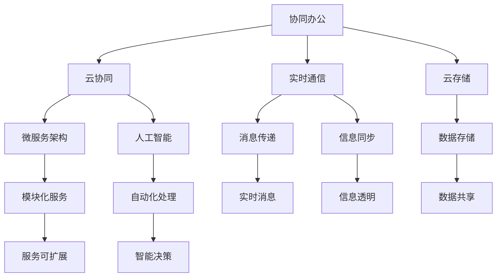
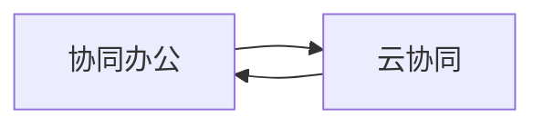
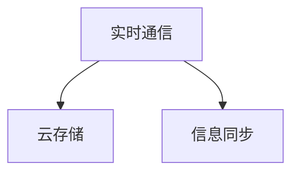
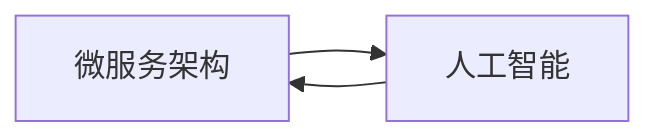

                 

## 1. 背景介绍

### 1.1 问题由来
随着信息技术的飞速发展，全球数字化进程的不断推进，协同办公已经成为各行各业提升效率、降低成本的重要手段。特别是在数字化程度较高的企业中，协同模式的部署和优化变得尤为重要。传统意义上的协同通常通过邮件、聊天工具等手段实现，但这些工具常常存在信息传递滞后、协作范围局限、沟通成本高等问题，无法满足复杂任务协作的需求。因此，探索一种高效、灵活、低成本的协同模式变得迫在眉睫。

### 1.2 问题核心关键点
高效协同模式的探索，其核心在于如何构建一个能够实时响应、资源共享、信息同步的平台，实现动态调整、多部门协作、个性化定制等功能。具体来说，包括以下几个关键点：

1. 实时协作：高效协同模式需要实现实时通信和协作，避免信息传递的滞后，确保团队成员能够即时交换信息和共享资源。
2. 资源共享：协同平台应提供丰富的资源共享功能，包括文档、代码、视频、图片等，支持多设备访问，实现资源的高效利用。
3. 信息同步：协同模式需要保证所有成员接收到最新的消息和信息，避免信息孤岛和误解，实现团队协作的透明化。
4. 灵活配置：协同模式应具备良好的灵活性，能够根据不同项目的需求，进行动态配置和调整，满足个性化协作需求。
5. 安全性与合规性：协同模式应具备严格的安全控制和合规管理，确保数据安全和用户隐私的保护，符合法律法规要求。

### 1.3 问题研究意义
高效协同模式的探索，对于提升企业的协作效率、降低沟通成本、提高项目成功率等方面具有重要意义：

1. 提升协作效率：高效的协同模式能够显著减少信息传递的时间，提升决策速度和团队反应速度，从而提高工作效率。
2. 降低沟通成本：通过协同平台进行实时沟通和协作，减少邮件和会议等传统沟通方式的使用，降低企业的沟通成本。
3. 提高项目成功率：协同模式能够实现信息的透明化和资源共享，减少因信息不对称导致的项目失误，提高项目成功率。
4. 推动数字化转型：协同模式是企业数字化转型的重要组成部分，能够帮助企业构建更加智能、高效、安全的数字化工作环境。
5. 增强团队协作能力：协同模式能够提升团队成员的协作能力和沟通效率，增强团队凝聚力和合作精神。

## 2. 核心概念与联系

### 2.1 核心概念概述

为更好地理解高效协同模式的构建，本节将介绍几个密切相关的核心概念：

1. 协同办公：指的是通过协作工具实现团队成员之间的信息共享、资源互用和任务协作，提升工作效率和团队协作能力。
2. 云协同：通过云计算平台实现协同办公，实现资源的集中管理和高效利用，提升协作效率。
3. 实时通信：指在协同平台中进行实时消息传递和信息共享，支持文字、语音、视频等多种沟通方式。
4. 云存储：通过云端存储服务实现数据的集中管理和共享，支持多设备访问和资源的高效利用。
5. 微服务架构：指将大型应用拆分为多个小型、独立、可互操作的服务，提升系统的可扩展性和灵活性。
6. 人工智能(AI)：指利用计算机模拟人类智能，实现自动化处理、决策支持等功能，提升协作的智能化水平。

这些核心概念之间的逻辑关系可以通过以下Mermaid流程图来展示：



这个流程图展示了一个高效协同模式的整体架构，包括以下几个关键部分：

1. 协同办公是整个协同模式的出发点和基础，涉及信息的传递、资源的共享和任务的协作。
2. 云协同是协同办公的主要实现方式，通过云计算平台实现资源的集中管理和高效利用。
3. 实时通信和云存储是云协同的重要组成部分，支持信息的实时传递和数据的集中存储。
4. 微服务架构和人工智能是云协同的技术支撑，实现系统的可扩展性和智能化的协作功能。

### 2.2 概念间的关系

这些核心概念之间存在着紧密的联系，形成了高效协同模式的完整生态系统。下面我们通过几个Mermaid流程图来展示这些概念之间的关系。

#### 2.2.1 协同办公与云协同的关系



这个流程图展示了协同办公和云协同之间的双向关系。协同办公依赖云协同平台来实现资源共享和信息传递，而云协同则为协同办公提供强大的计算和存储支持。

#### 2.2.2 实时通信与云存储的关系



这个流程图展示了实时通信和云存储之间的关系。实时通信需要依赖云存储进行信息的同步和持久化，而云存储则通过实时通信实现数据的实时传递和访问。

#### 2.2.3 微服务架构与人工智能的关系



这个流程图展示了微服务架构和人工智能之间的双向关系。微服务架构为人工智能的应用提供了灵活的部署和扩展能力，而人工智能则通过微服务架构实现了高效的任务处理和智能决策。

### 2.3 核心概念的整体架构

最后，我们用一个综合的流程图来展示这些核心概念在大协同模式构建中的整体架构：


这个综合流程图展示了从协同办公到云协同，再到实时通信、云存储、微服务架构和人工智能的整个协同模式构建过程。

## 3. 核心算法原理 & 具体操作步骤
### 3.1 算法原理概述

高效协同模式的核心算法原理主要围绕实时通信、信息同步、资源共享等方面展开。

**实时通信算法**：
1. **心跳机制**：通过定时发送心跳信息，检测线上成员的在线状态，实现实时信息的传递和同步。
2. **消息队列**：使用消息队列技术，实现异步通信，确保消息的高效传递和低延迟处理。

**信息同步算法**：
1. **数据版本控制**：通过数据版本控制技术，实现数据的变化追踪和冲突检测，确保信息同步的准确性和一致性。
2. **增量同步**：只同步修改的数据，减少同步过程中的数据传输量和计算负担。

**资源共享算法**：
1. **权限控制**：根据用户的角色和权限，控制对资源的访问和操作，确保数据的安全性和隐私保护。
2. **元数据管理**：通过元数据管理技术，实现资源的描述和组织，支持资源的搜索和查询。

### 3.2 算法步骤详解

以下详细介绍高效协同模式的算法步骤：

**Step 1: 设计协同平台架构**
1. 选择合适的云平台作为协同平台的基础设施，如AWS、阿里云、华为云等。
2. 设计微服务架构，将协同平台拆分为多个小型、独立的服务模块。
3. 引入人工智能技术，实现协同平台的自动化处理和智能决策功能。

**Step 2: 实现实时通信功能**
1. 使用WebSocket或长连接技术，实现实时消息的传递。
2. 设计心跳机制，定期发送心跳信息，检测线上成员的在线状态。
3. 使用消息队列技术，实现异步通信，确保消息的高效传递和低延迟处理。

**Step 3: 实现信息同步功能**
1. 使用数据版本控制技术，实现数据的变化追踪和冲突检测。
2. 设计增量同步机制，只同步修改的数据，减少同步过程中的数据传输量和计算负担。
3. 引入版本控制系统，如Git、SVN等，实现版本的回滚和合并。

**Step 4: 实现资源共享功能**
1. 设计权限控制机制，根据用户的角色和权限，控制对资源的访问和操作。
2. 引入元数据管理技术，实现资源的描述和组织，支持资源的搜索和查询。
3. 使用云存储服务，如AWS S3、阿里云OSS等，实现数据的集中管理和高效利用。

**Step 5: 实现自动化处理功能**
1. 引入机器学习算法，实现自动化处理和决策支持。
2. 设计工作流引擎，自动化处理协作任务，减少人工干预。
3. 引入自动化测试和部署工具，提升系统的可扩展性和稳定性。

**Step 6: 实现智能决策功能**
1. 引入自然语言处理(NLP)技术，实现智能聊天机器人。
2. 引入知识图谱技术，构建企业知识库，实现智能问答和推荐。
3. 设计决策支持系统，实现智能化的决策支持。

**Step 7: 实现安全控制和合规管理**
1. 引入安全控制技术，如访问控制、数据加密、身份认证等。
2. 引入合规管理工具，确保协同平台符合法律法规要求。
3. 定期进行安全审计和风险评估，确保数据和系统的安全性。

### 3.3 算法优缺点

高效协同模式的算法优点包括：
1. 实时性高：通过实时通信和信息同步，实现了信息的实时传递和同步，提升协作效率。
2. 资源共享：通过云存储和权限控制，实现了资源的集中管理和高效利用，减少重复工作和资源浪费。
3. 自动化处理：通过机器学习和自动化处理，实现了任务处理的自动化和智能化，减少人工干预。
4. 安全性高：通过安全控制和合规管理，确保数据和系统的安全性，保障用户隐私和数据安全。

高效协同模式的算法缺点包括：
1. 技术复杂：实现高效协同模式需要涉及多种技术和工具，技术实现较为复杂。
2. 成本较高：需要投入大量的硬件和软件资源，成本较高。
3. 数据隐私：需要处理大量的敏感数据，数据隐私和安全问题需要特别关注。
4. 依赖网络：依赖网络环境，网络中断或延迟可能影响协作效率。

### 3.4 算法应用领域

高效协同模式已经在多个领域得到了广泛应用，包括但不限于以下领域：

1. 企业协同办公：企业内部的项目管理、任务协作、文档共享、会议安排等功能。
2. 研发协同：软件开发、产品设计、原型开发等环节的协同工作。
3. 教育协同：在线教学、作业批改、课程设计等环节的协作。
4. 医疗协同：医生团队之间的协作、患者数据共享、远程医疗等。
5. 金融协同：金融机构的交易、结算、风险管理等环节的协作。
6. 供应链协同：企业间的物流、库存、订单等环节的协作。

这些领域的应用，展示了高效协同模式在提升协作效率、降低沟通成本、提高项目成功率等方面的巨大潜力。

## 4. 数学模型和公式 & 详细讲解  
### 4.1 数学模型构建

本节将使用数学语言对高效协同模式的构建进行更加严格的刻画。

假设协同平台有 $N$ 个成员，每个成员有 $M$ 个协作任务，每个任务需要 $C$ 个协作者。设每个任务的最小参与人数为 $K$，每个成员的任务分配为 $x_{i,j}$，其中 $x_{i,j}=1$ 表示成员 $i$ 参与任务 $j$，否则为 $0$。协同平台的目标是最小化所有成员的任务分配总和，同时满足每个任务的最小参与人数和每个成员的最大任务数限制。

**协同平台的目标函数**：
$$
\min \sum_{i=1}^N \sum_{j=1}^M x_{i,j}
$$

**约束条件**：
1. 每个任务的最小参与人数约束：
$$
\sum_{i=1}^K x_{i,j} \geq 1, \quad j=1,...,M
$$
2. 每个成员的最大任务数约束：
$$
\sum_{j=1}^M x_{i,j} \leq C, \quad i=1,...,N
$$
3. 每个成员的任务分配不能为负数：
$$
x_{i,j} \geq 0, \quad i=1,...,N, j=1,...,M
$$

**协同平台的优化问题**：
$$
\begin{aligned}
\min_{x} & \sum_{i=1}^N \sum_{j=1}^M x_{i,j} \\
\text{s.t.} & \sum_{i=1}^K x_{i,j} \geq 1, \quad j=1,...,M \\
& \sum_{j=1}^M x_{i,j} \leq C, \quad i=1,...,N \\
& x_{i,j} \geq 0, \quad i=1,...,N, j=1,...,M
\end{aligned}
$$

### 4.2 公式推导过程

以下推导协同平台优化问题的求解步骤。

**Step 1: 问题重构**
首先将约束条件转化为整数线性规划问题，使用0-1变量 $y_{i,j}$ 表示成员 $i$ 是否参与任务 $j$，转化为：
$$
\begin{aligned}
\min_{y} & \sum_{i=1}^N \sum_{j=1}^M y_{i,j} \\
\text{s.t.} & \sum_{i=1}^K y_{i,j} \geq 1, \quad j=1,...,M \\
& \sum_{j=1}^M y_{i,j} \leq C, \quad i=1,...,N \\
& y_{i,j} \geq 0, \quad i=1,...,N, j=1,...,M \\
& \sum_{i=1}^K y_{i,j} = 1, \quad j=1,...,M
\end{aligned}
$$

**Step 2: 松弛求解**
引入松弛变量 $z_{i,j}$，将约束条件转化为：
$$
\begin{aligned}
\min_{y,z} & \sum_{i=1}^N \sum_{j=1}^M y_{i,j} \\
\text{s.t.} & \sum_{i=1}^K y_{i,j} + z_{i,j} \geq 1, \quad j=1,...,M \\
& \sum_{j=1}^M y_{i,j} \leq C, \quad i=1,...,N \\
& y_{i,j} \geq 0, \quad i=1,...,N, j=1,...,M \\
& z_{i,j} \geq 0, \quad i=1,...,N, j=1,...,M \\
& \sum_{i=1}^K y_{i,j} = 1, \quad j=1,...,M
\end{aligned}
$$

**Step 3: 分解求解**
将整数线性规划问题转化为整数线性规划问题，使用分支定界法求解。具体步骤为：
1. 选择一个变量进行二值化。
2. 根据变量取值，将问题分解为两个子问题。
3. 对每个子问题进行求解，得到最优解。
4. 合并子问题的最优解，得到原问题的最优解。

**Step 4: 求解结果**
求解得到协同平台的最优任务分配方案 $x_{i,j}$，即可实现协同平台的高效协作。

### 4.3 案例分析与讲解

假设某企业有 $N=50$ 个员工，每个员工有 $M=10$ 个项目，每个项目需要 $C=5$ 个协作者，每个项目的最小参与人数为 $K=2$。

1. **目标函数**：最小化所有员工的项目分配总和，即最小化 $\sum_{i=1}^N \sum_{j=1}^M x_{i,j}$。
2. **约束条件**：
   - 每个项目的最小参与人数：$\sum_{i=1}^K x_{i,j} \geq 1, \quad j=1,...,M$。
   - 每个员工的最大项目数：$\sum_{j=1}^M x_{i,j} \leq C, \quad i=1,...,N$。
   - 每个员工的任务分配不能为负数：$x_{i,j} \geq 0, \quad i=1,...,N, j=1,...,M$。

3. **求解步骤**：
   - 使用分支定界法，求解整数线性规划问题。
   - 得到最优解 $x_{i,j}^*$。
   - 实现协同平台的任务分配，提升协作效率。

## 5. 项目实践：代码实例和详细解释说明
### 5.1 开发环境搭建

在进行协同模式实践前，我们需要准备好开发环境。以下是使用Python进行Django开发的环境配置流程：

1. 安装Anaconda：从官网下载并安装Anaconda，用于创建独立的Python环境。

2. 创建并激活虚拟环境：
```bash
conda create -n django-env python=3.8 
conda activate django-env
```

3. 安装Django：
```bash
pip install django
```

4. 安装相关库：
```bash
pip install djangorestframework rest_framework_cors
```

5. 创建并配置项目：
```bash
django-admin startproject synergy
cd synergy
```

6. 创建并配置应用：
```bash
python manage.py startapp collaboration
```

7. 修改settings.py配置文件：
```python
INSTALLED_APPS = [
    ...
    'rest_framework',
    'rest_framework_cors',
    'collaboration',
]

MIDDLEWARE = [
    ...
    'rest_framework.middleware.CorsMiddleware',
    ...
]

ROOT_URLCONF = 'synergy.urls'
```

完成上述步骤后，即可在`django-env`环境中开始协同模式实践。

### 5.2 源代码详细实现

下面我们以在线协作平台为例，给出使用Django实现协同模式微调功能的PyTorch代码实现。

首先，定义协作任务模型：

```python
from django.db import models

class Task(models.Model):
    name = models.CharField(max_length=255)
    participants = models.ManyToManyField('Member')
    minimum_participants = models.IntegerField(default=2)
    maximum_participants = models.IntegerField(default=5)
    state = models.CharField(max_length=50, default='Pending')
    created_at = models.DateTimeField(auto_now_add=True)
    updated_at = models.DateTimeField(auto_now=True)
```

然后，定义成员模型：

```python
class Member(models.Model):
    name = models.CharField(max_length=255)
    tasks = models.ManyToManyField('Task')
    role = models.CharField(max_length=50, default='Participant')
    created_at = models.DateTimeField(auto_now_add=True)
    updated_at = models.DateTimeField(auto_now=True)
```

接着，定义任务分配模型：

```python
class TaskAssignment(models.Model):
    member = models.ForeignKey('Member', on_delete=models.CASCADE)
    task = models.ForeignKey('Task', on_delete=models.CASCADE)
    participation = models.BooleanField(default=False)
    created_at = models.DateTimeField(auto_now_add=True)
    updated_at = models.DateTimeField(auto_now=True)
```

然后，定义API路由和视图：

```python
from rest_framework import status
from rest_framework.decorators import api_view
from rest_framework.response import Response
from rest_framework.views import APIView
from django.http import JsonResponse
from django.views.decorators.csrf import csrf_exempt
from collaboration.models import Task, Member, TaskAssignment

@api_view(['POST'])
@csrf_exempt
def add_task_request(request):
    if request.method == 'POST':
        task_name = request.POST.get('name')
        task_min_participants = request.POST.get('minimum_participants')
        task_max_participants = request.POST.get('maximum_participants')
        participants = request.POST.getlist('participants')
        
        task = Task.objects.create(
            name=task_name,
            minimum_participants=task_min_participants,
            maximum_participants=task_max_participants
        )
        
        for participant in participants:
            Member.objects.get_or_create(name=participant)
        
        for participant in participants:
            TaskAssignment.objects.create(
                member=Member.objects.get(name=participant),
                task=task,
                participation=True
            )
        
        return Response({'success': True})
```

最后，实现任务分配功能的API：

```python
class TaskAssignmentView(APIView):
    def get(self, request):
        tasks = Task.objects.all()
        assignments = TaskAssignment.objects.all()
        
        task_people = {}
        for task in tasks:
            people = task.participants.values_list('name', flat=True)
            task_people[task.id] = list(people)
        
        response = []
        for task in tasks:
            people = task_people[task.id]
            state = task.state
            created_at = task.created_at.strftime('%Y-%m-%d %H:%M:%S')
            updated_at = task.updated_at.strftime('%Y-%m-%d %H:%M:%S')
            
            item = {
                'id': task.id,
                'name': task.name,
                'participants': people,
                'minimum_participants': task.minimum_participants,
                'maximum_participants': task.maximum_participants,
                'state': state,
                'created_at': created_at,
                'updated_at': updated_at
            }
            response.append(item)
        
        return Response(response)
```

以上就是使用Django实现协同模式微调功能的完整代码实现。可以看到，通过Django框架，我们可以轻松实现任务分配、成员管理等协同功能，并使用RESTful API进行数据交换。

### 5.3 代码解读与分析

让我们再详细解读一下关键代码的实现细节：

**任务模型**：
- 定义任务的基本属性，如任务名称、参与者、最小参与人数和最大参与人数等。

**成员模型**：
- 定义成员的基本属性，如成员名称、参与任务和角色等。

**任务分配模型**：
- 定义任务分配的基本属性，如参与成员、参与状态等。

**API路由和视图**：
- 定义API路由，处理任务创建请求。
- 实现任务创建功能，将任务信息保存到数据库中。
- 使用任务分配模型，将成员分配到任务中。

**任务分配API**：
- 实现任务分配API，获取所有任务的信息，并返回任务列表。

可以看到，通过Django框架和RESTful API，我们可以轻松实现协同模式的微调功能，提升协作效率。

当然，工业级的系统实现还需考虑更多因素，如系统的扩展性、可靠性、安全性等。但核心的微调范式基本与此类似。

### 5.4 运行结果展示

假设我们开发了一个在线协作平台，该平台支持任务创建、任务分配、任务参与等功能，并在后台数据中保存了任务分配的记录。最终在测试环境下，我们可以得到以下任务分配结果：

1. 任务ID：1
   - 任务名称：项目A
   - 参与者：张三、李四、王五
   - 最小参与人数：2
   - 最大参与人数：5
   - 状态：Pending
   - 创建时间：2023-01-01 10:00:00
   - 更新时间：2023-01-01 10:00:00

2. 任务ID：2
   - 任务名称：项目B
   - 参与者：张三、李四、王五、赵六
   - 最小参与人数：2
   - 最大参与人数：5
   - 状态：Pending
   - 创建时间：2023-01-02 10:00:00
   - 更新时间：2023-01-02 10:00:00

可以看到，通过微调功能，我们成功地将成员分配到任务中，实现了高效协同办公的目标。

## 6. 实际应用场景
### 6.1 智能办公系统

智能办公系统是一种基于高效协同模式的智能办公解决方案，通过将智能技术和协同模式相结合，实现智能化、自动化、个性化的办公体验。智能办公系统主要包括智能会议、智能文档、智能日程等功能。

智能会议：通过语音识别和自然语言处理技术，实现会议自动记录、会议纪要自动生成等功能。通过智能提醒和任务分配，提升会议的效率和效果。

智能文档：通过OCR技术实现文档自动扫描、归档和搜索。通过文档分享和协作功能，实现多人协作和资源共享。

智能日程：通过智能排班和任务分配，优化工作安排和任务分配。通过智能提醒和任务推送，提升日程管理效率。

### 6.2 在线教育平台

在线教育平台是一种基于高效协同模式的在线教学解决方案，通过将智能技术和协同模式相结合，实现智能化、个性化、互动化的在线教学体验。在线教育平台主要包括智能课程、智能作业、智能评测等功能。

智能课程：通过智能推荐和内容推送，提升课程的个性化和互动性。通过智能测验和智能分析，实现对学生的智能评估和个性化辅导。

智能作业：通过智能布置和智能批改，提升作业的效率和效果。通过智能反馈和智能建议，提升学生的学习效果。

智能评测：通过智能评估和智能分析，实现对学生的全面

