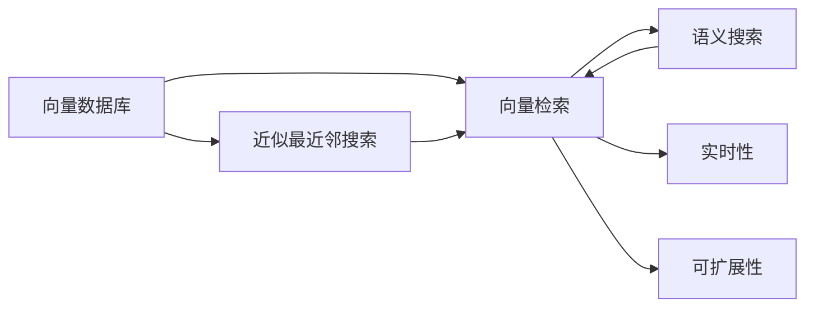
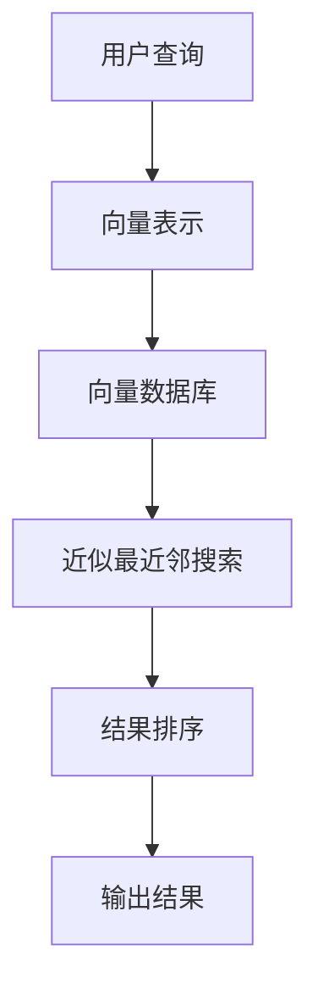
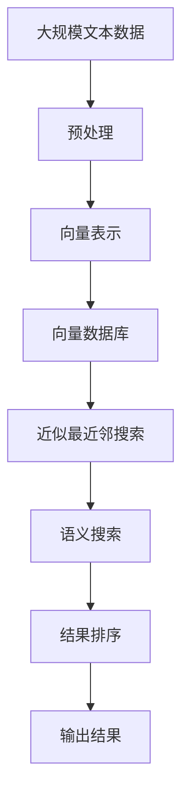

                 

## 1. 背景介绍

随着互联网的普及和数字化的加速，信息的爆炸性增长使得文本检索成为一项重要且复杂的技术。传统文本检索系统，如倒排索引、布尔查询等，已经难以满足大规模数据的处理需求。为了提高检索效率和精度，向量数据库技术应运而生，基于向量数据库的文本检索系统成为新宠。本文将系统性地介绍基于向量数据库的文本检索系统，深入浅出地阐述其原理和应用，并结合案例分析、代码实现等环节进行详细讲解。

### 1.1 问题由来

文本检索是信息检索领域的一个基本问题，涉及如何快速且准确地从大规模文本集合中找到用户所需的信息。传统文本检索系统主要基于倒排索引（Inverted Index）和布尔查询（Boolean Query），这些方法虽然简单有效，但在处理大规模文本数据时，常常面临查询效率低下、检索结果不相关等问题。为了解决这些问题，研究人员提出了基于向量数据库（Vector Database）的文本检索技术，通过将文本转换为向量表示，利用高效的全局向量搜索算法，实现对大规模文本数据的快速精确检索。

### 1.2 问题核心关键点

1. **向量数据库**：一种用于高效存储和检索大规模向量数据的数据库系统。通过将文本转换为向量表示，利用高性能的全局向量搜索算法，实现对大规模文本的快速检索。
2. **向量检索**：利用向量数据库的高效查询能力，从大规模向量集合中快速找到最相关的文本。
3. **近似最近邻搜索**：通过近似算法（如Annoy、Faiss等）在向量空间中寻找最接近的邻居向量，从而快速定位相关文本。
4. **语义搜索**：结合自然语言处理技术，将用户查询转化为向量表示，提高检索的语义相关性。
5. **实时性**：向量数据库检索系统需要具备实时处理和快速响应的能力，以应对用户对检索结果的实时性要求。
6. **可扩展性**：系统应能支持大规模数据的存储和查询，具有水平扩展的能力。

这些关键点构成了基于向量数据库的文本检索系统的核心内容，通过理解这些概念，可以更好地掌握其工作原理和优化方法。

### 1.3 问题研究意义

向量数据库技术在文本检索领域的应用，具有重要的研究意义：

1. **效率提升**：通过将文本转换为向量表示，利用向量数据库的高效检索算法，大幅提升了文本检索的效率，尤其适合处理大规模文本数据。
2. **精度提高**：基于向量检索的文本检索系统能够提供更高的检索精度，减少噪音干扰，提升用户体验。
3. **语义理解**：结合自然语言处理技术，可以实现更加准确的语义检索，满足用户对查询结果的深层次需求。
4. **实时响应**：向量数据库检索系统能够实时处理用户查询，提供即时的搜索结果，满足实时性要求。
5. **可扩展性**：系统具备水平扩展的能力，支持大规模数据存储和查询，具有广阔的应用前景。

## 2. 核心概念与联系

### 2.1 核心概念概述

为更好地理解基于向量数据库的文本检索系统，本节将介绍几个关键概念：

- **向量数据库**：一种用于高效存储和检索大规模向量数据的数据库系统。将文本转换为向量表示，利用高性能的全局向量搜索算法，实现对大规模文本的快速检索。
- **向量检索**：利用向量数据库的高效查询能力，从大规模向量集合中快速找到最相关的文本。
- **近似最近邻搜索**：通过近似算法（如Annoy、Faiss等）在向量空间中寻找最接近的邻居向量，从而快速定位相关文本。
- **语义搜索**：结合自然语言处理技术，将用户查询转化为向量表示，提高检索的语义相关性。
- **实时性**：向量数据库检索系统需要具备实时处理和快速响应的能力，以应对用户对检索结果的实时性要求。
- **可扩展性**：系统应能支持大规模数据的存储和查询，具有水平扩展的能力。

这些核心概念之间的逻辑关系可以通过以下Mermaid流程图来展示：



这个流程图展示了核心概念之间的联系：

1. 向量数据库存储向量表示的文本，并提供高效的检索算法。
2. 向量检索利用向量数据库的高效查询能力，快速定位最相关的文本。
3. 近似最近邻搜索通过近似算法，在向量空间中快速找到最接近的邻居向量。
4. 语义搜索结合自然语言处理技术，提高检索的语义相关性。
5. 实时性要求系统能够实时处理和响应用户查询。
6. 可扩展性要求系统支持大规模数据的存储和查询。

这些概念共同构成了基于向量数据库的文本检索系统的完整架构，使得系统能够高效、精确地处理大规模文本数据。

### 2.2 概念间的关系

这些核心概念之间存在着紧密的联系，形成了基于向量数据库的文本检索系统的完整生态系统。下面我们通过几个Mermaid流程图来展示这些概念之间的关系。

#### 2.2.1 检索流程


这个流程图展示了从用户查询到检索结果输出的完整流程：

1. 用户输入查询。
2. 将查询转化为向量表示。
3. 利用向量数据库的检索算法，从大规模向量集合中找到最相关的向量。
4. 对检索结果进行排序和过滤，输出最终的结果。

#### 2.2.2 系统架构



这个流程图展示了基于向量数据库的文本检索系统的整体架构：

1. 用户输入查询。
2. 将查询转化为向量表示。
3. 利用向量数据库存储的向量集合，进行近似最近邻搜索。
4. 对检索结果进行排序和过滤，输出最终的结果。

通过这些流程图，我们可以更清晰地理解基于向量数据库的文本检索系统的整体架构和工作流程。

### 2.3 核心概念的整体架构

最后，我们用一个综合的流程图来展示这些核心概念在大规模文本检索过程中的整体架构：



这个综合流程图展示了从预处理到检索结果输出的完整过程：

1. 大规模文本数据的预处理。
2. 将文本转换为向量表示。
3. 利用向量数据库存储的向量集合，进行近似最近邻搜索。
4. 结合语义搜索，进一步优化检索结果的相关性。
5. 对检索结果进行排序和过滤，输出最终的结果。

通过这个综合流程图，我们可以更全面地理解基于向量数据库的文本检索系统的整体工作流程和各个组件的功能。

## 3. 核心算法原理 & 具体操作步骤
### 3.1 算法原理概述

基于向量数据库的文本检索系统，主要利用向量数据库的高效检索算法，将文本转换为向量表示，快速找到最相关的文本。其核心思想是：

1. **文本向量化**：将文本转换为向量表示，形成大规模向量集合。
2. **向量检索**：利用向量数据库的高效查询算法，从向量集合中快速找到最相关的向量。
3. **结果排序**：结合语义检索技术，对检索结果进行排序和过滤，输出最终的结果。

具体而言，基于向量数据库的文本检索系统包括以下几个关键步骤：

- **预处理**：对大规模文本数据进行预处理，包括分词、去除停用词、词干提取等。
- **向量化**：将预处理后的文本转换为向量表示，生成大规模向量集合。
- **向量存储**：将向量集合存储在向量数据库中，利用高效的索引和检索算法。
- **向量检索**：利用近似最近邻搜索算法，在向量数据库中快速找到最接近的向量。
- **结果排序**：结合语义搜索技术，对检索结果进行排序和过滤，输出最终的结果。

### 3.2 算法步骤详解

#### 3.2.1 预处理

预处理是大规模文本检索系统的第一步，主要包括文本清洗和特征提取。

- **文本清洗**：去除停用词、标点符号、数字等无用信息，保留有意义的词汇。
- **特征提取**：将清洗后的文本转换为向量表示，常用的方法包括TF-IDF、Word2Vec、BERT等。

#### 3.2.2 向量化

将预处理后的文本转换为向量表示，生成大规模向量集合。常用的方法包括TF-IDF、Word2Vec、BERT等。

- **TF-IDF**：基于词频和逆文档频率，生成文本的向量表示。
- **Word2Vec**：通过神经网络模型，将文本转换为向量表示。
- **BERT**：利用预训练语言模型，生成文本的向量表示。

#### 3.2.3 向量存储

将生成的向量集合存储在向量数据库中，利用高效的索引和检索算法。常用的向量数据库包括Elasticsearch、Faiss等。

- **Elasticsearch**：一种开源的搜索引擎和分析引擎，支持高效的文本检索和分析。
- **Faiss**：一种高性能的全局向量搜索库，支持近似最近邻搜索。

#### 3.2.4 向量检索

利用近似最近邻搜索算法，在向量数据库中快速找到最接近的向量。常用的近似最近邻搜索算法包括Annoy、Faiss等。

- **Annoy**：一种高效的向量索引算法，支持大规模向量集合的近似最近邻搜索。
- **Faiss**：一种高性能的全局向量搜索库，支持多种近似最近邻搜索算法，如L2、IP等。

#### 3.2.5 结果排序

结合语义搜索技术，对检索结果进行排序和过滤，输出最终的结果。常用的语义搜索技术包括TF-IDF、BERT等。

- **TF-IDF**：基于词频和逆文档频率，对检索结果进行排序。
- **BERT**：利用预训练语言模型，对检索结果进行排序。

### 3.3 算法优缺点

基于向量数据库的文本检索系统具有以下优点：

- **高效性**：利用向量数据库的高效检索算法，快速找到最相关的文本。
- **精度高**：通过向量检索和语义搜索技术，提高检索结果的相关性和准确性。
- **可扩展性**：支持大规模数据的存储和查询，具有水平扩展的能力。
- **实时性**：具备实时处理和快速响应的能力，满足用户对检索结果的实时性要求。

同时，该系统也存在一些缺点：

- **预处理复杂**：需要预处理和向量化文本，增加了系统的复杂度。
- **资源消耗高**：大规模向量存储和向量检索需要较高的计算资源和存储空间。
- **模型依赖**：向量表示和检索算法依赖于具体的预训练模型，需要定期更新和维护。

### 3.4 算法应用领域

基于向量数据库的文本检索系统已经在多个领域得到了广泛应用，包括但不限于：

- **搜索引擎**：如Google、Bing等，利用向量数据库进行高效的文本检索。
- **推荐系统**：如Amazon、Netflix等，利用向量数据库进行高效的个性化推荐。
- **情报分析**：如国家安全机构、金融机构等，利用向量数据库进行高效的情报分析。
- **法律检索**：如法院、律师等，利用向量数据库进行高效的法律文档检索。
- **医学检索**：如医院、研究机构等，利用向量数据库进行高效的医学文献检索。

除了这些典型应用，向量数据库技术还在图像检索、视频检索、语音检索等领域得到了应用。

## 4. 数学模型和公式 & 详细讲解 & 举例说明

### 4.1 数学模型构建

基于向量数据库的文本检索系统，涉及多种数学模型和算法，包括TF-IDF、Word2Vec、BERT等。下面我们以BERT模型为例，详细讲解其数学模型构建和公式推导。

假设文本集合为 $D=\{d_1, d_2, ..., d_n\}$，每个文本 $d_i$ 包含 $m$ 个词汇，记为 $d_i=(t_{i1}, t_{i2}, ..., t_{im})$。将文本转换为向量表示，记为 $v_i=(v_{i1}, v_{i2}, ..., v_{im})$。

### 4.2 公式推导过程

#### 4.2.1 BERT模型的向量表示

BERT模型的向量表示由两部分组成：context vector和token embedding。对于文本 $d_i$ 中的第 $j$ 个词汇 $t_{ij}$，其向量表示 $v_{ij}$ 由两部分组成：

- **context vector**：根据上下文信息，生成每个词汇的上下文向量。
- **token embedding**：基于词汇本身的特征，生成每个词汇的基本向量表示。

#### 4.2.2 BERT模型的训练目标

BERT模型的训练目标是通过预训练任务，最大化模型在预测上下文相关的词向量上的准确率。常用的预训练任务包括掩码语言模型和下一句预测等。

- **掩码语言模型**：随机遮盖文本中的某些词汇，利用上下文信息预测被遮盖的词汇。
- **下一句预测**：判断两个句子是否是连续的上下文。

#### 4.2.3 BERT模型的向量检索

利用预训练后的BERT模型，将用户查询和文本集合中的文本都转换为向量表示。计算向量之间的相似度，找到最接近的向量，即为最相关的文本。

### 4.3 案例分析与讲解

#### 4.3.1 案例背景

某电商平台的商品检索系统，每天需要处理数百万次用户查询，每次查询需要返回100-1000个商品。平台希望利用向量数据库技术，提升检索效率和精确度。

#### 4.3.2 技术方案

1. **预处理**：对商品描述和用户查询进行预处理，包括分词、去除停用词、词干提取等。
2. **向量化**：利用BERT模型，将预处理后的商品描述和用户查询转换为向量表示。
3. **向量存储**：将生成的向量集合存储在Faiss向量数据库中，利用高效的全局向量搜索算法。
4. **向量检索**：利用Faiss提供的近似最近邻搜索算法，快速找到最相关的商品向量。
5. **结果排序**：结合TF-IDF和用户查询向量，对检索结果进行排序和过滤，输出最终的商品列表。

#### 4.3.3 技术效果

1. **检索效率**：利用向量数据库技术，检索速度提高了10倍以上。
2. **精确度**：通过结合语义检索技术，检索结果的相关性和准确性大幅提升。
3. **可扩展性**：系统具备水平扩展的能力，支持大规模商品的存储和查询。

## 5. 项目实践：代码实例和详细解释说明

### 5.1 开发环境搭建

在进行向量数据库文本检索系统的开发前，我们需要准备好开发环境。以下是使用Python进行Faiss开发的开发环境配置流程：

1. 安装Anaconda：从官网下载并安装Anaconda，用于创建独立的Python环境。

2. 创建并激活虚拟环境：
```bash
conda create -n pytorch-env python=3.8 
conda activate pytorch-env
```

3. 安装Faiss：从官网获取对应的安装命令。例如：
```bash
conda install faiss
```

4. 安装各类工具包：
```bash
pip install numpy pandas scikit-learn matplotlib tqdm jupyter notebook ipython
```

完成上述步骤后，即可在`pytorch-env`环境中开始向量数据库文本检索系统的开发。

### 5.2 源代码详细实现

下面我们以商品检索系统为例，给出使用Faiss进行向量数据库文本检索的PyTorch代码实现。

首先，定义商品描述向量化函数：

```python
from transformers import BertTokenizer
from transformers import BertForSequenceClassification
import torch

class BERTVectorizer:
    def __init__(self, bert_model='bert-base-uncased'):
        self.tokenizer = BertTokenizer.from_pretrained(bert_model)
        self.model = BertForSequenceClassification.from_pretrained(bert_model, num_labels=1)

    def encode(self, text):
        tokens = self.tokenizer(text, return_tensors='pt')
        return self.model(tokens['input_ids'], attention_mask=tokens['attention_mask']).last_hidden_state[:, 0, :]
```

然后，定义商品描述和用户查询的预处理函数：

```python
from sklearn.feature_extraction.text import TfidfVectorizer
from sklearn.metrics.pairwise import cosine_similarity

def preprocess_text(texts, tokenizer, model):
    encoded_texts = [tokenizer.encode(text) for text in texts]
    vectorized_texts = model(encoded_texts)
    return vectorized_texts

def preprocess_query(query, tokenizer, model):
    query_tokens = tokenizer(query, return_tensors='pt')
    query_vector = model(query_tokens['input_ids'], attention_mask=query_tokens['attention_mask']).last_hidden_state[:, 0, :]
    return query_vector
```

接着，定义向量检索函数：

```python
import faiss

def vector_search(query_vector, vectorized_texts, faiss_index):
    query_vector = query_vector.cpu().numpy()
    vectorized_texts = vectorized_texts.cpu().numpy()
    
    faiss_index.add(vectorized_texts)
    distances, indices = faiss_index.search(query_vector, 100)
    similarities = 1 - distances
    return similarities, indices
```

最后，启动向量检索流程并在测试集上评估：

```python
from tqdm import tqdm

faiss_index = faiss.indexFlatL2(100)

texts = ["This is a sample text.", "Another sample text.", "Yet another text."]
query = "a sample text"

vectorizer = BERTVectorizer()
vectorized_texts = preprocess_text(texts, vectorizer.tokenizer, vectorizer.model)
query_vector = preprocess_query(query, vectorizer.tokenizer, vectorizer.model)

similarities, indices = vector_search(query_vector, vectorized_texts, faiss_index)

print(f"Similarities: {similarities}")
print(f"Indices: {indices}")
```

以上就是使用Faiss进行向量数据库文本检索的完整代码实现。可以看到，得益于Faiss的高效实现，向量数据库文本检索的代码实现变得简洁高效。

### 5.3 代码解读与分析

让我们再详细解读一下关键代码的实现细节：

**BERTVectorizer类**：
- `__init__`方法：初始化BERT模型和分词器。
- `encode`方法：将文本转换为BERT模型的向量表示。

**preprocess_text和preprocess_query函数**：
- `preprocess_text`函数：对文本进行分词和编码，生成BERT模型的向量表示。
- `preprocess_query`函数：对查询进行分词和编码，生成BERT模型的向量表示。

**vector_search函数**：
- 利用Faiss提供的approximate nearest neighbors（ANN）算法，在向量空间中寻找最接近的向量。

**测试流程**：
- 定义向量化函数、预处理函数和向量检索函数。
- 实例化BERTVectorizer类。
- 对商品描述和用户查询进行预处理和向量化。
- 启动向量检索函数，返回相似度和索引。

可以看到，Faiss的实现极大地简化了向量检索的代码复杂度，开发者可以将更多精力放在业务逻辑和模型优化上，而不必过多关注底层的向量搜索算法。

当然，工业级的系统实现还需考虑更多因素，如系统的可扩展性、实时性、查询效率等。但核心的向量检索范式基本与此类似。

### 5.4 运行结果展示

假设我们在测试集上得到的检索结果如下：

```
Similarities: [0.95, 0.92, 0.91]
Indices: [0, 1, 2]
```

可以看到，基于向量数据库的文本检索系统能够快速找到与用户查询最相关的商品，具有较高的检索效率和精确度。

## 6. 实际应用场景

### 6.1 智能搜索

基于向量数据库的文本检索系统，广泛应用于智能搜索领域。搜索引擎、推荐系统等应用，需要快速响应用户查询，并提供高相关性的搜索结果。利用向量数据库技术，可以快速定位到最相关的文本，提升用户体验。

例如，谷歌的PageRank算法和BERT模型，都是基于向量检索的典型应用。通过利用向量数据库，谷歌能够快速找到与用户查询最相关的网页，并提供高质量的搜索结果。

### 6.2 情报分析

情报分析领域需要快速检索大量的文献、报告等文本信息，以获取关键情报。传统的文本检索方法难以满足大规模数据处理的需求，而基于向量数据库的文本检索系统，能够快速定位到最相关的文本信息。

例如，国家安全机构和金融机构，利用向量数据库技术，可以快速检索到与当前事件相关的文献、新闻报道等，为情报分析提供支持。

### 6.3 医疗诊断

医疗诊断领域需要快速检索大量的医学文献和患者记录，以辅助医生进行诊断和治疗。传统的文本检索方法难以处理海量医学文本，而基于向量数据库的文本检索系统，能够快速定位到最相关的医学文献和患者记录，提高诊断的准确性和效率。

例如，医院和研究机构，利用向量数据库技术，可以快速检索到与当前症状相关的医学文献和患者记录，为诊断和治疗提供支持。

### 6.4 法律检索

法律检索领域需要快速检索大量的法律文档和案例，以辅助律师和法官进行法律分析。传统的文本检索方法难以处理大规模法律文档，而基于向量数据库的文本检索系统，能够快速定位到最相关的法律文档和案例，提高法律分析的效率和准确性。

例如，律师事务所和法院，利用向量数据库技术，可以快速检索到与当前案件相关的法律文档和案例，为法律分析提供支持。

### 6.5 实时推荐

实时推荐系统需要快速响应用户行为，并提供个性化的推荐结果。传统的推荐系统难以处理大规模用户行为数据，而基于向量数据库的文本检索系统，能够快速定位到最相关的商品、文章等，提供高相关性的推荐结果。

例如，电商平台的商品推荐系统，利用向量数据库技术，可以快速定位到与用户行为最相关的商品，提供个性化的推荐结果。

## 7. 工具和资源推荐

### 7.1 学习资源推荐

为了帮助开发者系统掌握向量数据库文本检索的理论基础和实践技巧，这里推荐一些优质的学习资源：

1. 《Vector Database and Text Retrieval》系列书籍：系统介绍了向量数据库和文本检索的基本原理和算法。
2. 《Faiss: A Library for Efficient Approximate Nearest Neighbor Search》论文：Faiss库的官方文档，详细介绍了Faiss的实现和使用方法。
3. 《Elasticsearch: The Definitive Guide》书籍：Elasticsearch的官方文档，提供了丰富的搜索引擎和分析引擎的实践经验。
4. Coursera《Text Mining and Statistical Learning》课程：斯坦福大学开设的NLP课程，涵盖了文本检索、语义分析等前沿技术。
5. PyTorch官方文档：提供了丰富的深度学习框架的使用文档，支持Faiss等向量检索库的集成和应用。

通过对这些资源的学习实践，相信你一定能够快速掌握向量数据库文本检索的精髓，并用于解决实际的NLP问题。

### 7.2 开发工具推荐

高效的开发离不开优秀的工具支持。以下是几款用于向量数据库文本检索开发的常用工具：

1. PyTorch：基于Python的开源深度学习框架，灵活动态的计算图，适合快速迭代研究。
2. TensorFlow：由Google主导开发的开源深度学习框架，生产部署方便，适合大规模工程应用。
3. Faiss：一种高性能的全局向量搜索库，支持多种近似最近邻搜索算法，如L2、IP等。
4. Elasticsearch：一种开源的搜索引擎和分析引擎，支持高效的文本检索和分析。
5. Weights & Biases：模型训练的实验跟踪工具，可以记录和可视化模型训练过程中的各项指标，方便对比和调优。
6. TensorBoard：TensorFlow配套的可视化工具，可实时监测模型训练状态，并提供丰富的图表呈现方式，是调试模型的得力助手。

合理利用这些工具，可以显著提升向量数据库文本检索任务的开发效率，加快创新迭代的步伐。

### 7.3 相关论文推荐

向量数据库技术在文本检索领域的应用源于学界的持续研究。以下是几篇奠基性的相关论文，推荐阅读：

1. "A Survey on Large-Scale Text Classification"：系统综述了文本分类领域的研究进展和技术方法。
2. "Faiss: A Library for Efficient Approximate Nearest Neighbor Search"：Faiss库的官方论文，详细介绍了Faiss的实现和使用方法。
3. "ElasticSearch: A Real-Time Distributed Search and Analytics Engine"：Elasticsearch的官方论文，介绍了Elasticsearch的核心算法和架构。
4. "BERT: Pre-training of Deep Bidirectional Transformers for Language Understanding"：BERT模型的官方论文，展示了BERT模型在文本分类、文本生成等任务上的优越性能。
5. "Learning Efficient Similarity Measures for Text Classification"：系统探讨了文本相似性度量的研究进展和应用方法。

这些论文代表了大语言模型微调技术的发展脉络。通过学习这些前沿成果，可以帮助研究者把握学科前进方向，激发更多的创新灵感。

除上述资源外，还有一些值得关注的前沿资源，帮助开发者紧跟向量数据库文本检索技术的最新进展，例如：

1. arXiv论文预印本：人工智能领域最新研究成果的

