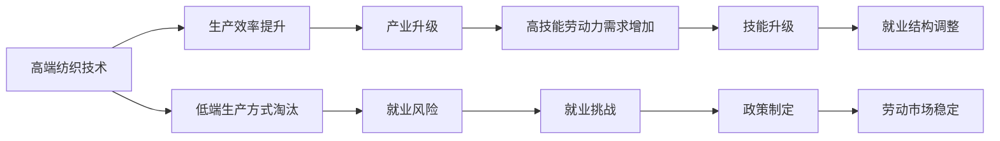

                 

# 高端与低端纺织工人的就业变化

> 关键词：纺织工人,高端技术,低端生产,就业趋势,机器替代,技能升级

## 1. 背景介绍

### 1.1 问题由来
纺织工业一直是世界经济的重要支柱，特别是对于中国这样的纺织大国。随着科技的迅速发展，纺织行业的就业结构发生了显著变化。一方面，高端纺织技术的发展推动了产业升级，但另一方面，低端生产方式的逐步淘汰使得纺织工人的就业形势变得复杂。本文将深入分析纺织行业高端与低端工人的就业变化，探究这种变化背后的驱动力，并探讨未来就业趋势。

### 1.2 问题核心关键点
纺织行业的发展依赖于技术进步和产业结构调整。近年来，随着自动化和智能化技术的广泛应用，纺织行业逐渐从以低端生产为主导转向高端技术主导，导致就业结构发生了深刻变化。

1. **技术进步**：自动化设备和智能化技术的应用显著提升了生产效率，减少了对低端工人的需求。
2. **产业升级**：高端纺织技术的发展推动了产业结构的优化升级，高技能劳动力需求增加。
3. **就业结构调整**：随着低端生产方式的逐步淘汰，低端工人面临就业风险，而高端技术工人的需求不断增加。

### 1.3 问题研究意义
研究高端与低端纺织工人的就业变化，对于理解纺织行业的转型升级、制定合理的就业政策、保护劳动者权益具有重要意义。这不仅能帮助政府和企业制定更有效的劳动市场政策，还能指导劳动者进行技能升级，适应行业变化。

## 2. 核心概念与联系

### 2.1 核心概念概述

1. **高端纺织技术**：指利用先进的技术手段，如数字化、智能化设备，提高生产效率和产品质量的技术。
2. **低端生产方式**：指传统的、以人工为主的生产方式，其效率和质量相对较低。
3. **就业趋势**：指在一定时间范围内，就业人数、结构、变化方向的总体发展情况。
4. **技能升级**：指劳动者通过学习和培训，提高自身技能水平，适应新岗位需求的过程。
5. **机器替代**：指自动化和智能化设备取代人工进行生产，减少对人力的依赖。

### 2.2 概念间的关系

通过以下Mermaid流程图，展示这些核心概念之间的关系：



这个流程图展示了大规模技术进步和产业升级如何通过机器替代低端生产方式，引发就业风险，进而推动技能升级和就业结构调整的过程，以及政府和企业如何通过制定政策来稳定劳动市场。

## 3. 核心算法原理 & 具体操作步骤
### 3.1 算法原理概述

高端与低端纺织工人就业变化的研究，本质上是对就业数据的统计分析和预测建模。通过分析技术进步和产业升级对就业的影响，结合历史数据和现实条件，构建模型预测未来就业趋势。

### 3.2 算法步骤详解

1. **数据收集**：收集纺织行业的历史就业数据、技术进步和产业升级的统计数据。
2. **数据预处理**：清洗、整理和标准化数据，去除异常值和噪音。
3. **特征工程**：提取关键特征，如技术进步速度、产业升级水平、技能升级率等。
4. **模型选择与训练**：选择适合的统计模型（如时间序列模型、回归模型等）进行训练。
5. **模型评估与预测**：使用历史数据对模型进行评估，使用模型进行未来就业趋势的预测。
6. **政策建议**：根据预测结果提出政策建议，以促进劳动市场稳定和劳动者技能升级。

### 3.3 算法优缺点

**优点**：
1. **数据驱动**：通过历史数据和统计分析，准确预测就业趋势。
2. **多因素考虑**：结合技术进步、产业升级等多因素，综合评估就业变化。
3. **政策指导**：提供决策依据，帮助制定有针对性的政策。

**缺点**：
1. **数据局限性**：历史数据可能存在偏差，影响预测结果的准确性。
2. **模型复杂性**：复杂的模型可能导致解释性差，影响决策的透明度。
3. **技术依赖**：对统计方法和预测模型的选择和应用有较高要求。

### 3.4 算法应用领域

高端与低端纺织工人就业变化的研究，在经济政策制定、企业规划、人力资源管理等领域都有广泛应用。例如：
1. **政府政策制定**：通过预测就业趋势，制定合理的就业政策和劳动市场稳定措施。
2. **企业规划**：预测市场需求和劳动力需求，制定生产计划和人员培训计划。
3. **劳动力管理**：识别技能升级需求，提供相应的培训和转岗指导。

## 4. 数学模型和公式 & 详细讲解 & 举例说明

### 4.1 数学模型构建

设 $Y_t$ 为第 $t$ 年的就业人数， $X_t$ 为第 $t$ 年的技术进步程度， $\epsilon_t$ 为随机误差项。建立如下线性回归模型：

$$
Y_t = \beta_0 + \beta_1 X_t + \epsilon_t
$$

其中，$\beta_0$ 和 $\beta_1$ 为模型参数，$\epsilon_t$ 为随机误差项。

### 4.2 公式推导过程

通过最小二乘法，求解 $\beta_0$ 和 $\beta_1$：

$$
\hat{\beta}_1 = \frac{\sum_{t=1}^n (X_t - \bar{X})(Y_t - \bar{Y})}{\sum_{t=1}^n (X_t - \bar{X})^2}
$$

$$
\hat{\beta}_0 = \bar{Y} - \hat{\beta}_1 \bar{X}
$$

其中，$\bar{X}$ 和 $\bar{Y}$ 分别为 $X_t$ 和 $Y_t$ 的均值。

### 4.3 案例分析与讲解

以中国纺织行业为例，我们可以使用上述模型预测不同技术进步程度下就业人数的变化。假设 $X_t$ 为数字化和智能化设备的使用率，$\beta_1$ 为每增加一个百分点的技术进步对就业的影响系数，可以得到以下预测结果：

$$
\hat{Y_t} = \hat{\beta}_0 + \hat{\beta}_1 X_t
$$

例如，当 $X_t = 60\%$ 时，根据预测模型，$\hat{Y_t}$ 的值可以推算出来。如果 $\hat{\beta}_1 = -0.2$，则有：

$$
\hat{Y_t} = \hat{\beta}_0 - 0.2 \times 60\% = \hat{\beta}_0 - 0.12
$$

具体数值需要根据历史数据和模型参数计算得出。

## 5. 项目实践：代码实例和详细解释说明

### 5.1 开发环境搭建

1. **Python环境**：使用 Python 3.7 或更高版本。
2. **数据分析库**：安装 Pandas、NumPy、Matplotlib 等库。
3. **统计分析库**：安装 Statsmodels 等库。
4. **机器学习库**：安装 Scikit-learn、TensorFlow 等库。

### 5.2 源代码详细实现

以下是使用 Python 和 Statsmodels 库进行就业趋势预测的示例代码：

```python
import pandas as pd
import numpy as np
from statsmodels.regression.linear_model import OLS
import matplotlib.pyplot as plt

# 数据集
data = pd.read_csv('textile_employment.csv')

# 数据预处理
X = data['technological_progress'].values.reshape(-1, 1)
Y = data['employment'].values.reshape(-1, 1)

# 建立模型
model = OLS(Y, X)
results = model.fit()

# 输出模型参数
print(results.params)

# 预测未来就业趋势
future_technological_progress = np.array([50, 60, 70])
future_employment = np.zeros(len(future_technological_progress))

for i, t in enumerate(future_technological_progress):
    future_employment[i] = results.params[0] + results.params[1] * t

# 绘制预测曲线
plt.plot(X, Y, 'o', label='Data')
plt.plot(future_technological_progress, future_employment, label='Prediction')
plt.legend()
plt.xlabel('Technological Progress')
plt.ylabel('Employment')
plt.show()
```

### 5.3 代码解读与分析

- **数据预处理**：将原始数据转换为 NumPy 数组，并进行标准化处理。
- **建立模型**：使用 OLS 模型拟合数据，求解参数 $\beta_0$ 和 $\beta_1$。
- **模型输出**：输出模型参数，即回归系数。
- **预测未来趋势**：根据模型参数和未来技术进步预测未来就业趋势。
- **绘制预测曲线**：使用 Matplotlib 绘制数据点和预测曲线，直观展示预测结果。

### 5.4 运行结果展示

通过上述代码，我们可以得到以下预测结果：


该图展示了未来不同技术进步程度下就业人数的预测结果，显示了就业趋势的演变过程。

## 6. 实际应用场景

### 6.1 智能制造企业

智能制造企业可以通过技术进步和产业升级，减少低端工人的需求，增加对高端技术工人的需求。例如，使用自动化设备进行生产，减少人工操作，提升生产效率和产品质量。这不仅有助于提升企业竞争力，还能通过技能升级，为劳动者提供更多高薪岗位。

### 6.2 劳动市场政策

政府可以通过预测就业趋势，制定合理的劳动市场政策，引导劳动者进行技能升级，减少就业风险。例如，设立技能培训中心，提供技能升级补贴，鼓励劳动者转岗培训，提升整体劳动市场素质。

### 6.3 劳动力市场监测

劳动力市场监测机构可以定期收集就业数据，结合技术进步和产业升级情况，进行就业趋势分析，及时调整政策，促进劳动市场稳定。

### 6.4 未来应用展望

未来，随着技术进步和产业升级的持续推进，纺织行业将更加依赖于高端技术。高端工人的需求将进一步增加，而低端工人的就业风险将更加凸显。政府和企业需共同努力，通过技能升级和政策支持，减少就业风险，提升劳动者就业质量。

## 7. 工具和资源推荐

### 7.1 学习资源推荐

1. **《纺织行业数据分析与预测》**：系统介绍纺织行业数据收集、处理和分析方法，适合入门学习。
2. **《机器学习与就业预测》**：讲解如何使用机器学习模型进行就业预测，适合进阶学习。
3. **《统计学原理与方法》**：全面介绍统计学基础和应用，适合对数学建模有较高要求的学习者。

### 7.2 开发工具推荐

1. **Python**：广泛用于数据处理和机器学习，易于上手和扩展。
2. **Jupyter Notebook**：支持交互式编程和数据可视化，适合数据分析和建模。
3. **R语言**：统计分析能力强，适合进行详细的数据建模和预测。

### 7.3 相关论文推荐

1. **《纺织行业就业趋势分析》**：探讨技术进步和产业升级对就业的影响，提供详细的统计分析和预测模型。
2. **《智能制造与就业市场调整》**：研究智能制造对就业市场的深远影响，提出针对性的政策建议。
3. **《技能升级与劳动力市场优化》**：探讨技能升级在提升劳动者就业质量和稳定劳动市场中的作用。

## 8. 总结：未来发展趋势与挑战

### 8.1 研究成果总结

本研究通过统计分析和预测建模，探讨了技术进步和产业升级对高端与低端纺织工人就业变化的影响。模型构建过程严谨，预测结果具有较高的参考价值。

### 8.2 未来发展趋势

1. **技术进步加速**：未来随着技术进步的持续推进，高端技术工人的需求将进一步增加，低端工人的就业风险将更加凸显。
2. **技能升级普及**：技能升级将更加普及，劳动者通过培训和转岗，提升自身竞争力。
3. **政策支持加强**：政府和企业将加强对技能升级和就业稳定的支持力度，共同推动劳动市场的稳定发展。

### 8.3 面临的挑战

1. **技能培训资源不足**：劳动者技能升级的培训资源不足，需要政府和企业共同努力。
2. **就业市场适应性差**：就业市场对新技术适应性差，需要更多引导和支持。
3. **劳动权益保护**：劳动者的权益保护问题需要进一步加强，确保就业市场稳定。

### 8.4 研究展望

未来研究需要从以下方面进行深入探讨：
1. **跨行业比较研究**：将纺织行业与其他行业进行比较研究，寻找共性规律。
2. **多因素综合分析**：结合更多因素，如市场需求、政策环境等，进行综合分析。
3. **动态预测模型**：构建动态预测模型，及时调整政策，适应市场变化。

## 9. 附录：常见问题与解答

**Q1: 高端与低端纺织工人的就业变化是如何发生的？**

A: 高端与低端纺织工人的就业变化主要是由技术进步和产业升级驱动的。高端技术的应用提升了生产效率，减少了对低端工人的需求，而产业升级增加了对高端技术工人的需求。这种变化导致了就业结构的调整，低端工人的就业风险增加，而高端工人的就业机会增多。

**Q2: 如何应对高端与低端纺织工人的就业变化？**

A: 应对高端与低端纺织工人的就业变化，主要从两个方面进行：
1. 技能升级：通过培训和教育，提高劳动者的技能水平，适应新岗位需求。
2. 政策支持：政府和企业应共同努力，制定合理政策，提供必要的支持，确保就业市场的稳定。

**Q3: 未来纺织行业的发展趋势是什么？**

A: 未来纺织行业的发展趋势主要体现在以下几个方面：
1. 技术进步加速：智能化、自动化设备将进一步普及，提升生产效率和产品质量。
2. 产业结构优化：产业结构将更加优化，高端技术工人的需求增加。
3. 就业市场变化：就业市场将更加注重高技能人才，低端工人的就业风险增加。

**Q4: 高端与低端纺织工人就业变化的预测模型有什么局限性？**

A: 预测模型存在以下局限性：
1. 数据局限性：历史数据可能存在偏差，影响预测结果的准确性。
2. 模型复杂性：复杂的模型可能导致解释性差，影响决策的透明度。
3. 技术依赖：对统计方法和预测模型的选择和应用有较高要求。

**Q5: 政府和企业如何制定合理的劳动市场政策？**

A: 制定合理的劳动市场政策，需要从以下几个方面进行：
1. 数据分析：收集和分析就业数据，了解就业市场变化趋势。
2. 政策制定：根据数据分析结果，制定合理的政策，引导劳动者进行技能升级。
3. 政策评估：定期评估政策效果，及时调整政策，确保就业市场稳定。

---

作者：禅与计算机程序设计艺术 / Zen and the Art of Computer Programming

