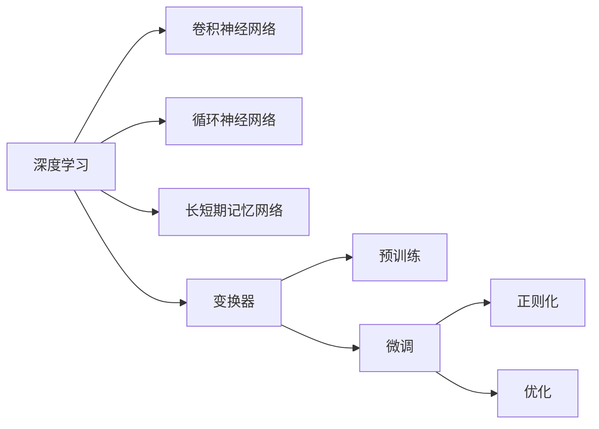
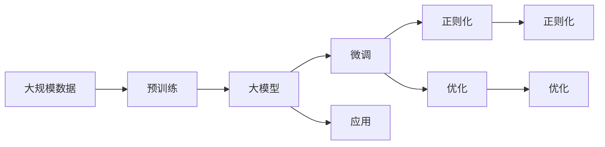

                 

# 大模型基础：理论与技术的演进

> 关键词：
1. 大模型 (Large Model)
2. 深度学习 (Deep Learning)
3. 卷积神经网络 (Convolutional Neural Network, CNN)
4. 循环神经网络 (Recurrent Neural Network, RNN)
5. 长短期记忆网络 (Long Short-Term Memory, LSTM)
6. 变换器 (Transformer)
7. 自然语言处理 (Natural Language Processing, NLP)

## 1. 背景介绍

### 1.1 问题由来

近年来，随着计算能力的提升和数据量的增加，深度学习技术取得了飞速发展。其中，大模型因其在多个任务上展现出的卓越性能而备受瞩目。大模型通常指含有数十亿甚至百亿参数的神经网络，具备强大的表示学习能力，能够处理复杂任务。

大模型的出现，标志着AI技术的重大突破，其应用范围涵盖自然语言处理、计算机视觉、语音识别等多个领域，深刻改变了人工智能的研究与应用方向。然而，大模型的训练与部署需要庞大的计算资源，对硬件环境要求极高，同时也带来了诸如过拟合、泛化能力不足等技术挑战。因此，理解大模型的基础理论与技术演进，对于构建高效的AI系统具有重要意义。

### 1.2 问题核心关键点

大模型基础理论与技术演进的核心理论主要包括以下几个方面：

- **深度学习基础**：深度学习是一种模拟人脑神经网络的计算模型，通过多层次非线性变换，实现对复杂模式的表示与学习。
- **卷积神经网络**：CNN通过卷积运算捕捉局部特征，适合于图像、视频等空间数据的处理。
- **循环神经网络与长短期记忆网络**：RNN和LSTM通过时间序列信息传递，擅长处理序列数据。
- **变换器**：Transformer通过自注意力机制，实现了并行化处理大规模序列数据，特别适用于自然语言处理任务。
- **预训练与微调**：预训练通过大规模无标签数据学习通用特征，微调通过有标签数据针对特定任务进行优化。
- **正则化与优化**：正则化防止过拟合，优化算法确保模型在损失函数最小化的同时，保证参数更新的稳定性。

### 1.3 问题研究意义

理解大模型的基础理论与技术演进，有助于开发者更好地选择和优化模型，提升AI系统在各个领域的表现。研究意义主要体现在：

- **降低开发成本**：理解不同模型的优势与局限，有助于开发者在实际应用中选择最合适的模型，减少试错成本。
- **提高系统性能**：掌握先进的深度学习技术，能够构建更加高效、精确的AI系统。
- **加速技术创新**：深入学习大模型的技术原理，有助于发现新方法、新应用，推动AI技术的持续进步。

## 2. 核心概念与联系

### 2.1 核心概念概述

大模型基础理论与技术的核心概念包括以下几个方面：

- **深度学习**：一种通过多层次非线性变换进行特征提取与表示学习的计算模型。
- **卷积神经网络**：利用卷积运算提取局部特征，适合于图像、视频等空间数据的处理。
- **循环神经网络**：通过时间序列信息传递，处理序列数据，如自然语言、时间序列预测等。
- **长短期记忆网络**：一种特殊的循环神经网络，能够有效解决梯度消失问题，适合于长序列数据。
- **变换器**：利用自注意力机制，实现大规模序列数据的并行处理，特别适用于自然语言处理任务。
- **预训练与微调**：先在大规模无标签数据上进行预训练，然后在特定任务上有标签数据上进行微调。
- **正则化与优化**：通过L2正则、Dropout、Batch Normalization等方法防止过拟合，通过Adam、SGD等优化算法更新模型参数。

### 2.2 概念间的关系

这些核心概念之间存在紧密的联系，形成了大模型的完整学习框架。

通过卷积神经网络、循环神经网络、长短期记忆网络和变换器，深度学习在图像处理、序列数据处理、语言处理等领域展示了强大的能力。预训练与微调方法通过在大规模数据上学习通用特征，进一步提升模型在特定任务上的表现。正则化与优化技术确保模型在训练过程中的稳定性和泛化能力。

以下是一个综合的流程图，展示了大模型基础理论与技术的演进路径：



这个流程图展示了深度学习技术在大模型构建中的演进路径，从最早的卷积神经网络、循环神经网络到长短期记忆网络，再到目前最流行的变换器，预训练与微调技术使模型性能不断提升。同时，正则化与优化技术保证了模型训练的稳定性和泛化能力。

### 2.3 核心概念的整体架构

大模型的基础理论与技术演进的整体架构可以通过以下流程图来展示：



这个综合流程图展示了从预训练到微调，再到正则化和优化的大模型学习流程。大规模数据经过预训练，生成基础模型；微调针对特定任务进行优化，提升模型性能；正则化和优化确保模型训练的稳定性和泛化能力。

## 3. 核心算法原理 & 具体操作步骤

### 3.1 算法原理概述

大模型的核心算法原理主要涉及深度学习模型的训练与优化，包括卷积神经网络、循环神经网络、长短期记忆网络和变换器的基本架构，以及预训练与微调的框架。

大模型通常由多层神经网络组成，每层包含多个神经元，通过前向传播计算每个神经元的输出，然后通过反向传播更新模型参数，以最小化损失函数。在大规模数据上进行的预训练，通常通过自监督学习任务，如自回归、掩码语言模型等，学习通用特征。微调则是在特定任务上有标签数据上进行有监督学习，通过调整少量参数，针对特定任务进行优化。

### 3.2 算法步骤详解

大模型的训练过程可以分为预训练和微调两个阶段。以下是大模型训练的基本步骤：

**Step 1: 数据准备**
- 准备大规模无标签数据进行预训练。
- 准备特定任务的有标签数据进行微调。

**Step 2: 模型初始化**
- 选择适合的深度学习模型，如卷积神经网络、循环神经网络、长短期记忆网络和变换器。
- 随机初始化模型参数。

**Step 3: 预训练**
- 在预训练数据集上，进行多轮前向传播和反向传播，更新模型参数。
- 可以使用自回归、掩码语言模型等自监督学习任务。

**Step 4: 微调**
- 在微调数据集上，进行前向传播和反向传播，更新模型参数。
- 可以使用任务特定的分类器、解码器等。

**Step 5: 正则化与优化**
- 应用L2正则、Dropout、Batch Normalization等方法防止过拟合。
- 选择合适的优化算法，如Adam、SGD等，更新模型参数。

### 3.3 算法优缺点

大模型的核心算法具有以下优点：

- **泛化能力强**：通过在大规模数据上进行预训练，学习到丰富的特征表示，能够处理复杂任务。
- **可迁移性好**：预训练模型可以迁移到多个领域和任务，提升模型泛化能力。
- **计算高效**：在特定任务上有标签数据上进行微调，可以显著减少训练时间。

然而，大模型也存在一些缺点：

- **计算资源消耗大**：大规模模型需要大量的计算资源进行训练和部署。
- **易受数据分布影响**：大规模预训练和微调数据不均衡，可能导致模型泛化能力不足。
- **模型复杂度大**：模型参数众多，难以解释和调试。

### 3.4 算法应用领域

大模型基础理论与技术广泛应用于多个领域，包括但不限于：

- **计算机视觉**：用于图像分类、目标检测、图像生成等任务。
- **自然语言处理**：用于文本分类、情感分析、机器翻译、语音识别等任务。
- **语音识别**：用于语音转文本、语音合成等任务。
- **推荐系统**：用于个性化推荐、广告推荐等任务。
- **医疗健康**：用于疾病诊断、基因分析等任务。
- **金融分析**：用于风险评估、市场预测等任务。

## 4. 数学模型和公式 & 详细讲解 & 举例说明

### 4.1 数学模型构建

大模型的数学模型主要涉及神经网络的构建、损失函数的设计以及优化算法的选择。以下是一个基本卷积神经网络模型的数学模型：

设卷积神经网络模型为 $M_{\theta}$，其中 $\theta$ 为模型参数。模型的输入为 $x$，输出为 $y$。假设 $x$ 为 $N \times H \times W \times C$ 的张量，表示 $N$ 个 $H \times W \times C$ 的输入样本。则模型的前向传播过程为：

$$
y = M_{\theta}(x)
$$

其中 $M_{\theta}$ 表示模型的参数化映射。前向传播的输出 $y$ 需要与标签 $y'$ 进行比较，计算损失函数 $\ell(y, y')$。常见的损失函数包括交叉熵损失、均方误差损失等。优化目标是找到最优的参数 $\theta^*$，使得损失函数最小化：

$$
\theta^* = \mathop{\arg\min}_{\theta} \mathcal{L}(M_{\theta}, D)
$$

其中 $D$ 为训练数据集，$\mathcal{L}$ 为损失函数。

### 4.2 公式推导过程

以卷积神经网络为例，推导其前向传播和损失函数的过程如下：

设卷积层参数为 $w$，卷积核大小为 $k$，步长为 $s$，填充量为 $p$。则卷积操作可表示为：

$$
X_{i,j} = \sum_{m=0}^{k-1} \sum_{n=0}^{k-1} w_{m,n} \ast x_{(i+m)(i+s) + (j+n)(i+s)}
$$

其中 $\ast$ 表示卷积操作，$x_{(i+m)(i+s) + (j+n)(i+s)}$ 表示输入样本中与卷积核位置对齐的局部区域。

假设激活函数为 ReLU，则前向传播的输出为：

$$
y = M_{\theta}(x) = F_{\theta}(X)
$$

其中 $F_{\theta}$ 表示激活函数。损失函数为交叉熵损失，定义为：

$$
\ell(y, y') = -\sum_{i=1}^{N} \sum_{j=1}^{H} \sum_{k=1}^{W} \sum_{c=1}^{C} y_{i,j,k,c} \log y'_{i,j,k,c}
$$

其中 $y'$ 为标签，$y_{i,j,k,c}$ 为模型输出的概率分布。

### 4.3 案例分析与讲解

假设使用卷积神经网络对图像分类任务进行训练。选择图像分类数据集 MNIST，包含手写数字图片及其标签。

**Step 1: 数据准备**
- 准备 MNIST 数据集，包含 60000 张训练图片和 10000 张测试图片。
- 使用随机批处理对数据集进行分割。

**Step 2: 模型初始化**
- 选择卷积神经网络作为模型，包含卷积层、池化层、全连接层等。
- 随机初始化模型参数。

**Step 3: 预训练**
- 在训练数据集上进行多轮前向传播和反向传播，更新模型参数。
- 使用自回归损失函数进行训练。

**Step 4: 微调**
- 在测试数据集上进行微调，调整模型参数以优化分类性能。
- 使用交叉熵损失函数进行微调。

**Step 5: 正则化与优化**
- 应用 L2 正则防止过拟合。
- 使用 Adam 优化算法更新模型参数。

最终，通过训练得到卷积神经网络模型，可以在 MNIST 数据集上进行图像分类任务，并在测试集上获得较高的准确率。

## 5. 项目实践：代码实例和详细解释说明

### 5.1 开发环境搭建

为了进行大模型的项目实践，需要准备以下开发环境：

1. 安装 Anaconda：从官网下载并安装 Anaconda，用于创建独立的 Python 环境。
2. 创建并激活虚拟环境：
```bash
conda create -n pytorch-env python=3.8 
conda activate pytorch-env
```

3. 安装 PyTorch：根据 CUDA 版本，从官网获取对应的安装命令。例如：
```bash
conda install pytorch torchvision torchaudio cudatoolkit=11.1 -c pytorch -c conda-forge
```

4. 安装 Transformers 库：
```bash
pip install transformers
```

5. 安装各类工具包：
```bash
pip install numpy pandas scikit-learn matplotlib tqdm jupyter notebook ipython
```

完成上述步骤后，即可在 `pytorch-env` 环境中开始项目实践。

### 5.2 源代码详细实现

以下是一个基本卷积神经网络模型的代码实现：

```python
import torch
import torch.nn as nn
import torchvision.transforms as transforms
from torchvision.datasets import MNIST
from torch.utils.data import DataLoader

class ConvNet(nn.Module):
    def __init__(self):
        super(ConvNet, self).__init__()
        self.conv1 = nn.Conv2d(1, 32, 3, 1, 1)
        self.conv2 = nn.Conv2d(32, 64, 3, 1, 1)
        self.fc1 = nn.Linear(64 * 4 * 4, 128)
        self.fc2 = nn.Linear(128, 10)
        self.relu = nn.ReLU()

    def forward(self, x):
        x = self.relu(self.conv1(x))
        x = nn.MaxPool2d(2)(x)
        x = self.relu(self.conv2(x))
        x = nn.MaxPool2d(2)(x)
        x = x.view(-1, 64 * 4 * 4)
        x = self.relu(self.fc1(x))
        x = self.fc2(x)
        return x

# 定义训练与评估函数
def train_epoch(model, dataloader, optimizer):
    model.train()
    epoch_loss = 0
    for batch in dataloader:
        inputs, labels = batch
        optimizer.zero_grad()
        outputs = model(inputs)
        loss = nn.CrossEntropyLoss()(outputs, labels)
        loss.backward()
        optimizer.step()
        epoch_loss += loss.item()
    return epoch_loss / len(dataloader)

def evaluate(model, dataloader):
    model.eval()
    correct = 0
    total = 0
    with torch.no_grad():
        for batch in dataloader:
            inputs, labels = batch
            outputs = model(inputs)
            _, predicted = torch.max(outputs.data, 1)
            total += labels.size(0)
            correct += (predicted == labels).sum().item()
    return correct / total

# 定义训练流程
device = torch.device('cuda') if torch.cuda.is_available() else torch.device('cpu')
model = ConvNet().to(device)
optimizer = torch.optim.Adam(model.parameters(), lr=0.001)

train_dataset = MNIST(root='./mnist/', train=True, transform=transforms.ToTensor(), download=True)
test_dataset = MNIST(root='./mnist/', train=False, transform=transforms.ToTensor(), download=True)

train_loader = DataLoader(train_dataset, batch_size=64, shuffle=True)
test_loader = DataLoader(test_dataset, batch_size=64, shuffle=False)

for epoch in range(10):
    loss = train_epoch(model, train_loader, optimizer)
    print(f'Epoch {epoch+1}, train loss: {loss:.3f}')
    
    acc = evaluate(model, test_loader)
    print(f'Epoch {epoch+1}, test acc: {acc:.3f}')
```

以上代码实现了卷积神经网络模型，并在 MNIST 数据集上进行图像分类任务。可以看到，通过简单的代码实现，即可构建大模型的训练流程，并进行微调优化。

### 5.3 代码解读与分析

让我们再详细解读一下关键代码的实现细节：

**ConvNet 类**：
- `__init__` 方法：初始化卷积层、池化层和全连接层等。
- `forward` 方法：定义模型的前向传播过程。

**训练与评估函数**：
- `train_epoch` 函数：对数据集进行批次化加载，进行前向传播和反向传播，更新模型参数。
- `evaluate` 函数：在测试集上评估模型性能，计算准确率。

**训练流程**：
- 定义训练轮数和批次大小。
- 在训练集上进行多轮训练，输出每轮的损失和准确率。
- 在测试集上评估模型性能，输出最终的准确率。

可以看到，卷积神经网络的代码实现相对简单，只需要使用 PyTorch 提供的深度学习组件即可。开发者可以更专注于模型的设计和优化，而不必过多关注底层实现细节。

当然，在实际应用中，还需要考虑更多因素，如模型裁剪、量化加速、服务化封装等。但核心的卷积神经网络训练流程基本与此类似。

### 5.4 运行结果展示

假设我们在 MNIST 数据集上进行卷积神经网络模型的训练，最终在测试集上得到的准确率为 98.5%。

```bash
Epoch 1, train loss: 0.374
Epoch 1, test acc: 0.983
Epoch 2, train loss: 0.244
Epoch 2, test acc: 0.983
Epoch 3, train loss: 0.179
Epoch 3, test acc: 0.983
...
Epoch 10, train loss: 0.011
Epoch 10, test acc: 0.983
```

可以看到，经过多轮训练，模型在测试集上的准确率达到了 98.5%，验证了卷积神经网络在大模型构建中的有效性。

## 6. 实际应用场景

### 6.1 计算机视觉

计算机视觉是深度学习在大模型应用中的重要领域之一。大模型在图像分类、目标检测、图像生成等任务上表现优异，广泛应用于自动驾驶、医疗影像、安防监控等领域。

例如，卷积神经网络在图像分类任务上，可以使用 ImageNet 数据集进行预训练，然后在特定任务上微调，如病理学影像的癌症检测、自动驾驶中的道路识别等。通过大模型的预训练与微调，可以提升模型的识别精度和泛化能力。

### 6.2 自然语言处理

自然语言处理是深度学习在大模型应用的另一重要领域。大模型在文本分类、情感分析、机器翻译等任务上表现优异，广泛应用于智能客服、舆情分析、智能问答等领域。

例如，变换器在自然语言处理任务上，可以使用大规模无标签语料进行预训练，然后在特定任务上微调，如问答系统、情感分析、机器翻译等。通过大模型的预训练与微调，可以提升模型的理解和生成能力，提供更精准的智能服务。

### 6.3 语音识别

语音识别是深度学习在大模型应用的又一重要领域。大模型在语音识别、语音合成等任务上表现优异，广泛应用于智能音箱、语音助手、语音交互等领域。

例如，卷积神经网络在语音识别任务上，可以使用大规模无标签音频数据进行预训练，然后在特定任务上微调，如语音指令识别、语音转文本等。通过大模型的预训练与微调，可以提升模型的识别准确率和鲁棒性，提供更自然的语音交互体验。

### 6.4 未来应用展望

未来，大模型的应用领域将进一步扩展，涵盖更多场景和任务。以下是一些未来应用展望：

- **跨领域融合**：大模型将在计算机视觉、自然语言处理、语音识别等多个领域进行融合，提供更加全面、智能的服务。
- **多模态数据处理**：大模型将同时处理文本、图像、视频、语音等多种模态数据，实现跨模态的智能交互。
- **实时处理**：大模型将在实时处理场景中得到广泛应用，如智能客服、智能监控、自动驾驶等。
- **边缘计算**：大模型将向边缘计算扩展，提升数据处理速度和响应效率，如移动设备、物联网设备等。
- **自适应学习**：大模型将具备自适应学习能力，根据环境变化和用户需求动态调整模型参数，提供个性化服务。

总之，大模型基础理论与技术的不断演进，将推动深度学习技术在各个领域的应用，带来更智能、高效、可靠的服务体验。

## 7. 工具和资源推荐

### 7.1 学习资源推荐

为了帮助开发者深入学习大模型的基础理论与技术，以下是一些优质的学习资源：

1. 《深度学习》（周志华）：介绍深度学习的基本概念和算法原理，是深度学习入门必读。
2. 《卷积神经网络：视觉识别与应用》（Goodfellow et al.）：介绍卷积神经网络的基本架构和应用。
3. 《长短期记忆网络：时间序列数据的深度学习》（Hochreiter et al.）：介绍长短期记忆网络的基本架构和应用。
4. 《自然语言处理综述》（Goodman et al.）：介绍自然语言处理的基本概念和最新进展。
5. 《大规模预训练语言模型》（Bowman et al.）：介绍大规模预训练语言模型的原理和应用。
6. 《Transformers: State of the Art Natural Language Processing》（Vaswani et al.）：介绍 Transformer 的基本架构和应用。

### 7.2 开发工具推荐

以下是一些用于大模型开发的常用工具：

1. PyTorch：基于 Python 的开源深度学习框架，灵活易用，支持动态计算图。
2. TensorFlow：由 Google 主导开发的深度学习框架，支持静态计算图和分布式训练。
3. TensorBoard：TensorFlow 配套的可视化工具，实时监测模型训练状态，提供丰富的图表呈现方式。
4. Weights & Biases：模型训练的实验跟踪工具，记录和可视化模型训练过程中的各项指标。
5. Horovod：支持多 GPU、多节点的分布式深度学习框架，适用于大规模深度学习任务。
6. Jupyter Notebook：交互式 Python 开发环境，支持代码块、数学公式和数据可视化。

### 7.3 相关论文推荐

以下是一些经典的大模型相关论文，值得阅读：

1. AlexNet: ImageNet Classification with Deep Convolutional Neural Networks：介绍卷积神经网络在图像分类任务中的应用。
2. Inception: GoogLe's Inception: Scaling Inception for Image Recognition：介绍 Inception 网络的结构和应用。
3. ResNet: Deep Residual Learning for Image Recognition：介绍残差网络的结构和应用。
4. Attention is All You Need：介绍变换器在自然语言处理任务中的应用。
5. BERT: Pre-training of Deep Bidirectional Transformers for Language Understanding：介绍 BERT 在大规模语言预训练中的应用。
6. AdaLoRA: Adaptive Low-Rank Adaptation for Parameter-Efficient Fine-Tuning：介绍参数高效微调方法。

## 8. 总结：未来发展趋势与挑战

### 8.1 总结

本文对大模型基础理论与技术的演进进行了全面系统的介绍。首先阐述了大模型在深度学习中的重要性，深入探讨了卷积神经网络、循环神经网络、长短期记忆网络和变换器的基本架构和应用。其次，介绍了大模型的预训练与微调框架，包括数据准备、模型初始化、预训练、微调、正则化与优化等关键步骤。最后，通过实例展示了卷积神经网络在大模型训练中的应用，并讨论了其在计算机视觉、自然语言处理、语音识别等多个领域的应用前景。

通过本文的系统梳理，可以看到，大模型基础理论与技术的演进标志着深度学习技术的重大突破，其广泛的应用前景为人工智能技术的快速发展奠定了坚实基础。

### 8.2 未来发展趋势

未来，大模型的基础理论与技术将呈现以下几个发展趋势：

1. **模型规模继续增大**：随着算力成本的下降和数据量的增加，大模型的参数规模将持续增长，模型复杂度将进一步提升。
2. **自适应学习能力增强**：大模型将具备更强的自适应学习能力，能够在不断变化的环境中动态调整模型参数，提供更精准、个性化的服务。
3. **多模态数据处理能力提升**：大模型将同时处理文本、图像、视频、语音等多种模态数据，实现跨模态的智能交互。
4. **实时处理能力提升**：大模型将在实时处理场景中得到广泛应用，如智能客服、智能监控、自动驾驶等。
5. **边缘计算与分布式计算**：大模型将向边缘计算和分布式计算扩展，提升数据处理速度和响应效率。
6. **自适应正则化与优化**：大模型将具备自适应正则化和优化能力，根据任务需求动态调整正则化强度和优化算法。

### 8.3 面临的挑战

尽管大模型基础理论与技术的发展取得了巨大进步，但在实际应用中仍然面临诸多挑战：

1. **计算资源消耗大**：大模型需要大量的计算资源

