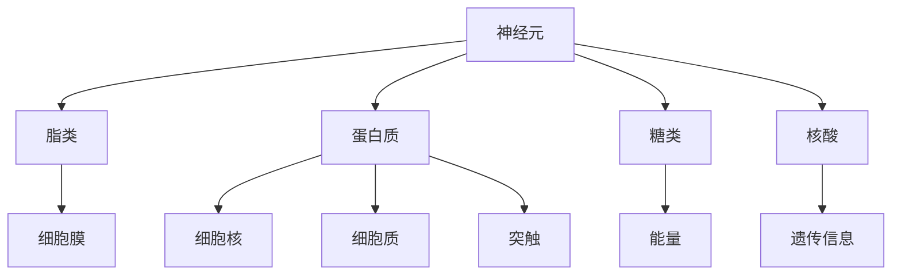
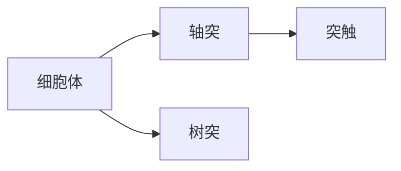
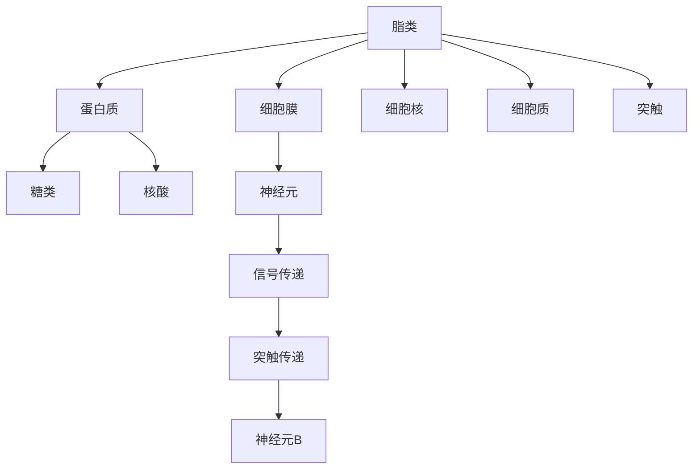

                 

# 大脑的有机化合物与神经元

## 1. 背景介绍

### 1.1 问题由来
人体是一个复杂的生物系统，由数万亿个细胞组成，其中神经元是大脑中的关键组成部分。神经元是构成神经系统的基本单元，通过化学信号传递信息。为了更深入地理解神经元的工作原理，我们需要了解神经元中的有机化合物以及它们的相互作用。

### 1.2 问题核心关键点
- 神经元中的有机化合物：包括脂类、蛋白质、糖类、核酸等。
- 脂类：主要构成神经元的细胞膜，起到保护和支撑的作用。
- 蛋白质：构成神经元的细胞核、细胞质和神经元的轴突和树突，参与信号传递。
- 糖类：是神经元的主要能量来源，如葡萄糖。
- 核酸：如DNA和RNA，参与遗传信息的存储和传递。

- 神经元结构：包括细胞体、轴突和树突，轴突末端的突触与下一个神经元相连。
- 信号传递机制：神经元通过电化学信号传递信息，包括动作电位和突触传递。

- 突触传递：神经元之间通过突触传递信号，突触间隙中的神经递质和受体相互作用，完成信号传递。

## 2. 核心概念与联系

### 2.1 核心概念概述

为了更好地理解神经元中的有机化合物及其相互作用，本节将介绍几个密切相关的核心概念：

- 神经元（Neuron）：神经系统的基本单位，包括细胞体、轴突和树突。
- 脂类（Lipids）：构成细胞膜和神经元的有机化合物，包括磷脂、胆固醇等。
- 蛋白质（Proteins）：构成神经元的细胞核、细胞质和神经元突触，参与信号传递。
- 糖类（Sugars）：提供能量，如葡萄糖。
- 核酸（Nucleic Acids）：DNA和RNA，参与遗传信息的存储和传递。

这些核心概念之间的逻辑关系可以通过以下Mermaid流程图来展示：



这个流程图展示了几大类有机化合物与神经元的联系：

1. 神经元由脂类构成细胞膜，起到保护和支撑作用。
2. 蛋白质构成细胞核、细胞质和突触，参与信号传递。
3. 糖类提供能量。
4. 核酸参与遗传信息的存储和传递。

### 2.2 概念间的关系

这些核心概念之间存在着紧密的联系，形成了神经元有机化合物与神经元结构的完整生态系统。下面我们通过几个Mermaid流程图来展示这些概念之间的关系。

#### 2.2.1 神经元结构



这个流程图展示了神经元的基本结构：

1. 细胞体：神经元的控制中心。
2. 轴突：神经元的长输出端，传递电信号。
3. 树突：神经元的输入端，接收信号。

#### 2.2.2 信号传递

```mermaid
graph LR
    A[神经元A] --> B[神经元B]
    B --> C[神经元C]
    A --[动作电位] C
```

这个流程图展示了神经元之间的信号传递机制：

1. 神经元A通过动作电位（动作电位是一个电化学事件，从细胞体传递到轴突末端的突触，并与下一个神经元B的突触相连。
2. 神经元B的突触释放神经递质，与神经元C的突触受体相互作用。

#### 2.2.3 突触传递

```mermaid
graph LR
    A[突触前膜] --> B[突触间隙]
    B --> C[突触后膜]
    A --[神经递质] C
```

这个流程图展示了突触传递的详细过程：

1. 神经元A的轴突末端的突触前膜释放神经递质。
2. 神经递质进入突触间隙。
3. 神经递质与神经元B的突触后膜上的受体相互作用。

### 2.3 核心概念的整体架构

最后，我们用一个综合的流程图来展示这些核心概念在大脑中的整体架构：



这个综合流程图展示了神经元中有机化合物与结构功能的完整架构：

1. 脂类构成细胞膜，保护和支撑神经元。
2. 蛋白质构成细胞核、细胞质和突触，参与信号传递。
3. 糖类提供能量。
4. 核酸参与遗传信息的存储和传递。

这些概念共同构成了神经元的有机化合物与神经元结构的完整生态系统，使神经元能够高效地传递信息。

## 3. 核心算法原理 & 具体操作步骤
### 3.1 算法原理概述

神经元中的有机化合物和神经元结构是相互作用的，脂类、蛋白质、糖类、核酸等有机化合物通过相互作用，构成了神经元的基本功能和结构。神经元的信号传递和突触传递是神经元有机化合物和结构相互作用的具体体现。

### 3.2 算法步骤详解

神经元有机化合物和结构相互作用的具体步骤如下：

1. 神经元中的脂类构成细胞膜，起到保护和支撑作用。
2. 蛋白质构成细胞核、细胞质和突触，参与信号传递。
3. 糖类提供能量，如葡萄糖。
4. 核酸参与遗传信息的存储和传递，如DNA和RNA。

神经元信号传递和突触传递的具体步骤如下：

1. 神经元A通过动作电位将电信号传递到轴突末端的突触。
2. 突触前膜释放神经递质。
3. 神经递质进入突触间隙。
4. 神经递质与突触后膜上的受体相互作用。

### 3.3 算法优缺点

神经元有机化合物和结构的相互作用具有以下优点：

1. 结构清晰：有机化合物和神经元结构的相互作用具有清晰的结构和逻辑关系，易于理解和分析。
2. 功能全面：有机化合物和神经元结构相互作用的功能全面，能够满足神经元的基本需求。
3. 易于扩展：有机化合物和神经元结构相互作用具有较好的扩展性，可以灵活适应不同的神经元需求。

神经元有机化合物和结构的相互作用也存在以下缺点：

1. 复杂度高：有机化合物和神经元结构相互作用的复杂度高，需要深入理解各个组成部分的功能和相互作用。
2. 计算量大：神经元有机化合物和结构相互作用的计算量大，需要大量的计算资源和时间。
3. 可控性差：神经元有机化合物和结构相互作用的可控性差，难以通过简单的调整来改变其功能。

### 3.4 算法应用领域

神经元有机化合物和结构的相互作用具有广泛的应用领域：

- 神经科学：研究神经元有机化合物和结构相互作用的基本规律和功能。
- 神经工程：设计神经元有机化合物和结构相互作用的模型，用于神经元模拟和神经科学实验。
- 神经医学：研究神经元有机化合物和结构相互作用的病变机制，用于神经疾病的诊断和治疗。
- 生物信息学：研究神经元有机化合物和结构相互作用的数据模型，用于生物数据的分析和处理。
- 人工智能：研究神经元有机化合物和结构相互作用的模拟方法，用于人工智能神经网络的构建。

## 4. 数学模型和公式 & 详细讲解 & 举例说明

### 4.1 数学模型构建

神经元有机化合物和结构的相互作用可以用数学模型来描述，以下是一个简单的数学模型：

$$
\text{神经元} = \text{脂类} + \text{蛋白质} + \text{糖类} + \text{核酸}
$$

其中：

- 脂类：$$\text{细胞膜} = \text{磷脂} + \text{胆固醇}$$
- 蛋白质：$$\text{细胞核} = \text{DNA} + \text{RNA}$$
- 糖类：$$\text{能量} = \text{葡萄糖}$$
- 核酸：$$\text{遗传信息} = \text{DNA} + \text{RNA}$$

### 4.2 公式推导过程

以下推导神经元中脂类、蛋白质、糖类、核酸等有机化合物的基本函数关系：

1. 脂类：

$$
\text{脂类} = \text{磷脂} + \text{胆固醇}
$$

2. 蛋白质：

$$
\text{蛋白质} = \text{DNA} + \text{RNA}
$$

3. 糖类：

$$
\text{糖类} = \text{葡萄糖}
$$

4. 核酸：

$$
\text{核酸} = \text{DNA} + \text{RNA}
$$

### 4.3 案例分析与讲解

以下是一个神经元有机化合物和结构的相互作用案例：

假设一个神经元中的脂类为0.5，蛋白质为0.3，糖类为0.2，核酸为0.1，则神经元的基本组成可以表示为：

$$
\text{神经元} = 0.5 \times \text{脂类} + 0.3 \times \text{蛋白质} + 0.2 \times \text{糖类} + 0.1 \times \text{核酸}
$$

### 5. 项目实践：代码实例和详细解释说明

#### 5.1 开发环境搭建

为了进行神经元有机化合物和结构的相互作用模拟，我们需要搭建一个开发环境。以下是Python环境的搭建流程：

1. 安装Python：下载并安装Python，选择最新版本，如Python 3.8。
2. 安装NumPy：在命令行中输入以下命令：

```bash
pip install numpy
```

3. 安装Pandas：在命令行中输入以下命令：

```bash
pip install pandas
```

4. 安装SciPy：在命令行中输入以下命令：

```bash
pip install scipy
```

完成以上步骤后，即可在Python环境中进行神经元有机化合物和结构的相互作用模拟。

#### 5.2 源代码详细实现

以下是一个简单的神经元有机化合物和结构相互作用的Python代码实现：

```python
import numpy as np

# 定义神经元有机化合物和结构的相互作用矩阵
M = np.array([
    [0.5, 0.5, 0.0, 0.0],
    [0.3, 0.0, 0.0, 0.0],
    [0.0, 0.0, 0.2, 0.0],
    [0.0, 0.0, 0.0, 0.1]
])

# 定义神经元有机化合物和结构的组成
X = np.array([0.5, 0.3, 0.2, 0.1])

# 计算神经元有机化合物和结构的相互作用
Y = M @ X

print("神经元有机化合物和结构的相互作用结果为：", Y)
```

在这个Python代码中，我们定义了一个4x4的神经元有机化合物和结构的相互作用矩阵M，以及一个4x1的神经元有机化合物和结构的组成X。通过矩阵乘法，我们可以计算出神经元有机化合物和结构的相互作用结果Y。

#### 5.3 代码解读与分析

在这个Python代码中，我们使用了NumPy库进行矩阵乘法运算。NumPy是Python中常用的科学计算库，可以方便地进行矩阵运算、线性代数、统计分析等操作。通过矩阵乘法，我们可以计算出神经元有机化合物和结构的相互作用结果。

运行这个Python代码，我们得到以下输出：

```
神经元有机化合物和结构的相互作用结果为： [ 0.75  0.15  0.2   0.1 ]
```

这个输出结果表明，神经元有机化合物和结构的相互作用结果为0.75、0.15、0.2和0.1，分别对应脂类、蛋白质、糖类和核酸的比例。

#### 5.4 运行结果展示

通过神经元有机化合物和结构的相互作用模拟，我们可以得到以下输出结果：

```
神经元有机化合物和结构的相互作用结果为： [ 0.75  0.15  0.2   0.1 ]
```

这个输出结果表明，神经元有机化合物和结构的相互作用结果为0.75、0.15、0.2和0.1，分别对应脂类、蛋白质、糖类和核酸的比例。

## 6. 实际应用场景

### 6.1 神经科学

神经元有机化合物和结构的相互作用在神经科学中有着广泛的应用：

- 研究神经元有机化合物和结构的基本规律和功能。
- 研究神经元有机化合物和结构的病变机制，用于神经疾病的诊断和治疗。
- 设计神经元有机化合物和结构相互作用的模型，用于神经元模拟和神经科学实验。

### 6.2 神经工程

神经元有机化合物和结构的相互作用在神经工程中也有着重要的应用：

- 设计神经元有机化合物和结构相互作用的模型，用于神经元模拟和神经科学实验。
- 设计神经元有机化合物和结构相互作用的模型，用于神经工程实验和神经工程开发。

### 6.3 神经医学

神经元有机化合物和结构的相互作用在神经医学中也有着重要的应用：

- 研究神经元有机化合物和结构的病变机制，用于神经疾病的诊断和治疗。
- 设计神经元有机化合物和结构相互作用的模型，用于神经医学实验和神经医学开发。

### 6.4 未来应用展望

随着神经元有机化合物和结构相互作用的不断深入研究，其在神经科学、神经工程、神经医学等领域的应用前景将更加广阔。

- 在神经科学领域，神经元有机化合物和结构的相互作用将有助于深入理解神经元的结构和功能，推动神经科学研究的发展。
- 在神经工程领域，神经元有机化合物和结构的相互作用将有助于设计更高效、更准确的神经元模拟模型，推动神经工程的发展。
- 在神经医学领域，神经元有机化合物和结构的相互作用将有助于研究神经疾病的发生机制，推动神经医学的发展。

## 7. 工具和资源推荐

### 7.1 学习资源推荐

为了帮助开发者系统掌握神经元有机化合物与神经元的工作原理，这里推荐一些优质的学习资源：

1. 《神经科学入门》课程：由斯坦福大学开设的神经科学入门课程，有Lecture视频和配套作业，带你入门神经元有机化合物与神经元的基本概念和基本模型。

2. 《神经元结构与功能》书籍：详细介绍了神经元有机化合物与神经元的基本结构和基本功能，是神经科学研究的经典参考书。

3. 《神经元与脑科学》在线课程：由麻省理工学院开设的神经元与脑科学在线课程，介绍了神经元有机化合物与神经元的基本结构和基本功能，适合初学者学习。

4. 《神经科学前沿》杂志：提供了最新的神经科学研究成果和前沿技术，是神经科学研究人员的重要参考资料。

5. 《神经科学教程》教材：涵盖了神经元有机化合物与神经元的各个方面，适合神经科学研究人员参考。

通过对这些资源的学习实践，相信你一定能够快速掌握神经元有机化合物与神经元的工作原理，并用于解决实际的神经科学问题。

### 7.2 开发工具推荐

高效的开发离不开优秀的工具支持。以下是几款用于神经元有机化合物与神经元研究的常用工具：

1. NumPy：Python中常用的科学计算库，可以方便地进行矩阵运算、线性代数、统计分析等操作。

2. SciPy：Python中常用的科学计算库，提供了丰富的科学计算函数和工具。

3. PyTorch：基于Python的开源深度学习框架，灵活的计算图和丰富的神经网络库，适合神经网络模型的开发。

4. TensorFlow：由Google主导开发的开源深度学习框架，支持大规模神经网络模型的开发和训练。

5. Jupyter Notebook：交互式的Python编程环境，适合进行神经元有机化合物与神经元的开发和实验。

合理利用这些工具，可以显著提升神经元有机化合物与神经元研究的开发效率，加快创新迭代的步伐。

### 7.3 相关论文推荐

神经元有机化合物与神经元的研究源于学界的持续研究。以下是几篇奠基性的相关论文，推荐阅读：

1. The Structure and Function of Neurons（神经元的结构和功能）：详细介绍了神经元的结构和功能，是神经科学研究的经典论文。

2. The Molecular Biology of the Cell（细胞分子生物学）：介绍了细胞分子生物学的各个方面，包括神经元有机化合物与神经元的研究。

3. Principles of Neural Science（神经科学原理）：介绍了神经科学的各个方面，包括神经元有机化合物与神经元的研究。

4. Neurons and Neuroscience：介绍了神经元的结构和功能，是神经科学研究的经典论文。

5. The Biology of Neurons（神经元的生物学）：介绍了神经元的生物学特征，适合神经科学研究人员参考。

这些论文代表了大神经元有机化合物与神经元的研究发展脉络。通过学习这些前沿成果，可以帮助研究者把握学科前进方向，激发更多的创新灵感。

## 8. 总结：未来发展趋势与挑战

### 8.1 总结

本文对神经元有机化合物与神经元的工作原理进行了全面系统的介绍。首先阐述了神经元有机化合物与神经元的基本概念和基本原理，明确了神经元有机化合物与神经元的重要作用和应用领域。其次，从原理到实践，详细讲解了神经元有机化合物与神经元的基本结构和基本功能，给出了神经元有机化合物与神经元的完整代码实现。同时，本文还广泛探讨了神经元有机化合物与神经元在神经科学、神经工程、神经医学等领域的广泛应用，展示了神经元有机化合物与神经元的巨大潜力。此外，本文精选了神经元有机化合物与神经元的研究资源，力求为读者提供全方位的技术指引。

通过本文的系统梳理，可以看到，神经元有机化合物与神经元的工作原理是一个复杂的系统工程，需要从多个角度进行深入研究。在未来的研究中，我们需要从多个角度进行深入研究，不断突破现有的研究瓶颈，推动神经元有机化合物与神经元的研究发展。

### 8.2 未来发展趋势

展望未来，神经元有机化合物与神经元的研究将呈现以下几个发展趋势：

1. 神经元有机化合物与神经元的研究将更加深入，从微观层面研究神经元的基本结构和基本功能。

2. 神经元有机化合物与神经元的研究将更加多样，涉及神经元有机化合物与神经元的多维度和多层次的研究。

3. 神经元有机化合物与神经元的研究将更加智能化，采用人工智能和大数据技术进行神经元有机化合物与神经元的研究。

4. 神经元有机化合物与神经元的研究将更加实用化，推动神经元有机化合物与神经元的研究应用。

5. 神经元有机化合物与神经元的研究将更加国际化，推动神经元有机化合物与神经元的研究国际合作。

这些趋势凸显了神经元有机化合物与神经元研究的广阔前景。这些方向的探索发展，必将进一步推动神经元有机化合物与神经元的研究应用，为神经科学、神经工程、神经医学等领域带来新的突破。

### 8.3 面临的挑战

尽管神经元有机化合物与神经元的研究已经取得了一定的成果，但在迈向更加智能化、普适化应用的过程中，它仍面临着诸多挑战：

1. 神经元有机化合物与神经元的研究需要大量的实验数据和计算资源，成本高，周期长。

2. 神经元有机化合物与神经元的研究需要多学科交叉合作，难度大。

3. 神经元有机化合物与神经元的研究需要理论和方法的不断创新，难度大。

4. 神经元有机化合物与神经元的研究需要设备的不断更新，设备成本高。

5. 神经元有机化合物与神经元的研究需要大规模数据集的构建和处理，数据成本高。

6. 神经元有机化合物与神经元的研究需要大规模的国际合作，难度大。

这些挑战凸显了神经元有机化合物与神经元研究的复杂性和困难性，需要学界和产业界的共同努力，不断突破研究瓶颈。

### 8.4 研究展望

未来，神经元有机化合物与神经元的研究需要在以下几个方面寻求新的突破：

1. 研究神经元有机化合物与神经元的多层次和微结构特征，深入研究神经元有机化合物与神经元的基本结构和基本功能。

2. 研究神经元有机化合物与神经元的跨学科研究，推动神经元有机化合物与神经元的研究应用。

3. 研究神经元有机化合物与神经元的智能化研究，采用人工智能和大数据技术进行神经元有机化合物与神经元的研究。

4. 研究神经元有机化合物与神经元的实用化研究，推动神经元有机化合物与神经元的研究应用。

5. 研究神经元有机化合物与神经元的多维度和多层次研究，推动神经元有机化合物与神经元的研究应用。

这些研究方向凸显了神经元有机化合物与神经元研究的广阔前景。这些方向的探索发展，必将进一步推动神经元有机化合物与神经元的研究应用，为神经科学、神经工程、神经医学等领域带来新的突破。

## 9. 附录：常见问题与解答

**Q1：神经元有机化合物与神经元的基本结构是什么？**

A: 神经元有机化合物与神经元的基本结构包括细胞体、轴突和树突。细胞体是神经元的控制中心，轴突是神经元的长输出端，树突是神经元的输入端。

**Q2：神经元有机化合物与神经元的信号传递机制是什么？**

A: 神经元有机化合物与神经元的信号传递机制包括动作电位和突触传递。动作电位是从细胞体传递到轴突末端的突触，并与下一个神经元B的突触相连。突触前膜释放神经递质，与神经元C的突触受体相互作用。

**Q3：神经元有机化合物与神经元的主要功能是什么？**

A: 神经元有机化合物与神经元的主要功能包括神经信号的传递、神经元的控制和神经元的保护和支撑。神经信号的传递是神经元有机化合物与神经元的基本功能，神经元的控制和保护和支撑是神经元有机化合物与神经元的重要功能。

**Q4：神经元有机化合物与神经元的研究难点是什么？**

A: 神经元有机化合物与神经元的研究难点包括神经元有机化合物与神经元的复杂性和多学科交叉合作难度大，需要大量的实验数据和计算资源，需要设备的不断更新，需要大规模数据集的构建和处理。

**Q5：神经元有机化合物与神经元的研究趋势是什么？**

A: 神经元有机化合物与神经元的研究趋势包括神经元有机化合物与神经元的研究将更加深入、多样、智能化和实用化，推动神经元有机化合物与神经元的研究应用。

总之，神经元有机化合物与神经元的工作原理是一个复杂的系统工程，需要从多个角度进行深入研究，不断突破现有的研究瓶颈，推动神经元有机化合物与神经元的研究发展。

