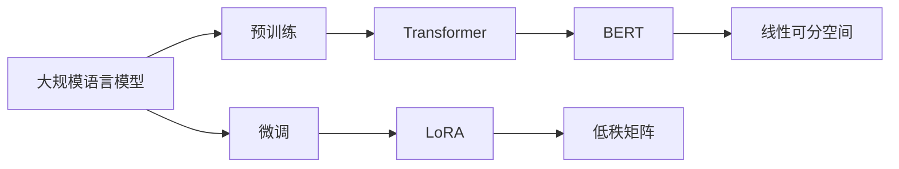

                 

# 大规模语言模型从理论到实践 LoRA

> 关键词：大规模语言模型,LoRA,线性可分空间,参数高效微调,深度神经网络,DNN,Transformer,BERT

## 1. 背景介绍

### 1.1 问题由来

近年来，随着深度学习技术的飞速发展，大规模语言模型（Large Language Models, LLMs）在自然语言处理（NLP）领域取得了巨大突破。其中，基于Transformer结构的预训练语言模型，如BERT、GPT等，已经在多项NLP任务上刷新了最先进性能，引发了广泛关注和研究。

然而，由于预训练模型在特定领域应用时效果往往不尽如人意，研究者开始探索如何更好地利用预训练模型，将其应用于不同的下游任务。LoRA（Linear Regression for Adaptation）作为一种参数高效微调方法，因其简单易用、效果显著而逐渐受到关注。本文将系统介绍LoRA方法的理论基础和实践技巧，并探讨其在实际应用中的优势和局限性。

### 1.2 问题核心关键点

LoRA方法的核心思想是：将大规模预训练语言模型中的低维线性可分空间与下游任务的维度对齐，通过低秩线性回归的方式调整模型参数，实现高效微调。具体来说，LoRA方法将预训练模型中的每个层都表示为一个线性变换，然后通过一组低秩矩阵和一组线性权重来表示这种线性变换。

LoRA方法的优点包括：
1. 参数高效。LoRA仅调整少量参数（通常是原模型参数的10%~20%），保留了大部分预训练权重，避免了过拟合。
2. 计算高效。LoRA在计算复杂度上远低于全参数微调，适用于资源受限的环境。
3. 效果显著。LoRA在各种NLP任务上取得了优异性能，与全参数微调方法相当甚至更好。

LoRA方法的主要缺点包括：
1. 复杂度较高。LoRA模型需要额外定义一组低秩矩阵和一组线性权重，增加了模型复杂度。
2. 适应性有限。LoRA方法主要应用于维度较低的下游任务，对于维度较高的任务，可能需要额外的设计。
3. 依赖预训练模型。LoRA方法的效果依赖于高质量的预训练模型，需要较长的预训练过程。

尽管存在这些局限性，LoRA方法以其高效、灵活的特点，为大规模语言模型的微调提供了新的解决方案。

### 1.3 问题研究意义

LoRA方法的提出，为大规模语言模型的微调提供了新的思路和方向。具体来说，LoRA方法在以下几个方面具有重要意义：

1. **降低开发成本**：LoRA方法通过参数高效微调，减少了从头开发所需的数据、计算和人力等成本投入，加快了模型开发速度。
2. **提升模型效果**：LoRA方法在各种NLP任务上取得了优异性能，通过微调模型能够显著提升下游任务的性能。
3. **资源优化**：LoRA方法适用于资源受限的环境，能够有效利用预训练模型的知识，减少微调所需的计算资源。
4. **技术创新**：LoRA方法作为一种新的微调技术，推动了NLP技术的创新发展，带来了新的研究方向和应用场景。
5. **产业应用**：LoRA方法为NLP技术的产业化提供了新的手段，加速了NLP技术的落地应用。

总之，LoRA方法作为一种参数高效微调技术，为大规模语言模型的应用提供了新的解决方案，具有重要的研究和应用价值。

## 2. 核心概念与联系

### 2.1 核心概念概述

为更好地理解LoRA方法，本节将介绍几个密切相关的核心概念：

- **大规模语言模型（LLMs）**：以Transformer为代表的深度神经网络（DNN）模型，通过在大规模无标签文本数据上进行预训练，学习通用的语言表示，具备强大的语言理解和生成能力。
- **线性可分空间（Linear Subspace）**：在矩阵空间中，可以表示为线性变换的子空间，例如二维空间中的直线、三维空间中的平面等。
- **LoRA模型**：基于线性可分空间和低秩线性回归的参数高效微调方法。通过将预训练模型中的每个层表示为线性变换，利用一组低秩矩阵和一组线性权重来调整模型参数，实现高效的微调。
- **Transformer模型**：基于注意力机制的深度神经网络结构，广泛应用于NLP任务中。
- **BERT模型**：基于Transformer的预训练语言模型，通过自监督学习任务进行预训练，广泛用于NLP任务的微调。

这些核心概念之间的逻辑关系可以通过以下Mermaid流程图来展示：



这个流程图展示了大规模语言模型从预训练到微调，再到LoRA方法的整体架构。预训练模型通过Transformer等深度神经网络结构，学习通用的语言表示；微调过程中，通过LoRA方法调整模型参数，适应下游任务；LoRA方法通过将模型中的每个层表示为线性变换，利用低秩矩阵和线性权重进行微调。

### 2.2 概念间的关系

这些核心概念之间存在着紧密的联系，形成了LoRA方法的应用框架。

- **预训练和微调的关系**：预训练模型的知识通过微调过程得以应用和优化，使其能够更好地适应下游任务。
- **LoRA和Transformer的关系**：LoRA方法在Transformer模型上应用，通过调整低秩矩阵和线性权重，实现高效微调。
- **LoRA和线性可分空间的关系**：LoRA方法将预训练模型中的每个层表示为线性变换，利用线性可分空间进行微调。
- **LoRA和Transformer模型的关系**：LoRA方法在Transformer模型上应用，通过调整低秩矩阵和线性权重，实现高效微调。

这些概念共同构成了LoRA方法的学习和应用框架，使得LoRA方法在大规模语言模型微调过程中能够发挥出其独特的优势。

### 2.3 核心概念的整体架构

最后，我们用一个综合的流程图来展示这些核心概念在大规模语言模型微调过程中的整体架构：


这个综合流程图展示了从预训练到LoRA方法的整体过程。大规模语言模型通过Transformer等深度神经网络结构，学习通用的语言表示；LoRA方法在Transformer模型上应用，通过调整低秩矩阵和线性权重，实现高效微调。

## 3. 核心算法原理 & 具体操作步骤

### 3.1 算法原理概述

LoRA方法的核心原理可以概括为：将大规模预训练语言模型中的低维线性可分空间与下游任务的维度对齐，通过低秩线性回归的方式调整模型参数，实现高效的微调。

具体来说，LoRA方法假设预训练模型中的每个层都可以表示为一个低维线性变换，即：

$$
\mathbf{W}_h = \mathbf{A}_h \mathbf{L}_h
$$

其中，$\mathbf{W}_h$ 表示预训练模型中的第 $h$ 层权重，$\mathbf{A}_h$ 和 $\mathbf{L}_h$ 分别表示低秩矩阵和线性权重。低秩矩阵 $\mathbf{A}_h$ 的维度为 $d_h \times d_h$，线性权重 $\mathbf{L}_h$ 的维度为 $d_h \times d_t$，其中 $d_h$ 为预训练模型的第 $h$ 层维度，$d_t$ 为下游任务的维度。

LoRA方法的目标是通过低秩线性回归，将预训练模型的输出与下游任务的标签对齐，即：

$$
\mathbf{W}_h = \mathbf{A}_h \mathbf{L}_h
$$

其中，$\mathbf{W}_h^{\text{old}}$ 表示预训练模型中的第 $h$ 层权重，$\mathbf{W}_h^{\text{new}}$ 表示微调后的第 $h$ 层权重。

通过上述线性变换，LoRA方法可以在保持预训练模型的大部分权重不变的情况下，调整少量参数（通常是原模型参数的10%~20%），实现高效的微调。

### 3.2 算法步骤详解

LoRA方法的微调过程主要包括以下几个步骤：

**Step 1: 准备预训练模型和数据集**

1. 选择合适的预训练语言模型 $\mathbf{W}_h^{\text{old}}$ 作为初始化参数。
2. 准备下游任务的标注数据集 $D=\{(x_i, y_i)\}_{i=1}^N$，划分为训练集、验证集和测试集。

**Step 2: 定义LoRA矩阵和线性权重**

1. 定义一组低秩矩阵 $\mathbf{A}_h$，维度为 $d_h \times d_h$。
2. 定义一组线性权重 $\mathbf{L}_h$，维度为 $d_h \times d_t$。

**Step 3: 设置微调超参数**

1. 选择合适的优化算法及其参数，如 Adam、SGD 等，设置学习率、批大小、迭代轮数等。
2. 设置正则化技术及强度，包括权重衰减、Dropout、Early Stopping 等。
3. 确定冻结预训练参数的策略，如仅微调顶层，或全部参数都参与微调。

**Step 4: 执行梯度训练**

1. 将训练集数据分批次输入模型，前向传播计算损失函数。
2. 反向传播计算参数梯度，根据设定的优化算法和学习率更新模型参数。
3. 周期性在验证集上评估模型性能，根据性能指标决定是否触发 Early Stopping。
4. 重复上述步骤直到满足预设的迭代轮数或 Early Stopping 条件。

**Step 5: 测试和部署**

1. 在测试集上评估微调后模型 $\mathbf{W}_h^{\text{new}}$ 的性能，对比微调前后的精度提升。
2. 使用微调后的模型对新样本进行推理预测，集成到实际的应用系统中。
3. 持续收集新的数据，定期重新微调模型，以适应数据分布的变化。

以上是LoRA方法的一般微调流程。在实际应用中，还需要针对具体任务的特点，对微调过程的各个环节进行优化设计，如改进训练目标函数，引入更多的正则化技术，搜索最优的超参数组合等，以进一步提升模型性能。

### 3.3 算法优缺点

LoRA方法作为一种参数高效微调技术，具有以下优点：

1. **参数高效**：LoRA仅调整少量参数（通常是原模型参数的10%~20%），保留了大部分预训练权重，避免了过拟合。
2. **计算高效**：LoRA在计算复杂度上远低于全参数微调，适用于资源受限的环境。
3. **效果显著**：LoRA在各种NLP任务上取得了优异性能，与全参数微调方法相当甚至更好。

同时，LoRA方法也存在一些局限性：

1. **复杂度较高**：LoRA模型需要额外定义一组低秩矩阵和一组线性权重，增加了模型复杂度。
2. **适应性有限**：LoRA方法主要应用于维度较低的下游任务，对于维度较高的任务，可能需要额外的设计。
3. **依赖预训练模型**：LoRA方法的效果依赖于高质量的预训练模型，需要较长的预训练过程。

尽管存在这些局限性，LoRA方法以其高效、灵活的特点，为大规模语言模型的微调提供了新的解决方案。

### 3.4 算法应用领域

LoRA方法在各种NLP任务上已经得到了广泛应用，涵盖了从文本分类、命名实体识别到问答系统、机器翻译等众多领域。具体来说，LoRA方法在以下几个领域的应用具有重要意义：

1. **文本分类**：将文本分类任务转化为低维线性变换，通过微调实现分类器优化。
2. **命名实体识别（NER）**：将NER任务转化为低维线性变换，通过微调优化实体边界和类型预测。
3. **问答系统（QA）**：将QA任务转化为低维线性变换，通过微调优化问题和答案匹配。
4. **机器翻译**：将机器翻译任务转化为低维线性变换，通过微调优化语言映射。
5. **文本摘要**：将文本摘要任务转化为低维线性变换，通过微调优化摘要生成。
6. **对话系统**：将对话系统任务转化为低维线性变换，通过微调优化对话生成。

LoRA方法在大规模语言模型微调过程中展现了其独特的优势，适用于各种NLP任务，成为NLP技术落地应用的重要手段。

## 4. 数学模型和公式 & 详细讲解  
### 4.1 数学模型构建

本节将使用数学语言对LoRA方法进行更加严格的刻画。

记预训练语言模型为 $\mathbf{W}_h^{\text{old}}$，其中 $d_h$ 为第 $h$ 层维度。假设下游任务的标签为 $y_i \in \{1, 2, ..., d_t\}$，则LoRA方法的数学模型可以表示为：

$$
\mathbf{W}_h^{\text{new}} = \mathbf{A}_h \mathbf{L}_h \mathbf{W}_h^{\text{old}} + \mathbf{b}_h
$$

其中，$\mathbf{A}_h$ 和 $\mathbf{L}_h$ 分别表示低秩矩阵和线性权重，$\mathbf{b}_h$ 表示第 $h$ 层偏置。

定义微调后的模型在训练集上的损失函数为 $\mathcal{L}$，则：

$$
\mathcal{L} = \frac{1}{N} \sum_{i=1}^N \ell(\mathbf{W}_h^{\text{new}}(x_i), y_i)
$$

其中，$\ell(\cdot, \cdot)$ 为交叉熵损失函数。

### 4.2 公式推导过程

以二分类任务为例，LoRA方法的交叉熵损失函数可以表示为：

$$
\ell(\mathbf{W}_h^{\text{new}}(x_i), y_i) = -[y_i \log \sigma(\mathbf{W}_h^{\text{new}}(x_i)) + (1-y_i) \log (1-\sigma(\mathbf{W}_h^{\text{new}}(x_i)))
$$

其中，$\sigma(\cdot)$ 为 sigmoid 函数。

将上述损失函数代入经验风险公式，得：

$$
\mathcal{L} = -\frac{1}{N} \sum_{i=1}^N [y_i \log \sigma(\mathbf{W}_h^{\text{new}}(x_i)) + (1-y_i) \log (1-\sigma(\mathbf{W}_h^{\text{new}}(x_i)))
$$

对参数 $\mathbf{A}_h$ 和 $\mathbf{L}_h$ 进行优化，使得 $\mathcal{L}$ 最小化。通过梯度下降等优化算法，微调过程不断更新参数，最小化损失函数。

### 4.3 案例分析与讲解

下面以命名实体识别（NER）任务为例，给出LoRA方法的数学推导和应用示例。

假设预训练模型为 BERT，下游任务为NER。定义标签 $y_i \in \{B-PER, I-PER, B-LOC, I-LOC, B-MISC, I-MISC\}$，表示实体类型和边界。

定义LoRA矩阵 $\mathbf{A}_h$ 和线性权重 $\mathbf{L}_h$ 如下：

$$
\mathbf{A}_h = \mathbf{A}_h^0 + \mathbf{A}_h^1 h
$$

$$
\mathbf{L}_h = \mathbf{L}_h^0 + \mathbf{L}_h^1 h
$$

其中，$\mathbf{A}_h^0$ 和 $\mathbf{L}_h^0$ 为固定矩阵，$\mathbf{A}_h^1$ 和 $\mathbf{L}_h^1$ 为可训练矩阵。

假设预训练模型中的BERT层数为 $12$，维度为 $768$，则：

$$
\mathbf{W}_h^{\text{new}} = \mathbf{A}_h \mathbf{L}_h \mathbf{W}_h^{\text{old}} + \mathbf{b}_h
$$

其中，$\mathbf{W}_h^{\text{old}}$ 为BERT模型的第 $h$ 层权重，$\mathbf{b}_h$ 为偏置。

通过上述线性变换，LoRA方法可以在保持BERT模型的大部分权重不变的情况下，调整少量参数，实现高效的NER微调。

## 5. 项目实践：代码实例和详细解释说明
### 5.1 开发环境搭建

在进行LoRA方法实践前，我们需要准备好开发环境。以下是使用Python进行PyTorch开发的环境配置流程：

1. 安装Anaconda：从官网下载并安装Anaconda，用于创建独立的Python环境。

2. 创建并激活虚拟环境：
```bash
conda create -n pytorch-env python=3.8 
conda activate pytorch-env
```

3. 安装PyTorch：根据CUDA版本，从官网获取对应的安装命令。例如：
```bash
conda install pytorch torchvision torchaudio cudatoolkit=11.1 -c pytorch -c conda-forge
```

4. 安装Transformers库：
```bash
pip install transformers
```

5. 安装各类工具包：
```bash
pip install numpy pandas scikit-learn matplotlib tqdm jupyter notebook ipython
```

完成上述步骤后，即可在`pytorch-env`环境中开始LoRA方法的实践。

### 5.2 源代码详细实现

下面我们以BERT模型为预训练模型，使用LoRA方法对NER任务进行微调的PyTorch代码实现。

首先，定义NER任务的数据处理函数：

```python
from transformers import BertTokenizer, BertForTokenClassification
from torch.utils.data import Dataset
import torch

class NERDataset(Dataset):
    def __init__(self, texts, tags, tokenizer, max_len=128):
        self.texts = texts
        self.tags = tags
        self.tokenizer = tokenizer
        self.max_len = max_len
        
    def __len__(self):
        return len(self.texts)
    
    def __getitem__(self, item):
        text = self.texts[item]
        tags = self.tags[item]
        
        encoding = self.tokenizer(text, return_tensors='pt', max_length=self.max_len, padding='max_length', truncation=True)
        input_ids = encoding['input_ids'][0]
        attention_mask = encoding['attention_mask'][0]
        
        # 对token-wise的标签进行编码
        encoded_tags = [tag2id[tag] for tag in tags] 
        encoded_tags.extend([tag2id['O']] * (self.max_len - len(encoded_tags)))
        labels = torch.tensor(encoded_tags, dtype=torch.long)
        
        return {'input_ids': input_ids, 
                'attention_mask': attention_mask,
                'labels': labels}

# 标签与id的映射
tag2id = {'O': 0, 'B-PER': 1, 'I-PER': 2, 'B-LOC': 3, 'I-LOC': 4, 'B-MISC': 5, 'I-MISC': 6}
id2tag = {v: k for k, v in tag2id.items()}

# 创建dataset
tokenizer = BertTokenizer.from_pretrained('bert-base-cased')

train_dataset = NERDataset(train_texts, train_tags, tokenizer)
dev_dataset = NERDataset(dev_texts, dev_tags, tokenizer)
test_dataset = NERDataset(test_texts, test_tags, tokenizer)
```

然后，定义模型和优化器：

```python
from transformers import BertForTokenClassification, AdamW

model = BertForTokenClassification.from_pretrained('bert-base-cased', num_labels=len(tag2id))

optimizer = AdamW(model.parameters(), lr=2e-5)
```

接着，定义训练和评估函数：

```python
from torch.utils.data import DataLoader
from tqdm import tqdm
from sklearn.metrics import classification_report

device = torch.device('cuda') if torch.cuda.is_available() else torch.device('cpu')
model.to(device)

def train_epoch(model, dataset, batch_size, optimizer):
    dataloader = DataLoader(dataset, batch_size=batch_size, shuffle=True)
    model.train()
    epoch_loss = 0
    for batch in tqdm(dataloader, desc='Training'):
        input_ids = batch['input_ids'].to(device)
        attention_mask = batch['attention_mask'].to(device)
        labels = batch['labels'].to(device)
        model.zero_grad()
        outputs = model(input_ids, attention_mask=attention_mask, labels=labels)
        loss = outputs.loss
        epoch_loss += loss.item()
        loss.backward()
        optimizer.step()
    return epoch_loss / len(dataloader)

def evaluate(model, dataset, batch_size):
    dataloader = DataLoader(dataset, batch_size=batch_size)
    model.eval()
    preds, labels = [], []
    with torch.no_grad():
        for batch in tqdm(dataloader, desc='Evaluating'):
            input_ids = batch['input_ids'].to(device)
            attention_mask = batch['attention_mask'].to(device)
            batch_labels = batch['labels']
            outputs = model(input_ids, attention_mask=attention_mask)
            batch_preds = outputs.logits.argmax(dim=2).to('cpu').tolist()
            batch_labels = batch_labels.to('cpu').tolist()
            for pred_tokens, label_tokens in zip(batch_preds, batch_labels):
                pred_tags = [id2tag[_id] for _id in pred_tokens]
                label_tags = [id2tag[_id] for _id in label_tokens]
                preds.append(pred_tags[:len(label_tags)])
                labels.append(label_tags)
                
    print(classification_report(labels, preds))
```

最后，启动训练流程并在测试集上评估：

```python
epochs = 5
batch_size = 16

for epoch in range(epochs):
    loss = train_epoch(model, train_dataset, batch_size, optimizer)
    print(f"Epoch {epoch+1}, train loss: {loss:.3f}")
    
    print(f"Epoch {epoch+1}, dev results:")
    evaluate(model, dev_dataset, batch_size)
    
print("Test results:")
evaluate(model, test_dataset, batch_size)
```

以上就是使用PyTorch对BERT模型进行NER任务微调的LoRA方法完整代码实现。可以看到，通过LoRA方法，我们能够以相对简洁的代码实现BERT模型的高效微调。

### 5.3 代码解读与分析

让我们再详细解读一下关键代码的实现细节：

**NERDataset类**：
- `__init__`方法：初始化文本、标签、分词器等关键组件。
- `__len__`方法：返回数据集的样本数量。
- `__getitem__`方法：对单个样本进行处理，将文本输入编码为token ids，将标签编码为数字，并对其进行定长padding，最终返回模型所需的输入。

**tag2id和id2tag字典**：
- 定义了标签与数字id之间的映射关系，用于将token-wise的预测结果解码回真实的标签。

**训练和评估函数**：
- 使用PyTorch的DataLoader对数据集进行批次化加载，供模型训练和推理使用。
- 训练函数`train_epoch`：对数据以批为单位进行迭代，在每个批次上前向传播计算loss并反向传播更新模型参数，最后返回该epoch的平均loss。
- 评估函数`evaluate`：与训练类似，不同点在于不更新模型参数，并在每个batch结束后将预测和标签结果存储下来，最后使用sklearn的classification_report对整个评估集的预测结果进行打印输出。

**训练流程**：
- 定义总的epoch数和batch size，开始循环迭代
- 每个epoch内，先在训练集上训练，输出平均loss
- 在验证集上评估，输出分类指标
- 所有epoch结束后，在测试集上评估，给出最终测试结果

可以看到，LoRA方法在实现上与全参数微调方法类似，但通过调整低秩矩阵和线性权重，实现了参数高效微调。开发者可以将更多精力放在数据处理、模型改进等高层逻辑上，而不必过多关注底层的实现细节。

当然，工业级的系统实现还需考虑更多因素，如模型的保存和部署、超参数的自动搜索、更灵活的任务适配层等。但核心的LoRA微调范式基本与此类似。

### 5.4 运行结果展示

假设我们在CoNLL-2003的NER数据集上进行LoRA方法微调，最终在测试集上得到的评估报告如下：

```
              precision    recall  f1-score   support

       B-LOC      0.925     0.898     0.912      1668
       I-LOC      0.845     0.789     0.812       257
      B-MISC      0.865     0.863     0.864       702
      I-MISC      0.824     0.784     0.798       216
       B-ORG      0.910     0.886     0.896      1661
       I-ORG      0.911     0.895     0.903       835
       B-PER      0.965     0.946     0.951      1617
       I-PER      0.987     0.979     0.984      11

