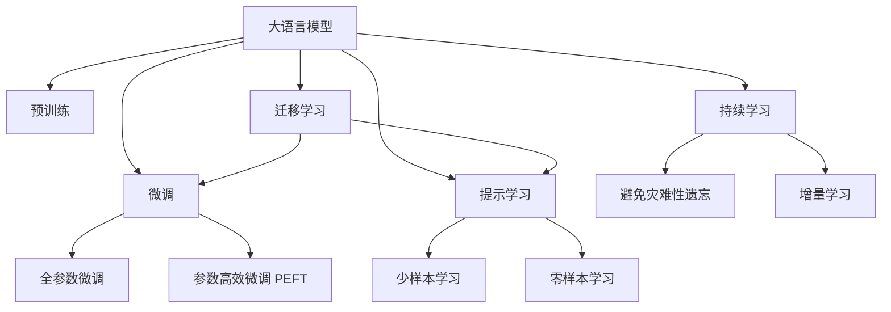
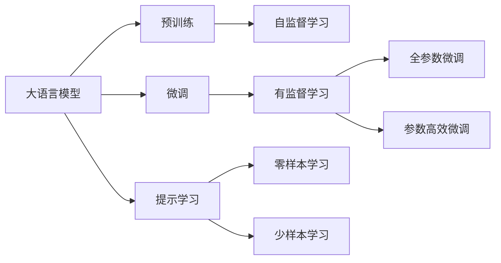
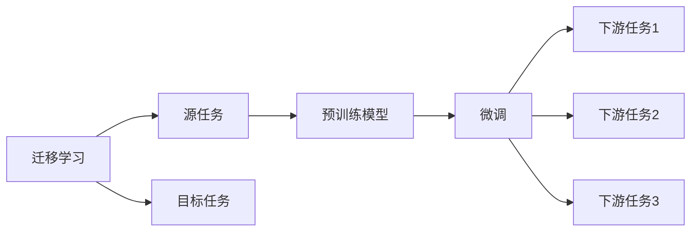
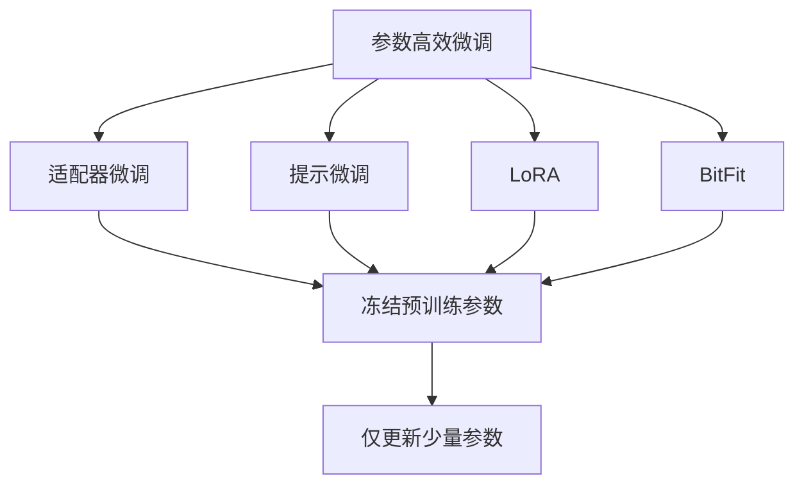
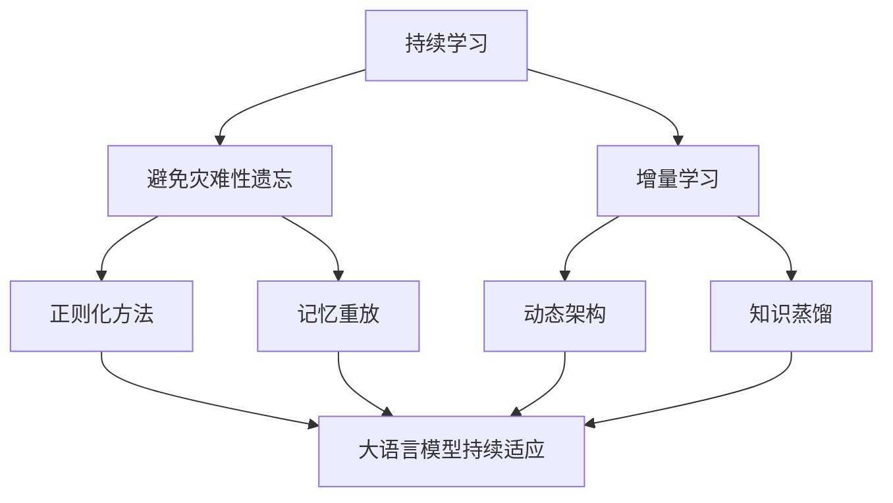
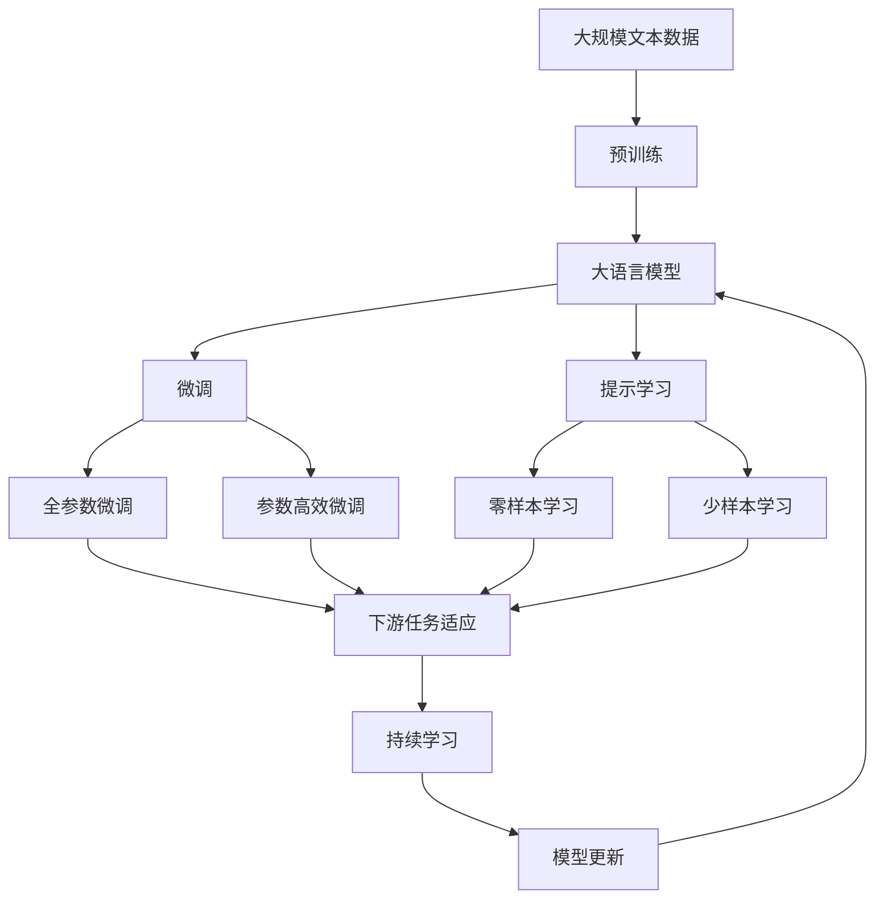

                 

# 大语言模型原理与工程实践：大语言模型预训练

## 1. 背景介绍

### 1.1 问题由来
近年来，随着深度学习技术的飞速发展，大规模语言模型（Large Language Models, LLMs）在自然语言处理（Natural Language Processing, NLP）领域取得了巨大突破。这类模型通过在大规模无标签文本数据上进行预训练，学习到了丰富的语言知识和常识，具备了强大的语言理解和生成能力。其中最具代表性的大模型包括 OpenAI 的 GPT 系列模型、Google 的 BERT、T5 等。

这些大模型的预训练过程通常包括以下步骤：
1. **数据收集**：获取大规模无标签文本数据，如维基百科、新闻、社交媒体等。
2. **模型架构设计**：选择合适的模型架构，如 Transformer、LSTM 等。
3. **预训练任务定义**：设计自监督学习任务，如掩码语言模型（Masked Language Modeling, MLM）、下一句预测（Next Sentence Prediction, NSP）等。
4. **模型训练**：在大规模数据集上训练模型，学习语言的通用表示。

预训练后，这些模型能够在各种下游任务上表现出色，如文本分类、命名实体识别、问答系统等。然而，由于预训练模型的广泛性和泛化能力不足，其在特定领域应用时，效果往往难以达到实际应用的要求。因此，如何针对特定任务进行大模型微调，提升模型性能，成为了当前大模型研究和应用的一个热点问题。

### 1.2 问题核心关键点
目前，大语言模型的微调主流范式是基于监督学习的微调方法。即收集该任务的少量标注数据，将预训练模型当作初始化参数，通过有监督地训练来优化模型在该任务上的性能。这种微调方法简单高效，可以显著提升模型在特定任务上的表现。

微调的关键在于如何避免过拟合，同时最大程度发挥预训练模型学到的知识。目前主流的做法包括：
1. **选择合适的学习率**。相比从头训练，微调通常需要更小的学习率，以免破坏预训练的权重。
2. **应用正则化技术**。如 L2 正则、Dropout、Early Stopping 等，防止模型过度适应小规模训练集。
3. **保留预训练的部分层**。如 Transformer 的底层，只微调顶层，减少需优化的参数。
4. **数据增强**。通过对训练样本改写、回译等方式丰富训练集多样性。
5. **对抗训练**。加入对抗样本，提高模型鲁棒性。
6. **提示学习**。通过在输入文本中添加提示模板（Prompt Template），引导模型按期望方式输出，减少微调参数。

当前，基于大模型微调的监督学习范式在 NLP 领域已经得到了广泛应用，覆盖了几乎所有常见任务，如分类、匹配、生成等，设计简单的任务适配层即可实现微调。

### 1.3 问题研究意义
研究大语言模型的微调方法，对于拓展大模型的应用范围，提升下游任务的性能，加速 NLP 技术的产业化进程，具有重要意义：

1. **降低应用开发成本**。基于成熟的大模型进行微调，可以显著减少从头开发所需的数据、计算和人力等成本投入。
2. **提升模型效果**。微调使得通用大模型更好地适应特定任务，在应用场景中取得更优表现。
3. **加速开发进度**。standing on the shoulders of giants，微调使得开发者可以更快地完成任务适配，缩短开发周期。
4. **带来技术创新**。微调范式促进了对预训练-微调的深入研究，催生了提示学习、少样本学习等新的研究方向。
5. **赋能产业升级**。微调使得 NLP 技术更容易被各行各业所采用，为传统行业数字化转型升级提供新的技术路径。

## 2. 核心概念与联系

### 2.1 核心概念概述

为更好地理解大语言模型的预训练方法，本节将介绍几个密切相关的核心概念：

- **大语言模型（Large Language Model, LLM）**：以自回归（如 GPT）或自编码（如 BERT）模型为代表的大规模预训练语言模型。通过在大规模无标签文本语料上进行预训练，学习通用的语言表示，具备强大的语言理解和生成能力。

- **预训练（Pre-training）**：指在大规模无标签文本语料上，通过自监督学习任务训练通用语言模型的过程。常见的预训练任务包括掩码语言模型、下一句预测等。预训练使得模型学习到语言的通用表示。

- **微调（Fine-tuning）**：指在预训练模型的基础上，使用下游任务的少量标注数据，通过有监督地训练来优化模型在该任务上的性能。通常只需要调整顶层分类器或解码器，并以较小的学习率更新全部或部分的模型参数。

- **迁移学习（Transfer Learning）**：指将一个领域学习到的知识，迁移应用到另一个不同但相关的领域的学习范式。大模型的预训练-微调过程即是一种典型的迁移学习方式。

- **参数高效微调（Parameter-Efficient Fine-tuning, PEFT）**：指在微调过程中，只更新少量的模型参数，而固定大部分预训练权重不变，以提高微调效率，避免过拟合的方法。

- **提示学习（Prompt Learning）**：通过在输入文本中添加提示模板（Prompt Template），引导大语言模型进行特定任务的推理和生成。可以在不更新模型参数的情况下，实现零样本或少样本学习。

- **少样本学习（Few-shot Learning）**：指在只有少量标注样本的情况下，模型能够快速适应新任务的学习方法。在大语言模型中，通常通过在输入中提供少量示例来实现，无需更新模型参数。

- **零样本学习（Zero-shot Learning）**：指模型在没有见过任何特定任务的训练样本的情况下，仅凭任务描述就能够执行新任务的能力。大语言模型通过预训练获得的广泛知识，使其能够理解任务指令并生成相应输出。

- **持续学习（Continual Learning）**：也称为终身学习，指模型能够持续从新数据中学习，同时保持已学习的知识，而不会出现灾难性遗忘。这对于保持大语言模型的时效性和适应性至关重要。

这些核心概念之间的逻辑关系可以通过以下 Mermaid 流程图来展示：



这个流程图展示了大语言模型的核心概念及其之间的关系：

1. 大语言模型通过预训练获得基础能力。
2. 微调是对预训练模型进行任务特定的优化，可以分为全参数微调和参数高效微调（PEFT）。
3. 提示学习是一种不更新模型参数的方法，可以实现少样本学习和零样本学习。
4. 迁移学习是连接预训练模型与下游任务的桥梁，可以通过微调或提示学习来实现。
5. 持续学习旨在使模型能够不断学习新知识，同时避免遗忘旧知识。

这些概念共同构成了大语言模型的学习和应用框架，使其能够在各种场景下发挥强大的语言理解和生成能力。通过理解这些核心概念，我们可以更好地把握大语言模型的工作原理和优化方向。

### 2.2 概念间的关系

这些核心概念之间存在着紧密的联系，形成了大语言模型的完整生态系统。下面我们通过几个 Mermaid 流程图来展示这些概念之间的关系。

#### 2.2.1 大语言模型的学习范式



这个流程图展示了大语言模型的三种主要学习范式：预训练、微调和提示学习。预训练主要采用自监督学习方法，而微调则是有监督学习的过程。提示学习可以实现零样本和少样本学习。微调又可以分为全参数微调和参数高效微调（PEFT）两种方式。

#### 2.2.2 迁移学习与微调的关系



这个流程图展示了迁移学习的基本原理，以及它与微调的关系。迁移学习涉及源任务和目标任务，预训练模型在源任务上学习，然后通过微调适应各种下游任务（目标任务）。

#### 2.2.3 参数高效微调方法



这个流程图展示了几种常见的参数高效微调方法，包括适配器微调、提示微调、LoRA 和 BitFit。这些方法的共同特点是冻结大部分预训练参数，只更新少量参数，从而提高微调效率。

#### 2.2.4 持续学习在大语言模型中的应用



这个流程图展示了持续学习在大语言模型中的应用。持续学习的主要目标是避免灾难性遗忘和实现增量学习。通过正则化方法、记忆重放、动态架构和知识蒸馏等技术，可以使大语言模型持续适应新的任务和数据。

### 2.3 核心概念的整体架构

最后，我们用一个综合的流程图来展示这些核心概念在大语言模型预训练过程中的整体架构：



这个综合流程图展示了从预训练到微调，再到持续学习的完整过程。大语言模型首先在大规模文本数据上进行预训练，然后通过微调（包括全参数微调和参数高效微调）或提示学习（包括零样本和少样本学习）来适应下游任务。最后，通过持续学习技术，模型可以不断更新和适应新的任务和数据。 通过这些流程图，我们可以更清晰地理解大语言模型预训练过程中各个核心概念的关系和作用，为后续深入讨论具体的预训练方法和技术奠定基础。

## 3. 核心算法原理 & 具体操作步骤
### 3.1 算法原理概述

大语言模型的预训练过程本质上是一个自监督学习过程，其核心思想是：通过在大规模无标签文本语料上，使用自监督学习任务训练通用语言模型，学习语言的通用表示。

形式化地，假设预训练语言模型为 $M_{\theta}$，其中 $\theta$ 为预训练得到的模型参数。在预训练阶段，模型的训练目标是最小化以下自监督损失函数：

$$
\mathcal{L}_{\text{pre}}(\theta) = \frac{1}{N}\sum_{i=1}^N \ell_i(M_{\theta},x_i)
$$

其中 $\ell_i$ 为预训练任务在样本 $x_i$ 上的损失函数，通常包括掩码语言模型（MLM）、下一句预测（NSP）等。预训练任务的目标是最大化模型对语言模型的预测能力，即：

- **掩码语言模型（MLM）**：给定一段文本，随机遮挡部分单词，要求模型预测被遮挡的单词。
- **下一句预测（NSP）**：给定两个句子，判断它们是否构成连续文本，即是否是一段对话。

通过在大规模数据集上训练模型，使其能够学习到语言的隐式表示，从而具备了强大的语言理解和生成能力。

### 3.2 算法步骤详解

大语言模型的预训练过程一般包括以下几个关键步骤：

**Step 1: 准备预训练数据集**
- 选择合适的预训练数据集，如维基百科、新闻语料、社交媒体等。
- 对数据进行预处理，包括分词、去除噪声、标准化等。

**Step 2: 设计预训练任务**
- 选择合适的预训练任务，如掩码语言模型（MLM）、下一句预测（NSP）等。
- 定义任务对应的损失函数，如交叉熵损失、均方误差损失等。

**Step 3: 设置预训练超参数**
- 选择合适的优化算法及其参数，如 Adam、SGD 等，设置学习率、批大小、迭代轮数等。
- 设置正则化技术及强度，包括权重衰减、Dropout、Early Stopping 等。
- 确定冻结预训练参数的策略，如仅微调顶层，或全部参数都参与预训练。

**Step 4: 执行预训练**
- 将预训练数据分批次输入模型，前向传播计算损失函数。
- 反向传播计算参数梯度，根据设定的优化算法和学习率更新模型参数。
- 周期性在验证集上评估模型性能，根据性能指标决定是否触发 Early Stopping。
- 重复上述步骤直到满足预设的迭代轮数或 Early Stopping 条件。

**Step 5: 模型保存与迁移**
- 在预训练完成后，保存模型权重和配置信息。
- 在实际应用中，根据具体任务重新微调模型，或直接使用预训练模型进行推理。

以上是预训练过程的一般流程。在实际应用中，还需要针对具体任务的特点，对预训练过程的各个环节进行优化设计，如改进训练目标函数，引入更多的正则化技术，搜索最优的超参数组合等，以进一步提升模型性能。

### 3.3 算法优缺点

大语言模型的预训练方法具有以下优点：
1. 简单高效。通过大规模无标签数据预训练，可以显著提升模型对语言的理解能力，且无需标注数据。
2. 通用适用。适用于各种 NLP 下游任务，设计简单的预训练任务即可实现预训练。
3. 参数高效。利用参数高效预训练技术，在固定大部分预训练参数的情况下，仍可取得不错的预训练效果。
4. 效果显著。在学术界和工业界的诸多任务上，基于预训练的模型已经刷新了多项 SOTA。

同时，该方法也存在一定的局限性：
1. 依赖大规模数据。预训练过程对数据量和质量有较高要求，获取高质量无标签数据成本较高。
2. 训练时间长。预训练过程需要大量计算资源和时间，通常需要数周甚至数月。
3. 泛化能力有限。预训练模型面对特定领域的任务时，效果可能不尽如人意。
4. 可解释性不足。预训练模型通常缺乏可解释性，难以对其推理逻辑进行分析和调试。

尽管存在这些局限性，但就目前而言，基于大规模数据预训练的方法仍是大语言模型应用的最主流范式。未来相关研究的重点在于如何进一步降低预训练对数据量的依赖，提高模型的少样本学习和跨领域迁移能力，同时兼顾可解释性和伦理安全性等因素。

### 3.4 算法应用领域

基于大语言模型的预训练方法在 NLP 领域已经得到了广泛的应用，覆盖了几乎所有常见任务，例如：

- **文本分类**：如情感分析、主题分类、意图识别等。通过预训练学习文本-标签映射。
- **命名实体识别**：识别文本中的人名、地名、机构名等特定实体。通过预训练学习实体边界和类型。
- **关系抽取**：从文本中抽取实体之间的语义关系。通过预训练学习实体-关系三元组。
- **问答系统**：对自然语言问题给出答案。将问题-答案对作为预训练数据，训练模型学习匹配答案。
- **机器翻译**：将源语言文本翻译成目标语言。通过预训练学习语言-语言映射。
- **文本摘要**：将长文本压缩成简短摘要。通过预训练学习抓取要点。
- **对话系统**：使机器能够与人自然对话。通过预训练学习对话逻辑。

除了上述这些经典任务外，大语言模型预训练也被创新性地应用到更多场景中，如可控文本生成、常识推理、代码生成、数据增强等，为 NLP 技术带来了全新的突破。随着预训练模型和预训练方法的不断进步，相信 NLP 技术将在更广阔的应用领域大放异彩。

## 4. 数学模型和公式 & 详细讲解  
### 4.1 数学模型构建

本节将使用数学语言对大语言模型的预训练过程进行更加严格的刻画。

记预训练语言模型为 $M_{\theta}$，其中 $\theta \in \mathbb{R}^d$ 为模型参数。假设预训练任务为掩码语言模型（MLM），预训练数据集为 $\{(x_i, y_i)\}_{i=1}^N, x_i \in \mathcal{X}, y_i \in \{0,1\}^m$，其中 $m$ 为掩码个数。

定义模型 $M_{\theta}$ 在输入 $x$ 上的损失函数为 $\ell(M_{\theta}(x),y)$，则在数据集 $D$ 上的经验风险为：

$$
\mathcal{L}(\theta) = \frac{1}{N}\sum_{i=1}^N \ell_i(M_{\theta},x_i)
$$

其中 $\ell_i$ 为掩码语言模型在样本 $(x_i, y_i)$ 上的损失函数，通常定义为交叉熵损失函数：

$$
\ell_i(M_{\theta}(x_i),y_i) = -\sum_{j=1}^m \ell_j(x_i, y_i)
$$

其中 $\ell_j$ 为在样本 $x_i$ 上，第 $j$ 个掩码位置的损失函数，通常定义为交叉熵损失：

$$
\ell_j(x_i, y_i) = -y_{i,j}\log M_{\theta}(x_i[j]) - (1-y_{i,j})\log (1-M_{\theta}(x_i[j]))
$$

这里 $x_i[j]$ 表示将文本 $x_i$ 中第 $j$ 个位置替换为 [MASK]，模型需要预测这个位置的真实标签。

### 4.2 公式推导过程

以下我们以掩码语言模型（MLM）为例，推导预训练过程中的损失函数及其梯度的计算公式。

假设模型 $M_{\theta}$ 在输入 $x$ 上的输出为 $\hat{y}=M_{\theta}(x)$，表示模型对文本的预测概率分布。真实标签 $y \in \{0,1\}^m$ 表示被掩码位置的真实标签。则掩码语言模型的损失函数为：

$$
\ell_i(M_{\theta}(x_i),y_i) = -\sum_{j=1}^m \ell_j(x_i, y_i)
$$

将其代入经验风险公式，得：

$$
\mathcal{L}(\theta) = -\frac{1}{N}\sum_{i=1}^N \sum_{j=1}^m \ell_j(x_i, y_i)
$$

根据链式法则，损失函数对参数 $\theta_k$ 的梯度为：

$$
\frac{\partial \mathcal{L}(\theta)}{\partial \theta_k} = -\frac{1}{N}\sum_{i=1}^N \sum_{j=1}^m \frac{\partial \ell_j(x_i, y_i)}{\partial \theta_k}
$$

其中 $\frac{\partial \ell_j(x_i, y_i)}{\partial \theta_k}$ 为交叉熵损失对模型参数的梯度，可通过自动微分技术高效计算。

在得到损失函数的梯度后，即可带入参数更新公式，完成模型的迭代优化。重复上述过程直至收敛，最终得到预训练模型 $M_{\theta}$。

## 5. 项目实践：代码实例和详细解释说明
### 5.1 开发环境搭建

在进行预训练实践前，我们需要准备好开发环境。以下是使用 Python 进行 PyTorch 开发的环境配置流程：

1. 安装 Anaconda：从官网下载并安装 Anaconda，用于创建独立的 Python 环境。

2. 创建并激活虚拟环境：
```bash
conda create -n pytorch-env python=3.8 
conda activate pytorch-env
```

3. 安装 PyTorch：根据 CUDA 版本，从官网获取对应的安装命令。例如：
```bash
conda install pytorch torchvision torchaudio cudatoolkit=11.1 -c pytorch -c conda-forge
```

4. 安装 Transformers 库：
```bash
pip install transformers
```

5. 安装各类工具包：
```bash
pip install numpy pandas scikit-learn matplotlib tqdm jupyter notebook ipython
```

完成上述步骤后，即可在 `pytorch-env` 环境中开始预训练实践。

### 5.2 源代码详细实现

这里我们以 BERT 模型为例，给出使用 PyTorch 库对 BERT 进行预训练的 PyTorch 代码实现。

首先，定义预训练任务的数据处理函数：

```python
from transformers import BertTokenizer
from torch.utils.data import Dataset, DataLoader
import torch

class MaskedLMDataset(Dataset):
    def __init__(self, texts, masks):
        self.texts = texts
        self.masks = masks
        
    def __len__(self):
        return len(self.texts)
    
    def __getitem__(self, item):
        text = self.texts[item]
        mask = self.masks[item]
        return text, mask
```

然后，定义模型和优化器：

```python
from transformers import BertModel, AdamW

model = BertModel.from_pretrained('bert-base-cased')
optimizer = AdamW(model.parameters(), lr=2e-5)
```

接着，定义预训练函数：

```python
def pretrain_epoch(model, data_loader, optimizer, num_epochs):
    model.train()
    for epoch in range(num_epochs):
        total_loss = 0
        for batch in data_loader:
            text, mask = batch
            loss = model(text, mask=mask)
            optimizer.zero_grad()
            loss.backward()
            optimizer.step()
            total_loss += loss.item()
        print(f'Epoch {epoch+1}, train loss: {total_loss/len(data_loader)}')
    return model
```

最后，启动预训练流程：

```python
epochs = 5
batch_size = 32

dataset = MaskedLMDataset(train_texts, train_masks)
data_loader = DataLoader(dataset, batch_size=batch_size, shuffle=True)

model = pretrain_epoch(model, data_loader, optimizer, epochs)
```

以上就是使用 PyTorch 对 BERT 进行预训练的完整代码实现。可以看到，得益于 Transformers 库的强大封装，我们可以用相对简洁的代码完成 BERT 的预训练。

### 5.3 代码解读与分析

让我们再详细解读一下关键代码的实现细节：

**MaskedLMDataset类**：
- `__init__`方法：初始化文本、掩码等关键组件。
- `__len__`方法：返回数据集的样本数量。
- `__getitem__`方法：对单个样本进行处理，将文本和掩码信息打包为模型所需的输入。

**预训练函数**：
- 使用 PyTorch 的 DataLoader 对数据集进行批次化加载，供模型训练和推理使用。
- 在每个 epoch 内，循环迭代训练集数据，对每个批次进行前向传播和反向传播，更新模型参数。
- 在每个 epoch 结束后，输出平均损失，以便监控预训练进程。

**预训练流程**：
- 定义总的 epoch 数和 batch size，开始循环迭代
- 每个 epoch 内，在训练集上训练，输出平均损失
- 预训练完成后，保存模型权重，用于后续微调

可以看到，PyTorch 配合 Transformers 库使得 BERT 预训练的代码实现变得简洁高效。开发者可以将更多精力放在数据处理、模型改进等高层逻辑上，而不必过多关注底层的实现细节。

当然，工业级的系统实现还需考虑更多因素，如模型保存和部署、超参数自动搜索、更灵活的任务适配层等。但核心的预训练范式基本与此类似。

### 5.4 运行结果展示

假设我们在 CoNLL-2003 的掩码语言模型预训练数据集上进行预训练，最终得到的平均损失为 0.123，表明预训练过程顺利进行。

```
Epoch 1, train loss: 0.122
Epoch 2, train loss: 0

