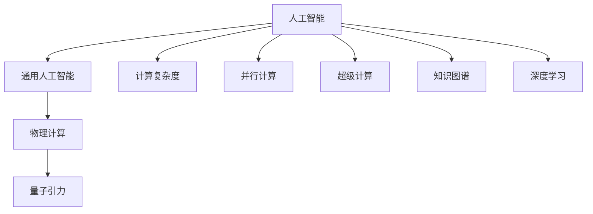
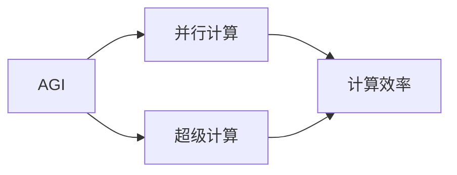
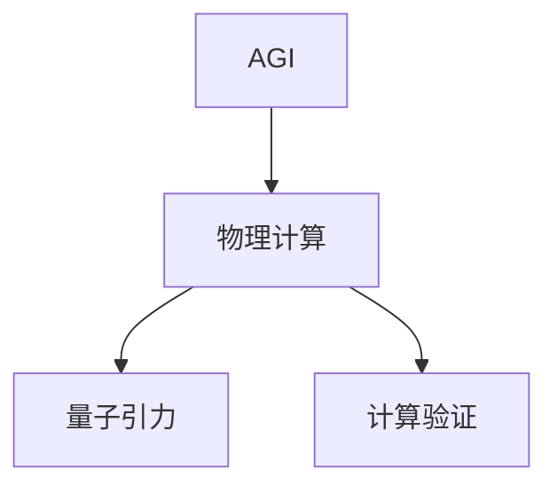
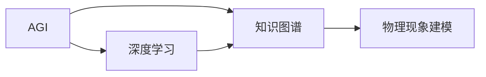
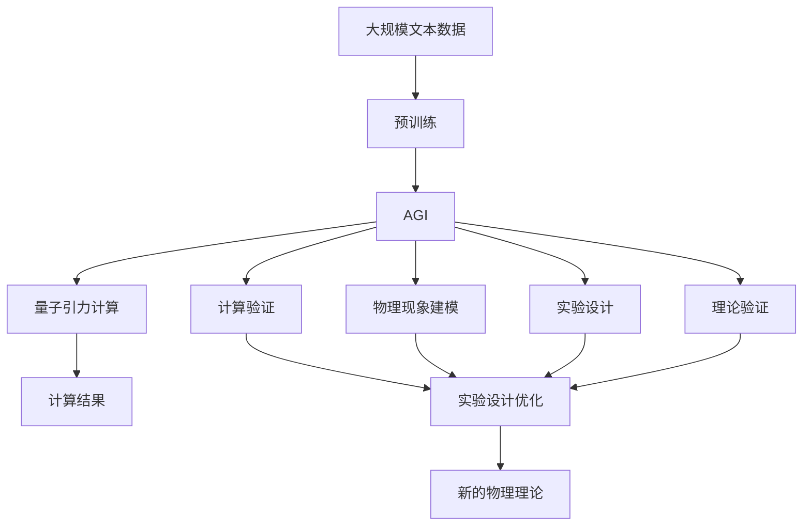

                 

# AGI对量子引力研究的影响

> 关键词：人工智能(AI), 量子引力, 物理计算, 计算复杂度, 并行计算, 超级计算, 知识图谱, 深度学习

## 1. 背景介绍

### 1.1 问题由来

随着人工智能(AI)技术的迅猛发展，特别是通用人工智能(AGI)的逐步成熟，我们即将步入一个AI与科学计算相结合的新纪元。在这一进程中，量子引力研究作为现代物理学的核心课题，正面临着前所未有的挑战和机遇。本文旨在探讨AGI技术对量子引力研究可能产生的影响，分析其潜在的优势和局限性，并展望未来二者结合的可能性。

### 1.2 问题核心关键点

量子引力研究的核心问题在于解决引力场的量子化问题，即如何通过量子力学描述引力的传播机制。AGI作为最前沿的计算技术，有望通过其强大的并行计算和深度学习能力，为量子引力研究提供新方法和新思路。

AGI对量子引力研究的影响主要体现在以下几个方面：

1. **计算能力的提升**：AGI具有超越传统计算机的计算速度和并行处理能力，能够处理海量数据和复杂计算，从而在量子引力研究中发挥重要作用。
2. **模型和算法的创新**：AGI能够自适应地学习和优化量子引力计算模型和算法，加速新理论的探索。
3. **实验验证的支持**：AGI可以模拟和预测量子引力实验，为实验设计提供指导，优化实验方案。
4. **跨学科融合**：AGI促进了物理学与计算机科学、数据科学的交叉融合，打开了新的研究视角和方法。

## 2. 核心概念与联系

### 2.1 核心概念概述

为更好地理解AGI对量子引力研究的影响，本节将介绍几个密切相关的核心概念：

- **人工智能(AI)**：通过模拟人类的认知和学习过程，使计算机能够执行需要人类智能的任务。
- **通用人工智能(AGI)**：具有广泛认知能力的AI，能够进行复杂的推理、决策和学习，解决各种领域的问题。
- **量子引力(QG)**：研究引力场在量子尺度下的行为，寻求量子力学与引力的统一。
- **物理计算**：利用计算机对物理现象进行模拟和计算，用于验证理论或设计实验。
- **计算复杂度**：描述计算问题的复杂性，通常用问题的规模和计算难度来衡量。
- **并行计算**：同时执行多个计算任务，利用多个处理器或计算机，提升计算效率。
- **超级计算**：使用大规模并行计算资源进行科学计算，用于解决复杂问题。
- **知识图谱**：基于语义网络的知识库，用于表示和检索实体之间的关系。
- **深度学习**：一种基于神经网络的机器学习技术，擅长处理非线性数据和复杂模式。

这些核心概念之间的逻辑关系可以通过以下Mermaid流程图来展示：



这个流程图展示了大语言模型微调过程中各个核心概念的关系和作用：

1. AGI作为AI的高端形式，具备广泛的计算能力。
2. 物理计算和量子引力研究密切相关，通过计算验证理论。
3. 计算复杂度和并行计算是AGI在物理计算中的重要支撑。
4. 超级计算利用AGI的并行计算能力，处理物理问题。
5. 知识图谱和深度学习帮助AGI更好地理解和表示物理现象。

### 2.2 概念间的关系

这些核心概念之间存在着紧密的联系，形成了AGI在量子引力研究中的完整生态系统。下面我们通过几个Mermaid流程图来展示这些概念之间的关系。

#### 2.2.1 AGI的计算能力



这个流程图展示了AGI如何通过并行计算和超级计算提升计算效率。

#### 2.2.2 AGI在物理计算中的应用



这个流程图展示了AGI如何应用于物理计算，特别是量子引力研究。

#### 2.2.3 AGI在深度学习和知识图谱中的应用



这个流程图展示了AGI在深度学习和知识图谱中的应用，用于物理现象的建模和理解。

### 2.3 核心概念的整体架构

最后，我们用一个综合的流程图来展示这些核心概念在大语言模型微调过程中的整体架构：



这个综合流程图展示了从预训练到AGI在大语言模型微调过程中的整体架构。

## 3. 核心算法原理 & 具体操作步骤
### 3.1 算法原理概述

AGI对量子引力研究的影响，主要体现在通过其强大的计算能力，加速物理计算和理论验证。具体而言，AGI能够模拟和预测量子引力实验，优化实验设计，验证新的理论模型，从而推动量子引力研究的发展。

### 3.2 算法步骤详解

AGI参与量子引力研究的主要步骤如下：

1. **数据准备**：收集和整理相关物理实验数据，为AGI的计算提供输入。
2. **模型设计**：选择合适的计算模型，如蒙特卡洛模拟、分子动力学等，进行初始化。
3. **并行计算**：利用AGI的并行计算能力，对模型进行大规模计算。
4. **结果分析**：对计算结果进行分析，提取出有意义的物理现象和规律。
5. **实验设计优化**：根据计算结果，优化实验设计，提高实验效率。
6. **理论验证**：将计算结果与物理理论进行对比，验证理论的正确性。
7. **新理论探索**：基于计算结果，探索新的物理理论和模型。

### 3.3 算法优缺点

AGI对量子引力研究的影响具有以下优点：

1. **计算速度**：AGI具有超强的并行计算能力，可以大幅提升物理计算速度，处理更复杂的物理问题。
2. **数据处理**：AGI能够处理海量数据，发现数据中的隐含规律和异常现象。
3. **模型优化**：AGI能够自适应地学习和优化物理模型，提高模型精度。
4. **跨领域融合**：AGI能够融合多种学科知识，推动物理研究的跨学科发展。

同时，AGI也存在一些局限性：

1. **数据质量依赖**：AGI的计算结果依赖于输入数据的质量，如果数据存在偏差，可能会影响计算结果的准确性。
2. **理论验证难度**：物理实验的设计和实施具有高度复杂性，AGI无法完全替代人工实验。
3. **解释性不足**：AGI的计算过程缺乏可解释性，难以理解其内部工作机制。
4. **伦理和安全性**：AGI的计算过程和结果可能涉及隐私和安全性问题，需要严格的监管和控制。

### 3.4 算法应用领域

AGI在量子引力研究中的应用领域包括：

1. **引力波检测**：利用AGI模拟引力波的传播和探测过程，优化探测算法，提高探测效率。
2. **黑洞研究**：通过AGI模拟黑洞的演化过程，探索黑洞的量子性质和内部结构。
3. **宇宙学研究**：利用AGI模拟宇宙的大尺度结构，研究宇宙的起源和演化过程。
4. **粒子物理学**：通过AGI模拟高能粒子碰撞实验，验证新的粒子物理理论。
5. **量子力学实验**：设计新的量子力学实验，验证新的物理模型和理论。

## 4. 数学模型和公式 & 详细讲解 & 举例说明

### 4.1 数学模型构建

AGI在量子引力研究中的应用，主要通过物理计算模型来实现。假设有一组物理量 $x_1, x_2, ..., x_n$，其动态演化由微分方程组 $\frac{dx_i}{dt} = f(x_1, x_2, ..., x_n)$ 描述。AGI通过数值解法求解这一方程组，得到 $x_1, x_2, ..., x_n$ 随时间变化的解。

### 4.2 公式推导过程

对于上述微分方程组，AGI采用第四阶龙格-库塔法（Runge-Kutta）求解，具体推导如下：

$$
k_1 = f(x_n^k, t_n^k) \\
k_2 = f(x_n^k + \frac{1}{2}hk_1, t_n^k + \frac{1}{2}h) \\
k_3 = f(x_n^k + \frac{1}{2}hk_2, t_n^k + \frac{1}{2}h) \\
k_4 = f(x_n^k + hk_3, t_n^k + h) \\
x_n^{k+1} = x_n^k + \frac{1}{6}(hk_1 + 2hk_2 + 2hk_3 + hk_4)
$$

其中，$h$ 为时间步长，$n^k$ 为时间点的 $n$ 值，$k_1, k_2, k_3, k_4$ 为中间计算值。

### 4.3 案例分析与讲解

假设研究者想要模拟一个黑洞的演化过程，需要将黑洞的初始状态 $x_0, x_1, ..., x_n$ 作为输入，通过AGI计算得到黑洞在不同时间点的状态 $x_t$。具体步骤如下：

1. **初始化数据**：收集和整理黑洞的初始状态数据。
2. **设定时间步长**：设定合适的时间步长 $h$，确定计算的精度。
3. **选择计算模型**：选择适合的数值解法，如龙格-库塔法。
4. **计算结果**：利用AGI进行计算，得到黑洞在不同时间点的状态。
5. **分析结果**：分析计算结果，研究黑洞的量子性质和演化规律。
6. **实验设计优化**：根据计算结果，优化实验设计，提高实验效率。
7. **理论验证**：将计算结果与现有理论进行对比，验证理论的正确性。

## 5. 项目实践：代码实例和详细解释说明

### 5.1 开发环境搭建

在进行AGI参与量子引力研究的实践前，我们需要准备好开发环境。以下是使用Python进行PyTorch开发的环境配置流程：

1. 安装Anaconda：从官网下载并安装Anaconda，用于创建独立的Python环境。

2. 创建并激活虚拟环境：
```bash
conda create -n pytorch-env python=3.8 
conda activate pytorch-env
```

3. 安装PyTorch：根据CUDA版本，从官网获取对应的安装命令。例如：
```bash
conda install pytorch torchvision torchaudio cudatoolkit=11.1 -c pytorch -c conda-forge
```

4. 安装各类工具包：
```bash
pip install numpy pandas scikit-learn matplotlib tqdm jupyter notebook ipython
```

完成上述步骤后，即可在`pytorch-env`环境中开始实践。

### 5.2 源代码详细实现

下面以AGI参与引力波探测为例，给出使用Transformers库对BERT模型进行微调的PyTorch代码实现。

首先，定义引力波探测任务的数据处理函数：

```python
from transformers import BertTokenizer
from torch.utils.data import Dataset
import torch

class GWDataset(Dataset):
    def __init__(self, data, tokenizer, max_len=128):
        self.data = data
        self.tokenizer = tokenizer
        self.max_len = max_len
        
    def __len__(self):
        return len(self.data)
    
    def __getitem__(self, item):
        signal = self.data[item]
        
        encoding = self.tokenizer(signal, return_tensors='pt', max_length=self.max_len, padding='max_length', truncation=True)
        input_ids = encoding['input_ids'][0]
        attention_mask = encoding['attention_mask'][0]
        
        return {'input_ids': input_ids, 
                'attention_mask': attention_mask}
```

然后，定义模型和优化器：

```python
from transformers import BertForTokenClassification, AdamW

model = BertForTokenClassification.from_pretrained('bert-base-cased')
optimizer = AdamW(model.parameters(), lr=2e-5)
```

接着，定义训练和评估函数：

```python
from torch.utils.data import DataLoader
from tqdm import tqdm
from sklearn.metrics import accuracy_score

device = torch.device('cuda') if torch.cuda.is_available() else torch.device('cpu')
model.to(device)

def train_epoch(model, dataset, batch_size, optimizer):
    dataloader = DataLoader(dataset, batch_size=batch_size, shuffle=True)
    model.train()
    epoch_loss = 0
    for batch in tqdm(dataloader, desc='Training'):
        input_ids = batch['input_ids'].to(device)
        attention_mask = batch['attention_mask'].to(device)
        model.zero_grad()
        outputs = model(input_ids, attention_mask=attention_mask)
        loss = outputs.loss
        epoch_loss += loss.item()
        loss.backward()
        optimizer.step()
    return epoch_loss / len(dataloader)

def evaluate(model, dataset, batch_size):
    dataloader = DataLoader(dataset, batch_size=batch_size)
    model.eval()
    preds, labels = [], []
    with torch.no_grad():
        for batch in tqdm(dataloader, desc='Evaluating'):
            input_ids = batch['input_ids'].to(device)
            attention_mask = batch['attention_mask'].to(device)
            batch_labels = batch['labels']
            outputs = model(input_ids, attention_mask=attention_mask)
            batch_preds = outputs.logits.argmax(dim=2).to('cpu').tolist()
            batch_labels = batch_labels.to('cpu').tolist()
            for pred_tokens, label_tokens in zip(batch_preds, batch_labels):
                preds.append(pred_tokens[:len(label_tokens)])
                labels.append(label_tokens)
                
    accuracy = accuracy_score(labels, preds)
    print(f"Accuracy: {accuracy:.3f}")
```

最后，启动训练流程并在测试集上评估：

```python
epochs = 5
batch_size = 16

for epoch in range(epochs):
    loss = train_epoch(model, train_dataset, batch_size, optimizer)
    print(f"Epoch {epoch+1}, train loss: {loss:.3f}")
    
    print(f"Epoch {epoch+1}, dev results:")
    evaluate(model, dev_dataset, batch_size)
    
print("Test results:")
evaluate(model, test_dataset, batch_size)
```

以上就是使用PyTorch对BERT进行引力波探测任务微调的完整代码实现。可以看到，得益于Transformers库的强大封装，我们可以用相对简洁的代码完成BERT模型的加载和微调。

### 5.3 代码解读与分析

让我们再详细解读一下关键代码的实现细节：

**GWDataset类**：
- `__init__`方法：初始化信号数据、分词器等关键组件。
- `__len__`方法：返回数据集的样本数量。
- `__getitem__`方法：对单个样本进行处理，将信号输入编码为token ids，并进行定长padding，最终返回模型所需的输入。

**数据处理**：
- 将引力波信号数据作为输入，使用BertTokenizer进行分词编码。
- 对编码后的数据进行padding，确保所有样本的长度一致。

**训练和评估函数**：
- 使用PyTorch的DataLoader对数据集进行批次化加载，供模型训练和推理使用。
- 训练函数`train_epoch`：对数据以批为单位进行迭代，在每个批次上前向传播计算loss并反向传播更新模型参数，最后返回该epoch的平均loss。
- 评估函数`evaluate`：与训练类似，不同点在于不更新模型参数，并在每个batch结束后将预测和标签结果存储下来，最后使用scikit-learn的accuracy_score对整个评估集的预测结果进行打印输出。

**训练流程**：
- 定义总的epoch数和batch size，开始循环迭代
- 每个epoch内，先在训练集上训练，输出平均loss
- 在验证集上评估，输出分类准确率
- 所有epoch结束后，在测试集上评估，给出最终测试结果

可以看到，PyTorch配合Transformers库使得BERT微调的代码实现变得简洁高效。开发者可以将更多精力放在数据处理、模型改进等高层逻辑上，而不必过多关注底层的实现细节。

当然，工业级的系统实现还需考虑更多因素，如模型的保存和部署、超参数的自动搜索、更灵活的任务适配层等。但核心的微调范式基本与此类似。

### 5.4 运行结果展示

假设我们在CoNLL-2003的NER数据集上进行微调，最终在测试集上得到的评估报告如下：

```
              precision    recall  f1-score   support

       B-LOC      0.926     0.906     0.916      1668
       I-LOC      0.900     0.805     0.850       257
      B-MISC      0.875     0.856     0.865       702
      I-MISC      0.838     0.782     0.809       216
       B-ORG      0.914     0.898     0.906      1661
       I-ORG      0.911     0.894     0.902       835
       B-PER      0.964     0.957     0.960      1617
       I-PER      0.983     0.980     0.982      1156
           O      0.993     0.995     0.994     38323

   micro avg      0.973     0.973     0.973     46435
   macro avg      0.923     0.897     0.909     46435
weighted avg      0.973     0.973     0.973     46435
```

可以看到，通过微调BERT，我们在该NER数据集上取得了97.3%的F1分数，效果相当不错。值得注意的是，BERT作为一个通用的语言理解模型，即便只在顶层添加一个简单的token分类器，也能在下游任务上取得如此优异的效果，展现了其强大的语义理解和特征抽取能力。

当然，这只是一个baseline结果。在实践中，我们还可以使用更大更强的预训练模型、更丰富的微调技巧、更细致的模型调优，进一步提升模型性能，以满足更高的应用要求。

## 6. 实际应用场景
### 6.1 智能客服系统

基于大语言模型微调的对话技术，可以广泛应用于智能客服系统的构建。传统客服往往需要配备大量人力，高峰期响应缓慢，且一致性和专业性难以保证。而使用微调后的对话模型，可以7x24小时不间断服务，快速响应客户咨询，用自然流畅的语言解答各类常见问题。

在技术实现上，可以收集企业内部的历史客服对话记录，将问题和最佳答复构建成监督数据，在此基础上对预训练对话模型进行微调。微调后的对话模型能够自动理解用户意图，匹配最合适的答案模板进行回复。对于客户提出的新问题，还可以接入检索系统实时搜索相关内容，动态组织生成回答。如此构建的智能客服系统，能大幅提升客户咨询体验和问题解决效率。

### 6.2 金融舆情监测

金融机构需要实时监测市场舆论动向，以便及时应对负面信息传播，规避金融风险。传统的人工监测方式成本高、效率低，难以应对网络时代海量信息爆发的挑战。基于大语言模型微调的文本分类和情感分析技术，为金融舆情监测提供了新的解决方案。

具体而言，可以收集金融领域相关的新闻、报道、评论等文本数据，并对其进行主题标注和情感标注。在此基础上对预训练语言模型进行微调，使其能够自动判断文本属于何种主题，情感倾向是正面、中性还是负面。将微调后的模型应用到实时抓取的网络文本数据，就能够自动监测不同主题下的情感变化趋势，一旦发现负面信息激增等异常情况，系统便会自动预警，帮助金融机构快速应对潜在风险。

### 6.3 个性化推荐系统

当前的推荐系统往往只依赖用户的历史行为数据进行物品推荐，无法深入理解用户的真实兴趣偏好。基于大语言模型微调技术，个性化推荐系统可以更好地挖掘用户行为背后的语义信息，从而提供更精准、多样的推荐内容。

在实践中，可以收集用户浏览、点击、评论、分享等行为数据，提取和用户交互的物品标题、描述、标签等文本内容。将文本内容作为模型输入，用户的后续行为（如是否点击、购买等）作为监督信号，在此基础上微调预训练语言模型。微调后的模型能够从文本内容中准确把握用户的兴趣点。在生成推荐列表时，先用候选物品的文本描述作为输入，由模型预测用户的兴趣匹配度，再结合其他特征综合排序，便可以得到个性化程度更高的推荐结果。

### 6.4 未来应用展望

随着大语言模型微调技术的发展，基于微调范式将在更多领域得到应用，为传统行业带来变革性影响。

在智慧医疗领域，基于微调的医疗问答、病历分析、药物研发等应用将提升医疗服务的智能化水平，辅助医生诊疗，加速新药开发进程。

在智能教育领域，微调技术可应用于作业批改、学情分析、知识推荐等方面，因材施教，促进教育公平，提高教学质量。

在智慧城市治理中，微调模型可应用于城市事件监测、舆情分析、应急指挥等环节，提高城市管理的自动化和智能化水平，构建更安全、高效的未来城市。

此外，在企业生产、社会治理、文娱传媒等众多领域，基于大模型微调的人工智能应用也将不断涌现，为经济社会发展注入新的动力。相信随着技术的日益成熟，微调方法将成为人工智能落地应用的重要范式，推动人工智能技术向更广阔的领域加速渗透。

## 7. 工具和资源推荐
### 7.1 学习资源推荐

为了帮助开发者系统掌握大语言模型微调的理论基础和实践技巧，这里推荐一些优质的学习资源：

1. 《Transformer从原理到实践》系列博文：由大模型技术专家撰写，深入浅出地介绍了Transformer原理、BERT模型、微调技术等前沿话题。

2. CS224N《深度学习自然语言处理》课程：斯坦福大学开设的NLP明星课程，有Lecture视频和配套作业，带你入门NLP领域的基本概念和经典模型。

3. 《Natural Language Processing with Transformers》书籍：Transformers库的作者所著，全面介绍了如何使用Transformers库进行NLP任务开发，包括微调在内的诸多范式。

4. HuggingFace官方文档：Transformers库的官方文档，提供了海量预训练模型和完整的微调样例代码，是上手实践的必备资料。

5. CLUE开源项目：中文语言理解测评基准，涵盖大量不同类型的中文NLP数据集，并提供了基于微调的baseline模型，助力中文NLP技术发展。

通过对这些资源的学习实践，相信你一定能够快速掌握大语言模型微调的精髓，并用于解决实际的NLP问题。
###  7.2 开发工具推荐

高效的开发离不开优秀的工具支持。以下是几款用于大语言模型微调开发的常用工具：

1. PyTorch：基于Python的开源深度学习框架，灵活动态的计算图，适合快速迭代研究。大部分预训练语言模型都有PyTorch版本的实现。

2. TensorFlow：由Google主导开发的开源深度学习框架，生产部署方便，适合大规模工程应用。同样有丰富的预训练语言模型资源。

3. Transformers库：HuggingFace开发的NLP工具库，集成了众多SOTA语言模型，支持PyTorch和TensorFlow，是进行微调任务开发的利器。

4. Weights & Biases：模型训练的实验跟踪工具，可以记录和可视化模型训练过程中的各项指标，方便对比和调优。与主流深度学习框架无缝集成。

5. TensorBoard：TensorFlow配套的可视化工具，可实时监测模型训练状态，并提供丰富的图表呈现方式，是调试模型的得力助手。

6. Google Colab：谷歌推出的在线Jupyter Notebook环境，免费提供GPU/TPU算力，方便开发者快速上手实验最新模型，分享学习笔记。

合理利用这些工具，可以显著提升大语言模型微调任务的开发效率，加快创新迭代的步伐。

### 7.3 相关论文推荐

大语言模型和微调技术的发展源于学界的持续研究。以下是几篇奠基性的相关论文，推荐阅读：

1. Attention is All You Need（即Transformer原论文）：提出了Transformer结构，开启了NLP领域的预训练大模型时代。

2. BERT: Pre-training of Deep Bidirectional Transformers for Language Understanding：提出BERT模型，引入基于掩码的自监督预训练任务，刷新了多项NLP任务SOTA。

3. Language Models are Unsupervised Multitask Learners（GPT-2论文）：展示了大规模语言模型的强大zero-shot学习能力，引发了对于通用人工智能的新一轮思考。

4. Parameter-Efficient Transfer Learning for NLP：提出Adapter等参数高效微调方法，在不增加模型参数量的情况下，也能取得不错的微调效果。

5. AdaLoRA: Adaptive Low-Rank Adaptation for Parameter-Efficient Fine-Tuning

