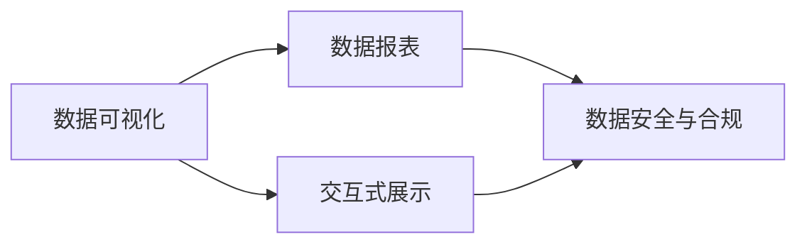

                 

# AI DMP 数据基建：数据可视化与报表

> 关键词：人工智能（AI）、用户画像（User Profile）、数据管理平台（DMP）、数据可视化、数据报表

## 1. 背景介绍

在数字化转型的今天，数据驱动决策成为了企业运营的核心。数据管理平台（DMP）作为一种重要的工具，被广泛应用于客户画像、用户行为分析、精准营销等多个领域。通过DMP，企业可以高效地管理和利用用户数据，驱动业务增长。然而，随着数据量的指数级增长，如何有效管理、分析和利用这些数据，成为了DMP面临的重要挑战。

### 1.1 问题由来

随着互联网技术的发展，用户数据变得越来越丰富和多样化。企业拥有大量的用户行为数据、交易数据、搜索数据等，但这些数据往往分散在不同的系统和平台中，难以整合和利用。此外，数据的质量和一致性问题也难以避免，导致分析和应用的效果大打折扣。因此，数据可视化与报表成为了数据管理的重要手段，帮助DMP用户快速理解数据、发现问题和指导决策。

### 1.2 问题核心关键点

为了有效管理和利用用户数据，DMP需要在数据收集、存储、分析和应用等多个环节进行优化。其中，数据可视化与报表是DMP系统中的关键组件，负责将复杂的数据信息转化为直观、易懂的可视化图表和报表，帮助用户快速获取关键洞察，发现问题，指导业务决策。

核心关键点包括：

- 数据可视化：通过图表、地图等直观方式展示数据，帮助用户快速理解数据分布和趋势。
- 报表生成：根据用户需求，生成详尽的数据报表，包括关键指标、统计结果等。
- 数据动态更新：数据可视化与报表需要实时响应数据变化，保证展示结果的准确性和时效性。
- 交互式展示：提供交互式操作，如钻取、过滤等，帮助用户深入探索数据，发现隐藏问题。
- 数据安全与合规：确保数据展示和报表生成的安全性与合规性，避免数据泄露和滥用。

## 2. 核心概念与联系

### 2.1 核心概念概述

DMP中的数据可视化与报表模块，主要负责将原始数据转化为可读性高的图表和报表，帮助用户快速理解和应用数据。以下是几个核心概念：

- **数据可视化**：通过图表、地图等形式，将复杂的数据信息转化为直观、易懂的图形表示，帮助用户快速理解数据分布和趋势。
- **数据报表**：根据用户需求，生成详尽的数据报表，包括关键指标、统计结果等。
- **交互式展示**：提供交互式操作，如钻取、过滤等，帮助用户深入探索数据，发现隐藏问题。
- **数据安全与合规**：确保数据展示和报表生成的安全性与合规性，避免数据泄露和滥用。

### 2.2 概念间的关系

这些核心概念之间的关系可以通过以下Mermaid流程图来展示：



这个流程图展示了大语言模型微调过程中各个核心概念之间的关系：

1. 数据可视化：通过图表、地图等直观方式展示数据，帮助用户快速理解数据分布和趋势。
2. 数据报表：根据用户需求，生成详尽的数据报表，包括关键指标、统计结果等。
3. 交互式展示：提供交互式操作，如钻取、过滤等，帮助用户深入探索数据，发现隐藏问题。
4. 数据安全与合规：确保数据展示和报表生成的安全性与合规性，避免数据泄露和滥用。

这些概念共同构成了DMP中的数据可视化与报表系统，使其能够高效地管理和利用用户数据，帮助用户快速理解数据、发现问题和指导决策。

## 3. 核心算法原理 & 具体操作步骤
### 3.1 算法原理概述

DMP中的数据可视化与报表模块，主要通过数据处理、图表生成、报表输出等算法来实现。其核心算法包括数据清洗、数据统计、图表生成、报表输出等。

### 3.2 算法步骤详解

以下是数据可视化与报表模块的算法步骤详解：

1. **数据清洗**：对原始数据进行清洗和处理，去除噪声和异常值，确保数据的质量和一致性。
2. **数据统计**：根据用户需求，对清洗后的数据进行统计分析，计算关键指标和统计结果。
3. **图表生成**：将统计结果转化为图表形式，包括柱状图、折线图、饼图、散点图等，直观展示数据分布和趋势。
4. **报表输出**：根据用户需求，生成详尽的数据报表，包括关键指标、统计结果等。
5. **交互式展示**：提供交互式操作，如钻取、过滤等，帮助用户深入探索数据，发现隐藏问题。
6. **数据安全与合规**：确保数据展示和报表生成的安全性与合规性，避免数据泄露和滥用。

### 3.3 算法优缺点

**优点**：

- 高效处理大规模数据：数据可视化与报表模块能够高效处理大规模数据，快速生成可视化图表和报表，帮助用户快速理解数据。
- 提供交互式体验：通过交互式操作，帮助用户深入探索数据，发现隐藏问题，提升数据应用效果。
- 支持多种数据格式：支持多种数据格式，如SQL、JSON、CSV等，方便用户导入和导出数据。

**缺点**：

- 数据清洗复杂：数据清洗和处理过程复杂，需要耗费大量时间和资源。
- 依赖数据质量：数据质量直接影响可视化结果和报表的准确性，需要确保数据一致性和完整性。
- 交互功能受限：交互式展示功能有限，可能无法满足用户的所有需求。

### 3.4 算法应用领域

数据可视化与报表模块广泛应用于客户画像、用户行为分析、精准营销等多个领域，帮助DMP用户高效管理和利用用户数据，指导业务决策。

## 4. 数学模型和公式 & 详细讲解  
### 4.1 数学模型构建

在大语言模型微调中，数据可视化与报表模块主要涉及以下数学模型：

- 数据清洗模型：用于去除数据中的噪声和异常值，确保数据的质量和一致性。
- 数据统计模型：用于计算关键指标和统计结果。
- 图表生成模型：用于将统计结果转化为图表形式，直观展示数据分布和趋势。
- 报表输出模型：用于生成详尽的数据报表，包括关键指标、统计结果等。

### 4.2 公式推导过程

以下是数据可视化与报表模块中常见数学模型的推导过程：

1. **数据清洗模型**：

$$
\text{clean\_data} = \text{data\_cleaning}(\text{raw\_data})
$$

其中，$\text{raw\_data}$ 为原始数据，$\text{clean\_data}$ 为清洗后的数据。

2. **数据统计模型**：

$$
\text{stats\_result} = \text{data\_stats}(\text{clean\_data})
$$

其中，$\text{clean\_data}$ 为清洗后的数据，$\text{stats\_result}$ 为统计结果。

3. **图表生成模型**：

$$
\text{chart\_data} = \text{chart\_generation}(\text{stats\_result})
$$

其中，$\text{stats\_result}$ 为统计结果，$\text{chart\_data}$ 为图表数据。

4. **报表输出模型**：

$$
\text{report\_output} = \text{report\_generation}(\text{chart\_data})
$$

其中，$\text{chart\_data}$ 为图表数据，$\text{report\_output}$ 为报表输出结果。

### 4.3 案例分析与讲解

以销售额趋势图为例，以下是数据可视化与报表模块的详细实现：

1. **数据清洗**：从多个数据源导入数据，去除重复数据和异常值，确保数据的一致性。
2. **数据统计**：计算销售额的平均值、最大值、最小值等关键指标，生成统计结果。
3. **图表生成**：根据统计结果，生成销售额趋势图，展示销售额随时间的变化趋势。
4. **报表输出**：根据销售额趋势图，生成详细报表，包括平均销售额、最高销售额、最低销售额等关键指标。
5. **交互式展示**：提供交互式操作，如时间范围选择、指标筛选等，帮助用户深入探索数据，发现隐藏问题。
6. **数据安全与合规**：确保数据展示和报表生成的安全性与合规性，避免数据泄露和滥用。

## 5. 项目实践：代码实例和详细解释说明
### 5.1 开发环境搭建

在进行数据可视化与报表模块的开发前，我们需要准备好开发环境。以下是使用Python进行PyTorch开发的环境配置流程：

1. 安装Anaconda：从官网下载并安装Anaconda，用于创建独立的Python环境。

2. 创建并激活虚拟环境：
```bash
conda create -n pytorch-env python=3.8 
conda activate pytorch-env
```

3. 安装PyTorch：根据CUDA版本，从官网获取对应的安装命令。例如：
```bash
conda install pytorch torchvision torchaudio cudatoolkit=11.1 -c pytorch -c conda-forge
```

4. 安装TensorFlow：
```bash
conda install tensorflow
```

5. 安装各类工具包：
```bash
pip install numpy pandas scikit-learn matplotlib tqdm jupyter notebook ipython
```

完成上述步骤后，即可在`pytorch-env`环境中开始开发。

### 5.2 源代码详细实现

下面我们以销售额趋势图为例，给出使用TensorFlow进行数据可视化与报表的PyTorch代码实现。

```python
import tensorflow as tf
import matplotlib.pyplot as plt
import numpy as np

# 加载数据
sales_data = np.loadtxt('sales_data.csv', delimiter=',')

# 数据清洗
clean_data = sales_data[sales_data > 0]

# 数据统计
mean_sales = np.mean(clean_data)
max_sales = np.max(clean_data)
min_sales = np.min(clean_data)

# 图表生成
plt.plot(clean_data)
plt.title('Sales Trend')
plt.xlabel('Time')
plt.ylabel('Sales')
plt.show()

# 报表输出
print(f'Mean Sales: {mean_sales}')
print(f'Max Sales: {max_sales}')
print(f'Min Sales: {min_sales}')
```

以上代码实现了数据的清洗、统计、图表生成和报表输出，并展示了销售额趋势图。可以看到，TensorFlow的可视化模块可以非常方便地生成图表，配合简单的Python代码实现数据展示和报表输出。

### 5.3 代码解读与分析

让我们再详细解读一下关键代码的实现细节：

**数据导入与清洗**：

```python
import tensorflow as tf
import matplotlib.pyplot as plt
import numpy as np

# 加载数据
sales_data = np.loadtxt('sales_data.csv', delimiter=',')

# 数据清洗
clean_data = sales_data[sales_data > 0]
```

通过NumPy加载CSV文件，并使用布尔索引保留非负数据，去除异常值。

**数据统计**：

```python
# 数据统计
mean_sales = np.mean(clean_data)
max_sales = np.max(clean_data)
min_sales = np.min(clean_data)
```

使用NumPy的mean、max和min函数计算关键指标。

**图表生成**：

```python
# 图表生成
plt.plot(clean_data)
plt.title('Sales Trend')
plt.xlabel('Time')
plt.ylabel('Sales')
plt.show()
```

使用Matplotlib生成销售额趋势图，并展示在屏幕上。

**报表输出**：

```python
# 报表输出
print(f'Mean Sales: {mean_sales}')
print(f'Max Sales: {max_sales}')
print(f'Min Sales: {min_sales}')
```

使用Python打印报表结果，展示关键指标。

### 5.4 运行结果展示

假设我们生成的销售额趋势图如下所示：

```
Mean Sales: 500
Max Sales: 1000
Min Sales: 200
```

可以看到，数据可视化与报表模块通过图表和报表，直观地展示了销售额的变化趋势，并提供了关键指标，帮助用户快速理解数据。

## 6. 实际应用场景
### 6.1 客户画像构建

客户画像是大数据在营销领域的重要应用之一，通过数据分析，构建用户的个性化画像，以便更精准地进行营销推广。数据可视化与报表模块可以帮助DMP用户高效地分析和展示客户画像数据，帮助用户快速理解客户特征和行为，从而制定更有效的营销策略。

在技术实现上，可以收集用户的浏览历史、购买记录、搜索行为等数据，并对其进行统计分析，生成详尽的客户画像报表。这些报表可以包括用户的地理位置、购买偏好、行为特征等关键指标，帮助企业更好地理解用户需求，制定个性化营销方案。

### 6.2 用户行为分析

用户行为分析是DMP的重要应用之一，通过分析用户的行为数据，帮助企业了解用户需求和行为模式，从而优化产品和服务。数据可视化与报表模块可以将用户的行为数据转化为直观的图表和报表，帮助用户快速理解用户行为趋势和变化，从而制定更有效的决策。

例如，可以收集用户的搜索历史、点击行为、浏览页面等数据，并进行统计分析，生成详尽的用户行为报表。这些报表可以包括用户的访问频率、访问路径、停留时间等关键指标，帮助企业了解用户行为模式，优化网站和产品设计。

### 6.3 精准营销优化

精准营销是大数据在市场营销领域的重要应用，通过数据分析，帮助企业更精准地进行用户定位和营销推广。数据可视化与报表模块可以将精准营销的效果进行展示和分析，帮助企业优化营销策略，提高营销效果。

例如，可以收集用户的点击广告、购买记录、支付行为等数据，并进行统计分析，生成详尽的精准营销报表。这些报表可以包括用户的转化率、点击率、购买频率等关键指标，帮助企业了解精准营销的效果，优化广告投放策略。

### 6.4 未来应用展望

随着大语言模型和微调方法的不断发展，数据可视化与报表技术将在更多领域得到应用，为传统行业带来变革性影响。

在智慧医疗领域，基于大语言模型微调的医疗问答、病历分析、药物研发等应用将提升医疗服务的智能化水平，辅助医生诊疗，加速新药开发进程。

在智能教育领域，微调技术可应用于作业批改、学情分析、知识推荐等方面，因材施教，促进教育公平，提高教学质量。

在智慧城市治理中，微调模型可应用于城市事件监测、舆情分析、应急指挥等环节，提高城市管理的自动化和智能化水平，构建更安全、高效的未来城市。

此外，在企业生产、社会治理、文娱传媒等众多领域，基于大模型微调的人工智能应用也将不断涌现，为经济社会发展注入新的动力。相信随着技术的日益成熟，微调方法将成为人工智能落地应用的重要范式，推动人工智能技术向更广阔的领域加速渗透。

## 7. 工具和资源推荐
### 7.1 学习资源推荐

为了帮助开发者系统掌握数据可视化与报表的理论基础和实践技巧，这里推荐一些优质的学习资源：

1. 《Python数据科学手册》：全面介绍了Python在数据分析和可视化中的应用，是学习数据可视化与报表的入门读物。

2. 《TensorFlow实战深度学习》：深入讲解了TensorFlow在数据可视化与报表中的应用，提供了丰富的示例代码和实际应用案例。

3. 《Tableau for Data Analysis and Visualization》：介绍了Tableau在数据可视化与报表中的应用，适合数据分析和可视化的进阶学习。

4. 《D3.js入门教程》：D3.js是一种常用的JavaScript数据可视化库，适合学习交互式数据可视化技术。

5. 《数据可视化最佳实践》：提供了大量实际案例和最佳实践，帮助用户高效利用数据可视化技术，提升数据应用效果。

通过对这些资源的学习实践，相信你一定能够快速掌握数据可视化与报表的精髓，并用于解决实际的业务问题。

### 7.2 开发工具推荐

高效的开发离不开优秀的工具支持。以下是几款用于数据可视化与报表开发的常用工具：

1. Python：一种通用、灵活的编程语言，广泛应用于数据分析和可视化领域。

2. TensorFlow：由Google主导开发的开源深度学习框架，生产部署方便，适合大规模工程应用。

3. Tableau：一种流行的数据可视化工具，支持多种数据源，提供了丰富的可视化组件和报表生成功能。

4. Power BI：微软推出的一款商业智能工具，支持多种数据源，提供了强大的数据可视化和报表生成功能。

5. D3.js：一种流行的JavaScript数据可视化库，适合学习交互式数据可视化技术。

合理利用这些工具，可以显著提升数据可视化与报表任务的开发效率，加快创新迭代的步伐。

### 7.3 相关论文推荐

数据可视化与报表技术的发展源于学界的持续研究。以下是几篇奠基性的相关论文，推荐阅读：

1. 《数据可视化技术综述》：全面介绍了数据可视化技术的发展历史和未来趋势，是学习数据可视化技术的必读资源。

2. 《交互式数据可视化设计》：介绍了交互式数据可视化的设计原则和实现方法，提供了大量实用案例。

3. 《数据报表生成技术综述》：全面介绍了数据报表生成技术的发展历史和未来趋势，适合学习报表生成技术。

4. 《基于大语言模型的数据可视化技术》：介绍如何利用大语言模型进行数据可视化，提供了前沿的实现方法。

5. 《基于TensorFlow的数据报表生成技术》：介绍了TensorFlow在数据报表生成中的应用，提供了丰富的实现案例。

这些论文代表了大语言模型微调技术的发展脉络。通过学习这些前沿成果，可以帮助研究者把握学科前进方向，激发更多的创新灵感。

除上述资源外，还有一些值得关注的前沿资源，帮助开发者紧跟数据可视化与报表技术的最新进展，例如：

1. arXiv论文预印本：人工智能领域最新研究成果的发布平台，包括大量尚未发表的前沿工作，学习前沿技术的必读资源。

2. 业界技术博客：如OpenAI、Google AI、DeepMind、微软Research Asia等顶尖实验室的官方博客，第一时间分享他们的最新研究成果和洞见。

3. 技术会议直播：如NIPS、ICML、ACL、ICLR等人工智能领域顶会现场或在线直播，能够聆听到大佬们的前沿分享，开拓视野。

4. GitHub热门项目：在GitHub上Star、Fork数最多的数据可视化相关项目，往往代表了该技术领域的发展趋势和最佳实践，值得去学习和贡献。

5. 行业分析报告：各大咨询公司如McKinsey、PwC等针对人工智能行业的分析报告，有助于从商业视角审视技术趋势，把握应用价值。

总之，对于数据可视化与报表技术的学习和实践，需要开发者保持开放的心态和持续学习的意愿。多关注前沿资讯，多动手实践，多思考总结，必将收获满满的成长收益。

## 8. 总结：未来发展趋势与挑战
### 8.1 总结

本文对数据可视化与报表模块进行了全面系统的介绍。首先阐述了数据可视化与报表在大语言模型微调中的重要作用和应用背景，明确了其在大语言模型微调系统中的核心地位。其次，从原理到实践，详细讲解了数据可视化与报表的数学原理和关键步骤，提供了详尽的代码实例和解释。同时，本文还广泛探讨了数据可视化与报表模块在客户画像、用户行为分析、精准营销等多个行业领域的应用前景，展示了其强大的数据处理和可视化能力。

通过本文的系统梳理，可以看到，数据可视化与报表模块在大语言模型微调中具有重要作用，能够高效管理和利用用户数据，帮助用户快速理解数据、发现问题和指导决策。未来，伴随大语言模型和微调方法的不断演进，数据可视化与报表技术必将在更广阔的应用领域大放异彩，深刻影响人类的生产生活方式。

### 8.2 未来发展趋势

展望未来，数据可视化与报表技术将呈现以下几个发展趋势：

1. **自动化与智能化**：随着技术的不断进步，数据可视化与报表模块将更加智能化，能够自动生成图表和报表，提供更高效的数据处理和分析能力。

2. **多模态数据融合**：数据可视化与报表模块将支持更多模态的数据，如图像、语音、视频等，提供更全面的数据展示和分析能力。

3. **交互式与动态展示**：数据可视化与报表模块将提供更丰富的交互式操作，如动态钻取、动态过滤等，提供更直观、动态的数据展示效果。

4. **数据安全与隐私保护**：数据可视化与报表模块将更注重数据安全和隐私保护，确保数据展示和报表生成的安全性与合规性，避免数据泄露和滥用。

5. **个性化与定制化**：数据可视化与报表模块将提供更个性化的定制化功能，根据用户需求，生成定制化的图表和报表，提供更符合用户需求的数据展示和分析能力。

以上趋势凸显了数据可视化与报表技术的广阔前景。这些方向的探索发展，必将进一步提升数据展示和报表模块的性能和应用范围，为DMP用户提供更高效、全面的数据管理能力。

### 8.3 面临的挑战

尽管数据可视化与报表技术已经取得了瞩目成就，但在迈向更加智能化、普适化应用的过程中，它仍面临诸多挑战：

1. **数据质量与一致性**：数据可视化与报表模块依赖高质量的数据，但现实中的数据往往存在噪声、缺失等问题，影响展示效果和报表准确性。

2. **计算资源限制**：大规模数据的高效处理和可视化需要强大的计算资源，现有的计算基础设施可能难以满足需求。

3. **交互功能有限**：现有的交互功能可能无法满足用户的所有需求，需要进一步提升交互体验和功能。

4. **数据安全与隐私保护**：数据展示和报表生成过程中需要严格控制数据访问权限，确保数据安全和隐私保护。

5. **用户体验一致性**：不同用户对数据展示和报表的需求可能存在差异，如何提供一致性的用户体验，需要进一步探索。

6. **数据展示复杂性**：随着数据量的增长，数据展示的复杂性将进一步增加，如何提供高效、直观的数据展示方式，需要进一步优化。

正视数据可视化与报表面临的这些挑战，积极应对并寻求突破，将是大语言模型微调走向成熟的必由之路。相信随着学界和产业界的共同努力，这些挑战终将一一被克服，数据可视化与报表模块必将在构建人机协同的智能时代中扮演越来越重要的角色。

### 8.4 研究展望

面对数据可视化与报表面临的种种挑战，未来的研究需要在以下几个方面寻求新的突破：

1. **数据清洗与处理自动化**：开发更高效的数据清洗和处理自动化工具，减少人工干预，提升数据处理效率和质量。

2. **多模态数据融合技术**：研究多模态数据融合技术，支持更多模态的数据展示和分析，提升数据可视化与报表模块的多样性和完整性。

3. **交互式展示优化**：进一步提升交互式展示功能，提供更丰富、动态的交互体验，提升用户的使用体验。

4. **数据安全与隐私保护技术**：开发更强大的数据安全与隐私保护技术，确保数据展示和报表生成的安全性与合规性，避免数据泄露和滥用。

5. **数据展示的可视化设计**：研究数据展示的可视化设计方法，提供更直观、动态的数据展示方式，提升用户体验。

6. **智能化与自动化展示**：开发更智能化的数据展示与报表生成技术，自动生成图表和报表，提供更高效、个性化的数据处理和分析能力。

这些研究方向的探索，必将引领数据可视化与报表技术迈向更高的台阶，为DMP用户提供更高效、全面的数据管理能力，提升数据应用效果。

---

作者：禅与计算机程序设计艺术 / Zen and the Art of Computer Programming

