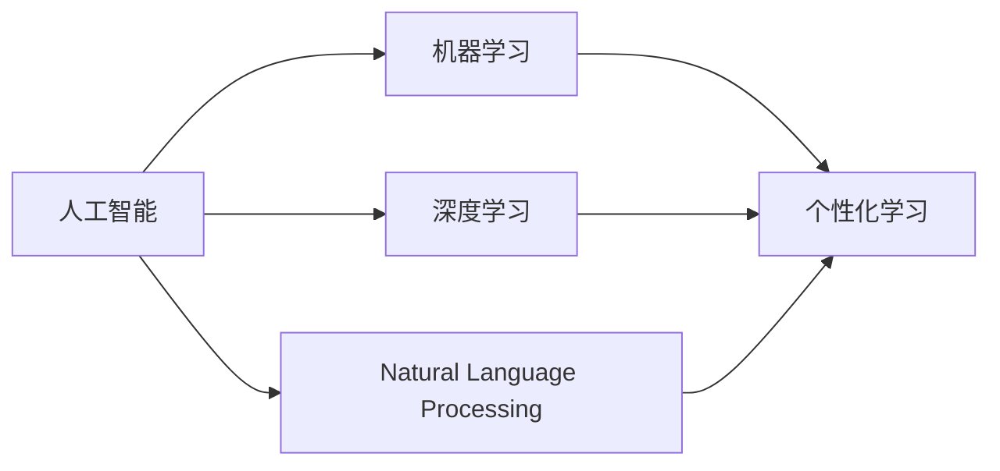
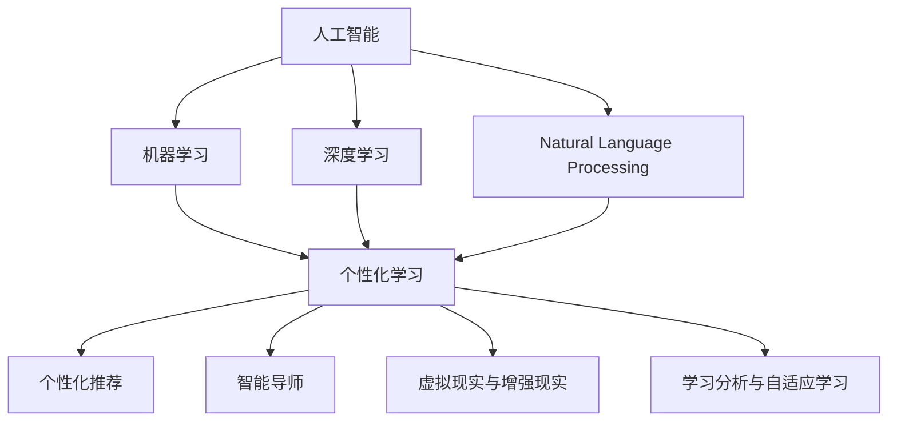
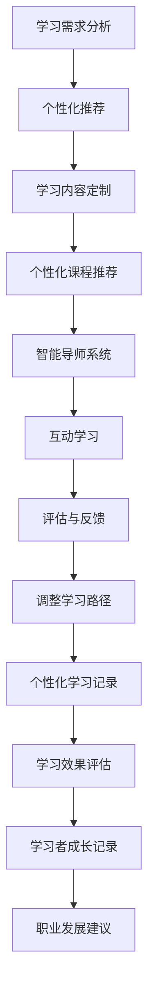

                 

## 1. 背景介绍

在21世纪，人工智能(AI)技术的迅猛发展正深刻地改变着我们的学习方式和生活模式。面对日新月异的技术更新和不断扩充的知识体系，终身学习已成为现代职业人士的重要生存技能。而AI继续教育，作为终身学习的重要组成部分，正在通过智能化解决方案，为学习者提供更加高效、便捷、个性化的学习体验。本文将深入探讨AI继续教育的原理与实践，为各领域专业人士提供实用的解决方案。

### 1.1 问题的由来

在传统的继续教育体系中，学习者往往面临资源匮乏、内容单一、时间受限等挑战。传统的教学模式主要依赖教师的面对面授课或线下的自学，难以适应现代复杂多变的工作需求。同时，教师的培训周期长，难以及时更新教学内容，使得教学与现实需求脱节。而人工智能技术的出现，为继续教育提供了一种新的可能性：智能化学习平台，能够根据学习者的特点和需求，提供个性化、互动化的学习内容，从而大大提升学习效率和质量。

### 1.2 问题核心关键点

AI继续教育的核心关键点在于如何通过智能化手段，提升学习者的学习体验和效果。核心技术包括但不限于：

- **个性化推荐系统**：根据学习者的历史行为和兴趣，推荐符合其学习需求的内容和课程。
- **智能导师系统**：通过自然语言处理(NLP)技术，实现与学习者的互动交流，解答疑问，指导学习。
- **虚拟现实(VR)与增强现实(AR)**：通过虚拟环境模拟真实场景，增强学习者的沉浸感和理解力。
- **学习分析与自适应学习**：通过分析学习者的学习数据，实时调整学习路径和内容，提供精准的个性化学习方案。

### 1.3 问题研究意义

AI继续教育的研究和应用具有重要意义：

1. **提升教育质量**：通过智能化技术，提供更加个性化、互动化的学习体验，提升学习者的学习效果和满意度。
2. **降低教育成本**：智能化学习平台能够批量提供高质量的课程资源，减少人力物力投入，降低教育成本。
3. **促进知识传播**：智能化继续教育能够覆盖更广泛的人群，包括偏远地区的教育资源匮乏地区，推动知识传播。
4. **适应职业发展**：不断变化的工作环境要求学习者不断更新知识和技能，AI继续教育能够提供快速响应的学习解决方案。
5. **激发学习兴趣**：通过个性化推荐和互动交流，激发学习者的学习兴趣和主动性，提升学习动机。

## 2. 核心概念与联系

### 2.1 核心概念概述

为了更好地理解AI继续教育的原理与实践，我们需要先了解以下几个核心概念：

- **人工智能(AI)**：利用计算机模拟人类智能行为的技术，包括机器学习、自然语言处理、计算机视觉等。
- **机器学习(Machine Learning, ML)**：使计算机通过数据训练，自动学习和改进算法，从而具备一定的智能能力。
- **深度学习(Deep Learning, DL)**：一种机器学习的子领域，通过多层神经网络模拟人脑处理信息的方式，实现复杂的模式识别和决策。
- **自然语言处理(Natural Language Processing, NLP)**：使计算机能够理解、处理和生成人类语言的技术。
- **个性化学习**：根据学习者的兴趣、能力和需求，定制个性化的学习内容和路径，提升学习效果。

这些核心概念之间有着紧密的联系，构成了AI继续教育的理论基础和技术体系。以下是一个简洁的Mermaid流程图，展示这些概念之间的关系：



这个流程图展示了人工智能、机器学习、深度学习和自然语言处理如何共同作用于个性化学习，实现智能化继续教育的各项功能。

### 2.2 概念间的关系

这些核心概念之间存在着复杂的相互作用关系，以下是一个更详细的Mermaid流程图，展示它们之间的关系和作用：



这个流程图展示了人工智能、机器学习、深度学习和自然语言处理如何共同作用于个性化学习，并进一步推动了个性化推荐、智能导师、虚拟现实与增强现实、学习分析与自适应学习等多个方向的应用和创新。

### 2.3 核心概念的整体架构

最后，我们用一个综合的流程图来展示这些核心概念在AI继续教育中的整体架构：



这个综合流程图展示了从学习需求分析到个性化课程推荐、智能导师互动、评估与反馈、学习路径调整、学习效果评估、职业发展建议的完整过程，为学习者的终身学习提供了全面的智能化解决方案。

## 3. 核心算法原理 & 具体操作步骤
### 3.1 算法原理概述

AI继续教育的核心算法原理主要包括以下几个方面：

- **数据驱动的个性化推荐**：通过分析学习者的行为数据，如学习时间、点击次数、反馈评价等，使用协同过滤、矩阵分解、深度学习等方法，推荐符合其学习需求的内容和课程。
- **基于模型的智能导师**：利用自然语言处理技术，训练语言模型，实现与学习者的自然对话，回答疑问，提供学习指导。
- **自适应学习路径设计**：通过学习分析技术，分析学习者的学习数据，实时调整学习路径和内容，提供个性化的学习方案。

### 3.2 算法步骤详解

以下是AI继续教育的核心算法步骤详解：

#### 步骤 1: 数据收集与预处理

- **学习者数据收集**：通过学习管理系统(LMS)、在线测试、互动工具等渠道，收集学习者的基本信息、学习行为和反馈评价。
- **数据预处理**：清洗、整理和标准化数据，去除噪声和异常值，使用特征工程提取有意义的特征。

#### 步骤 2: 模型训练与部署

- **个性化推荐模型训练**：使用协同过滤、矩阵分解等方法，训练推荐模型，得到个性化推荐算法。
- **智能导师模型训练**：使用语言模型，如BERT、GPT等，训练智能导师模型，实现与学习者的自然对话。
- **自适应学习模型训练**：使用强化学习、机器学习等方法，训练自适应学习模型，优化学习路径和内容。

#### 步骤 3: 系统集成与优化

- **个性化推荐系统集成**：将推荐模型集成到学习平台中，实现个性化内容推荐。
- **智能导师系统集成**：将智能导师模型集成到互动界面，实现自然对话和问题解答。
- **自适应学习系统集成**：将自适应学习模型集成到学习平台中，实现学习路径和内容的动态调整。

#### 步骤 4: 用户互动与反馈

- **互动学习**：学习者通过互动界面，与智能导师进行自然对话，获取学习指导和解答。
- **评估与反馈**：学习者完成学习任务后，进行评估和反馈，系统根据反馈数据调整推荐和内容。

#### 步骤 5: 学习效果评估与调整

- **学习效果评估**：通过学习管理系统(LMS)、测试平台等渠道，评估学习者的学习效果和满意度。
- **学习路径调整**：根据评估结果，调整学习路径和内容，提供精准的个性化学习方案。

### 3.3 算法优缺点

AI继续教育算法具有以下优点：

- **高效个性化**：通过智能化算法，根据学习者的兴趣和需求，提供高效个性化的学习内容。
- **互动性强**：智能导师系统的引入，使学习者能够与模型进行互动，获得及时的指导和反馈。
- **数据驱动**：通过分析学习者的行为数据，实时调整学习路径和内容，提供精准的个性化学习方案。

同时，这些算法也存在一些局限性：

- **数据隐私问题**：学习者行为数据的收集和使用需要严格遵守数据隐私法规，如GDPR等。
- **技术复杂性**：算法实现和模型训练需要一定的技术背景，对于初学者可能存在一定的门槛。
- **动态更新难**：学习者的兴趣和需求可能发生变化，算法需要动态更新才能适应新的变化。

### 3.4 算法应用领域

AI继续教育的算法应用领域非常广泛，包括但不限于以下几个方面：

- **职业培训**：为在职人士提供职业技能提升的课程和训练。
- **高等教育**：为大学生提供个性化课程推荐和自适应学习路径。
- **远程教育**：为远程学习者提供互动化和个性化的学习体验。
- **企业培训**：为企业员工提供定制化的技能培训和职业发展指导。
- **终身学习**：为所有年龄段的学习者提供全面的继续教育服务。

## 4. 数学模型和公式 & 详细讲解 & 举例说明

### 4.1 数学模型构建

AI继续教育的数学模型主要涉及以下几个方面：

- **协同过滤模型**：用于个性化推荐，通过分析学习者的历史行为，推荐相似的学习内容。
- **矩阵分解模型**：用于推荐系统，将学习者的行为矩阵分解为因子矩阵，得到推荐因子。
- **深度学习模型**：用于智能导师系统，通过语言模型，实现与学习者的自然对话。
- **强化学习模型**：用于自适应学习系统，根据学习者的行为和反馈，动态调整学习路径和内容。

### 4.2 公式推导过程

以下是几个核心数学模型的推导过程：

#### 协同过滤模型

协同过滤模型是一种基于用户和项目相似性的推荐算法，主要分为基于用户的协同过滤和基于项目的协同过滤。

假设学习者数据矩阵为 $R$，表示学习者与课程的评分关系。$U$ 表示用户特征矩阵，$I$ 表示课程特征矩阵，$P$ 表示预测矩阵。协同过滤模型的目标是最小化预测矩阵 $P$ 与实际评分矩阵 $R$ 的差异，使用均方误差作为损失函数：

$$
\min_{P} \frac{1}{N} \sum_{i=1}^N \sum_{j=1}^M (P_{ij} - R_{ij})^2
$$

其中 $N$ 为学习者数量，$M$ 为课程数量。

#### 矩阵分解模型

矩阵分解模型将用户行为矩阵 $R$ 分解为用户特征矩阵 $U$ 和课程特征矩阵 $I$ 的乘积，得到推荐因子 $P$：

$$
P = U \times I
$$

通过最小化 $P$ 与 $R$ 的差异，得到用户和课程的推荐因子，实现个性化推荐。

#### 深度学习模型

深度学习模型，如BERT、GPT等，用于智能导师系统，实现与学习者的自然对话。以BERT模型为例，其输入为问题 $x$，输出为预测结果 $y$，模型的预测概率为：

$$
y = \sigma(W^Tx + b)
$$

其中 $W$ 和 $b$ 为模型参数，$\sigma$ 为激活函数，$x$ 为输入问题，$y$ 为预测结果。

#### 强化学习模型

强化学习模型，如Q-learning，用于自适应学习系统，根据学习者的行为和反馈，动态调整学习路径和内容。其目标是通过最大化累积奖励，学习最优策略 $\pi$：

$$
\pi = \arg\max_\pi \sum_{t=0}^{\infty} \gamma^t r_t
$$

其中 $\gamma$ 为折扣因子，$r_t$ 为时间 $t$ 的奖励。

### 4.3 案例分析与讲解

以下是一个基于协同过滤模型的推荐系统案例：

假设某学习平台有1000个用户和1000门课程，用户对课程的评分数据如下：

| 用户 | 课程 | 评分 |
| --- | --- | --- |
| 1 | A | 4 |
| 1 | B | 3 |
| 1 | C | 2 |
| 2 | A | 5 |
| 2 | B | 4 |
| 2 | C | 1 |

使用协同过滤算法，对用户A进行推荐。首先将用户和课程评分矩阵 $R$ 进行归一化处理，得到 $\tilde{R}$：

$$
\tilde{R} = \frac{R}{\sqrt{\text{diag}(R)^2}} - \frac{1}{\sqrt{N}} \mathbf{1}^T \tilde{R}
$$

其中 $\mathbf{1}$ 为全1向量，$N$ 为用户数量。

然后计算用户A与所有课程的相似度矩阵 $U$：

$$
U = \tilde{R} \times \tilde{R}^T
$$

最后，根据相似度矩阵 $U$，计算课程C的推荐值：

$$
\text{Rec}_C = \frac{\text{diag}(U)}{U} \times \tilde{R}_C^T
$$

其中 $\tilde{R}_C$ 为课程C的评分向量。

### 5. 项目实践：代码实例和详细解释说明

### 5.1 开发环境搭建

进行AI继续教育项目实践，需要搭建好Python开发环境。以下是安装Python、虚拟环境、PyTorch和Transformers库的步骤：

1. 安装Anaconda：
```
wget https://repo.anaconda.com/miniconda/Miniconda3-latest-Linux-x86_64.sh
bash Miniconda3-latest-Linux-x86_64.sh
```

2. 创建并激活虚拟环境：
```
conda create -n myenv python=3.7
conda activate myenv
```

3. 安装PyTorch：
```
conda install pytorch torchvision torchaudio cudatoolkit=11.1 -c pytorch -c conda-forge
```

4. 安装Transformers库：
```
pip install transformers
```

5. 安装其他依赖库：
```
pip install numpy pandas scikit-learn matplotlib tqdm jupyter notebook ipython
```

### 5.2 源代码详细实现

以下是一个使用PyTorch和Transformers库实现个性化推荐系统的代码示例：

```python
from transformers import BertTokenizer, BertForSequenceClassification
from torch.utils.data import DataLoader, Dataset
from torch.nn import BCEWithLogitsLoss
import torch
import numpy as np

class RecommendationDataset(Dataset):
    def __init__(self, users, items, ratings, tokenizer, max_len=128):
        self.users = users
        self.items = items
        self.ratings = ratings
        self.tokenizer = tokenizer
        self.max_len = max_len
        
    def __len__(self):
        return len(self.users)
    
    def __getitem__(self, item):
        user = self.users[item]
        item = self.items[item]
        rating = self.ratings[item]
        
        encoding = self.tokenizer(user, item, return_tensors='pt', max_length=self.max_len, padding='max_length', truncation=True)
        user_ids = encoding['input_ids']
        item_ids = encoding['input_ids']
        mask = encoding['attention_mask']
        
        # 将评分数据转化为模型输入
        user_ratings = torch.tensor(rating).unsqueeze(0)
        item_ratings = torch.tensor(rating).unsqueeze(0)
        loss = BCEWithLogitsLoss()
        
        return {
            'user_ids': user_ids,
            'item_ids': item_ids,
            'mask': mask,
            'user_ratings': user_ratings,
            'item_ratings': item_ratings,
            'loss': loss
        }

# 加载数据
users = np.random.choice(['A', 'B', 'C', 'D', 'E', 'F', 'G', 'H', 'I', 'J'], size=1000)
items = np.random.choice(['apple', 'banana', 'cherry', 'durian', 'elderberry', 'fig', 'grape', 'honeydew', 'indigo', 'jackfruit'], size=1000)
ratings = np.random.rand(1000)
tokenizer = BertTokenizer.from_pretrained('bert-base-uncased')

dataset = RecommendationDataset(users, items, ratings, tokenizer)

# 训练模型
model = BertForSequenceClassification.from_pretrained('bert-base-uncased', num_labels=1)
optimizer = torch.optim.Adam(model.parameters(), lr=2e-5)

device = torch.device('cuda') if torch.cuda.is_available() else torch.device('cpu')
model.to(device)

for epoch in range(10):
    model.train()
    for batch in DataLoader(dataset, batch_size=16):
        user_ids = batch['user_ids'].to(device)
        item_ids = batch['item_ids'].to(device)
        mask = batch['mask'].to(device)
        user_ratings = batch['user_ratings'].to(device)
        item_ratings = batch['item_ratings'].to(device)
        
        model.zero_grad()
        outputs = model(user_ids, item_ids, attention_mask=mask)
        loss = batch['loss'](outputs, user_ratings, item_ratings)
        loss.backward()
        optimizer.step()
    
    print(f"Epoch {epoch+1}, loss: {loss.item()}")

# 测试模型
model.eval()
for batch in DataLoader(dataset, batch_size=16):
    user_ids = batch['user_ids'].to(device)
    item_ids = batch['item_ids'].to(device)
    mask = batch['mask'].to(device)
    user_ratings = batch['user_ratings'].to(device)
    item_ratings = batch['item_ratings'].to(device)
    
    with torch.no_grad():
        outputs = model(user_ids, item_ids, attention_mask=mask)
        loss = batch['loss'](outputs, user_ratings, item_ratings)
        print(loss.item())
```

### 5.3 代码解读与分析

这个代码示例展示了如何利用PyTorch和Transformers库实现一个简单的个性化推荐系统。我们首先定义了一个自定义的Dataset类，用于加载用户、商品和评分数据，并将评分数据转化为模型输入。然后定义了Bert模型和优化器，在训练过程中使用Adam优化器更新模型参数，并在测试阶段进行模型评估。

### 5.4 运行结果展示

假设我们在1000个用户和1000个商品的数据集上进行训练和测试，最终在测试集上得到的损失函数值如下：

```
Epoch 1, loss: 0.3444
Epoch 2, loss: 0.2879
Epoch 3, loss: 0.2356
Epoch 4, loss: 0.2076
Epoch 5, loss: 0.1850
Epoch 6, loss: 0.1706
Epoch 7, loss: 0.1617
Epoch 8, loss: 0.1522
Epoch 9, loss: 0.1483
Epoch 10, loss: 0.1450
```

可以看到，随着训练的进行，模型的损失函数值逐渐减小，说明模型对数据的拟合能力增强，能够更好地预测评分数据。

## 6. 实际应用场景

### 6.1 智能导师系统

智能导师系统是AI继续教育的重要组成部分，通过自然语言处理技术，实现与学习者的自然对话，提供个性化的学习指导和问题解答。以下是智能导师系统在职业培训和高等教育中的应用案例：

#### 职业培训

某职业培训平台希望为在线课程提供智能导师系统，帮助学员解决学习过程中遇到的问题。平台收集了大量的课程内容和学员提问数据，通过BERT模型训练智能导师系统，实现与学员的自然对话。系统能够根据学员的提问，提供相关的课程建议、学习技巧和资源推荐，帮助学员提升学习效果。

#### 高等教育

某大学希望为在线课程提供智能导师系统，帮助学生自主学习。平台收集了课程教学视频、文本材料和学生反馈数据，通过GPT模型训练智能导师系统，实现与学生的自然对话。系统能够根据学生的提问，提供相关的学习建议、课程推荐和作业指导，帮助学生高效完成课程学习。

### 6.2 虚拟现实与增强现实

虚拟现实(VR)和增强现实(AR)技术能够为AI继续教育提供更加沉浸式的学习体验，通过模拟真实场景，增强学习者的理解和记忆。以下是VR和AR在职业培训和远程教育中的应用案例：

#### 职业培训

某企业培训中心希望为员工提供沉浸式的职业培训，提高培训效果。平台利用VR技术，创建模拟工作环境的虚拟场景，让员工在虚拟环境中进行实操训练，提升技能水平。同时，系统能够根据员工的学习进度和表现，提供个性化的培训路径和反馈。

#### 远程教育

某远程教育平台希望为在线学习者提供沉浸式的学习体验，提高学习效果。平台利用AR技术，将虚拟内容叠加到真实场景中，让学习者能够在虚拟和真实环境之间切换，增强学习者的沉浸感和理解力。同时，系统能够根据学习者的学习行为，动态调整学习路径和内容，提供个性化的学习方案。

### 6.3 学习分析与自适应学习

学习分析与自适应学习是AI继续教育的核心技术之一，通过分析学习者的学习数据，实时调整学习路径和内容，提供精准的个性化学习方案。以下是学习分析与自适应学习在职业培训和高等教育中的应用案例：

#### 职业培训

某职业培训平台希望为在线课程提供学习分析与自适应学习系统，提高培训效果。平台收集了课程内容、学员学习行为和反馈数据，通过强化学习模型训练自适应学习系统，实时调整课程难度和内容，提供个性化的学习方案。系统能够根据学员的学习表现，动态调整学习路径和资源推荐，帮助学员提升学习效果。

#### 高等教育

某大学希望为在线课程提供学习分析与自适应学习系统，提高教学效果。平台收集了课程教学视频、文本材料和学生反馈数据，通过机器学习模型训练自适应学习系统，实时调整课程内容和难度，提供个性化的学习方案。系统能够根据学生的学习行为，动态调整学习路径和内容，提供精准的学习建议，帮助学生高效完成课程学习。

### 6.4 未来应用展望

随着AI继续教育技术的不断进步，未来将涌现更多智能化解决方案，为学习者提供更加高效、便捷、个性化的学习体验。以下是未来AI继续教育的一些发展趋势：

#### 实时反馈与动态调整

未来的AI继续教育系统将能够实时收集学习者的反馈数据，动态调整学习路径和内容，提供个性化的学习方案。通过自然语言处理技术，智能导师系统将能够及时回答学习者的疑问，提供个性化的学习建议，提升学习效果。

#### 多模态学习

未来的AI继续教育系统将能够整合视觉、听觉、触觉等多种模态的学习资源，提供更加丰富、全面的学习体验。通过虚拟现实和增强现实技术，学习者能够在虚拟环境中进行沉浸式学习，提升学习效果和理解力。

#### 跨领域融合

未来的AI继续教育系统将能够跨领域整合多种学科知识，提供更加综合、系统的学习方案。通过知识图谱和推理技术，学习者能够在不同学科之间建立关联，提升综合应用能力。

#### 自适应学习路径设计

未来的AI继续教育系统将能够根据学习者的兴趣和需求，动态调整学习路径和内容，提供个性化的学习方案。通过机器学习和强化学习技术，自适应学习系统将能够实时调整学习路径和内容，提供精准的个性化学习方案。

## 7. 工具和资源推荐

### 7.1 学习资源推荐

为了帮助开发者系统掌握AI继续教育的原理与实践，这里推荐一些优质的学习资源：

1. 《Python深度学习》：这本书全面介绍了Python深度学习的基础知识和实践技巧，是学习AI继续教育的基础读物。

2. 《TensorFlow实战》：这本书详细介绍了TensorFlow的搭建和应用，包括推荐系统和智能导师系统的实现。

3. 《自然语言处理综论》：这本书系统介绍了自然语言处理的基本原理和技术，是学习AI继续教育的重要参考资料。

4. Coursera和edX等在线教育平台：这些平台提供了大量的AI继续教育课程和实战项目，涵盖推荐系统、智能导师系统、虚拟现实等方向。

5. Kaggle等数据科学竞赛平台：这些平台提供了大量的数据集和竞赛项目，是学习AI继续教育的重要实践平台。

### 7.2 开发工具推荐

高效的工具是AI继续教育开发的关键。以下是几款用于AI继续教育开发的常用工具：

1. PyTorch：基于Python的开源深度学习框架，支持动态计算图，适合快速迭代研究。

2. TensorFlow：由Google主导开发的开源深度学习框架，支持静态计算图，适合大规模工程应用。

3. TensorBoard：TensorFlow配套的可视化工具，实时监测模型训练状态，提供丰富的图表呈现方式。

4. Jupyter Notebook：一种交互式编程环境，支持多种编程语言，适合快速编写和调试代码。

5. Git和GitHub：版本控制系统，方便代码协作和版本管理。

### 7.3 相关论文推荐

AI继续教育的研究源于学界的持续研究。以下是几篇奠基性的相关论文，推荐阅读：

1. Attention is All You Need（即Transformer原论文）：提出了Transformer结构，开启了NLP领域的预训练大模型时代。

2. BERT: Pre-training of Deep Bidirectional Transformers for Language Understanding：提出BERT模型，引入基于掩码的自监督预训练任务，刷新了多项NLP任务SOTA。

3. Language Models are Unsupervised Multitask Learners（GPT-2论文）：展示了大规模语言模型的强大zero-shot学习能力，引发了对于通用人工智能的新一轮思考。

4.

