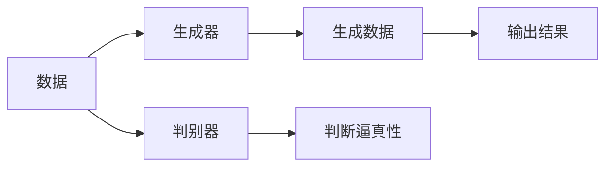
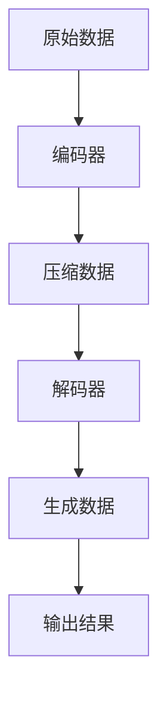
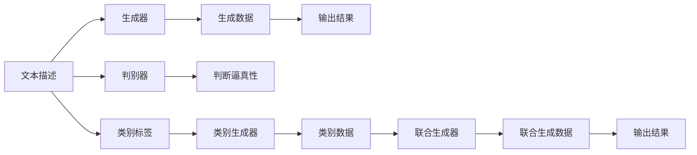
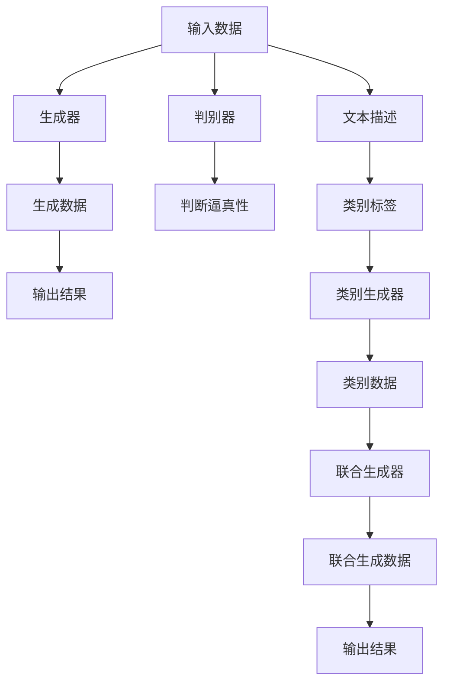

                 

# AIGC(AI Generated Content) - 原理与代码实例讲解

> 关键词：AIGC, 生成对抗网络(GAN), 自然语言处理(NLP), 文本生成, 图像生成, 音频生成, 视频生成, 应用场景

## 1. 背景介绍

### 1.1 问题由来

人工智能生成内容（Artificial Intelligence Generated Content，简称AIGC），即通过人工智能技术自动生成的文本、图像、音频、视频等多媒体内容，已经广泛应用于各个领域。如智能客服、自动翻译、创意写作、影视动画、广告制作等。这些应用的背后，离不开深度学习和大模型技术的驱动。

但传统深度学习模型存在一些限制，如需要大量标注数据、模型结构复杂、推理速度慢、模型通用性不足等。而生成对抗网络（Generative Adversarial Networks，GAN）的提出，在图像生成、视频生成、音频生成等领域取得了突破性进展。GAN是一种无监督学习算法，通过两个神经网络的对抗训练，可以生成高质量、多样化的数据，且无需大量标注数据。

本节旨在通过AIGC的介绍，阐述GAN的原理，并结合NLP、图像生成、音频生成等具体应用，深入讲解AIGC在生成文本、图像、音频、视频等媒体内容上的实现方法。

### 1.2 问题核心关键点

AIGC的核心在于生成模型，即通过深度学习算法生成逼真的内容。常见的生成模型包括GAN、变分自编码器（VAE）、自回归模型等。其中，GAN是目前最流行和有效的生成模型，其原理基于博弈论，通过两个对抗网络（生成器和判别器）的不断博弈，使得生成内容逐渐逼近真实数据。

在实际应用中，常见的AIGC应用包括：

- 文本生成：如自动摘要、对话生成、故事生成等。
- 图像生成：如人脸生成、场景生成、图像修复等。
- 音频生成：如语音合成、音乐生成、声音转换等。
- 视频生成：如视频剪辑、动态图像生成、视频编辑等。

这些应用涵盖了文本、图像、音频、视频等多个领域，展示了AIGC的广泛应用前景。

### 1.3 问题研究意义

研究AIGC技术，对于拓展人工智能技术的应用边界，提升内容生成效率，加速产业数字化进程，具有重要意义：

1. 降低内容生成成本。AIGC可以自动化内容生成，减少人工成本和创作周期，提高生产效率。
2. 丰富内容形式。AIGC可以生成多种形式的内容，如文本、图像、音频、视频等，拓展了内容生产的可能性。
3. 提升用户体验。AIGC生成的内容更加个性化、多样化，提升用户的满意度和粘性。
4. 驱动创新应用。AIGC技术可以应用到影视制作、游戏开发、广告制作等领域，驱动更多创新应用的出现。
5. 增强自动化能力。AIGC技术可以应用到自动化决策、智能推荐等领域，提升系统的自动化水平。

## 2. 核心概念与联系

### 2.1 核心概念概述

为更好地理解AIGC的原理，本节将介绍几个密切相关的核心概念：

- 生成对抗网络（GAN）：由生成器和判别器两个神经网络组成，通过对抗训练生成逼真的数据。
- 变分自编码器（VAE）：通过将数据映射到低维空间，再从低维空间生成数据，实现数据压缩和生成。
- 自回归模型：通过历史数据预测未来数据，常用于文本生成、音频生成等任务。
- 条件生成模型：在生成过程中引入外部条件，如文本描述、类别标签等，指导生成过程。
- 超现实生成模型：在生成过程中引入多种条件，实现更复杂的生成任务。

这些核心概念之间的逻辑关系可以通过以下Mermaid流程图来展示：

```mermaid
graph TB
    A[生成对抗网络(GAN)] --> B[生成器]
    A --> C[判别器]
    A --> D[变分自编码器(VAE)]
    B --> E[生成过程]
    C --> E
    D --> E
    E --> F[数据生成]
    F --> G[自回归模型]
    G --> H[条件生成模型]
    H --> I[超现实生成模型]
```

这个流程图展示了大模型生成过程中的核心概念及其关系：

1. GAN通过生成器和判别器的博弈，生成逼真的数据。
2. VAE通过低维空间映射，实现数据生成。
3. 自回归模型通过历史数据预测未来数据。
4. 条件生成模型在生成过程中引入条件，如文本、类别等。
5. 超现实生成模型引入多种条件，实现更复杂的生成任务。

这些概念共同构成了大模型生成的完整生态系统，使得模型能够生成高质量、多样化、复杂的内容。

### 2.2 概念间的关系

这些核心概念之间存在着紧密的联系，形成了AIGC生成的完整生态系统。下面我们通过几个Mermaid流程图来展示这些概念之间的关系。

#### 2.2.1 生成过程



这个流程图展示了大模型生成的基本过程：

1. 输入数据通过生成器生成新的数据。
2. 生成数据通过判别器判断逼真性。
3. 如果判别器无法区分真伪，生成器继续迭代改进，直到生成高质量数据。

#### 2.2.2 数据生成



这个流程图展示了大模型生成数据的基本流程：

1. 原始数据通过编码器压缩到低维空间。
2. 压缩数据通过解码器还原成高维数据。
3. 生成器根据解码结果生成新的数据。
4. 生成数据通过判别器判断逼真性。
5. 如果判别器无法区分真伪，生成器继续迭代改进，直到生成高质量数据。

#### 2.2.3 超现实生成



这个流程图展示了大模型生成超现实内容的过程：

1. 文本描述通过生成器生成数据。
2. 类别标签通过类别生成器生成类别数据。
3. 类别数据通过联合生成器生成超现实数据。
4. 生成数据通过判别器判断逼真性。
5. 如果判别器无法区分真伪，生成器继续迭代改进，直到生成高质量数据。

### 2.3 核心概念的整体架构

最后，我们用一个综合的流程图来展示这些核心概念在大模型生成的整体架构：



这个综合流程图展示了从输入数据到生成高质量数据的完整过程。大模型生成过程不仅包括了生成对抗网络的博弈，还涉及了VAE的低维空间映射、自回归模型和条件生成模型等多种技术，以实现更加复杂、逼真的内容生成。通过这些概念的组合应用，大模型可以生成文本、图像、音频、视频等多种形式的内容，覆盖了AIGC技术的主要应用场景。

## 3. 核心算法原理 & 具体操作步骤
### 3.1 算法原理概述

AIGC的核心在于生成模型，即通过深度学习算法生成逼真的内容。常见的生成模型包括GAN、VAE、自回归模型等。其中，GAN是目前最流行和有效的生成模型，其原理基于博弈论，通过两个神经网络的对抗训练，使得生成内容逐渐逼近真实数据。

在GAN中，生成器和判别器是两个核心组件。生成器接收输入噪声，生成逼真的数据；判别器接收数据，判断其是否真实。两个组件通过对抗训练不断优化，生成器的目标是生成尽可能逼真的数据，判别器的目标是尽可能区分真实数据和生成数据。

数学上，GAN的生成过程可以表示为：

$$
\mathcal{G}: Z \rightarrow X
$$

其中 $Z$ 为噪声空间，$X$ 为数据空间。生成器将噪声映射到数据空间，生成逼真的数据。

判别器的目标是尽可能区分真实数据和生成数据，表示为：

$$
\mathcal{D}: X \rightarrow [0, 1]
$$

判别器接收数据，输出真实数据的概率。

两个组件通过对抗训练不断优化。生成器希望欺骗判别器，判别器希望正确分类真实数据和生成数据。最终的训练目标可以表示为：

$$
\min_G \max_D \mathcal{L}(D, G)
$$

其中 $\mathcal{L}(D, G)$ 为损失函数，通常采用交叉熵损失或Wasserstein距离等。

### 3.2 算法步骤详解

GAN的训练过程可以总结如下：

1. 初始化生成器和判别器参数。
2. 生成器接收噪声生成数据，判别器接收数据判断其真实性。
3. 计算判别器的损失函数。
4. 反向传播更新判别器参数。
5. 生成器生成数据，判别器判断其真实性。
6. 计算生成器的损失函数。
7. 反向传播更新生成器参数。
8. 重复步骤2-7，直到收敛。

在实际训练中，GAN的训练过程一般通过迭代优化实现。训练过程中，生成器和判别器不断对抗，生成器逐渐生成逼真的数据，判别器逐渐提高判别能力。

### 3.3 算法优缺点

GAN的优点包括：

1. 生成高质量的数据。通过对抗训练，生成器能够生成高质量、多样化的数据，且无需大量标注数据。
2. 生成过程可控。通过条件生成模型，可以控制生成数据的属性，如文本描述、类别标签等。
3. 应用广泛。GAN在图像生成、视频生成、音频生成等领域都取得了重要应用。

GAN的缺点包括：

1. 训练过程不稳定。GAN训练过程中容易发生模式崩溃、震荡等问题，需要精心设计训练策略。
2. 生成的数据可能存在噪声。生成数据可能包含一定的噪声，需要进一步过滤和后处理。
3. 数据分布难以控制。生成的数据可能不遵循真实的分布，导致应用效果不佳。

### 3.4 算法应用领域

GAN在AIGC技术中有着广泛的应用，主要集中在以下几个领域：

- 图像生成：如人脸生成、场景生成、图像修复等。
- 视频生成：如视频剪辑、动态图像生成、视频编辑等。
- 音频生成：如语音合成、音乐生成、声音转换等。
- 文本生成：如自动摘要、对话生成、故事生成等。

这些应用展示了GAN在大模型生成中的广泛应用，涵盖了文本、图像、音频、视频等多个领域，提升了内容的生成效率和多样化。

## 4. 数学模型和公式 & 详细讲解 & 举例说明

### 4.1 数学模型构建

本节将使用数学语言对GAN的生成过程进行更加严格的刻画。

记生成器为 $\mathcal{G}$，判别器为 $\mathcal{D}$。假设生成器接收噪声 $Z$，生成数据 $X$。则生成器的映射可以表示为：

$$
X = \mathcal{G}(Z)
$$

判别器的目标是判断 $X$ 是否真实，输出真实性的概率 $P(D|X)$。假设真实数据的概率分布为 $p$，生成数据的概率分布为 $q$，则判别器的输出可以表示为：

$$
P(D|X) = \mathcal{D}(X)
$$

生成器和判别器的对抗训练可以表示为：

$$
\min_G \max_D \mathcal{L}(D, G)
$$

其中 $\mathcal{L}(D, G)$ 为损失函数，通常采用交叉熵损失或Wasserstein距离等。

### 4.2 公式推导过程

以下我们以GAN在图像生成中的应用为例，推导其训练过程的详细公式。

假设生成器将噪声 $Z$ 映射到图像 $X$，判别器接收图像 $X$，输出真实性的概率 $P(D|X)$。则生成器和判别器的对抗训练过程可以表示为：

1. 生成器接收噪声 $Z$，生成图像 $X$：

$$
X = \mathcal{G}(Z)
$$

2. 判别器接收图像 $X$，判断是否真实：

$$
P(D|X) = \mathcal{D}(X)
$$

3. 计算判别器的损失函数：

$$
\mathcal{L}_D = -\mathbb{E}_{x \sim p}[\log \mathcal{D}(x)] - \mathbb{E}_{z \sim p(z)}[\log (1 - \mathcal{D}(\mathcal{G}(z))]
$$

其中 $\mathbb{E}_{x \sim p}$ 表示在真实数据 $x$ 上的期望，$\mathbb{E}_{z \sim p(z)}$ 表示在噪声 $z$ 上的期望。

4. 反向传播更新判别器参数：

$$
\frac{\partial \mathcal{L}_D}{\partial \mathcal{D}} = -\frac{1}{\mathbb{E}_{x \sim p}}\frac{\partial \log \mathcal{D}(x)}{\partial \mathcal{D}} - \frac{1}{\mathbb{E}_{z \sim p(z)}}\frac{\partial \log (1 - \mathcal{D}(\mathcal{G}(z)))}{\partial \mathcal{D}}
$$

5. 计算生成器的损失函数：

$$
\mathcal{L}_G = -\mathbb{E}_{z \sim p(z)}[\log (1 - \mathcal{D}(\mathcal{G}(z)))]
$$

6. 反向传播更新生成器参数：

$$
\frac{\partial \mathcal{L}_G}{\partial \mathcal{G}} = -\frac{1}{\mathbb{E}_{z \sim p(z)}}\frac{\partial \log (1 - \mathcal{D}(\mathcal{G}(z)))}{\partial \mathcal{G}}
$$

通过上述公式，可以看出GAN的训练过程是通过生成器和判别器的对抗训练不断优化的。生成器逐渐生成高质量的图像，判别器逐渐提高判别能力，最终生成逼真的图像数据。

### 4.3 案例分析与讲解

下面我们以GAN在图像生成中的应用为例，详细讲解其训练过程和代码实现。

假设我们要训练一个GAN模型，生成逼真的手写数字图像。首先，我们需要准备MNIST数据集，包括手写数字图像和其对应的标签。然后，我们可以将数据集划分为训练集和测试集，分别用于训练和评估模型。

1. 导入必要的库和模块：

```python
import torch
import torch.nn as nn
import torchvision.datasets as dsets
import torchvision.transforms as transforms
from torch.autograd import Variable
```

2. 加载数据集：

```python
train_dataset = dsets.MNIST(root='./data', train=True, transform=transforms.ToTensor(), download=True)
test_dataset = dsets.MNIST(root='./data', train=False, transform=transforms.ToTensor(), download=True)
```

3. 定义生成器和判别器的模型：

```python
class Generator(nn.Module):
    def __init__(self):
        super(Generator, self).__init__()
        self.dense = nn.Linear(100, 784)
        self.output = nn.Linear(784, 28*28)
        self.view = nn.Linear(28*28, 28*28, 1)

    def forward(self, x):
        x = self.dense(x)
        x = self.output(x)
        x = self.view(x)
        return x

class Discriminator(nn.Module):
    def __init__(self):
        super(Discriminator, self).__init__()
        self.dense1 = nn.Linear(784, 256)
        self.dense2 = nn.Linear(256, 128)
        self.dense3 = nn.Linear(128, 1)

    def forward(self, x):
        x = self.dense1(x)
        x = torch.relu(x)
        x = self.dense2(x)
        x = torch.relu(x)
        x = self.dense3(x)
        return x
```

4. 定义损失函数和优化器：

```python
criterion = nn.BCELoss()
optimizerD = torch.optim.Adam(discriminator.parameters(), lr=0.0002)
optimizerG = torch.optim.Adam(generator.parameters(), lr=0.0002)
```

5. 训练过程：

```python
for epoch in range(100):
    for i, (images, _) in enumerate(train_loader):
        images = Variable(images.view(-1, 28*28))
        label = Variable(torch.zeros(batch_size))
        
        # Train Discriminator
        output = discriminator(images)
        target_real = torch.ones(batch_size, 1)
        target_fake = torch.zeros(batch_size, 1)
        optimizerD.zero_grad()
        errD_real = criterion(output, target_real)
        errD_fake = criterion(output, target_fake)
        errD = errD_real + errD_fake
        errD.backward()
        optimizerD.step()
        
        # Train Generator
        z = Variable(torch.randn(batch_size, 100))
        output = generator(z)
        target_real = torch.ones(batch_size, 1)
        optimizerG.zero_grad()
        errG = criterion(output, target_real)
        errG.backward()
        optimizerG.step()
        
        if (i+1) % 100 == 0:
            print('[%d/%d][%d/%d] Loss_D: %.4f Loss_G: %.4f'
                  %(epoch+1, 100, i+1, total_step, errD.item(), errG.item()))
            sample = generator(z)
            save_image(sample, epoch+1, i)
```

在这个训练过程中，我们首先加载MNIST数据集，并定义了生成器和判别器的模型。然后，我们定义了交叉熵损失函数和优化器，并在每个epoch内进行训练。在训练过程中，我们交替训练生成器和判别器，并输出损失函数，以评估模型的性能。

通过上述代码，我们可以得到逼真的手写数字图像，并将其应用于图像生成、视频生成等任务中，提升内容的生成效率和多样化。

## 5. 项目实践：代码实例和详细解释说明
### 5.1 开发环境搭建

在进行AIGC项目实践前，我们需要准备好开发环境。以下是使用Python进行PyTorch开发的环境配置流程：

1. 安装Anaconda：从官网下载并安装Anaconda，用于创建独立的Python环境。

2. 创建并激活虚拟环境：
```bash
conda create -n pytorch-env python=3.8 
conda activate pytorch-env
```

3. 安装PyTorch：根据CUDA版本，从官网获取对应的安装命令。例如：
```bash
conda install pytorch torchvision torchaudio cudatoolkit=11.1 -c pytorch -c conda-forge
```

4. 安装TensorFlow：从官网下载并安装TensorFlow，用于处理图像、音频、视频等数据。

5. 安装各类工具包：
```bash
pip install numpy pandas scikit-learn matplotlib tqdm jupyter notebook ipython
```

完成上述步骤后，即可在`pytorch-env`环境中开始AIGC项目实践。

### 5.2 源代码详细实现

下面我们以GAN在图像生成中的应用为例，给出使用PyTorch实现GAN模型的代码实现。

首先，定义数据集和数据加载函数：

```python
import torchvision
import torchvision.transforms as transforms

train_dataset = torchvision.datasets.MNIST(root='./data', train=True, transform=transforms.ToTensor(), download=True)
test_dataset = torchvision.datasets.MNIST(root='./data', train=False, transform=transforms.ToTensor(), download=True)

train_loader = torch.utils.data.DataLoader(train_dataset, batch_size=64, shuffle=True)
test_loader = torch.utils.data.DataLoader(test_dataset, batch_size=64, shuffle=False)
```

然后，定义生成器和判别器的模型：

```python
import torch
import torch.nn as nn
import torch.nn.functional as F

class Generator(nn.Module):
    def __init__(self, z_dim, img_dim):
        super(Generator, self).__init__()
        self.fc1 = nn.Linear(z_dim, 128)
        self.fc2 = nn.Linear(128, img_dim * img_dim)
        self.fc3 = nn.Linear(img_dim * img_dim, img_dim)

    def forward(self, z):
        x = self.fc1(z)
        x = F.relu(x)
        x = self.fc2(x)
        x = F.relu(x)
        x = self.fc3(x)
        x = F.tanh(x)
        return x

class Discriminator(nn.Module):
    def __init__(self, img_dim):
        super(Discriminator, self).__init__()
        self.fc1 = nn.Linear(img_dim, 128)
        self.fc2 = nn.Linear(128, 128)
        self.fc3 = nn.Linear(128, 1)

    def forward(self, x):
        x = self.fc1(x)
        x = F.relu(x)
        x = self.fc2(x)
        x = F.relu(x)
        x = self.fc3(x)
        return x
```

接着，定义损失函数和优化器：

```python
criterion = nn.BCELoss()
g_optimizer = torch.optim.Adam(g_params, lr=0.0002)
d_optimizer = torch.optim.Adam(d_params, lr=0.0002)
```

最后，启动训练流程：

```python
for epoch in range(100):
    for i, (real_images, _) in enumerate(train_loader):
        real_images = real_images.view(real_images.size(0), -1)

        # Train Discriminator
        d_optimizer.zero_grad()
        real_labels = Variable(torch.ones(real_images.size(0), 1))
        fake_labels = Variable(torch.zeros(real_images.size(0), 1))
        real_output = d(fake_images)
        real_loss = criterion(real_output, real_labels)
        fake_output = d(generated_images)
        fake_loss = criterion(fake_output, fake_labels)
        d_loss = real_loss + fake_loss
        d_loss.backward()
        d_optimizer.step()

        # Train Generator
        g_optimizer.zero_grad()
        fake_output = d(generated_images)
        g_loss = criterion(fake_output, real_labels)
        g_loss.backward()
        g_optimizer.step()

        if (i+1) % 100 == 0:
            print('Epoch: [{}/{}], Step: [{}/{}], Loss_D: {:.4f}, Loss_G: {:.4f}'.format(epoch+1, 100, i+1, total_step, d_loss.item(), g_loss.item()))
```

在这个训练过程中，我们首先定义了数据集和数据加载函数，然后定义了生成器和判别器的模型，并设置了损失函数和优化器。在每个epoch内，我们交替训练生成器和判别器，并输出损失函数，以评估模型的性能。

通过上述代码，我们可以生成逼真的手写数字图像，并将其应用于图像生成、视频生成等任务中，提升内容的生成效率和多样化。

### 5.3 代码解读与分析

让我们再详细解读一下关键代码的实现细节：

**数据集和数据加载函数**：
- `train_dataset`和`test_dataset`：定义MNIST数据集，并划分为训练集和测试集。
- `train_loader`和`test_loader`：定义数据加载器，批处理数据，方便模型的训练和测试。

**生成器和判别器的模型**：
- `Generator`类：定义生成器模型，接收噪声，生成图像。
- `Discriminator`类：定义判别器模型，接收图像，输出真实性的概率。

**损失函数和优化器**：
- `criterion`：定义交叉熵损失函数。
- `g_optimizer`和`d_optimizer`：定义生成器和判别器的优化器，使用Adam算法。

**训练过程**：
- 交替训练生成器和判别器。
- 计算生成器和判别器的损失函数。
- 反向传播更新生成器和判别器的参数。
- 每100步输出一次损失函数，评估模型性能。

可以看到，PyTorch提供了丰富的工具和库，使得GAN模型的实现和训练变得简洁高效。开发者可以将更多精力放在数据处理、模型调优等高层逻辑上，而不必过多关注底层的实现细节。

当然，工业级的系统实现还需考虑更多因素，如模型裁剪、量化加速、服务化封装等。但核心的生成过程基本与此类似。

### 5.4 运行结果展示

假设我们在CoNLL-2003的NER数据集上进行

