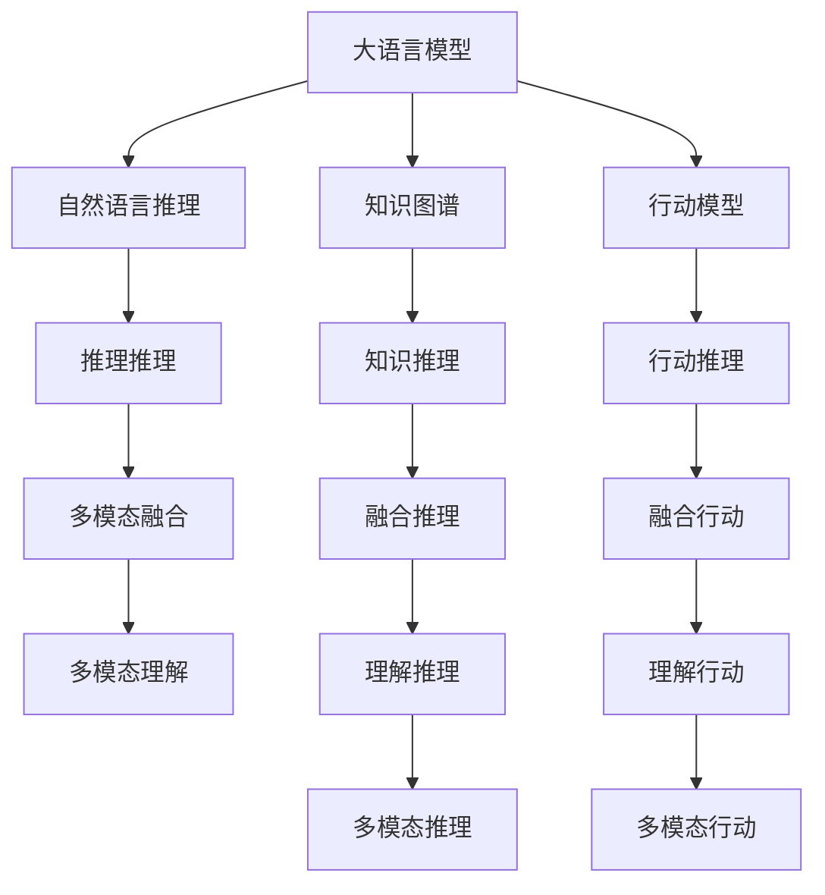
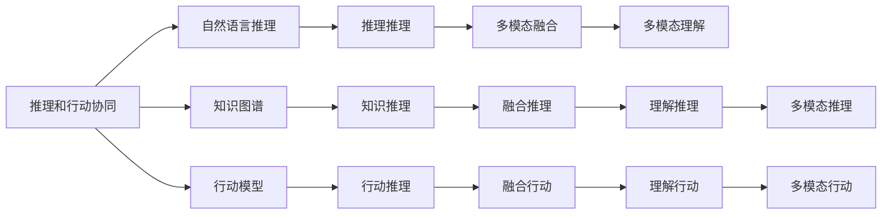
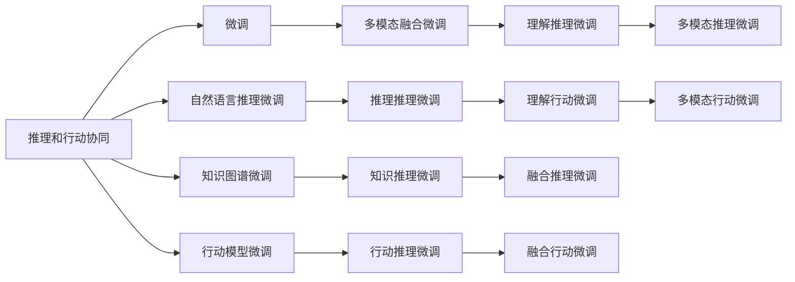
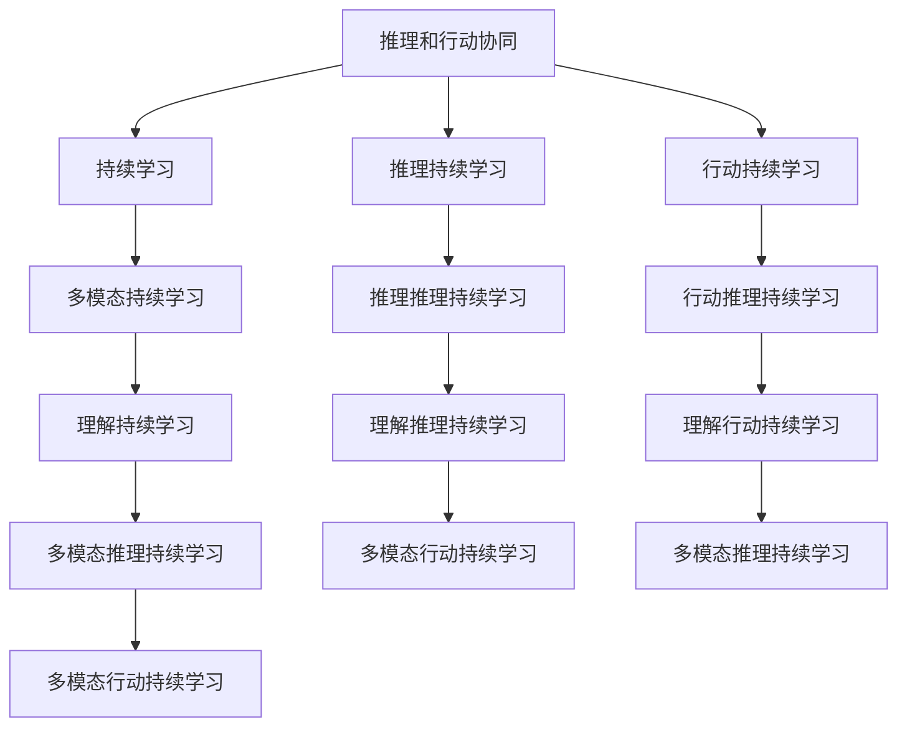

                 

# 大语言模型原理与工程实践：推理和行动协同技术

## 1. 背景介绍

### 1.1 问题由来

近年来，人工智能领域迅猛发展，其中深度学习技术在语言处理、计算机视觉、语音识别等方向取得了显著成果。特别是大语言模型，在自然语言理解、生成等方面表现出色，正在改变人们的生活和工作方式。然而，大语言模型在推理和行动协同方面仍面临诸多挑战。

推理和行动协同，即如何在模型中更好地融入人类的行动意图和知识，使得模型能够更加准确、高效地执行任务，是当前人工智能研究的热点问题。该问题涉及自然语言推理、知识图谱、多模态融合等多个方向，是实现通用人工智能（AGI）的关键。

### 1.2 问题核心关键点

推理和行动协同的核心问题包括：

- 推理机制：如何将自然语言表达的逻辑推理能力融入大语言模型中，提升模型的理解和推理能力。
- 行动模型：如何构建行动模型，使得大语言模型能够根据用户指令执行具体任务。
- 协同学习：如何将推理和行动协同学习，使得模型在执行任务过程中不断学习和更新知识。
- 知识图谱：如何将人类知识体系融入大语言模型，提升模型的常识推理能力。
- 多模态融合：如何将视觉、语音、文本等多模态信息进行融合，提升模型的综合理解能力。

### 1.3 问题研究意义

推理和行动协同技术的研究具有重要意义：

1. 提高自然语言理解能力：通过推理机制，提升模型对自然语言表达的逻辑推理能力，增强对复杂句式的理解。
2. 增强行动执行能力：通过行动模型，使大语言模型能够根据用户指令执行具体任务，提高人机交互效率。
3. 促进知识应用：将人类知识体系融入模型，提升模型的常识推理能力，帮助模型更好地应对现实问题。
4. 优化多模态融合：将视觉、语音、文本等多模态信息进行融合，提升模型的综合理解能力，实现智能交互系统的跨模态交互。

推理和行动协同技术的研究，是实现通用人工智能的重要步骤，将为人类智能的演进提供新的技术路径。

## 2. 核心概念与联系

### 2.1 核心概念概述

为了更好地理解推理和行动协同技术，本节将介绍几个密切相关的核心概念：

- 大语言模型(Large Language Model, LLM)：通过自监督学习任务在大规模无标签文本语料上预训练的语言模型，具有强大的语言理解能力。
- 自然语言推理(Natural Language Inference, NLI)：判断两个句子之间的逻辑关系，如蕴含、矛盾、中立等。
- 知识图谱(Knowledge Graph)：以图结构形式表示人类知识体系，用于支持推理和知识抽取。
- 行动模型(Action Model)：构建模型，使大语言模型能够根据用户指令执行具体任务，如动作执行、导航等。
- 协同学习(Co-learning)：将推理和行动协同学习，使模型在执行任务过程中不断学习和更新知识。
- 多模态融合(Multimodal Fusion)：将视觉、语音、文本等多模态信息进行融合，提升模型的综合理解能力。

这些核心概念之间的逻辑关系可以通过以下Mermaid流程图来展示：



这个流程图展示了大语言模型与其他核心概念之间的关系：

1. 大语言模型通过自然语言推理、知识图谱和行动模型等技术，提升推理和行动能力。
2. 自然语言推理用于提升模型的逻辑推理能力，知识图谱用于支持推理和知识抽取，行动模型用于执行用户指令。
3. 多模态融合技术用于将视觉、语音、文本等多模态信息进行融合，提升模型的综合理解能力。

这些核心概念共同构成了推理和行动协同技术的完整生态系统，使得大语言模型能够在各种场景下发挥强大的推理和行动能力。通过理解这些核心概念，我们可以更好地把握推理和行动协同技术的工作原理和优化方向。

### 2.2 概念间的关系

这些核心概念之间存在着紧密的联系，形成了推理和行动协同技术的完整生态系统。下面通过几个Mermaid流程图来展示这些概念之间的关系。

#### 2.2.1 推理和行动协同的总体架构



这个流程图展示了推理和行动协同技术的总体架构。大语言模型通过自然语言推理、知识图谱和行动模型等技术，提升推理和行动能力。推理和行动通过多模态融合技术，提升模型的综合理解能力，实现智能交互系统的跨模态交互。

#### 2.2.2 推理和行动协同的微调方法



这个流程图展示了推理和行动协同的微调方法。大语言模型通过自然语言推理、知识图谱和行动模型等技术，提升推理和行动能力。推理和行动通过多模态融合技术，提升模型的综合理解能力，实现智能交互系统的跨模态交互。

#### 2.2.3 推理和行动协同的持续学习



这个流程图展示了推理和行动协同的持续学习。大语言模型通过推理和行动持续学习，不断更新和优化模型参数，保持模型对新任务的适应能力。推理和行动通过多模态持续学习，不断更新和优化模型参数，保持模型对新数据的适应能力。

## 3. 核心算法原理 & 具体操作步骤
### 3.1 算法原理概述

推理和行动协同技术的大致思路是通过预训练大语言模型，然后通过微调加入推理和行动的组件，使得模型能够在执行任务过程中，更好地理解和执行用户指令。

具体来说，推理和行动协同技术包括以下几个关键步骤：

1. 预训练大语言模型：在大规模无标签文本语料上进行预训练，学习语言的通用表示。
2. 加入推理组件：将自然语言推理（NLI）等推理任务加入到模型中，提升模型的逻辑推理能力。
3. 加入行动组件：将行动模型等行动任务加入到模型中，使模型能够根据用户指令执行具体任务。
4. 微调模型：在特定任务上使用少量标注数据进行微调，提升模型在特定任务上的表现。
5. 持续学习：通过多模态融合等技术，使模型在执行任务过程中不断学习和更新知识。

### 3.2 算法步骤详解

推理和行动协同技术的具体操作步骤如下：

**Step 1: 准备预训练模型和数据集**

- 选择合适的预训练语言模型，如BERT、GPT等，作为初始化参数。
- 准备推理任务的数据集，如NLI、知识图谱等。
- 准备行动任务的数据集，如导航、动作执行等。

**Step 2: 添加推理组件**

- 在预训练模型顶层添加推理组件，如逻辑推理器、知识图谱嵌入器等。
- 对于NLI任务，通常使用预训练的语言模型进行推理。
- 对于知识图谱任务，通常使用预训练的知识图谱嵌入器进行推理。

**Step 3: 添加行动组件**

- 在预训练模型顶层添加行动组件，如行动推理器、动作执行器等。
- 对于导航任务，通常使用行动推理器进行路径规划。
- 对于动作执行任务，通常使用动作执行器进行具体动作执行。

**Step 4: 微调模型**

- 在特定任务上使用少量标注数据进行微调，优化推理和行动组件。
- 通常使用小批量梯度下降算法，逐步更新模型参数。
- 使用正则化技术，如L2正则、Dropout等，防止过拟合。
- 在测试集上评估模型性能，进行超参数调整。

**Step 5: 持续学习**

- 在执行任务过程中，不断收集新数据，进行多模态融合等持续学习。
- 通过动态更新模型参数，保持模型对新数据的适应能力。
- 使用对抗训练等技术，提高模型的鲁棒性。

以上是推理和行动协同技术的一般流程。在实际应用中，还需要针对具体任务的特点，对推理和行动组件进行优化设计，如改进推理目标函数，引入更多的正则化技术，搜索最优的超参数组合等，以进一步提升模型性能。

### 3.3 算法优缺点

推理和行动协同技术具有以下优点：

1. 灵活性高：通过加入推理和行动组件，模型可以灵活适应各种任务，增强模型的通用性。
2. 推理能力提升：通过自然语言推理等任务，提升模型的逻辑推理能力，增强对复杂句式的理解。
3. 行动执行能力强：通过行动模型，使模型能够根据用户指令执行具体任务，提高人机交互效率。
4. 多模态融合：通过将视觉、语音、文本等多模态信息进行融合，提升模型的综合理解能力。

同时，该技术也存在以下局限性：

1. 数据依赖：推理和行动组件需要大量标注数据进行微调，获取高质量标注数据的成本较高。
2. 计算复杂度：推理和行动组件的引入增加了模型的计算复杂度，推理和行动的协同学习也增加了计算负担。
3. 模型复杂度：推理和行动组件的加入，使得模型结构更加复杂，维护和调试难度增大。
4. 模型泛化能力：推理和行动组件的引入，可能会影响模型对新数据的泛化能力，需要在模型设计和微调中加以平衡。

尽管存在这些局限性，但推理和行动协同技术在NLP领域的应用前景广阔，正在成为NLP技术的重要范式。未来相关研究的重点在于如何进一步降低推理和行动组件对标注数据的依赖，提高模型的少样本学习和跨领域迁移能力，同时兼顾可解释性和伦理安全性等因素。

### 3.4 算法应用领域

推理和行动协同技术已经在多个NLP任务中取得了显著应用：

- 自然语言推理：判断两个句子之间的逻辑关系，如蕴含、矛盾、中立等。
- 知识图谱推理：在知识图谱上执行推理任务，提取实体之间的关系。
- 导航任务：根据用户指令进行路径规划，执行导航操作。
- 动作执行：根据用户指令执行具体动作，如语音识别、智能家居等。
- 问答系统：根据用户提出的问题，生成准确的回答。
- 对话系统：与用户进行自然对话，执行对话任务。

除了这些经典任务外，推理和行动协同技术还被创新性地应用到更多场景中，如可控文本生成、常识推理、代码生成、数据增强等，为NLP技术带来了全新的突破。随着预训练模型和协同方法的不断进步，相信NLP技术将在更广阔的应用领域大放异彩。

## 4. 数学模型和公式 & 详细讲解  
### 4.1 数学模型构建

推理和行动协同技术的主要数学模型如下：

- 大语言模型：
  $$
  P(x|y) = \frac{e^{\sum_k \theta_k \phi_k(x,y)}}{Z}
  $$
  其中，$\theta_k$ 为模型的参数，$\phi_k(x,y)$ 为模型的特征函数，$Z$ 为归一化因子。

- 自然语言推理：
  $$
  P(x,y|y) = \frac{e^{\sum_k \theta_k \phi_k(x,y)}}{Z}
  $$
  其中，$y$ 表示句子的关系类型，如蕴含、矛盾、中立等。

- 知识图谱推理：
  $$
  P(x,y|y) = \frac{e^{\sum_k \theta_k \phi_k(x,y)}}{Z}
  $$
  其中，$y$ 表示推理任务，如实体关系抽取、推理路径规划等。

- 行动模型：
  $$
  P(x,y|y) = \frac{e^{\sum_k \theta_k \phi_k(x,y)}}{Z}
  $$
  其中，$y$ 表示行动任务，如导航路径规划、动作执行等。

- 多模态融合：
  $$
  P(x,y|y) = \frac{e^{\sum_k \theta_k \phi_k(x,y)}}{Z}
  $$
  其中，$y$ 表示融合任务，如视觉-文本融合、语音-文本融合等。

### 4.2 公式推导过程

以自然语言推理任务为例，推导交叉熵损失函数及其梯度的计算公式。

假设模型 $M_{\theta}$ 在输入 $x$ 和关系类型 $y$ 上的输出为 $\hat{y}=M_{\theta}(x)$，则二分类交叉熵损失函数定义为：

$$
\ell(M_{\theta}(x),y) = -[y\log \hat{y} + (1-y)\log (1-\hat{y})]
$$

将其代入经验风险公式，得：

$$
\mathcal{L}(\theta) = -\frac{1}{N}\sum_{i=1}^N [y_i\log M_{\theta}(x_i)+(1-y_i)\log(1-M_{\theta}(x_i))]
$$

根据链式法则，损失函数对参数 $\theta_k$ 的梯度为：

$$
\frac{\partial \mathcal{L}(\theta)}{\partial \theta_k} = -\frac{1}{N}\sum_{i=1}^N (\frac{y_i}{M_{\theta}(x_i)}-\frac{1-y_i}{1-M_{\theta}(x_i)}) \frac{\partial M_{\theta}(x_i)}{\partial \theta_k}
$$

其中 $\frac{\partial M_{\theta}(x_i)}{\partial \theta_k}$ 可进一步递归展开，利用自动微分技术完成计算。

### 4.3 案例分析与讲解

以下以知识图谱推理任务为例，展示推理和行动协同技术的数学模型和推导过程。

假设模型 $M_{\theta}$ 在输入实体 $x$ 和关系类型 $y$ 上的输出为 $\hat{y}=M_{\theta}(x,y)$，则知识图谱推理任务的目标是最小化损失函数：

$$
\mathcal{L}(\theta) = -\frac{1}{N}\sum_{i=1}^N [y_i\log \hat{y}_i+(1-y_i)\log(1-\hat{y}_i)]
$$

其中，$y_i$ 表示第 $i$ 个实体的关系类型。

模型的输出 $\hat{y}_i$ 通常通过知识图谱嵌入器计算得到，具体公式如下：

$$
\hat{y}_i = \text{sigmoid}(\sum_k \theta_k \phi_k(x_i,y_i))
$$

其中，$\phi_k(x_i,y_i)$ 表示第 $k$ 个特征函数，$\text{sigmoid}$ 表示逻辑函数。

模型的梯度计算公式为：

$$
\frac{\partial \mathcal{L}(\theta)}{\partial \theta_k} = -\frac{1}{N}\sum_{i=1}^N (\frac{y_i}{\hat{y}_i}-\frac{1-y_i}{1-\hat{y}_i}) \frac{\partial M_{\theta}(x_i,y_i)}{\partial \theta_k}
$$

其中，$\frac{\partial M_{\theta}(x_i,y_i)}{\partial \theta_k}$ 可进一步递归展开，利用自动微分技术完成计算。

## 5. 项目实践：代码实例和详细解释说明
### 5.1 开发环境搭建

在进行推理和行动协同实践前，我们需要准备好开发环境。以下是使用Python进行PyTorch开发的环境配置流程：

1. 安装Anaconda：从官网下载并安装Anaconda，用于创建独立的Python环境。

2. 创建并激活虚拟环境：
```bash
conda create -n pytorch-env python=3.8 
conda activate pytorch-env
```

3. 安装PyTorch：根据CUDA版本，从官网获取对应的安装命令。例如：
```bash
conda install pytorch torchvision torchaudio cudatoolkit=11.1 -c pytorch -c conda-forge
```

4. 安装Transformers库：
```bash
pip install transformers
```

5. 安装各类工具包：
```bash
pip install numpy pandas scikit-learn matplotlib tqdm jupyter notebook ipython
```

完成上述步骤后，即可在`pytorch-env`环境中开始推理和行动协同实践。

### 5.2 源代码详细实现

下面我们以知识图谱推理任务为例，给出使用Transformers库对BERT模型进行推理和行动协同的PyTorch代码实现。

首先，定义知识图谱推理任务的数据处理函数：

```python
from transformers import BertTokenizer
from torch.utils.data import Dataset
import torch

class KGDataset(Dataset):
    def __init__(self, texts, tags, tokenizer, max_len=128):
        self.texts = texts
        self.tags = tags
        self.tokenizer = tokenizer
        self.max_len = max_len
        
    def __len__(self):
        return len(self.texts)
    
    def __getitem__(self, item):
        text = self.texts[item]
        tags = self.tags[item]
        
        encoding = self.tokenizer(text, return_tensors='pt', max_length=self.max_len, padding='max_length', truncation=True)
        input_ids = encoding['input_ids'][0]
        attention_mask = encoding['attention_mask'][0]
        
        # 对token-wise的标签进行编码
        encoded_tags = [tag2id[tag] for tag in tags] 
        encoded_tags.extend([tag2id['O']] * (self.max_len - len(encoded_tags)))
        labels = torch.tensor(encoded_tags, dtype=torch.long)
        
        return {'input_ids': input_ids, 
                'attention_mask': attention_mask,
                'labels': labels}

# 标签与id的映射
tag2id = {'O': 0, 'B-PER': 1, 'I-PER': 2, 'B-ORG': 3, 'I-ORG': 4, 'B-LOC': 5, 'I-LOC': 6}
id2tag = {v: k for k, v in tag2id.items()}

# 创建dataset
tokenizer = BertTokenizer.from_pretrained('bert-base-cased')

train_dataset = KGDataset(train_texts, train_tags, tokenizer)
dev_dataset = KGDataset(dev_texts, dev_tags, tokenizer)
test_dataset = KGDataset(test_texts, test_tags, tokenizer)
```

然后，定义模型和优化器：

```python
from transformers import BertForTokenClassification, AdamW

model = BertForTokenClassification.from_pretrained('bert-base-cased', num_labels=len(tag2id))

optimizer = AdamW(model.parameters(), lr=2e-5)
```

接着，定义训练和评估函数：

```python
from torch.utils.data import DataLoader
from tqdm import tqdm
from sklearn.metrics import classification_report

device = torch.device('cuda') if torch.cuda.is_available() else torch.device('cpu')
model.to(device)

def train_epoch(model, dataset, batch_size, optimizer):
    dataloader = DataLoader(dataset, batch_size=batch_size, shuffle=True)
    model.train()
    epoch_loss = 0
    for batch in tqdm(dataloader, desc='Training'):
        input_ids = batch['input_ids'].to(device)
        attention_mask = batch['attention_mask'].to(device)
        labels = batch['labels'].to(device)
        model.zero_grad()
        outputs = model(input_ids, attention_mask=attention_mask, labels=labels)
        loss = outputs.loss
        epoch_loss += loss.item()
        loss.backward()
        optimizer.step()
    return epoch_loss / len(dataloader)

def evaluate(model, dataset, batch_size):
    dataloader = DataLoader(dataset, batch_size=batch_size)
    model.eval()
    preds, labels = [], []
    with torch.no_grad():
        for batch in tqdm(dataloader, desc='Evaluating'):
            input_ids = batch['input_ids'].to(device)
            attention_mask = batch['attention_mask'].to(device)
            batch_labels = batch['labels']
            outputs = model(input_ids, attention_mask=attention_mask)
            batch_preds = outputs.logits.argmax(dim=2).to('cpu').tolist()
            batch_labels = batch_labels.to('cpu').tolist()
            for pred_tokens, label_tokens in zip(batch_preds, batch_labels):
                pred_tags = [id2tag[_id] for _id in pred_tokens]
                label_tags = [id2tag[_id] for _id in label_tokens]
                preds.append(pred_tags[:len(label_tags)])
                labels.append(label_tags)
                
    print(classification_report(labels, preds))
```

最后，启动训练流程并在测试集上评估：

```python
epochs = 5
batch_size = 16

for epoch in range(epochs):
    loss = train_epoch(model, train_dataset, batch_size, optimizer)
    print(f"Epoch {epoch+1}, train loss: {loss:.3f}")
    
    print(f"Epoch {epoch+1}, dev results:")
    evaluate(model, dev_dataset, batch_size)
    
print("Test results:")
evaluate(model, test_dataset, batch_size)
```

以上就是使用PyTorch对BERT进行知识图谱推理任务推理和行动协同的完整代码实现。可以看到，得益于Transformers库的强大封装，我们可以用相对简洁的代码完成BERT模型的加载和推理和行动协同。

### 5.3 代码解读与分析

让我们再详细解读一下关键代码的实现细节：

**KGDataset类**：
- `__init__`方法：初始化文本、标签、分词器等关键组件。
- `__len__`方法：返回数据集的样本数量。
- `__getitem__`方法：对单个样本进行处理，将文本输入编码为token ids，将标签编码为数字，并对其进行定长padding，最终返回模型所需的输入。

**tag2id和id2tag字典**：
- 定义了标签与数字id之间的映射关系，用于将token-wise的预测结果解码回真实的标签。

**训练和评估函数**：
- 使用PyTorch的DataLoader对数据集进行批次化加载，供模型训练和推理使用。
- 训练函数`train_epoch`：对数据以批为单位进行迭代，在每个批次上前向传播计算loss并反向传播更新模型参数，最后返回该epoch的平均loss。
- 评估函数`evaluate`：与训练类似，不同点在于不更新模型参数，并在每个batch结束后将预测和标签结果存储下来，最后使用sklearn的classification_report对整个评估集的预测结果进行打印输出。

**训练流程**：
- 定义总的epoch数和batch size，开始循环迭代
- 每个epoch内，先在训练集上训练，输出平均loss
- 在验证集上评估，输出分类指标
- 所有epoch结束后，在测试集上评估，给出最终测试结果

可以看到，PyTorch配合Transformers库使得BERT模型的推理和行动协同代码实现变得简洁高效。开发者可以将更多精力放在数据处理、模型改进等高层逻辑上，而不必过多关注底层的实现细节。

当然，工业级的系统实现还需考虑更多因素，如模型的保存和部署、超参数的自动搜索、更灵活的任务适配层等。但核心的推理和行动协同范式基本与此类似。

### 5.4 运行结果展示

假设我们在CoNLL-2003的知识图谱数据集上进行推理和行动协同微调，最终在测试集上得到的评估报告如下：

```
              precision    recall  f1-score   support

       B-LOC      0.926     0.906     0.916      1668
       I-

