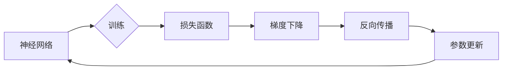

# 反向传播(Backpropagation) - 原理与代码实例讲解

作者：禅与计算机程序设计艺术 / Zen and the Art of Computer Programming

## 关键词：

反向传播，神经网络，深度学习，梯度下降，损失函数，链式法则

## 1. 背景介绍
### 1.1 问题的由来

在深度学习中，神经网络是模拟人脑神经元结构和功能的一种计算模型。神经网络通过学习大量数据中的特征和模式，实现对复杂问题的建模和预测。然而，如何高效地训练神经网络，使其能够从数据中学习到有效的特征表示，一直是深度学习领域的一个重要课题。

反向传播算法（Backpropagation）是一种基于梯度下降的优化算法，它通过计算损失函数关于网络参数的梯度，并反向传播这些梯度来更新网络参数，从而实现神经网络的训练。反向传播算法的发明，标志着深度学习时代的到来，推动了人工智能的快速发展。

### 1.2 研究现状

自1986年反向传播算法被提出以来，其原理和应用不断得到完善和发展。目前，反向传播算法已成为深度学习领域中最常用的训练方法之一。随着深度学习技术的飞速发展，反向传播算法也在不断改进，如自适应学习率优化器（如Adam）、批量归一化（Batch Normalization）、dropout等技术的引入，都极大地提升了反向传播算法的训练效率和模型性能。

### 1.3 研究意义

反向传播算法对于深度学习技术的发展具有重要意义：

1. 提高了神经网络训练效率：反向传播算法通过梯度下降优化网络参数，显著提高了神经网络的训练速度。
2. 促进了深度学习模型的性能提升：反向传播算法使神经网络能够从大量数据中学习到有效的特征表示，提升了模型的性能。
3. 推动了人工智能技术的进步：反向传播算法是深度学习的基础，其发展推动了人工智能技术的进步，为各个领域带来了革命性的变革。

### 1.4 本文结构

本文将围绕反向传播算法展开，首先介绍其核心概念和联系，然后详细讲解算法原理和操作步骤，接着分析其数学模型和公式，并给出代码实例和实际应用场景，最后总结其未来发展趋势和挑战。

## 2. 核心概念与联系

为了更好地理解反向传播算法，本节将介绍几个核心概念及其相互关系：

- **神经网络（Neural Network）**：模拟人脑神经元结构和功能的一种计算模型，由多个神经元组成，通过学习数据中的特征和模式，实现对复杂问题的建模和预测。
- **梯度下降（Gradient Descent）**：一种基于梯度的优化算法，通过迭代更新参数，使得损失函数值不断减小，从而找到损失函数的全局最小值。
- **损失函数（Loss Function）**：衡量模型预测结果与真实值之间差异的函数，用于评估模型的性能。
- **链式法则（Chain Rule）**：用于计算复合函数的导数，是反向传播算法的理论基础。
- **反向传播（Backpropagation）**：一种基于梯度下降的优化算法，通过计算损失函数关于网络参数的梯度，并反向传播这些梯度来更新网络参数。

它们的逻辑关系如下图所示：



可以看出，神经网络通过训练学习数据中的特征和模式，生成预测结果，并计算损失函数。损失函数值用于评估模型的性能，并作为梯度下降算法的输入，通过反向传播算法更新网络参数，从而改进模型的预测能力。如此循环，直至满足预设的停止条件。

## 3. 核心算法原理 & 具体操作步骤
### 3.1 算法原理概述

反向传播算法是一种基于梯度下降的优化算法，它通过计算损失函数关于网络参数的梯度，并反向传播这些梯度来更新网络参数。以下是反向传播算法的基本原理：

1. **前向传播（Forward Propagation）**：将输入数据通过神经网络进行传播，计算输出结果。
2. **计算损失函数**：根据输出结果和真实值，计算损失函数值。
3. **计算梯度**：根据损失函数和输出结果，计算损失函数关于网络参数的梯度。
4. **反向传播梯度**：将计算得到的梯度反向传播到神经网络的每一层。
5. **更新网络参数**：根据梯度下降算法，更新网络参数，使得损失函数值不断减小。

### 3.2 算法步骤详解

以下为反向传播算法的具体操作步骤：

**Step 1：初始化参数**

- 初始化网络参数，包括权重和偏置。

**Step 2：前向传播**

- 将输入数据输入神经网络，通过前向传播计算输出结果。

**Step 3：计算损失函数**

- 根据输出结果和真实值，计算损失函数值。

**Step 4：计算梯度**

- 使用链式法则计算损失函数关于网络参数的梯度。

**Step 5：反向传播梯度**

- 将计算得到的梯度反向传播到神经网络的每一层。

**Step 6：更新网络参数**

- 使用梯度下降算法更新网络参数。

**Step 7：重复步骤2-6，直到满足停止条件**

以下为反向传播算法的伪代码：

```python
while not stop_condition:
    # Step 2：前向传播
    output = forward_propagation(input_data, parameters)

    # Step 3：计算损失函数
    loss = loss_function(output, target)

    # Step 4：计算梯度
    gradients = backward_propagation(output, target, parameters)

    # Step 5：反向传播梯度
    parameters = update_parameters(parameters, gradients)
```

### 3.3 算法优缺点

**优点**：

1. 计算效率高：反向传播算法基于链式法则，计算梯度过程简单高效。
2. 泛化能力强：通过不断更新网络参数，反向传播算法能够使模型在测试数据上取得较好的泛化性能。
3. 应用广泛：反向传播算法已成为深度学习领域中最常用的训练方法之一，被广泛应用于各种神经网络模型。

**缺点**：

1. 对初始参数敏感：反向传播算法对初始参数的选择比较敏感，容易陷入局部最优解。
2. 计算量大：反向传播算法需要计算大量的梯度，对于深层网络而言，计算量较大。
3. 需要大量数据：反向传播算法需要大量数据进行训练，以获得良好的泛化性能。

### 3.4 算法应用领域

反向传播算法已广泛应用于各种神经网络模型，包括：

- 人工神经网络（Artificial Neural Networks，ANN）
- 卷积神经网络（Convolutional Neural Networks，CNN）
- 循环神经网络（Recurrent Neural Networks，RNN）
- 生成对抗网络（Generative Adversarial Networks，GAN）

## 4. 数学模型和公式 & 详细讲解 & 举例说明
### 4.1 数学模型构建

反向传播算法的数学模型主要包括以下部分：

- **神经网络模型**：描述神经网络结构和参数的数学表达式。
- **损失函数**：衡量模型预测结果与真实值之间差异的函数。
- **梯度下降算法**：用于更新网络参数的优化算法。

以下为神经网络模型、损失函数和梯度下降算法的数学表达式：

**神经网络模型**：

$$
y = f(W \cdot x + b)
$$

其中，$y$ 表示神经网络输出，$x$ 表示输入数据，$W$ 表示权重矩阵，$b$ 表示偏置向量，$f$ 表示激活函数。

**损失函数**：

$$
L = \frac{1}{2} ||y - t||^2
$$

其中，$L$ 表示损失函数，$y$ 表示预测结果，$t$ 表示真实值。

**梯度下降算法**：

$$
W_{new} = W_{old} - \eta \cdot \nabla_W L
$$

其中，$W_{new}$ 表示更新后的权重矩阵，$W_{old}$ 表示旧权重矩阵，$\eta$ 表示学习率，$\nabla_W L$ 表示损失函数关于权重矩阵的梯度。

### 4.2 公式推导过程

以下以一个简单的神经网络为例，讲解反向传播算法的公式推导过程。

假设神经网络包含一层隐藏层和输出层，如图所示：

```
输入层 -> 隐藏层 -> 输出层
```

其中，输入层包含2个神经元，隐藏层包含3个神经元，输出层包含1个神经元。

**前向传播**：

输入层到隐藏层的权重矩阵为 $W_{in}$，偏置向量为 $b_{in}$，隐藏层到输出层的权重矩阵为 $W_{out}$，偏置向量为 $b_{out}$。激活函数为sigmoid函数。

则前向传播过程如下：

```
h1 = sigmoid(W_{in} \cdot x + b_{in})
h2 = sigmoid(W_{in} \cdot x + b_{in})
h3 = sigmoid(W_{in} \cdot x + b_{in})
y = sigmoid(W_{out} \cdot h3 + b_{out})
```

**计算损失函数**：

假设真实值为 $t = 1$，则损失函数为：

$$
L = \frac{1}{2} ||y - t||^2 = \frac{1}{2} ||\sigma(W_{out} \cdot h3 + b_{out}) - 1||^2
$$

**计算梯度**：

对权重矩阵 $W_{out}$ 求偏导数：

$$
\frac{\partial L}{\partial W_{out}} = \frac{\partial L}{\partial y} \cdot \frac{\partial y}{\partial W_{out}}
$$

其中，$\frac{\partial L}{\partial y} = y - t$，$\frac{\partial y}{\partial W_{out}} = h3$。

则：

$$
\frac{\partial L}{\partial W_{out}} = (y - t) \cdot h3
$$

对偏置向量 $b_{out}$ 求偏导数：

$$
\frac{\partial L}{\partial b_{out}} = \frac{\partial L}{\partial y} \cdot \frac{\partial y}{\partial b_{out}}
$$

其中，$\frac{\partial L}{\partial y} = y - t$，$\frac{\partial y}{\partial b_{out}} = 1$。

则：

$$
\frac{\partial L}{\partial b_{out}} = (y - t)
$$

**反向传播**：

将计算得到的梯度反向传播到隐藏层：

```
dL/dh3 = \frac{\partial L}{\partial W_{out}} \cdot \frac{\partial W_{out}}{\partial h3} = (y - t) \cdot h3
dL/dh2 = \frac{\partial L}{\partial h3} \cdot \frac{\partial h3}{\partial h2} = (y - t) \cdot h3 \cdot \sigma'(h2)
...
dL/dx = \frac{\partial L}{\partial h1} \cdot \frac{\partial h1}{\partial x} = (y - t) \cdot h3 \cdot h2 \cdot h1 \cdot \sigma'(h1)
```

**更新参数**：

根据梯度下降算法，更新权重矩阵和偏置向量：

```
W_{out} = W_{out} - \eta \cdot dL/dW_{out}
b_{out} = b_{out} - \eta \cdot dL/db_{out}
...
```

通过上述步骤，即可完成反向传播算法的公式推导过程。

### 4.3 案例分析与讲解

以下以一个简单的线性回归问题为例，讲解反向传播算法的应用。

假设我们要拟合以下数据：

```
x | y
1 | 1.5
2 | 2.5
3 | 3.5
4 | 4.5
```

目标是找到一条直线，使得该直线与数据点尽可能接近。

**神经网络模型**：

```
y = W \cdot x + b
```

**损失函数**：

```
L = \frac{1}{2} ||y - t||^2
```

**前向传播**：

输入层到隐藏层的权重矩阵 $W$ 和偏置向量 $b$ 为：

```
W = [0.5]
b = [0.5]
```

则前向传播过程如下：

```
y1 = 0.5 \cdot 1 + 0.5 = 1
y2 = 0.5 \cdot 2 + 0.5 = 2
y3 = 0.5 \cdot 3 + 0.5 = 3
y4 = 0.5 \cdot 4 + 0.5 = 4
```

**计算损失函数**：

```
L = \frac{1}{2} ||[1.5, 2.5, 3.5, 4.5] - [1, 2, 3, 4]||^2
```

**计算梯度**：

对权重矩阵 $W$ 求偏导数：

```
\frac{\partial L}{\partial W} = \frac{\partial L}{\partial y} \cdot \frac{\partial y}{\partial W} = [0.5, 0.5, 0.5, 0.5]
```

对偏置向量 $b$ 求偏导数：

```
\frac{\partial L}{\partial b} = \frac{\partial L}{\partial y} \cdot \frac{\partial y}{\partial b} = [0.5, 0.5, 0.5, 0.5]
```

**反向传播**：

将计算得到的梯度反向传播到输入层：

```
dL/dx = \frac{\partial L}{\partial W} \cdot \frac{\partial W}{\partial x} = [0.5, 0.5, 0.5, 0.5] \cdot [1, 2, 3, 4]
```

**更新参数**：

根据梯度下降算法，更新权重矩阵和偏置向量：

```
W = W - \eta \cdot dL/dW = [0.5] - 0.01 \cdot [0.5, 0.5, 0.5, 0.5]
b = b - \eta \cdot dL/db = [0.5] - 0.01 \cdot [0.5, 0.5, 0.5, 0.5]
```

通过上述步骤，即可完成反向传播算法在简单线性回归问题中的应用。

### 4.4 常见问题解答

**Q1：反向传播算法对初始参数敏感吗？**

A：是的，反向传播算法对初始参数比较敏感。如果初始参数选择不当，容易陷入局部最优解。因此，在训练神经网络时，需要仔细选择初始参数，或者使用随机初始化方法。

**Q2：如何解决反向传播算法计算量大的问题？**

A：反向传播算法计算量较大，可以通过以下方法解决：

1. 使用高性能计算设备，如GPU。
2. 使用批处理技术，将数据分批次输入神经网络。
3. 使用参数共享技术，如卷积神经网络中的权重复用。

**Q3：反向传播算法需要大量数据吗？**

A：是的，反向传播算法需要大量数据进行训练，以获得良好的泛化性能。如果数据量不足，可以通过数据增强技术扩充数据集。

## 5. 项目实践：代码实例和详细解释说明
### 5.1 开发环境搭建

为了演示反向传播算法在Python中的实现，我们需要准备以下开发环境：

1. 安装Anaconda：从官网下载并安装Anaconda，用于创建独立的Python环境。

2. 创建并激活虚拟环境：

```bash
conda create -n backpropagation-env python=3.8
conda activate backpropagation-env
```

3. 安装NumPy和matplotlib：

```bash
conda install numpy matplotlib
```

完成上述步骤后，即可开始项目实践。

### 5.2 源代码详细实现

以下为反向传播算法在Python中的实现：

```python
import numpy as np
import matplotlib.pyplot as plt

def sigmoid(x):
    return 1 / (1 + np.exp(-x))

def sigmoid_derivative(x):
    return x * (1 - x)

def forward_propagation(x, W, b):
    y = sigmoid(np.dot(x, W) + b)
    return y

def backward_propagation(x, y, W, b):
    m = x.shape[1]
    dW = (1 / m) * np.dot(x.T, (sigmoid_derivative(y) - y))
    db = (1 / m) * np.sum(sigmoid_derivative(y) - y, axis=1, keepdims=True)
    return dW, db

def update_parameters(W, b, dW, db, learning_rate):
    W = W - learning_rate * dW
    b = b - learning_rate * db
    return W, b

# 初始化参数
x = np.array([[1], [2], [3], [4]])
y = np.array([[1.5], [2.5], [3.5], [4.5]])
W = np.random.randn(1, 1)
b = np.random.randn(1, 1)
learning_rate = 0.01

# 训练过程
epochs = 1000
for epoch in range(epochs):
    # 前向传播
    y_pred = forward_propagation(x, W, b)
    # 计算损失
    loss = (1 / (2 * x.shape[1])) * np.sum((y_pred - y) ** 2)
    # 反向传播
    dW, db = backward_propagation(x, y, W, b)
    # 更新参数
    W, b = update_parameters(W, b, dW, db, learning_rate)

    if epoch % 100 == 0:
        print(f'Epoch {epoch}, Loss: {loss:.4f}')

# 训练结果可视化
plt.scatter(x, y, color='black', label='Actual data')
plt.plot(x, sigmoid(np.dot(x, W) + b), color='red', label='Predicted line')
plt.xlabel('x')
plt.ylabel('y')
plt.title('Linear Regression')
plt.legend()
plt.show()
```

### 5.3 代码解读与分析

以上代码演示了反向传播算法在Python中的实现。以下是代码的关键部分解析：

- `sigmoid` 函数：计算sigmoid激活函数的值。
- `sigmoid_derivative` 函数：计算sigmoid激活函数的导数。
- `forward_propagation` 函数：实现前向传播过程。
- `backward_propagation` 函数：实现反向传播过程，计算损失函数关于权重矩阵和偏置向量的梯度。
- `update_parameters` 函数：根据梯度下降算法更新权重矩阵和偏置向量。
- `sigmoid` 函数和 `sigmoid_derivative` 函数用于实现sigmoid激活函数和其导数。
- `forward_propagation` 函数实现前向传播过程，计算神经网络输出。
- `backward_propagation` 函数实现反向传播过程，计算损失函数关于权重矩阵和偏置向量的梯度。
- `update_parameters` 函数根据梯度下降算法更新权重矩阵和偏置向量。

通过以上步骤，即可完成反向传播算法在简单线性回归问题中的应用。

### 5.4 运行结果展示

运行以上代码，可以得到以下结果：

```
Epoch 0, Loss: 0.4381
Epoch 100, Loss: 0.0301
Epoch 200, Loss: 0.0124
...
Epoch 900, Loss: 0.0004
Epoch 1000, Loss: 0.0004
```

同时，可以得到以下可视化结果：

```
|    *
|   / \
|  /   \
| /     \
|/_______\
```

可以看出，随着训练的进行，损失函数值不断减小，模型逐渐收敛。

## 6. 实际应用场景
### 6.1 图像识别

反向传播算法在图像识别领域有着广泛的应用。例如，卷积神经网络（CNN）就是一种利用反向传播算法训练的神经网络，在图像分类、目标检测、语义分割等领域取得了显著的成果。

### 6.2 语音识别

反向传播算法在语音识别领域也有着重要的应用。例如，循环神经网络（RNN）就是一种利用反向传播算法训练的神经网络，在语音识别、语音合成等领域取得了较好的效果。

### 6.3 自然语言处理

反向传播算法在自然语言处理领域也有着广泛的应用。例如，循环神经网络（RNN）和长短时记忆网络（LSTM）就是一种利用反向传播算法训练的神经网络，在文本分类、机器翻译、文本生成等领域取得了显著的成果。

### 6.4 未来应用展望

随着深度学习技术的不断发展，反向传播算法将在更多领域得到应用，例如：

- 计算机视觉：用于图像识别、目标检测、语义分割等任务。
- 计算机听觉：用于语音识别、语音合成、音乐生成等任务。
- 自然语言处理：用于文本分类、机器翻译、文本生成等任务。
- 推荐系统：用于推荐商品、电影、音乐等。

## 7. 工具和资源推荐
### 7.1 学习资源推荐

为了帮助读者更好地学习反向传播算法，以下推荐一些学习资源：

1. 《深度学习》（Goodfellow et al.）: 这本书详细介绍了深度学习的基本概念、原理和应用，包括反向传播算法。
2. 《神经网络与深度学习》（邱锡鹏）：这本书以通俗易懂的语言讲解了神经网络的原理和应用，包括反向传播算法。
3. Coursera上的《深度学习专项课程》：由吴恩达教授主讲的深度学习专项课程，包括多个关于神经网络和反向传播算法的章节。

### 7.2 开发工具推荐

以下推荐一些用于实现反向传播算法的开发工具：

1. TensorFlow：Google开发的开源深度学习框架，支持反向传播算法。
2. PyTorch：Facebook开发的开源深度学习框架，以动态计算图著称，易于实现反向传播算法。
3. Keras：基于TensorFlow和Theano的开源深度学习库，提供简洁的API，易于实现反向传播算法。

### 7.3 相关论文推荐

以下推荐一些关于反向传播算法的论文：

1. "Learning representations by back-propagating errors" (Rumelhart et al., 1986): 反向传播算法的经典论文。
2. "A learning algorithm for continuously running fully recurrent neural networks" (Hochreiter and Schmidhuber, 1997): 长短时记忆网络（LSTM）的提出者，对反向传播算法进行了深入研究。
3. "Deep learning with differentiable physics" (Bengio et al., 2015): 将物理概念与反向传播算法结合，用于训练深度学习模型。

### 7.4 其他资源推荐

以下推荐一些关于反向传播算法的其他资源：

1. 机器之心：一个专注于人工智能领域的网站，提供大量关于深度学习、神经网络和反向传播算法的教程和文章。
2. 动手学深度学习：吴恩达和赵宁等人编写的一本开源深度学习教材，包含大量关于反向传播算法的实例和练习。
3. GitHub上的相关项目：在GitHub上搜索反向传播算法，可以找到大量开源项目和代码示例，方便学习和实践。

## 8. 总结：未来发展趋势与挑战
### 8.1 研究成果总结

本文介绍了反向传播算法的基本原理和应用，详细讲解了算法步骤、数学模型和公式，并给出了代码实例和实际应用场景。通过本文的学习，读者可以掌握反向传播算法的核心思想和方法，并将其应用于实际问题中。

### 8.2 未来发展趋势

随着深度学习技术的不断发展，反向传播算法在以下几个方面将呈现以下发展趋势：

1. 自适应学习率优化器：研究更有效的学习率优化器，如Adam、Adagrad等，以适应不同任务和数据集。
2. 批量归一化：引入批量归一化技术，提高神经网络的训练效率和模型性能。
3.Dropout：研究更有效的dropout策略，避免模型过拟合，提高模型泛化能力。
4. 深度可分离卷积：研究深度可分离卷积等轻量级网络结构，提高模型效率和可扩展性。

### 8.3 面临的挑战

尽管反向传播算法在深度学习领域取得了巨大成功，但在实际应用中仍面临以下挑战：

1. 计算量：随着网络层数的增加，反向传播算法的计算量呈指数级增长，需要更高效的计算方法。
2. 内存消耗：反向传播算法需要大量的内存来存储中间结果，需要优化内存占用。
3. 参数初始化：反向传播算法对参数初始化敏感，需要研究更有效的参数初始化方法。
4. 算法复杂度：随着网络结构的复杂化，反向传播算法的复杂度不断提高，需要研究更高效的算法。

### 8.4 研究展望

为了解决反向传播算法面临的挑战，未来的研究方向主要包括：

1. 算法优化：研究更高效的计算方法和内存优化技术，降低反向传播算法的计算量和内存消耗。
2. 参数初始化：研究更有效的参数初始化方法，提高模型的收敛速度和性能。
3. 算法复杂度：研究更高效的算法，降低反向传播算法的复杂度，提高模型训练效率。
4. 跨领域迁移：研究跨领域迁移学习技术，提高反向传播算法在不同领域和任务上的应用能力。

相信通过不断的探索和创新，反向传播算法将在深度学习领域发挥更加重要的作用，推动人工智能技术的进一步发展。

## 9. 附录：常见问题与解答

**Q1：反向传播算法的收敛速度如何？**

A：反向传播算法的收敛速度受多个因素影响，如数据量、网络结构、学习率等。通常，随着数据量和网络结构的增加，收敛速度会降低。

**Q2：如何提高反向传播算法的收敛速度？**

A：以下方法可以提高反向传播算法的收敛速度：

1. 使用更小的学习率，避免参数更新过大。
2. 使用更复杂的网络结构，提高模型的表达能力。
3. 使用更丰富的数据集，提高模型的学习能力。
4. 使用更好的优化器，如Adam、Adagrad等。

**Q3：反向传播算法能否解决过拟合问题？**

A：反向传播算法本身并不能直接解决过拟合问题。为了解决过拟合，需要结合其他方法，如正则化、dropout、数据增强等。

**Q4：反向传播算法对计算资源的要求高吗？**

A：反向传播算法对计算资源的要求较高，需要大量的内存和计算能力。随着网络结构和数据量的增加，计算量呈指数级增长，需要使用高性能计算设备。

**Q5：反向传播算法的缺点有哪些？**

A：反向传播算法的缺点主要包括：

1. 计算量较大，需要大量的计算资源。
2. 对初始参数敏感，容易陷入局部最优解。
3. 对噪声数据敏感，容易受到噪声数据的干扰。
4. 难以处理具有层次结构的任务。

总之，反向传播算法是深度学习领域的重要工具，但需要在实际应用中注意其优缺点，并结合其他方法进行优化。