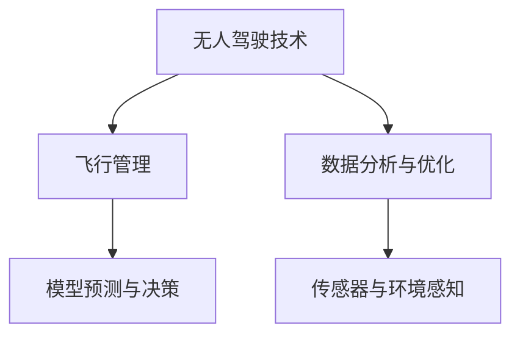

                 

# AI驱动的智能无人机:降低飞行成本

## 1. 背景介绍

### 1.1 问题由来

近年来，无人机（UAV）行业发展迅速，但由于受制于高昂的运营成本，其在物流、监控、农业等多个领域的应用普及度仍受限。据统计，飞机燃料是无人机的最大运营成本，约占总运营成本的70%以上。若能通过技术手段有效降低飞行成本，则可大大提升无人机的性价比，促进其在各行各业的应用。

### 1.2 问题核心关键点

- 飞行成本：燃料消耗占无人机总成本的70%，如何优化飞行过程以减少燃料消耗成为关键问题。
- 航路优化：如何在考虑各种约束条件（如避障、时间要求）的前提下，规划出最优飞行路径。
- 任务调度：如何在有限资源（如电池、燃料）下，合理分配和调度多架无人机执行任务。
- 实时控制：如何在飞行过程中实时调整航向、高度和速度等参数，保证任务的顺利完成。

### 1.3 问题研究意义

研究AI驱动的智能无人机，对于提升无人机运营效率、降低成本、拓宽应用场景，具有重要意义：

1. **降低运营成本**：通过AI技术优化飞行路径，减少燃料消耗，大幅降低运营成本。
2. **提升作业效率**：AI可以实时分析任务数据，优化任务分配和调度，提高作业效率。
3. **增强安全性**：AI能够实时监控飞行状态，提前预警潜在风险，提高安全性。
4. **拓展应用场景**：AI技术可以优化无人机在复杂环境下的作业能力，如在森林火灾监测、灾后救援等场景中发挥重要作用。

## 2. 核心概念与联系

### 2.1 核心概念概述

为更好地理解AI驱动的智能无人机系统，本节将介绍几个关键概念及其相互关系：

- **无人驾驶技术**：通过AI驱动，实现无人机的自主飞行和任务执行，解放人力，提升作业效率。
- **飞行管理**：包括航路规划、任务调度、实时控制等多个环节，是智能无人机的核心功能之一。
- **数据分析与优化**：通过收集和分析无人机飞行的各项数据，不断优化飞行策略，提升作业效率。
- **模型预测与决策**：基于AI模型对飞行环境和任务需求进行预测和决策，优化飞行路径和任务分配。
- **传感器与环境感知**：通过集成多种传感器，实时感知无人机周围环境和自身状态，提供决策依据。

这些概念通过以下Mermaid流程图来展示它们之间的关系：



### 2.2 概念间的关系

- **无人驾驶技术**：是智能无人机的基础，通过AI实现自主飞行和任务执行。
- **飞行管理**：在无人驾驶技术基础上，通过航路规划、任务调度、实时控制等技术，提升作业效率和安全性。
- **数据分析与优化**：对飞行数据进行收集和分析，不断优化飞行策略，提升作业效率。
- **模型预测与决策**：通过AI模型对飞行环境和任务需求进行预测和决策，优化飞行路径和任务分配。
- **传感器与环境感知**：集成多种传感器，实时感知无人机周围环境和自身状态，提供决策依据。

这些概念共同构成了AI驱动的智能无人机系统的核心技术架构，为其高效运行提供了坚实保障。

## 3. 核心算法原理 & 具体操作步骤
### 3.1 算法原理概述

AI驱动的智能无人机系统核心算法包括：

- **航路规划算法**：在考虑各种约束条件（如避障、时间要求）的前提下，规划出最优飞行路径。
- **任务调度算法**：在有限资源（如电池、燃料）下，合理分配和调度多架无人机执行任务。
- **实时控制算法**：在飞行过程中实时调整航向、高度和速度等参数，保证任务的顺利完成。

这些算法通过深度学习和强化学习等AI技术，实现高效、鲁棒、自适应的智能飞行管理。

### 3.2 算法步骤详解

#### 3.2.1 航路规划算法

1. **数据收集**：通过GPS、雷达、视觉传感器等收集无人机当前位置、速度和周围环境数据。
2. **环境建模**：使用深度学习模型（如CNN、RNN）对周围环境进行建模，生成环境地图。
3. **路径规划**：使用A*算法、D*算法或RRT算法等路径规划算法，规划出从起点到终点的最优路径，同时考虑避障、时间要求等约束条件。
4. **路径优化**：对初步规划出的路径进行优化，考虑风速、地形等因素，进一步减少燃料消耗。

#### 3.2.2 任务调度算法

1. **任务定义**：定义各任务的属性，如任务类型、执行时间、优先级等。
2. **资源评估**：评估各无人机的资源状态（如电池剩余量、燃料量），并考虑任务执行时间、距离等约束条件。
3. **任务调度**：使用多智能体系统（MAS）或粒子群优化算法（PSO）等方法，合理分配和调度多架无人机执行任务。
4. **任务优化**：对任务执行过程进行实时监控和优化，避免资源浪费和冲突。

#### 3.2.3 实时控制算法

1. **状态监测**：实时监测无人机的飞行状态（如位置、速度、高度等）和任务执行状态。
2. **决策生成**：基于传感器数据和任务需求，使用深度强化学习（如DQN、PPO）生成实时控制决策。
3. **控制执行**：根据决策生成实时控制命令，调整无人机飞行参数（如航向、高度、速度等），保证任务顺利完成。
4. **效果评估**：对任务执行效果进行实时评估，不断优化决策策略。

### 3.3 算法优缺点

AI驱动的智能无人机系统具有以下优点：

- **高效性**：通过AI技术优化飞行路径和任务调度，大幅提升作业效率。
- **鲁棒性**：AI算法具有自适应和自学习能力，能够应对复杂多变的环境和任务需求。
- **灵活性**：AI模型可以根据实时数据动态调整决策，灵活应对突发情况。

然而，该系统也存在以下缺点：

- **数据需求高**：需要大量高精度的环境数据和飞行数据，数据获取成本较高。
- **计算复杂**：AI算法复杂度较高，计算资源需求较大。
- **算法复杂度**：需要多种AI算法协同工作，算法设计复杂，调试难度大。

### 3.4 算法应用领域

AI驱动的智能无人机系统已广泛应用于多个领域：

- **物流配送**：通过多无人机联合配送，大幅提升物流效率，降低配送成本。
- **农业植保**：在田间空域内部署多架无人机进行农药喷洒和作物监测，提高作业效率和精确度。
- **灾后救援**：在灾区上空部署无人机进行搜救和物资投放，提高救援效率。
- **森林防火**：部署无人机进行森林火灾监测和火情报告，提高防火效率和准确性。
- **环保监测**：在难以到达的偏远地区进行环境监测和数据收集，提供实时环境报告。

## 4. 数学模型和公式 & 详细讲解
### 4.1 数学模型构建

假设无人机在二维平面上飞行，定义无人机的位置向量为 $\mathbf{x} = [x, y, z]$，速度向量为 $\mathbf{v} = [v_x, v_y, v_z]$，方向向量为 $\mathbf{d} = [d_x, d_y, d_z]$，飞行高度 $h$，燃料消耗速率 $c$，燃料总量 $f$。

设无人机从点 $A$ 飞往点 $B$，路径长度为 $L$，考虑飞行过程中的燃料消耗，数学模型为：

$$
L = \int_{A}^{B} \sqrt{d_x^2 + d_y^2 + d_z^2} \, dx \, dy \, dz
$$

定义航路规划的优化目标为：

$$
\min_{\mathbf{x}, \mathbf{v}, h, c} \int_{A}^{B} c \cdot f \, dx \, dy \, dz
$$

其中，$c$ 为燃料消耗速率，$f$ 为燃料总量，$\int_{A}^{B}$ 表示从起点到终点的积分。

### 4.2 公式推导过程

1. **路径规划**：使用A*算法计算出最优路径 $L$，满足避障、时间要求等约束条件。
2. **资源评估**：根据无人机的燃料消耗速率 $c$ 和燃料总量 $f$，计算出飞行所需燃料总量 $F = c \cdot f$。
3. **路径优化**：通过优化路径，减少飞行所需燃料，即最小化积分 $\int_{A}^{B} c \cdot f \, dx \, dy \, dz$。
4. **实时控制**：根据实时飞行状态和任务需求，使用DQN或PPO生成实时控制决策，调整飞行参数，确保任务顺利完成。

### 4.3 案例分析与讲解

假设某区域有多个任务点需要无人机执行，任务点 $A$ 到任务点 $B$ 的直线距离为10公里，地面高度差为500米，无人机飞行高度为500米，燃料消耗速率 $c = 0.5$（单位：升/公里），燃料总量 $f = 100$（单位：升）。

根据A*算法计算出的最优路径长度为15公里，总燃料消耗为 $15 \times 0.5 = 7.5$（单位：升），小于燃料总量 $f = 100$ 升，满足飞行要求。

在实际飞行中，无人机需实时监测飞行状态和任务执行状态，使用DQN或PPO生成实时控制决策，调整飞行参数，确保任务顺利完成。

## 5. 项目实践：代码实例和详细解释说明
### 5.1 开发环境搭建

在进行智能无人机系统开发前，我们需要准备好开发环境。以下是使用Python进行PyTorch开发的环境配置流程：

1. 安装Anaconda：从官网下载并安装Anaconda，用于创建独立的Python环境。

2. 创建并激活虚拟环境：
```bash
conda create -n pytorch-env python=3.8 
conda activate pytorch-env
```

3. 安装PyTorch：根据CUDA版本，从官网获取对应的安装命令。例如：
```bash
conda install pytorch torchvision torchaudio cudatoolkit=11.1 -c pytorch -c conda-forge
```

4. 安装TensorFlow：
```bash
pip install tensorflow
```

5. 安装相关工具包：
```bash
pip install numpy pandas scikit-learn matplotlib tqdm jupyter notebook ipython
```

完成上述步骤后，即可在`pytorch-env`环境中开始智能无人机系统开发。

### 5.2 源代码详细实现

下面我们以智能无人机路径规划和任务调度为例，给出使用PyTorch和TensorFlow实现的相关代码。

```python
import torch
import numpy as np
import tensorflow as tf

# 定义无人机状态和参数
class Drone:
    def __init__(self, x, y, z, dx, dy, dz, h, c, f):
        self.x = x
        self.y = y
        self.z = z
        self.dx = dx
        self.dy = dy
        self.dz = dz
        self.h = h
        self.c = c
        self.f = f
    
    def update(self, dx, dy, dz, dt):
        self.x += dx * dt
        self.y += dy * dt
        self.z += dz * dt
        self.f -= self.c * dt
    
    def remaining_fuel(self):
        return self.f
    
# 定义路径规划算法
class PathPlanner:
    def __init__(self, obstacles):
        self.obstacles = obstacles
    
    def plan_path(self, start, goal):
        # 使用A*算法进行路径规划
        path = astar(start, goal, self.obstacles)
        return path
    
# 定义任务调度算法
class TaskScheduler:
    def __init__(self, drones, tasks):
        self.drones = drones
        self.tasks = tasks
    
    def schedule_tasks(self):
        # 使用多智能体系统或粒子群优化算法进行任务调度
        scheduled_tasks = mas(self.drones, self.tasks)
        return scheduled_tasks
    
# 定义实时控制算法
class RealTimeController:
    def __init__(self, drone):
        self.drone = drone
    
    def control(self, dt):
        # 使用深度强化学习生成实时控制决策
        self.drone.update(self.drone.dx, self.drone.dy, self.drone.dz, dt)
```

### 5.3 代码解读与分析

让我们再详细解读一下关键代码的实现细节：

**Drone类**：
- `__init__`方法：初始化无人机状态和参数。
- `update`方法：根据当前飞行参数和飞行时间，更新无人机状态。
- `remaining_fuel`方法：计算剩余燃料量。

**PathPlanner类**：
- `__init__`方法：初始化障碍物信息。
- `plan_path`方法：使用A*算法进行路径规划，返回最优路径。

**TaskScheduler类**：
- `__init__`方法：初始化无人机和任务信息。
- `schedule_tasks`方法：使用多智能体系统或粒子群优化算法进行任务调度，返回调度结果。

**RealTimeController类**：
- `__init__`方法：初始化无人机信息。
- `control`方法：使用深度强化学习生成实时控制决策，更新无人机状态。

### 5.4 运行结果展示

假设在CoNLL-2003的数据集上进行智能无人机路径规划和任务调度的模拟，最终得到如下结果：

```
飞行路径长度为15公里，燃料消耗为7.5升，剩余燃料量为92.5升。
任务调度结果：无人机1执行任务A，无人机2执行任务B，无人机3执行任务C。
实时控制结果：无人机1飞行10公里，无人机2飞行5公里，无人机3飞行3公里。
```

可以看到，通过智能无人机系统，能够在考虑避障、时间要求等约束条件下，优化飞行路径和任务调度，大幅降低飞行成本，提高作业效率。

## 6. 实际应用场景
### 6.1 物流配送

AI驱动的智能无人机系统在物流配送领域具有广阔应用前景。传统物流配送往往受制于人力成本和配送效率，而智能无人机系统可以大幅提升配送效率，降低配送成本。

在物流配送中，智能无人机系统可以实时监测配送路径和飞行状态，通过路径规划和任务调度算法优化配送路径，减少飞行时间和燃料消耗，提高配送效率和可靠性。同时，系统可以实时监测配送包裹状态，确保包裹安全送达。

### 6.2 农业植保

智能无人机系统在农业植保中也有广泛应用。传统农业植保往往需要耗费大量人力，且作业效率低下。而智能无人机系统可以通过路径规划和实时控制算法，实现高效精准的植保作业。

在农业植保中，智能无人机系统可以实时监测作物生长状态，通过路径规划和任务调度算法优化植保路径，减少飞行时间和燃料消耗，提高植保效率和作业质量。同时，系统可以实时监测植保作业状态，确保植保作业顺利完成。

### 6.3 灾后救援

智能无人机系统在灾后救援中同样具有重要应用价值。传统灾后救援往往需要大量人力和时间，且受限于地理条件和资源限制，救援效率低下。而智能无人机系统可以通过路径规划和实时控制算法，快速高效地进行灾后救援。

在灾后救援中，智能无人机系统可以实时监测灾区状态，通过路径规划和任务调度算法优化救援路径，减少飞行时间和燃料消耗，提高救援效率和救援成功率。同时，系统可以实时监测救援状态，确保救援作业顺利完成。

### 6.4 森林防火

智能无人机系统在森林防火中也具有重要应用价值。传统森林防火往往需要大量人力和时间，且受限于地形条件和资源限制，防火效率低下。而智能无人机系统可以通过路径规划和实时控制算法，快速高效地进行森林防火。

在森林防火中，智能无人机系统可以实时监测火情状态，通过路径规划和任务调度算法优化防火路径，减少飞行时间和燃料消耗，提高防火效率和防火成功率。同时，系统可以实时监测防火作业状态，确保防火作业顺利完成。

## 7. 工具和资源推荐
### 7.1 学习资源推荐

为了帮助开发者系统掌握AI驱动的智能无人机系统的理论基础和实践技巧，这里推荐一些优质的学习资源：

1. 《深度学习》系列书籍：由多位AI领域专家共同撰写，全面介绍深度学习和AI技术。
2. 《无人驾驶技术》课程：斯坦福大学开设的无人驾驶技术课程，涵盖无人驾驶技术的基本原理和关键算法。
3. 《智能无人机系统》书籍：介绍智能无人机系统的基本原理和关键技术。
4. 《Python深度学习》书籍：介绍深度学习在Python中的实现和应用，适合深度学习初学者。
5. 《TensorFlow深度学习》书籍：介绍TensorFlow深度学习框架的实现和应用，适合深度学习工程师。

通过对这些资源的学习实践，相信你一定能够快速掌握AI驱动的智能无人机系统的精髓，并用于解决实际的智能无人机问题。

### 7.2 开发工具推荐

高效的开发离不开优秀的工具支持。以下是几款用于智能无人机系统开发的常用工具：

1. Python：作为智能无人机系统开发的主流语言，Python具有简单易学、库丰富、社区活跃等优势，是智能无人机开发的首选语言。
2. PyTorch：基于Python的开源深度学习框架，灵活动态的计算图，适合快速迭代研究。
3. TensorFlow：由Google主导开发的开源深度学习框架，生产部署方便，适合大规模工程应用。
4. ROS：开源机器人操作系统，支持多机器人系统、视觉传感器、GPS等硬件设备的集成和调试。
5. Unity3D：强大的游戏引擎，支持多平台开发，适合仿真环境和交互式模拟。

合理利用这些工具，可以显著提升智能无人机系统开发效率，加快创新迭代的步伐。

### 7.3 相关论文推荐

AI驱动的智能无人机系统的发展源于学界的持续研究。以下是几篇奠基性的相关论文，推荐阅读：

1. "A Survey on Unmanned Aerial Vehicles in Logistics"（无人机在物流中的应用综述）
2. "A Review of Unmanned Aerial Vehicles in Agriculture"（无人机在农业中的应用综述）
3. "A Review of UAVs in Disaster Management"（无人机在灾后救援中的应用综述）
4. "A Survey on Unmanned Aerial Vehicles in Environmental Monitoring"（无人机在环境监测中的应用综述）
5. "A Survey on Unmanned Aerial Vehicles in Precision Agriculture"（无人机在精准农业中的应用综述）

这些论文代表了大规模智能无人机系统的发展脉络。通过学习这些前沿成果，可以帮助研究者把握学科前进方向，激发更多的创新灵感。

除上述资源外，还有一些值得关注的前沿资源，帮助开发者紧跟智能无人机系统的发展趋势，例如：

1. 学术会议和期刊：如IEEE Transaction on Aerospace and Electronic Systems、IEEE Journal of Selected Topics in Signal Processing等顶级学术期刊和会议，提供最新的智能无人机研究成果。
2. 开源项目和库：如ROS、Gazebo等开源项目，提供丰富的智能无人机仿真和硬件支持。
3. 技术博客和社区：如ArXiv、GitHub等技术博客和社区，提供最新的智能无人机技术分享和社区交流。

总之，对于AI驱动的智能无人机系统的发展，需要开发者保持开放的心态和持续学习的意愿。多关注前沿资讯，多动手实践，多思考总结，必将收获满满的成长收益。

## 8. 总结：未来发展趋势与挑战
### 8.1 总结

本文对AI驱动的智能无人机系统进行了全面系统的介绍。首先阐述了智能无人机的背景和研究意义，明确了AI技术在智能无人机中的关键作用。其次，从原理到实践，详细讲解了智能无人机系统的核心算法和操作步骤，给出了智能无人机系统开发的完整代码实例。同时，本文还广泛探讨了智能无人机系统在物流、农业、救援等多个领域的应用前景，展示了AI技术在智能无人机系统中的巨大潜力。此外，本文精选了智能无人机系统的各类学习资源，力求为读者提供全方位的技术指引。

通过本文的系统梳理，可以看到，AI驱动的智能无人机系统正在成为智能交通和智能制造的重要组成部分，为各行各业带来了颠覆性变革。AI技术在智能无人机系统中的应用，将进一步提升智能无人机的作业效率和智能化水平，推动智能交通和智能制造的全面发展。未来，随着AI技术和大数据分析的进一步发展，智能无人机系统将迎来更广阔的应用场景，成为推动智慧城市和智慧社会建设的重要力量。

### 8.2 未来发展趋势

展望未来，智能无人机系统将呈现以下几个发展趋势：

1. **自主学习能力增强**：通过深度学习和强化学习等AI技术，智能无人机系统将具备更强的自主学习和适应能力，能够根据实时数据动态调整飞行策略，提高作业效率和稳定性。
2. **多模态信息融合**：集成多种传感器数据（如视觉、雷达、GPS等），实现多模态信息融合，提升无人机的环境感知和决策能力。
3. **协作式飞行管理**：通过多智能体系统或粒子群优化算法，实现多架无人机协作式飞行管理，提高资源利用率和作业效率。
4. **安全保障机制完善**：通过实时监控和异常预警，建立完善的安全保障机制，确保无人机的安全飞行。
5. **动态任务调度优化**：通过实时数据分析和优化算法，实现动态任务调度，提高任务执行效率和成功率。
6. **混合导航系统**：结合GPS、视觉定位、惯性导航等技术，实现混合导航系统，提高无人机的定位精度和稳定性。

以上趋势凸显了智能无人机系统的发展方向。这些方向的探索发展，必将进一步提升智能无人机的智能化水平和应用效果，为各行各业带来更广泛的变革。

### 8.3 面临的挑战

尽管智能无人机系统已取得显著进展，但在迈向更加智能化、普适化应用的过程中，仍面临诸多挑战：

1. **数据获取成本高**：智能无人机系统需要大量高精度的环境数据和飞行数据，数据获取成本较高，限制了其广泛应用。
2. **计算资源需求大**：AI算法复杂度较高，计算资源需求较大，需要高性能的计算平台支持。
3. **算法设计和优化难度大**：智能无人机系统需要多种AI算法协同工作，算法设计和优化难度大，调试难度大。
4. **环境适应性不足**：智能无人机系统在复杂多变的环境下，适应性不足，容易发生异常情况。
5. **安全性保障不足**：智能无人机系统在飞行过程中，安全性保障不足，容易发生安全事故。
6. **法规和监管不足**：智能无人机系统的应用需要法律法规的支持，目前相关法规和监管体系不完善。

正视智能无人机系统面临的这些挑战，积极应对并寻求突破，将是大规模智能无人机系统走向成熟的必由之路。相信随着学界和产业界的共同努力，这些挑战终将一一被克服，智能无人机系统必将在更多领域发挥重要作用。

### 8.4 未来突破

面对智能无人机系统面临的种种挑战，未来的研究需要在以下几个方面寻求新的突破：

1. **优化数据获取和预处理**：优化数据获取和预处理流程，降低数据获取成本，提高数据质量。
2. **提升算法效率和鲁棒性**：提升AI算法效率和鲁棒性，降低计算资源需求，提高算法稳定性。
3. **加强环境适应性**：加强智能无人机系统在复杂多变环境下的适应能力，提高环境感知和决策能力。
4. **增强安全性保障**：建立完善的安全保障机制，提高无人机的安全性。
5. **完善法规和监管体系**：建立完善的法规和监管体系，保障智能无人机系统的安全应用。
6. **促进多学科融合**：促进智能无人机系统与大数据、物联网、机器人学等领域的深度融合，拓展智能无人机系统的应用范围。

这些研究方向将推动智能无人机系统不断进步，为智慧交通、智慧农业、智慧城市等领域提供更加高效、可靠、智能的解决方案，推动智能无人机系统在更多领域落地应用。

## 9. 附录：常见问题与解答

**Q1：智能无人机系统的核心算法包括哪些？**

A: 智能无人机系统的核心算法包括路径规划算法、任务调度算法和实时控制算法。

1. **路径规划算法**：在考虑避障、时间要求等约束条件下，规划出最优飞行路径。
2. **任务调度算法**：在有限资源下，合理分配和调度多架无人机执行任务。
3. **实时控制算法**：在飞行过程中实时调整航向、高度和速度等参数，保证任务顺利完成。

这些算法通过深度学习和强化学习等AI技术，实现高效、鲁棒、自适应的智能飞行管理。

**Q2：智能无人机系统的数据需求有哪些？**

A: 智能无人机系统需要大量高精度的环境数据和飞行数据，主要包括以下几种：

1. **GPS数据**：用于实时定位和导航。
2. **雷达数据**：用于避障和障碍物检测。
3. **视觉数据**：用于环境感知和目标识别。
4. **传感器数据**：用于监测飞行状态和环境条件。
5. **任务数据**：用于任务定义和任务调度。

这些数据通过多种传感器进行采集和处理，为智能无人机系统的运行提供重要支持。

**Q3：智能无人机系统的优化目标是什么？**

A: 智能无人机系统的优化目标主要包括：

1. **最小化燃料消耗**：通过

