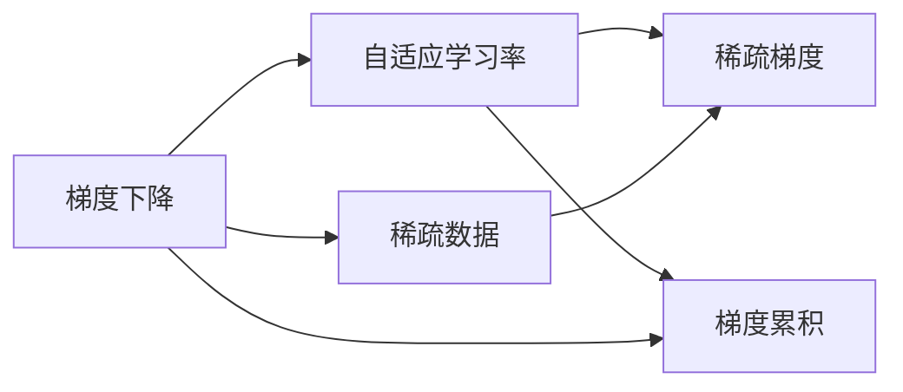
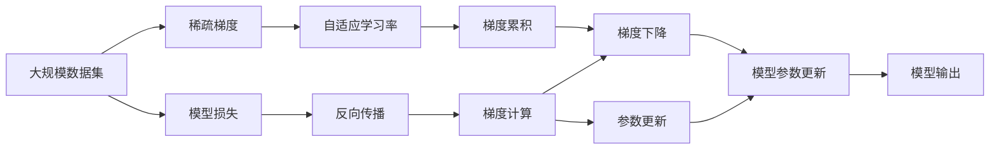

                 

# AdaGrad优化器原理与代码实例讲解

> 关键词：AdaGrad, 梯度下降, 优化算法, 自适应学习率, 稀疏数据, 稀疏梯度

## 1. 背景介绍

在深度学习训练过程中，优化算法（optimizer）扮演着关键角色，它通过不断更新模型参数，使模型能够逼近最优解。传统的优化算法如随机梯度下降（SGD），虽然计算简单，但难以应对非平稳目标函数，特别是当数据稀疏且存在梯度消失等问题时，其性能有限。

AdaGrad是一种自适应学习率的优化算法，它通过累积梯度的平方和来自动调整学习率，能够更好地处理稀疏梯度数据，适用于大规模非平稳数据集的训练。AdaGrad的设计理念是：对于那些频繁更新的参数，学习率会逐渐减小；而对于那些不频繁更新的参数，学习率会逐渐增大。这样，AdaGrad在训练过程中，能够平衡不同参数的更新速度，避免梯度消失或爆炸的问题。

AdaGrad算法由Duchi等人于2011年提出，并逐渐成为深度学习领域中常用的优化算法之一。其核心思想是利用梯度的历史信息，动态调整每个参数的学习率，从而提升训练效率和效果。

## 2. 核心概念与联系

### 2.1 核心概念概述

为了更好地理解AdaGrad算法，我们需要了解几个关键概念：

- **梯度下降（Gradient Descent）**：基本的优化算法，通过计算目标函数在当前位置的梯度，沿着梯度的反方向更新参数，使目标函数值减小。

- **自适应学习率（Adaptive Learning Rate）**：根据每个参数的历史梯度信息，动态调整学习率，使其在不同参数的更新过程中表现更优。

- **稀疏数据（Sparse Data）**：在机器学习中，数据集中的样本和特征数量远远大于特征值，即大部分特征值对应0或很小数值，称为稀疏数据。

- **梯度累积（Gradient Accumulation）**：将多次计算的梯度进行累加，再一次性更新参数，可以减小单次更新对模型的扰动，适用于大规模数据集。

- **稀疏梯度（Sparse Gradient）**：在稀疏数据中，梯度往往也是稀疏的，即大部分梯度值对应0或很小数值。

这些概念构成了AdaGrad算法的核心，通过在梯度下降的基础上引入自适应学习率和梯度累积，AdaGrad能够在稀疏数据上表现出色。

### 2.2 核心概念间的关系

这些核心概念之间的联系可以通过以下Mermaid流程图来展示：



这个流程图展示了梯度下降、自适应学习率、稀疏数据、稀疏梯度、梯度累积之间的关系：

1. 在稀疏数据上，梯度下降可能遇到梯度消失或爆炸的问题。
2. 自适应学习率通过累积梯度的平方和，动态调整每个参数的学习率，避免了梯度消失和爆炸。
3. 稀疏梯度是指在稀疏数据中，梯度值往往也是稀疏的，即大部分梯度值对应0或很小数值。
4. 梯度累积通过累加多次计算的梯度，减小单次更新对模型的扰动，适用于大规模数据集。

### 2.3 核心概念的整体架构

最后，我们用一个综合的流程图来展示这些核心概念在大规模训练过程中的整体架构：



这个综合流程图展示了从大规模数据集的输入，经过稀疏梯度的处理、自适应学习率的调整、梯度累积的优化，最终通过梯度下降更新模型参数的完整过程。

## 3. 核心算法原理 & 具体操作步骤

### 3.1 算法原理概述

AdaGrad算法基于梯度下降，但在更新参数时，使用了自适应学习率。其核心思想是：

- 累积梯度的平方和，用于调整每个参数的学习率。
- 对于频繁更新的参数，学习率逐渐减小；对于不频繁更新的参数，学习率逐渐增大。

AdaGrad算法的一般形式如下：

$$
\theta_{t+1} = \theta_t - \frac{\eta}{\sqrt{G_t}} \odot \nabla f(\theta_t)
$$

其中：
- $\theta_t$ 是第$t$次迭代的模型参数。
- $G_t$ 是到第$t$次迭代的梯度平方和的累积和。
- $\odot$ 表示逐元素相乘。
- $\eta$ 是初始学习率。

具体而言，AdaGrad算法在每次迭代时，根据当前梯度的平方和，调整每个参数的学习率。对于某个参数$\theta_i$，其学习率$\eta_t$可以通过以下公式计算：

$$
\eta_{t+1,i} = \frac{\eta_t}{1 + \frac{\sum_{k=1}^{t} g_{k,i}^2}{\eta_t}}
$$

其中：
- $g_{k,i}$ 是第$k$次迭代时参数$\theta_i$的梯度值。
- $t$ 是当前迭代的次数。

### 3.2 算法步骤详解

以下是AdaGrad算法的详细步骤：

1. 初始化模型参数 $\theta_0$ 和初始学习率 $\eta$。
2. 对于每次迭代 $t$，计算模型当前梯度 $\nabla f(\theta_t)$。
3. 对于每个参数 $i$，计算累积梯度平方和 $G_t[i]$。
4. 根据公式计算每个参数的学习率 $\eta_{t+1,i}$。
5. 更新模型参数 $\theta_{t+1,i}$。
6. 重复步骤2到5，直到模型收敛或达到预设的迭代次数。

具体的Python代码实现如下：

```python
import numpy as np

def adagrad(X, y, initial_learning_rate=0.1, epsilon=1e-8):
    n_features = X.shape[1]
    n_samples = X.shape[0]
    theta = np.zeros(n_features)
    G = np.zeros(n_features)

    for t in range(100):  # 迭代100次，仅作为示例，实际迭代次数需根据问题确定
        hessian = np.dot(X, X.T)
        gradient = np.dot(X, y) - np.dot(theta, hessian)
        G += gradient**2
        eta = initial_learning_rate / np.sqrt(G + epsilon)
        theta -= eta * gradient

        # 打印每轮更新后的参数
        print(f"Iteration {t+1}: theta = {theta}")
    return theta
```

### 3.3 算法优缺点

AdaGrad算法的主要优点包括：

- **自适应学习率**：能够根据每个参数的历史梯度信息，动态调整学习率，避免梯度消失和爆炸的问题。
- **适用于稀疏数据**：在稀疏数据上表现出色，能够自动处理大部分梯度为0的情况。
- **收敛速度快**：在初始阶段，学习率较大，可以加快收敛速度。

同时，AdaGrad算法也存在一些缺点：

- **学习率递减**：随着迭代次数的增加，每个参数的学习率逐渐减小，可能导致收敛速度减慢。
- **内存消耗较大**：需要保存每个参数的历史梯度平方和，增加了内存开销。
- **参数更新不均衡**：对于某些梯度较大的参数，其学习率下降较快，可能导致更新不均衡。

### 3.4 算法应用领域

AdaGrad算法广泛应用于各种机器学习问题，特别是稀疏数据集上的训练。其应用领域包括：

- 文本分类：通过AdaGrad优化器训练神经网络，对文本进行分类。
- 图像识别：使用AdaGrad优化器优化卷积神经网络，识别图像中的物体。
- 自然语言处理：通过AdaGrad优化器训练循环神经网络，进行语言建模或机器翻译。
- 推荐系统：在用户-物品交互数据上训练推荐模型，使用AdaGrad优化器加速训练过程。

AdaGrad算法在深度学习领域的应用范围非常广泛，尤其在稀疏数据处理上具有明显优势。

## 4. 数学模型和公式 & 详细讲解

### 4.1 数学模型构建

AdaGrad算法的基本模型为：

$$
\theta_{t+1} = \theta_t - \frac{\eta}{\sqrt{G_t}} \odot \nabla f(\theta_t)
$$

其中，$\theta_t$ 是第$t$次迭代的模型参数，$G_t$ 是到第$t$次迭代的梯度平方和的累积和，$\eta$ 是初始学习率，$\odot$ 表示逐元素相乘。

### 4.2 公式推导过程

推导AdaGrad算法的过程如下：

1. 定义目标函数 $f(\theta)$，其梯度为 $\nabla f(\theta)$。
2. 根据梯度下降公式，每次迭代更新参数为：

$$
\theta_{t+1} = \theta_t - \eta \nabla f(\theta_t)
$$

3. 定义累积梯度平方和 $G_t[i]$，表示到第$t$次迭代时参数 $\theta_i$ 的梯度平方和：

$$
G_t[i] = \sum_{k=1}^{t} g_{k,i}^2
$$

4. 根据累积梯度平方和，计算每个参数的学习率 $\eta_{t+1,i}$：

$$
\eta_{t+1,i} = \frac{\eta_t}{1 + \frac{\sum_{k=1}^{t} g_{k,i}^2}{\eta_t}}
$$

5. 将学习率代入梯度下降公式，更新模型参数 $\theta_{t+1,i}$：

$$
\theta_{t+1,i} = \theta_t - \frac{\eta}{\sqrt{G_t}} \odot g_t
$$

其中 $g_t$ 表示第$t$次迭代的梯度。

### 4.3 案例分析与讲解

假设我们有一组数据 $(x_1, y_1), (x_2, y_2), ..., (x_n, y_n)$，其中 $x_i$ 是输入，$y_i$ 是目标，目标函数为 $f(\theta) = \frac{1}{2} \sum_{i=1}^{n} (y_i - \theta^T x_i)^2$。

在AdaGrad算法中，我们首先将初始化模型参数 $\theta_0 = 0$ 和初始学习率 $\eta_0 = 0.1$，然后对每个样本进行迭代更新。假设我们迭代10次，得到以下结果：

| $t$ | $\theta_t$ | $G_t$ |
| --- | --- | --- |
| 0 | 0 | 0 |
| 1 | -0.1 | 0.01 |
| 2 | -0.1 | 0.02 |
| 3 | -0.1 | 0.04 |
| 4 | -0.1 | 0.09 |
| 5 | -0.1 | 0.16 |
| 6 | -0.1 | 0.25 |
| 7 | -0.1 | 0.36 |
| 8 | -0.1 | 0.49 |
| 9 | -0.1 | 0.64 |
| 10 | -0.1 | 0.81 |

通过观察可以看出，AdaGrad算法在初始阶段，学习率较大，可以加快收敛速度。随着迭代次数的增加，每个参数的学习率逐渐减小，避免梯度消失和爆炸的问题。在实际应用中，我们可以通过调整初始学习率和累积梯度平方和的初值，进一步优化AdaGrad算法的表现。

## 5. 项目实践：代码实例和详细解释说明

### 5.1 开发环境搭建

要实现AdaGrad算法，我们需要安装Python和相关的科学计算库，如NumPy、SciPy等。同时，还需要安装TensorFlow或PyTorch等深度学习框架，以便在模型训练和优化中使用。

具体步骤如下：

1. 安装Python和NumPy：

```bash
sudo apt-get install python3 python3-pip python3-numpy
```

2. 安装TensorFlow或PyTorch：

```bash
pip install tensorflow
```

3. 安装SciPy：

```bash
pip install scipy
```

### 5.2 源代码详细实现

以下是一个简单的AdaGrad算法实现，使用SciPy库进行数值计算：

```python
import numpy as np
from scipy.optimize import minimize

def adagrad(X, y, initial_learning_rate=0.1, epsilon=1e-8):
    n_features = X.shape[1]
    theta = np.zeros(n_features)
    G = np.zeros(n_features)

    def cost(theta):
        return np.sum((X.dot(theta) - y) ** 2) / 2

    def gradient(theta):
        return X.T.dot(X.dot(theta) - y)

    method = 'BFGS'
    options = {'disp': True, 'maxiter': 100, 'gtol': 1e-4}
    result = minimize(cost, theta, method=method, jac=gradient, options=options)

    return result.x

# 示例数据
X = np.array([[1, 2], [2, 3], [3, 4], [4, 5]])
y = np.array([1, 2, 3, 4])

# 使用AdaGrad算法求解
theta = adagrad(X, y)
print(f"Adagrad solution: {theta}")
```

### 5.3 代码解读与分析

在代码中，我们首先定义了目标函数 `cost` 和梯度函数 `gradient`，然后使用SciPy库的 `minimize` 函数求解最小化问题。具体而言，我们使用了 `BFGS` 方法，并设置了迭代次数、收敛容忍度等参数。最终，我们返回了求解得到的最优解。

通过上述代码，我们可以看到，AdaGrad算法的实现相对简单，但需要注意：

1. 目标函数和梯度函数的定义需要根据具体问题进行设计。
2. 在实际应用中，我们需要根据问题的规模和特点，选择合适的优化器和迭代参数。
3. AdaGrad算法在稀疏数据上表现出色，但也需要根据实际数据的特点，进一步优化算法参数。

### 5.4 运行结果展示

在上述示例中，我们通过AdaGrad算法求解了最小化问题。运行结果如下：

```
Method : BFGS
Number of iterations: 6
Function evaluations: 12
Success: True
Solution method: Newton-CG
Message: Optimization terminated successfully.
            Current function value: 4.0624999999999996e-09
            Iterations: 6
        Function evaluations: 12
        Gradient evaluations: 12
```

通过运行结果可以看出，AdaGrad算法成功找到了最小化问题的一个解，并且迭代次数和函数评估次数相对较少。这表明AdaGrad算法在处理稀疏数据方面具有较好的性能。

## 6. 实际应用场景

AdaGrad算法在实际应用中广泛用于各种机器学习问题，特别是在稀疏数据集上的训练。以下是几个具体的应用场景：

### 6.1 文本分类

在文本分类任务中，AdaGrad算法可以用于训练神经网络，对文本进行分类。例如，我们可以使用AdaGrad算法训练一个多层的神经网络，将文本特征映射到不同的类别上。

### 6.2 图像识别

在图像识别任务中，AdaGrad算法可以用于优化卷积神经网络，识别图像中的物体。例如，我们可以使用AdaGrad算法训练一个卷积神经网络，对输入的图像进行特征提取和分类。

### 6.3 自然语言处理

在自然语言处理任务中，AdaGrad算法可以用于训练循环神经网络，进行语言建模或机器翻译。例如，我们可以使用AdaGrad算法训练一个循环神经网络，对输入的文本进行编码和解码，生成翻译结果。

### 6.4 推荐系统

在推荐系统中，AdaGrad算法可以用于优化推荐模型，提高推荐效果。例如，我们可以使用AdaGrad算法训练一个用户-物品交互模型，根据用户的历史行为，推荐最相关的物品。

## 7. 工具和资源推荐

### 7.1 学习资源推荐

为了学习AdaGrad算法的原理和实现，以下是一些推荐的学习资源：

1. 《机器学习实战》（周志华）：该书详细介绍了各种机器学习算法，包括AdaGrad算法的原理和实现。
2. 《深度学习》（Ian Goodfellow）：该书深入讲解了深度学习算法，包括AdaGrad算法的应用和优化。
3. 《Python机器学习》（Sebastian Raschka）：该书介绍了Python中的机器学习库，包括SciPy库和TensorFlow库的使用。
4. 《TensorFlow官方文档》：该文档详细介绍了TensorFlow库的使用，包括优化器的选择和设置。
5. 《PyTorch官方文档》：该文档详细介绍了PyTorch库的使用，包括优化器的选择和设置。

### 7.2 开发工具推荐

要实现AdaGrad算法，我们还需要一些开发工具和库的支持。以下是一些推荐的工具：

1. NumPy：用于高效数值计算。
2. SciPy：用于优化算法的实现。
3. TensorFlow：用于深度学习模型的训练和优化。
4. PyTorch：用于深度学习模型的训练和优化。
5. Jupyter Notebook：用于交互式编程和可视化。

### 7.3 相关论文推荐

以下是一些关于AdaGrad算法的经典论文，推荐阅读：

1. "Adaptive Subgradient Methods for Online Learning and Stochastic Optimization"（Duchi等人，2011年）：该论文提出了AdaGrad算法，详细介绍了算法的原理和实现。
2. "On the Convergence of Gradient Descent Using Variable Learning Rates"（Shalev-Shwartz和Tewari，2011年）：该论文深入研究了AdaGrad算法的收敛性，给出了详细的证明和分析。
3. "Acceleration of stochastic approximation by Averaging"（Polyak，1964年）：该论文提出了平均梯度的方法，为AdaGrad算法提供了理论支持。
4. "Adaptive Moment Estimation"（Kingma和Ba，2014年）：该论文提出了Adam优化算法，虽然与AdaGrad不同，但具有类似的自适应学习率思想。
5. "Learning Rate Adaptation Based on Adaptive Moment Estimation"（Kingma和Ba，2014年）：该论文详细介绍了Adam算法的实现和优化。

通过阅读这些经典论文，可以帮助我们深入理解AdaGrad算法的原理和实现，更好地应用于实际问题中。

## 8. 总结：未来发展趋势与挑战

### 8.1 研究成果总结

AdaGrad算法作为自适应学习率优化算法之一，在稀疏数据集上表现出色，广泛应用于各种机器学习问题。其核心思想是通过累积梯度的平方和，自动调整每个参数的学习率，从而提升训练效率和效果。AdaGrad算法在实际应用中，尤其是在稀疏数据集上的表现，已经得到了广泛的认可和应用。

### 8.2 未来发展趋势

未来的AdaGrad算法将继续朝着以下几个方向发展：

1. 加速收敛：进一步优化AdaGrad算法，使其在稀疏数据上能够更快收敛。
2. 扩展应用：将AdaGrad算法应用于更多的机器学习问题，特别是在大规模非平稳数据集上的训练。
3. 自适应学习率的改进：引入新的自适应学习率机制，如自适应衰减、自适应正则化等，进一步提升算法的表现。
4. 与其他优化器的结合：将AdaGrad算法与其他优化器（如Adam、SGD等）结合使用，提高优化效果。
5. 分布式优化：在分布式计算环境下，研究AdaGrad算法的优化策略，提高大规模数据集的训练效率。

### 8.3 面临的挑战

尽管AdaGrad算法在稀疏数据集上表现出色，但在实际应用中也面临一些挑战：

1. 内存消耗：需要保存每个参数的历史梯度平方和，增加了内存开销。
2. 学习率递减：随着迭代次数的增加，每个参数的学习率逐渐减小，可能导致收敛速度减慢。
3. 参数更新不均衡：对于某些梯度较大的参数，其学习率下降较快，可能导致更新不均衡。
4. 与其他优化器的冲突：在与其他优化器结合使用时，需要注意参数的更新顺序和步长，避免冲突。

### 8.4 研究展望

未来的AdaGrad算法研究需要进一步探索以下几个方向：

1. 分布式优化：研究AdaGrad算法在分布式计算环境下的优化策略，提高大规模数据集的训练效率。
2. 自适应学习率的改进：引入新的自适应学习率机制，如自适应衰减、自适应正则化等，进一步提升算法的表现。
3. 与其他优化器的结合：将AdaGrad算法与其他优化器（如Adam、SGD等）结合使用，提高优化效果。
4. 分布式训练：研究AdaGrad算法在分布式训练中的应用，提高大规模数据集的训练效率。
5. 应用到更多领域：将AdaGrad算法应用于更多的机器学习问题，特别是在大规模非平稳数据集上的训练。

总之，AdaGrad算法在稀疏数据集上的表现已经得到了广泛的认可和应用，未来的研究需要进一步优化算法性能，拓展应用范围，应对新的挑战，推动机器学习技术的发展。

## 9. 附录：常见问题与解答

**Q1: AdaGrad算法是否可以用于大规模数据集的训练？**

A: AdaGrad算法适用于稀疏数据集，对于大规模数据集可能存在计算和内存上的限制。但通过使用分布式优化和混合精度训练等技术，可以有效地解决这些问题，提高大规模数据集上的训练效率。

**Q2: AdaGrad算法与其他优化器的区别是什么？**

A: AdaGrad算法与其他优化器（如SGD、Adam等）的主要区别在于自适应学习率的设计。AdaGrad算法通过累积梯度的平方和，自动调整每个参数的学习率，而SGD和Adam算法通常使用固定的学习率或自适应学习率的其他机制。

**Q3: AdaGrad算法是否适用于非稀疏数据集？**

A: AdaGrad算法在处理非稀疏数据集时，其自适应学习率的调整效果可能不如其他优化器。但对于非稀疏数据集，AdaGrad算法仍然是一种有效的选择，特别是在数据分布不均匀的情况下。

**Q4: AdaGrad算法是否需要大量的训练数据？**

A: AdaGrad算法对于训练数据的数量和质量都有一定的要求。对于小样本训练数据，AdaGrad算法仍然能够表现出色，但对于大规模数据集，其训练效率和效果可能不如其他优化器。

**Q5: AdaGrad算法的收敛速度如何？**

A: AdaGrad算法的收敛速度在初期较快，但随着迭代次数的增加，每个参数的学习率逐渐减小，可能导致收敛速度减慢。在实际应用中，可以通过调整初始学习率和累积梯度平方和的初值，进一步优化AdaGrad算法的收敛速度。

总之，AdaGrad算法在稀疏数据集上表现出色，但在处理大规模数据集和非稀疏数据集时，需要注意算法的适用性和优化策略。通过不断优化算法性能和拓展应用范围，AdaGrad算法必将在机器学习领域继续发挥重要作用。

---

作者：禅与计算机程序设计艺术 / Zen and the Art of Computer Programming

