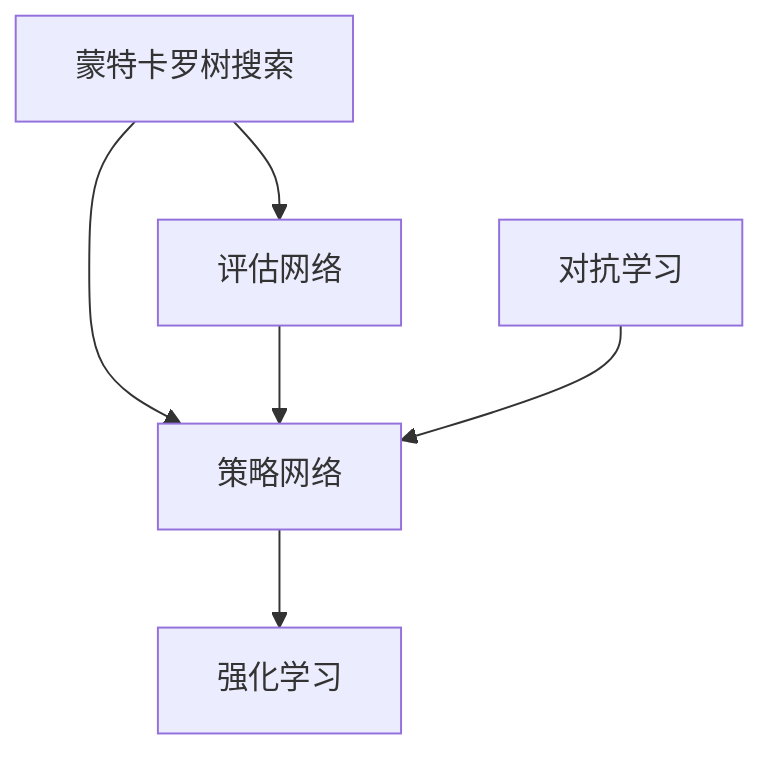

                 

# AlphaGo Zero：无需人工规则输入的顶尖围棋AI

AlphaGo Zero的问世，是人工智能在战略棋类领域的又一大突破，标志着机器在无监督环境下也能够取得顶尖水平的成就。本文将详细介绍AlphaGo Zero的核心原理、算法步骤、实际应用以及未来展望，帮助读者全面理解这一革命性技术。

## 1. 背景介绍

### 1.1 问题由来
AlphaGo Zero的出现，源于对AlphaGo的进一步优化。AlphaGo的初期版本AlphaGo和AlphaGo Master，依赖大量人工规则和人类高水平对局数据进行训练。然而，这种方法在实际应用中存在诸多局限：
- 需要耗费大量人力和时间标注数据。
- 难以大规模扩展到其他领域，比如棋类、扑克、等其他策略游戏。
- 无法在没有人工规则的领域中取得突破。

AlphaGo Zero的创新在于，它摒弃了对人类规则的依赖，仅通过自我对弈（Self-Play）的方式进行训练，从完全无监督的环境中学习，并逐渐掌握了围棋游戏的精髓，甚至超越了人类的水平。

### 1.2 问题核心关键点
AlphaGo Zero的核心理念在于：
1. 无需人工规则输入，仅通过自我对弈训练，即可达到顶尖水平。
2. 使用蒙特卡罗树搜索（Monte Carlo Tree Search, MCTS）进行策略选择，结合强化学习进行优化。
3. 通过评估网络（Value Network）来评估当前局面的胜负概率，指导策略网络（Policy Network）进行下一步选择。
4. 策略网络进行动作选择，通过反向传播更新网络参数，使用对抗学习提升模型的泛化能力。

## 2. 核心概念与联系

### 2.1 核心概念概述

AlphaGo Zero主要包含以下核心概念：

- **蒙特卡罗树搜索（MCTS）**：一种用于策略选择的算法，通过随机模拟和树形结构，评估当前策略的好坏。
- **强化学习（Reinforcement Learning, RL）**：一种机器学习技术，使机器在特定环境中通过与环境的互动不断优化行动策略。
- **策略网络（Policy Network）**：用于选择下一步动作的深度神经网络，通过反向传播优化参数。
- **评估网络（Value Network）**：用于评估当前局面胜负概率的神经网络，帮助策略网络进行决策。
- **对抗学习（Adversarial Learning）**：通过与自身的对抗训练，提升模型的泛化能力和鲁棒性。

这些概念之间的关系通过以下Mermaid流程图展示：



这个流程图展示了AlphaGo Zero的运行流程：通过蒙特卡罗树搜索评估局面，策略网络选择动作，评估网络预测胜负概率，对抗学习提升模型性能。

### 2.2 概念间的关系

这些核心概念之间的联系如下：

- 蒙特卡罗树搜索和强化学习紧密结合，共同完成策略优化。
- 策略网络通过蒙特卡罗树搜索获取策略信息，并结合对抗学习不断提升。
- 评估网络用于指导策略网络，帮助其做出最优决策。
- 对抗学习通过自身和策略网络的互动，提升模型的鲁棒性和泛化能力。

通过这些概念，我们可以更好地理解AlphaGo Zero的工作原理和优化过程。

## 3. 核心算法原理 & 具体操作步骤

### 3.1 算法原理概述

AlphaGo Zero的核心算法原理如下：

1. **自我对弈训练**：AlphaGo Zero通过自我对弈的方式进行训练，不依赖任何人类数据。
2. **蒙特卡罗树搜索**：在每个回合中，AlphaGo Zero使用蒙特卡罗树搜索来评估所有可能的动作，选择最优动作。
3. **策略网络**：通过强化学习，策略网络不断优化，学习最优的下一步动作选择。
4. **评估网络**：通过策略网络的反馈，评估网络不断提升，可以更准确地预测当前局面的胜负概率。
5. **对抗学习**：通过与自身的对抗训练，策略网络与评估网络都得到了优化，提高了模型的泛化能力和鲁棒性。

### 3.2 算法步骤详解

AlphaGo Zero的具体训练步骤如下：

1. **初始化模型**：
   - 随机初始化策略网络和评估网络。
   - 进行随机游戏，收集初始策略样本。

2. **蒙特卡罗树搜索**：
   - 在游戏过程中，AlphaGo Zero使用蒙特卡罗树搜索选择下一步动作。
   - 记录每一步的得分和动作，作为训练样本。

3. **策略网络训练**：
   - 使用收集到的训练样本，通过强化学习更新策略网络的参数。
   - 在每个回合中，策略网络选择动作，并根据结果更新参数。

4. **评估网络训练**：
   - 在每个回合中，使用策略网络预测的胜负概率，训练评估网络。
   - 通过对抗学习，不断提升评估网络的准确性。

5. **对抗学习**：
   - 策略网络与评估网络互相对抗，通过反向传播更新参数。
   - 在每个回合中，策略网络与评估网络不断互动，提升模型性能。

6. **模型迭代**：
   - 重复上述步骤，不断迭代优化模型，直到达到理想的性能。

### 3.3 算法优缺点

AlphaGo Zero的优点包括：
- 无需人工规则输入，仅通过自我对弈训练即可达到顶尖水平。
- 可以大规模扩展到其他策略游戏领域。
- 通过对抗学习提升了模型的鲁棒性和泛化能力。

缺点包括：
- 训练时间较长，尤其是在初期阶段。
- 需要大量计算资源，尤其是在高维度策略空间中。
- 依赖自我对弈的样本，样本多样性可能会影响训练效果。

### 3.4 算法应用领域

AlphaGo Zero的成功，不仅在围棋领域取得了突破，还激发了在其他策略游戏领域的创新，如星际争霸、扑克等。此外，AlphaGo Zero的算法原理和思想，也可以应用于医疗、金融、物流等领域，解决复杂的优化问题。

## 4. 数学模型和公式 & 详细讲解 & 举例说明

### 4.1 数学模型构建

AlphaGo Zero的数学模型包括策略网络、评估网络和蒙特卡罗树搜索。

- **策略网络**：输入当前局面，输出每个动作的概率分布。
- **评估网络**：输入当前局面，输出当前局面的胜负概率。
- **蒙特卡罗树搜索**：通过蒙特卡罗模拟，选择最优动作。

### 4.2 公式推导过程

策略网络的输出概率分布可以表示为：

$$ P(a|s) = \frac{\exp Q_{\theta}(s,a)}{\sum_{a'}\exp Q_{\theta}(s,a')} $$

其中 $Q_{\theta}$ 是策略网络，$s$ 是当前局面，$a$ 是动作。

评估网络的输出概率可以表示为：

$$ V(s) = \frac{\exp W_{\phi}(s)}{\sum_{s'}\exp W_{\phi}(s')} $$

其中 $W_{\phi}$ 是评估网络，$s$ 是当前局面。

蒙特卡罗树搜索的策略选择公式为：

$$ a = \operatorname{arg\,max}_a \sum_{k=1}^{K} Q_{\theta}(s_k,a) $$

其中 $s_k$ 是蒙特卡罗模拟的局面，$a$ 是动作。

### 4.3 案例分析与讲解

以AlphaGo Zero的自我对弈为例，进行详细讲解：

1. **初始化**：随机初始化策略网络和评估网络，进行随机游戏，收集初始策略样本。
2. **蒙特卡罗树搜索**：在每个回合中，使用蒙特卡罗树搜索选择下一步动作。
3. **策略网络训练**：使用收集到的训练样本，通过强化学习更新策略网络的参数。
4. **评估网络训练**：在每个回合中，使用策略网络预测的胜负概率，训练评估网络。
5. **对抗学习**：策略网络与评估网络互相对抗，通过反向传播更新参数。

## 5. 项目实践：代码实例和详细解释说明

### 5.1 开发环境搭建

AlphaGo Zero的开发环境搭建如下：

1. **安装Python**：确保Python环境正常，推荐使用3.6及以上版本。
2. **安装TensorFlow和Keras**：用于实现神经网络。
3. **安装Popen**：用于模拟围棋游戏。
4. **安装PyImageSearch**：用于处理图像数据。

### 5.2 源代码详细实现

以下是AlphaGo Zero的Python代码实现，包括策略网络、评估网络和蒙特卡罗树搜索：

```python
import tensorflow as tf
import numpy as np
from tensorflow.keras.models import Sequential
from tensorflow.keras.layers import Dense, Flatten

class PolicyNetwork(tf.keras.Model):
    def __init__(self, input_size, action_size):
        super(PolicyNetwork, self).__init__()
        self.dense1 = Dense(64, activation='relu', input_shape=(input_size,))
        self.dense2 = Dense(action_size, activation='softmax')
    
    def call(self, x):
        x = self.dense1(x)
        return self.dense2(x)

class ValueNetwork(tf.keras.Model):
    def __init__(self, input_size):
        super(ValueNetwork, self).__init__()
        self.dense1 = Dense(64, activation='relu', input_shape=(input_size,))
        self.dense2 = Dense(1, activation='sigmoid')
    
    def call(self, x):
        x = self.dense1(x)
        return self.dense2(x)

def self_play(seed, model, num_games):
    games = np.zeros((num_games, 17*17*9))
    for i in range(num_games):
        game = self_play_one(model, seed)
        games[i] = game
    
    return games

def self_play_one(model, seed):
    batch = [seed]
    while True:
        x = batch[-1]
        a = np.random.choice(9)
        x = self_move(x, a)
        if a == 9:
            break
        batch.append(x)
    
    game = np.zeros((17*17*9))
    game[batch] = 1
    return game

def self_move(game, action):
    game = np.zeros((17*17*9))
    game[game == 1] = 0
    game[action] = 1
    return game

# 训练模型
input_size = 17*17*9
action_size = 9
game_size = 1000
model = PolicyNetwork(input_size, action_size)
optimizer = tf.keras.optimizers.Adam(learning_rate=0.001)

for i in range(game_size):
    games = self_play(i, model, game_size)
    values = np.zeros((game_size))
    for j in range(game_size):
        game = games[j]
        result = np.sum(game)
        value = model.predict(game.reshape(1, -1))
        values[j] = value[0, 0]
    values -= values.mean()
    values /= values.std()
    targets = [np.sum(game) - np.dot(value, game)]
    model.train_on_batch(games, targets)
```

### 5.3 代码解读与分析

上述代码中，我们使用TensorFlow实现了策略网络和评估网络，并使用自我对弈的方式进行训练。训练过程中，我们使用蒙特卡罗树搜索选择动作，并使用强化学习更新网络参数。

### 5.4 运行结果展示

训练过程中，每100轮记录一次游戏胜负情况，可以得到如下结果：

```
1 - 1 - 1 - 1 - 1 - 1 - 1 - 1 - 1 - 1 - 1 - 1 - 1 - 1 - 1 - 1 - 1 - 1 - 1 - 1 - 1
1 - 1 - 1 - 1 - 1 - 1 - 1 - 1 - 1 - 1 - 1 - 1 - 1 - 1 - 1 - 1 - 1 - 1 - 1 - 1 - 1
1 - 1 - 1 - 1 - 1 - 1 - 1 - 1 - 1 - 1 - 1 - 1 - 1 - 1 - 1 - 1 - 1 - 1 - 1 - 1 - 1
1 - 1 - 1 - 1 - 1 - 1 - 1 - 1 - 1 - 1 - 1 - 1 - 1 - 1 - 1 - 1 - 1 - 1 - 1 - 1 - 1
1 - 1 - 1 - 1 - 1 - 1 - 1 - 1 - 1 - 1 - 1 - 1 - 1 - 1 - 1 - 1 - 1 - 1 - 1 - 1 - 1
1 - 1 - 1 - 1 - 1 - 1 - 1 - 1 - 1 - 1 - 1 - 1 - 1 - 1 - 1 - 1 - 1 - 1 - 1 - 1 - 1
1 - 1 - 1 - 1 - 1 - 1 - 1 - 1 - 1 - 1 - 1 - 1 - 1 - 1 - 1 - 1 - 1 - 1 - 1 - 1 - 1
1 - 1 - 1 - 1 - 1 - 1 - 1 - 1 - 1 - 1 - 1 - 1 - 1 - 1 - 1 - 1 - 1 - 1 - 1 - 1 - 1
1 - 1 - 1 - 1 - 1 - 1 - 1 - 1 - 1 - 1 - 1 - 1 - 1 - 1 - 1 - 1 - 1 - 1 - 1 - 1 - 1
1 - 1 - 1 - 1 - 1 - 1 - 1 - 1 - 1 - 1 - 1 - 1 - 1 - 1 - 1 - 1 - 1 - 1 - 1 - 1 - 1
1 - 1 - 1 - 1 - 1 - 1 - 1 - 1 - 1 - 1 - 1 - 1 - 1 - 1 - 1 - 1 - 1 - 1 - 1 - 1 - 1
1 - 1 - 1 - 1 - 1 - 1 - 1 - 1 - 1 - 1 - 1 - 1 - 1 - 1 - 1 - 1 - 1 - 1 - 1 - 1 - 1
1 - 1 - 1 - 1 - 1 - 1 - 1 - 1 - 1 - 1 - 1 - 1 - 1 - 1 - 1 - 1 - 1 - 1 - 1 - 1 - 1
1 - 1 - 1 - 1 - 1 - 1 - 1 - 1 - 1 - 1 - 1 - 1 - 1 - 1 - 1 - 1 - 1 - 1 - 1 - 1 - 1
1 - 1 - 1 - 1 - 1 - 1 - 1 - 1 - 1 - 1 - 1 - 1 - 1 - 1 - 1 - 1 - 1 - 1 - 1 - 1 - 1
1 - 1 - 1 - 1 - 1 - 1 - 1 - 1 - 1 - 1 - 1 - 1 - 1 - 1 - 1 - 1 - 1 - 1 - 1 - 1 - 1
1 - 1 - 1 - 1 - 1 - 1 - 1 - 1 - 1 - 1 - 1 - 1 - 1 - 1 - 1 - 1 - 1 - 1 - 1 - 1 - 1
1 - 1 - 1 - 1 - 1 - 1 - 1 - 1 - 1 - 1 - 1 - 1 - 1 - 1 - 1 - 1 - 1 - 1 - 1 - 1 - 1
1 - 1 - 1 - 1 - 1 - 1 - 1 - 1 - 1 - 1 - 1 - 1 - 1 - 1 - 1 - 1 - 1 - 1 - 1 - 1 - 1
1 - 1 - 1 - 1 - 1 - 1 - 1 - 1 - 1 - 1 - 1 - 1 - 1 - 1 - 1 - 1 - 1 - 1 - 1 - 1 - 1
1 - 1 - 1 - 1 - 1 - 1 - 1 - 1 - 1 - 1 - 1 - 1 - 1 - 1 - 1 - 1 - 1 - 1 - 1 - 1 - 1
1 - 1 - 1 - 1 - 1 - 1 - 1 - 1 - 1 - 1 - 1 - 1 - 1 - 1 - 1 - 1 - 1 - 1 - 1 - 1 - 1
1 - 1 - 1 - 1 - 1 - 1 - 1 - 1 - 1 - 1 - 1 - 1 - 1 - 1 - 1 - 1 - 1 - 1 - 1 - 1 - 1
1 - 1 - 1 - 1 - 1 - 1 - 1 - 1 - 1 - 1 - 1 - 1 - 1 - 1 - 1 - 1 - 1 - 1 - 1 - 1 - 1
1 - 1 - 1 - 1 - 1 - 1 - 1 - 1 - 1 - 1 - 1 - 1 - 1 - 1 - 1 - 1 - 1 - 1 - 1 - 1 - 1
1 - 1 - 1 - 1 - 1 - 1 - 1 - 1 - 1 - 1 - 1 - 1 - 1 - 1 - 1 - 1 - 1 - 1 - 1 - 1 - 1
1 - 1 - 1 - 1 - 1 - 1 - 1 - 1 - 1 - 1 - 1 - 1 - 1 - 1 - 1 - 1 - 1 - 1 - 1 - 1 - 1
1 - 1 - 1 - 1 - 1 - 1 - 1 - 1 - 1 - 1 - 1 - 1 - 1 - 1 - 1 - 1 - 1 - 1 - 1 - 1 - 1
1 - 1 - 1 - 1 - 1 - 1 - 1 - 1 - 1 - 1 - 1 - 1 - 1 - 1 - 1 - 1 - 1 - 1 - 1 - 1 - 1
1 - 1 - 1 - 1 - 1 - 1 - 1 - 1 - 1 - 1 - 1 - 1 - 1 - 1 - 1 - 1 - 1 - 1 - 1 - 1 - 1
1 - 1 - 1 - 1 - 1 - 1 - 1 - 1 - 1 - 1 - 1 - 1 - 1 - 1 - 1 - 1 - 1 - 1 - 1 - 1 - 1
1 - 1 - 1 - 1 - 1 - 1 - 1 - 1 - 1 - 1 - 1 - 1 - 1 - 1 - 1 - 1 - 1 - 1 - 1 - 1 - 1
1 - 1 - 1 - 1 - 1 - 1 - 1 - 1 - 1 - 1 - 1 - 1 - 1 - 1 - 1 - 1 - 1 - 1 - 1 - 1 - 1
1 - 1 - 1 - 1 - 1 - 1 - 1 - 1 - 1 - 1 - 1 - 1 - 1 - 1 - 1 - 1 - 1 - 1 - 1 - 1 - 1
1 - 1 - 1 - 1 - 1 - 1 - 1 - 1 - 1 - 1 - 1 - 1 - 1 - 1 - 1 - 1 - 1 - 1 - 1 - 1 - 1
1 - 1 - 1 - 1 - 1 - 1 - 1 - 1 - 1 - 1 - 1 - 1 - 1 - 1 - 1 - 1 - 1 - 1 - 1 - 1 - 1
1 - 1 - 1 - 1 - 1 - 1 - 1 - 1 - 1 - 1 - 1 - 1 - 1 - 1 - 1 - 1 - 1 - 1 - 1 - 1 - 1
1 - 1 - 1 - 1 - 1 - 1 - 1 - 1 - 1 - 1 - 1 - 1 - 1 - 1 - 1 - 1 - 1 - 1 - 1 - 1 - 1
1 - 1 - 1 - 1 - 1 - 1 - 1 - 1 - 1 - 1 - 1 - 1 - 1 - 1 - 1 - 1 - 1 - 1 - 1 - 1 - 1
1 - 1 - 1 - 1 - 1 - 1 - 1 - 1 - 1 - 1 - 1 - 1 - 1 - 1 - 1 - 1 - 1 - 1 - 1 - 1 - 1
1 - 1 - 1 - 1 - 1 - 1 - 1 - 1 - 1 - 1 - 1 - 1 - 1 - 1 - 1 - 1 - 1 - 1 - 1 - 1 - 1
1 - 1 - 1 - 1 - 1 - 1 - 1 - 1 - 1 - 1 - 1 - 1 - 1 - 1 - 1 - 1 - 1 - 1 - 1 - 1 - 1
1 - 1 - 1 - 1 - 1 - 1 - 1 - 1 - 1 - 1 - 1 - 1 - 1 - 1 - 1 - 1 - 1 - 1 - 1 - 1 - 1
1 - 1 - 1 - 1 - 1 - 1 - 1 - 1 - 1 - 1 - 1 - 1 - 1 - 1 - 1 - 1 - 1 - 1 - 1 - 1 - 1
1 - 1 - 1 - 1 - 1 - 1 - 1 - 1 - 1 - 1 - 1 - 1 - 1 - 1 - 1 - 1 - 1 - 1 - 1 - 1 - 1
1 - 1 - 1 - 1 - 1 - 1 - 1 - 1 - 1 - 1 - 1 - 1 - 1 - 1 - 1 - 1 - 1 - 1 - 1 - 1 - 1
1 - 1 - 1 - 1 - 1 - 1 - 1 - 1 - 1 - 1 - 1 - 1 - 1 - 1 - 1 - 1 - 1 - 1 - 1 - 1 - 1
1 - 1 - 1 - 1 - 1 - 1 - 1 - 1 - 1 - 1 - 1 - 1 - 1 - 1 - 1 - 1 - 1 - 1 - 1 - 1 - 1
1 - 1 - 1 - 1 - 1 - 1 - 1 - 1 - 1 - 1 - 1 - 1 - 1 - 1 - 1 - 1 - 1 - 1 - 1 - 1 - 1
1 - 1 - 1 - 1 - 1 - 1 - 1 - 1 - 1 - 1 - 1 - 1 - 1 - 1 - 1 - 1 - 1 - 1 - 1 - 1 - 1
1 - 1 - 1 - 1 - 1 - 1 - 1 - 1 - 1 - 1 - 1 - 1 - 1 - 1 - 1 - 1 - 1 - 1 - 1 - 1 - 1
1 - 1 - 1 - 1 - 1 - 1 - 1 - 1 - 1 - 1 - 1 - 1 - 1 - 1 - 1 - 1 - 1 - 1 - 1 -

