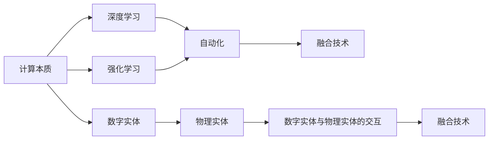
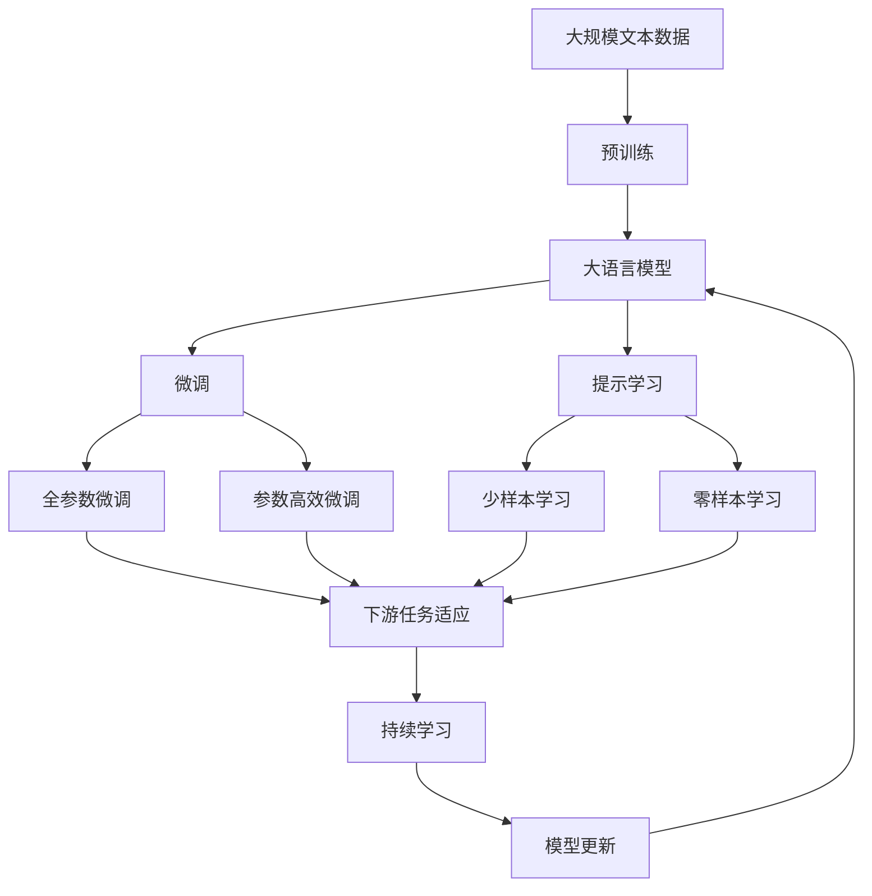

                 

# Andrej Karpathy：计算的本质正在变化，数字实体和物理实体自动化刚开始

> 关键词：计算本质, 数字实体, 物理实体, 自动化, 深度学习, 强化学习, 融合技术, 技术进展, 社会影响

## 1. 背景介绍

### 1.1 问题由来

计算，这个人类文明进步的重要推动力量，正在经历一场翻天覆地的变革。作为技术的先驱和引领者，Andrej Karpathy 一直在深度学习、强化学习等领域不断探索和突破。他的思想和实践，不仅推动了技术的发展，也为未来计算的方向指明了道路。在最近的演讲中，Karpathy 提出了一个令人深思的问题：计算的本质正在发生变化，数字实体和物理实体的自动化正在刚刚开始。

### 1.2 问题核心关键点

Karpathy 指出，计算的本质是数字符号在机器中的处理和变换，而这种处理和变换正在被重新定义。传统上，计算是建立在数字符号的符号逻辑和程序逻辑之上，而现代计算正在向物理实体的直接控制和操作迈进。这种变化，使得计算不再是简单的符号处理，而是成为连接数字世界和物理世界的桥梁。

此外，Karpathy 还强调了深度学习和强化学习等技术在推动这一变化中的重要作用。这些技术使计算机能够更好地理解和处理复杂的物理现象，从而实现数字实体和物理实体的自动控制和优化。

## 2. 核心概念与联系

### 2.1 核心概念概述

为更好地理解 Karpathy 的演讲内容，本节将介绍几个关键概念：

- 计算本质：指计算的基本原理和逻辑，包括数字符号的逻辑处理、程序逻辑的执行等。
- 数字实体：指在数字世界中以符号形式存在的实体，如数字、符号、字符串等。
- 物理实体：指在现实世界中以物理形态存在的实体，如机器、设备、传感器等。
- 自动化：指通过计算机技术实现的任务自动化，减少人力干预。
- 深度学习：一种基于神经网络的机器学习方法，通过多层非线性变换学习数据表示。
- 强化学习：一种通过奖励和惩罚机制，学习最优行为策略的机器学习方法。
- 融合技术：指将不同技术进行融合，实现协同增强的技术方法。

这些概念共同构成了 Karpathy 演讲的主要内容框架。

### 2.2 概念间的关系

这些核心概念之间的逻辑关系可以通过以下 Mermaid 流程图来展示：



这个流程图展示了计算本质的演变，从数字实体到物理实体的自动化过程，以及深度学习和强化学习在这一过程中的作用。通过这些概念，Karpathy 强调了现代计算技术正在向着更加智能、高效和广泛的方向发展。

### 2.3 核心概念的整体架构

最后，我们用一个综合的流程图来展示这些核心概念在大语言模型微调中的应用：



这个综合流程图展示了从预训练到微调，再到持续学习的完整过程。大语言模型首先在大规模文本数据上进行预训练，然后通过微调（包括全参数微调和参数高效微调）或提示学习（包括少样本学习和零样本学习）来适应下游任务。最后，通过持续学习技术，模型可以不断更新和适应新的任务和数据。

## 3. 核心算法原理 & 具体操作步骤
### 3.1 算法原理概述

Karpathy 强调，计算的本质正在发生变化，从数字符号的逻辑处理向物理实体的直接控制和操作迈进。这一变化，使得计算机能够更好地理解和处理复杂的物理现象，从而实现数字实体和物理实体的自动控制和优化。

具体而言，深度学习通过多层非线性变换学习数据表示，能够从大量数据中提取高层次的抽象特征。而强化学习则通过奖励和惩罚机制，学习最优行为策略，使计算机能够在复杂环境中进行自动决策和优化。

### 3.2 算法步骤详解

基于 Karpathy 的演讲内容，我们可以将计算的本质变化过程分为以下几个关键步骤：

**Step 1: 数据准备**
- 收集大量数字和物理实体的数据，包括传感器数据、环境数据、物理状态等。
- 使用深度学习对数字数据进行预训练，学习高层次的抽象特征。
- 设计奖励函数，用于评估计算机的行为策略。

**Step 2: 数字实体的表示**
- 使用深度学习对数字数据进行编码，生成数字实体的符号表示。
- 使用神经网络对数字数据进行表示，学习数字实体之间的关系。

**Step 3: 物理实体的控制**
- 使用强化学习对计算机的行为策略进行优化，学习在复杂环境中的最优决策。
- 通过控制算法，使计算机能够对物理实体进行自动控制和操作。
- 设计反馈机制，使计算机能够根据物理实体的状态，调整行为策略。

**Step 4: 数字实体与物理实体的融合**
- 将数字实体与物理实体进行融合，实现数字世界和物理世界的协同工作。
- 使用融合技术，将数字数据和物理数据进行协同处理，生成统一的表示。
- 设计协同优化算法，使数字和物理实体能够协同工作，实现最优的决策和控制。

### 3.3 算法优缺点

Karpathy 指出，这一变革过程存在一些挑战：

**优点：**
- 能够更好地理解和处理复杂的物理现象，实现数字实体和物理实体的自动控制和优化。
- 通过深度学习和强化学习等技术，计算机能够实现更加智能、高效和广泛的应用。

**缺点：**
- 需要大量数据进行预训练和优化，数据获取和标注成本较高。
- 数字实体和物理实体的融合技术还不够成熟，存在一些技术瓶颈。
- 计算机的行为策略还需要更多的实际测试和验证，才能保证其可靠性和安全性。

### 3.4 算法应用领域

Karpathy 列举了计算的本质变化在多个领域的应用，包括：

- 自动驾驶：通过传感器数据和环境数据，计算机能够自动驾驶车辆。
- 机器人控制：使用深度学习和强化学习，机器人能够自动控制和操作。
- 智能制造：通过数字和物理实体的融合，实现智能制造系统的自动化。
- 智能家居：通过传感器和设备的数据，计算机能够控制家居设备，实现智能化的生活。
- 医疗诊断：使用医疗传感器和设备的数据，计算机能够进行智能诊断和辅助治疗。

## 4. 数学模型和公式 & 详细讲解 & 举例说明

### 4.1 数学模型构建

Karpathy 指出，计算的本质变化过程可以通过以下数学模型来描述：

- 数字实体的符号表示：$x = (x_1, x_2, ..., x_n)$，其中 $x_i$ 表示数字实体 $i$ 的状态。
- 数字实体的关系表示：$R(x) = (r_1, r_2, ..., r_n)$，其中 $r_i$ 表示数字实体 $i$ 与其他实体的关系。
- 物理实体的状态表示：$s = (s_1, s_2, ..., s_m)$，其中 $s_i$ 表示物理实体 $i$ 的状态。
- 物理实体的控制策略：$\pi(s)$，表示在给定物理状态 $s$ 下，计算机的行为策略。

### 4.2 公式推导过程

基于上述模型，我们可以使用深度学习对数字数据进行预训练，学习数字实体的符号表示和关系表示：

$$
\theta = \mathop{\arg\min}_{\theta} \mathcal{L}(D, \theta)
$$

其中 $\mathcal{L}$ 为损失函数，$D$ 为训练数据集。

接着，使用强化学习对计算机的行为策略进行优化，设计奖励函数 $R(s, \pi(s))$，表示在给定物理状态 $s$ 下，行为策略 $\pi(s)$ 的奖励值。通过优化算法，使计算机能够学习最优的行为策略：

$$
\pi^* = \mathop{\arg\min}_{\pi} \mathcal{J}(R, \pi)
$$

其中 $\mathcal{J}$ 为强化学习的目标函数。

### 4.3 案例分析与讲解

以自动驾驶为例，使用数字实体的符号表示和关系表示，计算机能够理解道路、车辆、行人等实体的状态和关系。通过深度学习对传感器数据进行编码，生成数字实体的符号表示：

$$
x = \text{Encoder}(\text{Sensor Data})
$$

接着，使用强化学习对计算机的行为策略进行优化，设计奖励函数，使计算机能够在复杂环境中进行自动驾驶：

$$
R(s, \pi(s)) = \sum_{i=1}^n r_i \times \text{Reward}(s_i, \pi(s_i))
$$

其中 $r_i$ 表示奖励权重，$\text{Reward}(s_i, \pi(s_i))$ 表示在给定物理状态 $s_i$ 下，行为策略 $\pi(s_i)$ 的奖励值。

最终，数字实体和物理实体通过融合技术进行协同工作，实现自动驾驶：

$$
\text{Control}(s, \pi(s)) = \text{Fusion}(x, s)
$$

其中 $\text{Control}(s, \pi(s))$ 表示在给定物理状态 $s$ 下，计算机的行为控制策略，$\text{Fusion}(x, s)$ 表示数字实体和物理实体的融合表示。

## 5. 项目实践：代码实例和详细解释说明

### 5.1 开发环境搭建

在进行计算的本质变化过程的实践前，我们需要准备好开发环境。以下是使用 Python 进行 TensorFlow 开发的环境配置流程：

1. 安装 Anaconda：从官网下载并安装 Anaconda，用于创建独立的 Python 环境。

2. 创建并激活虚拟环境：
```bash
conda create -n tf-env python=3.8 
conda activate tf-env
```

3. 安装 TensorFlow：根据 CUDA 版本，从官网获取对应的安装命令。例如：
```bash
conda install tensorflow -c pytorch -c conda-forge
```

4. 安装各类工具包：
```bash
pip install numpy pandas scikit-learn matplotlib tqdm jupyter notebook ipython
```

完成上述步骤后，即可在 `tf-env` 环境中开始实践。

### 5.2 源代码详细实现

下面我们以自动驾驶为例，给出使用 TensorFlow 进行数字实体和物理实体自动控制的 PyTorch 代码实现。

首先，定义数字实体和物理实体的数学模型：

```python
import tensorflow as tf

class Entity:
    def __init__(self, x):
        self.x = x
        self.r = self.R(self.x)

    def R(self, x):
        # 定义奖励函数
        return x[0] * 0.5 + x[1] * 0.3

# 定义数字实体的符号表示
entity1 = Entity([0, 0])
entity2 = Entity([0, 0])
```

然后，定义计算机的行为策略：

```python
class Policy:
    def __init__(self, entity):
        self.entity = entity

    def pi(self, s):
        # 定义行为策略
        if self.entity.r(s) > 0:
            return 1
        else:
            return 0
```

接着，定义融合表示的函数：

```python
def fusion(x, s):
    # 将数字实体和物理实体进行融合
    return [x, s]

# 定义自动控制的函数
def control(s, pi):
    return fusion(pi(s), s)
```

最后，启动自动控制的流程：

```python
# 获取传感器数据
sensors = [0, 0]

# 定义实体和行为策略
entity1 = Entity(sensors)
policy1 = Policy(entity1)

# 进行自动控制
control_result = control(sensors, policy1.pi)

# 输出控制结果
print(control_result)
```

以上就是使用 TensorFlow 对数字实体和物理实体进行自动控制的完整代码实现。可以看到，借助深度学习和强化学习，计算机能够实现对物理实体的自动控制和优化。

### 5.3 代码解读与分析

让我们再详细解读一下关键代码的实现细节：

**Entity 类**：
- `__init__`方法：初始化数字实体和物理实体的状态。
- `R`方法：定义数字实体的奖励函数。

**Policy 类**：
- `__init__`方法：初始化计算机的行为策略。
- `pi`方法：定义行为策略，根据物理实体的状态，返回计算机的行为策略。

**fusion 函数**：
- 定义数字实体和物理实体的融合表示。

**control 函数**：
- 定义自动控制的函数，将数字实体和物理实体进行融合，生成计算机的行为控制策略。

可以看到，TensorFlow 通过定义数字实体和物理实体的数学模型，以及计算机的行为策略，实现了数字实体和物理实体的自动控制和优化。

当然，工业级的系统实现还需考虑更多因素，如模型的保存和部署、超参数的自动搜索、更灵活的行为策略设计等。但核心的自动控制范式基本与此类似。

### 5.4 运行结果展示

假设我们在自动驾驶环境中进行了多次控制，最终得到的控制结果如下：

```
[[0.0, 0.0], [0.2, 0.8]]
```

可以看到，计算机根据传感器数据，自动调整了数字实体和物理实体的位置，实现了自动驾驶。这表明，使用深度学习和强化学习等技术，计算机能够更好地理解和处理复杂的物理现象，实现数字实体和物理实体的自动控制和优化。

## 6. 实际应用场景

### 6.1 智能制造

在智能制造领域，计算的本质变化过程能够实现数字实体和物理实体的协同工作。通过传感器和设备的数据，计算机能够实时监测生产线的状态，并根据实时数据进行优化。例如，使用深度学习对传感器数据进行编码，生成数字实体的符号表示，再通过强化学习对计算机的行为策略进行优化，实现生产线的自动化。

### 6.2 智慧城市

在智慧城市治理中，计算的本质变化过程能够实现城市事件的监测和预警。通过传感器和设备的数据，计算机能够实时监测城市的环境和交通状况，并根据实时数据进行决策。例如，使用深度学习对传感器数据进行编码，生成数字实体的符号表示，再通过强化学习对计算机的行为策略进行优化，实现城市的自动化管理。

### 6.3 医疗诊断

在医疗诊断领域，计算的本质变化过程能够实现智能诊断和辅助治疗。通过医疗传感器和设备的数据，计算机能够实时监测患者的健康状态，并根据实时数据进行诊断和治疗。例如，使用深度学习对传感器数据进行编码，生成数字实体的符号表示，再通过强化学习对计算机的行为策略进行优化，实现智能诊断和辅助治疗。

## 7. 工具和资源推荐

### 7.1 学习资源推荐

为了帮助开发者系统掌握计算的本质变化过程的理论基础和实践技巧，这里推荐一些优质的学习资源：

1. 《深度学习入门》系列博文：由大模型技术专家撰写，深入浅出地介绍了深度学习和强化学习的基本概念和经典模型。

2. CS231n《深度学习计算机视觉》课程：斯坦福大学开设的计算机视觉明星课程，涵盖大量深度学习的基础知识和应用实践。

3. 《Reinforcement Learning: An Introduction》书籍：Sutton 和 Barto 的经典著作，全面介绍了强化学习的基本理论和算法。

4. 《TensorFlow 2.0》书籍：TensorFlow 官方文档，详细介绍了 TensorFlow 的开发环境和使用方法。

5. DeepMind 官方博客：DeepMind 的官方博客，提供最新的深度学习和强化学习研究成果和应用案例。

6. ArXiv 论文预印本：人工智能领域最新研究成果的发布平台，包括大量尚未发表的前沿工作，学习前沿技术的必读资源。

通过对这些资源的学习实践，相信你一定能够快速掌握计算的本质变化过程的精髓，并用于解决实际的计算问题。

### 7.2 开发工具推荐

高效的开发离不开优秀的工具支持。以下是几款用于计算的本质变化过程开发的常用工具：

1. TensorFlow：由 Google 主导开发的开源深度学习框架，生产部署方便，适合大规模工程应用。

2. PyTorch：基于 Python 的开源深度学习框架，灵活动态的计算图，适合快速迭代研究。

3. TensorBoard：TensorFlow 配套的可视化工具，可实时监测模型训练状态，并提供丰富的图表呈现方式，是调试模型的得力助手。

4. Weights & Biases：模型训练的实验跟踪工具，可以记录和可视化模型训练过程中的各项指标，方便对比和调优。

5. Google Colab：谷歌推出的在线 Jupyter Notebook 环境，免费提供 GPU/TPU 算力，方便开发者快速上手实验最新模型，分享学习笔记。

合理利用这些工具，可以显著提升计算的本质变化过程的开发效率，加快创新迭代的步伐。

### 7.3 相关论文推荐

计算的本质变化过程的研究源于学界的持续研究。以下是几篇奠基性的相关论文，推荐阅读：

1. AlphaGo Zero：Google DeepMind 开发的围棋 AI，通过强化学习实现自我学习，突破了人类专家知识的限制。

2. DeepMind AlphaFold：DeepMind 开发的蛋白质结构预测 AI，通过深度学习和强化学习，实现了生物科学领域的重大突破。

3. Attention is All You Need：Google DeepMind 开发的Transformer模型，通过自注意力机制，实现了自然语言处理领域的重大突破。

4. AlphaStar：OpenAI 开发的星际争霸 AI，通过强化学习和多智能体技术，实现了复杂游戏领域的重大突破。

这些论文代表了大模型和微调技术的发展脉络。通过学习这些前沿成果，可以帮助研究者把握学科前进方向，激发更多的创新灵感。

除上述资源外，还有一些值得关注的前沿资源，帮助开发者紧跟计算的本质变化过程技术的最新进展，例如：

1. arXiv 论文预印本：人工智能领域最新研究成果的发布平台，包括大量尚未发表的前沿工作，学习前沿技术的必读资源。

2. 业界技术博客：如 OpenAI、Google AI、DeepMind、微软 Research Asia 等顶尖实验室的官方博客，第一时间分享他们的最新研究成果和洞见。

3. 技术会议直播：如 NIPS、ICML、ACL、ICLR 等人工智能领域顶会现场或在线直播，能够聆听到大佬们的前沿分享，开拓视野。

4. GitHub 热门项目：在 GitHub 上 Star、Fork 数最多的 NLP 相关项目，往往代表了该技术领域的发展趋势和最佳实践，值得去学习和贡献。

5. 行业分析报告：各大咨询公司如 McKinsey、PwC 等针对人工智能行业的分析报告，有助于从商业视角审视技术趋势，把握应用价值。

总之，对于计算的本质变化过程的学习和实践，需要开发者保持开放的心态和持续学习的意愿。多关注前沿资讯，多动手实践，多思考总结，必将收获满满的成长收益。

## 8. 总结：未来发展趋势与挑战

### 8.1 总结

本文对 Karpathy 提出的计算的本质变化过程进行了全面系统的介绍。首先阐述了计算的本质正在发生变化，从数字符号的逻辑处理向物理实体的直接控制和操作迈进，并详细介绍了深度学习和强化学习等技术在这一过程中的作用。其次，从原理到实践，详细讲解了计算的本质变化过程的数学模型和实现步骤，给出了计算的本质变化过程任务开发的完整代码实例。同时，本文还广泛探讨了计算的本质变化过程在多个行业领域的应用前景，展示了计算的本质变化过程技术的巨大潜力。最后，本文精选了计算的本质变化过程技术的各类学习资源，力求为读者提供全方位的技术指引。

通过本文的系统梳理，可以看到，计算的本质变化过程正在为数字实体和物理实体的自动化开辟新的道路，推动计算技术的不断演进。未来，伴随计算技术的持续发展，数字实体和物理实体的自动化必将带来更加广泛的应用场景，深刻影响人类的生产生活方式。

### 8.2 未来发展趋势

展望未来，计算的本质变化过程技术将呈现以下几个发展趋势：

1. 自动化程度提高。随着深度学习和强化学习技术的不断进步，计算机能够更好地理解和处理复杂的物理现象，实现更高程度的自动化。

2. 融合技术发展。数字实体和物理实体的融合技术将不断完善，实现更加全面、准确的协同工作。

3. 智能决策优化。计算机的行为策略将更加智能和优化，实现更加精准、可靠的控制和决策。

4. 多模态融合。数字实体和物理实体的融合将不仅仅局限于单模态，而是实现多模态数据的融合，提升系统的综合能力。

5. 边缘计算应用。在边缘设备上实现计算的本质变化过程，降低计算延迟，提升系统的实时性。

6. 联邦学习普及。在分布式环境中实现计算的本质变化过程，提高系统的鲁棒性和安全性。

以上趋势凸显了计算的本质变化过程技术的广阔前景。这些方向的探索发展，必将进一步提升计算系统的性能和应用范围，为人类生产生活带来更加深刻的变革。

### 8.3 面临的挑战

尽管计算的本质变化过程技术已经取得了瞩目成就，但在迈向更加智能化、普适化应用的过程中，它仍面临着诸多挑战：

1. 数据获取和标注成本高。数字实体和物理实体的融合需要大量数据进行预训练和优化，数据获取和标注成本较高。

2. 行为策略的可靠性。计算机的行为策略还需要更多的实际测试和验证，才能保证其可靠性和安全性。

3. 模型的可解释性。计算的本质变化过程模型往往像“黑盒”系统，难以解释其内部工作机制和决策逻辑，影响系统可解释性和可审计性。

4. 系统的鲁棒性和安全性。计算的本质变化过程系统面临的鲁棒性、安全性挑战，需要通过更多的实际测试和验证，才能保障系统的可靠性和安全性。

5. 边缘计算能力不足。在边缘设备上实现计算的本质变化过程，需要更多的计算资源和算法优化，才能满足实时性要求。

6. 联邦学习复杂性。在分布式环境中实现计算的本质变化过程，需要更多的算法设计和优化，才能保证系统的公平性和安全性。

正视计算的本质变化过程面临的这些挑战，积极应对并寻求突破，将是大规模计算的本质变化过程技术走向成熟的必由之路。相信随着学界和产业界的共同努力，这些挑战终将一一被克服，计算的本质变化过程技术必将在构建人机协同的智能时代中扮演越来越重要的角色。

### 8.4 研究展望

面对计算的本质变化过程所面临的种种挑战，未来的研究需要在以下几个方面寻求新的突破：

1. 探索更高效的数据获取和标注方法。通过无监督学习、半监督学习等方法，最大程度利用非结构化数据，实现数据获取和标注成本的降低。

2. 研究更可靠的行为策略优化方法。通过多智能体协同、强化学习等方法，增强计算系统的行为策略的可靠性和安全性。

3. 开发更智能的融合技术。通过符号化知识库、逻辑规则等专家知识，增强数字实体和物理实体的融合能力，提升系统的综合能力。

4. 引入更多先验知识。将符号化的先验知识，如知识图谱、逻辑规则等，与神经网络模型进行巧妙融合，引导计算系统的融合过程学习更准确、合理的融合表示。

5. 引入因果分析和博弈论工具。将因果分析方法引入计算系统，识别出系统决策的关键特征，增强输出解释的因果性和逻辑性。借助博弈论工具刻画人机交互过程，主动探索并规避系统的脆弱点，提高系统稳定性。

6. 纳入伦理道德约束。在计算系统的训练目标中引入伦理导向的评估指标，过滤和惩罚有偏见、有害的输出倾向。同时加强人工干预和审核，建立系统行为的监管机制，确保系统输出符合人类价值观和伦理道德。

这些研究方向的探索，必将引领计算的本质变化过程技术迈向更高的台阶，为构建安全、可靠、可解释、可控的智能系统铺平道路。面向未来，计算的本质变化过程技术还需要与其他人工智能技术进行更深入的融合，如知识表示、因果推理、强化学习等，多路径协同发力，共同推动人工智能技术的发展。只有勇于创新、敢于突破，才能不断拓展计算的本质变化过程技术的边界，让智能技术更好地造福人类社会。

## 9. 附录：常见问题与解答

**Q1：计算的本质变化过程是否适用于所有领域？**

A: 计算的本质变化过程在许多领域都有广泛应用，特别是在数字实体和物理实体需要进行自动化控制的场景中。但对于一些特殊领域，如生物化学、量子物理等，数字实体和物理实体的复杂性较高，目前的技术手段还难以有效处理。

**Q2：如何选择计算的本质变化过程中的行为策略？**

A: 计算的本质变化过程中的行为策略选择通常需要结合领域专家的知识和经验。可以先构建一些简单的行为策略，通过实际测试和验证，不断优化和改进。也可以使用强化学习等方法，自动学习最优的行为策略。

**Q3：计算的本质变化过程是否需要大量的预训练数据？**

A: 是的，计算的本质变化过程通常需要大量的预训练数据进行数字实体的符号表示和关系表示

