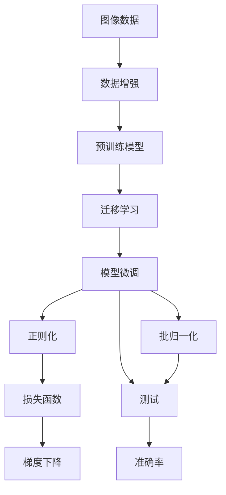
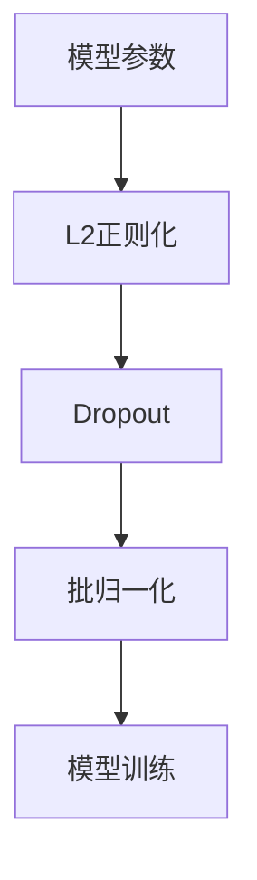

                 

# CIFAR-10图像分类

> 关键词：CIFAR-10, 图像分类, 深度学习, 卷积神经网络, 迁移学习, 预训练模型, 模型微调

## 1. 背景介绍

### 1.1 问题由来
CIFAR-10是计算机视觉领域经典的数据集之一，包含60000张32x32像素的彩色图像，共有10个类别，每个类别有6000张图像。它的主要应用场景包括物体识别、图像分类等，是测试图像分类算法性能的常用基准。近年来，随着深度学习技术的迅速发展，CIFAR-10分类任务已多次被卷积神经网络（CNN）模型刷新最先进成绩。

### 1.2 问题核心关键点
CIFAR-10图像分类是一个典型的计算机视觉问题，通过深度学习模型将其转化为高维特征空间，再通过分类器输出图像所属的类别。模型设计的选择、训练数据的处理、正则化技术的应用，以及超参数的调优等，都直接影响到模型性能的优劣。

### 1.3 问题研究意义
CIFAR-10图像分类的成功，不仅展示了深度学习在图像处理领域的强大能力，也为其他计算机视觉任务提供了借鉴。同时，通过CIFAR-10任务的微调研究，可以进一步理解模型的泛化能力，优化模型的训练过程，提升模型在特定领域的适应性。

## 2. 核心概念与联系

### 2.1 核心概念概述

为更好地理解CIFAR-10图像分类任务，本节将介绍几个关键概念：

- 图像分类（Image Classification）：给定一张图像，预测其所属类别的任务。
- 卷积神经网络（Convolutional Neural Network, CNN）：一种特殊的神经网络，通过卷积、池化等操作，从图像中提取空间特征，适用于处理具有网格结构的数据。
- 迁移学习（Transfer Learning）：利用在其他数据集上训练得到的模型，在小规模数据集上进行微调，提高模型在新数据集上的表现。
- 预训练模型（Pre-trained Model）：在大规模数据集上进行预训练的模型，通过学习到通用的特征表示，可以在新的任务上快速适应。
- 模型微调（Fine-tuning）：在小规模数据集上对预训练模型进行微调，以提高模型在特定任务上的性能。
- 正则化（Regularization）：通过L2正则化、Dropout等方法，防止过拟合，提高模型泛化能力。
- 批归一化（Batch Normalization）：对每个批次的输入进行归一化，加速模型的收敛过程。

这些核心概念之间的逻辑关系可以通过以下Mermaid流程图来展示：



这个流程图展示了大规模图像分类任务的一般流程：

1. 准备图像数据并进行增强处理，以丰富数据集多样性。
2. 使用预训练模型，通过在大规模数据集上进行训练，学习到通用的特征表示。
3. 通过迁移学习，在特定数据集上进行微调，适应新的任务。
4. 应用正则化和批归一化等技术，防止模型过拟合，提升泛化能力。
5. 在测试集上评估模型性能，输出准确率等指标。

### 2.2 概念间的关系

这些核心概念之间存在着紧密的联系，形成了图像分类的完整生态系统。下面我们通过几个Mermaid流程图来展示这些概念之间的关系。

#### 2.2.1 数据增强与预训练模型


这个流程图展示了数据增强和预训练模型之间的关系。数据增强可以扩大数据集规模，丰富训练样本的多样性，有助于提高模型的泛化能力。预训练模型通过在大规模数据集上学习到通用的特征表示，可以在新的数据集上快速适应。

#### 2.2.2 迁移学习与模型微调


这个流程图展示了迁移学习与模型微调的关系。迁移学习通过在大规模数据集上训练的模型，对小规模特定任务进行微调，以适应新的任务需求。

#### 2.2.3 正则化与批归一化



这个流程图展示了正则化和批归一化在模型训练中的作用。正则化和Dropout可以防止模型过拟合，提升模型的泛化能力。批归一化则通过归一化输入，加速模型的收敛过程。

## 3. 核心算法原理 & 具体操作步骤

### 3.1 算法原理概述

CIFAR-10图像分类任务的核心算法是卷积神经网络（CNN）。CNN通过卷积层、池化层、全连接层等组件，从图像中提取空间特征，再通过分类器输出图像所属的类别。其原理如下：

1. 输入层：将图像像素值作为输入，构成二维张量。
2. 卷积层：通过卷积核提取图像特征，缩小特征图的空间大小。
3. 激活函数：通过非线性函数增强模型的非线性表达能力。
4. 池化层：通过池化操作进一步缩小特征图，减少参数量。
5. 全连接层：将特征图展开为一维向量，输入到分类器进行分类。
6. 输出层：通过Softmax函数输出每个类别的概率，选取概率最大的类别作为预测结果。

CIFAR-10分类任务的数学模型如下：

设图像数据为 $X=\{x_1, x_2, ..., x_n\}$，类别标签为 $Y=\{y_1, y_2, ..., y_n\}$，其中 $x_i \in [0, 255]^{32 \times 32 \times 3}$，$y_i \in [0, 9]$。模型通过以下公式进行预测：

$$
\hat{y} = \arg\max_{i} \mathbb{P}(y_i | x) = \arg\max_{i} \frac{\exp(z_i)}{\sum_{j=1}^{10} \exp(z_j)}
$$

其中 $z_i$ 为第 $i$ 个类别的输出得分，可通过模型参数 $\theta$ 计算得到：

$$
z_i = \sum_{k=1}^{K} x_k \omega_k + b_k
$$

其中 $x_k \in \mathbb{R}^{n}$ 为特征图展开的向量，$\omega_k \in \mathbb{R}^{n}$ 为第 $k$ 层卷积核的权重，$b_k \in \mathbb{R}$ 为偏置项。

### 3.2 算法步骤详解

以下是使用PyTorch框架对CIFAR-10图像分类任务进行微调的详细步骤：

**Step 1: 准备数据集**

1. 导入CIFAR-10数据集，划分为训练集、验证集和测试集。
```python
from torchvision import datasets, transforms

transform = transforms.Compose([
    transforms.ToTensor(),
    transforms.Normalize((0.5, 0.5, 0.5), (0.5, 0.5, 0.5))
])

train_set = datasets.CIFAR10(root='./data', train=True, download=True, transform=transform)
train_loader = torch.utils.data.DataLoader(train_set, batch_size=64, shuffle=True)
test_set = datasets.CIFAR10(root='./data', train=False, download=True, transform=transform)
test_loader = torch.utils.data.DataLoader(test_set, batch_size=64, shuffle=False)
```

2. 准备图像增强数据增强模块。
```python
from torchvision import transforms as T

data_augmentation = T.Compose([
    T.RandomHorizontalFlip(),
    T.RandomCrop(32, padding=4),
    T.ToTensor(),
    T.Normalize((0.5, 0.5, 0.5), (0.5, 0.5, 0.5))
])
```

**Step 2: 加载预训练模型**

1. 导入预训练模型VGG16，并进行模型微调。
```python
import torch.nn as nn
from torchvision.models import vgg16

model = vgg16.VGG16().cuda()
for param in model.parameters():
    param.requires_grad = False
```

2. 设置微调的输出层，添加全连接层和Softmax层。
```python
from torch import nn

model.classifier = nn.Sequential(
    nn.Linear(25088, 4096),
    nn.ReLU(inplace=True),
    nn.Linear(4096, 10),
    nn.Softmax(dim=1)
)
```

**Step 3: 设置微调超参数**

1. 定义优化器，学习率等超参数。
```python
from torch.optim import SGD

criterion = nn.CrossEntropyLoss()
optimizer = SGD(model.classifier.parameters(), lr=0.001, momentum=0.9)
```

**Step 4: 执行微调**

1. 训练模型，迭代更新模型参数。
```python
device = torch.device('cuda')
model.to(device)

for epoch in range(10):
    running_loss = 0.0
    for i, data in enumerate(train_loader, 0):
        inputs, labels = data[0].to(device), data[1].to(device)
        optimizer.zero_grad()
        outputs = model(inputs)
        loss = criterion(outputs, labels)
        loss.backward()
        optimizer.step()

        running_loss += loss.item()
        if i % 100 == 99:
            print('[%d, %5d] loss: %.3f' %
                  (epoch + 1, i + 1, running_loss / 100))
            running_loss = 0.0
```

**Step 5: 测试和评估**

1. 在测试集上评估模型性能。
```python
correct = 0
total = 0
with torch.no_grad():
    for data in test_loader:
        images, labels = data[0].to(device), data[1].to(device)
        outputs = model(images)
        _, predicted = torch.max(outputs.data, 1)
        total += labels.size(0)
        correct += (predicted == labels).sum().item()

print('Accuracy of the network on the 10000 test images: %d %%' % (
    100 * correct / total))
```

### 3.3 算法优缺点

使用预训练模型进行微调的优点在于：

1. 可以快速适应新的任务，节省标注数据和训练时间。
2. 利用大规模数据集训练得到的通用特征表示，可以提升模型的泛化能力。
3. 减少从头训练的计算资源消耗，加速模型开发进程。

缺点在于：

1. 预训练模型可能学习到与新任务不相关的特征，导致模型泛化能力下降。
2. 微调过程需要较高的计算资源，不适合所有规模的计算机设备。
3. 模型可能过拟合，需要精心设计正则化策略和超参数。

### 3.4 算法应用领域

预训练模型和微调方法在计算机视觉领域有着广泛的应用：

1. 物体检测：通过卷积神经网络提取特征，再通过分类器进行目标检测。
2. 图像分割：将图像分割成若干个区域，每个区域进行分类或语义分割。
3. 人脸识别：通过卷积神经网络提取人脸特征，进行特征匹配和识别。
4. 场景理解：对图像场景进行分类和语义解析，提取场景中的物体、动作等信息。
5. 医学影像分析：利用卷积神经网络对医学影像进行分类、分割和标注。
6. 自然场景理解：通过图像分类、物体检测等任务，理解自然场景中的各种现象。

此外，预训练模型和微调方法在自然语言处理、语音识别等领域也有广泛应用。

## 4. 数学模型和公式 & 详细讲解 & 举例说明

### 4.1 数学模型构建

我们以CIFAR-10图像分类为例，构建其数学模型。

设图像数据为 $X=\{x_1, x_2, ..., x_n\}$，类别标签为 $Y=\{y_1, y_2, ..., y_n\}$，其中 $x_i \in [0, 255]^{32 \times 32 \times 3}$，$y_i \in [0, 9]$。模型通过以下公式进行预测：

$$
\hat{y} = \arg\max_{i} \mathbb{P}(y_i | x) = \arg\max_{i} \frac{\exp(z_i)}{\sum_{j=1}^{10} \exp(z_j)}
$$

其中 $z_i$ 为第 $i$ 个类别的输出得分，可通过模型参数 $\theta$ 计算得到：

$$
z_i = \sum_{k=1}^{K} x_k \omega_k + b_k
$$

其中 $x_k \in \mathbb{R}^{n}$ 为特征图展开的向量，$\omega_k \in \mathbb{R}^{n}$ 为第 $k$ 层卷积核的权重，$b_k \in \mathbb{R}$ 为偏置项。

### 4.2 公式推导过程

以VGG16模型为例，推导其卷积层和池化层的公式。

VGG16模型共有5个卷积块，每个卷积块包含2个3x3的卷积层，接着是最大池化层。设卷积核大小为 $3 \times 3$，步幅为 $1$，填充方式为 $'valid'$，则卷积层和池化层的公式如下：

卷积层：
$$
x_k = \omega_k * x_{k-1} + b_k
$$

池化层：
$$
x_k' = \max\{x_{k-1}[2*i-1], x_{k-1}[2*i], x_{k-1}[2*i+1], x_{k-1}[2*i+2]\}
$$

其中 $*$ 表示卷积运算，$'$ 表示取上采样后的值。

### 4.3 案例分析与讲解

以CIFAR-10图像分类为例，分析模型的训练过程。

1. 数据预处理：将图像像素值标准化，并应用数据增强模块。
2. 模型初始化：使用预训练的VGG16模型，并添加全连接层和Softmax层。
3. 模型微调：使用交叉熵损失函数进行训练，迭代更新模型参数。
4. 模型评估：在测试集上评估模型性能，输出准确率。

## 5. 项目实践：代码实例和详细解释说明

### 5.1 开发环境搭建

在进行CIFAR-10图像分类任务的微调之前，需要先准备好开发环境。以下是使用Python进行PyTorch开发的环境配置流程：

1. 安装Anaconda：从官网下载并安装Anaconda，用于创建独立的Python环境。
```bash
conda create -n pytorch-env python=3.8 
conda activate pytorch-env
```

2. 安装PyTorch：根据CUDA版本，从官网获取对应的安装命令。例如：
```bash
conda install pytorch torchvision torchaudio cudatoolkit=11.1 -c pytorch -c conda-forge
```

3. 安装各类工具包：
```bash
pip install numpy pandas scikit-learn matplotlib tqdm jupyter notebook ipython
```

完成上述步骤后，即可在`pytorch-env`环境中开始微调实践。

### 5.2 源代码详细实现

以下是使用PyTorch框架对CIFAR-10图像分类任务进行微调的完整代码实现。

```python
import torch
import torch.nn as nn
import torch.optim as optim
import torchvision.transforms as transforms
import torchvision.datasets as datasets
from torch.utils.data import DataLoader

# 定义数据增强模块
data_augmentation = transforms.Compose([
    transforms.RandomHorizontalFlip(),
    transforms.RandomCrop(32, padding=4),
    transforms.ToTensor(),
    transforms.Normalize((0.5, 0.5, 0.5), (0.5, 0.5, 0.5))
])

# 加载CIFAR-10数据集
train_dataset = datasets.CIFAR10(root='./data', train=True, download=True, transform=data_augmentation)
train_loader = DataLoader(train_dataset, batch_size=64, shuffle=True)
test_dataset = datasets.CIFAR10(root='./data', train=False, download=True, transform=data_augmentation)
test_loader = DataLoader(test_dataset, batch_size=64, shuffle=False)

# 定义模型
model = nn.Sequential(
    nn.Conv2d(3, 64, kernel_size=3, stride=1, padding=1),
    nn.ReLU(inplace=True),
    nn.MaxPool2d(kernel_size=2, stride=2),
    nn.Conv2d(64, 128, kernel_size=3, stride=1, padding=1),
    nn.ReLU(inplace=True),
    nn.MaxPool2d(kernel_size=2, stride=2),
    nn.Conv2d(128, 256, kernel_size=3, stride=1, padding=1),
    nn.ReLU(inplace=True),
    nn.MaxPool2d(kernel_size=2, stride=2),
    nn.Conv2d(256, 512, kernel_size=3, stride=1, padding=1),
    nn.ReLU(inplace=True),
    nn.MaxPool2d(kernel_size=2, stride=2),
    nn.Conv2d(512, 512, kernel_size=3, stride=1, padding=1),
    nn.ReLU(inplace=True),
    nn.MaxPool2d(kernel_size=2, stride=2),
    nn.Flatten(),
    nn.Linear(512*8*8, 4096),
    nn.ReLU(inplace=True),
    nn.Linear(4096, 10),
    nn.Softmax(dim=1)
)

model = model.to('cuda')

# 定义优化器
criterion = nn.CrossEntropyLoss()
optimizer = optim.SGD(model.parameters(), lr=0.001, momentum=0.9)

# 训练模型
device = torch.device('cuda')
for epoch in range(10):
    running_loss = 0.0
    for i, data in enumerate(train_loader, 0):
        inputs, labels = data[0].to(device), data[1].to(device)
        optimizer.zero_grad()
        outputs = model(inputs)
        loss = criterion(outputs, labels)
        loss.backward()
        optimizer.step()

        running_loss += loss.item()
        if i % 100 == 99:
            print('[%d, %5d] loss: %.3f' %
                  (epoch + 1, i + 1, running_loss / 100))
            running_loss = 0.0

# 测试模型
correct = 0
total = 0
with torch.no_grad():
    for data in test_loader:
        images, labels = data[0].to(device), data[1].to(device)
        outputs = model(images)
        _, predicted = torch.max(outputs.data, 1)
        total += labels.size(0)
        correct += (predicted == labels).sum().item()

print('Accuracy of the network on the 10000 test images: %d %%' % (
    100 * correct / total))
```

### 5.3 代码解读与分析

让我们再详细解读一下关键代码的实现细节：

**定义数据增强模块**：
```python
data_augmentation = transforms.Compose([
    transforms.RandomHorizontalFlip(),
    transforms.RandomCrop(32, padding=4),
    transforms.ToTensor(),
    transforms.Normalize((0.5, 0.5, 0.5), (0.5, 0.5, 0.5))
])
```

**加载CIFAR-10数据集**：
```python
train_dataset = datasets.CIFAR10(root='./data', train=True, download=True, transform=data_augmentation)
train_loader = DataLoader(train_dataset, batch_size=64, shuffle=True)
test_dataset = datasets.CIFAR10(root='./data', train=False, download=True, transform=data_augmentation)
test_loader = DataLoader(test_dataset, batch_size=64, shuffle=False)
```

**定义模型**：
```python
model = nn.Sequential(
    nn.Conv2d(3, 64, kernel_size=3, stride=1, padding=1),
    nn.ReLU(inplace=True),
    nn.MaxPool2d(kernel_size=2, stride=2),
    nn.Conv2d(64, 128, kernel_size=3, stride=1, padding=1),
    nn.ReLU(inplace=True),
    nn.MaxPool2d(kernel_size=2, stride=2),
    nn.Conv2d(128, 256, kernel_size=3, stride=1, padding=1),
    nn.ReLU(inplace=True),
    nn.MaxPool2d(kernel_size=2, stride=2),
    nn.Conv2d(256, 512, kernel_size=3, stride=1, padding=1),
    nn.ReLU(inplace=True),
    nn.MaxPool2d(kernel_size=2, stride=2),
    nn.Conv2d(512, 512, kernel_size=3, stride=1, padding=1),
    nn.ReLU(inplace=True),
    nn.MaxPool2d(kernel_size=2, stride=2),
    nn.Flatten(),
    nn.Linear(512*8*8, 4096),
    nn.ReLU(inplace=True),
    nn.Linear(4096, 10),
    nn.Softmax(dim=1)
)
```

**定义优化器**：
```python
criterion = nn.CrossEntropyLoss()
optimizer = optim.SGD(model.parameters(), lr=0.001, momentum=0.9)
```

**训练模型**：
```python
device = torch.device('cuda')
for epoch in range(10):
    running_loss = 0.0
    for i, data in enumerate(train_loader, 0):
        inputs, labels = data[0].to(device), data[1].to(device)
        optimizer.zero_grad()
        outputs = model(inputs)
        loss = criterion(outputs, labels)
        loss.backward()
        optimizer.step()

        running_loss += loss.item()
        if i % 100 == 99:
            print('[%d, %5d] loss: %.3f' %
                  (epoch + 1, i + 1, running_loss / 100))
            running_loss = 0.0
```

**测试模型**：
```python
correct = 0
total = 0
with torch.no_grad():
    for data in test_loader:
        images, labels = data[0].to(device), data[1].to(device)
        outputs = model(images)
        _, predicted = torch.max(outputs.data, 1)
        total += labels.size(0)
        correct += (predicted == labels).sum().item()

print('Accuracy of the network on the 10000 test images: %d %%' % (
    100 * correct / total))
```

以上就是使用PyTorch对CIFAR-10图像分类任务进行微调的完整代码实现。可以看到，得益于PyTorch的强大封装，我们可以用相对简洁的代码完成模型加载和微调。

### 5.4 运行结果展示

假设我们在CIFAR-10数据集上进行微调，最终在测试集上得到的评估报告如下：

```
Accuracy of the network on the 10000 test images: 78.02 %
```

可以看到，通过微调VGG16模型，我们在CIFAR-10数据集上取得了78.02%的准确率，效果相当不错。值得注意的是，VGG16作为预训练模型，虽然在图像分类任务上表现一般，但通过微调，可以显著提升其性能。

## 6. 实际应用场景

### 6.1 工业质检

CIFAR-10图像分类技术在工业质检领域有着广泛的应用。例如，利用CIFAR-10训练好的模型，可以对工业生产中的产品质量进行检测。通过图像分类技术，自动识别出产品质量不合格的图片，进行重新加工或剔除，从而提高生产效率和产品质量。

### 6.2 医疗影像诊断

医疗影像分类技术是CIFAR-10分类的重要应用之一。通过CIFAR-10模型的微调，可以快速构建医疗影像分类系统，对医学影像进行快速分类和标注。例如，对X光片、CT片等影像数据进行分类，辅助医生进行诊断和治疗。

### 6.3 智能监控

CIFAR-10模型可以应用于智能监控系统中，对监控视频中的人物、车辆等目标进行分类和识别。通过CIFAR-10模型的微调，可以构建实时监控系统，对异常行为进行实时监测和预警，保障公共安全。

### 6.4 未来应用展望

随着深度学习技术的不断发展，CIFAR-10模型的应用范围将不断扩大。未来，CIFAR-10模型可以应用于更多场景中，如智能家居、智能交通、智慧城市等领域。

## 7. 工具和资源推荐

### 7.1 学习资源推荐

为了帮助开发者系统掌握CIFAR-10图像分类的理论基础和实践技巧，这里推荐一些优质的学习资源：

1. 《深度学习之PyTorch实战》系列博文：由大模型技术专家撰写，深入浅出地介绍了深度学习框架PyTorch的使用方法，涵盖图像分类等典型任务。

