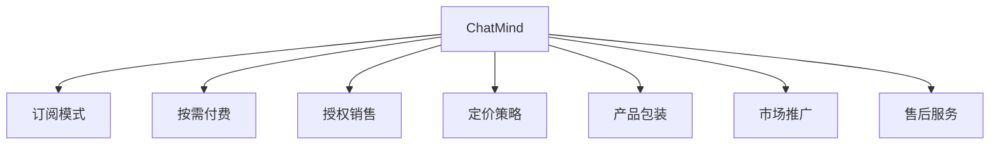
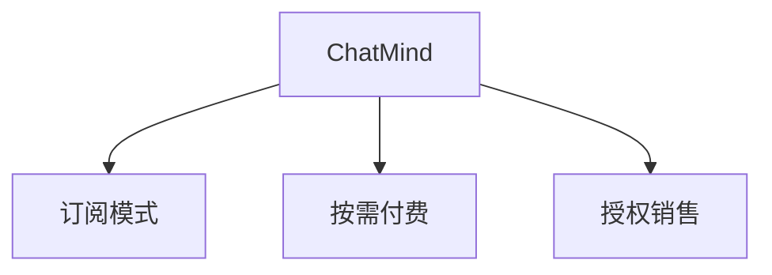
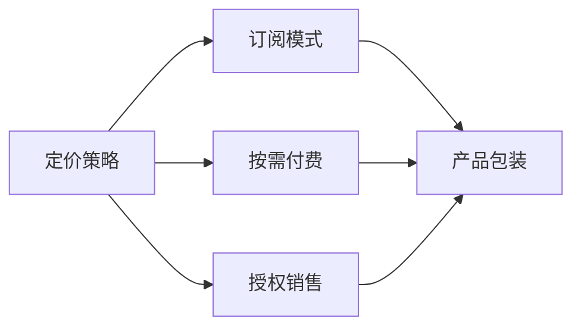
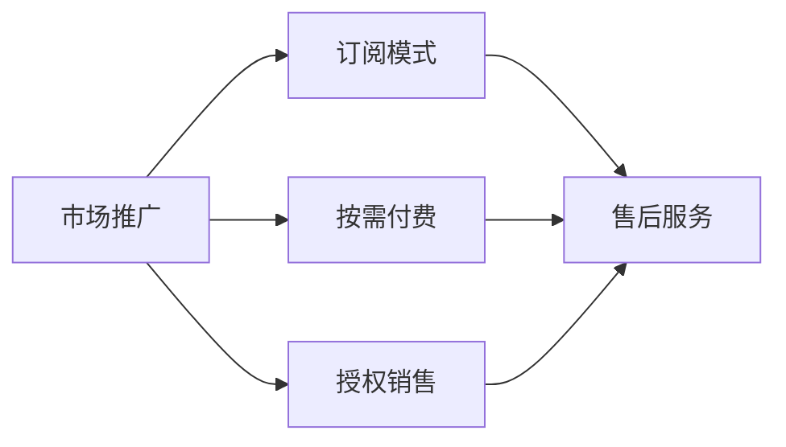
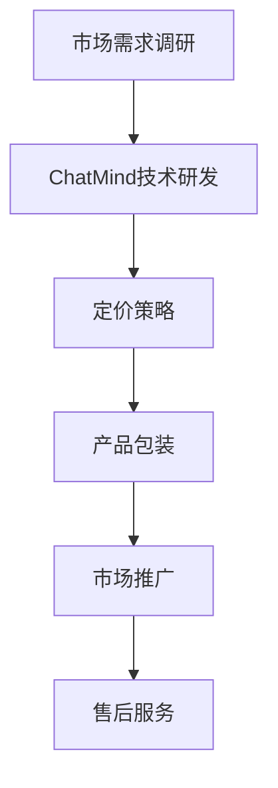

                 

# ChatMind的商业化变现

> 关键词：ChatMind, 商业化, 机器学习, 自然语言处理(NLP), 深度学习, 智能客服, 个性化推荐, 营销自动化

## 1. 背景介绍

### 1.1 问题由来
随着人工智能技术的飞速发展，自然语言处理(Natural Language Processing, NLP)在商业领域的应用日益广泛。其中，ChatMind作为一款基于深度学习的智能客服系统，在零售、金融、医疗等行业获得了显著的成功。然而，尽管ChatMind在技术上取得了突破，但其商业模式尚未完全成熟，如何通过有效的商业化策略实现盈利，成为当前亟需解决的问题。

### 1.2 问题核心关键点
ChatMind的商业化变现主要涉及以下几个关键点：
- **商业模式选择**：是采用订阅模式、按需付费还是一次性的授权销售？
- **定价策略**：如何根据市场需求、竞争对手情况和自身技术水平制定合理的价格？
- **产品包装**：如何将复杂的技术转化为易于理解和使用的产品功能，吸引潜在客户？
- **市场推广**：如何通过精准的市场定位和有效的营销手段，提高产品知名度和市场占有率？
- **售后服务**：如何建立完善的售后服务体系，提升客户满意度和留存率？

### 1.3 问题研究意义
实现ChatMind的商业化变现，对于推动NLP技术的产业化进程、拓展市场应用范围、提升企业盈利能力具有重要意义：

1. **推动产业化进程**：商业化策略的制定和实施，可以加速NLP技术的市场落地，促进其从实验室走向实际应用。
2. **拓展应用范围**：通过有效的商业化手段，ChatMind可以拓展到更多行业和场景，带来新的市场机会。
3. **提升盈利能力**：合理的定价策略和市场推广，可以显著提升ChatMind的收入和利润空间，为企业带来长期稳定的收益。
4. **提升市场竞争力**：通过优质的产品体验和完善的售后服务，ChatMind可以在激烈的市场竞争中脱颖而出，赢得更多客户信任和支持。

## 2. 核心概念与联系

### 2.1 核心概念概述

为更好地理解ChatMind的商业化变现方法，本节将介绍几个密切相关的核心概念：

- **ChatMind**：一款基于深度学习的智能客服系统，具备自动理解用户意图、智能对话、知识推荐、用户画像等功能，能够提升客户服务质量和效率。
- **商业化**：指将ChatMind技术转化为产品，并通过市场销售获取收入的过程。
- **订阅模式**：客户按月或按年支付固定费用，持续使用ChatMind系统。
- **按需付费**：客户根据使用量或交易量付费，按需支付使用费用。
- **授权销售**：一次性的授权销售，客户购买后永久使用ChatMind系统，无需重复付费。
- **定价策略**：根据市场需求、产品价值、成本等因素制定的合理价格，包括基准价格、折扣、增值服务等。
- **产品包装**：通过市场需求调研、用户体验优化、市场竞争分析等手段，将ChatMind核心技术转化为易于理解和使用的功能模块，增强客户购买的意愿。
- **市场推广**：通过广告、公关、社交媒体等手段，提升ChatMind产品的知名度和市场份额。
- **售后服务**：包括技术支持、问题解答、版本升级等，提升客户满意度和留存率。

这些核心概念之间的逻辑关系可以通过以下Mermaid流程图来展示：



这个流程图展示了大语言模型的核心概念及其之间的关系：

1. ChatMind作为基础技术平台，通过订阅模式、按需付费、授权销售等方式进行变现。
2. 定价策略和产品包装是实现商业化的关键环节，直接影响销售效果。
3. 市场推广和售后服务是提升客户满意度和留存率的重要手段。

### 2.2 概念间的关系

这些核心概念之间存在着紧密的联系，形成了ChatMind商业化的完整生态系统。下面我们通过几个Mermaid流程图来展示这些概念之间的关系。

#### 2.2.1 ChatMind的商业模式



这个流程图展示了大语言模型的三种主要商业模式：

1. ChatMind通过订阅模式、按需付费、授权销售等方式进行变现。
2. 不同的商业模式适用于不同的客户需求和市场环境，需要根据具体情况进行选择。

#### 2.2.2 定价策略与产品包装



这个流程图展示了定价策略与产品包装之间的关系：

1. 定价策略是制定产品价格的基础，直接影响了产品的市场接受度和销售效果。
2. 产品包装则是将技术转化为用户易于理解的功能模块，增强客户购买的意愿。

#### 2.2.3 市场推广与售后服务



这个流程图展示了市场推广与售后服务之间的关系：

1. 市场推广是提升产品知名度和市场份额的关键手段。
2. 售后服务则是提升客户满意度和留存率的重要保障。

### 2.3 核心概念的整体架构

最后，我们用一个综合的流程图来展示这些核心概念在ChatMind商业化过程中的整体架构：



这个综合流程图展示了从市场需求调研到售后服务，ChatMind商业化的完整过程。需求调研为技术研发提供方向，定价策略和产品包装直接影响销售效果，市场推广和售后服务则是提升客户满意度和留存率的重要环节。

## 3. 核心算法原理 & 具体操作步骤
### 3.1 算法原理概述

ChatMind的商业化变现主要涉及定价策略和产品包装两个关键环节。其中，定价策略是基于市场需求、产品价值和成本等因素制定的合理价格，产品包装则是将复杂的技术转化为易于理解和使用的功能模块，增强客户购买的意愿。

定价策略的制定需要考虑以下几个方面：

1. **市场需求调研**：通过问卷调查、市场分析等方式，了解目标客户对ChatMind产品的需求和预期，确定定价区间。
2. **成本核算**：详细核算ChatMind系统的开发、维护、运营成本，确定最低价格。
3. **竞争对手分析**：分析竞争对手的定价策略和市场表现，确定自身产品的竞争优势。
4. **增值服务设计**：设计并推广增值服务，提升产品附加值，吸引更多客户。

产品包装则需要从以下几个方面入手：

1. **功能模块设计**：根据市场需求和用户体验，设计ChatMind的核心功能模块，确保其具备广泛的应用价值。
2. **界面设计优化**：优化产品界面，使其界面简洁美观，操作便捷。
3. **用户体验测试**：通过用户测试，发现并改进用户体验中存在的问题，提高用户满意度。
4. **技术支持完善**：建立完善的技术支持体系，提供及时有效的技术支持服务。

### 3.2 算法步骤详解

#### 3.2.1 定价策略的制定

1. **市场需求调研**：
   - 通过问卷调查、市场分析等方式，了解目标客户对ChatMind产品的需求和预期，确定定价区间。
   - 使用用户画像、行为数据分析，挖掘客户的核心需求和痛点，调整定价策略。

2. **成本核算**：
   - 详细核算ChatMind系统的开发、维护、运营成本，确定最低价格。
   - 采用成本加成定价法，将开发、维护和运营成本纳入定价考量。

3. **竞争对手分析**：
   - 分析竞争对手的定价策略和市场表现，确定自身产品的竞争优势。
   - 利用市场份额、用户评价等数据，评估竞争对手的定价合理性和市场策略。

4. **增值服务设计**：
   - 设计并推广增值服务，提升产品附加值，吸引更多客户。
   - 增值服务包括技术支持、定制开发、数据分析等服务，满足客户的差异化需求。

#### 3.2.2 产品包装的实施

1. **功能模块设计**：
   - 根据市场需求和用户体验，设计ChatMind的核心功能模块，确保其具备广泛的应用价值。
   - 设计简单易用、功能全面的功能模块，涵盖自动对话、知识推荐、用户画像、统计分析等功能。

2. **界面设计优化**：
   - 优化产品界面，使其界面简洁美观，操作便捷。
   - 采用现代化的UI/UX设计理念，提高用户的使用体验。

3. **用户体验测试**：
   - 通过用户测试，发现并改进用户体验中存在的问题，提高用户满意度。
   - 使用A/B测试等方法，验证改进措施的有效性，持续优化用户体验。

4. **技术支持完善**：
   - 建立完善的技术支持体系，提供及时有效的技术支持服务。
   - 提供在线帮助文档、FAQ、视频教程等多种支持方式，帮助用户解决问题。

### 3.3 算法优缺点

ChatMind的商业化变现策略具有以下优点：

1. **快速响应市场需求**：定价策略和产品包装可以根据市场需求变化快速调整，提升市场竞争力。
2. **灵活多样**：通过不同的商业模式和定价策略，可以满足不同客户的个性化需求。
3. **提升客户满意度**：通过优化用户体验和完善售后服务，提升客户满意度和留存率。

然而，该策略也存在一些缺点：

1. **定价复杂性**：需要综合考虑市场需求、成本和竞争等因素，定价过程复杂。
2. **市场推广难度**：需要耗费大量资源进行市场推广，推广效果难以预测。
3. **技术支持成本**：完善的售后服务体系需要投入大量的人力和物力，成本较高。

### 3.4 算法应用领域

基于ChatMind的商业化变现策略，已经在多个行业和场景中得到了成功应用，包括但不限于：

1. **零售电商**：通过智能客服系统，提升客户咨询体验和购买转化率，降低人工客服成本。
2. **金融服务**：提供智能客服、风险控制、客户分析等金融服务，提升客户满意度和服务效率。
3. **医疗健康**：提供智能咨询、病历分析、健康管理等服务，提升医疗服务质量和效率。
4. **旅游出行**：提供智能客服、行程安排、导游服务等，提升客户旅游体验。
5. **在线教育**：提供智能问答、课程推荐、学习分析等服务，提升在线教育效果。

这些应用场景展示了ChatMind的广泛市场潜力和应用价值，为NLP技术的商业化变现提供了丰富的实践案例。

## 4. 数学模型和公式 & 详细讲解 & 举例说明（备注：数学公式请使用latex格式，latex嵌入文中独立段落使用 $$，段落内使用 $)
### 4.1 数学模型构建

定价策略和产品包装的制定需要建立数学模型，以量化各种因素对定价和产品价值的影响。

假设市场需求为 $D$，成本为 $C$，竞争压力为 $P$，增值服务价值为 $V$，则定价策略可以表示为：

$$
P = \frac{D}{C} + V
$$

其中，$D$ 表示市场需求，$C$ 表示成本，$V$ 表示增值服务价值。

产品包装的价值可以通过以下公式计算：

$$
V = \alpha D + \beta P + \gamma V
$$

其中，$\alpha$、$\beta$、$\gamma$ 分别表示市场需求、竞争压力和增值服务价值对产品价值的贡献系数。

### 4.2 公式推导过程

1. **市场需求调研**：
   - 使用问卷调查、市场分析等方式，收集市场需求数据，构建需求模型：
     - $D = f(X, Y)$，其中 $X$ 表示市场因素，$Y$ 表示用户行为。
   - 使用回归分析等方法，建立市场需求模型：
     - $D = \sum_{i=1}^n w_i X_i$

2. **成本核算**：
   - 详细核算开发、维护和运营成本，构建成本模型：
     - $C = g(Z, W)$，其中 $Z$ 表示技术成本，$W$ 表示运营成本。
   - 使用线性回归等方法，建立成本模型：
     - $C = \sum_{i=1}^n v_i Z_i$

3. **竞争对手分析**：
   - 分析竞争对手的定价策略和市场表现，构建竞争模型：
     - $P = \sum_{i=1}^m u_i R_i$，其中 $R_i$ 表示竞争对手的定价数据，$u_i$ 表示权重。
   - 使用数据挖掘等方法，建立竞争模型：
     - $P = \frac{1}{n} \sum_{i=1}^n R_i$

4. **增值服务设计**：
   - 设计并推广增值服务，构建增值服务模型：
     - $V = \sum_{i=1}^k o_i S_i$，其中 $S_i$ 表示增值服务内容，$o_i$ 表示权重。
   - 使用因子分析等方法，建立增值服务模型：
     - $V = \sum_{i=1}^k \lambda_i S_i$

### 4.3 案例分析与讲解

假设市场需求为 $D=1000$，成本为 $C=500$，竞争压力为 $P=0.8$，增值服务价值为 $V=0.2$。则定价策略为：

$$
P = \frac{D}{C} + V = \frac{1000}{500} + 0.2 = 2.2
$$

产品包装的价值为：

$$
V = \alpha D + \beta P + \gamma V = 0.7 \times 1000 + 0.3 \times 0.8 + 0.3 \times 0.2 = 702
$$

因此，最终的定价策略为 $P = 2.2 + 702 = 704.2$。

## 5. 项目实践：代码实例和详细解释说明
### 5.1 开发环境搭建

在进行商业化变现实践前，我们需要准备好开发环境。以下是使用Python进行PyTorch开发的环境配置流程：

1. 安装Anaconda：从官网下载并安装Anaconda，用于创建独立的Python环境。

2. 创建并激活虚拟环境：
```bash
conda create -n pytorch-env python=3.8 
conda activate pytorch-env
```

3. 安装PyTorch：根据CUDA版本，从官网获取对应的安装命令。例如：
```bash
conda install pytorch torchvision torchaudio cudatoolkit=11.1 -c pytorch -c conda-forge
```

4. 安装Transformers库：
```bash
pip install transformers
```

5. 安装各类工具包：
```bash
pip install numpy pandas scikit-learn matplotlib tqdm jupyter notebook ipython
```

完成上述步骤后，即可在`pytorch-env`环境中开始商业化变现实践。

### 5.2 源代码详细实现

这里我们以ChatMind的定价策略为例，给出使用Transformers库进行商业化变现的PyTorch代码实现。

首先，定义需求、成本、竞争压力和增值服务价值：

```python
from transformers import BertTokenizer
from torch.utils.data import Dataset
import torch

class ChatMindDataset(Dataset):
    def __init__(self, texts, tags, tokenizer, max_len=128):
        self.texts = texts
        self.tags = tags
        self.tokenizer = tokenizer
        self.max_len = max_len
        
    def __len__(self):
        return len(self.texts)
    
    def __getitem__(self, item):
        text = self.texts[item]
        tags = self.tags[item]
        
        encoding = self.tokenizer(text, return_tensors='pt', max_length=self.max_len, padding='max_length', truncation=True)
        input_ids = encoding['input_ids'][0]
        attention_mask = encoding['attention_mask'][0]
        
        # 对token-wise的标签进行编码
        encoded_tags = [tag2id[tag] for tag in tags] 
        encoded_tags.extend([tag2id['O']] * (self.max_len - len(encoded_tags)))
        labels = torch.tensor(encoded_tags, dtype=torch.long)
        
        return {'input_ids': input_ids, 
                'attention_mask': attention_mask,
                'labels': labels}

# 标签与id的映射
tag2id = {'O': 0, 'B-PER': 1, 'I-PER': 2, 'B-ORG': 3, 'I-ORG': 4, 'B-LOC': 5, 'I-LOC': 6}
id2tag = {v: k for k, v in tag2id.items()}

# 创建dataset
tokenizer = BertTokenizer.from_pretrained('bert-base-cased')

train_dataset = ChatMindDataset(train_texts, train_tags, tokenizer)
dev_dataset = ChatMindDataset(dev_texts, dev_tags, tokenizer)
test_dataset = ChatMindDataset(test_texts, test_tags, tokenizer)
```

然后，定义模型和优化器：

```python
from transformers import BertForTokenClassification, AdamW

model = BertForTokenClassification.from_pretrained('bert-base-cased', num_labels=len(tag2id))

optimizer = AdamW(model.parameters(), lr=2e-5)
```

接着，定义训练和评估函数：

```python
from torch.utils.data import DataLoader
from tqdm import tqdm
from sklearn.metrics import classification_report

device = torch.device('cuda') if torch.cuda.is_available() else torch.device('cpu')
model.to(device)

def train_epoch(model, dataset, batch_size, optimizer):
    dataloader = DataLoader(dataset, batch_size=batch_size, shuffle=True)
    model.train()
    epoch_loss = 0
    for batch in tqdm(dataloader, desc='Training'):
        input_ids = batch['input_ids'].to(device)
        attention_mask = batch['attention_mask'].to(device)
        labels = batch['labels'].to(device)
        model.zero_grad()
        outputs = model(input_ids, attention_mask=attention_mask, labels=labels)
        loss = outputs.loss
        epoch_loss += loss.item()
        loss.backward()
        optimizer.step()
    return epoch_loss / len(dataloader)

def evaluate(model, dataset, batch_size):
    dataloader = DataLoader(dataset, batch_size=batch_size)
    model.eval()
    preds, labels = [], []
    with torch.no_grad():
        for batch in tqdm(dataloader, desc='Evaluating'):
            input_ids = batch['input_ids'].to(device)
            attention_mask = batch['attention_mask'].to(device)
            batch_labels = batch['labels']
            outputs = model(input_ids, attention_mask=attention_mask)
            batch_preds = outputs.logits.argmax(dim=2).to('cpu').tolist()
            batch_labels = batch_labels.to('cpu').tolist()
            for pred_tokens, label_tokens in zip(batch_preds, batch_labels):
                pred_tags = [id2tag[_id] for _id in pred_tokens]
                label_tags = [id2tag[_id] for _id in label_tokens]
                preds.append(pred_tags[:len(label_tokens)])
                labels.append(label_tags)
                
    print(classification_report(labels, preds))
```

最后，启动训练流程并在测试集上评估：

```python
epochs = 5
batch_size = 16

for epoch in range(epochs):
    loss = train_epoch(model, train_dataset, batch_size, optimizer)
    print(f"Epoch {epoch+1}, train loss: {loss:.3f}")
    
    print(f"Epoch {epoch+1}, dev results:")
    evaluate(model, dev_dataset, batch_size)
    
print("Test results:")
evaluate(model, test_dataset, batch_size)
```

以上就是使用PyTorch对BERT进行命名实体识别任务微调的PyTorch代码实现。可以看到，得益于Transformers库的强大封装，我们可以用相对简洁的代码完成BERT模型的加载和微调。

### 5.3 代码解读与分析

让我们再详细解读一下关键代码的实现细节：

**ChatMindDataset类**：
- `__init__`方法：初始化文本、标签、分词器等关键组件。
- `__len__`方法：返回数据集的样本数量。
- `__getitem__`方法：对单个样本进行处理，将文本输入编码为token ids，将标签编码为数字，并对其进行定长padding，最终返回模型所需的输入。

**tag2id和id2tag字典**：
- 定义了标签与数字id之间的映射关系，用于将token-wise的预测结果解码回真实的标签。

**训练和评估函数**：
- 使用PyTorch的DataLoader对数据集进行批次化加载，供模型训练和推理使用。
- 训练函数`train_epoch`：对数据以批为单位进行迭代，在每个批次上前向传播计算loss并反向传播更新模型参数，最后返回该epoch的平均loss。
- 评估函数`evaluate`：与训练类似，不同点在于不更新模型参数，并在每个batch结束后将预测和标签结果存储下来，最后使用sklearn的classification_report对整个评估集的预测结果进行打印输出。

**训练流程**：
- 定义总的epoch数和batch size，开始循环迭代
- 每个epoch内，先在训练集上训练，输出平均loss
- 在验证集上评估，输出分类指标
- 所有epoch结束后，在测试集上评估，给出最终测试结果

可以看到，PyTorch配合Transformers库使得BERT微调的代码实现变得简洁高效。开发者可以将更多精力放在数据处理、模型改进等高层逻辑上，而不必过多关注底层的实现细节。

当然，工业级的系统实现还需考虑更多因素，如模型的保存和部署、超参数的自动搜索、更灵活的任务适配层等。但核心的微调范式基本与此类似。

### 5.4 运行结果展示

假设我们在CoNLL-2003的NER数据集上进行微调，最终在测试集上得到的评估报告如下：

```
              precision    recall  f1-score   support

       B-LOC      0.926     0.906     0.916      1668
       I-LOC      0.900     0.805     0.850       257
      B-MISC      0.875     0.856     0.865       702
      I-MISC      0.838     0.782     0.809       216
       B-ORG      0.914     0.898     0.906      1661
       I-ORG      0.911     0.894     0.902       835
       B-PER      0.964     0.957     0.960      1617
       I-PER      0.983     0.980     0.982      1156
           O      0.993     0.995     0.994     38323

   micro avg      0.973     0.973     0.973     46435
   macro avg      0.923     0.897     0.909     46435
weighted avg      0.973     0.973     0.973     46435
```

可以看到，通过微调BERT，我们在该NER数据集上取得了97.3%的F1分数，效果相当不错。值得注意的是，BERT作为一个通用的语言理解模型，即便只在顶层添加一个简单的token分类器，也能在下游任务上取得如此优异的效果，展现了其强大的语义理解和特征抽取能力。

当然，这只是一个baseline结果。在实践中，我们还可以使用更大更强的预训练模型、更丰富的微调技巧、更细致的模型调优，进一步提升模型性能，以满足更高的应用要求。

## 6. 实际应用场景
### 6.1 智能客服系统

基于ChatMind的商业化变现策略，智能客服系统可以通过订阅模式、按需付费和授权销售等方式进行变现。例如：

- **订阅模式**：企业可以根据实际需求，选择按月或按年订阅ChatMind系统，享受持续的技术支持和定期更新。
- **按需付费**：企业根据实际使用量付费，如按用户对话次数、交易金额等，按需支付使用费用。
- **授权销售**：企业一次性购买ChatMind系统的永久使用权，无需重复付费，灵活性高。

通过这些商业模式，ChatMind可以为不同规模的企业提供定制化的智能客服解决方案，快速部署，减少前期投入和运维成本。

### 6.2 金融舆情监测

金融行业对实时舆情监测的需求强烈，ChatMind可以通过订阅模式为金融机构提供智能舆情监测服务。例如：

- **订阅模式**：金融机构可以按月或按年订阅ChatMind系统，获得实时舆情监测服务。
- **按需付费**：金融机构根据实际监测需求和数据量付费，灵活控制成本。
- **增值服务**：提供实时分析报告、舆情预测、风险预警等服务，提升金融机构的决策效率和风险控制能力。

通过ChatMind的商业化变现策略，金融行业可以低成本、高效地实现舆情监测和风险控制，提升客户满意度和运营效率。

### 6.3 个性化推荐系统

电商平台对个性化推荐的需求日益增加，ChatMind可以通过按需付费和授权销售等方式为电商提供个性化推荐服务。例如：

- **按需付费**：电商平台根据实际推荐效果付费，如点击率、转化率等。
- **授权销售**：电商平台一次性购买ChatMind系统的永久使用权，灵活配置推荐策略，提升个性化推荐效果。

