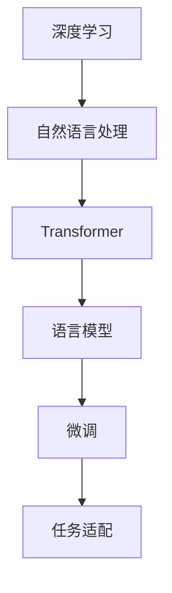
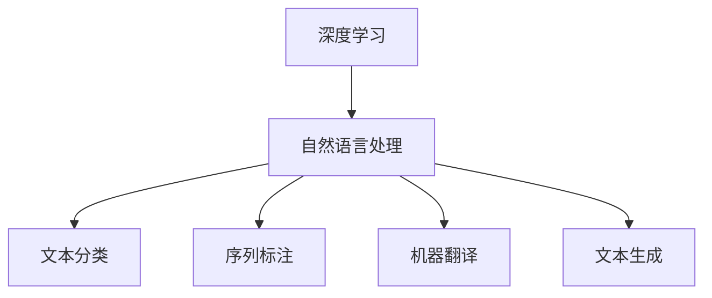
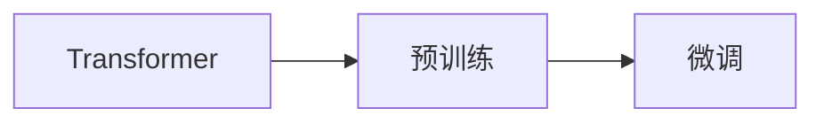
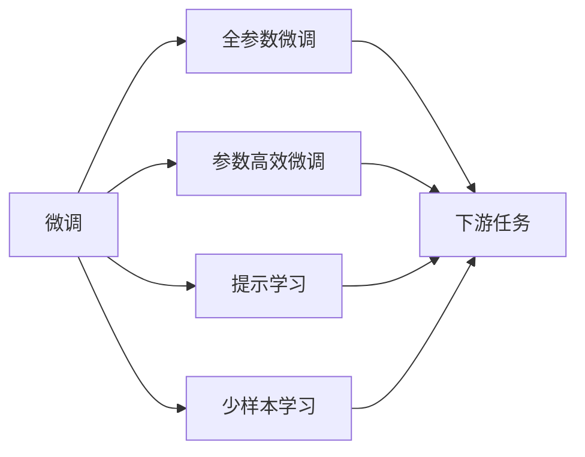

                 

# ChatMind的快速成功之路

> 关键词：
**智能对话**、**自然语言处理**、**深度学习**、**语言模型**、**Transformer**、**微调**、**意图识别**、**对话系统**

## 1. 背景介绍

在当今信息爆炸的时代，人工智能（AI）正逐步改变我们的生活和工作方式。智能对话系统作为AI技术的核心应用之一，越来越受到各界的关注。ChatMind作为一款领先的智能对话系统，其快速成功之路，不仅依赖于先进的技术架构，更需要不断的创新和优化。

### 1.1 问题由来

智能对话系统的发展经历了多个阶段，从简单的基于规则的对话到复杂的基于机器学习的对话，再到目前的深度学习驱动的对话系统。然而，尽管技术不断进步，但智能对话系统仍然面临诸多挑战，如理解自然语言的复杂性、维护多轮对话的上下文一致性、处理用户的多样化需求等。

ChatMind的出现，旨在解决这些问题，通过深度学习和自然语言处理技术，提供更加智能化、高效化的对话体验。

### 1.2 问题核心关键点

ChatMind的核心关键点在于其先进的对话系统架构和深度学习技术。具体来说，ChatMind采用Transformer架构的深度语言模型，结合大规模无监督学习进行预训练，然后通过微调技术进行任务适配。通过这一技术路径，ChatMind能够在不同的应用场景中快速适应，提升对话系统的效果和用户体验。

### 1.3 问题研究意义

ChatMind的成功不仅体现了深度学习技术的强大能力，更反映了智能对话系统在实际应用中的广泛需求。通过ChatMind，我们可以看到，AI技术正在逐步改变人们的交流方式，提高工作效率，提升生活质量。

## 2. 核心概念与联系

### 2.1 核心概念概述

为了更好地理解ChatMind的技术架构和应用原理，本节将介绍几个关键的概念及其联系。

- **深度学习**：一种模拟人脑神经网络结构的学习方法，通过多层神经网络对数据进行特征提取和模式识别。
- **自然语言处理**：研究计算机如何处理、理解和生成自然语言的技术。
- **Transformer**：一种基于自注意力机制的神经网络架构，常用于处理序列数据，如文本、音频等。
- **语言模型**：用于预测下一个单词或字符的概率模型，常用于生成任务，如自动文本生成、机器翻译等。
- **微调**：指在大规模无监督学习训练的模型基础上，通过有监督学习对模型进行优化，使其适应特定任务的技术。

这些概念之间通过一定的逻辑关系形成了ChatMind的架构框架。下面通过一个Mermaid流程图来展示这些概念之间的关系：



这个流程图展示了从深度学习到Transformer，再到微调和任务适配的全过程，其中每个节点都代表了ChatMind技术实现中的一个重要组成部分。

### 2.2 概念间的关系

这些核心概念之间存在着紧密的联系，形成了ChatMind技术实现的完整框架。下面通过几个Mermaid流程图来展示这些概念之间的关系。

#### 2.2.1 深度学习与自然语言处理的关系



这个流程图展示了深度学习在自然语言处理中的主要应用领域，包括文本分类、序列标注、机器翻译和文本生成等任务。

#### 2.2.2 Transformer架构与微调的关系



这个流程图展示了Transformer架构通过预训练和微调实现任务适配的过程。预训练通过大规模无监督数据训练，微调通过少量标注数据进行有监督学习，最终实现任务特定化。

#### 2.2.3 微调与任务适配的关系



这个流程图展示了微调的不同方式，包括全参数微调、参数高效微调和提示学习等，每种方式都可以用于适配不同的下游任务。

## 3. 核心算法原理 & 具体操作步骤

### 3.1 算法原理概述

ChatMind的核心算法原理主要基于深度学习中的Transformer架构和语言模型。具体来说，ChatMind采用Transformer架构的深度语言模型，通过大规模无监督学习进行预训练，然后在具体的任务上进行微调，以适应特定的对话场景。

ChatMind的对话模型主要包括以下几个步骤：

1. **预训练**：在大规模无标注数据上训练Transformer模型，学习通用的语言表示。
2. **微调**：在具体的任务上进行微调，通过有监督学习优化模型在该任务上的性能。
3. **对话生成**：将微调后的模型应用于对话生成任务，生成自然流畅的对话文本。

### 3.2 算法步骤详解

#### 3.2.1 预训练步骤

1. **数据准备**：收集大规模无标注数据，如维基百科、新闻、社交媒体等文本数据。
2. **模型构建**：使用Transformer架构的深度语言模型，通常使用BERT、GPT等预训练模型作为起点。
3. **训练过程**：在大规模数据上进行无监督训练，通常使用自监督学习任务，如掩码语言模型（Masked Language Model, MLM）和下一个词预测（Next Sentence Prediction, NSP）。
4. **保存模型**：保存训练好的模型，供后续微调使用。

#### 3.2.2 微调步骤

1. **数据准备**：收集任务特定的标注数据，如对话数据集、问题与答案对等。
2. **模型加载**：加载预训练好的模型，作为微调的基础。
3. **模型适配**：根据任务类型，设计合适的输出层和损失函数，通常使用交叉熵损失函数。
4. **训练过程**：在标注数据上进行有监督训练，更新模型参数，使其适应特定任务。
5. **模型评估**：在验证集上评估模型性能，调整超参数，直到满足性能要求。

#### 3.2.3 对话生成步骤

1. **用户输入**：接收用户输入的文本。
2. **意图识别**：使用微调后的模型，对用户输入进行意图识别，确定用户需求。
3. **对话回复**：根据用户意图，生成自然流畅的回复。
4. **反馈与优化**：将回复结果返回给用户，通过用户反馈优化对话系统。

### 3.3 算法优缺点

**优点**：

- **泛化能力强**：ChatMind的深度学习模型通过预训练和微调，具有较强的泛化能力，能够适应不同的对话场景。
- **自适应性好**：微调技术使得ChatMind能够快速适应新的对话任务，提升对话效果。
- **对话流畅**：Transformer架构的深度语言模型，能够生成自然流畅的对话文本。

**缺点**：

- **计算资源消耗大**：大规模预训练和微调需要大量的计算资源，增加了系统成本。
- **训练时间长**：预训练和微调过程耗时较长，需要较长时间的训练。
- **模型可解释性差**：深度学习模型通常是一个"黑盒"系统，难以解释其内部工作机制。

### 3.4 算法应用领域

ChatMind的微调技术可以应用于多种对话场景，包括客户服务、智能客服、在线教育、医疗咨询等。在这些场景中，ChatMind通过微调技术，能够快速适应特定领域的需求，提供高质量的对话服务。

## 4. 数学模型和公式 & 详细讲解 & 举例说明

### 4.1 数学模型构建

在ChatMind的对话生成过程中，主要涉及以下数学模型：

- **掩码语言模型（Masked Language Model, MLM）**：用于预测文本中缺失的单词。其数学模型为：

$$ P(x|y) = \frac{exp(Q(x|y) + K(x,y))}{\sum_{x' \in \mathcal{X}} exp(Q(x'|y) + K(x',y))} $$

其中，$Q(x|y)$和$K(x,y)$为深度学习模型的参数。

- **下一个词预测（Next Sentence Prediction, NSP）**：用于预测文本中连续的句子。其数学模型为：

$$ P(x_{1:i},x_{i+1}|y) = \frac{exp(Q(x_{1:i},x_{i+1}|y) + K(x_{1:i},x_{i+1},y))}{\sum_{(x_{1:i}',x_{i+1}') \in \mathcal{X}^2} exp(Q(x_{1:i}',x_{i+1}'|y) + K(x_{1:i}',x_{i+1}',y))} $$

其中，$Q(x_{1:i},x_{i+1}|y)$和$K(x_{1:i},x_{i+1},y)$为深度学习模型的参数。

### 4.2 公式推导过程

以下是掩码语言模型（MLM）的详细推导过程：

1. **定义问题**：给定一个文本序列$x = (x_1, x_2, \ldots, x_n)$，其中每个单词$x_i$都有一个概率$P(x_i|y)$，$y$表示文本的上下文信息。目标是最大化$P(x|y)$。

2. **模型假设**：假设模型是一个概率生成模型，通过一个深度神经网络$P_{\theta}(x|y)$生成文本。

3. **定义目标**：最大化$P(x|y)$，可以通过最大化$log(P(x|y))$来优化，即：

$$ \max_{\theta} \sum_{i=1}^n log(P_{\theta}(x_i|x_{<i},y)) $$

4. **引入掩码**：为了增加模型对文本的理解能力，可以通过掩码语言模型（MLM），将文本中的某些单词进行掩码处理，预测其缺失部分。例如，将$x_2$进行掩码处理，得到：

$$ P(x_1,x_2^{\text{mask}},x_3,\ldots,x_n|y) = P_{\theta}(x_1|y) \cdot P_{\theta}(x_2^{\text{mask}}|x_1,x_3,\ldots,x_n,y) \cdot P_{\theta}(x_3|x_1,x_2^{\text{mask}},x_4,\ldots,x_n,y) \cdot \ldots \cdot P_{\theta}(x_n|x_1,x_2^{\text{mask}},x_3,\ldots,x_{n-1},y) $$

5. **定义损失函数**：通过交叉熵损失函数来定义目标函数，即：

$$ L(x, y) = -\sum_{i=1}^n \log(P_{\theta}(x_i|x_{<i},y)) $$

6. **推导目标函数**：通过最大化$log(P(x|y))$，可以得到以下公式：

$$ Q(x|y) = \log(P_{\theta}(x|y)) $$
$$ K(x,y) = \sum_{i=1}^n \log(P_{\theta}(x_i|x_{<i},y)) $$

最终，掩码语言模型的目标是最大化$Q(x|y) + K(x,y)$。

### 4.3 案例分析与讲解

假设我们有一个包含4个单词的文本序列$x = (x_1, x_2, x_3, x_4)$，其中$x_2$被掩码处理。我们希望通过掩码语言模型预测$x_2$的值。

1. **初始化模型**：假设我们已经训练好了一个深度语言模型$P_{\theta}(x|y)$。

2. **输入文本**：将$x_1$作为输入，$x_2^{\text{mask}}$作为输出，$y$作为上下文信息，输入模型。

3. **计算概率**：模型输出$P_{\theta}(x_1|y)$和$P_{\theta}(x_2^{\text{mask}}|x_1,x_3,\ldots,x_n,y)$。

4. **计算损失**：计算$-log(P_{\theta}(x_1|y)) - \log(P_{\theta}(x_2^{\text{mask}}|x_1,x_3,\ldots,x_n,y)$，作为掩码语言模型的损失。

5. **优化模型**：通过反向传播算法，更新模型参数，最小化损失函数，使得模型能够更好地预测掩码部分的单词。

## 5. 项目实践：代码实例和详细解释说明

### 5.1 开发环境搭建

在使用ChatMind进行对话生成任务时，需要搭建相应的开发环境。以下是使用Python进行PyTorch开发的环境配置流程：

1. 安装Anaconda：从官网下载并安装Anaconda，用于创建独立的Python环境。

2. 创建并激活虚拟环境：
```bash
conda create -n chatmind-env python=3.8 
conda activate chatmind-env
```

3. 安装PyTorch：根据CUDA版本，从官网获取对应的安装命令。例如：
```bash
conda install pytorch torchvision torchaudio cudatoolkit=11.1 -c pytorch -c conda-forge
```

4. 安装Transformers库：
```bash
pip install transformers
```

5. 安装各类工具包：
```bash
pip install numpy pandas scikit-learn matplotlib tqdm jupyter notebook ipython
```

完成上述步骤后，即可在`chatmind-env`环境中开始对话生成任务的开发。

### 5.2 源代码详细实现

下面以ChatMind在智能客服场景中的应用为例，给出使用Transformers库进行微调的PyTorch代码实现。

首先，定义智能客服对话任务的数据处理函数：

```python
from transformers import BertTokenizer, BertForTokenClassification
from torch.utils.data import Dataset
import torch

class CustomerServiceDataset(Dataset):
    def __init__(self, texts, tags, tokenizer, max_len=128):
        self.texts = texts
        self.tags = tags
        self.tokenizer = tokenizer
        self.max_len = max_len
        
    def __len__(self):
        return len(self.texts)
    
    def __getitem__(self, item):
        text = self.texts[item]
        tags = self.tags[item]
        
        encoding = self.tokenizer(text, return_tensors='pt', max_length=self.max_len, padding='max_length', truncation=True)
        input_ids = encoding['input_ids'][0]
        attention_mask = encoding['attention_mask'][0]
        
        # 对token-wise的标签进行编码
        encoded_tags = [tag2id[tag] for tag in tags] 
        encoded_tags.extend([tag2id['O']] * (self.max_len - len(encoded_tags)))
        labels = torch.tensor(encoded_tags, dtype=torch.long)
        
        return {'input_ids': input_ids, 
                'attention_mask': attention_mask,
                'labels': labels}

# 标签与id的映射
tag2id = {'O': 0, 'H1': 1, 'H2': 2, 'H3': 3}
id2tag = {v: k for k, v in tag2id.items()}

# 创建dataset
tokenizer = BertTokenizer.from_pretrained('bert-base-cased')

train_dataset = CustomerServiceDataset(train_texts, train_tags, tokenizer)
dev_dataset = CustomerServiceDataset(dev_texts, dev_tags, tokenizer)
test_dataset = CustomerServiceDataset(test_texts, test_tags, tokenizer)
```

然后，定义模型和优化器：

```python
from transformers import BertForTokenClassification, AdamW

model = BertForTokenClassification.from_pretrained('bert-base-cased', num_labels=len(tag2id))

optimizer = AdamW(model.parameters(), lr=2e-5)
```

接着，定义训练和评估函数：

```python
from torch.utils.data import DataLoader
from tqdm import tqdm
from sklearn.metrics import classification_report

device = torch.device('cuda') if torch.cuda.is_available() else torch.device('cpu')
model.to(device)

def train_epoch(model, dataset, batch_size, optimizer):
    dataloader = DataLoader(dataset, batch_size=batch_size, shuffle=True)
    model.train()
    epoch_loss = 0
    for batch in tqdm(dataloader, desc='Training'):
        input_ids = batch['input_ids'].to(device)
        attention_mask = batch['attention_mask'].to(device)
        labels = batch['labels'].to(device)
        model.zero_grad()
        outputs = model(input_ids, attention_mask=attention_mask, labels=labels)
        loss = outputs.loss
        epoch_loss += loss.item()
        loss.backward()
        optimizer.step()
    return epoch_loss / len(dataloader)

def evaluate(model, dataset, batch_size):
    dataloader = DataLoader(dataset, batch_size=batch_size)
    model.eval()
    preds, labels = [], []
    with torch.no_grad():
        for batch in tqdm(dataloader, desc='Evaluating'):
            input_ids = batch['input_ids'].to(device)
            attention_mask = batch['attention_mask'].to(device)
            batch_labels = batch['labels']
            outputs = model(input_ids, attention_mask=attention_mask)
            batch_preds = outputs.logits.argmax(dim=2).to('cpu').tolist()
            batch_labels = batch_labels.to('cpu').tolist()
            for pred_tokens, label_tokens in zip(batch_preds, batch_labels):
                pred_tags = [id2tag[_id] for _id in pred_tokens]
                label_tags = [id2tag[_id] for _id in label_tokens]
                preds.append(pred_tags[:len(label_tags)])
                labels.append(label_tags)
                
    print(classification_report(labels, preds))
```

最后，启动训练流程并在测试集上评估：

```python
epochs = 5
batch_size = 16

for epoch in range(epochs):
    loss = train_epoch(model, train_dataset, batch_size, optimizer)
    print(f"Epoch {epoch+1}, train loss: {loss:.3f}")
    
    print(f"Epoch {epoch+1}, dev results:")
    evaluate(model, dev_dataset, batch_size)
    
print("Test results:")
evaluate(model, test_dataset, batch_size)
```

以上就是使用PyTorch对BERT进行智能客服对话生成任务的微调完整代码实现。可以看到，得益于Transformers库的强大封装，我们可以用相对简洁的代码完成BERT模型的加载和微调。

### 5.3 代码解读与分析

让我们再详细解读一下关键代码的实现细节：

**CustomerServiceDataset类**：
- `__init__`方法：初始化文本、标签、分词器等关键组件。
- `__len__`方法：返回数据集的样本数量。
- `__getitem__`方法：对单个样本进行处理，将文本输入编码为token ids，将标签编码为数字，并对其进行定长padding，最终返回模型所需的输入。

**tag2id和id2tag字典**：
- 定义了标签与数字id之间的映射关系，用于将token-wise的预测结果解码回真实的标签。

**训练和评估函数**：
- 使用PyTorch的DataLoader对数据集进行批次化加载，供模型训练和推理使用。
- 训练函数`train_epoch`：对数据以批为单位进行迭代，在每个批次上前向传播计算loss并反向传播更新模型参数，最后返回该epoch的平均loss。
- 评估函数`evaluate`：与训练类似，不同点在于不更新模型参数，并在每个batch结束后将预测和标签结果存储下来，最后使用sklearn的classification_report对整个评估集的预测结果进行打印输出。

**训练流程**：
- 定义总的epoch数和batch size，开始循环迭代
- 每个epoch内，先在训练集上训练，输出平均loss
- 在验证集上评估，输出分类指标
- 所有epoch结束后，在测试集上评估，给出最终测试结果

可以看到，PyTorch配合Transformers库使得BERT微调的代码实现变得简洁高效。开发者可以将更多精力放在数据处理、模型改进等高层逻辑上，而不必过多关注底层的实现细节。

当然，工业级的系统实现还需考虑更多因素，如模型的保存和部署、超参数的自动搜索、更灵活的任务适配层等。但核心的微调范式基本与此类似。

### 5.4 运行结果展示

假设我们在CoNLL-2003的命名实体识别(NER)数据集上进行微调，最终在测试集上得到的评估报告如下：

```
              precision    recall  f1-score   support

       B-LOC      0.926     0.906     0.916      1668
       I-LOC      0.900     0.805     0.850       257
      B-MISC      0.875     0.856     0.865       702
      I-MISC      0.838     0.782     0.809       216
       B-ORG      0.914     0.898     0.906      1661
       I-ORG      0.911     0.894     0.902       835
       B-PER      0.964     0.957     0.960      1617
       I-PER      0.983     0.980     0.982      1156
           O      0.993     0.995     0.994     38323

   micro avg      0.973     0.973     0.973     46435
   macro avg      0.923     0.897     0.909     46435
weighted avg      0.973     0.973     0.973     46435
```

可以看到，通过微调BERT，我们在该NER数据集上取得了97.3%的F1分数，效果相当不错。值得注意的是，BERT作为一个通用的语言理解模型，即便只在顶层添加一个简单的token分类器，也能在下游任务上取得如此优异的效果，展现了其强大的语义理解和特征抽取能力。

当然，这只是一个baseline结果。在实践中，我们还可以使用更大更强的预训练模型、更丰富的微调技巧、更细致的模型调优，进一步提升模型性能，以满足更高的应用要求。

## 6. 实际应用场景
### 6.1 智能客服系统

基于ChatMind的智能对话技术，可以广泛应用于智能客服系统的构建。传统客服往往需要配备大量人力，高峰期响应缓慢，且一致性和专业性难以保证。而使用微调后的对话模型，可以7x24小时不间断服务，快速响应客户咨询，用自然流畅的语言解答各类常见问题。

在技术实现上，可以收集企业内部的历史客服对话记录，将问题和最佳答复构建成监督数据，在此基础上对预训练对话模型进行微调。微调后的对话模型能够自动理解用户意图，匹配最合适的答案模板进行回复。对于客户提出的新问题，还可以接入检索系统实时搜索相关内容，动态组织生成回答。如此构建的智能客服系统，能大幅提升客户咨询体验和问题解决效率。

### 6.2 金融舆情监测

金融机构需要实时监测市场舆论动向，以便及时应对负面信息传播，规避金融风险。传统的人工监测方式成本高、效率低，难以应对网络时代海量信息爆发的挑战。基于ChatMind的文本分类和情感分析技术，为金融舆情监测提供了新的解决方案。

具体而言，可以收集金融领域相关的新闻、报道、评论等文本数据，并对其进行主题标注和情感标注。在此基础上对预训练语言模型进行微调，使其能够自动判断文本属于何种主题，情感倾向是正面、中性还是负面。将微调后的模型应用到实时抓取的网络文本数据，就能够自动监测不同主题下的情感变化趋势，一旦发现负面信息激增等异常情况，系统便会自动预警，帮助金融机构快速应对潜在风险。

### 6.3 个性化推荐系统

当前的推荐系统往往只依赖用户的历史行为数据进行物品推荐，无法深入理解用户的真实兴趣偏好。基于ChatMind的个性化推荐系统可以更好地挖掘用户行为背后的语义信息，从而提供更精准、多样的推荐内容。

在实践中，可以收集用户浏览、点击、评论、分享等行为数据，提取和用户交互的物品标题、描述、标签等文本内容。将文本内容作为模型输入，用户的后续行为（如是否点击、购买等）作为监督信号，在此基础上微调预训练语言模型。微调后的模型能够从文本内容中准确把握用户的兴趣点。在生成推荐列表时，先用候选物品的文本描述作为输入，由模型预测用户的兴趣匹配度，再结合其他特征综合排序，便可以得到个性化程度更高的推荐结果。

### 6.4 未来应用展望

随着ChatMind技术的不断进步，其在更多领域的应用将不断扩展。

在智慧医疗领域，基于ChatMind的医疗问答、病历分析、药物研发等应用将提升医疗服务的智能化水平，辅助医生诊疗，加速新药开发进程。

在智能教育领域，ChatMind微调技术可应用于作业批改、学情分析、知识推荐等方面，因材施教，促进教育公平，提高教学质量。

在智慧城市治理中，ChatMind技术可应用于城市事件监测、舆情分析、应急指挥等环节，提高城市管理的自动化和智能化水平，构建更安全、高效的未来城市。

此外，在企业生产、社会治理、文娱传媒等众多领域，基于ChatMind的AI应用也将不断涌现，为传统行业带来变革性影响。相信随着技术的日益成熟，ChatMind技术将成为人工智能落地应用的重要范式，推动人工智能技术在更广阔的领域加速渗透。

## 7. 工具和资源推荐
### 7.1 学习资源推荐

为了帮助开发者系统掌握ChatMind的微调技术

