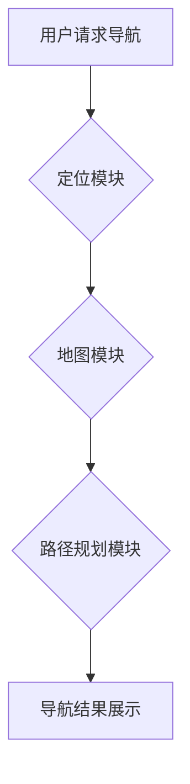

## 商场中精确定位用户所在店铺

> 关键词：室内定位、蓝牙 beacons、WiFi fingerprinting、机器学习、深度学习、商场导航

## 1. 背景介绍

随着移动互联网的快速发展，人们对智能化购物体验的需求日益增长。商场作为重要的商业场所，也开始探索利用技术手段提升顾客体验，其中精确定位用户所在店铺是关键环节。传统的商场导航系统主要依赖于平面地图和指示牌，存在定位精度低、用户体验差等问题。而基于室内定位技术的智能导航系统，能够提供更精准、更便捷的购物体验，为商场运营和顾客服务带来新的机遇。

## 2. 核心概念与联系

### 2.1 室内定位技术概述

室内定位是指在室内环境中确定设备或用户的地理位置。与传统的GPS定位不同，室内定位受限于建筑物结构和信号遮挡，需要采用其他技术手段进行定位。常见的室内定位技术包括：

* **蓝牙 beacons:** 利用蓝牙低功耗技术，商场部署蓝牙信号发射器（beacons），用户手机接收beacons信号，通过信号强度和时间差计算出位置。
* **WiFi fingerprinting:** 利用WiFi信号指纹识别技术，商场提前建立WiFi信号强度数据库，用户手机连接WiFi网络，根据信号强度与数据库匹配，确定位置。
* **超声波定位:** 利用超声波信号进行定位，商场部署超声波发射器和接收器，通过信号传播时间计算出设备位置。
* **RFID技术:** 利用射频识别技术，商场为商品或用户配备RFID标签，通过读取标签信息确定位置。

### 2.2 商场导航系统架构

商场导航系统通常由以下几个模块组成：

* **定位模块:** 负责获取用户位置信息，可以采用上述提到的室内定位技术。
* **地图模块:** 提供商场平面地图信息，包括店铺位置、通道布局等。
* **路径规划模块:** 根据用户目标店铺位置和当前位置，规划出最优路径。
* **展示模块:** 将导航结果以图形、文字等形式展示给用户，例如手机APP、电子地图等。

**Mermaid 流程图**



## 3. 核心算法原理 & 具体操作步骤

### 3.1 算法原理概述

精确定位用户所在店铺的核心算法主要涉及以下几个方面：

* **信号强度计算:** 根据蓝牙 beacons 或 WiFi信号强度，计算出用户与信号源之间的距离。
* **距离三角测量:** 利用多个信号源的距离信息，通过三角测量算法计算出用户位置。
* **机器学习模型训练:** 利用历史定位数据，训练机器学习模型，提高定位精度。

### 3.2 算法步骤详解

以蓝牙 beacons 为例，用户精确定位店铺的具体操作步骤如下：

1. 商场部署多个蓝牙 beacons，每个 beacons 具有唯一的标识符。
2. 用户手机开启蓝牙功能，扫描周围的 beacons。
3. 手机接收 beacons 发送的信号，并记录信号强度。
4. 手机将信号强度信息发送到服务器，服务器根据 beacons 的位置信息和信号强度计算出用户与每个 beacons 的距离。
5. 服务器利用距离三角测量算法，结合多个 beacons 的距离信息，计算出用户的位置坐标。
6. 服务器根据用户位置坐标，查询商场店铺位置数据库，确定用户所在店铺。

### 3.3 算法优缺点

**优点:**

* 定位精度高，能够达到米级甚至厘米级的精度。
* 覆盖范围广，可以覆盖整个商场区域。
* 技术成熟，成本相对较低。

**缺点:**

* 依赖于 beacons 的部署，部署成本较高。
* 信号强度受环境影响较大，例如墙壁、家具等遮挡。
* 算法复杂度较高，需要强大的计算能力。

### 3.4 算法应用领域

蓝牙 beacons 和 WiFi fingerprinting 等室内定位技术广泛应用于以下领域：

* 商场导航和导购
* 室内安全监控和应急管理
* 物流管理和仓储优化
* 智能家居和智慧城市建设

## 4. 数学模型和公式 & 详细讲解 & 举例说明

### 4.1 数学模型构建

假设商场部署了 $n$ 个蓝牙 beacons，每个 beacons 的位置坐标为 $(x_i, y_i)$，用户手机接收到的 beacons $i$ 的信号强度为 $R_i$。

根据信号传播特性，信号强度与距离呈反比关系，可以用以下公式表示：

$$R_i = \frac{k}{d_i}$$

其中，$k$ 为信号强度常数，$d_i$ 为用户手机与 beacons $i$ 的距离。

### 4.2 公式推导过程

根据距离公式，可以得到：

$$d_i = \frac{k}{R_i}$$

将用户手机位置坐标为 $(x, y)$，则根据距离公式，可以得到用户手机与每个 beacons 的距离：

$$d_1 = \sqrt{(x - x_1)^2 + (y - y_1)^2}$$

$$d_2 = \sqrt{(x - x_2)^2 + (y - y_2)^2}$$

$$...$$

$$d_n = \sqrt{(x - x_n)^2 + (y - y_n)^2}$$

将上述距离公式代入 $d_i = \frac{k}{R_i}$，可以得到一个关于 $x$ 和 $y$ 的方程组。

### 4.3 案例分析与讲解

假设商场部署了 3 个 beacons，用户手机接收到的信号强度分别为 $R_1 = -60$ dBm, $R_2 = -55$ dBm, $R_3 = -65$ dBm。 beacons 的位置坐标分别为 $(10, 10)$, $(20, 20)$, $(30, 30)$。

利用上述公式，可以建立一个关于 $x$ 和 $y$ 的方程组，并通过数值解法求解，得到用户手机的位置坐标。

## 5. 项目实践：代码实例和详细解释说明

### 5.1 开发环境搭建

* 操作系统：Windows/Linux/macOS
* 编程语言：Python
* 开发工具：PyCharm/VS Code
* 库依赖：

```python
pip install numpy scipy matplotlib
```

### 5.2 源代码详细实现

```python
import numpy as np
from scipy.optimize import minimize

# beacons 的位置坐标
beacons_positions = np.array([[10, 10], [20, 20], [30, 30]])

# 用户手机接收到的信号强度
received_signal_strengths = np.array([-60, -55, -65])

# 信号强度常数
k = 100

# 定义目标函数
def calculate_distance(position):
    x, y = position
    distances = np.sqrt(np.sum((np.array([x, y]) - beacons_positions)**2, axis=1))
    return np.sum((distances - received_signal_strengths / k)**2)

# 初始化用户位置
initial_position = np.array([15, 15])

# 使用最小化算法求解用户位置
result = minimize(calculate_distance, initial_position)

# 打印用户位置
print("用户位置:", result.x)
```

### 5.3 代码解读与分析

* `beacons_positions`: 存储 beacons 的位置坐标。
* `received_signal_strengths`: 存储用户手机接收到的 beacons 信号强度。
* `k`: 信号强度常数，需要根据实际环境进行调整。
* `calculate_distance`: 计算用户位置与 beacons 的距离误差，作为目标函数。
* `minimize`: 使用最小化算法求解用户位置，使得距离误差最小。
* `initial_position`: 初始化用户位置，可以根据实际情况进行调整。

### 5.4 运行结果展示

运行上述代码，可以得到用户手机的估计位置坐标。

## 6. 实际应用场景

### 6.1 商场导购

商场可以使用室内定位技术，为顾客提供精准的店铺导航服务，帮助顾客快速找到目标商品。

### 6.2 个性化推荐

商场可以根据顾客的定位信息和购物历史，提供个性化的商品推荐，提升顾客购物体验。

### 6.3 促销活动引导

商场可以利用室内定位技术，引导顾客前往促销活动区域，提高活动参与度。

### 6.4 安全监控

商场可以使用室内定位技术，监控顾客流动轨迹，提高安全防范能力。

### 6.5 未来应用展望

随着室内定位技术的不断发展，未来将在更多场景中得到应用，例如：

* 智能零售：提供更精准的商品推荐、个性化购物体验。
* 智能物流：优化仓储管理、提高物流效率。
* 智能医疗：辅助医生定位病人、提供精准医疗服务。
* 智能教育：打造沉浸式学习环境、提升教学效果。

## 7. 工具和资源推荐

### 7.1 学习资源推荐

* **书籍:**

* 《Indoor Positioning Systems》 by  Stefan Posch
* 《Wireless Sensor Networks: Principles and Applications》 by  Charles E. Kolodziej

* **在线课程:**

* Coursera: "Indoor Positioning Systems"
* edX: "Wireless Sensor Networks"

### 7.2 开发工具推荐

* **蓝牙 beacons 开发平台:**

* Estimote
* Kontakt.io

* **WiFi fingerprinting 开发平台:**

* WiFinder
* OpenBeacon

### 7.3 相关论文推荐

* "A Survey of Indoor Positioning Systems" by  Stefan Posch et al.
* "WiFi Fingerprinting for Indoor Localization: A Survey" by  Y. Li et al.

## 8. 总结：未来发展趋势与挑战

### 8.1 研究成果总结

室内定位技术近年来取得了显著进展，定位精度不断提高，应用场景不断拓展。蓝牙 beacons 和 WiFi fingerprinting 等技术已经成熟，并被广泛应用于商场导航、智能零售等领域。

### 8.2 未来发展趋势

未来室内定位技术的发展趋势包括：

* **提高定位精度:** 利用更先进的算法和传感器，提高定位精度，实现厘米级甚至毫米级的定位。
* **降低成本:** 开发更低成本的室内定位设备和解决方案，使其更易于普及。
* **增强安全性:** 加强数据加密和隐私保护，确保用户数据安全。
* **拓展应用场景:** 将室内定位技术应用于更多领域，例如智能医疗、智能教育等。

### 8.3 面临的挑战

室内定位技术还面临一些挑战，例如：

* **环境复杂性:** 室内环境复杂多变，信号遮挡严重，影响定位精度。
* **数据隐私:** 室内定位技术收集大量用户位置数据，需要加强数据隐私保护。
* **标准化问题:** 目前室内定位技术缺乏统一的标准，不同厂商的设备和解决方案互不兼容。

### 8.4 研究展望

未来，室内定位技术将继续朝着更高精度、更低成本、更安全、更广泛应用的方向发展。研究者将继续探索新的算法和技术，克服现有挑战，推动室内定位技术的发展和应用。

## 9. 附录：常见问题与解答

### 9.1 如何选择合适的室内定位技术？

选择合适的室内定位技术需要根据具体应用场景和需求进行考虑。例如，如果需要高精度定位，可以选择蓝牙 beacons 技术；如果需要覆盖范围广，可以选择 WiFi fingerprinting 技术。

### 9.2 如何提高室内定位精度？

提高室内定位精度可以通过以下方法：

* 优化 beacons 布局，增加 beacons 的数量和密度。
* 利用机器学习算法，训练定位模型，提高定位精度。
* 使用多传感器融合技术，结合不同传感器的数据，提高定位精度。

### 9.3 如何解决室内定位数据隐私问题？

解决室内定位数据隐私问题可以通过以下方法：

* 加强数据加密和安全保护，防止数据泄露。
* 采用匿名化技术，保护用户个人信息。
* 明确用户数据使用范围和权限，获得用户同意。


作者：禅与计算机程序设计艺术 / Zen and the Art