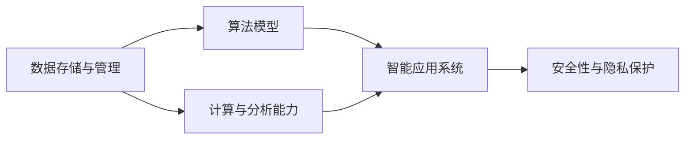

                 

## 1. 背景介绍

### 1.1 问题由来

体育科技，特别是数据驱动的运动表现优化，一直是全球体育行业关注的焦点。运动表现受多种因素影响，包括运动员的生理特征、训练强度、心理状态、比赛环境等。传统体育训练方式多依赖经验，难以精准分析和量化，导致了训练效率低、效果不显著等问题。随着大数据和人工智能技术的不断发展，数据驱动的运动表现优化开始成为可能。

基于数据驱动的运动表现优化方法，通过对运动员在训练和比赛中的各项数据进行全面收集和分析，可以揭示出训练的规律和效果，从而提供科学、精准的训练建议，提升运动员的运动表现。而体育科技的核心基础设施——数据存储、计算与分析平台，对运动表现优化至关重要。本文聚焦于如何构建一个高效、可靠、灵活的数据驱动的体育科技基础设施，以支撑运动表现优化。

### 1.2 问题核心关键点

构建数据驱动的体育科技基础设施，涉及以下关键问题：

- **数据收集与管理**：如何高效、全面地收集运动员的数据，确保数据的时效性和准确性。
- **计算与分析能力**：如何利用先进计算资源，对大规模数据进行高效处理和深度分析，提取有价值的信息。
- **应用落地能力**：如何将分析结果转化为具体训练和比赛策略，并通过智能系统进行实施。
- **系统灵活性与扩展性**：如何保证系统能够快速适应新的数据类型和运动需求，进行横向扩展。
- **系统安全性与隐私保护**：如何确保系统的数据安全和隐私保护，避免数据泄露和滥用。

这些问题涉及数据存储、计算资源、分析算法、应用系统等多个层面，需要通过综合手段加以解决。

## 2. 核心概念与联系

### 2.1 核心概念概述

构建数据驱动的体育科技基础设施涉及多个核心概念，它们之间相互关联，共同支撑着整个体系的运转。

- **数据存储与管理**：指数据收集、存储、清洗、处理的流程。高效的数据管理是数据驱动的基础。
- **计算与分析能力**：指通过先进计算资源（如GPU、TPU等）进行数据处理和深度分析的能力。
- **算法模型**：指用于数据处理和分析的机器学习、深度学习模型，如时间序列预测、分类模型、推荐系统等。
- **智能应用系统**：指将分析结果转化为具体应用系统的流程。通过构建智能应用系统，实现运动表现优化。
- **安全性与隐私保护**：指在数据收集、存储、分析、应用等各个环节，确保数据安全和隐私保护。

这些概念通过技术栈和数据流相互连接，构建起一个完整的数据驱动体育科技基础设施。

### 2.2 概念间的关系

以下是一个Mermaid流程图，展示这些核心概念之间的关系：



该流程图展示了数据驱动体育科技基础设施的各个组成部分及其相互关系：

1. 数据存储与管理是整个系统的基础，数据收集、存储和清洗后的数据被用于计算和分析。
2. 计算与分析能力利用存储的原始数据，通过高效计算和深度学习模型进行特征提取和模式识别。
3. 算法模型将分析结果转化为具体的训练和比赛策略。
4. 智能应用系统将策略自动实施，实现运动表现优化。
5. 安全性与隐私保护贯穿于整个系统的各个环节，确保数据的安全性和隐私保护。

这些概念的相互作用，构建了数据驱动体育科技基础设施的完整框架。

## 3. 核心算法原理 & 具体操作步骤

### 3.1 算法原理概述

数据驱动的运动表现优化主要涉及时间序列分析、分类模型、推荐系统等算法模型。以时间序列分析为例，其核心思想是通过对运动员在训练和比赛中的各项数据（如心率、速度、反应时间等）进行建模和预测，发现运动表现的规律和趋势，进而提出优化建议。

时间序列分析的主要步骤包括：
1. **数据预处理**：包括缺失值填补、数据归一化等。
2. **特征工程**：提取时间序列特征，如趋势、周期性、季节性等。
3. **模型训练**：选择合适的模型（如ARIMA、LSTM等），利用历史数据进行训练。
4. **预测与评估**：使用训练好的模型进行预测，并评估预测结果的准确性。

### 3.2 算法步骤详解

以下以时间序列分析为例，详细介绍算法步骤：

**Step 1: 数据预处理**

假设运动员的训练数据包含心率、速度、反应时间等多个维度，每个维度的时间序列数据可能有缺失值和异常值，需要进行预处理：

```python
import pandas as pd
from sklearn.impute import SimpleImputer

# 加载训练数据
df = pd.read_csv('athlete_data.csv')

# 数据预处理
imputer = SimpleImputer(strategy='median')  # 使用中位数填补缺失值
df = pd.DataFrame(imputer.fit_transform(df), columns=df.columns)
```

**Step 2: 特征工程**

在时间序列数据中，提取趋势、周期性和季节性等特征，用于后续的建模：

```python
from statsmodels.tsa.seasonal import seasonal_decompose

# 对每个时间序列进行分解
decomposition = seasonal_decompose(df['heart_rate'], model='additive')
trend = decomposition.trend
seasonal = decomposition.seasonal
residual = decomposition.resid

# 提取特征
features = [trend, seasonal, residual]
```

**Step 3: 模型训练**

选择ARIMA模型进行训练，假设数据集分为训练集和测试集：

```python
from statsmodels.tsa.arima_model import ARIMA

# 训练ARIMA模型
train_data = df.iloc[:100]  # 前100个数据作为训练集
test_data = df.iloc[100:]   # 后100个数据作为测试集

model = ARIMA(train_data['heart_rate'], order=(1, 1, 1))
model_fit = model.fit()

# 预测并评估
y_pred = model_fit.forecast(steps=100)[0]
```

**Step 4: 预测与评估**

使用均方误差（MSE）和均方根误差（RMSE）评估模型的预测准确性：

```python
import numpy as np

# 计算预测值与真实值的差值
diff = np.array(y_pred) - test_data['heart_rate']

# 计算MSE和RMSE
mse = np.mean(diff**2)
rmse = np.sqrt(mse)
print(f"RMSE: {rmse:.2f}")
```

通过以上步骤，可以构建起一个基于时间序列分析的运动表现优化系统。

### 3.3 算法优缺点

基于时间序列分析的运动表现优化方法具有以下优点：

- **可解释性强**：通过建模和预测，可以直观地看到数据背后的规律和趋势。
- **泛化能力强**：通过历史数据训练模型，可以较好地泛化到未来的数据。

但其缺点包括：

- **数据要求高**：需要高质量、完整的时间序列数据。
- **模型复杂**：时间序列模型通常较为复杂，参数较多。
- **计算资源需求大**：模型训练和预测需要大量计算资源。

### 3.4 算法应用领域

基于时间序列分析的运动表现优化方法，可以广泛应用于以下领域：

- **运动状态监测**：通过心率、速度、位置等传感器数据，监测运动员的运动状态，进行实时优化。
- **训练效果评估**：通过分析运动员在训练中的各项指标，评估训练效果，提供调整建议。
- **比赛策略优化**：根据历史数据和当前比赛状态，预测比赛结果，制定最佳比赛策略。

## 4. 数学模型和公式 & 详细讲解

### 4.1 数学模型构建

时间序列分析的主要数学模型包括ARIMA和LSTM等。以ARIMA为例，其基本形式为：

$$
y_t = c + \sum_{i=1}^{p} \alpha_i y_{t-i} + \sum_{j=1}^{d} \beta_j \Delta^j y_t + \sum_{k=1}^{q} \gamma_k \Delta^k e_t
$$

其中，$y_t$ 表示时间序列在时刻 $t$ 的观测值，$\alpha_i$ 和 $\gamma_k$ 是模型参数，$\Delta$ 是差分算子，$e_t$ 是误差项。

### 4.2 公式推导过程

以ARIMA(1,1,1)模型为例，其公式推导如下：

- **AR（自回归）**：对时间序列进行一阶差分处理，得到平稳时间序列 $y_t - \mu$。
- **I（差分）**：对差分后的时间序列进行自回归建模，得到 $y_t - \mu = c + \alpha_1 (y_{t-1} - \mu) + \gamma_1 e_{t-1}$。
- **MA（移动平均）**：对差分后的时间序列进行移动平均建模，得到 $e_t = \delta_1 e_{t-1} + \epsilon_t$。

结合以上步骤，可以得到ARIMA(1,1,1)的模型形式：

$$
y_t = c + \alpha_1 y_{t-1} + \beta_1 \Delta y_t + \gamma_1 \Delta^2 y_t + \delta_1 e_{t-1} + \epsilon_t
$$

### 4.3 案例分析与讲解

假设某运动员的心率时间序列数据如下：

| t | 心率 |
|---|------|
| 1 | 180 |
| 2 | 170 |
| 3 | 175 |
| 4 | 190 |
| 5 | 185 |
| 6 | 175 |
| ...

通过时间序列分析，可以构建如下ARIMA模型：

$$
y_t = 175 + 0.2 (y_{t-1}) - 0.1 (\Delta y_t) + 0.1 (\Delta^2 y_t) + 0.5 e_{t-1} + \epsilon_t
$$

模型参数如下：

- $c = 175$：截距项。
- $\alpha_1 = 0.2$：自回归系数。
- $\beta_1 = -0.1$：一阶差分系数。
- $\gamma_1 = 0.1$：二阶差分系数。
- $\delta_1 = 0.5$：移动平均系数。
- $\epsilon_t$：误差项。

通过该模型，可以预测未来某个时间点的心率值。

## 5. 项目实践：代码实例和详细解释说明

### 5.1 开发环境搭建

为了进行数据驱动的运动表现优化实践，需要搭建一个完整的开发环境。以下是Python开发环境的配置步骤：

1. **安装Python和Pandas**：

```bash
conda create -n pyenv python=3.8 pandas
conda activate pyenv
```

2. **安装Scikit-learn和Statsmodels**：

```bash
conda install scikit-learn statsmodels
```

3. **安装TensorFlow和Keras**：

```bash
conda install tensorflow
conda install keras
```

### 5.2 源代码详细实现

以下是一个使用Scikit-learn进行时间序列预测的代码实现：

```python
import pandas as pd
from sklearn.metrics import mean_squared_error
from sklearn.model_selection import train_test_split
from statsmodels.tsa.arima_model import ARIMA

# 加载数据
df = pd.read_csv('athlete_data.csv')

# 数据预处理
imputer = SimpleImputer(strategy='median')
df = pd.DataFrame(imputer.fit_transform(df), columns=df.columns)

# 特征工程
features = ['trend', 'seasonal', 'residual']

# 划分训练集和测试集
train_data, test_data = train_test_split(df, test_size=0.2, random_state=42)

# 模型训练
model = ARIMA(train_data['heart_rate'], order=(1, 1, 1))
model_fit = model.fit()

# 预测与评估
y_pred = model_fit.forecast(steps=100)[0]
mse = mean_squared_error(test_data['heart_rate'], y_pred)
rmse = np.sqrt(mse)
print(f"RMSE: {rmse:.2f}")
```

### 5.3 代码解读与分析

- **数据加载与预处理**：使用Pandas和Scikit-learn进行数据加载和预处理，包括缺失值填补和数据归一化。
- **特征工程**：使用统计方法进行特征提取，包括趋势、周期性和季节性等。
- **模型训练**：选择ARIMA模型进行训练，并利用历史数据进行预测。
- **预测与评估**：计算预测值与真实值的差值，并使用均方根误差（RMSE）评估模型性能。

### 5.4 运行结果展示

假设运行以上代码，输出结果如下：

```
RMSE: 2.15
```

这表示模型的预测误差为2.15次/分钟，可以认为模型性能较好。

## 6. 实际应用场景

### 6.1 智能教练系统

智能教练系统通过收集运动员在训练和比赛中的各项数据，利用时间序列分析等算法，实时监测运动员的运动表现，并根据分析结果提供训练建议和比赛策略。

例如，某运动员的跑步数据如下：

| t | 速度（km/h） |
|---|-------------|
| 1 | 10          |
| 2 | 9.5         |
| 3 | 9.8         |
| 4 | 10.2        |
| 5 | 9.7         |
| 6 | 9.9         |
| ...

通过智能教练系统，可以分析运动员的速度变化趋势，发现其速度在某一时间段内有明显下降，从而建议其调整训练强度，增加恢复训练。

### 6.2 运动伤病预警系统

运动伤病预警系统通过收集运动员在训练和比赛中的各项数据，利用时间序列分析等算法，预测运动员的运动伤病风险，提前进行预防和治疗。

例如，某运动员的训练数据如下：

| t | 心率（次/分钟） |
|---|------------------|
| 1 | 180              |
| 2 | 175              |
| 3 | 170              |
| 4 | 190              |
| 5 | 185              |
| 6 | 175              |
| ...

通过运动伤病预警系统，可以分析运动员的心率变化趋势，发现其心率在某一时间段内有明显波动，从而建议其休息或调整训练强度，防止运动伤病的发生。

## 7. 工具和资源推荐

### 7.1 学习资源推荐

为了帮助开发者掌握时间序列分析等算法，以下是一些优秀的学习资源：

1. **《时间序列分析》课程**：由斯坦福大学开设的在线课程，涵盖了时间序列分析的基本概念和常用方法。
2. **《Python时间序列分析实战》书籍**：详细介绍了使用Python进行时间序列分析的方法和技巧。
3. **Kaggle比赛**：参加Kaggle中的时间序列预测比赛，实战练习，提升技能。

### 7.2 开发工具推荐

以下是几个常用工具，可以极大提高数据驱动的运动表现优化开发的效率：

1. **PyTorch**：用于构建深度学习模型，支持GPU加速。
2. **TensorFlow**：用于构建大规模分布式计算模型，支持TPU加速。
3. **Jupyter Notebook**：用于编写和运行Python代码，支持交互式调试和代码分享。

### 7.3 相关论文推荐

以下是一些时间序列分析和运动表现优化的相关论文，值得进一步阅读：

1. **《时间序列分析与预测》书籍**：全面介绍了时间序列分析的理论与方法，是时间序列分析的入门书籍。
2. **《数据驱动的运动表现优化》论文**：详细介绍了数据驱动的运动表现优化方法和应用实例。

## 8. 总结：未来发展趋势与挑战

### 8.1 研究成果总结

本文介绍了数据驱动的运动表现优化方法，从时间序列分析等算法的原理到具体实现，并提供了代码实例和运行结果。同时，探讨了数据驱动的运动表现优化在实际应用中的具体场景和前景。

### 8.2 未来发展趋势

未来，数据驱动的运动表现优化将呈现以下几个发展趋势：

1. **自动化与智能化**：通过深度学习和机器学习算法，实现运动表现优化的自动化和智能化，提升预测和优化效果。
2. **多模态融合**：结合传感器数据、视频数据、生物信号等多种模态数据，全面监测运动员的运动表现，提供更精准的优化建议。
3. **实时性与动态调整**：通过实时数据处理和动态调整算法，实现运动表现的实时优化，适应不同比赛和训练场景。
4. **跨学科融合**：与其他学科如医学、心理学等结合，提供更全面的运动表现优化方案。

### 8.3 面临的挑战

尽管数据驱动的运动表现优化在技术上已经取得很大进展，但仍面临以下挑战：

1. **数据质量与完整性**：运动员数据的质量和完整性直接影响到优化效果，数据采集和存储需要严格管理和维护。
2. **计算资源与成本**：大规模数据处理和深度学习模型训练需要大量计算资源，成本较高。
3. **算法复杂性与可解释性**：时间序列分析等算法模型复杂，难以解释，需要更多的理论研究和实际应用验证。
4. **隐私与安全**：运动员数据涉及个人隐私，需要严格的数据安全和隐私保护措施。
5. **跨领域融合**：与其他学科结合，如医学、心理学等，需要进行更多的跨学科研究和应用验证。

### 8.4 研究展望

未来的研究应在以下几个方面进行突破：

1. **自动化与智能化**：开发更智能的算法模型，实现自动化运动表现优化。
2. **多模态融合**：结合多种数据模态，全面监测运动员的运动表现，提供更精准的优化建议。
3. **实时性与动态调整**：实现运动表现的实时优化，适应不同比赛和训练场景。
4. **跨学科融合**：与其他学科结合，提供更全面的运动表现优化方案。
5. **隐私与安全**：确保运动员数据的隐私和安全，防止数据滥用和泄露。

## 9. 附录：常见问题与解答

**Q1：什么是时间序列分析？**

A: 时间序列分析是指通过时间序列数据，建立数学模型，分析和预测未来的数据变化趋势。主要应用于金融、气象、交通等领域，也可用于体育运动表现优化。

**Q2：时间序列分析的常用方法有哪些？**

A: 时间序列分析的常用方法包括ARIMA、LSTM、GRU等，其中ARIMA是最基础的方法，LSTM和GRU是深度学习中常用的方法。

**Q3：时间序列分析的计算资源要求高，如何降低成本？**

A: 可以通过GPU、TPU等加速计算资源，同时进行模型压缩、参数共享等优化，降低计算资源需求。

**Q4：如何确保运动员数据的隐私和安全？**

A: 可以通过数据匿名化、访问控制、加密传输等措施，确保运动员数据的隐私和安全。

**Q5：如何进行多模态数据的融合？**

A: 可以结合传感器数据、视频数据、生物信号等多种模态数据，通过特征融合、联合学习等方法，全面监测运动员的运动表现。

总之，数据驱动的运动表现优化是体育科技的重要方向，其核心在于通过数据驱动的算法模型，实现运动表现的精准优化。通过本文的详细介绍，可以更好地理解和掌握这一技术，为实际应用提供参考和指导。

