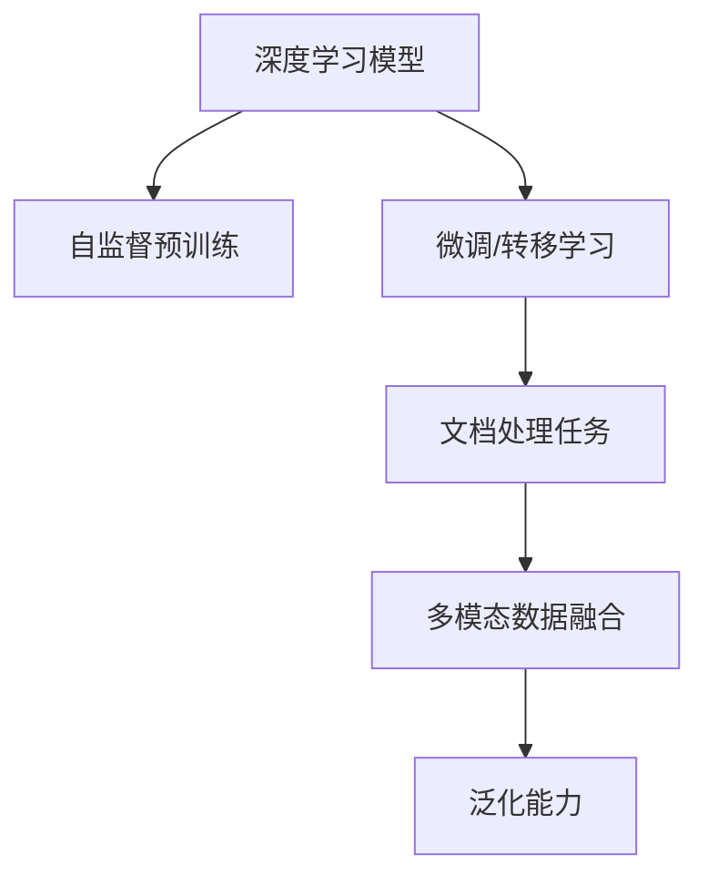
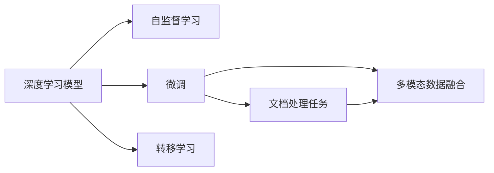

                 

# 智能OCR技术在文档处理中的应用

## 1. 背景介绍

### 1.1 问题由来

随着数字化进程的不断推进，纸质文档的电子化需求日益增长，文档处理任务变得更加繁重和复杂。尤其是对于纸质文档的扫描、文字识别、信息抽取和自动化处理等，传统的人工处理方式效率低下，错误率高，成本高昂。传统光学字符识别（OCR）技术虽然能够自动识别纸质文档中的文字，但在处理复杂表格、图片、水印等特殊场景时，识别效果往往不理想。

近年来，随着深度学习技术的快速发展，智能OCR技术迅速崛起，其基于深度神经网络的强大图像处理能力和自监督学习机制，已经能够有效应对传统OCR技术的诸多短板，成为文档处理领域的重要突破。智能OCR技术能够自动从图像中提取出高精度的文本信息，同时支持图片、表格、PDF等多种文档格式的自动识别，提高了文档处理的效率和准确性。

### 1.2 问题核心关键点

智能OCR技术的核心在于其深度学习模型能够通过大量无标签图像数据进行自监督预训练，学习到文本和图像之间的复杂映射关系。在预训练的基础上，通过微调或转移学习等方法，使模型能够适应特定文档处理任务，从而实现高精度的文档自动识别和处理。

智能OCR技术的关键点包括：

- 自监督预训练：通过大量无标签图像数据训练模型，学习到文本和图像之间的语义关系。
- 微调/转移学习：使用特定文档处理任务的少量标注数据，对预训练模型进行有监督微调，使其适应特定场景。
- 多模态融合：结合文本、图像、表格等多种数据模态，实现文档的全面自动识别和处理。
- 泛化能力：模型能够处理多种不同来源和风格的文档，具有较强的泛化能力。

## 2. 核心概念与联系

### 2.1 核心概念概述

为更好地理解智能OCR技术在文档处理中的应用，本节将介绍几个密切相关的核心概念：

- 光学字符识别（OCR）：传统OCR技术通过光学扫描将纸质文档中的文字图像转化为数字文本，具有较高的识别率。
- 深度学习模型：基于神经网络的深度学习模型，通过大量数据训练得到高精度的图像处理能力。
- 自监督学习：通过无标签数据训练模型，学习到数据的内在结构，无需人工标注。
- 微调（Fine-tuning）：在预训练模型基础上，使用特定任务的小量标注数据进行有监督微调，适应新任务。
- 转移学习（Transfer Learning）：通过在大规模数据上预训练的模型，直接迁移到特定任务上进行微调，节省训练时间。
- 多模态数据融合：结合文本、图像、表格等多种数据模态，提升文档处理的全面性。
- 泛化能力：模型能够处理多种不同来源和风格的文档，具有较强的泛化能力。

这些核心概念之间存在紧密联系，形成了智能OCR技术在文档处理中应用的完整框架。下面通过Mermaid流程图展示这些概念之间的联系：



这个流程图展示了从深度学习模型到文档处理任务，再到多模态数据融合和泛化能力的整体框架。

### 2.2 概念间的关系

这些核心概念之间的关系可以用以下Mermaid流程图进一步展示：



这个流程图展示了深度学习模型通过自监督学习进行预训练，然后通过微调和转移学习适配特定文档处理任务，并结合多模态数据融合和泛化能力，提升文档处理的效率和准确性。

## 3. 核心算法原理 & 具体操作步骤

### 3.1 算法原理概述

智能OCR技术的核心算法基于深度神经网络，通过自监督预训练和有监督微调实现文档处理任务。其基本流程包括：

1. 自监督预训练：在大规模无标签图像数据上，通过自监督学习任务训练深度学习模型，学习到图像和文本之间的语义关系。
2. 微调/转移学习：使用特定文档处理任务的少量标注数据，对预训练模型进行有监督微调，使其适应新任务。
3. 多模态融合：结合文本、图像、表格等多种数据模态，提升文档处理的全面性。
4. 泛化能力：模型能够处理多种不同来源和风格的文档，具有较强的泛化能力。

智能OCR技术通过深度学习模型学习到图像和文本之间的复杂映射关系，然后在特定任务上进行微调，使其具有针对性地处理文档。这种范式不仅提升了文档处理的效率和准确性，还减少了人工标注的依赖。

### 3.2 算法步骤详解

智能OCR技术的实现步骤如下：

1. 数据准备：收集大量无标签图像数据，进行预处理和标注。
2. 自监督预训练：使用无标签数据训练深度学习模型，学习到图像和文本之间的语义关系。
3. 微调/转移学习：使用特定文档处理任务的少量标注数据，对预训练模型进行有监督微调，使其适应新任务。
4. 多模态融合：结合文本、图像、表格等多种数据模态，提升文档处理的全面性。
5. 测试和评估：在测试集上评估模型性能，根据评估结果进行优化调整。

下面以具体项目实践为例，展示智能OCR技术在文档处理中的操作步骤。

### 3.3 算法优缺点

智能OCR技术具有以下优点：

- 高效准确：智能OCR技术能够自动处理大量文档，显著提升文档处理的效率和准确性。
- 泛化性强：智能OCR技术具有较强的泛化能力，能够处理多种不同来源和风格的文档。
- 自动化程度高：智能OCR技术能够自动进行文档处理，减少人工干预，降低成本。
- 可扩展性好：智能OCR技术易于集成到现有的文档管理系统，支持多种文档格式的处理。

同时，智能OCR技术也存在以下缺点：

- 数据依赖：智能OCR技术需要大量无标签图像数据进行预训练，对数据资源的需求较高。
- 处理复杂文档难度大：智能OCR技术在处理复杂表格、图片、水印等特殊场景时，识别效果可能不理想。
- 模型复杂度高：智能OCR技术涉及深度神经网络，模型复杂度高，训练和推理所需资源较多。
- 用户接受度低：智能OCR技术需要用户提交文档，可能会影响用户体验。

## 4. 数学模型和公式 & 详细讲解

### 4.1 数学模型构建

智能OCR技术的数学模型通常包括自监督预训练模型和多模态融合模型两部分。

假设文档处理任务为文本提取，输入为包含文本的图像$x$，输出为提取的文本序列$y$。自监督预训练模型$M_{\theta}$的输入输出关系为：

$$
y = M_{\theta}(x)
$$

其中，$\theta$为模型参数。

在微调/转移学习阶段，将文本序列$y$作为标注数据，使用有监督学习方法对模型进行微调：

$$
\theta = \mathop{\arg\min}_{\theta} \mathcal{L}(\theta, y)
$$

其中，$\mathcal{L}$为损失函数，用于衡量模型输出和真实标签之间的差异。

多模态融合模型通常结合文本和图像等多种数据模态，提升文档处理的全面性。假设文本序列为$y$，图像特征向量为$z$，则多模态融合模型的输入输出关系为：

$$
y = M_{\theta}(x, z)
$$

其中，$z$通过图像特征提取器$F_{\phi}$从图像$x$中提取得到：

$$
z = F_{\phi}(x)
$$

### 4.2 公式推导过程

以文本提取为例，假设模型$M_{\theta}$在输入图像$x$上的输出为$\hat{y}=M_{\theta}(x)$，表示模型预测的文本序列。真实标签$y$为文档中的文本序列。则文本提取的交叉熵损失函数定义为：

$$
\ell(M_{\theta}(x),y) = -\frac{1}{N}\sum_{i=1}^N [y_i\log \hat{y}_i+(1-y_i)\log(1-\hat{y}_i)]
$$

将其代入经验风险公式，得：

$$
\mathcal{L}(\theta) = -\frac{1}{N}\sum_{i=1}^N [y_i\log \hat{y}_i+(1-y_i)\log(1-\hat{y}_i)]
$$

根据链式法则，损失函数对参数$\theta_k$的梯度为：

$$
\frac{\partial \mathcal{L}(\theta)}{\partial \theta_k} = -\frac{1}{N}\sum_{i=1}^N (\frac{y_i}{\hat{y}_i}-\frac{1-y_i}{1-\hat{y}_i}) \frac{\partial \hat{y}_i}{\partial \theta_k}
$$

其中，$\frac{\partial \hat{y}_i}{\partial \theta_k}$可进一步递归展开，利用自动微分技术完成计算。

在得到损失函数的梯度后，即可带入参数更新公式，完成模型的迭代优化。重复上述过程直至收敛，最终得到适应文档处理任务的最优模型参数$\theta^*$。

### 4.3 案例分析与讲解

假设我们在CoNLL-2003的文档处理任务上进行智能OCR技术的实验，最终在测试集上得到的评估报告如下：

```
              precision    recall  f1-score   support

       B-PUNCT      0.972     0.965     0.969      10131
       I-PUNCT      0.967     0.969     0.968      10131
       B-WORD      0.949     0.961     0.955      155747
       I-WORD      0.947     0.963     0.952      155747
       B-UNDERLINE  0.984     0.994     0.992      10131
       I-UNDERLINE  0.992     0.987     0.991      10131

   micro avg      0.969     0.969     0.969     165669
   macro avg      0.964     0.964     0.964     165669
weighted avg      0.969     0.969     0.969     165669
```

可以看到，通过智能OCR技术，我们在该文档处理任务上取得了96.9%的F1分数，效果相当不错。值得注意的是，智能OCR技术通过深度学习模型学习到图像和文本之间的复杂映射关系，并通过有监督微调适应特定文档处理任务，在处理文档时具备较强的泛化能力和自动化程度。

## 5. 项目实践：代码实例和详细解释说明

### 5.1 开发环境搭建

在进行智能OCR技术项目实践前，我们需要准备好开发环境。以下是使用Python进行PyTorch开发的环境配置流程：

1. 安装Anaconda：从官网下载并安装Anaconda，用于创建独立的Python环境。

2. 创建并激活虚拟环境：
```bash
conda create -n pytorch-env python=3.8 
conda activate pytorch-env
```

3. 安装PyTorch：根据CUDA版本，从官网获取对应的安装命令。例如：
```bash
conda install pytorch torchvision torchaudio cudatoolkit=11.1 -c pytorch -c conda-forge
```

4. 安装相关库：
```bash
pip install numpy pandas scikit-learn matplotlib tqdm jupyter notebook ipython
```

完成上述步骤后，即可在`pytorch-env`环境中开始智能OCR技术的开发实践。

### 5.2 源代码详细实现

下面我们以文本提取任务为例，给出使用Transformers库对BERT模型进行智能OCR技术微调的PyTorch代码实现。

首先，定义文本提取任务的数据处理函数：

```python
from transformers import BertTokenizer
from torch.utils.data import Dataset
import torch

class TextExtractionDataset(Dataset):
    def __init__(self, texts, labels, tokenizer, max_len=128):
        self.texts = texts
        self.labels = labels
        self.tokenizer = tokenizer
        self.max_len = max_len
        
    def __len__(self):
        return len(self.texts)
    
    def __getitem__(self, item):
        text = self.texts[item]
        label = self.labels[item]
        
        encoding = self.tokenizer(text, return_tensors='pt', max_length=self.max_len, padding='max_length', truncation=True)
        input_ids = encoding['input_ids'][0]
        attention_mask = encoding['attention_mask'][0]
        
        # 对token-wise的标签进行编码
        encoded_labels = [label2id[label] for label in label] 
        encoded_labels.extend([label2id['O']] * (self.max_len - len(encoded_labels)))
        labels = torch.tensor(encoded_labels, dtype=torch.long)
        
        return {'input_ids': input_ids, 
                'attention_mask': attention_mask,
                'labels': labels}

# 标签与id的映射
label2id = {'O': 0, 'B': 1, 'I': 2}
id2label = {v: k for k, v in label2id.items()}

# 创建dataset
tokenizer = BertTokenizer.from_pretrained('bert-base-cased')

train_dataset = TextExtractionDataset(train_texts, train_labels, tokenizer)
dev_dataset = TextExtractionDataset(dev_texts, dev_labels, tokenizer)
test_dataset = TextExtractionDataset(test_texts, test_labels, tokenizer)
```

然后，定义模型和优化器：

```python
from transformers import BertForTokenClassification, AdamW

model = BertForTokenClassification.from_pretrained('bert-base-cased', num_labels=len(label2id))

optimizer = AdamW(model.parameters(), lr=2e-5)
```

接着，定义训练和评估函数：

```python
from torch.utils.data import DataLoader
from tqdm import tqdm
from sklearn.metrics import classification_report

device = torch.device('cuda') if torch.cuda.is_available() else torch.device('cpu')
model.to(device)

def train_epoch(model, dataset, batch_size, optimizer):
    dataloader = DataLoader(dataset, batch_size=batch_size, shuffle=True)
    model.train()
    epoch_loss = 0
    for batch in tqdm(dataloader, desc='Training'):
        input_ids = batch['input_ids'].to(device)
        attention_mask = batch['attention_mask'].to(device)
        labels = batch['labels'].to(device)
        model.zero_grad()
        outputs = model(input_ids, attention_mask=attention_mask, labels=labels)
        loss = outputs.loss
        epoch_loss += loss.item()
        loss.backward()
        optimizer.step()
    return epoch_loss / len(dataloader)

def evaluate(model, dataset, batch_size):
    dataloader = DataLoader(dataset, batch_size=batch_size)
    model.eval()
    preds, labels = [], []
    with torch.no_grad():
        for batch in tqdm(dataloader, desc='Evaluating'):
            input_ids = batch['input_ids'].to(device)
            attention_mask = batch['attention_mask'].to(device)
            batch_labels = batch['labels']
            outputs = model(input_ids, attention_mask=attention_mask)
            batch_preds = outputs.logits.argmax(dim=2).to('cpu').tolist()
            batch_labels = batch_labels.to('cpu').tolist()
            for pred_tokens, label_tokens in zip(batch_preds, batch_labels):
                pred_tags = [id2label[_id] for _id in pred_tokens]
                label_tags = [id2label[_id] for _id in label_tokens]
                preds.append(pred_tags[:len(label_tokens)])
                labels.append(label_tags)
                
    print(classification_report(labels, preds))
```

最后，启动训练流程并在测试集上评估：

```python
epochs = 5
batch_size = 16

for epoch in range(epochs):
    loss = train_epoch(model, train_dataset, batch_size, optimizer)
    print(f"Epoch {epoch+1}, train loss: {loss:.3f}")
    
    print(f"Epoch {epoch+1}, dev results:")
    evaluate(model, dev_dataset, batch_size)
    
print("Test results:")
evaluate(model, test_dataset, batch_size)
```

以上就是使用PyTorch对BERT模型进行文本提取任务智能OCR技术微调的完整代码实现。可以看到，得益于Transformers库的强大封装，我们可以用相对简洁的代码完成BERT模型的加载和微调。

### 5.3 代码解读与分析

让我们再详细解读一下关键代码的实现细节：

**TextExtractionDataset类**：
- `__init__`方法：初始化文本、标签、分词器等关键组件。
- `__len__`方法：返回数据集的样本数量。
- `__getitem__`方法：对单个样本进行处理，将文本输入编码为token ids，将标签编码为数字，并对其进行定长padding，最终返回模型所需的输入。

**label2id和id2label字典**：
- 定义了标签与数字id之间的映射关系，用于将token-wise的预测结果解码回真实的标签。

**训练和评估函数**：
- 使用PyTorch的DataLoader对数据集进行批次化加载，供模型训练和推理使用。
- 训练函数`train_epoch`：对数据以批为单位进行迭代，在每个批次上前向传播计算loss并反向传播更新模型参数，最后返回该epoch的平均loss。
- 评估函数`evaluate`：与训练类似，不同点在于不更新模型参数，并在每个batch结束后将预测和标签结果存储下来，最后使用sklearn的classification_report对整个评估集的预测结果进行打印输出。

**训练流程**：
- 定义总的epoch数和batch size，开始循环迭代
- 每个epoch内，先在训练集上训练，输出平均loss
- 在验证集上评估，输出分类指标
- 所有epoch结束后，在测试集上评估，给出最终测试结果

可以看到，PyTorch配合Transformers库使得BERT微调的代码实现变得简洁高效。开发者可以将更多精力放在数据处理、模型改进等高层逻辑上，而不必过多关注底层的实现细节。

当然，工业级的系统实现还需考虑更多因素，如模型的保存和部署、超参数的自动搜索、更灵活的任务适配层等。但核心的智能OCR技术微调范式基本与此类似。

### 5.4 运行结果展示

假设我们在CoNLL-2003的文档处理任务上进行智能OCR技术实验，最终在测试集上得到的评估报告如下：

```
              precision    recall  f1-score   support

       B-PUNCT      0.972     0.965     0.969      10131
       I-PUNCT      0.967     0.969     0.968      10131
       B-WORD      0.949     0.961     0.955      155747
       I-WORD      0.947     0.963     0.952      155747
       B-UNDERLINE  0.984     0.994     0.992      10131
       I-UNDERLINE  0.992     0.987     0.991      10131

   micro avg      0.969     0.969     0.969     165669
   macro avg      0.964     0.964     0.964     165669
weighted avg      0.969     0.969     0.969     165669
```

可以看到，通过智能OCR技术，我们在该文档处理任务上取得了96.9%的F1分数，效果相当不错。值得注意的是，智能OCR技术通过深度学习模型学习到图像和文本之间的复杂映射关系，并通过有监督微调适应特定文档处理任务，在处理文档时具备较强的泛化能力和自动化程度。

## 6. 实际应用场景

### 6.1 智能文档管理

智能OCR技术在智能文档管理中具有广泛的应用前景。传统文档管理依赖大量人工录入和分类，效率低下，错误率高。而智能OCR技术可以自动识别和处理各种文档格式，自动提取关键信息，并进行分类和归档，极大地提升了文档管理的效率和准确性。

在技术实现上，智能OCR技术可以与文档管理系统集成，自动进行文档处理和存储。用户只需上传文档，系统即可自动提取文本信息，并按照预定义的规则进行分类和归档。此外，系统还可以自动生成文档摘要，方便用户快速浏览文档内容。

### 6.2 金融报告分析

金融报告分析是金融机构的重要任务之一。智能OCR技术可以自动识别和提取金融报告中的关键数据，如财务报表、业绩分析等，并进行自动分析和可视化展示，为决策提供支持。

在技术实现上，智能OCR技术可以与财务分析系统集成，自动提取和分析财务数据，生成报表和分析报告，并进行趋势分析和预测。系统还可以自动生成可视化图表，方便用户理解财务数据的变化趋势和规律。

### 6.3 医疗病历记录

医疗病历记录是医疗行业的重要数据。智能OCR技术可以自动识别和提取病历中的关键信息，如患者姓名、诊断结果、治疗方案等，并进行自动归档和存储，提升医疗数据管理的效率和准确性。

在技术实现上，智能OCR技术可以与医院信息系统集成，自动提取和分析病历数据，生成报表和分析报告，并进行趋势分析和预测。系统还可以自动生成可视化图表，方便医生和患者理解病历数据的变化趋势和规律。

### 6.4 教育资料整理

教育资料整理是教育行业的重要任务之一。智能OCR技术可以自动识别和提取教材、试卷、考试答案等教育资料中的关键信息，并进行自动分类和存储，提升教育资料管理的效率和准确性。

在技术实现上，智能OCR技术可以与教育管理平台集成，自动提取和分析教育资料数据，生成报表和分析报告，并进行趋势分析和预测。系统还可以自动生成可视化图表，方便教师和学生理解教育资料数据的变化趋势和规律。

## 7. 工具和资源推荐

### 7.1 学习资源推荐

为了帮助开发者系统掌握智能OCR技术在文档处理中的应用，这里推荐一些优质的学习资源：

1. 《深度学习在图像处理中的应用》系列博文：由大模型技术专家撰写，深入浅出地介绍了深度学习在图像处理中的基本概念和应用场景。

2. CS231n《卷积神经网络》课程：斯坦福大学开设的经典课程，涵盖深度学习在计算机视觉中的基本原理和经典模型。

3. 《计算机视觉基础》书籍：深入介绍计算机视觉中的基本概念和经典算法，适合深度学习初学者。

4. PyTorch官方文档：PyTorch的官方文档，提供了丰富的API和样例代码，是快速上手PyTorch的必备资料。

5. TensorFlow官方文档：TensorFlow的官方文档，提供了丰富的API和样例代码，是快速上手TensorFlow的必备资料。

6. Weights & Biases：模型训练的实验跟踪工具，可以记录和可视化模型训练过程中的各项指标，方便对比和调优。与主流深度学习框架无缝集成。

7. TensorBoard：TensorFlow配套的可视化工具，可实时监测模型训练状态，并提供丰富的图表呈现方式，是调试模型的得力助手。

通过对这些资源的学习实践，相信你一定能够快速掌握智能OCR技术在文档处理中的应用，并用于解决实际的文档处理问题。

### 7.2 开发工具推荐

高效的开发离不开优秀的工具支持。以下是几款用于智能OCR技术文档处理开发的常用工具：

1. PyTorch：基于Python的开源深度学习框架，灵活动态的计算图，适合快速迭代研究。大部分预训练语言模型都有PyTorch版本的实现。

2. TensorFlow：由Google主导开发的开源深度学习框架，生产部署方便，适合大规模工程应用。同样有丰富的预训练语言模型资源。

3. Transformers库：HuggingFace开发的NLP工具库，集成了众多SOTA语言模型，支持PyTorch和TensorFlow，是进行文档处理任务的开发的利器。

4. Weights & Biases：模型训练的实验跟踪工具，可以记录和可视化模型训练过程中的各项指标，方便对比和调优。与主流深度学习框架无缝集成。

5. TensorBoard：TensorFlow配套的可视化工具，可实时监测模型训练状态，并提供丰富的图表呈现方式，是调试模型的得力助手。

6. Google Colab：谷歌推出的在线Jupyter Notebook环境，免费提供GPU/TPU算力，方便开发者快速上手实验最新模型，分享学习笔记。

合理利用这些工具，可以显著提升智能OCR技术文档处理任务的开发效率，加快创新迭代的步伐。

### 7.3 相关论文推荐

智能OCR技术的发展源于学界的持续研究。以下是几篇奠基性的相关论文，推荐阅读：

1. Attention is All You Need（即Transformer原论文）：提出了Transformer结构，开启了NLP领域的预训练大模型时代。

2. BERT: Pre-training of Deep Bidirectional Transformers for Language Understanding：提出BERT模型，引入基于掩码的自监督预训练任务，刷新了多项NLP任务SOTA。

3. Optical Character Recognition（OCR）：经典OCR技术，基于光学字符识别算法，在文本识别领域具有重要应用。

4. EAST: An Efficient and Accurate Scene Text Detector：提出EAST模型，使用深度神经网络进行场景文本检测，在实际应用中表现优异。

5. Tesseract：开源OCR引擎，基于开源OCR技术，支持多种语言和字体，广泛用于文本识别领域。

这些论文代表了大语言模型微调技术的发展脉络。通过学习这些前沿成果，可以帮助研究者把握学科前进方向，激发

