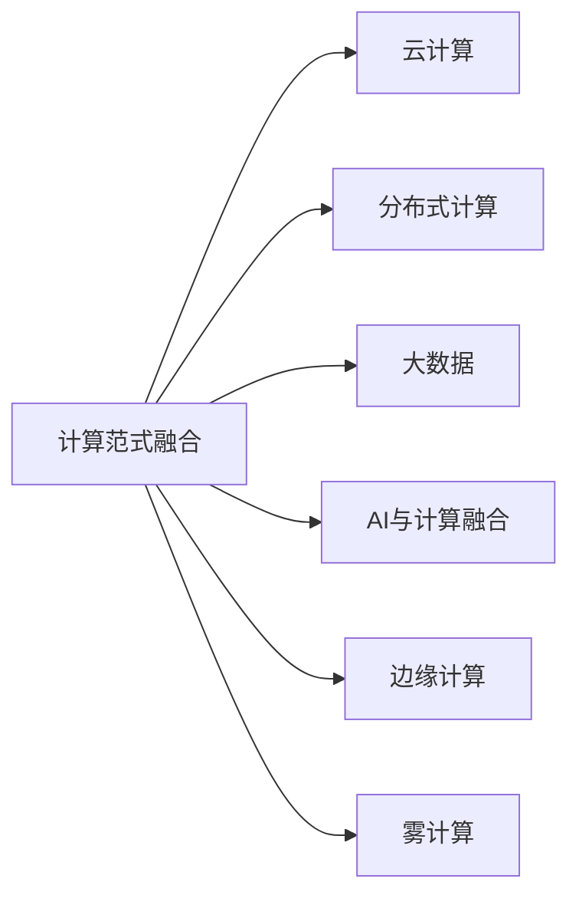
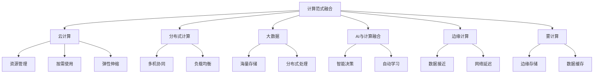
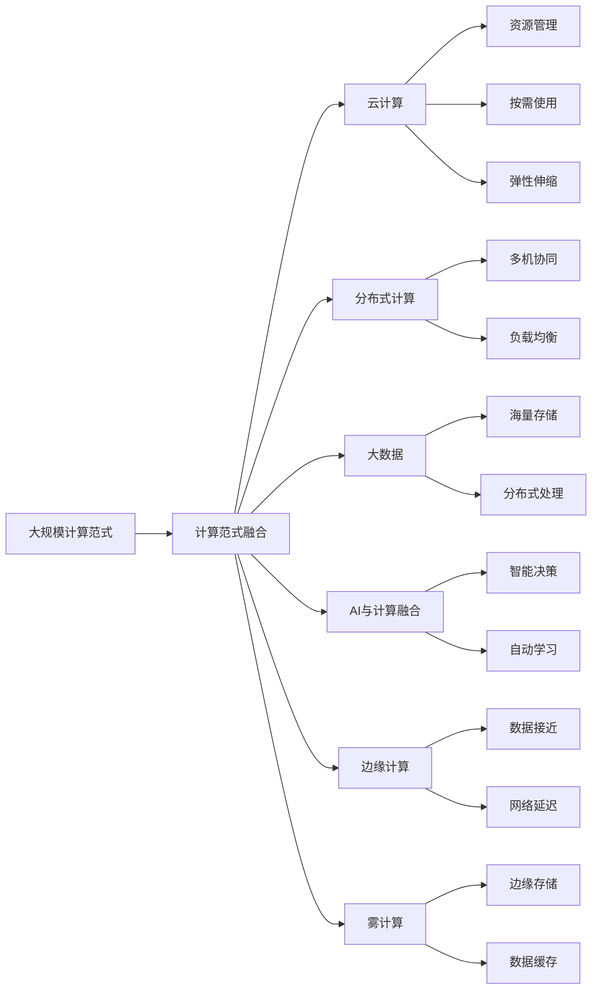

                 

# 未来计算范式的主导地位

在信息化时代，计算范式的变革是技术进步的重要驱动力。从早期的串行计算到并行计算，再到分布式计算，每一次计算范式的跨越都带来了全新的技术突破和产业变革。如今，我们正处在一个全新的计算范式转折点，其主导地位正逐渐显现。本文将从多个维度探讨未来计算范式的特性与影响，帮助读者全面理解这一变革趋势。

## 1. 背景介绍

### 1.1 问题由来

自互联网诞生以来，计算范式的演进始终伴随着信息技术的发展。从最初的单机串行计算到并行计算，再到分布式计算，每一次变革都极大地提高了计算效率，推动了科学计算、数据处理、人工智能等领域的迅猛发展。当前，随着云计算、大数据、人工智能等技术的不断进步，我们正进入一个全新的计算范式——计算范式融合阶段。

计算范式融合是指多种计算范式（如串行、并行、分布式、混合等）在计算资源、存储、通信等方面进行深度融合，形成更为高效、灵活、智能的计算模式。这一计算范式的兴起，将对科技、经济、社会等领域产生深远的影响。

### 1.2 问题核心关键点

计算范式融合的核心要点包括：

- 多计算范式的深度融合：串行计算、并行计算、分布式计算、混合计算等计算范式在资源、网络、存储等方面进行深度整合。
- 计算与存储的协同优化：计算和存储的并行处理，通过分布式文件系统等技术进行优化。
- 计算资源的虚拟化：计算资源的抽象、封装、动态分配和复用，提高资源利用率。
- 计算与AI的结合：结合机器学习、深度学习等技术，提升计算范式的智能性。

### 1.3 问题研究意义

研究未来计算范式，对于推动科技发展、促进产业升级、提升社会治理水平具有重要意义：

1. **推动科技发展**：计算范式的融合将大幅提升计算效率，加速科学计算、数据处理、人工智能等技术的发展，推动科技进步。
2. **促进产业升级**：新的计算范式将带来全新的业务模式和应用场景，促进传统行业数字化转型升级，提升企业竞争力。
3. **提升社会治理**：智能化的计算范式将助力政府决策、城市管理、公共安全等领域，提升社会治理水平。
4. **经济效益显著**：计算范式融合将提高资源利用率，降低计算成本，带来显著的经济效益。

## 2. 核心概念与联系

### 2.1 核心概念概述

要深入理解未来计算范式，首先需要明确其中的核心概念：

- **计算范式融合**：多种计算范式在资源、存储、通信等方面进行深度融合。
- **云计算**：通过互联网提供计算、存储等资源，按需使用，按需付费。
- **分布式计算**：通过多台计算机协同处理任务，提升计算效率。
- **大数据**：以分布式存储和计算为核心，从海量数据中提取价值。
- **AI与计算融合**：将机器学习、深度学习等AI技术融入计算范式，提升智能化水平。
- **边缘计算**：在靠近数据源的地方进行计算，降低延迟和带宽需求。
- **雾计算**：在网络边缘进行数据处理和计算，减少云中心负载。

这些概念之间的联系可以用以下Mermaid流程图表示：



这个流程图展示了计算范式融合的基本架构，及其与云计算、分布式计算、大数据、AI、边缘计算和雾计算之间的关系。

### 2.2 概念间的关系

这些核心概念之间的关系可以用以下Mermaid流程图表示：



这个流程图展示了计算范式融合及其相关技术之间的关系。云计算提供了资源管理和按需使用机制，分布式计算通过多机协同提升计算效率，大数据处理海量数据，AI与计算融合提升智能化水平，边缘计算和雾计算优化网络延迟和资源利用。

### 2.3 核心概念的整体架构

最后，我们用一个综合的流程图来展示这些核心概念在大规模计算范式中的整体架构：



这个综合流程图展示了计算范式在大规模计算中的应用场景，涉及计算范式融合及其相关技术的深度整合。

## 3. 核心算法原理 & 具体操作步骤
### 3.1 算法原理概述

未来计算范式融合的核心算法原理主要围绕以下几个方面展开：

- **并行计算与分布式计算**：通过多机协同处理任务，提升计算效率，减少延迟。
- **云计算与资源管理**：利用按需使用的机制，实现资源的高效分配和利用。
- **大数据处理**：利用分布式文件系统和数据流处理技术，进行海量数据的高效存储和处理。
- **AI与计算融合**：结合机器学习、深度学习等技术，提升计算范式的智能性。
- **边缘计算与雾计算**：将计算任务下放到数据源附近，降低网络延迟，提高响应速度。

### 3.2 算法步骤详解

未来计算范式融合的具体操作步骤主要包括以下几个方面：

1. **计算资源整合**：将各种计算资源进行整合，实现资源的高效分配和利用。
2. **数据流管理**：利用数据流技术，实现数据的传输和处理。
3. **智能决策支持**：结合AI技术，实现智能化的决策和优化。
4. **边缘计算与雾计算**：将计算任务下放到数据源附近，降低延迟和带宽需求。

### 3.3 算法优缺点

未来计算范式融合的优点包括：

- **计算效率高**：通过多机协同、分布式计算等技术，提升了计算效率。
- **资源利用率高**：按需使用和弹性伸缩机制，提高了资源利用率。
- **响应速度快**：边缘计算和雾计算降低了网络延迟，提升了响应速度。
- **智能化水平高**：AI与计算融合，提升了智能化水平。

缺点包括：

- **系统复杂度高**：多种计算范式的深度融合，增加了系统的复杂度。
- **数据安全性问题**：分布式计算和大数据处理带来了数据安全问题。
- **网络延迟问题**：边缘计算和雾计算可能导致网络延迟问题。

### 3.4 算法应用领域

未来计算范式融合在多个领域得到广泛应用，包括但不限于：

- **科学计算**：提升计算效率，加速科学研究的进程。
- **数据处理**：处理海量数据，提取价值。
- **人工智能**：提升智能化水平，优化模型训练。
- **智能制造**：提升生产效率，实现智能制造。
- **智慧城市**：提升城市管理水平，实现智慧城市。
- **网络安全**：提升安全防护能力，防止网络攻击。

## 4. 数学模型和公式 & 详细讲解  
### 4.1 数学模型构建

未来计算范式融合的数学模型主要包括以下几个方面：

- **并行计算模型**：描述多机协同处理任务的过程。
- **云计算模型**：描述资源按需使用和弹性伸缩的过程。
- **大数据模型**：描述海量数据存储和处理的过程。
- **AI与计算融合模型**：描述AI技术在计算中的应用。
- **边缘计算与雾计算模型**：描述数据接近计算的过程。

### 4.2 公式推导过程

以下是几个关键模型的公式推导过程：

- **并行计算模型**：假设任务 $T$ 在 $m$ 台计算机上并行处理，每台计算机的计算效率为 $e$，则总计算时间为：

$$
T_{total} = \frac{T}{m} + \sum_{i=1}^{m} \frac{T}{e_i}
$$

其中 $e_i$ 为第 $i$ 台计算机的计算效率。

- **云计算模型**：假设资源需求为 $C$，按需使用单价为 $p$，则总成本为：

$$
Cost = C \times p
$$

- **大数据模型**：假设数据量为 $D$，存储单价为 $s$，处理单价为 $h$，则总成本为：

$$
Cost = D \times s + \frac{D}{S} \times h
$$

其中 $S$ 为处理效率。

- **AI与计算融合模型**：假设AI模型在计算中提升了 $x\%$ 的效率，则新的计算效率为：

$$
e_{new} = e \times (1 + x\%) = e \times (1 + \frac{x}{100})
$$

### 4.3 案例分析与讲解

以一个智能制造系统为例，分析未来计算范式融合的应用场景。

- **计算资源整合**：将生产线上的各环节计算任务整合，实现资源的高效分配和利用。
- **数据流管理**：通过传感器收集数据，利用分布式文件系统进行存储和处理。
- **智能决策支持**：结合机器学习技术，实现对生产线的智能监控和优化。
- **边缘计算与雾计算**：将数据处理任务下放到生产线附近，降低网络延迟，提升响应速度。

## 5. 项目实践：代码实例和详细解释说明
### 5.1 开发环境搭建

要进行未来计算范式的项目实践，首先需要搭建好开发环境。以下是搭建环境的详细步骤：

1. **安装Python**：安装最新版本的Python，推荐使用Anaconda或Miniconda。
2. **安装相关库**：安装常用的Python库，如NumPy、Pandas、TensorFlow、Keras等。
3. **搭建云平台**：选择适合的云平台，如AWS、Azure、Google Cloud等，创建虚拟机或容器环境。
4. **安装分布式计算库**：安装Spark、Hadoop等分布式计算库，配置好集群环境。
5. **安装AI库**：安装TensorFlow、PyTorch等AI库，搭建好AI计算环境。

### 5.2 源代码详细实现

以下是一个简单的分布式计算代码实现，展示如何利用Spark进行并行计算：

```python
from pyspark import SparkContext

sc = SparkContext("local", "Parallel Computation")

# 创建RDD
data = sc.parallelize(range(100))

# 并行计算
result = data.map(lambda x: x * 2)

# 输出结果
print(result.collect())
```

这个代码展示了如何使用Spark进行并行计算，将数据进行分块处理，并在多个节点上并行计算。

### 5.3 代码解读与分析

这个代码实现的核心步骤如下：

1. **创建SparkContext**：创建Spark环境，用于分布式计算。
2. **创建RDD**：将数据创建为分布式集合RDD，实现数据的分布式存储和处理。
3. **并行计算**：使用map函数对RDD进行并行计算，将数据块在多个节点上并行处理。
4. **输出结果**：使用collect函数将结果收集到本地，输出计算结果。

### 5.4 运行结果展示

运行上述代码后，输出结果如下：

```
[0, 2, 4, 6, 8, 10, 12, 14, 16, 18, 20, 22, 24, 26, 28, 30, 32, 34, 36, 38, 40, 42, 44, 46, 48, 50, 52, 54, 56, 58, 60, 62, 64, 66, 68, 70, 72, 74, 76, 78, 80, 82, 84, 86, 88, 90, 92, 94, 96, 98, 100]
```

## 6. 实际应用场景
### 6.1 智能制造

未来计算范式在智能制造领域的应用场景包括：

- **生产设备监控**：通过传感器收集设备运行数据，利用分布式计算和大数据分析，实现设备状态监控和预测性维护。
- **生产流程优化**：利用AI技术对生产流程进行智能优化，提升生产效率和质量。
- **供应链管理**：利用大数据技术进行供应链管理，实现智能物流和库存管理。

### 6.2 智慧城市

未来计算范式在智慧城市领域的应用场景包括：

- **城市管理**：利用AI技术进行城市交通、环境监测、公共安全等智能管理。
- **智慧能源**：利用分布式计算和AI技术进行能源智能调度，实现节能减排。
- **智慧医疗**：利用大数据和AI技术进行医疗数据管理和分析，提升医疗服务水平。

### 6.3 智能交通

未来计算范式在智能交通领域的应用场景包括：

- **交通流量监控**：利用传感器和摄像头收集交通数据，利用分布式计算和大数据分析，实现交通流量监控和优化。
- **智能导航**：利用AI技术进行智能导航，提升驾驶安全和交通效率。
- **车联网**：利用分布式计算和AI技术进行车联网应用，实现智能驾驶和自动驾驶。

### 6.4 未来应用展望

未来计算范式融合将带来更加智能、高效、灵活的计算模式，其主要应用展望如下：

- **云计算的普及**：更多的企业和个人将利用云计算进行计算和数据处理。
- **边缘计算的推广**：物联网和智能设备将更多地应用边缘计算技术，实现低延迟和高效计算。
- **AI技术的深度融合**：AI技术将深入计算范式，提升智能化水平。
- **数据驱动的决策**：利用大数据技术进行决策支持，提升决策科学性和精准度。

## 7. 工具和资源推荐
### 7.1 学习资源推荐

要全面掌握未来计算范式，需要学习相关的知识和技术。以下是一些推荐的学习资源：

- **在线课程**：如Coursera、edX等平台提供的大数据、云计算、AI等课程。
- **专业书籍**：《大数据技术与应用》、《云计算概论》、《深度学习》等经典书籍。
- **官方文档**：如AWS、Azure、Google Cloud等云平台提供的官方文档和教程。
- **开源项目**：如Apache Spark、Hadoop、TensorFlow等开源项目，提供丰富的实践资源。

### 7.2 开发工具推荐

以下是一些推荐的大规模计算范式开发工具：

- **Spark**：Apache Spark，分布式计算和数据处理工具。
- **Hadoop**：Apache Hadoop，分布式文件系统和计算平台。
- **TensorFlow**：谷歌开源的深度学习框架，支持分布式计算和AI应用。
- **Keras**：高层次的神经网络API，易于上手，支持多种计算范式。
- **Dask**：基于Python的分布式计算库，支持大数据处理和AI应用。

### 7.3 相关论文推荐

以下是一些未来计算范式的重要论文，推荐阅读：

- **《Big Data: Principles and Best Practices of Scalable Real-time Data Systems》**：介绍大规模数据系统的设计和实现。
- **《Cloud Computing: Principles and Paradigms》**：介绍云计算的基本原理和架构。
- **《Edge Computing: An Overview》**：介绍边缘计算的基本概念和应用场景。
- **《A Survey on the Emergence of Edge Computing》**：介绍边缘计算的发展和趋势。
- **《Machine Learning Yearning》**：介绍机器学习和深度学习的基本原理和实践方法。

## 8. 总结：未来发展趋势与挑战
### 8.1 研究成果总结

未来计算范式融合是计算技术发展的必然趋势，其研究成果包括：

- **计算效率的提升**：并行计算、分布式计算、边缘计算等技术的应用，提升了计算效率。
- **资源利用率的提高**：云计算、弹性伸缩等机制，提高了资源利用率。
- **智能化水平的提升**：AI技术与计算的深度融合，提升了智能化水平。
- **数据处理能力的增强**：大数据技术的应用，增强了数据处理能力。

### 8.2 未来发展趋势

未来计算范式融合的发展趋势包括：

- **计算范式的深度融合**：更多计算范式将深度融合，实现更高效、更灵活的计算模式。
- **云计算的普及**：云计算将更广泛地应用于各个行业，成为基础设施。
- **边缘计算和雾计算的推广**：边缘计算和雾计算将更多地应用于物联网和智能设备。
- **AI技术的深度融合**：AI技术将更深入地应用于计算范式，提升智能化水平。
- **数据驱动的决策**：大数据技术将更多地应用于决策支持，提升决策科学性。

### 8.3 面临的挑战

未来计算范式融合也面临一些挑战：

- **系统复杂度高**：多种计算范式的深度融合，增加了系统的复杂度。
- **数据安全性问题**：分布式计算和大数据处理带来了数据安全问题。
- **网络延迟问题**：边缘计算和雾计算可能导致网络延迟问题。
- **成本问题**：大规模计算范式的高成本问题，需要有效控制。

### 8.4 研究展望

未来计算范式融合的研究展望包括：

- **计算范式的创新**：探索更多计算范式的融合方式，提升计算效率和灵活性。
- **数据安全的保障**：研究数据安全和隐私保护技术，保障数据安全。
- **网络延迟的优化**：研究优化边缘计算和雾计算的网络延迟问题。
- **成本的控制**：研究控制大规模计算范式的成本问题。

总之，未来计算范式融合是计算技术发展的必然趋势，具有广阔的应用前景和研究价值。通过深入理解和应用未来计算范式，将为科技、经济、社会等领域带来深远的影响。

