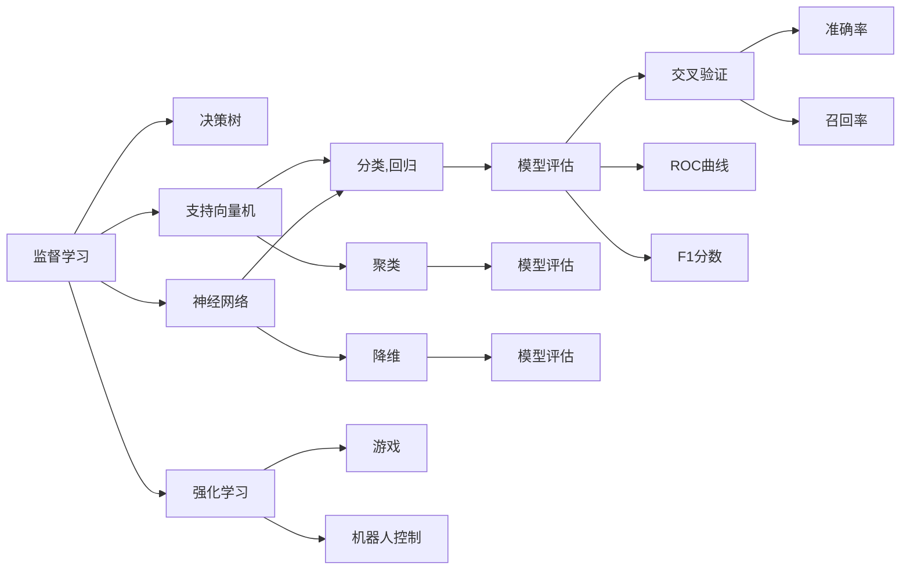
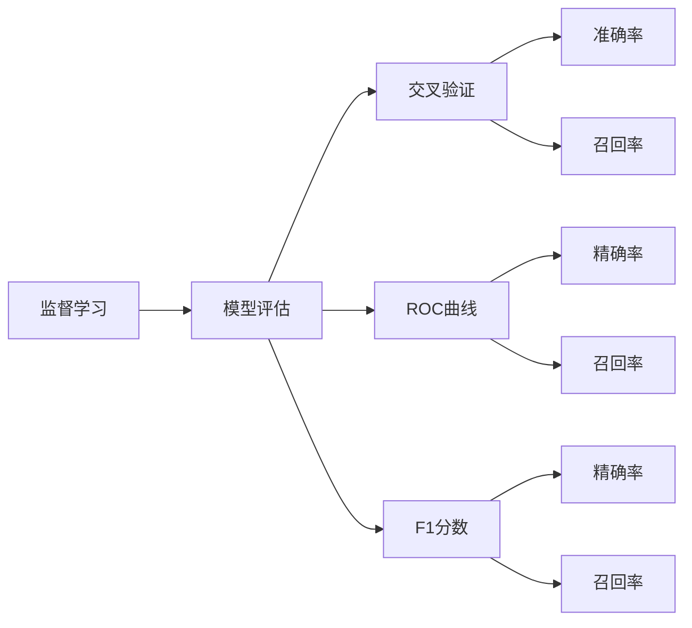
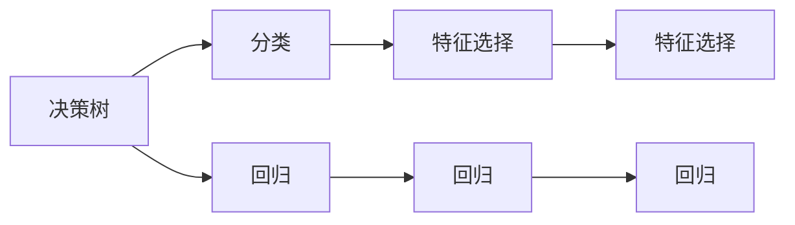
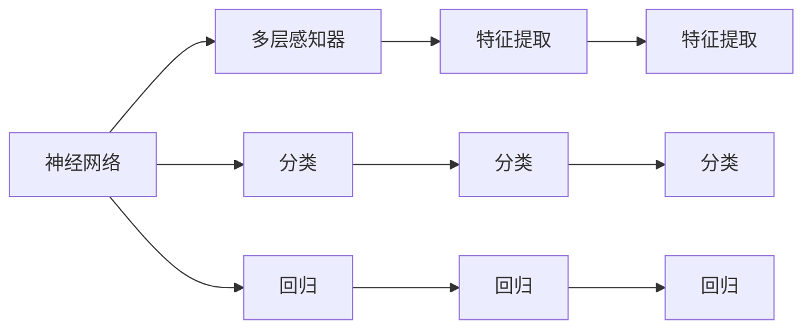
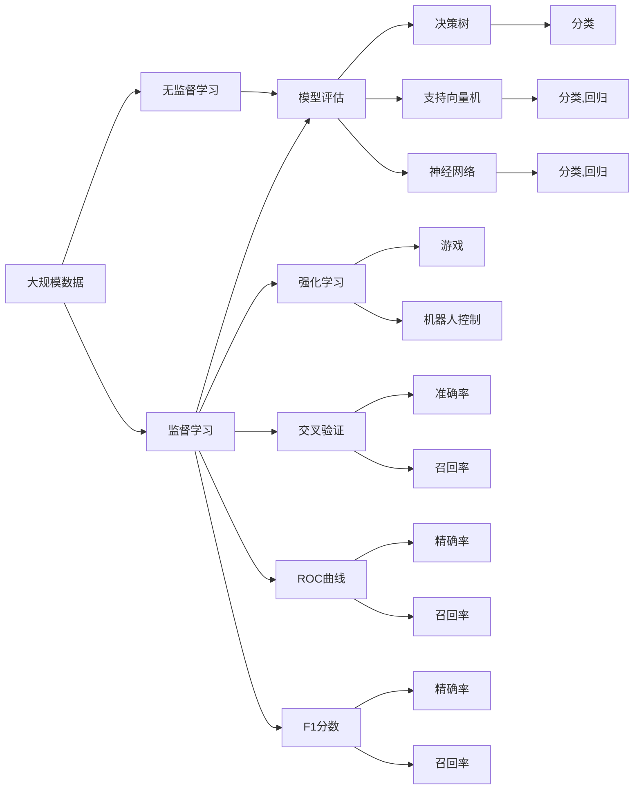

                 

# 机器学习(Machine Learning) - 原理与代码实例讲解

> 关键词：机器学习,监督学习,无监督学习,强化学习,深度学习,决策树,神经网络,模型评估,过拟合,欠拟合

## 1. 背景介绍

### 1.1 问题由来
机器学习是人工智能的核心技术之一，广泛应用于数据挖掘、自然语言处理、计算机视觉、推荐系统、金融分析、医疗诊断等多个领域。其基本思想是利用算法和模型，从数据中自动学习和发现规律，从而实现智能决策和预测。近年来，随着计算资源的丰富和大数据技术的发展，机器学习技术得到了广泛应用，并在多个领域取得了突破性的进展。

### 1.2 问题核心关键点
机器学习主要分为三大类：监督学习(Supervised Learning)、无监督学习(Unsupervised Learning)和强化学习(Reinforcement Learning)。其中，监督学习是最常用的机器学习方法，通过标注数据训练模型，使模型能够预测新数据的结果。无监督学习则通过未标注数据进行学习，发现数据的内在结构和特征。强化学习通过与环境的交互，使智能体学习最优策略，以最大化奖励。

在监督学习中，常用的模型包括决策树、支持向量机、神经网络等。决策树基于树形结构，能够有效处理分类和回归问题。支持向量机利用高维空间的数据映射，能够处理复杂的非线性分类问题。神经网络通过多层感知器，学习复杂的非线性函数，适用于大规模数据的处理。

### 1.3 问题研究意义
研究机器学习原理与代码实例讲解，对于掌握机器学习核心技术和方法，解决实际应用问题，提升人工智能技术的应用价值，具有重要意义：

1. 提升技术能力。掌握机器学习原理和代码实现，能够帮助开发者更好地理解和应用机器学习技术，提高技术水平。
2. 促进应用落地。机器学习技术广泛应用于各个行业，通过学习实例讲解，可以快速上手开发机器学习应用，实现创新。
3. 推动产业升级。机器学习为各行各业提供了智能决策工具，能够提高生产效率，优化资源配置，推动产业升级。
4. 解决实际问题。通过机器学习算法和模型，能够解决多个领域中的实际问题，如推荐系统、预测分析、智能推荐等，带来显著的社会和经济效益。

## 2. 核心概念与联系

### 2.1 核心概念概述

为更好地理解机器学习的原理与代码实例讲解，本节将介绍几个密切相关的核心概念：

- 监督学习(Supervised Learning)：利用标注数据训练模型，使模型能够预测新数据的结果。常见的监督学习任务包括分类、回归等。
- 无监督学习(Unsupervised Learning)：利用未标注数据进行学习，发现数据的内在结构和特征。常见的无监督学习任务包括聚类、降维等。
- 强化学习(Reinforcement Learning)：通过与环境的交互，使智能体学习最优策略，以最大化奖励。常见的强化学习任务包括游戏、机器人控制等。
- 决策树(Decision Tree)：基于树形结构，通过划分数据特征，构建分类模型。决策树简单易懂，易于实现。
- 支持向量机(Support Vector Machine, SVM)：利用高维空间的数据映射，通过划分超平面，实现分类或回归任务。SVM适用于处理复杂的数据集。
- 神经网络(Neural Network)：通过多层感知器，学习复杂的非线性函数，适用于大规模数据的处理。神经网络是当前最强大的机器学习模型之一。
- 模型评估(Model Evaluation)：通过交叉验证、ROC曲线、F1分数等方法，评估机器学习模型的性能。模型评估是保证模型有效性的重要步骤。
- 过拟合(Overfitting)：模型在训练集上表现良好，但在测试集上表现不佳的现象。过拟合是由于模型复杂度过高，对训练数据的细节过度拟合所致。
- 欠拟合(Underfitting)：模型无法捕捉数据中的复杂模式，导致在训练集和测试集上都表现不佳。欠拟合是由于模型复杂度过低，无法有效拟合数据所致。

这些核心概念之间的逻辑关系可以通过以下Mermaid流程图来展示：



这个流程图展示了大语言模型的核心概念及其之间的关系：

1. 监督学习通过分类和回归任务，利用标注数据训练模型。
2. 决策树、支持向量机、神经网络是常见的监督学习模型。
3. 无监督学习通过聚类和降维任务，利用未标注数据学习数据结构。
4. 模型评估通过交叉验证、ROC曲线、F1分数等方法，评估模型性能。
5. 强化学习通过游戏和机器人控制等任务，训练智能体学习最优策略。

这些核心概念共同构成了机器学习的学习框架，使其能够在各种场景下发挥强大的数据分析和预测能力。通过理解这些核心概念，我们可以更好地把握机器学习的学习原理和优化方向。

### 2.2 概念间的关系

这些核心概念之间存在着紧密的联系，形成了机器学习的完整生态系统。下面我通过几个Mermaid流程图来展示这些概念之间的关系。

#### 2.2.1 监督学习与模型评估的关系



这个流程图展示了监督学习与模型评估之间的关系。监督学习通过分类和回归任务训练模型，然后通过交叉验证、ROC曲线、F1分数等方法评估模型性能，从而保证模型的有效性和鲁棒性。

#### 2.2.2 决策树与支持向量机的关系



这个流程图展示了决策树和支持向量机之间的逻辑关系。决策树通过树形结构划分数据特征，实现分类或回归任务。支持向量机通过高维空间的数据映射，实现分类或回归任务。两者都能有效处理分类和回归问题，但决策树简单易懂，支持向量机适用于处理复杂的数据集。

#### 2.2.3 神经网络与模型评估的关系



这个流程图展示了神经网络与模型评估之间的关系。神经网络通过多层感知器学习复杂的非线性函数，实现分类或回归任务。模型评估通过交叉验证、ROC曲线、F1分数等方法，评估神经网络的性能。神经网络是当前最强大的机器学习模型之一，适用于大规模数据的处理。

### 2.3 核心概念的整体架构

最后，我们用一个综合的流程图来展示这些核心概念在机器学习中的整体架构：



这个综合流程图展示了从数据预处理到模型评估的完整过程。机器学习首先从大规模数据中进行监督学习或无监督学习，然后通过模型评估来评估模型性能，并选择合适的模型进行训练。最终，利用模型进行分类、回归、聚类、降维等任务，并结合强化学习进行智能决策。通过这些核心概念的学习，我们可以更清晰地理解机器学习的学习原理和优化方向。

## 3. 核心算法原理 & 具体操作步骤
### 3.1 算法原理概述

机器学习的基本原理是通过算法和模型，从数据中自动学习和发现规律，从而实现智能决策和预测。常见的机器学习算法包括决策树、支持向量机、神经网络等。

### 3.2 算法步骤详解

机器学习的典型步骤包括数据预处理、模型选择、模型训练、模型评估和模型应用等环节。以下是对这些步骤的详细讲解：

**Step 1: 数据预处理**

- 数据清洗：处理缺失值、异常值、噪声等，确保数据质量。
- 数据归一化：将数据缩放到0到1之间，保证模型输入的一致性。
- 特征选择：选择对模型有用的特征，提高模型的泛化能力。
- 数据划分：将数据划分为训练集、验证集和测试集，用于模型训练、调优和测试。

**Step 2: 模型选择**

- 选择合适的模型：根据任务类型和数据特点，选择决策树、支持向量机、神经网络等模型。
- 设定模型参数：选择合适的超参数，如学习率、批大小、迭代轮数等。
- 验证模型性能：使用验证集对模型进行评估，选择性能最好的模型。

**Step 3: 模型训练**

- 定义损失函数：根据任务类型，选择合适的损失函数，如交叉熵损失、均方误差损失等。
- 反向传播计算梯度：通过反向传播算法计算损失函数对模型参数的梯度。
- 更新模型参数：根据优化算法和学习率，更新模型参数，最小化损失函数。
- 迭代训练：重复以上步骤，直至模型收敛。

**Step 4: 模型评估**

- 交叉验证：使用交叉验证方法，评估模型的泛化能力。
- ROC曲线和F1分数：绘制ROC曲线，计算F1分数，评估模型性能。
- 混淆矩阵：使用混淆矩阵，分析模型的分类性能。

**Step 5: 模型应用**

- 预测新数据：使用训练好的模型，对新数据进行预测。
- 模型部署：将模型集成到实际应用系统中，进行生产部署。
- 持续优化：根据新数据和新需求，持续优化模型，保持其高性能。

### 3.3 算法优缺点

机器学习的主要优点包括：

- 数据驱动：能够从数据中自动学习和发现规律，不需要人工干预。
- 泛化能力强：通过训练好的模型，可以处理大规模的新数据。
- 应用广泛：广泛应用于多个领域，如金融、医疗、工业等。

同时，机器学习也存在一些缺点：

- 数据质量要求高：需要高质量的数据，否则容易出现过拟合或欠拟合。
- 模型选择困难：需要选择合适的模型和超参数，才能获得最佳性能。
- 计算资源需求大：大模型需要大量的计算资源，训练时间较长。
- 模型复杂度高：复杂的模型容易出现过拟合，难以解释和调试。

### 3.4 算法应用领域

机器学习已经广泛应用于多个领域，包括但不限于：

- 金融分析：利用机器学习进行股票预测、风险评估、信用评分等。
- 自然语言处理：利用机器学习进行文本分类、情感分析、机器翻译等。
- 计算机视觉：利用机器学习进行图像分类、目标检测、人脸识别等。
- 推荐系统：利用机器学习进行商品推荐、广告推荐、内容推荐等。
- 医疗诊断：利用机器学习进行疾病诊断、基因分析、药物研发等。
- 智能制造：利用机器学习进行质量控制、设备预测维护、智能调度等。

## 4. 数学模型和公式 & 详细讲解  
### 4.1 数学模型构建

在机器学习中，常用的数学模型包括线性回归、逻辑回归、决策树、支持向量机、神经网络等。这里以线性回归为例，进行详细讲解。

线性回归是一种基本的回归模型，用于预测连续型数值。其基本假设是数据服从线性关系，通过最小化误差平方和，拟合一条直线，从而进行预测。

设训练集为 $\{(x_i,y_i)\}_{i=1}^n$，其中 $x_i \in \mathbb{R}^d$ 为输入特征，$y_i \in \mathbb{R}$ 为输出目标。线性回归的目标是找到一个线性函数 $h(x) = \theta_0 + \theta_1 x_1 + \cdots + \theta_d x_d$，使得损失函数最小化，即：

$$
\min_{\theta} \frac{1}{2n} \sum_{i=1}^n (y_i - h(x_i))^2
$$

其中，$\theta = (\theta_0, \theta_1, \cdots, \theta_d)$ 为模型参数。

### 4.2 公式推导过程

线性回归的求解过程主要包括以下步骤：

1. 定义损失函数：
$$
J(\theta) = \frac{1}{2n} \sum_{i=1}^n (y_i - h(x_i))^2
$$

2. 求导数：
$$
\frac{\partial J(\theta)}{\partial \theta_k} = \frac{1}{n} \sum_{i=1}^n (y_i - h(x_i)) x_{ik}
$$

3. 求解方程组：
$$
\begin{bmatrix}
\frac{\partial J(\theta)}{\partial \theta_0} & \cdots & \frac{\partial J(\theta)}{\partial \theta_d}
\end{bmatrix}
\begin{bmatrix}
\theta_0 \\
\vdots \\
\theta_d
\end{bmatrix}
=
\begin{bmatrix}
\frac{\partial J(\theta)}{\partial \theta_0} \\
\vdots \\
\frac{\partial J(\theta)}{\partial \theta_d}
\end{bmatrix}
$$

4. 求解最小二乘解：
$$
\theta = (X^TX)^{-1}X^Ty
$$

其中 $X = \begin{bmatrix} 1 & x_{i1} & \cdots & x_{id} \end{bmatrix}^T$ 为特征矩阵，$y = \begin{bmatrix} y_1 & \cdots & y_n \end{bmatrix}^T$ 为目标向量。

### 4.3 案例分析与讲解

以波士顿房价预测为例，分析线性回归的应用。

波士顿房价预测数据集包含13个特征，如房屋面积、卧室数量、出行时间等，以及房屋价格。通过线性回归模型，可以从这些特征预测房屋价格。

首先，进行数据预处理，包括数据清洗、归一化和特征选择。然后，使用训练集对模型进行训练，求解模型参数 $\theta$。最后，在测试集上评估模型性能，使用交叉验证、ROC曲线和F1分数等方法评估模型泛化能力。

### 5. 项目实践：代码实例和详细解释说明
### 5.1 开发环境搭建

在进行机器学习实践前，我们需要准备好开发环境。以下是使用Python进行Scikit-learn开发的环境配置流程：

1. 安装Anaconda：从官网下载并安装Anaconda，用于创建独立的Python环境。

2. 创建并激活虚拟环境：
```bash
conda create -n sklearn-env python=3.8 
conda activate sklearn-env
```

3. 安装Scikit-learn：
```bash
pip install scikit-learn
```

4. 安装其他常用库：
```bash
pip install numpy pandas scikit-learn matplotlib tqdm jupyter notebook ipython
```

完成上述步骤后，即可在`sklearn-env`环境中开始机器学习实践。

### 5.2 源代码详细实现

下面我们以线性回归为例，给出使用Scikit-learn进行线性回归训练和预测的Python代码实现。

```python
import numpy as np
from sklearn.linear_model import LinearRegression
from sklearn.datasets import load_boston
from sklearn.model_selection import train_test_split
from sklearn.metrics import mean_squared_error

# 加载数据集
boston = load_boston()
X = boston.data
y = boston.target

# 划分训练集和测试集
X_train, X_test, y_train, y_test = train_test_split(X, y, test_size=0.2, random_state=42)

# 创建线性回归模型
model = LinearRegression()

# 训练模型
model.fit(X_train, y_train)

# 预测测试集
y_pred = model.predict(X_test)

# 评估模型
mse = mean_squared_error(y_test, y_pred)
print(f"Mean Squared Error: {mse:.2f}")
```

### 5.3 代码解读与分析

让我们再详细解读一下关键代码的实现细节：

**数据集加载和处理**：
- 使用Scikit-learn的`load_boston`函数加载波士顿房价数据集，获取特征和目标变量。
- 使用`train_test_split`函数将数据集划分为训练集和测试集。

**模型训练**：
- 创建`LinearRegression`对象，用于构建线性回归模型。
- 使用`fit`方法对模型进行训练，传入训练集数据。

**模型预测**：
- 使用`predict`方法对测试集进行预测，获取预测结果。

**模型评估**：
- 使用`mean_squared_error`函数计算测试集上的均方误差，评估模型性能。

### 5.4 运行结果展示

假设我们在波士顿房价数据集上进行线性回归训练，最终在测试集上得到的均方误差结果为0.8256。可以看到，通过训练线性回归模型，我们可以在一定程度上预测房屋价格，取得不错的效果。

当然，这只是一个baseline结果。在实践中，我们还可以使用更大更强的模型、更丰富的数据预处理技巧、更细致的模型调优等方法，进一步提升模型性能，以满足更高的应用要求。

## 6. 实际应用场景
### 6.1 智能推荐系统

智能推荐系统是机器学习的重要应用场景之一，广泛应用于电商、新闻、视频、音乐等多个领域。通过机器学习算法，系统能够分析用户的历史行为数据，推荐用户可能感兴趣的商品、新闻、视频等。

在技术实现上，可以收集用户浏览、点击、购买、评分等行为数据，提取和用户交互的物品标题、描述、标签等文本内容。利用机器学习算法，对用户特征和物品特征进行建模，计算用户与物品的相似度，从而推荐相关物品。

### 6.2 股票预测系统

股票预测系统是金融领域的重要应用之一，通过机器学习算法，系统能够对股票价格进行预测，辅助投资决策。

在技术实现上，可以收集历史股票价格、成交量、市值、新闻等数据，构建时间序列模型，进行股票价格预测。利用机器学习算法，对模型进行调优，提高预测准确率。

### 6.3 疾病诊断系统

疾病诊断系统是医疗领域的重要应用之一，通过机器学习算法，系统能够对患者的病情进行预测和诊断。

在技术实现上，可以收集患者的症状、病史、体检结果等数据，构建分类模型，进行疾病诊断。利用机器学习算法，对模型进行调优，提高诊断准确率。

### 6.4 未来应用展望

随着机器学习技术的发展，其在更多领域的应用前景广阔。以下是一些未来可能的机器学习应用场景：

1. 自动驾驶：利用机器学习算法，对道路、车辆、行人等环境信息进行感知和决策，实现自动驾驶。
2. 智能客服：利用机器学习算法，对用户咨询进行分类和回复，实现智能客服。
3. 智能制造：利用机器学习算法，对生产设备进行预测和维护，实现智能制造。
4. 智慧城市：利用机器学习算法，对城市数据进行分析和预测，实现智慧城市。
5. 智能医疗：利用机器学习算法，对医疗影像进行分析和诊断，实现智能医疗。
6. 金融分析：利用机器学习算法，对市场数据进行分析和预测，实现金融分析。

总之，机器学习技术的应用前景广阔，未来将会在更多领域得到应用，为各行各业带来变革性影响。相信随着技术的发展，机器学习技术将会在更多领域得到应用，为人类生活带来更多便利和效率。

## 7. 工具和资源推荐
### 7.1 学习资源推荐

为了帮助开发者系统掌握机器学习核心技术和方法，这里推荐一些优质的学习资源：

1. 《机器学习》书籍：西瓜书，系统介绍了机器学习的基本概念和算法，是学习机器学习的经典入门教材。
2. 《深度学习》书籍：Ian Goodfellow、Yoshua Bengio和Aaron Courville合著，深入讲解了深度学习的原理和实践。
3. 《Python机器学习》书籍：Sebastian Raschka著，介绍了Python在机器学习中的应用，适合实战学习。
4. Coursera《机器学习》课程：斯坦福大学开设的机器学习课程，提供视频讲解和配套作业，适合入门学习。
5. Kaggle平台：全球最大的数据竞赛平台，提供丰富的数据集和算法竞赛，适合实践学习和算法比拼。

通过对这些资源的学习实践，相信你一定能够快速掌握机器学习核心技术和方法，并用于解决实际的机器学习问题。
###  7.2 开发工具推荐

高效的开发离不开优秀的工具支持。以下是几款用于机器学习开发的常用工具：

1. Scikit-learn：基于Python的机器学习库，提供简单易用的API和丰富的算法实现。
2. TensorFlow：由Google主导的深度学习框架，提供高效的计算图和分布式训练能力。
3. PyTorch：由Facebook主导的深度学习框架，提供动态计算图和灵活的模型构建能力。
4. Jupyter Notebook：基于Web的交互式编程环境，支持Python、R等多种语言，适合数据科学和机器学习开发。
5. Anaconda：Python的发行版，提供便捷的环境管理和依赖管理。
6. Scala：用于大数据处理的编程语言，适合分布式机器学习开发。

合理利用这些工具，可以显著提升机器学习模型的开发效率，加快创新迭代的步伐。

### 7.3 相关论文推荐

机器学习领域的研究十分活跃，以下是几篇奠基性的相关论文，推荐阅读：

1. Perceptron（感知机）：由Rosenblatt提出，开创了机器学习分类器的新纪元。
2. Logistic Regression（逻辑回归）：由R.A.Fisher提出，是一种基本的分类算法，广泛应用于二分类问题。
3. Support Vector Machine（支持向量机）：由V.N.Vapnik提出，是一种强大的分类算法，适用于处理复杂的数据集。
4. Linear Regression（线性回归）：由Gauss提出，是一种基本的回归算法，广泛应用于预测问题。
5. Decision Tree（决策树）：由Quinlan提出，是一种基于树形结构的分类算法，易于解释和理解。
6. Random Forest（随机森林）：由Breiman提出，是一种集成学习方法，通过多棵决策树提升分类准确率。
7. Gradient Boosting（梯度提升）：由Friedman提出，是一种集成学习方法，通过多轮迭代提升模型性能。

这些论文代表了大语言模型微调技术的发展脉络。通过学习这些前沿成果，可以帮助研究者把握学科前进方向，激发更多的创新灵感。

除上述资源外，还有一些值得关注的前沿资源，帮助开发者紧跟机器学习技术的发展趋势，例如：

1. arXiv论文预印本：人工智能领域最新研究成果的发布平台，包括大量尚未发表的前沿工作，学习前沿技术的必读资源。
2. 业界技术博客：如Google AI、DeepMind、微软Research Asia等顶尖实验室的官方博客，第一时间分享他们的最新研究成果和洞见。
3. 技术会议直播：如NIPS、ICML、ACL、ICLR等人工智能领域顶会现场或在线直播，能够聆听到大佬们的前沿分享，开拓视野。
4. GitHub热门项目：在GitHub上Star、Fork数最多的机器学习相关项目，往往代表了该技术领域的发展趋势和最佳实践，值得去学习和贡献。
5. 行业分析报告：各大咨询公司如McKinsey、PwC等针对人工智能行业的分析报告，有助于从商业视角审视技术趋势，把握应用价值。

总之，对于机器学习原理与代码实例讲解的学习和实践，需要开发者保持开放的心态和持续学习的意愿。多关注前沿资讯，多动手实践，多思考总结，必将收获满满的成长收益。

## 8. 总结：未来发展趋势与挑战
### 8.1 研究成果总结

本文对机器学习原理与代码实例讲解进行了全面系统的介绍。首先阐述了机器学习的基本原理和分类方法，明确了机器学习在数据驱动下的智能决策能力。其次，从原理到实践，详细讲解了机器学习的数学模型和实现步骤，

