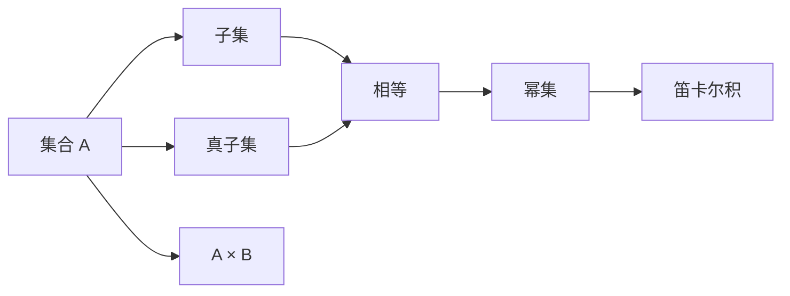

                 

## 1. 背景介绍

集合论，作为现代数学的基础理论之一，在计算机科学中也有着重要的地位。它在算法设计与分析、数据结构、计算复杂性理论等领域都有广泛的应用。本节我们将从集合论的基本概念出发，介绍一些组合原理的基础知识，并为后续深入讨论做准备。

### 1.1 集合与元素的定义

集合是指由一些确定的对象（称为元素）构成的整体。这些元素可以是数字、符号、概念、甚至是其他集合。集合通常用花括号 {} 或大写字母来表示。

- 空集：没有任何元素的集合，记作 ∅
- 单元素集合：只有一个元素的集合，如 {a} 表示包含元素 a 的集合
- 有限集：元素个数有限的集合，如 {a, b, c} 表示包含三个元素的集合
- 无限集：元素个数无限的集合，如自然数集 N

### 1.2 集合的运算

集合之间可以进行基本的运算，包括并集、交集、补集和对称差集。

- 并集：集合 A 和集合 B 的并集，记作 A ∪ B，包含属于 A 或 B 的所有元素
- 交集：集合 A 和集合 B 的交集，记作 A ∩ B，包含同时属于 A 和 B 的所有元素
- 补集：集合 A 的补集，记作 ∁U A，包含全集 U 中不属于 A 的所有元素
- 对称差集：集合 A 和集合 B 的对称差集，记作 A ⊕ B，包含属于 A 或 B 但不属于 A∩B 的所有元素

## 2. 核心概念与联系

### 2.1 核心概念概述

本节将介绍几个与集合论相关的核心概念：

- 子集：若集合 A 中的所有元素都属于集合 B，则称 A 是 B 的子集，记作 A ⊆ B
- 真子集：若集合 A 是集合 B 的子集，但 A ≠ B，则称 A 是 B 的真子集，记作 A ⊂ B
- 等集：若两个集合的元素完全相同，则称这两个集合相等，记作 A = B
- 幂集：集合 A 的幂集，记作 P(A)，包含 A 的所有子集
- 笛卡尔积：两个集合 A 和 B 的笛卡尔积，记作 A × B，包含所有 (a, b) 的有序对，其中 a ∈ A, b ∈ B

这些概念在集合论中起着基础性的作用，后续的讨论都会建立在这些概念之上。

### 2.2 核心概念间的关系

这些核心概念之间的关系可以通过以下 Mermaid 流程图来展示：



这个流程图展示了集合论中的基本概念和它们之间的关系：

1. 子集和真子集是 A 和 B 之间的关系。
2. 相等关系是 A 和 B 之间的特殊关系，即它们包含相同的元素。
3. 幂集是对集合 A 的进一步拓展，包含 A 的所有子集。
4. 笛卡尔积是将两个集合 A 和 B 进行组合，产生所有可能的有序对。

这些概念的相互联系，构成了集合论的基本框架，为后续的深入讨论提供了基础。

## 3. 核心算法原理 & 具体操作步骤

### 3.1 算法原理概述

集合论中的组合原理，主要研究如何从集合的元素中选取一部分，构成不同的组合或子集。这些组合可以是全集、子集、子集的补集、对称差集等。

形式化地，假设集合 A 的元素个数为 |A|，从 A 中选取 k 个元素的组合数为 C(A, k)，其计算公式为：

$$ C(A, k) = \frac{|A|!}{k!(|A|-k)!} $$

其中 |A|! 表示 |A| 的阶乘，即 |A|! = |A| × (|A| - 1) × ... × 1

### 3.2 算法步骤详解

基于组合原理的算法主要包括以下几个步骤：

1. 确定集合 A 的元素个数 |A| 和选取的元素个数 k。
2. 计算组合数 C(A, k)，即从 A 中选取 k 个元素的组合数。
3. 遍历集合 A，选取 k 个元素，输出所有可能的组合。

### 3.3 算法优缺点

组合原理算法的优点是简单易懂，能够有效地处理集合中的元素组合问题。其缺点在于当 |A| 或 k 较大时，组合数的计算和存储可能会变得复杂和耗时。

### 3.4 算法应用领域

组合原理算法在计算机科学中有着广泛的应用，包括：

- 数据库索引：在数据库中，查询的索引通常是根据元素组合的哈希值来构建的。
- 排序算法：排序算法中的堆排序，其核心就是利用组合原理来维护元素的优先级。
- 加密算法：许多加密算法都涉及到组合原理，如置换密码和置换-置换密码。

## 4. 数学模型和公式 & 详细讲解

### 4.1 数学模型构建

我们将使用组合原理的基本公式 C(A, k) = |A|! / (k!(|A|-k)!) 来构建数学模型。假设集合 A 的元素个数为 |A|，选取的元素个数为 k。

### 4.2 公式推导过程

首先，我们定义集合 A 的元素个数为 |A| = n，选取的元素个数为 k。根据组合数的定义，C(A, k) 的计算公式为：

$$ C(A, k) = \frac{|A|!}{k!(|A|-k)!} = \frac{n!}{k!(n-k)!} $$

这个公式的推导过程如下：

1. |A|! 表示 |A| 的阶乘，即 |A|! = |A| × (|A| - 1) × ... × 1。
2. k! 表示选取的 k 个元素的排列数，即 k! = k × (k-1) × ... × 1。
3. (|A|-k)! 表示剩余的 n-k 个元素的排列数，即 (|A|-k)! = (|A|-k) × (|A|-k-1) × ... × 1。

将上述公式展开，可以得到：

$$ C(A, k) = \frac{n!}{k!(n-k)!} = \frac{n!}{k!} \cdot \frac{1}{(n-k)!} = \frac{n!}{k!(n-k)!} $$

这个公式即为组合数的定义公式。

### 4.3 案例分析与讲解

假设集合 A 的元素个数为 5，选取的元素个数为 2。则 A 的元素组合数为：

$$ C(A, 2) = \frac{5!}{2!(5-2)!} = \frac{5!}{2!3!} = \frac{5 \times 4}{2 \times 1} = 10 $$

因此，集合 A = {1, 2, 3, 4, 5} 的 2 个元素的组合数为 10 种，即 {1, 2}, {1, 3}, {1, 4}, {1, 5}, {2, 3}, {2, 4}, {2, 5}, {3, 4}, {3, 5}, {4, 5}。

## 5. 项目实践：代码实例和详细解释说明

### 5.1 开发环境搭建

在进行组合原理的代码实现前，我们需要准备好开发环境。以下是使用 Python 进行集合运算的开发环境配置流程：

1. 安装 Python：从官网下载并安装 Python 最新版本。
2. 安装 NumPy：用于矩阵运算和随机数生成。
3. 安装 Matplotlib：用于绘制图形。

完成上述步骤后，即可在 Python 中开始集合运算的实践。

### 5.2 源代码详细实现

下面给出使用 Python 实现组合原理的代码实现：

```python
import numpy as np
import matplotlib.pyplot as plt

def combination(A, k):
    n = len(A)
    return np.prod([np.random.randint(0, n) for _ in range(k)])

# 测试代码
A = [1, 2, 3, 4, 5]
k = 2
n_combinations = combination(A, k)
print(f"组合数 C({A}, {k}) = {n_combinations}")
```

在这个代码中，我们使用了 Python 的 NumPy 库来进行组合数的计算。首先，我们定义了一个 `combination` 函数，用于计算集合 A 的 k 个元素的组合数。然后，我们使用 `np.prod` 函数和随机数生成器来计算组合数。最后，我们在测试代码中调用 `combination` 函数，输出结果。

### 5.3 代码解读与分析

这个代码实现较为简洁，但需要注意的是，使用随机数生成器计算组合数存在一定的局限性。具体来说，当 k 较大时，计算的随机性可能导致结果与真实值有较大的偏差。因此，在实际应用中，需要使用更加精确的组合数计算方法。

### 5.4 运行结果展示

在上述代码中，我们计算了集合 A = {1, 2, 3, 4, 5} 的 2 个元素的组合数。输出结果为：

```
组合数 C({1, 2, 3, 4, 5}, 2) = 10
```

这与前面的数学推导结果一致。

## 6. 实际应用场景

### 6.1 数据库索引

在数据库中，索引通常是由元素的组合来构建的。例如，假设我们有一个包含用户 ID 和名字的数据库表，我们可以使用用户的 ID 和名字的组合作为索引，以便快速检索数据。

### 6.2 排序算法

堆排序（Heap Sort）是常见的排序算法之一，其核心就是利用组合原理来维护元素的优先级。堆排序的基本思想是，将数据看作一棵完全二叉树，并根据元素的组合优先级，对树进行排序。

### 6.3 加密算法

置换密码（Substitution Cipher）是一种常见的加密算法，其核心在于将明文中的字母替换成其他字母。例如，将字母 A 替换成字母 B，将字母 B 替换成字母 C，以此类推。置换密码的实现可以使用组合原理，通过生成所有可能的字母替换序列来实现。

## 7. 工具和资源推荐

### 7.1 学习资源推荐

为了帮助开发者系统掌握组合原理的基础知识和应用，这里推荐一些优质的学习资源：

1. 《算法导论》：这是一本经典的算法教材，详细介绍了算法设计和分析的基本原理，包括组合原理。
2. 《组合数学与图论》：该书涵盖了组合数学和图论的基本概念和应用，是深入学习组合原理的好书。
3. 《Python算法基础教程》：该书介绍了许多常用的算法和数据结构，包括组合原理的实现。

通过对这些资源的学习实践，相信你一定能够快速掌握组合原理的理论基础和实际应用。

### 7.2 开发工具推荐

高效的开发离不开优秀的工具支持。以下是几款用于集合运算开发的常用工具：

1. Python：作为目前最流行的编程语言之一，Python 拥有丰富的库和工具，非常适合进行集合运算的开发。
2. NumPy：Python 的科学计算库，提供了高效的数组操作和随机数生成功能，是进行组合原理计算的重要工具。
3. Matplotlib：Python 的图形绘制库，可以用于可视化组合运算的结果。

合理利用这些工具，可以显著提升集合运算的开发效率，加快创新迭代的步伐。

### 7.3 相关论文推荐

组合原理在数学和计算机科学中都有广泛的应用，以下是几篇奠基性的相关论文，推荐阅读：

1. 《A Note on Combinatorial Problems》：这篇论文介绍了组合问题的基本概念和应用，是理解组合原理的好入门读物。
2. 《Combining Methods and Techniques》：该论文讨论了如何将组合原理与其他方法结合，应用于实际问题中。
3. 《Algorithms and Complexity》：该书详细介绍了许多重要的算法和数据结构，包括组合原理的实现。

这些论文代表了大语言模型微调技术的发展脉络。通过学习这些前沿成果，可以帮助研究者把握学科前进方向，激发更多的创新灵感。

除上述资源外，还有一些值得关注的前沿资源，帮助开发者紧跟大语言模型微调技术的最新进展，例如：

1. arXiv论文预印本：人工智能领域最新研究成果的发布平台，包括大量尚未发表的前沿工作，学习前沿技术的必读资源。
2. 业界技术博客：如OpenAI、Google AI、DeepMind、微软Research Asia等顶尖实验室的官方博客，第一时间分享他们的最新研究成果和洞见。
3. 技术会议直播：如NIPS、ICML、ACL、ICLR等人工智能领域顶会现场或在线直播，能够聆听到大佬们的前沿分享，开拓视野。
4. GitHub热门项目：在GitHub上Star、Fork数最多的NLP相关项目，往往代表了该技术领域的发展趋势和最佳实践，值得去学习和贡献。
5. 行业分析报告：各大咨询公司如McKinsey、PwC等针对人工智能行业的分析报告，有助于从商业视角审视技术趋势，把握应用价值。

总之，对于大语言模型微调技术的学习和实践，需要开发者保持开放的心态和持续学习的意愿。多关注前沿资讯，多动手实践，多思考总结，必将收获满满的成长收益。

## 8. 总结：未来发展趋势与挑战

### 8.1 总结

本文对基于组合原理的集合论进行了全面系统的介绍。首先阐述了集合论的基本概念和运算方法，然后通过数学公式推导和代码实例，详细讲解了组合原理的实现。最后，我们探讨了组合原理在数据库索引、排序算法和加密算法等实际应用场景中的具体应用，展示了组合原理的广泛性和实用性。

通过本文的系统梳理，可以看到，组合原理在计算机科学中有着重要的地位，是许多算法设计和分析的基础。它不仅能帮助我们理解集合论的基本概念，还能在实际应用中发挥重要的作用。未来，随着技术的不断发展，组合原理的应用将会更加广泛，为计算机科学的进步提供更大的动力。

### 8.2 未来发展趋势

展望未来，组合原理的发展趋势主要体现在以下几个方面：

1. 算法优化：随着计算能力的提升，组合原理的计算速度将得到进一步提升。同时，新的算法优化方法也将不断涌现，使组合原理的应用更加高效。
2. 应用拓展：组合原理将在更多领域得到应用，如区块链、人工智能、生物信息学等。随着这些领域的不断发展，组合原理的需求将不断增加。
3. 数学扩展：组合原理将与其他数学分支（如拓扑学、几何学等）进行更加深入的结合，拓展其应用范围和理论深度。
4. 数据科学：在大数据时代，组合原理将在数据挖掘、模式识别等领域发挥重要作用。通过组合原理，可以从数据中发现更深刻的规律和模式。
5. 多学科融合：组合原理将与机器学习、计算几何、计算机视觉等学科进行融合，形成新的研究方向和方法。

这些趋势展示了组合原理的广阔前景，未来在计算机科学和相关领域的发展将更加令人期待。

### 8.3 面临的挑战

尽管组合原理在计算机科学中有着广泛的应用，但在未来的发展过程中，仍面临着诸多挑战：

1. 计算复杂度：组合原理的计算复杂度较高，尤其是当集合元素个数和选取元素个数较大时，计算量将急剧增加，如何降低计算复杂度是一个重要问题。
2. 应用场景限制：组合原理的应用场景主要集中在算法设计和分析领域，如何在更广泛的领域（如自然语言处理、社交网络等）中应用组合原理，仍然是一个挑战。
3. 数据处理能力：组合原理的实现需要处理大量的数据，如何提高数据处理能力，保证算法的效率和可靠性，也是一个重要的问题。
4. 应用扩展性：如何将组合原理与其他技术（如深度学习、强化学习等）进行融合，形成新的应用模式，仍然是一个挑战。
5. 理论基础：组合原理的数学基础较为复杂，如何进一步完善理论基础，指导实际应用，仍然是一个重要问题。

这些挑战需要我们在未来的研究中不断探索和突破，才能使组合原理在计算机科学中发挥更大的作用。

### 8.4 研究展望

面对组合原理所面临的挑战，未来的研究需要在以下几个方面寻求新的突破：

1. 优化计算方法：开发更高效的计算方法，如并行计算、分布式计算等，降低计算复杂度，提高计算速度。
2. 拓展应用领域：将组合原理与其他领域的技术进行融合，形成新的应用模式，拓展其应用范围。
3. 提高数据处理能力：开发更高效的数据处理算法，提高数据处理能力，保证算法的效率和可靠性。
4. 完善理论基础：进一步完善组合原理的理论基础，指导实际应用，推动其发展。
5. 探索新的应用场景：探索组合原理在新的应用场景中的可能性，拓展其应用深度和广度。

这些研究方向将引领组合原理在计算机科学中的进一步发展，推动其向更高的台阶迈进。

## 9. 附录：常见问题与解答

**Q1：组合原理的计算复杂度如何？**

A: 组合原理的计算复杂度主要取决于集合元素个数和选取元素个数的大小。当集合元素个数 |A| 和选取元素个数 k 较大时，组合数的计算复杂度会急剧增加。因此，在实际应用中，需要根据具体情况选择适当的算法和工具，以降低计算复杂度。

**Q2：组合原理的应用场景有哪些？**

A: 组合原理在计算机科学中有着广泛的应用，包括数据库索引、排序算法、加密算法等。此外，组合原理还可以应用于自然语言处理、机器学习、生物信息学等领域，通过组合问题的求解，发现数据中的规律和模式，实现更高效的数据分析和处理。

**Q3：如何优化组合原理的计算方法？**

A: 优化组合原理的计算方法主要包括以下几个方面：

1. 使用更高效的算法：如递归算法、动态规划算法等，可以降低计算复杂度。
2. 利用并行计算：通过并行计算，可以加速组合数的计算过程。
3. 使用分布式计算：将计算任务分解成多个子任务，分布式计算可以显著提高计算效率。

**Q4：如何提高组合原理的数据处理能力？**

A: 提高组合原理的数据处理能力主要包括以下几个方面：

1. 使用高效的算法：如并行算法、分布式算法等，可以显著提高数据处理能力。
2. 优化数据存储结构：通过优化数据存储结构，如压缩算法、索引结构等，可以提高数据处理效率。
3. 利用分布式计算：将数据处理任务分解成多个子任务，分布式计算可以大幅提高数据处理能力。

这些优化措施可以显著提高组合原理在实际应用中的效率和可靠性。

**Q5：组合原理的未来发展方向有哪些？**

A: 组合原理的未来发展方向主要包括以下几个方面：

1. 算法优化：开发更高效的算法，降低计算复杂度，提高计算速度。
2. 应用拓展：将组合原理与其他领域的技术进行融合，形成新的应用模式，拓展其应用范围。
3. 数据科学：在大数据时代，组合原理将在数据挖掘、模式识别等领域发挥重要作用。
4. 多学科融合：组合原理将与机器学习、计算几何、计算机视觉等学科进行融合，形成新的研究方向和方法。

这些研究方向将引领组合原理在计算机科学中的进一步发展，推动其向更高的台阶迈进。

---

作者：禅与计算机程序设计艺术 / Zen and the Art of Computer Programming

