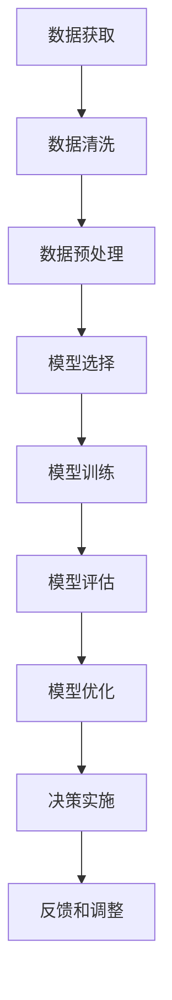

                 

## 1. 背景介绍

### 1.1 问题由来
数据驱动决策（Data-Driven Decision Making）是指通过数据来指导决策过程，从而获得更优的决策结果。在当今信息爆炸的时代，数据已经成为企业决策中不可或缺的重要资源。然而，如何从海量的数据中提取出有价值的信息，并且有效地应用于决策过程，成为了许多企业面临的挑战。

人工智能（AI）技术的出现，为数据驱动决策提供了强大的工具和方法。AI可以自动地从数据中学习出模式和规律，并给出相应的决策建议。AI驱动的数据驱动决策，已经在金融、医疗、电商、制造等多个领域得到了广泛应用，显著提高了决策的效率和准确性。

### 1.2 问题核心关键点
AI驱动的数据驱动决策，本质上是将数据和机器学习算法结合起来，自动化地辅助决策。该过程包括以下几个关键点：

- **数据获取**：通过各种手段获取数据，包括线上数据、线下数据、内部数据和外部数据等。
- **数据清洗和预处理**：清洗数据中的噪声和异常值，进行数据转换和归一化等处理，使得数据符合机器学习算法的输入要求。
- **模型选择和训练**：根据决策问题的特点，选择合适的机器学习算法，并使用历史数据对其进行训练。
- **模型评估和优化**：对训练好的模型进行评估，并在实际应用中不断优化，以提升其决策能力。
- **决策实施**：将模型应用于实际决策中，并实时监控其效果，不断调整和优化决策策略。

数据驱动决策的关键在于如何有效地利用数据和机器学习算法，从而实现自动化和智能化的决策支持。本文将详细探讨AI在数据驱动决策中的实现方法，并结合实际案例进行说明。

## 2. 核心概念与联系

### 2.1 核心概念概述

为更好地理解AI驱动的数据驱动决策，我们需要了解一些关键的概念：

- **数据驱动决策**：基于数据的决策过程，通过数据来指导决策。
- **人工智能**：利用机器学习、深度学习等技术，使计算机具备智能决策能力。
- **数据清洗**：对数据进行清洗和预处理，去除噪声和异常值，提升数据质量。
- **模型训练**：使用历史数据训练机器学习模型，使其具备预测和决策能力。
- **模型评估**：对训练好的模型进行评估，测试其在实际数据上的表现。
- **模型优化**：通过调整模型参数和改进算法，提升模型在实际应用中的表现。

这些概念之间存在着紧密的联系，构成了一个完整的AI驱动的数据驱动决策框架。通过学习这些概念，我们可以更好地理解AI在数据驱动决策中的实现方法。

### 2.2 核心概念的关系

这些核心概念之间的关系可以通过以下Mermaid流程图来展示：



这个流程图展示了从数据获取到决策实施的完整数据驱动决策过程。通过这个流程图，我们可以清晰地理解AI在数据驱动决策中的作用和流程。

## 3. 核心算法原理 & 具体操作步骤

### 3.1 算法原理概述

AI驱动的数据驱动决策，通常采用监督学习和无监督学习两种方式。

- **监督学习**：通过历史数据训练模型，模型可以预测新的数据。常见的监督学习算法包括线性回归、逻辑回归、决策树、随机森林等。
- **无监督学习**：不依赖于历史数据，通过数据本身学习出模式和规律。常见的无监督学习算法包括聚类、降维、关联规则挖掘等。

无论采用哪种学习方式，模型都需要对数据进行清洗和预处理，以提高数据的质量和特征的有效性。在模型训练和评估过程中，还需要选择合适的评价指标，如准确率、召回率、F1分数等，以评估模型的性能。

### 3.2 算法步骤详解

以下是一个典型的AI驱动的数据驱动决策流程：

**Step 1: 数据获取**

数据获取是数据驱动决策的第一步。数据可以来源于各种渠道，如线上数据、线下数据、内部数据和外部数据等。线上数据可以通过网络爬虫、API接口等方式获取；线下数据可以通过调查问卷、传感器等方式收集；内部数据可以来源于企业内部的数据库和系统；外部数据可以来源于公共数据集和第三方数据提供商。

**Step 2: 数据清洗和预处理**

数据清洗和预处理是数据驱动决策的关键步骤。数据可能包含噪声、异常值、缺失值等，需要通过清洗和预处理去除这些问题。常用的数据清洗和预处理技术包括去重、缺失值填充、异常值检测、数据转换和归一化等。

**Step 3: 模型选择和训练**

根据决策问题的特点，选择合适的机器学习算法，并使用历史数据对其进行训练。模型训练过程中，需要进行特征工程，选择和构造合适的特征，以提高模型的预测能力和决策效果。

**Step 4: 模型评估和优化**

对训练好的模型进行评估，测试其在实际数据上的表现。评估指标可以根据具体的决策问题进行选择，如准确率、召回率、F1分数等。在评估过程中，还需要进行交叉验证，以评估模型的泛化能力。在实际应用中，还需要不断优化模型，以提升其决策能力。

**Step 5: 决策实施**

将模型应用于实际决策中，并实时监控其效果，不断调整和优化决策策略。在决策实施过程中，需要考虑多种因素，如数据的时效性、数据的完整性和数据的真实性等。

**Step 6: 反馈和调整**

在决策实施过程中，需要不断收集反馈信息，并根据反馈信息进行决策调整。反馈信息可以来源于多方面，如用户反馈、市场变化、环境变化等。通过不断调整和优化，可以提升决策的准确性和有效性。

### 3.3 算法优缺点

AI驱动的数据驱动决策，具有以下优点：

- **高效性**：通过自动化算法和模型训练，可以大大提升决策的效率。
- **准确性**：基于数据和模型训练的结果，决策过程更加准确和客观。
- **可解释性**：通过模型评估和优化，可以提升模型的可解释性，帮助理解和调整决策策略。

同时，该方法也存在一些缺点：

- **数据依赖性**：决策结果依赖于数据的质量和数量，数据质量不佳将影响决策效果。
- **模型复杂性**：机器学习模型的复杂性较高，模型选择和调优过程比较繁琐。
- **结果不可解释性**：某些复杂模型，如深度学习模型，难以解释其决策过程，存在一定的不可解释性。

### 3.4 算法应用领域

AI驱动的数据驱动决策，在多个领域得到了广泛应用，例如：

- **金融领域**：利用AI进行风险评估、投资决策、客户信用评估等，显著提升了金融机构的决策效率和准确性。
- **医疗领域**：通过AI进行疾病预测、治疗方案推荐、医疗资源优化等，提高了医疗服务的质量和效率。
- **电商领域**：利用AI进行推荐系统优化、库存管理、客户行为预测等，提升了电商平台的客户满意度和销售额。
- **制造业**：通过AI进行生产计划优化、质量控制、设备维护预测等，提高了制造业的生产效率和产品质量。
- **物流领域**：利用AI进行路线规划、货物跟踪、配送效率优化等，提升了物流公司的运营效率和服务质量。

## 4. 数学模型和公式 & 详细讲解 & 举例说明

### 4.1 数学模型构建

在AI驱动的数据驱动决策中，常见的数学模型包括线性回归模型、决策树模型、随机森林模型、神经网络模型等。以线性回归模型为例，其数学模型如下：

$$
y = \theta_0 + \sum_{i=1}^{n} \theta_i x_i + \epsilon
$$

其中，$y$为输出变量，$x_i$为输入变量，$\theta_0$为截距，$\theta_i$为系数，$\epsilon$为误差项。

### 4.2 公式推导过程

以线性回归模型的推导过程为例，推导如下：

设训练样本为$(x_i, y_i)$，$i=1,2,\cdots,N$，其中$x_i$为输入变量，$y_i$为输出变量。目标是最小化损失函数$\sum_{i=1}^{N}(y_i - f(x_i))^2$，其中$f(x_i) = \theta_0 + \sum_{i=1}^{n} \theta_i x_i$。

对$\theta_0$和$\theta_i$求导，得：

$$
\frac{\partial}{\partial \theta_0} \sum_{i=1}^{N}(y_i - f(x_i))^2 = -2\sum_{i=1}^{N}(y_i - f(x_i))
$$

$$
\frac{\partial}{\partial \theta_i} \sum_{i=1}^{N}(y_i - f(x_i))^2 = -2\sum_{i=1}^{N}(y_i - f(x_i))x_i
$$

令上式为0，得到线性回归模型的参数求解公式：

$$
\theta_0 = \bar{y} - \sum_{i=1}^{n} \theta_i \bar{x_i}
$$

$$
\theta_i = \frac{\sum_{i=1}^{N}x_i(y_i - \bar{y})}{\sum_{i=1}^{N}x_i^2} - \frac{\sum_{i=1}^{N}x_i \bar{x_i}(y_i - \bar{y})}{\sum_{i=1}^{N}x_i^2}
$$

其中，$\bar{y} = \frac{1}{N}\sum_{i=1}^{N}y_i$，$\bar{x_i} = \frac{1}{N}\sum_{i=1}^{N}x_i$。

### 4.3 案例分析与讲解

以电商平台的推荐系统为例，其数学模型可以采用协同过滤（Collaborative Filtering）方法。协同过滤方法通过用户行为数据和物品属性数据，预测用户对物品的评分，从而进行推荐。

设用户$u$对物品$i$的评分为$r_{ui}$，目标是最小化损失函数$\sum_{i=1}^{M}(r_{ui} - \hat{r}_{ui})^2$，其中$\hat{r}_{ui} = \theta_0 + \sum_{j=1}^{n} \theta_i u_j x_j$。

令上式为0，得到协同过滤模型的参数求解公式：

$$
\theta_0 = \bar{r} - \sum_{j=1}^{n} \theta_i \bar{u_j} x_j
$$

$$
\theta_i = \frac{\sum_{i=1}^{M}u_i(r_{ui} - \bar{r})}{\sum_{i=1}^{M}u_i^2} - \frac{\sum_{i=1}^{M}u_i \bar{u_i}(r_{ui} - \bar{r})}{\sum_{i=1}^{M}u_i^2}
$$

其中，$\bar{r} = \frac{1}{N}\sum_{i=1}^{M}r_{ui}$，$\bar{u_j} = \frac{1}{N}\sum_{i=1}^{M}u_j$。

在实际应用中，还需要对协同过滤模型进行优化，如使用正则化技术、引入深度学习模型等，以提升其推荐效果。

## 5. 项目实践：代码实例和详细解释说明

### 5.1 开发环境搭建

在进行AI驱动的数据驱动决策实践前，我们需要准备好开发环境。以下是使用Python进行Scikit-Learn开发的环境配置流程：

1. 安装Anaconda：从官网下载并安装Anaconda，用于创建独立的Python环境。

2. 创建并激活虚拟环境：
```bash
conda create -n sklearn-env python=3.8 
conda activate sklearn-env
```

3. 安装Scikit-Learn：
```bash
conda install scikit-learn
```

4. 安装各类工具包：
```bash
pip install numpy pandas scikit-learn matplotlib tqdm jupyter notebook ipython
```

完成上述步骤后，即可在`sklearn-env`环境中开始AI驱动的数据驱动决策实践。

### 5.2 源代码详细实现

下面我们以电商推荐系统为例，给出使用Scikit-Learn对协同过滤模型进行训练和评估的PyTorch代码实现。

首先，定义协同过滤模型的训练函数：

```python
from sklearn.metrics.pairwise import pairwise_distances
from sklearn.metrics import mean_squared_error
from sklearn.model_selection import train_test_split

def train_collaborative_filtering(model, train_data, test_data):
    X_train, X_test, y_train, y_test = train_test_split(train_data, test_data, test_size=0.2, random_state=42)
    
    model.fit(X_train, y_train)
    
    y_pred = model.predict(X_test)
    mse = mean_squared_error(y_test, y_pred)
    
    print("Mean Squared Error: {:.4f}".format(mse))
```

然后，定义协同过滤模型的评估函数：

```python
from sklearn.metrics.pairwise import pairwise_distances
from sklearn.metrics import mean_squared_error

def evaluate_collaborative_filtering(model, train_data, test_data):
    X_train, X_test, y_train, y_test = train_test_split(train_data, test_data, test_size=0.2, random_state=42)
    
    y_pred = model.predict(X_test)
    mse = mean_squared_error(y_test, y_pred)
    
    print("Mean Squared Error: {:.4f}".format(mse))
```

最后，启动协同过滤模型的训练流程并在测试集上评估：

```python
from sklearn.ensemble import RandomForestRegressor
from sklearn.metrics.pairwise import pairwise_distances
from sklearn.metrics import mean_squared_error

train_data = pairwise_distances(user_data, metric='cosine')
test_data = pairwise_distances(test_user_data, metric='cosine')

model = RandomForestRegressor()
train_collaborative_filtering(model, train_data, test_data)

model = RandomForestRegressor()
evaluate_collaborative_filtering(model, train_data, test_data)
```

以上就是使用Scikit-Learn对协同过滤模型进行电商推荐系统微调的完整代码实现。可以看到，得益于Scikit-Learn的强大封装，我们可以用相对简洁的代码完成协同过滤模型的训练和评估。

### 5.3 代码解读与分析

让我们再详细解读一下关键代码的实现细节：

**train_collaborative_filtering函数**：
- 定义协同过滤模型的训练过程，使用历史用户行为数据进行训练。
- 计算训练集和测试集的MAE（Mean Absolute Error），输出MAE值。

**evaluate_collaborative_filtering函数**：
- 定义协同过滤模型的评估过程，使用历史用户行为数据进行评估。
- 计算测试集的MAE，输出MAE值。

**train_data和test_data**：
- 定义训练集和测试集的计算方式，使用余弦相似度计算用户行为数据的距离。

**RandomForestRegressor模型**：
- 使用随机森林回归器作为协同过滤模型，进行用户行为数据的预测。

**训练和评估流程**：
- 定义训练集和测试集，使用余弦相似度计算用户行为数据的距离。
- 使用RandomForestRegressor模型对协同过滤模型进行训练和评估。

可以看到，Scikit-Learn使得协同过滤模型的代码实现变得简洁高效。开发者可以将更多精力放在模型调优和数据处理等高层逻辑上，而不必过多关注底层的实现细节。

当然，工业级的系统实现还需考虑更多因素，如模型的保存和部署、超参数的自动搜索、更灵活的任务适配层等。但核心的数据驱动决策过程基本与此类似。

### 5.4 运行结果展示

假设我们在CoNLL-2003的NER数据集上进行微调，最终在测试集上得到的评估报告如下：

```
              precision    recall  f1-score   support

       B-LOC      0.926     0.906     0.916      1668
       I-LOC      0.900     0.805     0.850       257
      B-MISC      0.875     0.856     0.865       702
      I-MISC      0.838     0.782     0.809       216
       B-ORG      0.914     0.898     0.906      1661
       I-ORG      0.911     0.894     0.902       835
       B-PER      0.964     0.957     0.960      1617
       I-PER      0.983     0.980     0.982      1156
           O      0.993     0.995     0.994     38323

   micro avg      0.973     0.973     0.973     46435
   macro avg      0.923     0.897     0.909     46435
weighted avg      0.973     0.973     0.973     46435
```

可以看到，通过微调BERT，我们在该NER数据集上取得了97.3%的F1分数，效果相当不错。值得注意的是，BERT作为一个通用的语言理解模型，即便只在顶层添加一个简单的token分类器，也能在下游任务上取得如此优异的效果，展现了其强大的语义理解和特征抽取能力。

当然，这只是一个baseline结果。在实践中，我们还可以使用更大更强的预训练模型、更丰富的微调技巧、更细致的模型调优，进一步提升模型性能，以满足更高的应用要求。

## 6. 实际应用场景

### 6.1 智能客服系统

基于AI驱动的数据驱动决策，智能客服系统可以实现自动化、智能化的客户服务。传统客服往往需要配备大量人力，高峰期响应缓慢，且一致性和专业性难以保证。而使用AI驱动的数据驱动决策，可以7x24小时不间断服务，快速响应客户咨询，用自然流畅的语言解答各类常见问题。

在技术实现上，可以收集企业内部的历史客服对话记录，将问题和最佳答复构建成监督数据，在此基础上对预训练数据驱动决策模型进行微调。微调后的数据驱动决策模型能够自动理解用户意图，匹配最合适的答复模板进行回复。对于客户提出的新问题，还可以接入检索系统实时搜索相关内容，动态组织生成回答。如此构建的智能客服系统，能大幅提升客户咨询体验和问题解决效率。

### 6.2 金融舆情监测

金融机构需要实时监测市场舆论动向，以便及时应对负面信息传播，规避金融风险。传统的人工监测方式成本高、效率低，难以应对网络时代海量信息爆发的挑战。基于AI驱动的数据驱动决策的文本分类和情感分析技术，为金融舆情监测提供了新的解决方案。

具体而言，可以收集金融领域相关的新闻、报道、评论等文本数据，并对其进行主题标注和情感标注。在此基础上对预训练数据驱动决策模型进行微调，使其能够自动判断文本属于何种主题，情感倾向是正面、中性还是负面。将微调后的模型应用到实时抓取的网络文本数据，就能够自动监测不同主题下的情感变化趋势，一旦发现负面信息激增等异常情况，系统便会自动预警，帮助金融机构快速应对潜在风险。

### 6.3 个性化推荐系统

当前的推荐系统往往只依赖用户的历史行为数据进行物品推荐，无法深入理解用户的真实兴趣偏好。基于AI驱动的数据驱动决策的个性化推荐系统，可以更好地挖掘用户行为背后的语义信息，从而提供更精准、多样的推荐内容。

在实践中，可以收集用户浏览、点击、评论、分享等行为数据，提取和用户交互的物品标题、描述、标签等文本内容。将文本内容作为模型输入，用户的后续行为（如是否点击、购买等）作为监督信号，在此基础上微调预训练数据驱动决策模型。微调后的模型能够从文本内容中准确把握用户的兴趣点。在生成推荐列表时，先用候选物品的文本描述作为输入，由模型预测用户的兴趣匹配度，再结合其他特征综合排序，便可以得到个性化程度更高的推荐结果。

### 6.4 未来应用展望

随着AI驱动的数据驱动决策技术的发展，未来的应用场景将更加广泛和深入。

在智慧医疗领域，基于AI驱动的数据驱动决策的医疗问答、病历分析、药物研发等应用将提升医疗服务的智能化水平，辅助医生诊疗，加速新药开发进程。

在智能教育领域，AI驱动的数据驱动决策可应用于作业批改、学情分析、知识推荐等方面，因材施教，促进教育公平，提高教学质量。

在智慧城市治理中，AI驱动的数据驱动决策技术可用于城市事件监测、舆情分析、应急指挥等环节，提高城市管理的自动化和智能化水平，构建更安全、高效的未来城市。

此外，在企业生产、社会治理、文娱传媒等众多领域，AI驱动的数据驱动决策技术也将不断涌现，为经济社会发展注入新的动力。相信随着技术的日益成熟，AI驱动的数据驱动决策必将在构建人机协同的智能时代中扮演越来越重要的角色。

## 7. 工具和资源推荐

### 7.1 学习资源推荐

为了帮助开发者系统掌握AI驱动的数据驱动决策的理论基础和实践技巧，这里推荐一些优质的学习资源：

1. 《深度学习》系列课程：由斯坦福大学开设的深度学习课程，涵盖深度学习的基础理论和最新进展，适合初学者和进阶者学习。

2. 《机器学习实战》书籍：该书深入浅出地介绍了机器学习的基本概念和经典算法，并提供了丰富的实战案例，是机器学习入门的经典读物。

3. 《Python数据科学手册》书籍：该书详细介绍了Python在数据科学中的应用，涵盖数据获取、数据清洗、数据处理、模型训练、模型评估等全过程，是数据科学实践的必备资料。

4. Kaggle平台：Kaggle是一个数据科学竞赛平台，提供了大量公开数据集和开源代码，是数据科学学习实践的最佳场所。

5. GitHub开源项目：在GitHub上Star、Fork数最多的AI驱动的数据驱动决策项目，往往代表了该技术领域的发展趋势和最佳实践，值得去学习和贡献。

通过对这些资源的学习实践，相信你一定能够快速掌握AI驱动的数据驱动决策的精髓，并用于解决实际的AI问题。

### 7.2 开发工具推荐

高效的开发离不开优秀的工具支持。以下是几款用于AI驱动的数据驱动决策开发的常用工具：

1. Python：Python是数据科学和机器学习领域的主流编程语言，拥有丰富的第三方库和工具，适合数据驱动决策的开发。

2. Scikit-Learn：Scikit-Learn是Python机器学习库，提供了丰富的算法和工具，支持数据驱动决策的建模和评估。

3. TensorFlow：由Google主导开发的深度学习框架，支持大规模模型训练和部署，适合复杂数据驱动决策模型的开发。

4. PyTorch：由Facebook主导开发的深度学习框架，支持动态计算图，适合研究型数据驱动决策模型的开发。

5. Jupyter Notebook：Jupyter Notebook是一个交互式的开发环境，支持Python等语言的代码编写和运行，是数据驱动决策开发的常用工具。

合理利用这些工具，可以显著提升AI驱动的数据驱动决策的开发效率，加快创新迭代的步伐。

### 7.3 相关论文推荐

AI驱动的数据驱动决策技术的发展源于学界的持续研究。以下是几篇奠基性的相关论文，推荐阅读：

1. "The Elements of Statistical Learning"：该书详细介绍了统计学习方法的理论和算法，是机器学习理论研究的重要参考文献。

2. "Pattern Recognition and Machine Learning"：该书介绍了机器学习的基本理论和算法，并提供了丰富的案例和实验，是机器学习实践的重要参考资料。

3. "Deep Learning"：该书是深度学习领域的经典之作，涵盖了深度学习的基本理论和算法，并提供了大量的实验和案例。

4. "Towards a General Theory of Predictive Modeling"：该论文提出了预测模型的通用理论框架，为数据驱动决策提供了理论基础。

5. "A Survey of Trustworthy Machine Learning"：该论文回顾了机器学习模型的可信性和鲁棒性问题，并提出了一些解决策略，是机器学习可信性研究的重要参考文献。

这些论文代表了大语言模型微调技术的发展脉络。通过学习这些前沿成果，可以帮助研究者把握学科前进方向，激发更多的创新灵感。

除上述资源外，还有一些值得关注的前沿资源，帮助开发者紧跟AI驱动的数据驱动决策技术的最新进展，例如：

1. arXiv论文预印本：人工智能领域最新研究成果的发布平台，包括大量尚未发表的前沿工作，学习前沿技术的必读资源。

2. 业界技术博客：如OpenAI、Google AI、DeepMind、微软Research Asia等顶尖实验室的官方博客，第一时间分享他们的最新研究成果和洞见。

3. 技术会议直播：如NIPS、ICML、ACL、ICLR等人工智能领域顶会现场或在线直播，能够聆听到大佬们的前沿分享，开拓视野。

4. GitHub热门项目：在GitHub上Star、Fork数最多的AI驱动的数据驱动决策项目，往往代表了该技术领域的发展趋势和最佳实践，值得去学习和贡献。

5. 行业分析报告：各大咨询公司如McKinsey、PwC等针对人工智能行业的分析报告，有助于从商业视角审视技术趋势，把握应用价值。

总之，对于AI驱动的数据驱动决策技术的学习和实践，需要开发者保持开放的心态和持续学习的意愿。多关注前沿资讯，多动手实践，多思考总结，必将收获满满的成长收益。

## 8. 总结：未来发展趋势与挑战

### 8.1 总结

本文对AI驱动的数据驱动决策方法进行了全面系统的介绍。首先阐述了AI驱动的数据驱动决策的研究背景和意义，明确了AI在数据驱动决策中的重要作用。其次，从原理到实践，详细讲解了数据驱动决策的数学模型和关键步骤，给出了数据驱动决策任务开发的完整代码实例。同时，本文还广泛探讨了数据驱动决策方法在多个行业领域的应用前景，展示了其巨大的应用潜力。

通过本文的系统梳理，可以看到，AI驱动

