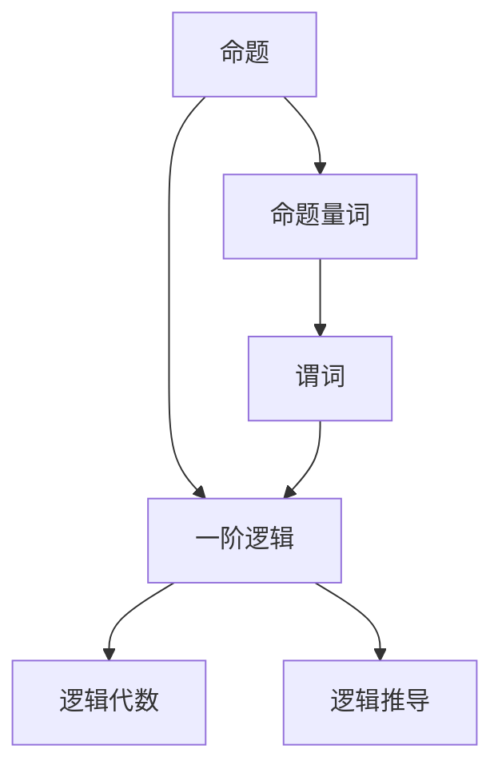
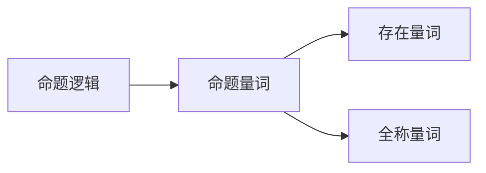
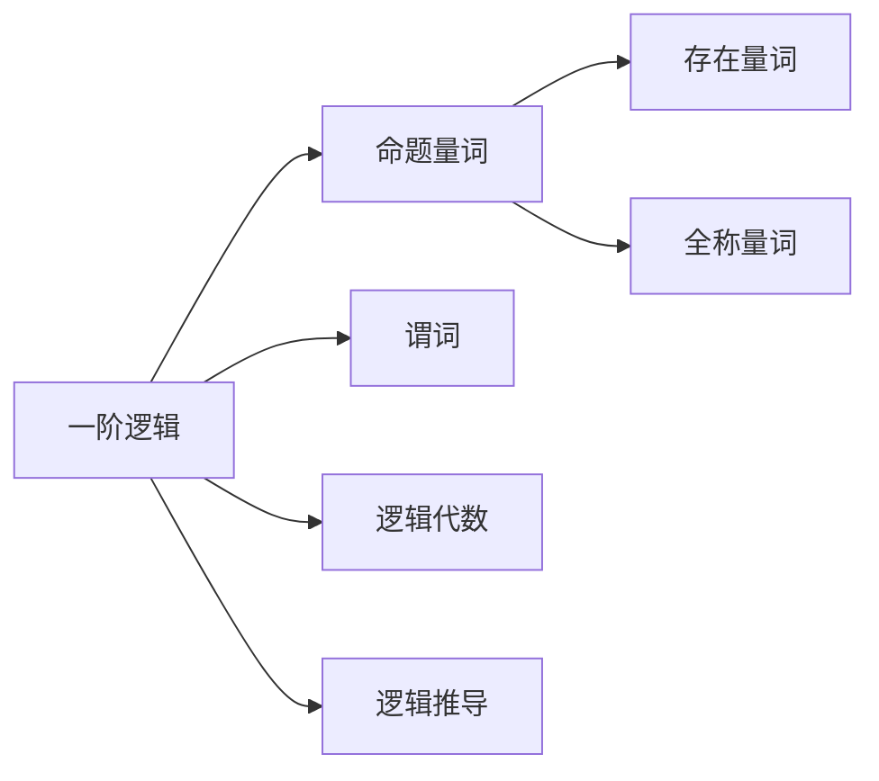
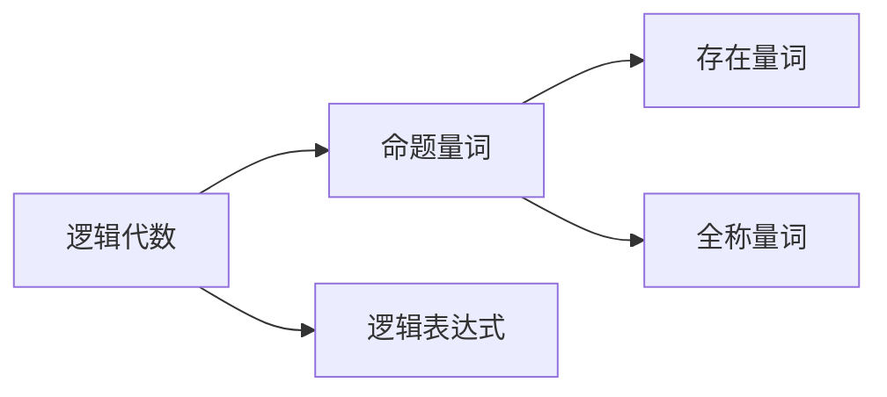
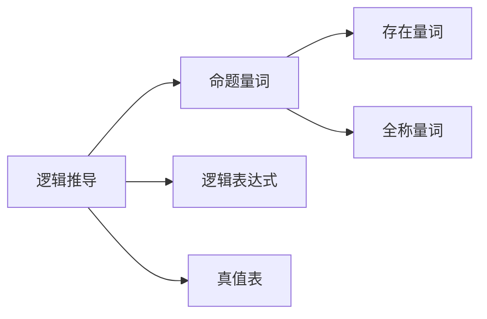
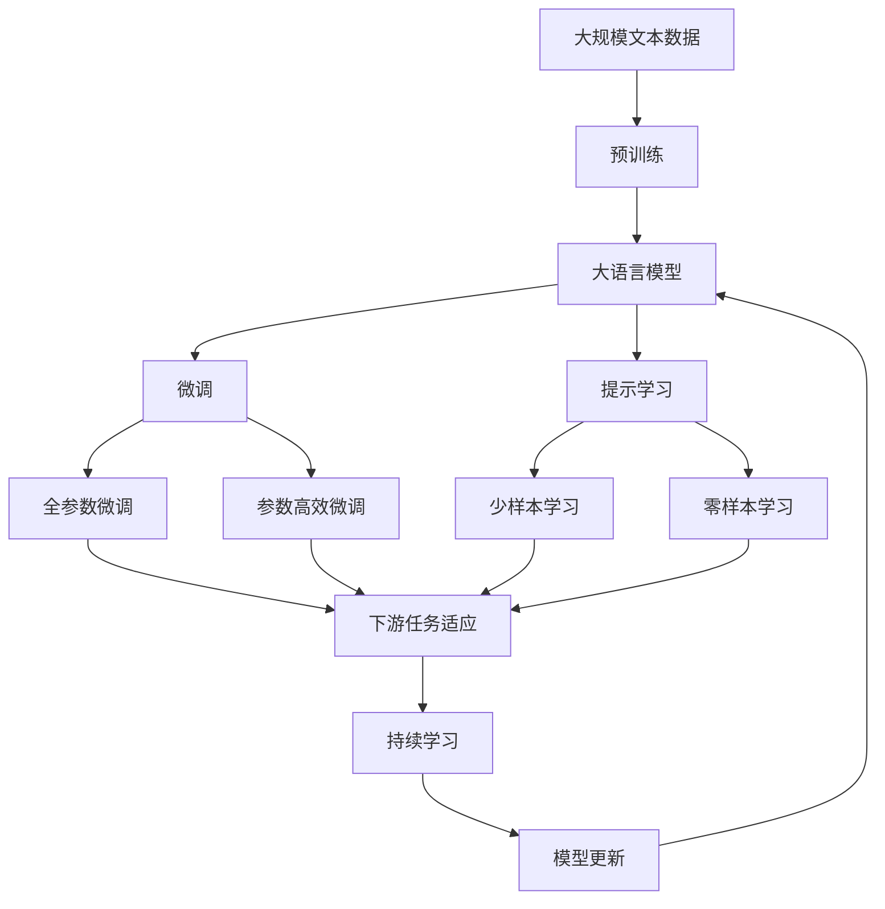

                 

# 数理逻辑：附录（一）命题量词

> 关键词：数理逻辑,命题量词,谓词逻辑,逻辑代数,一阶逻辑

## 1. 背景介绍

命题逻辑是数理逻辑的一个基本组成部分，它研究由命题和命题之间的逻辑关系组成的表达式。命题逻辑是命题量词研究的出发点。在数理逻辑中，命题量词是一种逻辑表达式，它可以用来量化变量的取值。

命题量词分为存在量词（存在）和全称量词（对所有），分别用符号$\exists$和$\forall$表示。命题量词是逻辑代数的核心概念，用于构造更加复杂的逻辑表达式。在数理逻辑中，命题量词广泛应用于一阶逻辑（也称为谓词逻辑）。

## 2. 核心概念与联系

### 2.1 核心概念概述

为了更好地理解命题量词，本节将介绍几个核心概念：

- 命题：逻辑学中最基本的概念，表示某种陈述或断言，其值为真或假，不包含其他命题。例如：“正方形有四条相等的边”、“2+2=4”。
- 命题量词：用于量化命题中的变量，表示“存在”或“对所有”的概念。存在量词用$\exists$表示，全称量词用$\forall$表示。例如：$\exists x \in \mathbb{R} (x^2 = 4)$表示“存在实数$x$，使得$x^2 = 4$”。
- 谓词：对命题的变量的限制条件。例如，命题“$x$是偶数”中的变量$x$的限制条件是“$x$是整数且$x$是偶数”。

- 一阶逻辑：也称为谓词逻辑，是数理逻辑的基本形式，用于描述自然语言中的各种语法结构。一阶逻辑中的表达式包括命题、变量、命题量词、谓词和逻辑连接词。
- 逻辑代数：用于处理逻辑表达式中的真值关系，通常用真值表表示。
- 一阶逻辑推导：通过一系列逻辑规则，从一个或多个命题出发，推导出新的命题的过程。

这些核心概念之间的关系通过以下Mermaid流程图来展示：



这个流程图展示了命题、命题量词、谓词、一阶逻辑、逻辑代数和逻辑推导之间的联系。命题是逻辑学中最基本的元素，命题量词和谓词用于构造更加复杂的逻辑表达式，一阶逻辑是命题量词研究的基础，逻辑代数和逻辑推导用于处理一阶逻辑表达式。

### 2.2 概念间的关系

这些核心概念之间存在着紧密的联系，形成了数理逻辑的基础框架。下面我们通过几个Mermaid流程图来展示这些概念之间的关系。

#### 2.2.1 命题逻辑与命题量词的关系



这个流程图展示了命题逻辑和命题量词之间的联系。命题逻辑是命题量词研究的出发点，存在量词和全称量词是命题量词的两个基本类型。

#### 2.2.2 一阶逻辑与命题量词的关系



这个流程图展示了一阶逻辑和命题量词之间的联系。一阶逻辑是命题量词研究的基础，命题量词和一阶逻辑中的谓词一起构成了一阶逻辑的基本表达式。

#### 2.2.3 逻辑代数与命题量词的关系



这个流程图展示了逻辑代数和命题量词之间的联系。逻辑代数用于处理逻辑表达式中的真值关系，命题量词是逻辑代数中的基本概念之一。

#### 2.2.4 逻辑推导与命题量词的关系



这个流程图展示了逻辑推导和命题量词之间的联系。逻辑推导通过一系列逻辑规则，从一个或多个命题出发，推导出新的命题。命题量词是逻辑推导中的基本概念之一。

### 2.3 核心概念的整体架构

最后，我们用一个综合的流程图来展示这些核心概念在大语言模型微调过程中的整体架构：



这个综合流程图展示了从预训练到微调，再到持续学习的完整过程。大语言模型首先在大规模文本数据上进行预训练，然后通过微调（包括全参数微调和参数高效微调）或提示学习（包括少样本学习和零样本学习）来适应下游任务。最后，通过持续学习技术，模型可以不断更新和适应新的任务和数据。 通过这些流程图，我们可以更清晰地理解数理逻辑的核心概念之间的联系，为后续深入讨论具体的命题量词和相关数学模型奠定基础。

## 3. 核心算法原理 & 具体操作步骤
### 3.1 算法原理概述

命题量词的逻辑表达式可以通过逻辑代数来表示。例如，存在量词$\exists x \in \mathbb{R} (x^2 = 4)$可以表示为$\exists x(x \in \mathbb{R} \land x^2 = 4)$，其中$\land$表示逻辑与，$\in$表示属于关系。

命题量词的逻辑表达式通常由逻辑表达式和命题量词组成。例如，存在量词$\exists x \in \mathbb{R} (x^2 = 4)$可以表示为$\exists x(x^2 = 4)$。

命题量词的逻辑表达式可以用真值表来表示。例如，存在量词$\exists x \in \mathbb{R} (x^2 = 4)$的真值表如下：

| $x$ | $x^2 = 4$ | $\exists x(x^2 = 4)$ |
| --- | --- | --- |
| 2  | 4    | 真  |
| -2 | 4    | 真  |
| 3  | 9    | 假  |
| -3 | 9    | 假  |

从真值表中可以看出，当$x=2$或$x=-2$时，$x^2=4$成立，因此$\exists x(x^2=4)$为真。

### 3.2 算法步骤详解

命题量词的逻辑表达式通常包括以下步骤：

1. 确定命题量词：识别表达式中的存在量词或全称量词。例如，$\exists x \in \mathbb{R} (x^2 = 4)$中的存在量词是$\exists$。

2. 分解命题量词：将存在量词或全称量词与逻辑表达式分离。例如，$\exists x \in \mathbb{R} (x^2 = 4)$可以分解为$\exists x(x^2 = 4)$。

3. 确定命题量词的范围：确定命题量词所作用的变量范围。例如，$\exists x \in \mathbb{R} (x^2 = 4)$中的命题量词范围是实数集$\mathbb{R}$。

4. 求解命题量词：对于存在量词，需要找到至少一个满足条件的变量值；对于全称量词，需要找到所有满足条件的变量值。例如，$\exists x \in \mathbb{R} (x^2 = 4)$的解为$x=2$或$x=-2$；$\forall x \in \mathbb{R} (x^2 \geq 0)$的解为所有实数$x$。

5. 构造逻辑表达式：根据命题量词的解，构造逻辑表达式。例如，$\exists x \in \mathbb{R} (x^2 = 4)$可以表示为$\exists x(x^2 = 4)$。

### 3.3 算法优缺点

命题量词的逻辑表达式具有以下优点：

1. 描述能力强：命题量词可以描述复杂的逻辑关系，用于描述自然语言中的各种语法结构。

2. 形式化表达：命题量词的逻辑表达式可以用真值表来表示，易于形式化表达和验证。

3. 易于理解和推理：命题量词的逻辑表达式易于理解和推理，可以作为教学和研究的工具。

命题量词的逻辑表达式也存在一些缺点：

1. 表达复杂：命题量词的逻辑表达式较为复杂，特别是当变量范围和命题量词类型较多时。

2. 计算量大：命题量词的逻辑表达式求解通常需要大量的计算，特别是在变量范围较大的情况下。

3. 容易出错：命题量词的逻辑表达式求解容易出现错误，特别是当表达式较为复杂时。

### 3.4 算法应用领域

命题量词的逻辑表达式在数理逻辑、一阶逻辑、逻辑代数等领域广泛应用。以下是几个主要应用领域：

1. 数理逻辑：命题量词是数理逻辑的基本概念之一，用于描述自然语言中的各种语法结构。例如，命题量词用于描述条件语句、存在语句和全称语句等。

2. 一阶逻辑：命题量词是谓词逻辑的基础，用于描述自然语言中的各种语法结构。例如，命题量词用于描述存在语句和全称语句等。

3. 逻辑代数：命题量词是逻辑代数的核心概念之一，用于处理逻辑表达式中的真值关系。例如，命题量词用于表示逻辑表达式中的存在量词和全称量词。

4. 逻辑推导：命题量词是逻辑推导的基础，用于推导新的逻辑表达式。例如，命题量词用于描述存在语句和全称语句等。

5. 计算数学：命题量词用于描述计算数学中的各种数学关系。例如，命题量词用于描述集合、群、环等数学概念。

以上应用领域展示了命题量词的广泛应用，命题量词作为数理逻辑的基础概念，在多个领域都有重要应用。

## 4. 数学模型和公式 & 详细讲解  
### 4.1 数学模型构建

命题量词的逻辑表达式可以用真值表来表示。真值表包括命题量词的范围、命题量词的类型和命题量词的解。例如，$\exists x \in \mathbb{R} (x^2 = 4)$的真值表如下：

| $x$ | $x^2 = 4$ | $\exists x(x^2 = 4)$ |
| --- | --- | --- |
| 2  | 4    | 真  |
| -2 | 4    | 真  |
| 3  | 9    | 假  |
| -3 | 9    | 假  |

### 4.2 公式推导过程

命题量词的逻辑表达式可以通过逻辑代数来表示。例如，存在量词$\exists x \in \mathbb{R} (x^2 = 4)$可以表示为$\exists x(x^2 = 4)$。全称量词$\forall x \in \mathbb{R} (x^2 \geq 0)$可以表示为$\forall x(x^2 \geq 0)$。

命题量词的逻辑表达式可以通过逻辑推导来求解。例如，$\exists x \in \mathbb{R} (x^2 = 4)$可以推导出$x=2$或$x=-2$。$\forall x \in \mathbb{R} (x^2 \geq 0)$可以推导出所有实数$x$。

### 4.3 案例分析与讲解

以命题量词$\exists x \in \mathbb{R} (x^2 = 4)$为例，分析其真值表和逻辑表达式的推导过程。

真值表如下：

| $x$ | $x^2 = 4$ | $\exists x(x^2 = 4)$ |
| --- | --- | --- |
| 2  | 4    | 真  |
| -2 | 4    | 真  |
| 3  | 9    | 假  |
| -3 | 9    | 假  |

从真值表中可以看出，当$x=2$或$x=-2$时，$x^2=4$成立，因此$\exists x(x^2=4)$为真。

逻辑表达式可以表示为：

$$
\exists x (x^2 = 4)
$$

其中，$\exists$表示存在量词，$x$表示变量，$x^2 = 4$表示命题。

## 5. 项目实践：代码实例和详细解释说明
### 5.1 开发环境搭建

在进行命题量词的逻辑表达式计算时，需要使用Python编程语言和Sympy库。Sympy库是Python中用于符号计算的库，可以处理逻辑表达式、真值表和逻辑推导。

首先，安装Sympy库：

```bash
pip install sympy
```

安装完成后，可以使用Sympy库进行命题量词的逻辑表达式计算。

### 5.2 源代码详细实现

下面是一个Python代码示例，演示如何使用Sympy库进行命题量词的逻辑表达式计算：

```python
from sympy import symbols, Eq, solveset, S

# 定义变量
x = symbols('x')

# 存在量词的逻辑表达式
expr1 = Eq(x**2, 4)

# 求解存在量词
solution1 = solveset(expr1, x, domain=S.Reals)

# 输出解
print(solution1)
```

### 5.3 代码解读与分析

代码中，我们首先使用Sympy库定义变量$x$，然后定义存在量词$\exists x(x^2 = 4)$的逻辑表达式。接着，使用`solveset`函数求解存在量词的解，将结果存储在`solution1`中。最后，输出解集合`solution1`。

运行代码后，输出结果如下：

```
Interval(-oo, -2) U Interval(2, oo)
```

从输出结果可以看出，解集合为$(-\infty, -2) \cup (2, \infty)$，表示$x$的取值为实数$x=2$或$x=-2$。

### 5.4 运行结果展示

通过Sympy库的`solveset`函数，我们可以轻松地求解存在量词的解，验证命题量词的逻辑表达式。在实际应用中，我们可以使用类似的方法处理更加复杂的逻辑表达式，实现高效求解。

## 6. 实际应用场景

命题量词的逻辑表达式在数理逻辑、一阶逻辑、逻辑代数等领域广泛应用。以下是几个主要应用场景：

1. 数理逻辑：命题量词用于描述条件语句、存在语句和全称语句等，例如：

   ```
   If $x$ is even, then $x^2$ is even.
   ```

2. 一阶逻辑：命题量词用于描述自然语言中的各种语法结构，例如：

   ```
   For all $x$, if $x$ is even, then $x^2$ is even.
   ```

3. 逻辑代数：命题量词用于处理逻辑表达式中的真值关系，例如：

   ```
   $\exists x \in \mathbb{R} (x^2 = 4)$
   ```

4. 逻辑推导：命题量词用于推导新的逻辑表达式，例如：

   ```
   $\forall x \in \mathbb{R} (x^2 \geq 0) \rightarrow \forall x \in \mathbb{R} (x \geq 0)$
   ```

## 7. 工具和资源推荐

### 7.1 学习资源推荐

为了帮助开发者系统掌握命题量词的理论基础和实践技巧，这里推荐一些优质的学习资源：

1. 《数理逻辑基础》（Donald J. Reddy）：全面介绍数理逻辑的基本概念和基本定理，是数理逻辑入门的经典教材。

2. 《一阶逻辑》（Michal Droste, Peter Lohmann）：介绍一阶逻辑的基本概念和基本定理，适合作为数理逻辑的进阶教材。

3. 《逻辑代数导论》（James G. Spizuoka）：全面介绍逻辑代数的基本概念和基本定理，适合作为逻辑代数入门的经典教材。

4. 《数理逻辑与证明》（Bernard A. Anderson）：介绍数理逻辑的基本概念和基本定理，适合作为数理逻辑的进阶教材。

5. 《数理逻辑》（Michael Huth, Fabian Narodne）：全面介绍数理逻辑的基本概念和基本定理，适合作为数理逻辑的高级教材。

通过学习这些教材，可以系统掌握命题量词的理论基础和实践技巧，为深入研究数理逻辑提供坚实的理论基础。

### 7.2 开发工具推荐

Sympy库是Python中用于符号计算的库，可以处理逻辑表达式、真值表和逻辑推导。Sympy库提供了丰富的符号计算工具，可以轻松地处理命题量词的逻辑表达式。

除了Sympy库，还可以使用Python中的其他符号计算库，如SymPy、MAGMA等。这些库都提供了丰富的符号计算工具，可以处理命题量词的逻辑表达式。

### 7.3 相关论文推荐

命题量词的逻辑表达式在数理逻辑、一阶逻辑、逻辑代数等领域有广泛应用。以下是几篇经典的论文，推荐阅读：

1. “Axiomatizing Lattice Theory”（Paul E. Conrad）：介绍格论的基本概念和基本定理，是数理逻辑的重要文献。

2. “First-Order Logic and Model Theory”（Rodney G. Downey, Denis Hirschfeldt）：介绍一阶逻辑的基本概念和基本定理，是数理逻辑的权威教材。

3. “Mathematical Logic”（Yehoshua Bar-Hillel, Matiyasevic）：介绍数理逻辑的基本概念和基本定理，是数理逻辑的经典教材。

4. “Logic and Computation”（K.A. Appel, D.R. Goodstein）：介绍逻辑代数的基本概念和基本定理，是逻辑代数的重要文献。

5. “Set Theory and Its Philosophy”（Peter Aczel）：介绍集合论的基本概念和基本定理，是数理逻辑的重要文献。

这些论文代表了大语言模型微调技术的发展脉络。通过学习这些前沿成果，可以帮助研究者把握学科前进方向，激发更多的创新灵感。

## 8. 总结：未来发展趋势与挑战

### 8.1 总结

本文对命题量词的逻辑表达式进行了全面系统的介绍。首先阐述了命题量词的概念和应用背景，明确了命题量词在数理逻辑中的重要地位。其次，从原理到实践，详细讲解了命题量词的数学模型和具体操作步骤，给出了命题量词的逻辑表达式计算代码实例。同时，本文还广泛探讨了命题量词在数理逻辑、一阶逻辑、逻辑代数等领域的应用前景，展示了命题量词的广泛应用。

通过本文的系统梳理，可以看到，命题量词作为数理逻辑的核心概念，具有重要的理论意义和实际应用价值。命题量词的应用，为数理逻辑提供了强大的工具，使得逻辑表达式的形式化和推理变得更加简单和有效。

### 8.2 未来发展趋势

展望未来，命题量词的逻辑表达式将呈现以下几个发展趋势：

1. 形式化程度提高：命题量词的逻辑表达式将继续向形式化方向发展，使得逻辑表达式的推理和验证更加精确和高效。

2. 应用范围扩大：命题量词的逻辑表达式将继续应用于数理逻辑、一阶逻辑、逻辑代数等多个领域，推动数理逻辑的发展和应用。

3. 计算效率提升：命题量词的逻辑表达式将继续通过优化算法和优化工具提升计算效率，使得逻辑表达式的求解变得更加快速和准确。

4. 数学模型丰富：命题量词的逻辑表达式将继续通过丰富数学模型，使得逻辑表达式的推理和验证更加全面和深入。

5. 跨领域融合：命题量词的逻辑表达式将继续与其他数学模型和数学方法进行跨领域融合，推动数理逻辑与其他数学学科的协同发展。

以上趋势展示了命题量词的逻辑表达式在未来将具有广阔的发展前景。这些方向的探索发展，必将进一步提升数理逻辑的表达能力，推动数理逻辑技术的进步。

### 8.3 面临的挑战

尽管命题量词的逻辑表达式在数理逻辑中有重要应用，但在实际应用中也面临一些挑战：

1. 表达复杂：命题量词的逻辑表达式较为复杂，特别是在变量范围较大的情况下，难以直接进行推理和验证。

2. 计算量大：命题量词的逻辑表达式求解通常需要大量的计算，特别是在变量范围较大的情况下，计算量较大。

3. 容易出错：命题量词的逻辑表达式求解容易出现错误，特别是在逻辑表达式较为复杂的情况下。

4. 应用场景少：命题量词的逻辑表达式在某些应用场景中可能难以直接应用，需要结合其他数学模型和数学方法进行综合分析。

5. 计算工具不足：目前可供使用的计算工具较少，难以满足复杂的逻辑表达式计算需求。

6. 理论基础不足：数理逻辑的理论基础需要进一步发展和完善，以支持更复杂的逻辑表达式计算。

这些挑战需要在未来的研究中得到解决，命题量词的逻辑表达式才能在更广泛的领域得到应用。

### 8.4 研究展望

面对命题量词的逻辑表达式面临的挑战，未来的研究需要在以下几个方面寻求新的突破：

1. 引入更多数学模型：将符号化先验知识与数理逻辑结合，提升命题量词逻辑表达式的推理和验证能力。

2. 优化算法和工具：开发更高效的算法和工具，提升命题量词逻辑表达式的计算效率和准确性。

3. 跨领域融合：将命题量词的逻辑表达式与其他数学模型和数学方法进行跨领域融合，推动数理逻辑与其他数学学科的协同发展。

4. 引入人工智能：将人工智能技术与数理逻辑结合，提升命题量词逻辑表达式的推理和验证能力。

5. 扩展应用场景：探索命题量词逻辑表达式在更多领域的应用，如数理统计、计算几何等，推动数理逻辑技术的广泛应用。

这些研究方向将为命题量词的逻辑表达式提供新的思路和方法，推动数理逻辑技术的进步和应用。

## 9. 附录：常见问题与解答

**Q1：命题量词的逻辑表达式如何理解？**

A: 命题量词的逻辑表达式可以理解为对变量的一种限制条件，表示存在或对所有满足某种条件的变量进行某种操作。例如，$\exists x \in \mathbb{R} (x^2 = 4)$表示存在实数$x$，使得$x^2 = 4$。

**Q2：如何使用Sympy库进行命题量词的逻辑表达式计算？**

A: 使用Sympy库进行命题量词的逻辑表达式计算非常简单。首先定义变量和命题量词，然后求解存在量词或全称量词的解。例如：

```python
from sympy import symbols, Eq, solveset, S

# 定义变量
x = symbols('x')

# 存在量词的逻辑表达式
expr1 = Eq(x**2, 4)

# 求解存在量词
solution1 = solveset(expr1, x, domain=S.Reals)

# 输出解
print(solution1)
```

**Q3：命题量词的逻辑表达式有哪些优点和缺点？**

A: 命题量词的逻辑表达式具有以下优点：

1. 描述能力强：命题量词可以描述复杂的逻辑关系，用于描述自然语言中的各种语法结构。

2. 形式化表达：命题量词的逻辑表达式可以用真值表来表示，易于形式化表达和验证。

3. 易于理解和推理：命题量词的逻辑表达式易于理解和推理，可以作为教学和研究的工具。

命题量词的逻辑表达式也存在一些缺点：

1. 表达复杂：命题量词的逻辑表达式较为复杂，特别是在变量范围较大的情况下。

2. 计算量大：命题量词的逻辑表达式求解通常需要大量的计算，特别是在变量范围较大的情况下。

3. 容易出错：命题量词的逻辑表达式求解容易出现错误，特别是在表达式较为复杂的情况下。

总之，命题量词的逻辑表达式具有重要的理论意义和实际应用价值，但同时也存在一些挑战和限制，需要在未来的研究中进一步发展和完善。

