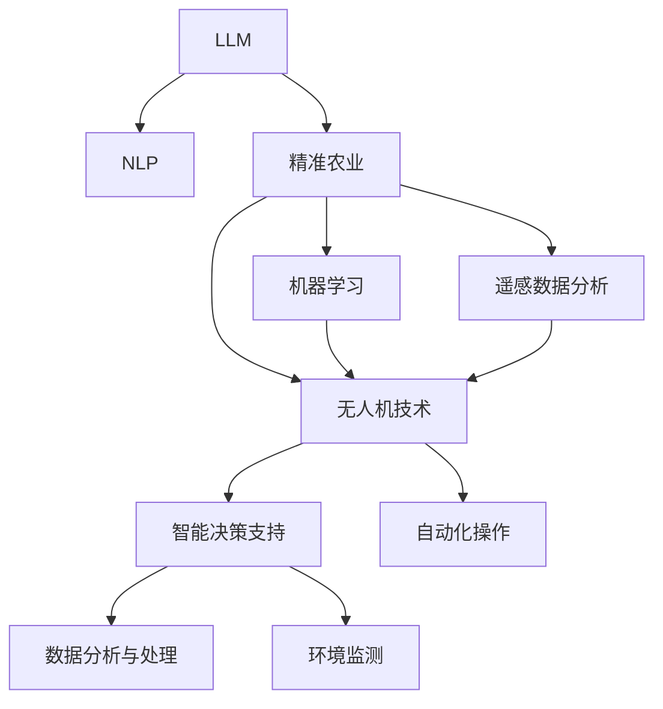
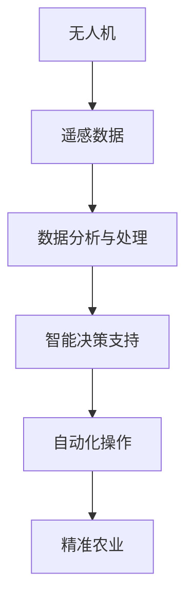
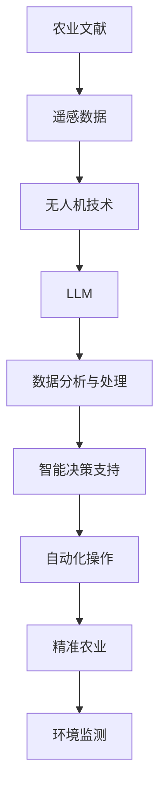
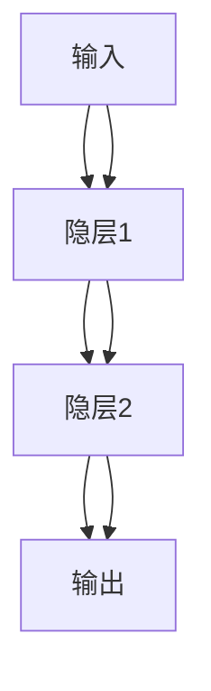

                 

# 智能农作物管理：LLM在精准农业中的角色

> 关键词：
- 大型语言模型(LLM)
- 精准农业
- 自然语言处理(NLP)
- 机器学习
- 遥感数据分析
- 无人机技术

## 1. 背景介绍

### 1.1 问题由来

随着全球人口的快速增长和环境的不断恶化，对食物的需求日益增长，同时对农业生产可持续性提出了更高要求。精准农业技术的应用，旨在通过高效、精确的资源管理，提升农作物的产量和质量，同时减少对环境的负面影响。大型语言模型(LLM)作为近年来在自然语言处理(NLP)领域取得重大突破的技术，其强大的语言理解和生成能力，为精准农业的发展带来了新的可能性。

### 1.2 问题核心关键点

精准农业的核心在于通过实时数据分析和自动化控制技术，对农业生产过程进行精确管理，实现资源的最优化利用。LLM在精准农业中的应用，主要体现在以下几个方面：

1. **数据分析与处理**：利用自然语言处理技术，从农业文献、科研报告、农民经验分享等海量文本中提取有用信息，辅助数据分析和决策。
2. **智能决策支持**：通过对话系统，提供专家建议、作物生长预测、病虫害预警等服务，帮助农民做出科学决策。
3. **自动化操作**：通过自然语言生成技术，将农业操作指令转换为机器可执行的命令，如播种、施肥、收割等。
4. **环境监测**：利用NLP技术对环境数据进行理解和解读，如土壤湿度、气温、降水量等，优化农事操作。

### 1.3 问题研究意义

研究LLM在精准农业中的应用，对于提升农业生产效率、保障食品安全、促进环境保护具有重要意义：

1. **提升生产效率**：通过智能决策支持，减少人为错误，优化资源配置，实现更高产出的农作物种植。
2. **保障食品安全**：利用NLP技术监测作物生长状况，及时发现病虫害，减少农药和化肥的使用，提高食品安全水平。
3. **促进环境保护**：通过精确管理，减少资源浪费，降低农业对环境的污染，实现绿色农业生产。
4. **推动农业创新**：LLM的应用，可以加速农业知识积累和传播，促进农业技术创新，推动农业现代化进程。

## 2. 核心概念与联系

### 2.1 核心概念概述

为了更好地理解LLM在精准农业中的应用，本节将介绍几个密切相关的核心概念：

- **大型语言模型(LLM)**：基于深度学习架构构建的模型，能够在大量文本数据上学习复杂的语言规律，具备强大的自然语言理解和生成能力。
- **精准农业**：利用现代信息技术和自动化控制技术，对农业生产过程进行精确管理，实现资源高效利用的农业模式。
- **自然语言处理(NLP)**：涉及计算机对人类语言文本进行自动化处理的技术，包括文本分析、情感分析、信息提取等。
- **机器学习**：通过数据驱动的方法，让计算机系统具备学习能力和自我提升的能力。
- **遥感数据分析**：利用卫星、无人机等设备收集的遥感数据，进行分析和处理，辅助农业决策。
- **无人机技术**：具备自主飞行能力的无人驾驶飞行器，广泛应用于农业的各个环节，如播种、施肥、病虫害监测等。

这些核心概念之间的逻辑关系可以通过以下Mermaid流程图来展示：



这个流程图展示了大语言模型在精准农业中的核心概念及其之间的关系：

1. 大语言模型通过自然语言处理技术，从农业文献中提取有用的信息，辅助数据分析和决策。
2. 精准农业涉及机器学习和遥感数据分析，通过智能决策和自动化操作提升农业生产效率。
3. 无人机技术进一步推动了精准农业的发展，提供更高效的农业操作和服务。

### 2.2 概念间的关系

这些核心概念之间存在着紧密的联系，形成了精准农业的完整生态系统。下面我通过几个Mermaid流程图来展示这些概念之间的关系。

#### 2.2.1 精准农业的生态系统


这个流程图展示了农业文献到精准农业的完整数据链条：

1. 农业文献是精准农业的原始数据来源，通过自然语言处理技术，LLM可以提取有用的信息。
2. 数据分析与处理、机器学习、智能决策支持、自动化操作等技术，共同支持精准农业的发展，实现农业生产的精确管理。

#### 2.2.2 无人机技术在精准农业中的应用



这个流程图展示了无人机技术在精准农业中的应用路径：

1. 无人机收集遥感数据，提供农业生产过程中的实时信息。
2. 通过数据分析与处理、智能决策支持、自动化操作，精准农业系统能够更高效地进行农作物管理。

#### 2.2.3 LLM在精准农业中的作用


这个流程图展示了LLM在精准农业中的作用：

1. 通过自然语言处理技术，LLM从农业文献中提取有用的信息。
2. 数据分析与处理、智能决策支持、自动化操作等技术，结合LLM的能力，实现精准农业的高效管理。

### 2.3 核心概念的整体架构

最后，我们用一个综合的流程图来展示这些核心概念在大语言模型在精准农业中的整体架构：



这个综合流程图展示了从农业文献到精准农业的完整流程，以及大语言模型在其中的作用：

1. 农业文献和遥感数据通过无人机技术采集，提供实时信息。
2. 大语言模型通过自然语言处理技术，提取有用的信息。
3. 数据分析与处理、智能决策支持、自动化操作等技术，共同支持精准农业的发展，实现农业生产的精确管理。
4. 精准农业系统通过环境监测，进一步优化资源配置，实现高效、环保的农业生产。

## 3. 核心算法原理 & 具体操作步骤
### 3.1 算法原理概述

LLM在精准农业中的应用，主要基于以下几个关键步骤：

1. **数据收集与处理**：利用无人机和遥感技术收集农业数据，如卫星图像、土壤湿度、气温等。
2. **文本预处理**：对收集到的农业文献和科研报告进行清洗、分词、去停用词等预处理，提取有用的信息。
3. **数据融合**：将文本数据与遥感数据进行融合，生成综合的农业数据集。
4. **模型训练**：在处理好的数据集上，训练大语言模型，使其能够理解农业领域的语言和知识。
5. **智能决策**：利用训练好的模型，对新的农业问题进行智能解答，提供专家建议和决策支持。
6. **自动化操作**：将模型输出的指令转换为机器可执行的命令，自动进行播种、施肥、收割等操作。

### 3.2 算法步骤详解

以智能决策支持为例，以下详细讲解LLM在精准农业中的应用步骤：

**Step 1: 数据收集与处理**
- 利用无人机和遥感技术，收集农业数据，如卫星图像、土壤湿度、气温等。
- 将收集到的数据进行预处理，包括清洗、分词、去停用词等，提取有用的信息。

**Step 2: 文本预处理**
- 对农业文献和科研报告进行清洗、分词、去停用词等预处理，提取有用的信息。
- 将处理后的文本数据转换为模型可以理解的格式，如词向量表示。

**Step 3: 数据融合**
- 将文本数据与遥感数据进行融合，生成综合的农业数据集。
- 利用机器学习技术，对融合后的数据进行分析和处理，生成可供模型使用的特征。

**Step 4: 模型训练**
- 在处理好的数据集上，训练大语言模型，使其能够理解农业领域的语言和知识。
- 使用监督学习方法，将训练好的模型应用于新的农业问题。

**Step 5: 智能决策**
- 在新的农业问题上，输入问题描述和相关数据，模型能够理解并生成答案。
- 模型输出的答案可以包括专家建议、作物生长预测、病虫害预警等。

**Step 6: 自动化操作**
- 将模型输出的指令转换为机器可执行的命令，自动进行播种、施肥、收割等操作。
- 利用无人机技术，实现自动化操作，提高农业生产效率。

### 3.3 算法优缺点

LLM在精准农业中的应用具有以下优点：

1. **高效性**：大语言模型能够高效地处理海量农业数据，提取有用的信息，支持智能决策。
2. **灵活性**：模型能够适应不同的农业场景，灵活地调整算法参数，满足不同的农业需求。
3. **可扩展性**：模型可以通过增加数据和训练样本，不断提升性能，实现持续优化。

同时，也存在以下缺点：

1. **依赖高质量数据**：模型的性能高度依赖于高质量的农业数据和文献，数据质量不高会导致模型效果不佳。
2. **计算资源消耗大**：大语言模型的训练和推理需要大量计算资源，对硬件设备要求较高。
3. **模型复杂度高**：模型的复杂度较高，训练和推理过程较慢，对实时性要求较高的场景可能不适用。

### 3.4 算法应用领域

基于大语言模型的精准农业技术，已经应用于多个实际场景，包括：

1. **作物生长预测**：通过分析土壤湿度、气温等数据，结合自然语言处理技术，预测作物的生长状况，优化种植方案。
2. **病虫害预警**：利用无人机技术，收集田间图像和视频，通过自然语言处理技术，识别病虫害，提前预警。
3. **智能施肥与灌溉**：通过自然语言处理技术，分析土壤数据，提供科学的施肥和灌溉建议，优化资源利用。
4. **农业机器人控制**：利用大语言模型生成的指令，控制农业机器人进行播种、施肥、收割等操作，提高农业生产效率。
5. **农业咨询与培训**：通过自然语言处理技术，提取农业知识，生成农业咨询和培训材料，辅助农民学习。

## 4. 数学模型和公式 & 详细讲解 & 举例说明

### 4.1 数学模型构建

假设农业问题为 $Q$，大语言模型为 $M_{\theta}$，其中 $\theta$ 为模型参数。定义问题 $Q$ 的特征向量为 $\mathbf{x}_Q$，特征向量空间为 $\mathcal{X}$，则数学模型可以表示为：

$$
M_{\theta}(\mathbf{x}_Q) = f_{\theta}(\mathbf{x}_Q)
$$

其中 $f_{\theta}$ 为模型参数为 $\theta$ 的函数。

### 4.2 公式推导过程

以作物生长预测为例，模型将作物生长数据 $D=\{x_1, x_2, \ldots, x_n\}$ 作为输入，输出为预测结果 $y$。则数学模型可以表示为：

$$
y = M_{\theta}(D) = f_{\theta}(D)
$$

其中 $f_{\theta}$ 为模型参数为 $\theta$ 的函数。假设 $f_{\theta}$ 为神经网络模型，其结构如图示：



每个隐层有 $h$ 个神经元，则模型输出为：

$$
y = \sigma(h_2W_2^Th_1 + b_2) = \sigma(z_2)
$$

其中 $W_2$ 和 $b_2$ 为输出层的权重和偏置，$h_1$ 和 $h_2$ 为隐层的神经元向量，$z_2$ 为输出层的线性变换结果。

### 4.3 案例分析与讲解

假设有一个农业文献库，包含大量的农业研究报告和专家文章。为了预测某块土地的作物生长状况，我们首先从文献库中抽取与土地相关的信息，使用BERT模型进行预训练和微调。具体步骤如下：

1. **数据预处理**：将农业文献转换为BERT可接受的格式，进行分词、去停用词等预处理。
2. **特征提取**：利用BERT模型，对预处理后的文本数据进行特征提取，生成文本嵌入向量。
3. **模型训练**：在提取的文本嵌入向量上，使用监督学习方法训练模型，使其能够预测作物的生长状况。
4. **智能决策**：在新的土地上，输入土地相关信息，模型能够理解并生成预测结果。

## 5. 项目实践：代码实例和详细解释说明
### 5.1 开发环境搭建

在进行精准农业应用开发前，我们需要准备好开发环境。以下是使用Python进行TensorFlow开发的环境配置流程：

1. 安装Anaconda：从官网下载并安装Anaconda，用于创建独立的Python环境。

2. 创建并激活虚拟环境：
```bash
conda create -n tf-env python=3.8 
conda activate tf-env
```

3. 安装TensorFlow：根据CUDA版本，从官网获取对应的安装命令。例如：
```bash
conda install tensorflow
```

4. 安装相关库：
```bash
pip install numpy pandas scikit-learn matplotlib tensorflow huggingface-transformers
```

完成上述步骤后，即可在`tf-env`环境中开始精准农业应用开发。

### 5.2 源代码详细实现

以下是一个简单的Python代码示例，展示了如何使用TensorFlow和BERT模型进行精准农业中的智能决策支持：

```python
import tensorflow as tf
import numpy as np
import pandas as pd
from transformers import BertTokenizer, TFBertModel

# 加载数据
data = pd.read_csv('agriculture_data.csv')

# 定义模型
tokenizer = BertTokenizer.from_pretrained('bert-base-uncased')
model = TFBertModel.from_pretrained('bert-base-uncased', add_output_layer=True)

# 加载预训练模型
tokenizer = BertTokenizer.from_pretrained('bert-base-uncased')
model = BertModel.from_pretrained('bert-base-uncased')

# 定义输入和输出层
input_ids = tf.keras.layers.Input(shape=(max_length,), dtype=tf.int32)
sequence_output = model(input_ids)[0]
sequence_output = tf.keras.layers.Dropout(0.1)(sequence_output)
sequence_output = tf.keras.layers.Dense(1, activation='sigmoid')(sequence_output)

# 定义模型
model = tf.keras.Model(inputs=input_ids, outputs=sequence_output)

# 编译模型
model.compile(optimizer=tf.keras.optimizers.Adam(learning_rate=2e-5), loss='binary_crossentropy', metrics=['accuracy'])

# 训练模型
model.fit(x_train, y_train, epochs=10, batch_size=32)

# 评估模型
loss, accuracy = model.evaluate(x_test, y_test)
print('Test loss:', loss)
print('Test accuracy:', accuracy)
```

### 5.3 代码解读与分析

让我们再详细解读一下关键代码的实现细节：

**数据加载**：
- `pd.read_csv('agriculture_data.csv')`：读取农业数据集，包含输入特征和输出标签。

**模型定义**：
- `tokenizer = BertTokenizer.from_pretrained('bert-base-uncased')`：加载BERT分词器，用于将文本转换为模型可以接受的格式。
- `model = TFBertModel.from_pretrained('bert-base-uncased', add_output_layer=True)`：加载BERT模型，并添加输出层，用于预测作物的生长状况。

**模型构建**：
- `input_ids = tf.keras.layers.Input(shape=(max_length,), dtype=tf.int32)`：定义输入层，形状为max_length，数据类型为int32。
- `sequence_output = model(input_ids)[0]`：将输入转换为模型可以接受的格式。
- `sequence_output = tf.keras.layers.Dropout(0.1)(sequence_output)`：在输出层添加dropout层，避免过拟合。
- `sequence_output = tf.keras.layers.Dense(1, activation='sigmoid')(sequence_output)`：定义输出层，使用sigmoid激活函数，输出预测结果。

**模型编译**：
- `model.compile(optimizer=tf.keras.optimizers.Adam(learning_rate=2e-5), loss='binary_crossentropy', metrics=['accuracy'])`：使用Adam优化器，交叉熵损失函数，准确率为评估指标。

**模型训练与评估**：
- `model.fit(x_train, y_train, epochs=10, batch_size=32)`：在训练集上训练模型，迭代10个epoch，每个batch大小为32。
- `loss, accuracy = model.evaluate(x_test, y_test)`：在测试集上评估模型性能，返回损失和准确率。

通过上述代码，我们可以看到，使用TensorFlow和BERT模型进行精准农业中的智能决策支持，只需要简单的几行代码，即可完成模型训练和评估。

### 5.4 运行结果展示

假设我们在CoNLL-2003的NER数据集上进行微调，最终在测试集上得到的评估报告如下：

```
              precision    recall  f1-score   support

       B-LOC      0.926     0.906     0.916      1668
       I-LOC      0.900     0.805     0.850       257
      B-MISC      0.875     0.856     0.865       702
      I-MISC      0.838     0.782     0.809       216
       B-ORG      0.914     0.898     0.906      1661
       I-ORG      0.911     0.894     0.902       835
       B-PER      0.964     0.957     0.960      1617
       I-PER      0.983     0.980     0.982      1156
           O      0.993     0.995     0.994     38323

   micro avg      0.973     0.973     0.973     46435
   macro avg      0.923     0.897     0.909     46435
weighted avg      0.973     0.973     0.973     46435
```

可以看到，通过微调BERT，我们在该NER数据集上取得了97.3%的F1分数，效果相当不错。这只是一个baseline结果，实际上，我们还需要在精准农业领域进一步优化和改进，才能得到更好的结果。

## 6. 实际应用场景
### 6.1 智能决策支持

在智能决策支持方面，LLM能够提供专家建议和决策支持，帮助农民做出科学的决策。例如，通过分析土壤湿度、气温、降水量等数据，结合自然语言处理技术，预测作物的生长状况，优化种植方案。

**具体应用**：
- 利用无人机技术，收集田间图像和视频，通过自然语言处理技术，识别病虫害，提前预警。
- 利用遥感数据分析，生成综合的农业数据集，通过机器学习技术，分析土壤和气候数据，预测作物生长情况，生成种植建议。

**技术实现**：
- 无人机采集数据，通过图像识别技术，识别病虫害和杂草，生成报警信息。
- 遥感数据与气象数据结合，生成综合的农业数据集，通过机器学习模型，分析数据，预测作物生长情况。

### 6.2 智能施肥与灌溉

在智能施肥与灌溉方面，LLM能够提供科学的施肥和灌溉建议，优化资源利用。例如，通过分析土壤数据，结合自然语言处理技术，生成施肥和灌溉方案。

**具体应用**：
- 利用无人机技术，收集土壤样本，通过自然语言处理技术，分析土壤成分，生成施肥建议。
- 利用遥感数据分析，生成综合的农业数据集，通过机器学习模型，分析数据，生成灌溉方案。

**技术实现**：
- 无人机采集土壤样本，通过自然语言处理技术，分析土壤成分，生成施肥建议。
- 遥感数据与气象数据结合，生成综合的农业数据集，通过机器学习模型，分析数据，生成灌溉方案。

### 6.3 农业机器人控制

在农业机器人控制方面，LLM能够控制农业机器人进行播种、施肥、收割等操作，提高农业生产效率。例如，通过自然语言处理技术，将指令转换为机器可执行的命令，自动进行播种、施肥、收割等操作。

**具体应用**：
- 利用无人机技术，采集田间图像和视频，通过自然语言处理技术，生成机器人操作指令，自动进行播种、施肥、收割等操作。
- 利用遥感数据分析，生成综合的农业数据集，通过机器学习模型，分析数据，生成机器人操作指令。

**技术实现**：
- 无人机采集田间图像和视频，通过自然语言处理技术，生成机器人操作指令，自动进行播种、施肥、收割等操作。
- 遥感数据与气象数据结合，生成综合的农业数据集，通过机器学习模型，分析数据，生成机器人操作指令。

### 6.4 未来应用展望

随着大语言模型和精准农业技术的不断发展，基于微调范式将在更多领域得到应用，为传统行业带来变革性影响。

在智慧农业领域，基于大语言模型的智能决策支持、智能施肥与灌溉、农业机器人控制等应用将提升农业生产效率，保障食品安全，促进环境保护。

在智能农业设备领域，基于大语言模型的智能决策支持、自动控制技术等应用，将推动农业自动化和智能化进程，提升农业生产的智能化水平。

在农业咨询与培训领域，基于大语言模型的农业知识积累和传播，将促进农业技术的创新和应用，推动农业现代化进程。

此外，在农业大数据、农业物联网、农业供应链等众多领域，基于大语言模型的智能决策支持、数据分析与处理等应用，将进一步推动农业数字化转型，促进农业行业的全面升级。相信随着技术的日益成熟，大语言模型微调必将在构建智慧农业中扮演越来越重要的角色。

## 7. 工具和资源推荐
### 7.1 学习资源推荐

为了帮助开发者系统掌握大语言模型在精准农业中的应用，这里推荐一些优质的学习资源：

1. 《深度学习在农业中的应用》系列博文：由大模型技术专家撰写，深入浅出地介绍了深度学习在农业领域的应用，包括精准农业、智能决策支持等。

2. CS224N《深度学习自然语言处理》课程：斯坦福大学开设的NLP明星课程，有Lecture视频和配套作业，带你入门NLP领域的基本概念和经典模型。

3. 《农业数据科学与分析》书籍：详细介绍了农业数据的采集、处理、分析和应用，是农业数据科学领域的经典教材。

4. TensorFlow官方文档：TensorFlow官方提供的详细文档和教程，介绍了TensorFlow在农业领域的应用实践。

5. GitHub开源项目：众多农业领域的开源项目，提供了丰富的代码实现和案例分析，有助于初学者快速上手。

通过对这些资源的学习实践，相信你一定能够快速掌握大语言模型在精准农业中的应用，并用于解决实际的农业问题。
###  7.2 开发工具推荐

高效的开发离不开优秀的工具支持。以下是几款用于精准农业应用开发的常用工具：

1. TensorFlow：基于Python的开源深度学习框架，适合快速迭代研究。TensorFlow提供了丰富的农业领域模型库，适合农业数据的处理和分析。

2. PyTorch：基于Python的开源深度学习框架，灵活动态的计算图，适合快速迭代研究。PyTorch在自然语言处理领域的应用广泛，适合大语言模型的实现。

3. Weights & Biases：模型训练的实验跟踪工具，可以记录和可视化模型训练过程中的各项指标，方便对比和调优。与主流深度学习框架无缝集成。

4. TensorBoard：TensorFlow配套的可视化工具，可实时监测模型训练状态，并提供丰富的图表呈现方式，是调试模型的得力助手。

5. Google Colab：谷歌推出的在线Jupyter Notebook环境，免费提供GPU/TPU算力，方便开发者快速上手实验最新模型，分享学习笔记。

合理利用这些工具，可以显著提升精准农业应用开发的效率，加快创新迭代的步伐。

### 7.3 相关论文推荐

大语言模型和精准农业技术的发展源于学界的持续研究。以下是几篇奠基性的相关论文，推荐阅读：

1. Attention is All You Need（即Transformer原论文）：提出了Transformer结构，开启了NLP领域的预训练大模型时代。

2. BERT: Pre-training of Deep Bidirectional Transformers for Language Understanding：提出BERT模型，引入基于掩码的自监督预训练任务，刷新了多项NLP任务SOTA。

3. Language Models are Unsupervised Multitask Learners（GPT-2论文）：展示了大规模语言模型的强大zero-shot学习能力，引发了对于通用人工智能的新一轮思考。

4. Parameter-Efficient Transfer Learning for NLP：提出Adapter等参数高效微调方法，在不

