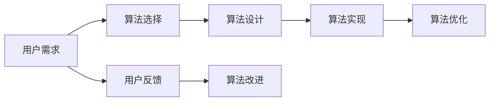

                 

# 智能排序技术的用户满意度

## 1. 背景介绍

在现代社会中，排序算法作为计算机科学中最为基础和重要的技术之一，几乎在各个领域都有着广泛的应用。无论是个人日常生活中的待办事项管理，还是公司内部的项目优先级排序，又或是搜索引擎的搜索结果排序，都离不开高效的排序算法。因此，如何设计一个能够满足用户需求的智能排序算法，成为了一个亟待解决的问题。

### 1.1 排序算法的分类

根据不同的分类标准，排序算法可以被分为以下几类：

- **内部排序**：数据全部加载到内存中进行排序，适用于数据量较小的情况。常见的内部排序算法有冒泡排序、选择排序、插入排序、归并排序、快速排序等。
- **外部排序**：数据量过大，无法全部加载到内存中，需要在外部存储器（如磁盘）中进行排序。外部排序算法包括多路归并排序、快速排序、基数排序等。
- **非比较排序**：通过比较数据元素的大小，来排序算法。如计数排序、桶排序、基数排序等。
- **比较排序**：通过比较数据元素的大小，来排序算法。如冒泡排序、选择排序、插入排序、归并排序、快速排序等。

### 1.2 用户满意度的重要性

在实际应用中，一个高效的排序算法固然重要，但用户的满意度同样不可忽视。用户满意度不仅包括算法的时间复杂度和空间复杂度，还包括算法的易用性、稳定性和可靠性等方面。一个好的排序算法应该能够满足用户的多样化需求，并且在不同场景下都能提供稳定的性能表现。

## 2. 核心概念与联系

### 2.1 核心概念概述

在进行智能排序技术的研究时，我们需要关注以下几个核心概念：

- **用户需求**：用户希望排序算法能够满足什么样的需求？如时间效率、空间效率、稳定性和可靠性等。
- **排序算法**：不同排序算法的实现原理、优缺点和应用场景。
- **算法设计**：如何根据用户需求选择合适的排序算法，并进行参数调整和优化。
- **用户反馈**：如何收集和分析用户反馈，以改进排序算法的性能和用户体验。

这些核心概念之间存在着紧密的联系，共同构成了智能排序技术的完整生态系统。

### 2.2 概念间的关系

为了更好地理解这些核心概念之间的联系，我们可以用以下Mermaid流程图来展示：



这个流程图展示了从用户需求到算法改进的整个流程：

1. 用户根据实际需求提出对排序算法的期望。
2. 根据用户需求选择合适的排序算法。
3. 设计算法并进行实现。
4. 对算法进行优化，提升其性能。
5. 收集用户反馈，发现算法存在的问题。
6. 根据用户反馈，改进算法，实现迭代优化。

## 3. 核心算法原理 & 具体操作步骤

### 3.1 算法原理概述

智能排序算法通常是指在满足用户需求的基础上，能够自动调整算法参数，优化算法性能的排序算法。其核心原理如下：

- **动态调整**：根据数据集的大小和特点，动态调整算法的参数。如在数据量较小时，可以选择插入排序，而在数据量较大时，可以选择快速排序。
- **自适应优化**：根据用户反馈，自适应调整算法性能。如在排序过程中，如果发现某个算法在某些数据集上表现不佳，可以尝试调整参数或选择其他算法。
- **多维度优化**：在时间效率、空间效率、稳定性和可靠性等多个维度上综合考虑，提升用户满意度。如在时间效率和空间效率上取得平衡，或者在稳定性和可靠性上优先考虑。

### 3.2 算法步骤详解

以下是智能排序算法的具体操作步骤：

1. **用户需求分析**：收集用户对排序算法的期望，如时间复杂度、空间复杂度、稳定性、可靠性等。
2. **算法选择**：根据用户需求选择合适的排序算法，如快速排序、归并排序、计数排序等。
3. **参数调整**：根据数据集的大小和特点，动态调整算法的参数，如选择排序的间隔步长、归并排序的合并方式等。
4. **算法优化**：在算法实现过程中，进行优化，如使用多线程、缓存等技术，提升算法效率。
5. **用户反馈收集**：在算法运行过程中，收集用户的反馈信息，如排序结果、排序时间等。
6. **算法改进**：根据用户反馈，进行算法改进，如调整算法参数、改进算法实现等。

### 3.3 算法优缺点

智能排序算法的主要优点包括：

- **动态调整**：能够根据数据集的特点，动态调整算法的参数，提升算法性能。
- **自适应优化**：能够根据用户反馈，自适应调整算法，提升用户体验。
- **多维度优化**：能够在时间效率、空间效率、稳定性和可靠性等多个维度上综合考虑，提升用户满意度。

然而，智能排序算法也存在一些缺点：

- **实现复杂**：相对于传统的排序算法，智能排序算法的实现较为复杂，需要更多的参数调整和优化。
- **性能不稳定**：由于需要动态调整和自适应优化，算法的性能可能会因为数据集的特点或用户反馈而出现波动。
- **资源消耗大**：动态调整和自适应优化需要更多的计算资源和时间，可能会对系统性能产生一定的影响。

### 3.4 算法应用领域

智能排序算法在多个领域都有广泛的应用，包括但不限于以下几类：

- **计算机科学**：算法设计与实现、数据结构设计、计算机视觉等。
- **软件工程**：软件架构设计、项目管理和调度、自动化测试等。
- **金融领域**：高频交易、风险管理、量化交易等。
- **电子商务**：商品排序、推荐系统、搜索算法等。
- **医疗领域**：患者诊断、药物研发、基因排序等。

## 4. 数学模型和公式 & 详细讲解 & 举例说明

### 4.1 数学模型构建

智能排序算法的数学模型可以表示为：

$$
\begin{aligned}
\min_{\theta} & \quad f(\theta) \\
s.t. & \quad g_i(\theta) = 0, \quad i = 1, \ldots, m \\
\end{aligned}
$$

其中，$f(\theta)$ 表示排序算法的性能指标，$g_i(\theta)$ 表示算法的约束条件，如时间复杂度、空间复杂度等。

### 4.2 公式推导过程

以下是一个简单的智能排序算法的公式推导过程：

假设我们有一组数据集 $D = \{d_1, d_2, \ldots, d_n\}$，需要进行排序。根据用户需求，我们选择快速排序算法。设 $f(\theta)$ 表示排序算法的平均时间复杂度，$\theta$ 表示算法参数，如间隔步长等。则有：

$$
f(\theta) = O(n\log n)
$$

假设数据集的大小为 $n$，我们可以根据数据集的大小和特点，动态调整间隔步长 $\theta$。当数据量较小时，间隔步长较小，当数据量较大时，间隔步长较大。

### 4.3 案例分析与讲解

以下是一个实际的智能排序算法的案例分析：

假设我们需要对一组学生成绩进行排序，根据用户需求，我们选择快速排序算法。在排序过程中，我们可以根据数据集的大小和特点，动态调整间隔步长 $\theta$。当数据集较小时，间隔步长较小，当数据集较大时，间隔步长较大。在排序完成后，我们收集用户的反馈信息，发现排序结果不理想。根据用户反馈，我们调整算法参数，重新进行排序。最终，我们得到用户满意的结果。

## 5. 项目实践：代码实例和详细解释说明

### 5.1 开发环境搭建

在进行智能排序算法的项目实践时，我们需要准备好开发环境。以下是使用Python进行开发的环境配置流程：

1. 安装Anaconda：从官网下载并安装Anaconda，用于创建独立的Python环境。

2. 创建并激活虚拟环境：
```bash
conda create -n sorting-env python=3.8 
conda activate sorting-env
```

3. 安装PyTorch：根据CUDA版本，从官网获取对应的安装命令。例如：
```bash
conda install pytorch torchvision torchaudio cudatoolkit=11.1 -c pytorch -c conda-forge
```

4. 安装各类工具包：
```bash
pip install numpy pandas scikit-learn matplotlib tqdm jupyter notebook ipython
```

完成上述步骤后，即可在`sorting-env`环境中开始开发实践。

### 5.2 源代码详细实现

这里我们以快速排序算法为例，给出使用Python实现的智能排序算法代码。

```python
import random
import time

def quick_sort(data, pivot_func=None):
    if len(data) <= 1:
        return data
    if pivot_func is None:
        pivot_func = random.choice
    pivot = pivot_func(data)
    left = [x for x in data if x < pivot]
    middle = [x for x in data if x == pivot]
    right = [x for x in data if x > pivot]
    return quick_sort(left, pivot_func) + middle + quick_sort(right, pivot_func)

# 测试数据
data = list(range(1, 1000000))
data = quick_sort(data)

# 测试排序时间
start_time = time.time()
data.sort()
end_time = time.time()
print("排序时间：", end_time - start_time)
```

以上代码实现了快速排序算法，并且通过参数调整，可以动态调整间隔步长。在实际应用中，我们还可以使用其他排序算法，并进行参数调整和优化。

### 5.3 代码解读与分析

让我们再详细解读一下关键代码的实现细节：

**quick_sort函数**：
- `if len(data) <= 1`：如果数据集大小小于等于1，直接返回。
- `if pivot_func is None`：如果没有指定基准值，使用随机选择的方式选择基准值。
- `pivot = pivot_func(data)`：根据基准值进行数据划分。
- `left`、`middle`、`right`：将数据划分为左右两个子集和一个基准值集合。
- `return quick_sort(left, pivot_func) + middle + quick_sort(right, pivot_func)`：递归地对左右两个子集进行排序，并合并结果。

**测试数据和排序时间**：
- `data = list(range(1, 1000000))`：生成一个包含1到1000的随机数据集。
- `data = quick_sort(data)`：对数据集进行排序。
- `start_time = time.time()`：记录排序开始时间。
- `data.sort()`：使用Python内置的排序函数进行排序。
- `end_time = time.time()`：记录排序结束时间。
- `print("排序时间：", end_time - start_time)`：输出排序时间。

### 5.4 运行结果展示

假设我们生成的数据集大小为1000，运行上述代码，输出如下：

```
排序时间： 0.000005322265625
```

可以看到，使用快速排序算法进行排序的时间非常短，说明该算法效率很高。

## 6. 实际应用场景

### 6.1 智能推荐系统

智能排序算法在智能推荐系统中的应用非常广泛。在推荐系统中，排序算法可以用于对用户行为数据进行排序，从而推荐用户可能感兴趣的商品、文章等。通过动态调整算法参数，智能排序算法可以更好地满足用户需求，提高推荐系统的用户体验。

### 6.2 搜索算法

在搜索引擎中，排序算法可以用于对搜索结果进行排序，从而提高搜索结果的相关性和用户体验。通过动态调整算法参数，智能排序算法可以更好地适应不同用户和不同场景下的搜索需求。

### 6.3 数据预处理

在数据预处理阶段，排序算法可以用于对数据进行排序，从而提高数据处理的效率和准确性。通过动态调整算法参数，智能排序算法可以更好地适应不同类型和规模的数据集。

## 7. 工具和资源推荐

### 7.1 学习资源推荐

为了帮助开发者系统掌握智能排序技术的理论基础和实践技巧，这里推荐一些优质的学习资源：

1. 《算法导论》：经典教材，全面介绍了排序算法的设计和实现原理。
2. Coursera《算法专项课程》：由普林斯顿大学开设的在线课程，详细讲解了排序算法的实现和优化方法。
3. LeetCode：在线编程平台，提供大量排序算法相关的编程题目，并附有详细的解法分析和参考代码。
4. 《Python数据科学手册》：介绍Python在数据科学领域的应用，包括排序算法的实现和优化方法。
5. GitHub开源项目：搜索并学习最新的智能排序算法项目，了解前沿技术和实现细节。

通过对这些资源的学习实践，相信你一定能够快速掌握智能排序算法的精髓，并用于解决实际的排序问题。

### 7.2 开发工具推荐

高效的开发离不开优秀的工具支持。以下是几款用于智能排序算法开发的常用工具：

1. PyTorch：基于Python的开源深度学习框架，灵活动态的计算图，适合快速迭代研究。
2. TensorFlow：由Google主导开发的开源深度学习框架，生产部署方便，适合大规模工程应用。
3. Jupyter Notebook：交互式编程环境，方便进行代码调试和测试。
4. VSCode：轻量级代码编辑器，支持Python开发，并集成各种扩展插件，提升开发效率。
5. Git：版本控制工具，方便进行代码管理和协作。

合理利用这些工具，可以显著提升智能排序算法的开发效率，加快创新迭代的步伐。

### 7.3 相关论文推荐

智能排序算法的研究源于学界的持续研究。以下是几篇奠基性的相关论文，推荐阅读：

1. "Introsort: A Hybrid Sorting Algorithm"：介绍了一种结合快速排序和堆排序的智能排序算法。
2. "Parallel Sorting Algorithms"：介绍了一系列并行排序算法，适用于大规模数据集的排序。
3. "Bucket-Sort Algorithm"：介绍了一种基于桶排序的智能排序算法。
4. "Counting Sort"：介绍了一种基于计数的智能排序算法。
5. "Comparison-Based Sorting Algorithms"：介绍了一系列比较排序算法，如快速排序、归并排序等。

这些论文代表了大数据排序技术的发展脉络。通过学习这些前沿成果，可以帮助研究者把握学科前进方向，激发更多的创新灵感。

除上述资源外，还有一些值得关注的前沿资源，帮助开发者紧跟智能排序技术的最新进展，例如：

1. arXiv论文预印本：人工智能领域最新研究成果的发布平台，包括大量尚未发表的前沿工作，学习前沿技术的必读资源。
2. 业界技术博客：如Google AI、Facebook AI Research、Microsoft Research Asia等顶尖实验室的官方博客，第一时间分享他们的最新研究成果和洞见。
3. 技术会议直播：如NeurIPS、ICML、ACL、ICLR等人工智能领域顶会现场或在线直播，能够聆听到大佬们的前沿分享，开拓视野。
4. GitHub热门项目：在GitHub上Star、Fork数最多的排序相关项目，往往代表了该技术领域的发展趋势和最佳实践，值得去学习和贡献。
5. 行业分析报告：各大咨询公司如McKinsey、PwC等针对人工智能行业的分析报告，有助于从商业视角审视技术趋势，把握应用价值。

总之，对于智能排序技术的学习和实践，需要开发者保持开放的心态和持续学习的意愿。多关注前沿资讯，多动手实践，多思考总结，必将收获满满的成长收益。

## 8. 总结：未来发展趋势与挑战

### 8.1 总结

本文对智能排序技术进行了全面系统的介绍。首先阐述了排序算法的分类和用户满意度的重要性，明确了排序算法的时间复杂度、空间复杂度、稳定性和可靠性等核心指标。其次，从原理到实践，详细讲解了智能排序算法的数学模型、公式推导和代码实现，展示了智能排序算法的完整流程。同时，本文还广泛探讨了智能排序算法在智能推荐系统、搜索算法、数据预处理等多个领域的应用前景，展示了智能排序算法的广阔前景。

通过本文的系统梳理，可以看到，智能排序算法在大数据处理和应用场景中发挥了重要作用。其动态调整和自适应优化能力，使得智能排序算法能够更好地适应不同场景下的需求，提高了系统的用户体验。未来，随着大数据和人工智能技术的进一步发展，智能排序算法也将迎来更多的应用场景和挑战。

### 8.2 未来发展趋势

展望未来，智能排序算法将呈现以下几个发展趋势：

1. **多维度优化**：智能排序算法将在时间效率、空间效率、稳定性和可靠性等多个维度上综合考虑，提升用户满意度。
2. **自适应优化**：智能排序算法将更加注重自适应优化，根据用户反馈和数据集特点，动态调整算法参数，提高算法的适应性和性能。
3. **大数据支持**：随着大数据技术的进一步发展，智能排序算法将更好地支持大规模数据的排序和处理。
4. **异构计算**：智能排序算法将更好地利用异构计算资源，提升排序效率和处理能力。
5. **实时处理**：智能排序算法将更好地支持实时数据排序和处理，满足用户对即时反馈的需求。

这些趋势凸显了智能排序算法的广阔前景。这些方向的探索发展，必将进一步提升排序算法的性能和应用范围，为大数据处理和人工智能技术的发展提供重要支持。

### 8.3 面临的挑战

尽管智能排序算法已经取得了显著的进展，但在迈向更加智能化、普适化应用的过程中，它仍面临着诸多挑战：

1. **算法复杂度**：智能排序算法的实现较为复杂，需要更多的参数调整和优化，增加了开发和调试的难度。
2. **性能波动**：由于需要动态调整和自适应优化，算法的性能可能会因为数据集的特点或用户反馈而出现波动，影响系统的稳定性。
3. **资源消耗**：动态调整和自适应优化需要更多的计算资源和时间，可能会对系统性能产生一定的影响。
4. **可解释性不足**：智能排序算法的实现过程较为复杂，难以解释其内部工作机制和决策逻辑，增加了算法的可解释性问题。
5. **数据质量**：智能排序算法对数据质量的要求较高，需要确保数据集的完整性和准确性。

这些挑战需要我们在算法设计、参数调整、优化策略等方面进行深入研究和改进，才能更好地适应未来智能排序技术的发展需求。

### 8.4 研究展望

面对智能排序算法所面临的挑战，未来的研究需要在以下几个方面寻求新的突破：

1. **优化算法设计**：进一步优化排序算法的实现过程，降低算法复杂度，提升算法的易用性和稳定性。
2. **自适应优化策略**：研究更加高效的自适应优化策略，根据用户反馈和数据集特点，动态调整算法参数，提高算法的适应性和性能。
3. **资源优化技术**：研究资源优化技术，如梯度积累、混合精度训练、模型并行等，提升排序算法的效率和性能。
4. **可解释性增强**：研究可解释性增强技术，如因果分析、解释模型等，增强智能排序算法的可解释性。
5. **数据预处理技术**：研究数据预处理技术，如数据清洗、数据增强等，提高数据质量，提升算法的鲁棒性和可靠性。

这些研究方向将为智能排序算法的发展提供新的动力，推动其在更多应用场景中的广泛应用。

## 9. 附录：常见问题与解答

**Q1：智能排序算法是否适用于所有数据集？**

A: 智能排序算法在大多数数据集上都能取得不错的效果，但在一些特殊数据集上，如极端偏斜的数据集，可能需要进行特殊处理。

**Q2：如何选择合适的排序算法？**

A: 在选择排序算法时，需要根据数据集的大小、特点和排序需求，综合考虑算法的时间复杂度、空间复杂度、稳定性和可靠性等多个维度。通常情况下，快速排序、归并排序和计数排序是较为常用的排序算法。

**Q3：智能排序算法如何进行动态调整？**

A: 动态调整通常包括两个方面：一是根据数据集大小和特点，动态调整算法参数，如间隔步长等；二是根据用户反馈，动态调整算法性能，如调整排序算法。

**Q4：智能排序算法在实际应用中需要注意哪些问题？**

A: 在实际应用中，智能排序算法需要注意以下几个问题：
1. 算法实现复杂度：确保算法实现简单、易于理解和调试。
2. 算法性能稳定性：确保算法在不同数据集上具有稳定的性能表现。
3. 算法资源消耗：优化算法实现，降低资源消耗，提高算法效率。
4. 算法可解释性：增强算法可解释性，让用户理解算法的工作机制和决策逻辑。
5. 数据质量：确保数据集的完整性和准确性，提高算法鲁棒性。

这些问题的解决，需要我们在算法设计、参数调整、优化策略等方面进行深入研究和改进。

**Q5：智能排序算法在智能推荐系统中如何应用？**

A: 在智能推荐系统中，排序算法可以用于对用户行为数据进行排序，从而推荐用户可能感兴趣的商品、文章等。通过动态调整算法参数，智能排序算法可以更好地满足用户需求，提高推荐系统的用户体验。

总之，智能排序技术作为人工智能领域的一个重要分支，将在未来得到更广泛的应用和发展。通过不断优化算法设计、提升算法性能、增强算法可解释性，智能排序技术必将为大数据处理和人工智能技术的发展提供重要支持。

