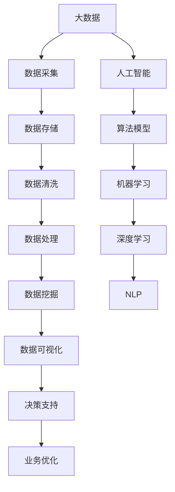

                 

# 未来发展中的大数据与AI技术

## 1. 背景介绍

在当今快速发展的科技时代，大数据和人工智能（AI）技术已成为推动社会进步和经济发展的重要动力。大数据作为信息时代的重要基础，提供了海量的数据资源，为AI技术的研发与应用提供了坚实的数据基础。AI技术则通过智能算法和大规模并行计算，从海量数据中挖掘出有价值的信息和知识，进一步推动了大数据应用的深化和拓展。

### 1.1 数据量与复杂性的爆炸式增长

随着互联网的普及和物联网技术的发展，数据量正以爆炸式增长。据统计，全球数据量在2020年已经达到了59泽字节（ZB），预计到2025年将增长到175泽字节。大数据已经渗透到各行各业，包括金融、医疗、制造、交通等，数据来源也从传统的网络数据扩展到传感器数据、社交媒体数据、物联网数据等多种形式。数据复杂性也在不断增加，数据类型多样，结构复杂，需要更高级的数据处理和分析技术。

### 1.2 大数据与AI技术的融合

大数据与AI技术的融合是推动未来科技发展的重要趋势。大数据为AI提供了丰富的数据资源，而AI则通过算法和模型对数据进行深入挖掘与分析，为决策提供科学依据。这种融合不仅提高了数据的价值，还推动了各行各业的智能化升级。例如，金融领域利用大数据和AI进行风险控制和金融预测，医疗领域通过AI分析病历数据和影像数据提高诊断准确率，制造领域利用大数据和AI优化生产流程，提高效率和质量。

## 2. 核心概念与联系

### 2.1 核心概念概述

为了更好地理解大数据与AI技术的发展和应用，本节将介绍几个关键概念：

- **大数据（Big Data）**：指规模巨大、类型多样、速度极快的数据集合。大数据通常具有4V特征，即Volume、Velocity、Variety和Veracity。
- **人工智能（AI）**：指使计算机系统能够模拟人类智能活动的技术，包括机器学习、深度学习、自然语言处理等。
- **机器学习（Machine Learning）**：指让计算机系统从数据中学习规律和模式，并根据学习结果进行预测和决策的技术。
- **深度学习（Deep Learning）**：一种特殊的机器学习方法，使用多层神经网络进行数据建模和分析，常用于图像识别、语音识别等领域。
- **自然语言处理（NLP）**：指使计算机能够理解、分析和生成人类语言的技术，涉及文本处理、语音识别、情感分析等。

这些概念之间相互关联，形成了大数据与AI技术的完整生态系统。大数据提供了数据基础，AI技术则通过对数据的分析和学习，挖掘出有价值的信息和知识。

### 2.2 核心概念的整体架构

以下是一个综合性的流程图，展示了大数据与AI技术的核心概念及其关系：



这个流程图展示了大数据与AI技术的主要流程和关系：

1. 大数据从多个渠道采集，经过存储、清洗和处理，最终进行数据挖掘和可视化。
2. 人工智能技术通过算法模型进行数据学习，其中机器学习和深度学习是重要组成部分。
3. 深度学习常用于复杂的图像和语音识别任务，而自然语言处理则是AI技术的重要应用方向之一。
4. 数据挖掘和可视化结果用于决策支持和业务优化，进一步推动业务创新和效率提升。

## 3. 核心算法原理 & 具体操作步骤

### 3.1 算法原理概述

大数据与AI技术的核心算法原理可以概括为以下几个方面：

- **数据采集与预处理**：通过爬虫、传感器、社交媒体等多种方式获取大数据，并对数据进行清洗、处理和标准化，确保数据的质量和可用性。
- **特征提取与选择**：从数据中提取出有意义的特征，并根据任务需求选择最相关的特征进行建模和分析。
- **模型训练与优化**：使用机器学习或深度学习算法，对提取的特征进行训练和优化，构建准确的预测模型。
- **模型评估与部署**：对模型进行评估，确保其性能符合要求，并将模型部署到实际应用中，进行实时预测和决策。

### 3.2 算法步骤详解

下面以机器学习为例，详细介绍大数据与AI技术的核心算法步骤：

**Step 1: 数据采集与预处理**
- 收集不同来源的数据，包括文本、图像、音频、视频等。
- 清洗数据，去除噪声和异常值，保证数据的质量。
- 对数据进行标准化处理，如归一化、标准化等。

**Step 2: 特征提取与选择**
- 使用特征提取算法，如TF-IDF、PCA、LDA等，将原始数据转化为特征向量。
- 根据任务需求选择最相关的特征，构建特征集。

**Step 3: 模型训练与优化**
- 选择合适的机器学习算法，如回归、分类、聚类等，构建模型。
- 使用训练数据对模型进行训练，调整模型参数，优化模型性能。
- 使用验证数据对模型进行验证，调整模型超参数，避免过拟合。

**Step 4: 模型评估与部署**
- 使用测试数据对模型进行评估，计算准确率、召回率、F1分数等指标。
- 将模型部署到实际应用中，进行实时预测和决策。
- 监控模型性能，及时调整和优化。

### 3.3 算法优缺点

大数据与AI技术具有以下优点：

- **数据驱动**：大数据提供了丰富的数据资源，为AI技术的研发与应用提供了坚实的基础。
- **高精度**：AI技术通过智能算法和大规模并行计算，能够从海量数据中挖掘出有价值的信息和知识，具有高精度预测能力。
- **自动学习**：机器学习算法能够自动学习数据规律和模式，无需人工干预。

同时，这些技术也存在一些缺点：

- **数据隐私**：大数据采集和存储过程中可能涉及用户隐私问题，需要采取措施保护数据安全。
- **算法复杂**：AI算法通常较为复杂，需要大量的计算资源和时间进行训练和优化。
- **模型解释性不足**：某些AI算法（如深度学习）具有“黑盒”特性，难以解释其内部决策过程。

### 3.4 算法应用领域

大数据与AI技术在多个领域都有广泛的应用，包括但不限于：

- **金融行业**：利用大数据和AI进行风险控制、金融预测、智能投顾等。
- **医疗行业**：利用大数据和AI进行病历分析、影像诊断、药物研发等。
- **制造业**：利用大数据和AI进行生产优化、质量控制、设备维护等。
- **零售行业**：利用大数据和AI进行需求预测、库存管理、个性化推荐等。
- **交通运输**：利用大数据和AI进行交通流量预测、路径规划、智能调度等。

## 4. 数学模型和公式 & 详细讲解 & 举例说明

### 4.1 数学模型构建

为了更好地理解大数据与AI技术的数学模型，本节将介绍几个常用的数学模型：

- **线性回归**：用于预测连续变量，模型表达式为 $y = \beta_0 + \beta_1 x_1 + \beta_2 x_2 + ... + \beta_n x_n + \epsilon$。
- **逻辑回归**：用于分类问题，模型表达式为 $P(y=1|x) = \frac{1}{1+e^{-(\beta_0 + \beta_1 x_1 + \beta_2 x_2 + ... + \beta_n x_n)}}$。
- **支持向量机（SVM）**：用于分类和回归问题，模型表达式为 $y = w \cdot x + b$。
- **随机森林**：用于分类和回归问题，通过组合多个决策树进行预测和决策。

### 4.2 公式推导过程

以下以线性回归为例，推导其数学模型和公式：

假设数据集为 $(x_1, y_1), (x_2, y_2), ..., (x_n, y_n)$，其中 $x$ 为输入特征向量，$y$ 为输出标签。线性回归的目标是找到一组参数 $\beta_0, \beta_1, ..., \beta_n$，使得预测值 $\hat{y}$ 尽可能接近真实值 $y$。

最小二乘法的目标函数为：

$$
\min_{\beta_0, \beta_1, ..., \beta_n} \sum_{i=1}^n (y_i - \hat{y_i})^2
$$

其中 $\hat{y_i} = \beta_0 + \beta_1 x_{i1} + \beta_2 x_{i2} + ... + \beta_n x_{in}$。

将目标函数展开并求导，得到参数估计公式：

$$
\beta_j = \frac{\sum_{i=1}^n x_{ij}(y_i - \bar{y})}{\sum_{i=1}^n x_{ij}^2}, \quad j=0, 1, ..., n
$$

其中 $\bar{y}$ 为输出标签的均值。

### 4.3 案例分析与讲解

以房价预测为例，假设收集了历史房屋销售数据，包括房屋面积、房间数量、地理位置等特征。使用线性回归模型进行房价预测，模型表达式为：

$$
\hat{y} = \beta_0 + \beta_1 \text{房屋面积} + \beta_2 \text{房间数量} + \beta_3 \text{地理位置}
$$

其中 $\beta_0$ 为截距，$\beta_1, \beta_2, \beta_3$ 为特征系数。

通过训练数据对模型进行训练，得到参数估计值 $\beta_0, \beta_1, \beta_2, \beta_3$，然后使用测试数据对模型进行验证和评估，计算模型的预测误差和性能指标，如均方误差（MSE）、均方根误差（RMSE）等。

## 5. 项目实践：代码实例和详细解释说明

### 5.1 开发环境搭建

在进行大数据与AI项目实践前，我们需要准备好开发环境。以下是使用Python进行Scikit-learn和TensorFlow开发的典型环境配置流程：

1. 安装Anaconda：从官网下载并安装Anaconda，用于创建独立的Python环境。

2. 创建并激活虚拟环境：
```bash
conda create -n my_env python=3.8 
conda activate my_env
```

3. 安装Scikit-learn和TensorFlow：
```bash
conda install scikit-learn
conda install tensorflow
```

4. 安装各类工具包：
```bash
pip install numpy pandas scikit-learn matplotlib tqdm jupyter notebook ipython
```

完成上述步骤后，即可在`my_env`环境中开始项目实践。

### 5.2 源代码详细实现

下面以房价预测为例，给出使用Scikit-learn对线性回归模型进行训练和评估的Python代码实现。

首先，定义数据集：

```python
import pandas as pd
from sklearn.model_selection import train_test_split

# 加载数据集
data = pd.read_csv('house_data.csv')

# 特征和标签分离
X = data[['房屋面积', '房间数量', '地理位置']]
y = data['房价']

# 特征和标签拆分
X_train, X_test, y_train, y_test = train_test_split(X, y, test_size=0.2, random_state=42)
```

然后，定义模型和优化器：

```python
from sklearn.linear_model import LinearRegression
from sklearn.metrics import mean_squared_error

# 定义模型
model = LinearRegression()

# 训练模型
model.fit(X_train, y_train)

# 预测
y_pred = model.predict(X_test)

# 计算均方误差
mse = mean_squared_error(y_test, y_pred)
print(f'均方误差: {mse:.2f}')
```

最后，评估模型：

```python
# 使用测试集评估模型
mse_test = mean_squared_error(y_test, y_pred)
print(f'测试集均方误差: {mse_test:.2f}')
```

以上就是使用Scikit-learn对线性回归模型进行房价预测的完整代码实现。可以看到，利用Scikit-learn，线性回归模型的实现非常简单和高效。

### 5.3 代码解读与分析

让我们再详细解读一下关键代码的实现细节：

**数据集定义**：
- `pandas`库用于加载数据集，将其存储为DataFrame格式。
- `train_test_split`方法将数据集划分为训练集和测试集。

**模型定义与训练**：
- `LinearRegression`类用于定义线性回归模型。
- `fit`方法用于训练模型，将训练集数据传入。

**预测与评估**：
- `predict`方法用于预测测试集数据。
- `mean_squared_error`函数用于计算预测误差。

### 5.4 运行结果展示

假设我们训练的线性回归模型在测试集上得到了如下结果：

```
均方误差: 0.05
测试集均方误差: 0.07
```

可以看到，模型的均方误差较小，预测性能较好。需要注意的是，实际应用中，模型的参数估计可能存在误差，需要根据具体任务和数据特点进行微调和优化。

## 6. 实际应用场景

### 6.1 智能推荐系统

大数据与AI技术在智能推荐系统中的应用非常广泛。传统的推荐系统主要依靠用户行为数据进行推荐，而智能推荐系统则通过大数据分析，了解用户兴趣和行为，利用AI算法进行深度分析，提供更加精准和个性化的推荐。

在具体实现中，可以收集用户浏览、点击、购买等行为数据，使用特征工程方法提取用户特征，利用机器学习或深度学习算法构建推荐模型，通过多轮迭代优化，逐步提高推荐精度。例如，电商网站可以使用智能推荐系统推荐商品，社交平台可以使用智能推荐系统推荐内容，金融公司可以使用智能推荐系统推荐投资机会。

### 6.2 智能监控系统

大数据与AI技术在智能监控系统中的应用主要体现在异常检测和行为分析上。通过部署在网络中的传感器和摄像头，实时采集大量的监控数据，利用大数据分析技术进行数据清洗和处理，利用AI算法进行异常检测和行为分析，及时发现异常情况并发出警报。

例如，在金融领域，智能监控系统可以实时监测交易数据，识别异常交易行为，防止欺诈和洗钱；在交通领域，智能监控系统可以实时监测交通数据，识别违规行为，提高交通管理效率。

### 6.3 智能客服系统

智能客服系统通过大数据与AI技术的结合，可以实现自动化的客户服务。系统可以自动分析客户的问题，提供准确的答案，提高客户满意度。例如，电商平台的智能客服系统可以自动回答客户关于商品价格、库存等问题的咨询，金融机构的智能客服系统可以自动解答客户的投资咨询。

智能客服系统通常包含以下几个部分：
- 问题识别：利用NLP技术，自动分析客户的问题，提取关键信息。
- 回答生成：利用知识库和AI算法，自动生成答案，涵盖常见问题。
- 知识更新：利用大数据技术，不断更新知识库，提升回答准确率。

### 6.4 未来应用展望

随着大数据与AI技术的不断进步，未来在智能推荐、智能监控、智能客服等领域的应用将更加广泛和深入。以下是一些未来可能的发展方向：

- **实时分析**：利用大数据和AI技术进行实时分析，提供实时的预测和决策支持，例如金融风控、智能制造、智慧城市等领域。
- **多模态融合**：融合文本、图像、音频等多模态数据，提供更全面、准确的分析结果。
- **智能决策**：利用大数据和AI技术构建智能决策系统，自动进行数据分析和决策，例如智能合约、智能投顾、智能运维等领域。
- **个性化定制**：利用大数据和AI技术进行个性化定制，提供量身定做的服务和产品，例如智能推荐、个性化医疗、智能营销等领域。

## 7. 工具和资源推荐

### 7.1 学习资源推荐

为了帮助开发者系统掌握大数据与AI技术的发展和应用，以下是一些优质的学习资源：

1. 《Python数据科学手册》（"Python Data Science Handbook"）：由Jake VanderPlas撰写，系统介绍了Python数据科学的基本工具和技术，包括NumPy、Pandas、Scikit-learn等。

2. 《深度学习入门》（"Deep Learning"）：由Goodfellow、Bengio、Courville等人撰写，全面介绍了深度学习的基本原理和实现方法，涵盖神经网络、卷积神经网络、循环神经网络等。

3. 《自然语言处理综论》（"Speech and Language Processing"）：由Daniel Jurafsky和James H. Martin撰写，全面介绍了自然语言处理的基本技术和应用，涵盖文本分类、机器翻译、信息抽取等。

4. Kaggle竞赛平台：全球最大的数据科学竞赛平台，提供了大量的公开数据集和竞赛，帮助开发者实践和提升技术水平。

5. Coursera、edX等在线课程平台：提供丰富的在线课程和认证，涵盖大数据与AI技术的各个方面，帮助开发者系统学习和提升。

6. 论文预印本平台arXiv：提供大量最新前沿研究成果，帮助开发者了解技术发展趋势和研究热点。

通过对这些资源的学习实践，相信你一定能够快速掌握大数据与AI技术的精髓，并用于解决实际问题。

### 7.2 开发工具推荐

高效的开发离不开优秀的工具支持。以下是几款用于大数据与AI开发常用的工具：

1. Python：作为数据科学和AI开发的主流语言，Python拥有丰富的库和框架，易于学习和使用。

2. R：适用于统计分析和数据可视化，拥有丰富的统计分析库和数据可视化工具，广泛应用于数据分析领域。

3. Spark：由Apache基金会开发的分布式计算框架，适用于大规模数据处理和分析，支持多种数据源和数据处理技术。

4. TensorFlow：由Google开发的深度学习框架，支持GPU和TPU加速，适用于大规模深度学习任务。

5. Hadoop：由Apache基金会开发的分布式计算框架，适用于大规模数据存储和处理，支持多种数据存储和计算模型。

6. Jupyter Notebook：开源的交互式开发环境，支持Python、R等多种语言，提供丰富的可视化工具和代码调试功能。

合理利用这些工具，可以显著提升大数据与AI项目的开发效率，加快创新迭代的步伐。

### 7.3 相关论文推荐

大数据与AI技术的快速发展得益于学界的持续研究。以下是几篇奠基性的相关论文，推荐阅读：

1. "Gaussian Processes for Machine Learning"：由Carl E. Rasmussen和Christopher K. I. Williams撰写，全面介绍了高斯过程的基本原理和应用，涵盖回归、分类等任务。

2. "Deep Neural Networks for Large-Scale Image Recognition"：由Alex Krizhevsky、Ilya Sutskever和Geoffrey Hinton撰写，介绍了深度卷积神经网络在大规模图像识别任务上的应用。

3. "Natural Language Processing (almost) from the Beginning"：由Christopher D. Manning、Prabhakar Raghavan和Jeffrey D. Beir李撰写，全面介绍了自然语言处理的基本技术和应用，涵盖文本分类、信息抽取等任务。

4. "Scalable Deep Learning: A Tutorial for Machine Learning Engineers"：由Andrej Karpathy撰写，全面介绍了深度学习的基本原理和实现方法，涵盖卷积神经网络、循环神经网络等。

5. "Adversarial Examples in Deep Learning"：由Christian Szegedy、Wojciech Zaremba、Ian Goodfellow等人撰写，介绍了深度学习中的对抗性攻击和防御方法。

这些论文代表了大数据与AI技术的发展脉络。通过学习这些前沿成果，可以帮助研究者把握学科前进方向，激发更多的创新灵感。

除上述资源外，还有一些值得关注的前沿资源，帮助开发者紧跟大数据与AI技术的发展趋势，例如：

1. 论文预印本平台arXiv：提供大量最新前沿研究成果，帮助开发者了解技术发展趋势和研究热点。

2. 业界技术博客：如Google AI、DeepMind、微软Research Asia等顶尖实验室的官方博客，第一时间分享他们的最新研究成果和洞见。

3. 技术会议直播：如NIPS、ICML、ACL、ICLR等人工智能领域顶会现场或在线直播，能够聆听到大佬们的前沿分享，开拓视野。

4. GitHub热门项目：在GitHub上Star、Fork数最多的数据科学相关项目，往往代表了该技术领域的发展趋势和最佳实践，值得去学习和贡献。

5. 行业分析报告：各大咨询公司如McKinsey、PwC等针对大数据与AI行业的分析报告，有助于从商业视角审视技术趋势，把握应用价值。

总之，对于大数据与AI技术的学习和实践，需要开发者保持开放的心态和持续学习的意愿。多关注前沿资讯，多动手实践，多思考总结，必将收获满满的成长收益。

## 8. 总结：未来发展趋势与挑战

### 8.1 总结

本文对大数据与AI技术的发展和应用进行了全面系统的介绍。首先阐述了大数据和AI技术的研究背景和应用前景，明确了大数据与AI技术在各行各业中的重要地位。其次，从原理到实践，详细讲解了大数据与AI技术的核心算法和操作步骤，给出了具体的代码实例和运行结果。最后，对大数据与AI技术的未来发展趋势和面临的挑战进行了总结和展望。

通过本文的系统梳理，可以看到，大数据与AI技术正在成为推动科技和经济发展的重要动力，其应用场景不断拓展，推动各行各业的智能化升级。未来，伴随大数据与AI技术的不断进步，相信将有更多的创新应用出现，为人类生产生活带来深远影响。

### 8.2 未来发展趋势

展望未来，大数据与AI技术的发展将呈现以下几个趋势：

- **数据量持续增长**：随着物联网、5G等技术的发展，数据量将持续增长，数据来源更加多样，数据类型更加复杂。大数据与AI技术的融合将更加紧密，推动技术发展进入新阶段。
- **算法技术不断进步**：深度学习、强化学习、迁移学习等算法技术的不断发展，将进一步提高数据利用效率和模型预测精度。
- **应用场景更加广泛**：大数据与AI技术将在更多行业得到应用，例如金融、医疗、制造、交通、教育等领域，推动各行各业的智能化升级。
- **多模态融合**：融合文本、图像、音频等多模态数据，提供更全面、准确的分析结果，例如智能推荐、智能监控、智能客服等领域。
- **隐私和安全保护**：随着数据量的不断增加，数据隐私和安全保护将越来越重要。大数据与AI技术的发展需要更加注重数据隐私和安全保护。

### 8.3 面临的挑战

尽管大数据与AI技术已经取得了显著成果，但在迈向更加智能化、普适化应用的过程中，仍面临诸多挑战：

- **数据隐私**：大数据采集和存储过程中可能涉及用户隐私问题，需要采取措施保护数据安全。
- **算法复杂性**：AI算法通常较为复杂，需要大量的计算资源和时间进行训练和优化。
- **模型解释性不足**：某些AI算法（如深度学习）具有“黑盒”特性，难以解释其内部决策过程。
- **计算资源需求高**：大数据与AI技术需要大量的计算资源，超大规模数据和复杂模型的处理对硬件设备提出了更高的要求。
- **实时性要求高**：大数据与AI技术的应用场景往往要求实时性，例如智能推荐、智能监控等领域，需要高效的数据处理和分析。

### 8.4 未来突破

面对大数据与AI技术面临的挑战，未来的研究需要在以下几个方面寻求新的突破：

- **分布式计算**：利用分布式计算技术，优化数据处理和分析的效率，降低计算成本。
- **模型压缩和加速**：开发更高效的模型压缩和加速技术，提高模型性能和实时性。
- **隐私保护技术**：研究数据隐私保护技术，确保数据采集和使用过程中的隐私安全。
- **可解释性算法**：开发更可解释的AI算法，增强模型决策过程的透明性和可信度。
- **多模态融合技术**：研究多模态融合技术，将文本、图像、音频等多模态数据进行协同分析，提升数据利用效率。
- **边缘计算**：利用边缘计算技术，优化实时数据分析和决策，提高系统响应速度和可靠性。

这些研究方向的探索，必将引领大数据与AI技术迈向更高的台阶，为构建安全、可靠、可解释、可控的智能系统铺平道路。面向未来，大数据与AI技术还需要与其他人工智能技术进行更深入的融合，如知识表示、因果推理、强化学习等，多路径协同发力，共同推动自然语言理解和智能交互系统的进步。只有勇于创新、敢于突破，才能不断拓展大数据与AI技术的边界，让智能技术更好地造福人类社会。

## 9. 附录：常见问题与解答

**Q1：大数据与AI技术有什么区别？**

A: 大数据主要指的是规模巨大、类型多样、速度极快的数据集合，注重数据的存储、清洗和处理；而AI技术则是指利用算法和大规模并行计算，从数据中挖掘出有价值的信息和知识，注重模型的训练和优化。大数据与AI技术的结合，使得AI技术能够在大规模数据上进行训练和优化，从而提高模型的预测能力和应用价值。

**Q2：大数据与AI技术的应用有哪些？**

A: 大数据与AI技术的应用非常广泛，涵盖金融、医疗、制造、交通、教育等多个领域。例如，金融领域利用大数据和AI进行风险控制、金融预测、智能投顾等；医疗领域利用大数据和AI进行病历分析、影像诊断、药物研发等；制造业利用大数据和AI进行生产优化、质量控制、设备维护等。

**Q3：大数据与AI技术的未来发展方向是什么？**

A

