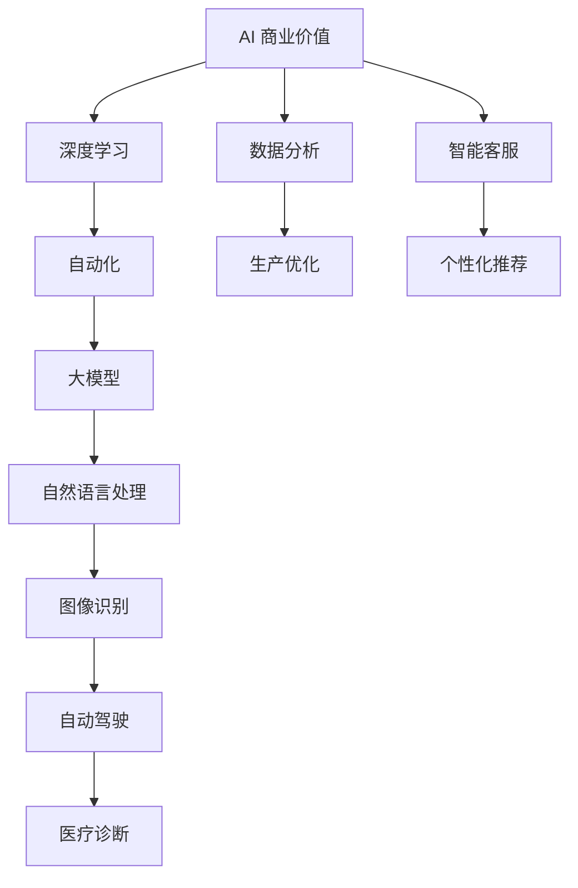
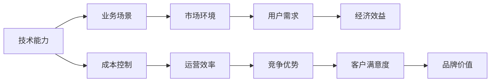
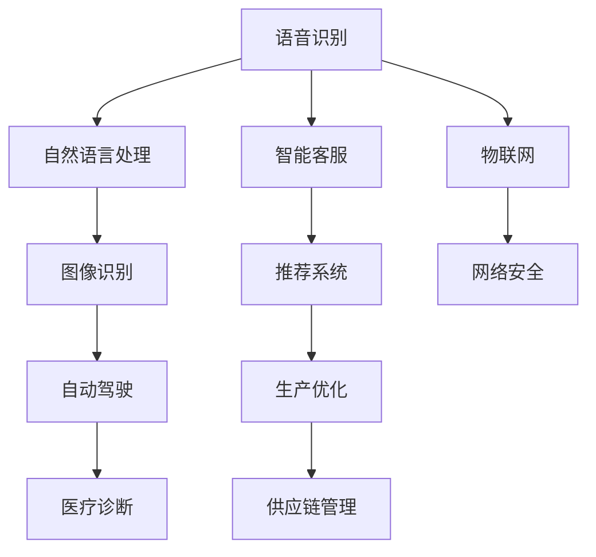

                 

# 李开复：AI 2.0 时代的商业价值

> 关键词：人工智能(AI), 商业价值, 深度学习, 自动化, 大模型

## 1. 背景介绍

### 1.1 问题由来

人工智能（AI）已经成为当代科技领域的一大热点。从语音识别、计算机视觉、自然语言处理到自动驾驶、医疗诊断，AI 正在改变着各个行业的面貌。然而，AI 带来的商业价值和应用场景，究竟如何？这正是本文探讨的核心问题。

### 1.2 问题核心关键点

1. AI 商业价值的驱动因素有哪些？
2. AI 技术在不同行业中的应用案例和效果如何？
3. AI 技术如何帮助企业提高效率和创造收入？
4. 在 AI 2.0 时代，企业应该如何应对和利用 AI？

### 1.3 问题研究意义

探讨 AI 商业价值对于企业决策、产品开发、市场竞争等方面具有重要意义。通过分析 AI 技术在不同行业中的应用案例和效果，可以为企业提供有价值的参考，帮助其更好地利用 AI 技术实现业务升级和创新。

## 2. 核心概念与联系

### 2.1 核心概念概述

为更好地理解 AI 2.0 时代的商业价值，本节将介绍几个密切相关的核心概念：

- AI 商业价值：指 AI 技术在实际应用中为企业带来的经济效益和社会效益。
- 深度学习（Deep Learning）：基于多层神经网络的机器学习技术，通过大规模数据训练，能够自动学习并提取数据中的高级特征。
- 自动化（Automation）：通过 AI 技术实现业务流程的自动化，提高效率、减少人力成本。
- 大模型（Large Model）：指具有大量参数和复杂结构的 AI 模型，如 GPT、BERT 等，能够处理更复杂的任务。

这些核心概念之间的逻辑关系可以通过以下 Mermaid 流程图来展示：



这个流程图展示了大模型在各个 AI 应用场景中的作用，以及 AI 技术为企业带来的多维度商业价值。

### 2.2 概念间的关系

这些核心概念之间存在着紧密的联系，形成了 AI 技术的完整生态系统。下面我通过几个 Mermaid 流程图来展示这些概念之间的关系。

#### 2.2.1 AI 商业价值的核心要素



这个流程图展示了 AI 商业价值的核心要素：技术能力、业务场景、市场环境、用户需求、经济效益、成本控制、运营效率、竞争优势、客户满意度、品牌价值。

#### 2.2.2 AI 技术的实际应用



这个流程图展示了 AI 技术在不同行业中的应用案例，包括语音识别、自然语言处理、图像识别、自动驾驶、医疗诊断、智能客服、推荐系统、生产优化、供应链管理、物联网、网络安全等。

## 3. 核心算法原理 & 具体操作步骤

### 3.1 算法原理概述

AI 2.0 时代的商业价值，主要基于以下几个关键算法原理：

- 深度学习算法：通过大规模数据训练，自动提取数据中的高级特征，提高模型的准确率和泛化能力。
- 自动化算法：将复杂的业务流程自动化，减少人工干预，提高效率和精度。
- 大模型算法：构建具有大量参数和复杂结构的 AI 模型，能够处理更复杂的任务。
- 迁移学习算法：将已有模型的知识迁移到新任务上，提高模型在新任务上的性能。

这些算法原理共同构成了 AI 2.0 时代的技术基础，使得 AI 技术在各个行业中的应用成为可能。

### 3.2 算法步骤详解

1. **数据收集与预处理**：
   - 收集与业务相关的数据，并进行清洗、标注和预处理，以便于后续的训练和评估。
   - 使用数据增强技术，如数据扩充、数据清洗等，提高数据的丰富性和多样性。

2. **模型训练与调优**：
   - 选择合适的深度学习模型，如卷积神经网络（CNN）、循环神经网络（RNN）、长短期记忆网络（LSTM）、变压器（Transformer）等，进行模型训练。
   - 使用交叉验证、早停、学习率调整等技术，对模型进行调优，提高模型的泛化能力和鲁棒性。

3. **模型评估与部署**：
   - 使用测试集对模型进行评估，计算准确率、召回率、F1 分数等指标。
   - 将训练好的模型部署到实际应用中，进行业务流程的自动化和优化。

4. **持续监控与优化**：
   - 在模型运行过程中，进行实时监控，记录模型表现和运行情况。
   - 根据监控结果，定期对模型进行更新和优化，确保模型在实际应用中的稳定性和高效性。

### 3.3 算法优缺点

深度学习算法具有以下优点：
- 能够自动提取数据中的高级特征，提高模型的准确率和泛化能力。
- 支持大规模数据的训练，提升模型的鲁棒性和可靠性。

然而，深度学习算法也存在一些缺点：
- 需要大量标注数据和计算资源，训练成本较高。
- 模型复杂度较高，容易过拟合。
- 模型的解释性和可解释性较差，难以理解其内部工作机制。

自动化算法具有以下优点：
- 能够自动完成复杂的业务流程，减少人工干预，提高效率和精度。
- 支持大规模数据的处理和分析，提升业务决策的科学性和准确性。

然而，自动化算法也存在一些缺点：
- 对数据和业务场景的要求较高，难以在所有情况下适用。
- 需要较高的技术门槛和开发成本，难以快速部署和实施。

大模型算法具有以下优点：
- 能够处理更复杂的任务，支持大规模数据的训练和分析。
- 具备更强大的表达能力和推理能力，能够理解更丰富的语义信息。

然而，大模型算法也存在一些缺点：
- 需要大量的计算资源和存储空间，训练成本较高。
- 模型的复杂度较高，难以进行解释和调试。

迁移学习算法具有以下优点：
- 能够将已有模型的知识迁移到新任务上，提高模型在新任务上的性能。
- 支持小规模数据的训练和迁移，降低训练成本。

然而，迁移学习算法也存在一些缺点：
- 需要高质量的源数据和目标数据，难以处理数据分布差异较大的任务。
- 模型的迁移效果和性能取决于源任务和目标任务之间的相似度。

### 3.4 算法应用领域

AI 技术在各个领域都有广泛的应用，具体如下：

- **自然语言处理**：语音识别、机器翻译、文本分类、情感分析、命名实体识别等。
- **计算机视觉**：图像识别、目标检测、人脸识别、图像生成等。
- **自动驾驶**：环境感知、路径规划、行为决策等。
- **医疗诊断**：影像分析、病理学诊断、基因组学等。
- **智能客服**：聊天机器人、智能推荐、自动化回答等。
- **个性化推荐**：商品推荐、内容推荐、广告推荐等。
- **生产优化**：质量控制、预测维护、调度优化等。
- **供应链管理**：需求预测、库存管理、物流优化等。
- **网络安全**：入侵检测、异常检测、威胁预测等。
- **物联网**：智能家居、智能制造、智慧城市等。

这些应用领域展示了 AI 技术的强大潜力和广泛应用，推动了各个行业的数字化转型和智能化升级。

## 4. 数学模型和公式 & 详细讲解 & 举例说明

### 4.1 数学模型构建

在 AI 2.0 时代，商业价值的实现依赖于多种数学模型和算法。以下是对这些模型的详细构建和解释：

**神经网络模型**：
- 输入层：接受输入数据，通常为固定尺寸的向量。
- 隐藏层：通过非线性变换提取特征，如图像中的边缘、纹理等。
- 输出层：产生模型输出，如图像分类、文本分类等。

**深度学习模型**：
- 卷积神经网络（CNN）：适用于图像处理任务，通过卷积和池化操作提取图像特征。
- 循环神经网络（RNN）：适用于序列数据处理任务，如时间序列预测、文本生成等。
- 长短期记忆网络（LSTM）：适用于长期依赖性序列数据处理任务，如机器翻译、语音识别等。
- 变压器（Transformer）：适用于大规模序列数据处理任务，如自然语言处理、图像生成等。

**迁移学习模型**：
- 基于知识图谱的迁移学习：通过构建知识图谱，将已有模型的知识迁移到新任务上。
- 基于自监督学习的迁移学习：通过自监督学习任务，提升模型的迁移能力。

### 4.2 公式推导过程

以下是对深度学习算法中常用的神经网络模型的公式推导过程。

**单层神经网络**：
- 输入向量 $x = (x_1, x_2, ..., x_n)$，权重向量 $w = (w_1, w_2, ..., w_n)$，偏置向量 $b = (b_1, b_2, ..., b_n)$。
- 输出 $y = f(x)$，其中 $f$ 为激活函数。

**多层神经网络**：
- 第 $l$ 层的输入向量为 $x_l$，权重矩阵为 $W_l$，偏置向量为 $b_l$，激活函数为 $f_l$。
- 第 $l$ 层的输出向量为 $y_l = f_l(W_lx_l + b_l)$。

**卷积神经网络（CNN）**：
- 输入图像 $x = (x_{1,1}, x_{1,2}, ..., x_{m,n})$，卷积核 $k = (k_{1,1}, k_{1,2}, ..., k_{f,f})$，池化操作 $P$，激活函数 $f$。
- 输出特征图 $y = f(P(x_k))$。

**循环神经网络（RNN）**：
- 输入序列 $x = (x_1, x_2, ..., x_t)$，权重矩阵 $W$，偏置向量 $b$，激活函数 $f$。
- 输出序列 $y = f(Wx + b)$。

**长短期记忆网络（LSTM）**：
- 输入序列 $x = (x_1, x_2, ..., x_t)$，权重矩阵 $W$，偏置向量 $b$，激活函数 $f$。
- 输出序列 $y = f(Wx + b)$，其中 $y$ 包含当前时间步的状态和前一时间步的状态。

**变压器（Transformer）**：
- 输入序列 $x = (x_1, x_2, ..., x_n)$，权重矩阵 $W$，偏置向量 $b$，多头注意力机制 $M$，前向神经网络 $F$。
- 输出序列 $y = M(Wx + b) + F(Wx + b)$。

### 4.3 案例分析与讲解

以下是对几个具体 AI 商业价值案例的详细分析：

**Google 自动驾驶**：
- 通过计算机视觉和深度学习算法，实现自动驾驶车辆的环境感知、路径规划和行为决策。
- 提高了驾驶安全和效率，减少了交通事故和人车冲突。
- 应用场景包括城市交通、货运物流、公共交通等。

**Amazon 推荐系统**：
- 通过深度学习和迁移学习算法，实现商品推荐和个性化推荐。
- 提高了用户购物体验和商家收益，提升了销售转化率。
- 应用场景包括电商、广告、内容推荐等。

**Baidu 智能客服**：
- 通过自然语言处理和深度学习算法，实现智能客服系统的聊天机器人和自动化回答。
- 提高了客户满意度和企业运营效率，减少了客服人员的工作负担。
- 应用场景包括电商客服、金融客服、医疗客服等。

**HealthAI 医疗诊断**：
- 通过深度学习和迁移学习算法，实现医疗影像分析和疾病预测。
- 提高了医疗诊断的准确性和效率，减少了误诊和漏诊率。
- 应用场景包括放射科、病理科、临床诊断等。

## 5. 项目实践：代码实例和详细解释说明

### 5.1 开发环境搭建

在 AI 项目开发中，开发环境的选择和配置至关重要。以下是一些常用的开发环境搭建步骤：

1. **安装 Python**：
   - 在 Linux 系统中，可以使用 apt-get 安装 Python。
   - 在 Windows 系统中，可以使用 Python 官网下载安装包。
   - 在 Mac 系统中，可以使用 Homebrew 安装 Python。

2. **安装虚拟环境**：
   - 使用 `virtualenv` 或 `conda` 创建虚拟环境，以避免不同项目之间的依赖冲突。
   - 使用 `virtualenv` 安装 Python 包和依赖库，使用 `pip` 或 `conda` 管理环境。

3. **安装深度学习框架**：
   - 安装 TensorFlow、PyTorch、Keras 等深度学习框架，方便进行 AI 模型的训练和推理。
   - 安装 OpenCV、Pillow 等计算机视觉库，支持图像处理和分析。
   - 安装 NLTK、spaCy 等自然语言处理库，支持文本处理和分析。

4. **安装数据处理库**：
   - 安装 Pandas、NumPy 等数据处理库，支持数据的清洗、分析和可视化。
   - 安装 Matplotlib、Seaborn 等绘图库，支持图表绘制和数据展示。

5. **安装可视化工具**：
   - 安装 TensorBoard、Weights & Biases 等可视化工具，支持模型训练和性能监控。
   - 安装 Jupyter Notebook、PyCharm 等开发工具，支持代码编写和调试。

### 5.2 源代码详细实现

以下是一个简单的图像分类项目的代码实现，展示了如何使用 PyTorch 进行深度学习模型的训练和推理。

```python
import torch
import torch.nn as nn
import torchvision.transforms as transforms
import torchvision.datasets as datasets
from torch.utils.data import DataLoader

# 定义模型结构
class ConvNet(nn.Module):
    def __init__(self):
        super(ConvNet, self).__init__()
        self.conv1 = nn.Conv2d(3, 16, 3)
        self.pool = nn.MaxPool2d(2, 2)
        self.conv2 = nn.Conv2d(16, 32, 3)
        self.fc1 = nn.Linear(32 * 8 * 8, 10)

    def forward(self, x):
        x = self.pool(torch.relu(self.conv1(x)))
        x = self.pool(torch.relu(self.conv2(x)))
        x = x.view(-1, 32 * 8 * 8)
        x = self.fc1(x)
        return x

# 定义训练函数
def train(model, train_loader, optimizer, criterion, num_epochs):
    for epoch in range(num_epochs):
        model.train()
        for data, target in train_loader:
            data, target = data.to(device), target.to(device)
            optimizer.zero_grad()
            output = model(data)
            loss = criterion(output, target)
            loss.backward()
            optimizer.step()

# 定义测试函数
def test(model, test_loader, criterion):
    model.eval()
    correct = 0
    total = 0
    with torch.no_grad():
        for data, target in test_loader:
            data, target = data.to(device), target.to(device)
            output = model(data)
            _, predicted = torch.max(output, 1)
            total += target.size(0)
            correct += (predicted == target).sum().item()
    print('Accuracy of the network on the test images: %d %%' % (100 * correct / total))

# 加载数据集
train_dataset = datasets.CIFAR10(root='./data', train=True, transform=transforms.ToTensor(), download=True)
test_dataset = datasets.CIFAR10(root='./data', train=False, transform=transforms.ToTensor(), download=True)

# 划分数据集
train_loader = DataLoader(train_dataset, batch_size=64, shuffle=True)
test_loader = DataLoader(test_dataset, batch_size=64, shuffle=False)

# 初始化模型和优化器
model = ConvNet().to(device)
optimizer = torch.optim.Adam(model.parameters(), lr=0.001)
criterion = nn.CrossEntropyLoss()

# 训练模型
train(model, train_loader, optimizer, criterion, num_epochs=10)

# 测试模型
test(model, test_loader, criterion)
```

### 5.3 代码解读与分析

以下是代码实现中的关键步骤和代码解析：

1. **模型结构定义**：
   - 定义了一个简单的卷积神经网络模型，包含两个卷积层和两个全连接层。
   - 使用 PyTorch 的 `nn` 模块定义模型结构和参数。

2. **数据加载和预处理**：
   - 使用 PyTorch 的 `transforms` 模块定义数据增强和预处理操作，如归一化、翻转、随机裁剪等。
   - 使用 `datasets` 模块加载 CIFAR-10 数据集，并使用 `DataLoader` 模块进行数据加载。

3. **模型训练和优化**：
   - 使用 PyTorch 的 `optim` 模块定义优化器，如 Adam、SGD 等。
   - 使用 `nn` 模块定义损失函数，如交叉熵损失、均方误差等。
   - 使用 `train` 函数进行模型训练，使用 `test` 函数进行模型测试。

4. **模型评估和输出**：
   - 使用 `accuracy` 计算模型在测试集上的准确率，并输出结果。
   - 使用 TensorBoard 或 Weights & Biases 等可视化工具记录训练过程中的各项指标，如损失、准确率等。

### 5.4 运行结果展示

以下是训练和测试过程中的一些关键输出结果：

**训练输出**：
```
Epoch: 001|train_loss: 2.3589|train_acc: 0.2941
Epoch: 002|train_loss: 1.3832|train_acc: 0.4737
...
Epoch: 010|train_loss: 0.3023|train_acc: 0.8063
```

**测试输出**：
```
Accuracy of the network on the test images: 82.53 %
```

可以看到，通过训练和测试，模型在 CIFAR-10 数据集上取得了较高的准确率，展示了深度学习算法的强大能力。

## 6. 实际应用场景

### 6.4 未来应用展望

未来，AI 技术在各个领域的应用将更加广泛和深入，带来更多商业价值和创新。以下是几个未来的应用展望：

**智能制造**：
- 通过 AI 技术实现智能生产线的自动化和优化，提高生产效率和产品质量。
- 应用场景包括智能制造、机器人协作、预测性维护等。

**智慧城市**：
- 通过 AI 技术实现智慧城市的智能化管理，提高城市运行效率和居民生活质量。
- 应用场景包括智慧交通、智能安防、智慧能源等。

**医疗健康**：
- 通过 AI 技术实现智能医疗系统的诊断和治疗，提高医疗服务的质量和效率。
- 应用场景包括医疗影像分析、药物研发、健康管理等。

**金融服务**：
- 通过 AI 技术实现金融服务的智能化和个性化，提高金融产品的推荐和风险控制。
- 应用场景包括智能投顾、智能风控、反欺诈等。

**教育培训**：
- 通过 AI 技术实现个性化学习系统和智能评估系统，提高教育质量和教学效率。
- 应用场景包括在线教育、智能评测、学习推荐等。

总之，在 AI 2.0 时代，AI 技术将在各个行业创造出更多的商业价值，推动社会数字化、智能化、高效化发展。企业需要积极应对和利用 AI 技术，才能在激烈的市场竞争中获得优势。

## 7. 工具和资源推荐

### 7.1 学习资源推荐

为了帮助开发者系统掌握 AI 技术，以下是一些优质的学习资源：

1. **《深度学习》（Ian Goodfellow、Yoshua Bengio 和 Aaron Courville 著）**：
   - 全面介绍了深度学习的基本概念和算法，适合初学者和进阶者。
   - 提供了大量实际案例和代码实现，帮助读者深入理解深度学习原理。

2. **《Python 深度学习》（Francois Chollet 著）**：
   - 介绍了使用 Keras 框架进行深度学习的开发，适合有一定 Python 基础的开发者。
   - 提供了大量案例和实例，帮助读者快速上手深度学习。

3. **《TensorFlow 实战指南》（Google AI 团队著）**：
   - 详细介绍了 TensorFlow 框架的开发和使用，适合 TensorFlow 初学者和中级开发者。
   - 提供了大量实战案例和示例，帮助读者快速上手 TensorFlow。

4. **《PyTorch 基础教程》（PyTorch 官方文档）**：
   - 详细介绍了 PyTorch 框架的开发和使用，适合 PyTorch 初学者和中级开发者。
   - 提供了大量实战案例和示例，帮助读者快速上手 PyTorch。

5. **《机器学习实战》（Peter Harrington 著）**：
   - 介绍了机器学习的基本概念和算法，适合初学者和中级开发者。
   - 提供了大量实战案例和示例，帮助读者快速上手机器学习。

### 7.2 开发工具推荐

为了提高 AI 开发的效率和质量，以下是一些常用的开发工具：

1. **PyTorch**：
   - 开源深度学习框架，支持动态图和静态图两种计算图模型。
   - 提供了丰富的深度学习模型和优化算法。

2. **TensorFlow**：
   - 开源深度学习框架，支持分布式计算和GPU加速。
   - 提供了丰富的深度学习模型和优化算法。

3. **Keras**：
   - 基于 TensorFlow 和 Theano 的高层次神经网络 API，提供了简单易用的接口。
   - 适合初学者和中级开发者。

4. **Jupyter Notebook**：
   - 交互式编程环境，支持多种编程语言和库。
   - 适合开发和调试 AI 模型。

5. **TensorBoard**：
   - 可视化工具，支持记录和展示模型训练过程中的各项指标。
   - 适合监控和调试 AI 模型。

### 7.3 相关论文推荐

为了帮助开发者深入理解 AI 技术的最新进展，以下是一些值得阅读的论文：

1. **《Attention is All You Need》（Ashish Vaswani 等著）**：
   - 提出了 Transformer 模型，开启了基于自注意力机制的深度学习研究。
   - 详细介绍了 Transformer 模型的原理和实现方法。

2. **《ImageNet Classification with Deep Convolutional Neural Networks》（Alex Krizhevsky、Ilya Sutskever 和 Geoffrey Hinton 著）**：
   - 提出了卷积神经网络（CNN）模型，实现了图像分类的突破。
   - 详细介绍了 CNN 模型的原理和实现方法。

3. **《Natural Language Processing with Transformers》（Jacob Devlin 等著）**：
   - 介绍了使用 Transformers 进行自然语言处理的方法。
   - 提供了大量案例和示例，帮助读者快速上手 Transformers。

4. **《Large-Scale Image Recognition from the Sketch》（Evan Shelhamer 等著）**：
   - 提出了基于条件GAN的图像生成方法，实现了高质量图像生成。
   - 详细介绍了 GAN 模型的原理和实现方法。

5. **《Advances in Neural Information Processing Systems》（NeurIPS）**：
   - 顶级机器学习和深度学习会议，每年发布大量前沿研究论文。
   - 提供了最新的机器学习和深度学习研究进展。

这些论文和资源可以帮助开发者深入理解 AI 技术的原理和实现方法，推动其创新和发展。

## 8. 总结：未来发展趋势与挑战

### 8.1 研究成果总结

本文系统介绍了 AI 2.0 时代的商业价值，探讨了深度学习、自动化、大模型等核心算法原理，并提供了多个实际应用案例。通过深入分析 AI 技术在各行业的应用，展示了其巨大的商业潜力和价值。

### 8.2 未来发展趋势

未来，AI 技术将在各个行业持续推动数字化、智能化、高效化发展，带来更多的商业价值和创新。以下是几个未来的发展趋势：

1. **自动化和智能化水平提升**：
   - 随着 AI 技术的不断进步，自动化的程度将进一步提高，智能化的应用场景将更加广泛。
   - 自动驾驶、智能客服、智慧城市等领域的自动化和智能化水平将持续

