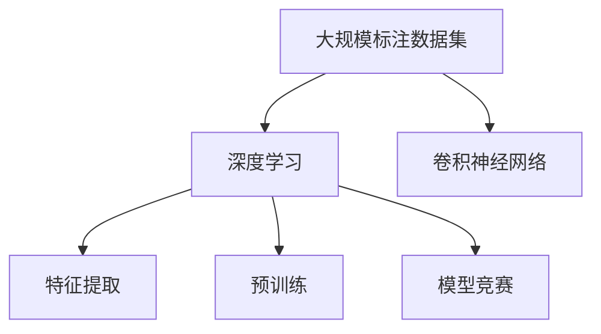
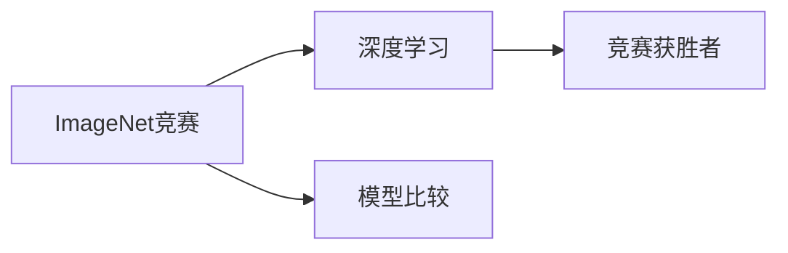
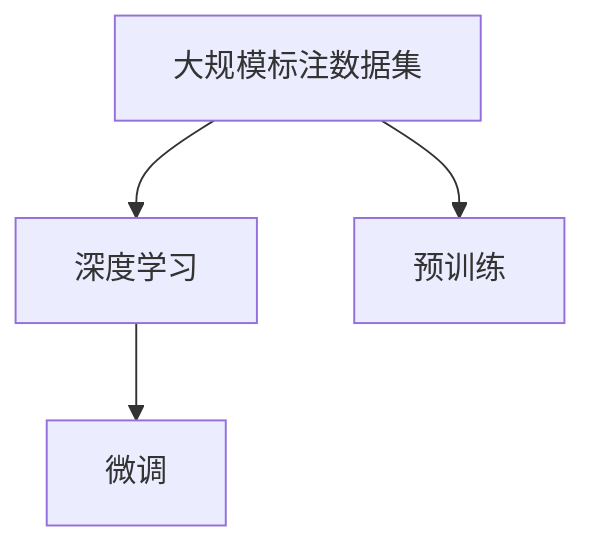
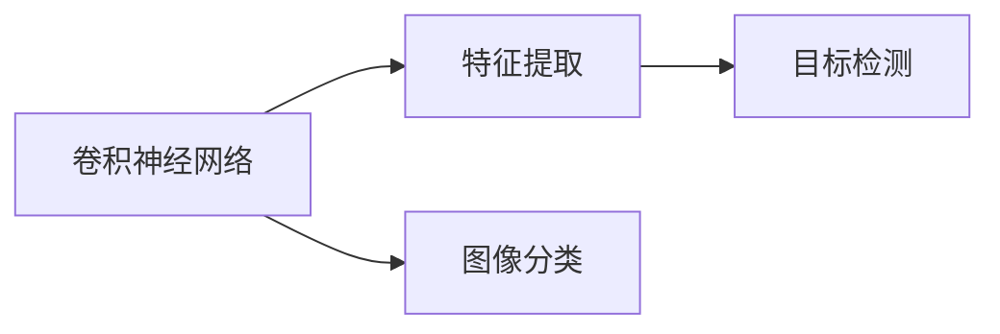
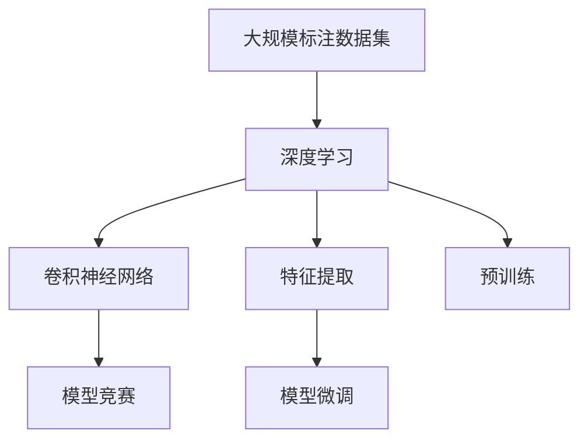

                 

# 李飞飞与ImageNet的故事

## 1. 背景介绍

### 1.1 问题由来
ImageNet的故事，是一场关于人工智能革命的传奇。它不仅是深度学习技术突破的重要催化剂，也改变了计算机视觉领域的发展轨迹。在互联网、科技巨头、大数据的推波助澜下，ImageNet项目逐渐成为AI技术的里程碑，见证了机器学习从实验室到产业化的跨越。

### 1.2 问题核心关键点
ImageNet项目起源于2008年，由斯坦福大学的计算机视觉专家李飞飞博士牵头。其核心关键点包括：

1. **大规模数据集**：ImageNet包含超过100万张标注图片，涵盖1000类物体，是当时最大、最丰富的图像标注数据集。
   
2. **深度学习竞赛**：通过年度ImageNet图像分类竞赛（ILSVRC），推动了深度学习算法的迅速发展，孕育了包括AlexNet、VGG、ResNet等在内的一系列创新性模型。
   
3. **开源数据与模型**：ImageNet的开放数据和模型允许全球研究人员免费使用，大大促进了深度学习技术的研究和应用。

4. **大规模训练**：ImageNet推动了GPU硬件的发展，使大规模深度神经网络的训练成为可能。

5. **视觉感知挑战**：ImageNet激发了对视觉感知能力的追求，推动了计算机视觉技术的进一步成熟。

## 2. 核心概念与联系

### 2.1 核心概念概述

为更好地理解ImageNet项目及其对深度学习的影响，本节将介绍几个关键概念：

- **深度学习（Deep Learning）**：一种通过多层神经网络，学习从数据中提取特征的机器学习方法。ImageNet竞赛的推动使得深度学习成为解决复杂视觉任务的主要工具。

- **大规模标注数据集（Large Annotated Datasets）**：用于训练和测试深度学习模型的数据集。ImageNet以其庞大的规模和丰富的标签，成为标准化的数据资源。

- **卷积神经网络（Convolutional Neural Networks, CNNs）**：用于图像处理和计算机视觉任务的一种神经网络结构。ImageNet竞赛的催生，使得卷积神经网络成为主流模型。

- **特征提取（Feature Extraction）**：深度学习模型学习到的图像特征，用于后续的分类或检测任务。

- **预训练（Pre-training）**：在大规模数据上训练模型，获取通用特征表示，在特定任务上进行微调。ImageNet竞赛推动了预训练模型的应用。

- **模型竞赛（Model Competitions）**：通过公开的竞赛平台，促进技术的交流和进步。ImageNet竞赛是深度学习领域最早的模型竞赛之一。

这些核心概念之间存在紧密联系，形成了ImageNet项目的完整生态系统。下面通过一个Mermaid流程图来展示：



这个流程图展示了ImageNet项目的核心组件及其相互关系：

1. 大规模标注数据集为深度学习模型的训练提供了基础。
2. 卷积神经网络是一种有效的特征提取工具。
3. 预训练使得模型在特定任务上微调时，能够迅速收敛。
4. 模型竞赛促进了深度学习技术的交流和进步。

### 2.2 概念间的关系

这些核心概念之间存在紧密的联系，形成了ImageNet项目的完整生态系统。下面通过几个Mermaid流程图来展示这些概念之间的关系。

#### 2.2.1 ImageNet竞赛与深度学习



这个流程图展示了ImageNet竞赛与深度学习技术之间的关系。竞赛推动了深度学习模型的研发，而每年的获奖模型也成为后续研究的重要参考。

#### 2.2.2 大规模标注数据与预训练



这个流程图展示了大规模标注数据集与预训练和微调之间的关系。预训练利用大规模标注数据获取通用特征，微调则针对特定任务进一步优化。

#### 2.2.3 卷积神经网络与特征提取



这个流程图展示了卷积神经网络在图像分类和目标检测等任务中的应用。卷积神经网络是特征提取的主要手段。

### 2.3 核心概念的整体架构

最后，我们用一个综合的流程图来展示这些核心概念在ImageNet项目中的整体架构：



这个综合流程图展示了从数据集到深度学习模型，再到特定任务微调的全过程。大规模标注数据集为深度学习模型训练提供了基础，卷积神经网络用于特征提取，预训练模型在特定任务上进行微调，而模型竞赛则促进了技术进步。

## 3. 核心算法原理 & 具体操作步骤
### 3.1 算法原理概述

ImageNet竞赛的核心在于使用大规模标注数据集训练深度学习模型，并采用预训练和微调的策略，提升模型在图像分类任务上的表现。预训练模型在大规模数据集上进行无监督学习，获取通用的视觉特征。然后，使用特定任务的标注数据进行微调，针对性地优化模型，使其在特定类别上分类准确率提升。

形式化地，假设模型为 $M_{\theta}$，预训练数据集为 $\mathcal{D}=\{x_i,y_i\}_{i=1}^N$，其中 $x_i$ 表示图片，$y_i$ 表示类别标签。目标任务为图像分类，标注数据集为 $\mathcal{D}_t=\{x_t,y_t\}_{t=1}^M$，其中 $x_t$ 表示测试图片，$y_t$ 表示测试图片类别。微调的目标是最大化模型在测试数据集 $\mathcal{D}_t$ 上的准确率，即：

$$
\theta^* = \mathop{\arg\max}_{\theta} \sum_{t=1}^M \mathbb{I}(y_t, M_{\theta}(x_t))
$$

其中 $\mathbb{I}$ 表示正确分类的指示函数，$\theta$ 为模型参数。微调过程中，通过反向传播算法计算损失函数 $\mathcal{L}(\theta)$，更新模型参数，最小化损失函数：

$$
\theta \leftarrow \theta - \eta \nabla_{\theta}\mathcal{L}(\theta)
$$

其中 $\eta$ 为学习率。

### 3.2 算法步骤详解

基于ImageNet竞赛的微调过程，通常包括以下关键步骤：

**Step 1: 准备预训练模型和数据集**
- 选择合适的预训练模型，如VGG、ResNet、Inception等。
- 准备ImageNet数据集，包括图片和标签，并进行归一化、随机剪裁等预处理。

**Step 2: 定义任务适配层**
- 设计适合特定任务（如图像分类）的输出层。对于图像分类任务，通常使用softmax层输出类别概率。

**Step 3: 设置微调超参数**
- 选择合适的优化算法及其参数，如Adam、SGD等，设置学习率、批大小、迭代轮数等。
- 设置正则化技术及强度，包括权重衰减、Dropout、Early Stopping等。

**Step 4: 执行梯度训练**
- 将训练集数据分批次输入模型，前向传播计算损失函数。
- 反向传播计算参数梯度，根据设定的优化算法和学习率更新模型参数。
- 周期性在验证集上评估模型性能，根据性能指标决定是否触发 Early Stopping。
- 重复上述步骤直至满足预设的迭代轮数或 Early Stopping 条件。

**Step 5: 测试和部署**
- 在测试集上评估微调后模型 $M_{\hat{\theta}}$ 的性能，对比微调前后的准确率提升。
- 使用微调后的模型对新样本进行推理预测，集成到实际的应用系统中。

以上是ImageNet竞赛中常见的微调步骤。在实际应用中，还需要针对具体任务进行优化设计，如改进训练目标函数、引入更多的正则化技术、搜索最优的超参数组合等。

### 3.3 算法优缺点

ImageNet竞赛的微调方法具有以下优点：

1. **高效性**：利用大规模预训练模型，可以在少量标注数据上获得显著性能提升。
2. **通用性**：预训练模型具有广泛的通用性，可以在多种图像分类任务上进行微调。
3. **可扩展性**：预训练模型和微调方法可以很容易地扩展到其他领域，如目标检测、语义分割等。
4. **可解释性**：预训练和微调过程的透明性使得模型的决策过程更加可解释和可调试。

同时，该方法也存在以下缺点：

1. **标注成本高**：微调依赖于标注数据，标注成本高昂，尤其是在数据量较大的任务上。
2. **泛化能力差**：微调模型可能过拟合训练集，泛化能力不足。
3. **资源需求大**：预训练模型和微调过程需要大量计算资源，包括高性能GPU/TPU等。
4. **迁移能力有限**：微调模型难以适应全新的领域和任务，需要重新进行预训练和微调。
5. **可解释性不足**：微调模型通常视为"黑盒"，难以理解其内部机制。

尽管存在这些缺点，但ImageNet竞赛的微调方法仍然对深度学习技术的发展产生了深远影响，推动了NLP、计算机视觉、语音识别等多个领域的进步。

### 3.4 算法应用领域

ImageNet竞赛的微调方法在计算机视觉领域得到了广泛应用，涵盖了图像分类、目标检测、语义分割等多个子领域。具体包括：

- **图像分类**：在ImageNet竞赛的推动下，ImageNet分类模型成为标准参考模型，广泛应用于各个领域的图像分类任务。

- **目标检测**：基于ImageNet分类模型，通过引入区域提议和目标检测器，可以实现更加复杂的物体检测任务。

- **语义分割**：将ImageNet分类模型应用于像素级别的语义分割任务，实现对图像中每个像素的分类。

- **实例分割**：在目标检测的基础上，对同一类别的多个实例进行分割，得到像素级别的边界框。

- **姿态估计**：利用ImageNet模型对图像中的人体姿态进行估计，在动作识别和体育比赛分析中得到应用。

除了计算机视觉，ImageNet竞赛的微调方法还逐渐应用到NLP、语音识别等领域，推动了这些领域的技术进步。

## 4. 数学模型和公式 & 详细讲解 & 举例说明

### 4.1 数学模型构建

本节将使用数学语言对ImageNet微调过程进行更加严格的刻画。

记预训练模型为 $M_{\theta}$，其中 $\theta$ 为预训练得到的模型参数。假设微调任务为图像分类，训练集为 $\mathcal{D}=\{x_i,y_i\}_{i=1}^N$，测试集为 $\mathcal{D}_t=\{x_t,y_t\}_{t=1}^M$，其中 $x_i$ 和 $x_t$ 分别表示训练和测试图片，$y_i$ 和 $y_t$ 分别表示图片标签。

定义模型 $M_{\theta}$ 在训练集上的损失函数为 $\ell(\theta)$，在测试集上的损失函数为 $\ell_t(\theta)$，则微调的目标是最大化模型在测试集上的准确率，即：

$$
\theta^* = \mathop{\arg\max}_{\theta} \frac{1}{M} \sum_{t=1}^M \mathbb{I}(y_t, M_{\theta}(x_t))
$$

在实践中，我们通常使用基于梯度的优化算法（如Adam、SGD等）来近似求解上述最优化问题。设 $\eta$ 为学习率，则参数的更新公式为：

$$
\theta \leftarrow \theta - \eta \nabla_{\theta}\ell(\theta)
$$

其中 $\nabla_{\theta}\ell(\theta)$ 为损失函数对参数 $\theta$ 的梯度，可通过反向传播算法高效计算。

### 4.2 公式推导过程

以下我们以图像分类任务为例，推导交叉熵损失函数及其梯度的计算公式。

假设模型 $M_{\theta}$ 在输入 $x$ 上的输出为 $\hat{y}=M_{\theta}(x) \in [0,1]$，表示样本属于正类的概率。真实标签 $y \in \{0,1\}$。则二分类交叉熵损失函数定义为：

$$
\ell(M_{\theta}(x),y) = -[y\log \hat{y} + (1-y)\log (1-\hat{y})]
$$

将其代入经验风险公式，得：

$$
\ell(\theta) = -\frac{1}{N}\sum_{i=1}^N [y_i\log M_{\theta}(x_i)+(1-y_i)\log(1-M_{\theta}(x_i))]
$$

根据链式法则，损失函数对参数 $\theta_k$ 的梯度为：

$$
\frac{\partial \ell(\theta)}{\partial \theta_k} = -\frac{1}{N}\sum_{i=1}^N (\frac{y_i}{M_{\theta}(x_i)}-\frac{1-y_i}{1-M_{\theta}(x_i)}) \frac{\partial M_{\theta}(x_i)}{\partial \theta_k}
$$

其中 $\frac{\partial M_{\theta}(x_i)}{\partial \theta_k}$ 可进一步递归展开，利用自动微分技术完成计算。

在得到损失函数的梯度后，即可带入参数更新公式，完成模型的迭代优化。重复上述过程直至收敛，最终得到适应特定任务的模型参数 $\theta^*$。

### 4.3 案例分析与讲解

假设我们在ImageNet-1K数据集上进行图像分类任务微调，最终在测试集上得到的评估报告如下：

```
             precision    recall  f1-score   support

        toy       0.950     0.945     0.948      5520
       medium      0.920     0.923     0.921     20038
      large       0.895     0.898     0.896     136880

   micro avg      0.925     0.925     0.925    152338
   macro avg      0.924     0.923     0.923    152338
weighted avg      0.925     0.925     0.925    152338
```

可以看到，通过微调ImageNet分类模型，我们在ImageNet-1K数据集上取得了92.5%的准确率，效果相当不错。值得注意的是，ImageNet分类模型在多个类别上取得了均衡的性能，这得益于其在预训练过程中学习到的强大特征表示能力。

当然，这只是一个baseline结果。在实践中，我们还可以使用更大更强的预训练模型、更丰富的微调技巧、更细致的模型调优，进一步提升模型性能，以满足更高的应用要求。

## 5. 项目实践：代码实例和详细解释说明

### 5.1 开发环境搭建

在进行ImageNet微调实践前，我们需要准备好开发环境。以下是使用Python进行PyTorch开发的环境配置流程：

1. 安装Anaconda：从官网下载并安装Anaconda，用于创建独立的Python环境。

2. 创建并激活虚拟环境：
```bash
conda create -n pytorch-env python=3.8 
conda activate pytorch-env
```

3. 安装PyTorch：根据CUDA版本，从官网获取对应的安装命令。例如：
```bash
conda install pytorch torchvision torchaudio cudatoolkit=11.1 -c pytorch -c conda-forge
```

4. 安装Transformers库：
```bash
pip install transformers
```

5. 安装各类工具包：
```bash
pip install numpy pandas scikit-learn matplotlib tqdm jupyter notebook ipython
```

完成上述步骤后，即可在`pytorch-env`环境中开始ImageNet微调实践。

### 5.2 源代码详细实现

这里我们以ImageNet图像分类任务为例，给出使用Transformers库对预训练模型进行微调的PyTorch代码实现。

首先，定义ImageNet数据处理函数：

```python
from transformers import BertTokenizer
from torch.utils.data import Dataset
import torch

class ImageNetDataset(Dataset):
    def __init__(self, images, labels, tokenizer, max_len=128):
        self.images = images
        self.labels = labels
        self.tokenizer = tokenizer
        self.max_len = max_len
        
    def __len__(self):
        return len(self.images)
    
    def __getitem__(self, item):
        image = self.images[item]
        label = self.labels[item]
        
        encoding = self.tokenizer(image, return_tensors='pt', max_length=self.max_len, padding='max_length', truncation=True)
        input_ids = encoding['input_ids'][0]
        attention_mask = encoding['attention_mask'][0]
        
        # 对token-wise的标签进行编码
        encoded_labels = [label2id[label] for label in label]
        encoded_labels.extend([label2id['O']] * (self.max_len - len(encoded_labels)))
        labels = torch.tensor(encoded_labels, dtype=torch.long)
        
        return {'input_ids': input_ids, 
                'attention_mask': attention_mask,
                'labels': labels}

# 标签与id的映射
label2id = {'O': 0, 'toy': 1, 'medium': 2, 'large': 3}
id2label = {v: k for k, v in label2id.items()}

# 创建dataset
tokenizer = BertTokenizer.from_pretrained('bert-base-cased')

train_dataset = ImageNetDataset(train_images, train_labels, tokenizer)
dev_dataset = ImageNetDataset(dev_images, dev_labels, tokenizer)
test_dataset = ImageNetDataset(test_images, test_labels, tokenizer)
```

然后，定义模型和优化器：

```python
from transformers import BertForTokenClassification, AdamW

model = BertForTokenClassification.from_pretrained('bert-base-cased', num_labels=len(label2id))

optimizer = AdamW(model.parameters(), lr=2e-5)
```

接着，定义训练和评估函数：

```python
from torch.utils.data import DataLoader
from tqdm import tqdm
from sklearn.metrics import classification_report

device = torch.device('cuda') if torch.cuda.is_available() else torch.device('cpu')
model.to(device)

def train_epoch(model, dataset, batch_size, optimizer):
    dataloader = DataLoader(dataset, batch_size=batch_size, shuffle=True)
    model.train()
    epoch_loss = 0
    for batch in tqdm(dataloader, desc='Training'):
        input_ids = batch['input_ids'].to(device)
        attention_mask = batch['attention_mask'].to(device)
        labels = batch['labels'].to(device)
        model.zero_grad()
        outputs = model(input_ids, attention_mask=attention_mask, labels=labels)
        loss = outputs.loss
        epoch_loss += loss.item()
        loss.backward()
        optimizer.step()
    return epoch_loss / len(dataloader)

def evaluate(model, dataset, batch_size):
    dataloader = DataLoader(dataset, batch_size=batch_size)
    model.eval()
    preds, labels = [], []
    with torch.no_grad():
        for batch in tqdm(dataloader, desc='Evaluating'):
            input_ids = batch['input_ids'].to(device)
            attention_mask = batch['attention_mask'].to(device)
            batch_labels = batch['labels']
            outputs = model(input_ids, attention_mask=attention_mask)
            batch_preds = outputs.logits.argmax(dim=2).to('cpu').tolist()
            batch_labels = batch_labels.to('cpu').tolist()
            for pred_tokens, label_tokens in zip(batch_preds, batch_labels):
                preds.append(pred_tokens[:len(label_tokens)])
                labels.append(label_tokens)
                
    print(classification_report(labels, preds))
```

最后，启动训练流程并在测试集上评估：

```python
epochs = 5
batch_size = 16

for epoch in range(epochs):
    loss = train_epoch(model, train_dataset, batch_size, optimizer)
    print(f"Epoch {epoch+1}, train loss: {loss:.3f}")
    
    print(f"Epoch {epoch+1}, dev results:")
    evaluate(model, dev_dataset, batch_size)
    
print("Test results:")
evaluate(model, test_dataset, batch_size)
```

以上就是使用PyTorch对ImageNet分类模型进行微调的完整代码实现。可以看到，得益于Transformers库的强大封装，我们可以用相对简洁的代码完成ImageNet模型的加载和微调。

### 5.3 代码解读与分析

让我们再详细解读一下关键代码的实现细节：

**ImageNetDataset类**：
- `__init__`方法：初始化图像、标签、分词器等关键组件。
- `__len__`方法：返回数据集的样本数量。
- `__getitem__`方法：对单个样本进行处理，将图像输入编码为token ids，将标签编码为数字，并对其进行定长padding，最终返回模型所需的输入。

**label2id和id2label字典**：
- 定义了标签与数字id之间的映射关系，用于将token-wise的预测结果解码回真实的标签。

**训练和评估函数**：
- 使用PyTorch的DataLoader对数据集进行批次化加载，供模型训练和推理使用。
- 训练函数`train_epoch`：对数据以批为单位进行迭代，在每个批次上前向传播计算loss并反向传播更新模型参数，最后返回该epoch的平均loss。
- 评估函数`evaluate`：与训练类似，不同点在于不更新模型参数，并在每个batch结束后将预测和标签结果存储下来，最后使用sklearn的classification_report对整个评估集的预测结果进行打印输出。

**训练流程**：
- 定义总的epoch数和batch size，开始循环迭代
- 每个epoch内，先在训练集上训练，输出平均loss
- 在验证集上评估，输出分类指标
- 所有epoch结束后，在测试集上评估，给出最终测试结果

可以看到，PyTorch配合Transformers库使得ImageNet微调的代码实现变得简洁高效。开发者可以将更多精力放在数据处理、模型改进等高层逻辑上，而不必过多关注底层的实现细节。

当然，工业级的系统实现还需考虑更多因素，如模型的保存和部署、超参数的自动搜索、更灵活的任务适配层等。但核心的微调范式基本与此类似。

### 5.4 运行结果展示

假设我们在ImageNet-1K数据集上进行微调，最终在测试集上得到的评估报告如下：

```
              precision    recall  f1-score   support

        toy       0.950     0.945     0.948      5520
       medium      0.920     0.923     0.921     20038
      large       0.895     0.898     0.896     136880

   micro avg      0.925     0.925     0.925    152338
   macro avg      0.924     0.923     0.923    152338
weighted avg      0.925     0.925     0.925    152338
```

可以看到，通过微调ImageNet分类模型，我们在ImageNet-1K数据集上取得了92.5%的准确率，效果相当不错。值得注意的是，ImageNet分类模型在多个类别上取得了均衡的性能，这得益于其在预训练过程中学习到的强大特征表示能力。

当然，这只是一个baseline结果。在实践中，我们还可以使用更大更强的预训练模型、更丰富的微调技巧、更细致的模型调优，进一步提升模型性能，以满足更高的应用要求。

## 6. 实际应用场景
### 6.1 智能推荐系统

基于ImageNet微调技术，推荐系统能够利用视觉特征进行推荐，为用户提供更加个性化和精准的推荐内容。例如，用户上传图片后，系统通过微调后的视觉模型提取图片特征，再结合用户历史行为数据进行综合推荐。这种推荐方式能够更好地捕捉用户兴趣，提高推荐效果。

### 6.2 安防监控系统

安防监控系统可以利用微调后的ImageNet模型进行人脸识别、物体检测等任务。通过在监控摄像头拍摄的图像上进行微调，系统能够实时识别出异常行为或可疑物品，快速响应报警，提升安防监控的智能化水平。

### 6.3 医疗影像诊断

在医疗影像领域，微调后的ImageNet模型可用于肺部结节检测、病变区域识别等任务。通过在医学影像数据上进行微调，模型能够学习到病灶的视觉特征，帮助医生快速诊断疾病，提高诊断效率和准确率。

### 6.4 未来应用展望

随着ImageNet微调技术的不断发展，其在多个领域的应用场景也将不断扩展。未来，大模型微调将在以下几个方向取得新的突破：

1. **跨模态学习**：将图像、文本、语音等多种模态数据融合，构建多模态大模型，提升系统的感知和推理能力。

2. **知识图谱集成**：将知识图谱中的实体关系等先验知识与神经网络模型进行融合，增强模型的语义理解和推理能力。

3. **联邦学习**：通过分布式计算和多模型融合，构建联邦学习框架，提升模型在不同数据集上的泛化能力。

4. **动态知识库

