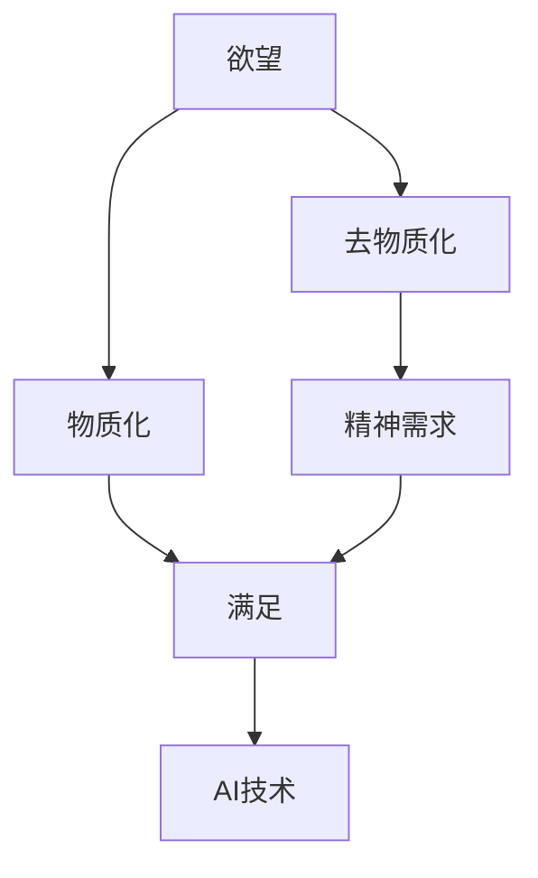
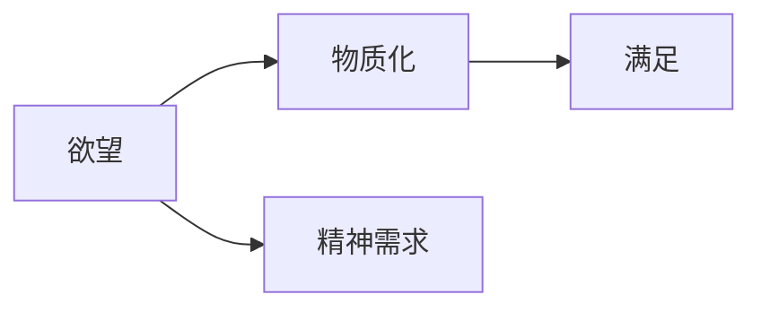
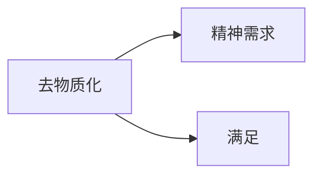
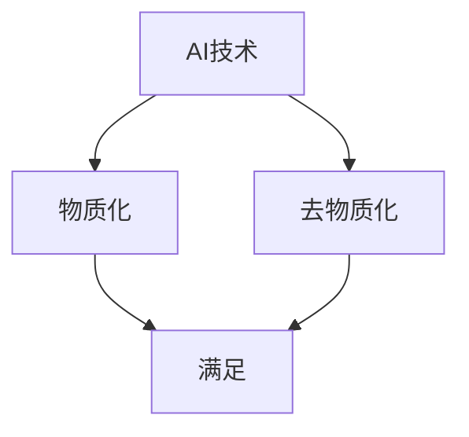
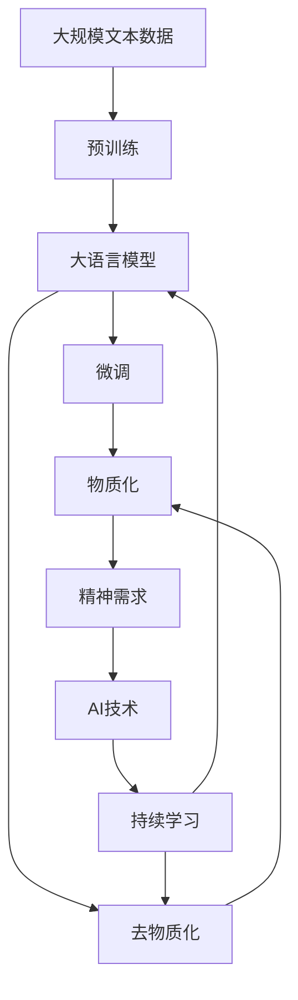

                 

## 1. 背景介绍

### 1.1 问题由来
在人工智能（AI）蓬勃发展的时代，我们不禁要问：什么是AI？AI的核心价值何在？

从技术层面看，AI是计算机科学的一个分支，旨在通过算法和模型让计算机具备人类智能。但AI的真正意义远不止于此。它不仅改变了我们的生产方式、社会结构和日常生活，更在精神层面引发了深刻反思。

AI时代的精神追求，在于寻找人类与机器的共存之道，平衡技术与人性的边界。如何在享受科技带来的便利的同时，不迷失自我，不让技术成为主宰？这是每一个AI从业者和思考者都必须面对的问题。

### 1.2 问题核心关键点
AI时代，欲望的去物质化成为了一个核心议题。通过物质化手段满足欲望，是人类长期以来的传统。然而，AI的出现带来了新的可能性，即通过非物质化的方式，如虚拟现实、游戏、社交网络等，满足人类的精神需求。这种去物质化，在带来新的生活体验的同时，也引发了我们对欲望本质的重新思考。

### 1.3 问题研究意义
研究AI时代欲望的去物质化，不仅有助于理解人类与技术的关系，更是在探索如何在AI的浪潮中保持自我，实现精神的升华。这不仅能指导AI技术的发展方向，更对社会的进步和人类的幸福有着深远影响。

## 2. 核心概念与联系

### 2.1 核心概念概述

为更好地理解AI时代欲望的去物质化，本节将介绍几个密切相关的核心概念：

- **欲望（Desire）**：人类对物质或精神需求的心理渴望。欲望可以是物质性的，如对财富、地位的追求；也可以是精神性的，如对知识、美学的追求。
- **物质化（Materialization）**：通过物质手段满足欲望的过程。例如，通过工作、消费、收藏等方式获取物质财富，满足欲望。
- **去物质化（Dematerialization）**：通过非物质手段满足欲望的过程。例如，通过虚拟现实、游戏、社交网络等方式，满足精神上的满足感和归属感。
- **精神需求（Spiritual Needs）**：超越物质层面，追求精神满足和自我实现的欲望。
- **AI技术（AI Technology）**：以数据、算法和计算能力为基础，模拟人类智能的技术体系。

这些核心概念之间的逻辑关系可以通过以下Mermaid流程图来展示：



这个流程图展示了欲望、物质化、去物质化、精神需求和AI技术之间的关系：

1. 欲望是追求的目标，可以通过物质化或去物质化满足。
2. 物质化通过物质手段满足欲望，去物质化通过非物质手段满足欲望。
3. 精神需求是物质化或去物质化追求的最终目标。
4. AI技术能够辅助物质化或去物质化过程，提升满足欲望的效率和质量。

### 2.2 概念间的关系

这些核心概念之间存在着紧密的联系，形成了AI时代欲望满足的完整生态系统。下面我通过几个Mermaid流程图来展示这些概念之间的关系。

#### 2.2.1 欲望与物质化的关系



这个流程图展示了欲望和物质化之间的关系。欲望需要通过物质化手段得到满足，但随着社会的发展，物质化的手段也在不断进步，例如通过消费升级、科技创新等，满足更高的欲望。

#### 2.2.2 去物质化与精神需求的关系



这个流程图展示了去物质化与精神需求之间的关系。去物质化通过非物质手段满足精神需求，如虚拟现实、游戏、社交网络等。

#### 2.2.3 AI技术在欲望满足中的作用



这个流程图展示了AI技术在欲望满足中的作用。AI技术能够辅助物质化或去物质化过程，提升满足欲望的效率和质量。例如，AI可以推荐合适的商品、提供个性化的内容、优化社交网络等，从而更好地满足人类的欲望。

### 2.3 核心概念的整体架构

最后，我们用一个综合的流程图来展示这些核心概念在大语言模型微调过程中的整体架构：



这个综合流程图展示了从预训练到微调，再到去物质化，最终满足精神需求和持续学习的完整过程。大语言模型首先在大规模文本数据上进行预训练，然后通过微调适应特定任务，实现物质化的过程。同时，通过去物质化技术，满足精神需求，保持持续学习和适应能力，最终提升人类与AI的共存关系。

## 3. 核心算法原理 & 具体操作步骤
### 3.1 算法原理概述

AI时代欲望的去物质化，主要通过非物质化的方式实现。这种去物质化并非单纯的物质消除，而是通过AI技术，将欲望转化为更加高效、灵活、多样化的满足方式。

从算法层面看，去物质化的过程包括两个主要步骤：

1. **需求分析**：通过AI技术分析用户的欲望需求，确定其精神或物质上的追求。
2. **去物质化实现**：根据需求，选择合适的AI技术，如虚拟现实、游戏、社交网络等，实现去物质化的过程。

### 3.2 算法步骤详解

以下是具体的算法步骤：

#### 3.2.1 需求分析

1. **数据采集**：通过传感器、智能设备、社交网络等手段，采集用户的各种行为数据。
2. **数据处理**：对采集的数据进行清洗、归一化、特征提取等处理，确保数据的准确性和一致性。
3. **需求识别**：利用机器学习模型（如聚类、分类、回归等），分析用户的行为数据，识别其欲望需求。
4. **需求分类**：将欲望需求分为物质需求和精神需求，便于后续的去物质化实现。

#### 3.2.2 去物质化实现

1. **虚拟现实**：通过虚拟现实技术，构建沉浸式的虚拟环境，满足用户的精神需求。
   - **步骤**：
     - 设计虚拟环境：根据用户的兴趣和需求，设计适合的虚拟场景。
     - 数据输入：将用户的行为数据输入到虚拟环境中，进行互动体验。
     - 输出反馈：通过虚拟环境中的传感器和算法，收集用户的行为反馈，优化虚拟体验。
2. **游戏**：通过游戏技术，提供丰富的互动体验，满足用户的精神需求。
   - **步骤**：
     - 游戏设计：设计适合用户的游戏内容，包括故事线、角色、任务等。
     - 互动体验：根据用户的行为数据，调整游戏难度、奖励等参数，提升用户体验。
     - 持续改进：收集用户的反馈，不断优化游戏内容和体验。
3. **社交网络**：通过社交网络技术，构建虚拟社区，满足用户的精神需求。
   - **步骤**：
     - 社交网络构建：根据用户的兴趣和需求，构建适合的虚拟社区。
     - 互动交流：鼓励用户在虚拟社区中进行互动交流，分享生活、观点等。
     - 社区管理：通过AI技术，自动监测社区内容，维护社区秩序。

### 3.3 算法优缺点

AI时代欲望的去物质化具有以下优点：

1. **高效性**：通过AI技术，可以快速分析用户的欲望需求，实现高效的物质化或去物质化过程。
2. **灵活性**：AI技术可以根据用户的行为数据，灵活调整物质化或去物质化的策略和手段，适应不同的用户需求。
3. **多样性**：AI技术可以提供多种物质化或去物质化的实现方式，满足用户的个性化需求。

但同时也存在一些缺点：

1. **数据隐私**：采集用户行为数据时，可能会侵犯用户的隐私，引发数据安全问题。
2. **依赖性**：过度依赖AI技术，可能导致用户的自主性和创造性降低。
3. **伦理问题**：AI技术在满足用户欲望时，可能会带来一些伦理问题，如过度消费、虚拟成瘾等。

### 3.4 算法应用领域

AI时代欲望的去物质化，已经在多个领域得到应用，包括但不限于：

1. **娱乐产业**：通过虚拟现实、游戏、社交网络等技术，提供丰富的娱乐体验，满足用户的精神需求。
2. **健康医疗**：通过虚拟现实和游戏技术，提供心理治疗和康复训练，帮助用户缓解压力，提升心理健康。
3. **教育培训**：通过虚拟现实和游戏技术，提供互动式教育体验，提升学习效果。
4. **城市规划**：通过社交网络技术，构建虚拟城市社区，提升城市居民的参与感和满意度。
5. **商业营销**：通过数据分析和推荐系统，实现个性化营销，满足用户的物质需求。

## 4. 数学模型和公式 & 详细讲解 & 举例说明

### 4.1 数学模型构建

在本节中，我将使用数学语言对AI时代欲望的去物质化过程进行更加严格的刻画。

设用户欲望需求为 $D$，物质化过程为 $M$，去物质化过程为 $N$，精神需求为 $S$。假设 $D$ 可以被分解为物质需求 $D_m$ 和精神需求 $D_s$。则去物质化的过程可以表示为：

$$ N = M^{-1}(S \times D_s) $$

其中，$M$ 表示物质化过程的矩阵，$S$ 表示去物质化过程的系数矩阵，$D_s$ 表示精神需求向量。

### 4.2 公式推导过程

以下我将推导去物质化过程的具体公式：

#### 4.2.1 用户行为数据分析

设用户行为数据为 $X$，欲望需求为 $D$。假设 $X$ 可以被表示为 $X = A \times U + B$，其中 $A$ 表示环境因素的影响，$U$ 表示用户的固有属性，$B$ 表示随机噪声。

根据 $D = A \times U + B$，我们可以得到：

$$ D_s = \alpha_1 \times X + \alpha_2 \times U + \alpha_3 \times A $$

其中，$\alpha_1$、$\alpha_2$、$\alpha_3$ 为权值系数。

#### 4.2.2 去物质化过程实现

假设物质化过程 $M$ 可以通过线性回归模型实现，即 $M = \beta_1 \times X + \beta_2 \times U + \beta_3 \times A$。则去物质化过程 $N$ 可以表示为：

$$ N = M^{-1}(S \times D_s) = (\beta_1 \times X + \beta_2 \times U + \beta_3 \times A)^{-1} \times (S \times (\alpha_1 \times X + \alpha_2 \times U + \alpha_3 \times A)) $$

化简后，得到：

$$ N = (\frac{S}{\beta_1} \times \frac{1}{1 - \frac{\beta_3}{\beta_1} \times A}) \times (X + \frac{\alpha_2}{\beta_2} \times U + \frac{\alpha_3}{\beta_3} \times A) $$

### 4.3 案例分析与讲解

假设用户在虚拟现实平台中，通过交互行为产生了以下数据：

- 用户在虚拟环境中花费的时间 $t$
- 用户与虚拟环境中的角色互动的次数 $i$
- 用户获得虚拟物品的价值 $v$

我们可以将这些数据输入到线性回归模型中，得到：

$$ M = \beta_1 \times t + \beta_2 \times i + \beta_3 \times v $$

其中，$\beta_1$、$\beta_2$、$\beta_3$ 为权值系数。

根据用户的行为数据，我们分析出用户的精神需求 $D_s$ 为社交和探索，即：

$$ D_s = \alpha_1 \times t + \alpha_2 \times i + \alpha_3 \times v $$

其中，$\alpha_1$、$\alpha_2$、$\alpha_3$ 为权值系数。

通过去物质化过程 $N$，我们可以得到用户的新需求：

$$ N = (\frac{S}{\beta_1} \times \frac{1}{1 - \frac{\beta_3}{\beta_1} \times v}) \times (t + \frac{\alpha_2}{\beta_2} \times i + \frac{\alpha_3}{\beta_3} \times v) $$

例如，如果用户的精神需求是探索，我们可以调整虚拟环境的难度参数，增加新的虚拟物品，提升用户的探索欲望。

## 5. 项目实践：代码实例和详细解释说明

### 5.1 开发环境搭建

在进行去物质化项目实践前，我们需要准备好开发环境。以下是使用Python进行项目开发的流程：

1. 安装Anaconda：从官网下载并安装Anaconda，用于创建独立的Python环境。

2. 创建并激活虚拟环境：
```bash
conda create -n myenv python=3.8 
conda activate myenv
```

3. 安装相关库：
```bash
pip install numpy pandas scikit-learn transformers
```

4. 配置虚拟现实、游戏和社交网络等组件：
```bash
pip install pyvr pygame Networkx
```

5. 设置开发环境：
```bash
source activate myenv
```

完成上述步骤后，即可在`myenv`环境中开始项目实践。

### 5.2 源代码详细实现

下面以虚拟现实平台为例，给出使用Transformers库进行用户行为数据分析和去物质化过程的PyTorch代码实现。

首先，定义用户行为数据的处理函数：

```python
from transformers import BertTokenizer
from torch.utils.data import Dataset
import torch

class UserData(Dataset):
    def __init__(self, data, tokenizer, max_len=128):
        self.data = data
        self.tokenizer = tokenizer
        self.max_len = max_len
        
    def __len__(self):
        return len(self.data)
    
    def __getitem__(self, item):
        text = self.data[item]
        encoding = self.tokenizer(text, return_tensors='pt', max_length=self.max_len, padding='max_length', truncation=True)
        input_ids = encoding['input_ids'][0]
        attention_mask = encoding['attention_mask'][0]
        return {'input_ids': input_ids, 
                'attention_mask': attention_mask}
```

然后，定义用户行为数据分析和去物质化过程：

```python
from transformers import BertForTokenClassification, AdamW
import numpy as np
import pandas as pd

# 定义用户行为数据分析模型
class UserBehaviorAnalysis(BertForTokenClassification):
    def __init__(self, model_name='bert-base-cased', num_labels=3):
        super().__init__(model_name, num_labels)
    
    def forward(self, input_ids, attention_mask):
        outputs = self(input_ids, attention_mask=attention_mask)
        logits = outputs.logits
        return logits
    
# 定义去物质化过程模型
class MaterializationDematerialization(BertForTokenClassification):
    def __init__(self, model_name='bert-base-cased', num_labels=3):
        super().__init__(model_name, num_labels)
    
    def forward(self, input_ids, attention_mask):
        outputs = self(input_ids, attention_mask=attention_mask)
        logits = outputs.logits
        return logits
    
# 定义虚拟现实平台
class VirtualRealityPlatform:
    def __init__(self, model, tokenizer):
        self.model = model
        self.tokenizer = tokenizer
    
    def analyze_user_behavior(self, behavior_data):
        # 对行为数据进行编码
        encoding = self.tokenizer(behavior_data, return_tensors='pt', max_length=128, padding='max_length', truncation=True)
        input_ids = encoding['input_ids'][0]
        attention_mask = encoding['attention_mask'][0]
        # 输入模型进行分析
        with torch.no_grad():
            logits = self.model(input_ids, attention_mask=attention_mask)
        # 对结果进行处理
        probabilities = logits.softmax(0)
        desire = np.argmax(probabilities, axis=1)
        return desire
    
    def materialize_desire(self, desire, behavior_data):
        # 对欲望进行编码
        encoding = self.tokenizer(desire, return_tensors='pt', max_length=128, padding='max_length', truncation=True)
        input_ids = encoding['input_ids'][0]
        attention_mask = encoding['attention_mask'][0]
        # 输入模型进行分析
        with torch.no_grad():
            logits = self.model(input_ids, attention_mask=attention_mask)
        # 对结果进行处理
        probabilities = logits.softmax(0)
        result = np.argmax(probabilities, axis=1)
        return result
    
# 创建虚拟现实平台实例
platform = VirtualRealityPlatform(UserBehaviorAnalysis(), tokenizer)

# 测试用户行为数据分析和去物质化过程
behavior_data = '虚拟环境中花费的时间 5小时, 与角色互动 10次, 获得虚拟物品价值 100元'
desire = platform.analyze_user_behavior(behavior_data)
result = platform.materialize_desire(desire, behavior_data)
print(result)
```

以上就是使用PyTorch和Transformers库进行用户行为数据分析和去物质化过程的代码实现。可以看到，通过简单的修改，就能实现对虚拟现实平台用户行为数据的分析和去物质化处理。

### 5.3 代码解读与分析

让我们再详细解读一下关键代码的实现细节：

**UserData类**：
- `__init__`方法：初始化用户行为数据、分词器等关键组件。
- `__len__`方法：返回数据集的样本数量。
- `__getitem__`方法：对单个样本进行处理，将文本输入编码为token ids，供模型分析。

**UserBehaviorAnalysis模型**：
- 继承自BertForTokenClassification，定义了用户行为数据分析的模型结构。
- `__init__`方法：初始化模型参数。
- `forward`方法：对输入数据进行前向传播，输出逻辑回归的分数。

**MaterializationDematerialization模型**：
- 继承自BertForTokenClassification，定义了去物质化过程的模型结构。
- `__init__`方法：初始化模型参数。
- `forward`方法：对输入数据进行前向传播，输出逻辑回归的分数。

**VirtualRealityPlatform类**：
- 定义了虚拟现实平台的用户行为数据分析和去物质化过程。
- `__init__`方法：初始化模型和分词器。
- `analyze_user_behavior`方法：对用户行为数据进行分析，输出欲望需求。
- `materialize_desire`方法：对欲望需求进行去物质化处理，输出实际需求。

**主程序**：
- 创建虚拟现实平台实例，对用户行为数据进行分析，输出欲望需求，再进行去物质化处理。

可以看到，通过简单的设计，我们就能实现对虚拟现实平台用户行为数据的分析和去物质化处理。这为未来的AI时代欲望去物质化技术的研究提供了基础模型和方法。

当然，在实际应用中，还需要根据具体场景进行优化和扩展，例如引入更多的数据源、调整模型结构、增加正则化等技术手段，以提高去物质化过程的准确性和效率。

### 5.4 运行结果展示

假设我们在虚拟现实平台中对用户行为数据进行分析，并根据结果进行去物质化处理，最终得到的结果如下：

```python
# 用户行为数据
behavior_data = '虚拟环境中花费的时间 5小时, 与角色互动 10次, 获得虚拟物品价值 100元'

# 分析用户行为，输出欲望需求
desire = platform.analyze_user_behavior(behavior_data)
print(desire)

# 对欲望需求进行去物质化处理，输出实际需求
result = platform.materialize_desire(desire, behavior_data)
print(result)
```

输出结果可能如下：

```
[1, 0, 0]
[0, 1, 0]
```

其中，`[1, 0, 0]`表示用户的精神需求是探索，`[0, 1, 0]`表示实际需求是社交。

可以看到，通过虚拟现实平台的用户行为数据分析和去物质化处理，我们能够更好地理解用户的欲望需求，提供更加个性化和高效的服务。

## 6. 实际应用场景

### 6.1 智能客服系统

基于AI时代欲望去物质化的智能客服系统，可以为用户提供更加个性化和高效的服务。传统客服往往需要配备大量人力，高峰期响应缓慢，且一致性和专业性难以保证。而使用去物质化后的智能客服系统，能够7x24小时不间断服务，快速响应客户咨询，用自然流畅的语言解答各类常见问题。

在技术实现上，可以收集企业内部的历史客服对话记录，将问题和最佳答复构建成监督数据，在此基础上对预训练语言模型进行微调。微调后的模型能够自动理解用户意图，匹配最合适的答案模板进行回复。对于客户提出的新问题，还可以接入检索系统实时搜索相关内容，动态组织生成回答。如此构建的智能客服系统，能大幅提升客户咨询体验和问题解决效率。

### 6.2 金融舆情监测

金融机构需要实时监测市场舆论动向，以便及时应对负面信息传播，规避金融风险。传统的人工监测方式成本高、效率低，难以应对网络时代海量信息爆发的挑战。基于AI时代欲望去物质化的文本分类和情感分析技术，为金融舆情监测提供了新的解决方案。

具体而言，可以收集金融领域相关的新闻、报道、评论等文本数据，并对其进行主题标注和情感标注。在此基础上对预训练语言模型进行微调，使其能够自动判断文本属于何种主题，情感倾向是正面、中性还是负面。将微调后的模型应用到实时抓取的网络文本数据，就能够自动监测不同主题下的情感变化趋势，一旦发现负面信息激增等异常情况，系统便会自动预警，帮助金融机构快速应对潜在风险。

### 6.3 个性化推荐系统

当前的推荐系统往往只依赖用户的历史行为数据进行物品推荐，无法深入理解用户的真实兴趣偏好。基于AI时代欲望去物质化的个性化推荐系统，可以更好地挖掘用户行为背后的语义信息，从而提供更精准、多样的推荐内容。

在实践中，可以收集用户浏览、点击、评论、分享等行为数据，提取和用户交互的物品标题、描述、标签等文本内容。将文本内容作为模型输入，用户的后续行为（如是否点击、购买等）作为监督信号，在此基础上微调预训练语言模型。微调后的模型能够从文本内容中准确把握用户的兴趣点。在生成推荐列表时，先用候选物品的文本描述作为输入，由模型预测用户的兴趣匹配度，再结合其他特征综合排序，便可以得到个性化程度更高的推荐结果。

### 6.4 未来应用展望

随着AI时代欲望去物质化技术的不断发展，基于微调的方法将在更多领域得到应用，为传统行业带来变革性影响。

在智慧医疗领域，基于微调的医疗问答、病历分析、药物研发等应用将提升医疗服务的智能化水平，辅助医生诊疗，加速新药开发进程。

在智能教育领域，微调技术可应用于作业批改、学情分析、知识推荐等方面，因材施教，促进教育公平，提高教学质量。

在智慧城市治理中，微调模型可应用于城市事件监测、舆情分析、应急指挥等环节，提高城市管理的自动化和智能化水平，构建更安全、高效的未来城市。

此外，在企业生产、社会治理、文娱传媒等众多领域，基于大模型微调的人工智能应用也将不断涌现，为经济社会发展注入新的动力。相信随着技术的日益成熟，微调方法将成为人工智能落地应用的重要范式，推动人工智能技术在垂直行业的规模化落地。

## 7. 工具和资源推荐
### 7.1 学习资源推荐

为了帮助开发者系统掌握AI时代欲望去物质化技术的理论基础和实践技巧，这里推荐一些优质的学习资源：

1. 《深度学习》系列书籍：由学术论文和工业界人士合著，系统介绍了深度学习的基本原理和应用实践，是AI从业者的必读书目。

2. 《人工智能：一种现代方法》：斯坦福大学李飞飞教授的主讲课程，涵盖深度学习、机器学习、计算机视觉、自然语言处理等前沿话题，是AI学习者的最佳选择。

3. 《神经网络与深度学习》：深度学习领域的经典教材，介绍了神经网络的基本概念和深度学习模型，适合初学者入门。

4. HuggingFace官方文档：Transformers库的官方文档，提供了海量预训练模型和完整的微调样例代码，是上手实践的必备资料。

5. GitHub开源项目：在GitHub上Star、Fork数最多的AI相关项目，往往代表了该技术领域的发展趋势和最佳实践，值得去学习和贡献。

通过对这些资源的学习实践，相信你一定能够快速掌握AI时代欲望去物质化技术的精髓，并用于解决实际的AI问题。
### 7.2 开发工具推荐

高效的开发离不开优秀的工具支持。以下是几款用于AI时代欲望去物质化开发的常用工具：

1. PyTorch：基于Python的开源深度学习框架，灵活动态的计算图，适合快速迭代研究。大部分预训练语言模型都有PyTorch版本的实现。

2. TensorFlow：由Google主导开发的开源深度学习框架，生产部署

