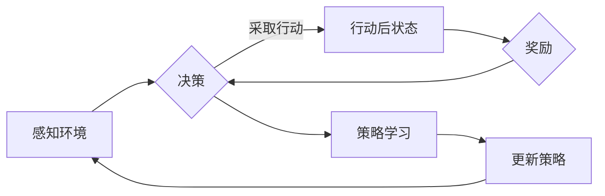

# 规划机制在 Agent 学习中的应用

> 关键词：Agent 学习，强化学习，规划，决策，动态规划，马尔可夫决策过程，策略搜索，多智能体系统

## 1. 背景介绍

随着人工智能技术的飞速发展，智能体(Agent)学习成为了研究的热点。在智能体学习领域，Agent 通过与环境的交互，不断学习并改进其决策策略，以实现某种目标。然而，现实世界中的环境复杂多变，智能体需要做出快速且高效的决策。因此，引入规划机制成为了一种有效的方法。

本文将深入探讨规划机制在 Agent 学习中的应用，从基本概念到实际案例，全面解析如何利用规划机制提升 Agent 的决策能力。

## 2. 核心概念与联系

### 2.1 核心概念

#### 2.1.1 智能体(Agent)

智能体是一个能够感知环境、接收输入信息、做出决策并采取行动的实体。在智能体学习中，智能体通过学习来优化其决策策略，以实现既定的目标。

#### 2.1.2 环境(Environment)

环境是智能体进行交互的背景，它提供智能体的状态和可能的动作集合。环境可以是物理环境，如机器人操作环境，也可以是虚拟环境，如游戏环境。

#### 2.1.3 策略(Strategy)

策略是智能体在特定环境下采取的行动规则。在智能体学习中，策略是通过学习得到的。

#### 2.1.4 奖励(Reward)

奖励是智能体采取行动后从环境中获得的结果。奖励可以用来指导智能体学习，优化其策略。

#### 2.1.5 规划(Planning)

规划是指智能体在采取行动之前，根据当前状态和目标状态，制定一系列的行动方案。规划可以帮助智能体在复杂环境中做出更好的决策。

### 2.2 Mermaid 流程图

以下是一个简化的 Mermaid 流程图，展示了智能体学习的基本流程：



### 2.3 核心概念联系

智能体通过感知环境，接收输入信息，根据策略做出决策，并采取行动。行动后，智能体会从环境中获得奖励，并使用奖励来更新策略。规划机制在此过程中扮演着重要的角色，它帮助智能体在行动前制定行动计划，以实现更好的决策。

## 3. 核心算法原理 & 具体操作步骤

### 3.1 算法原理概述

规划机制在 Agent 学习中的应用主要分为两种：确定性规划和概率性规划。

#### 3.1.1 确定性规划

确定性规划是指在给定当前状态和目标状态的情况下，智能体能够找到一条最优的行动序列，以实现目标状态。

#### 3.1.2 概率性规划

概率性规划是指在不确定的环境中，智能体需要根据概率来选择行动，以最大化期望奖励。

### 3.2 算法步骤详解

#### 3.2.1 确定性规划

1. 确定规划问题的搜索空间，包括所有可能的行动序列。
2. 定义目标函数，用于评估行动序列的优劣。
3. 使用搜索算法（如深度优先搜索、广度优先搜索、A*搜索等）在搜索空间中找到最优行动序列。

#### 3.2.2 概率性规划

1. 定义状态空间、动作空间、状态转移概率和奖励函数。
2. 选择合适的搜索算法（如值迭代、策略迭代等）来找到最优策略。

### 3.3 算法优缺点

#### 3.3.1 确定性规划

优点：计算效率高，能够找到最优行动序列。

缺点：对环境假设严格，难以处理不确定环境。

#### 3.3.2 概率性规划

优点：能够处理不确定环境，适用于复杂环境。

缺点：计算复杂度较高，难以找到最优行动序列。

### 3.4 算法应用领域

规划机制在 Agent 学习中的应用非常广泛，以下是一些常见的应用领域：

- 运输调度
- 机器人路径规划
- 游戏AI
- 资源分配

## 4. 数学模型和公式 & 详细讲解 & 举例说明

### 4.1 数学模型构建

#### 4.1.1 确定性规划

假设智能体处于状态 $S_t$，可以采取的动作集合为 $A_t$，目标状态为 $S_g$。则确定性行动序列 $p$ 的价值函数 $V(p)$ 可以表示为：

$$
V(p) = \sum_{t=1}^{T} R_t + \gamma V(p_{t+1})
$$

其中 $R_t$ 为智能体在时刻 $t$ 采取行动 $a_t$ 后获得的奖励，$p_{t+1}$ 为智能体在时刻 $t+1$ 的状态。

#### 4.1.2 概率性规划

假设智能体处于状态 $S_t$，可以采取的动作集合为 $A_t$，状态转移概率为 $P(S_{t+1} | S_t, a_t)$，奖励函数为 $R(S_t, a_t, S_{t+1})$。则概率性行动序列 $p$ 的期望奖励 $E(p)$ 可以表示为：

$$
E(p) = \sum_{t=1}^{T} E[R(S_t, a_t, S_{t+1})]
$$

### 4.2 公式推导过程

#### 4.2.1 确定性规划

确定性规划的价值函数 $V(p)$ 可以通过动态规划的方法进行求解。具体来说，从目标状态 $S_g$ 出发，逆向计算每个状态的价值函数：

$$
V(S_g) = 0
$$

对于非目标状态 $S_t$，有：

$$
V(S_t) = \max_{a_t \in A_t} [R_t + \gamma V(S_{t+1})]
$$

其中 $\gamma$ 为折扣因子。

#### 4.2.2 概率性规划

概率性规划的期望奖励 $E(p)$ 可以通过蒙特卡洛方法进行估计。具体来说，从初始状态 $S_0$ 开始，执行行动序列 $p$，并记录每个步骤的奖励，计算整个行动序列的期望奖励。

### 4.3 案例分析与讲解

#### 4.3.1 确定性规划案例：机器人路径规划

假设有一个机器人需要在二维平面内从起点 $S_0$ 移动到终点 $S_g$。机器人的动作集合包括向上下左右四个方向移动。目标函数为到达终点所需的步数，奖励函数为每移动一步获得1分。

使用A*搜索算法，可以找到从起点到终点的最优路径。

#### 4.3.2 概率性规划案例：股票交易

假设智能体是一个投资者，其目标是最大化投资回报。智能体的动作集合包括买入、持有、卖出股票。状态空间为股票价格和历史交易数据。

使用值迭代算法，可以找到最大化期望回报的策略。

## 5. 项目实践：代码实例和详细解释说明

### 5.1 开发环境搭建

由于篇幅限制，这里不详细讲解开发环境搭建，但通常需要以下软件和库：

- Python
- PyTorch
- OpenAI Gym

### 5.2 源代码详细实现

以下是一个简单的基于Q学习的概率性规划案例的 Python 代码实现：

```python
import gym
import numpy as np

# 创建环境
env = gym.make("CartPole-v1")

# 初始化Q表
q_table = np.zeros([env.observation_space.n, env.action_space.n])

# Q学习参数
learning_rate = 0.1
gamma = 0.99
epsilon = 0.1

# Q学习训练
for episode in range(1000):
    state = env.reset()
    done = False
    
    while not done:
        # 随机选择动作或贪婪选择动作
        if np.random.uniform(0, 1) < epsilon:
            action = env.action_space.sample()
        else:
            action = np.argmax(q_table[state])
        
        # 执行动作并获取下一个状态和奖励
        next_state, reward, done, _ = env.step(action)
        
        # 更新Q表
        q_table[state, action] = q_table[state, action] + learning_rate * (reward + gamma * np.max(q_table[next_state]) - q_table[state, action])
        
        state = next_state

# 评估Q表
state = env.reset()
done = False
while not done:
    action = np.argmax(q_table[state])
    next_state, reward, done, _ = env.step(action)
    print(f"Action: {action}, Next State: {next_state}, Reward: {reward}")
    state = next_state
```

### 5.3 代码解读与分析

以上代码实现了一个简单的Q学习算法，用于训练一个智能体在CartPole环境中稳定地完成任务。

- `gym.make("CartPole-v1")` 创建了一个 CartPole 环境实例。
- `q_table` 初始化一个 Q 表，用于存储状态-动作值。
- `learning_rate`、`gamma` 和 `epsilon` 分别为学习率、折扣因子和探索率。
- `while` 循环用于控制训练过程。
- 在每个 episode 中，智能体会根据 Q 表选择动作或随机选择动作。
- 执行动作后，智能体会获得奖励，并更新 Q 表。
- 最后，使用训练好的 Q 表评估智能体的性能。

### 5.4 运行结果展示

运行以上代码后，智能体会在 CartPole 环境中稳定地完成任务，并在控制台输出每个 step 的动作、下一个状态和奖励。

## 6. 实际应用场景

规划机制在 Agent 学习中的应用非常广泛，以下是一些常见的应用场景：

- 机器人路径规划
- 自动驾驶
- 网络流量调度
- 股票交易
- 游戏AI

## 7. 工具和资源推荐

### 7.1 学习资源推荐

- 《Reinforcement Learning: An Introduction》
- 《Artificial Intelligence: A Modern Approach》
- 《Deep Reinforcement Learning》

### 7.2 开发工具推荐

- Python
- PyTorch
- OpenAI Gym

### 7.3 相关论文推荐

- Q-Learning
- Deep Q-Network
- Policy Gradient

## 8. 总结：未来发展趋势与挑战

### 8.1 研究成果总结

规划机制在 Agent 学习中的应用已经取得了显著成果，为智能体在复杂环境中的决策提供了有效的方法。未来，随着人工智能技术的不断发展，规划机制将在以下方面取得更多突破：

- 高效的搜索算法
- 知识表示与推理
- 可解释性与可信赖性
- 多智能体系统

### 8.2 未来发展趋势

1. 基于深度学习的规划机制
2. 可解释性规划机制
3. 多智能体协同规划
4. 跨领域规划

### 8.3 面临的挑战

1. 算法复杂度
2. 环境不确定性
3. 知识表示与推理
4. 可解释性与可信赖性

### 8.4 研究展望

随着人工智能技术的不断发展，规划机制在 Agent 学习中的应用将更加广泛。未来，我们需要不断探索新的算法和理论，以应对更加复杂的环境和挑战，推动人工智能技术迈向更高层次。

## 9. 附录：常见问题与解答

**Q1：什么是规划？**

A：规划是指智能体在采取行动之前，根据当前状态和目标状态，制定一系列的行动方案。规划可以帮助智能体在复杂环境中做出更好的决策。

**Q2：规划机制与强化学习有什么区别？**

A：规划机制和强化学习都是智能体学习的方法。规划机制侧重于在行动之前制定行动计划，而强化学习侧重于通过与环境交互来学习决策策略。

**Q3：如何选择合适的规划算法？**

A：选择合适的规划算法需要考虑环境的特点和任务的需求。例如，对于确定性环境，可以使用确定性规划算法；对于不确定环境，可以使用概率性规划算法。

**Q4：规划机制在多智能体系统中有哪些应用？**

A：规划机制在多智能体系统中可以应用于任务分配、路径规划、资源分配等场景。

**Q5：如何评估规划机制的效果？**

A：评估规划机制的效果可以采用多种方法，如实验、模拟、实际应用等。常见的评估指标包括成功率、效率、稳定性等。

---

作者：禅与计算机程序设计艺术 / Zen and the Art of Computer Programming